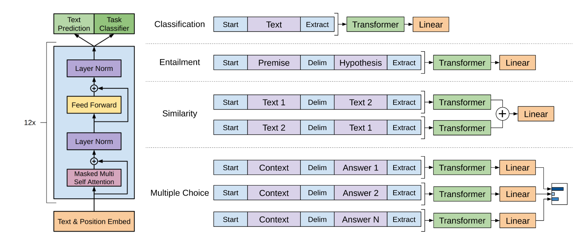
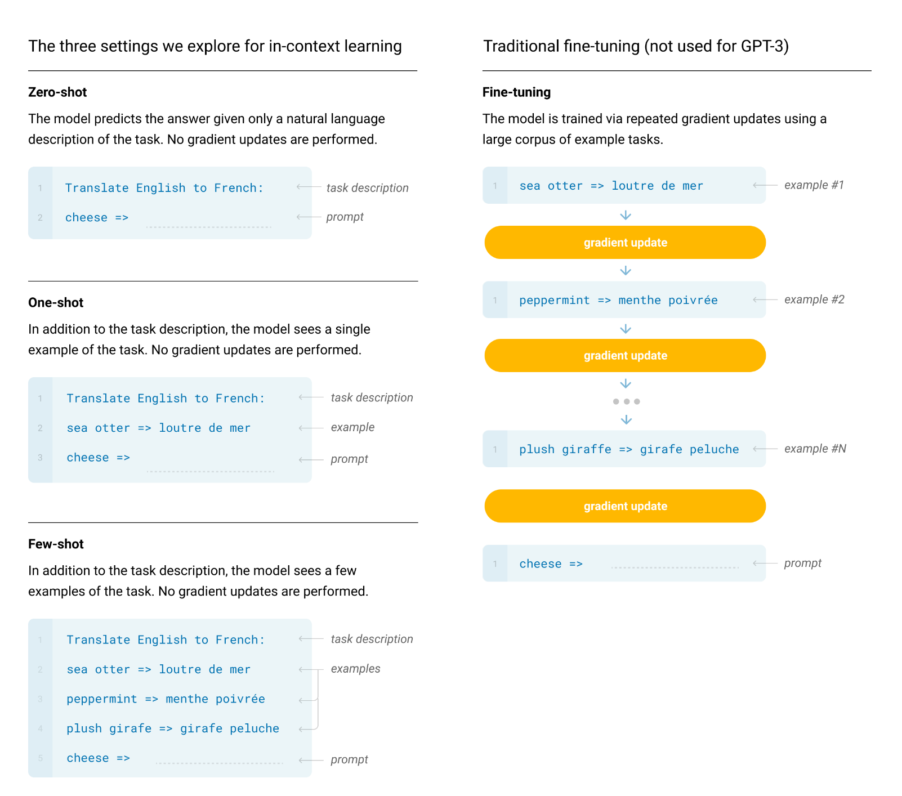
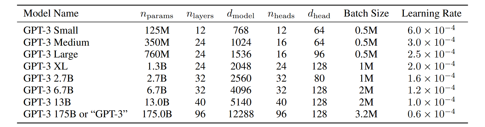

## GPT-1

### 出发点

目前尚不清楚哪种类型的优化目标最有效地学习对迁移有效的文本表示（个人理解对于不同的NLP任务，不知道哪种优化目标是最好的）

### 方法

- 半监督的方法
- Transformer（用于处理长期依赖性的更多结构化记忆）--> 强大的迁移性能🔤

#### 1. 非监督预训练（Unsupervised pre-training）

- **优化目标：**

    给定一组 unsupervised corpus of tokens $U = \\{u_1, \cdots , u_n\\}$

    $$
    L_1(U) = \sum_i \log{P(u_i | u_{i-k}, \cdots, u_{i-1}; \Theta)}, i \in \{1,\cdots, n\}
    $$

    - k是上下文窗口的大小，使用具有参数$θ$的神经网络对条件概率$P$进行建模；
    - 这里的 $P(u_i | u_{i-k}, \cdots, u_{i-1}; \Theta)$ 指的是已知模型参数$θ$与前 n 个token的情况下，预测出第 i 个token的概率

    由于GPT使用的是非监督预训练方法，在给定一段文本中的 k 个token时，就是要让模型顺利的预测出第 i 个token。因此将每个token的预测概率 $P(u_i | u_{i-k}, \cdots, u_{i-1}; \Theta)$ 求和并最大化，就是该模型的优化目标，该目标适用于任何任务。（解决出发点问题）

- **模型架构：**

    multi-layer Transformer decoder

    $$
    \begin{aligned}
    h_0 &= UW_e + W_p \\\\
    h_i &= \text{transformer block}(h_{i-1}) \\\\
    P(u) &= \text{softmax}(h_n W_e^T)
    \end{aligned}
    $$

    - We is the token embedding matrix

    - Wp is the position embedding matrix

####  2. 基于监督的微调（Supervised fine-tuning）

假设有一标注过的数据集，其包含：

- a sequence of input tokens, $x1, \cdots , xm$
- label $y$

获得最后一层Transformer块的激活层输出$h^m_l$

$$
P(y|x^1, \dots, x^m) = \text{softmax}(h_l^m W_y)
$$

$$
L_2(\hat{C}) = \sum_{(x, y)} \log P(y|x^1, \dots, x^m)
$$

和目标函数 L1 构造类似，不过是令预测标签概率最大

$$
L_3(\hat{C}) = L_2(\hat{C}) + \lambda * L_1(\hat{C})
$$

微调任务中的优化目标函数由L1和L2组成。

#### 3. 不同任务的输入构造（Task-specific input transformations）

  

简单讲讲相似度任务。由于GPT是单向的模型（Transformer是一个词一个词的生成的），所以在处理相似度任务时，Text 1 和 Text 2 的先后顺序很重要，可以按照不同的排列顺序排放，利用GPT计算相似度取平均相似度。

## GPT-2

### 出发点

创建Machine Learning系统的主要方法是收集一个用于训练的数据集，在某一特定领域使用某一特定数据集是导致模型缺乏泛化性能的主要原因。

### 方法

- Multitask learning 多任务学习 --> 语言模型可以在zero-shot设置中执行下游任务，在没有任何参数或架构修改的情况下
- pre-training + supervised finetuning
- 模型的优化目标为 p(output|input, task)，具体可以描述为 {task(视作prompt), input, output}：
    
    - 例1：a translation training example can be written as the sequence (translate to french, english text, french text)
    - 例2：reading comprehension training example can be written as (answer the question, document, question, answer)

#### 训练数据

- Reddit网站上至少包含 3 karma的文章，爬取了4500万个链接，最终获得800万个文件，包含40GB的文本内容

#### 模型

与GPT大致一致

## GPT-3

### 出发点

大多数语言模型在任务不可知的情况下，仍然需要特定于任务的数据集和特定于任务的微调

- 需要针对任务的、包含标注实例的大数据集
- 在微调数据集上的效果好并不代表模型的泛化性能良好

### 方法

meta-learning：训练一个泛化性不错的模型

in-context learning：在后续过程中，即使已知一些训练样本，也不更新模型权重（个人理解就是在提问过程中包含一些训练样本）：

- zero-shot
- one-shot
- few-shot

  

#### 模型及其架构

- 使用与GPT-2相同的模型和架​​构
- Sparse Transformer
- 8种不同尺寸

  

---

  
参考文献

  <ol>
    <li><a href="https://www.bilibili.com/video/BV1AF411b7xQ?spm_id_from=333.788.videopod.sections&vd_source=9e4f1724ef60547fa31e3c8270245ff8" target="_blank">GPT，GPT-2，GPT-3 论文精读【论文精读】</a></li>
    <li><a href="https://www.mikecaptain.com/resources/pdf/GPT-1.pdf" target="_blank">Improving language understanding by generative pre-training</a></li>
    <li><a href="https://storage.prod.researchhub.com/uploads/papers/2020/06/01/language-models.pdf" target="_blank">Language models are unsupervised multitask learners</a></li>
    <li><a href="https://www.mikecaptain.com/resources/pdf/GPT-3.pdf" target="_blank">Language Models are Few-Shot Learners</a></li>
  </ol>

