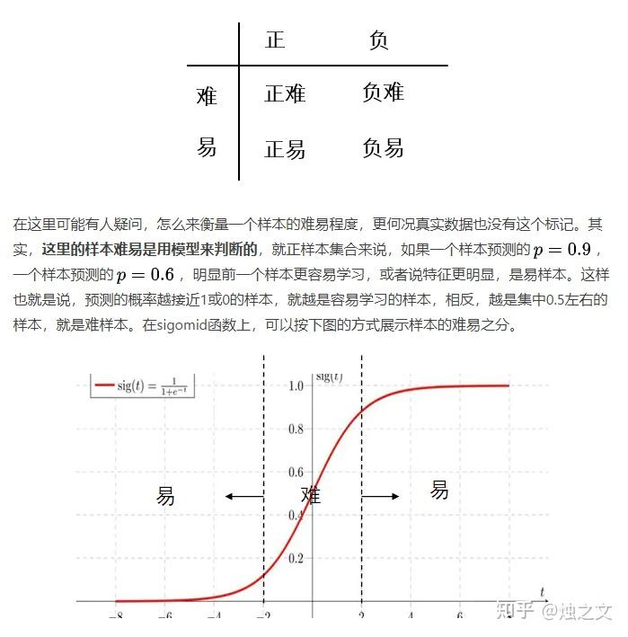
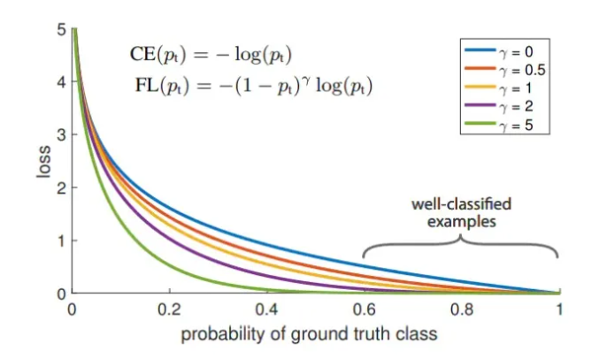

## Loss functions for classification

### Cross Entropy

$$
\text{H}_p(q) = \sum_x q(x) \log_2(\frac{1}{p(x)}) = - \sum_x q(x) \log_2(p(x))
$$

Cross entropy provides a way to measure the difference between two probability distributions. The more different $p$ and $q$ are, the larger the cross entropy of $p$ with respect to $q$ becomes compared to the entropy of $p$.

In practice:

$$
\text{L} = - \sum_x q(y|x) \log_2(p(y|x))
= - \frac{1}{N} \sum_x \sum_c y_{xc} \log_2(p(y_c|x))
$$

where $N$ is the number of samples, $x$ is a sample, $c$ is the class index, and $y_{xc}$ is the one-hot label for sample $x$.
Only when $c$ matches the ground-truth class $\hat{c}$ do we have $y_{x\hat{c}} = 1$ (i.e., $q(y_{\hat{c}}|x)=1/N$); otherwise $y_{xc}=0$.

Example:

| Prediction (after softmax) | Ground truth |
|:--------------------------:|:------------:|
| [0.1, 0.2, 0.7] | [0, 0, 1] |
| [0.3, 0.4, 0.3] | [0, 1, 0] |
| [0.1, 0.2, 0.7] | [1, 0, 0] |

Loss values:

$$
\text{sample 1 Loss} = - (0 \times \log{0.1} + 0 \times \log{0.2} + 1 \times \log{0.7}) = 0.36
$$

$$
\text{sample 2 Loss} = - (0 \times \log{0.3} + 1 \times \log{0.4} + 0 \times \log{0.3}) = 0.92
$$

$$
\text{sample 3 Loss} = - (1 \times \log{0.1} + 0 \times \log{0.2} + 0 \times \log{0.7}) = 2.30
$$

$$
\text{L} = \frac{0.36+0.92+2.3}{3} = 1.19
$$

### KL Divergence

$$
\text{D}_{\text{KL}}(q \| p) = - \sum_i q(x) \log_2(p(x)) + \sum_x p(x) \log_2(p(x)) = \text{H}_p(q) - \text{H}(p)
$$

This subtracts the entropy of $p$ from cross entropy, measuring the distance between two distributions.

In neural network training, $p$ is often the label distribution and $\text{H}(p)$ is constant, so KL divergence becomes equivalent to cross entropy. Cross entropy is used more widely because it avoids explicitly computing entropy and is simpler.

### Binary Cross Entropy

Model prediction:

$$
P_\theta(y=1)=\theta ~~~~~~~ P_\theta(y=0)=1 - \theta
$$

Combine the two:

$$
p_\theta(y) = \theta^y(1-\theta)^{(1-y)}
$$

The log-likelihood over $N$ data points:

$$
l(\theta) = \log \prod^N_{i=1} p_\theta(y_i) = \log \prod^N_{i=1}\theta^y(1-\theta)^{(1-y)} = \sum_{i=1}^N [y_i\log \theta + (1-y_i)\log(1-\theta)]
$$

This is exactly the cross entropy between $y_i$ and $\theta$, i.e., $H_y(\theta)$.

### Balanced Cross Entropy

To address **class imbalance**, we can add a weight to cross entropy. For binary classification, the BCE loss is:

$$
\text{L} = - \sum_{i=1}^N [y_i\log p + (1-y_i)\log(1-p)]
$$

Rewrite it as:

$$
\text{L} =
\begin{cases}
-\log(p) & \text{if}~y=1 \\
-\log(1-p) & \text{otherwise}
\end{cases}
$$

Define:

$$
p_t=
\begin{cases}
& p & \text{if}~y=1 \\
& 1-p & \text{otherwise}
\end{cases}
$$

so:

$$
\text{L} = -\log(p_t)
$$

Add a class weight:

$$
\text{L} = -\alpha_t\log(p_t)
$$

where $\alpha_t=\alpha$ when $y=1$, and $\alpha_t=1-\alpha$ when $y=0$.
If there are $n$ negative samples ($y=0$) and $m$ positive samples ($y=1$), then $\frac{\alpha}{1-\alpha}=\frac{n}{m}$.

Balanced cross entropy helps with imbalance, but not with easy vs hard examples. For that, see [Focal Loss](#focal-loss).



### Focal Loss

$$
\text{FL}(p_t) = (1-p_t)^\gamma\log(p_t)
$$

Here $p_t$ is the predicted probability of the ground-truth class.
Since $-\log(p_t)$ is the same as cross entropy, a smaller $p_t$ (worse prediction) increases $(1-p_t)^\gamma$, making the loss focus more on hard examples. In other words, focal loss increases the contribution of hard samples to both loss and gradients.



The earlier $\alpha_t$ term is a class weight. For imbalanced datasets, we usually assign a larger weight to the minority class. In multi-class problems, $\alpha_t$ is typically a **vector** of length equal to the number of classes; a common heuristic is to set it proportional to the inverse frequency of each class.

### Lovasz Loss

#### Deriving Lovasz Loss

IoU (intersection-over-union, also called the Jaccard index) is a common metric in segmentation. A natural question is: can we directly optimize IoU as a loss?

IoU definition:

$$
J_c(y^\*, \widetilde{y}) = \frac{ | \{ y^\* = c \} \cap \{ \widetilde{y} = c \} | }{ | \{ y^\* = c \} \cup \{ \widetilde{y} = c \} | }
$$

where $y^{*}$ is the ground-truth label, $\widetilde{y}$ is the prediction, and $\vert \cdot \vert$ is set cardinality.
Because $J_c$ is in $[0,1]$, we can define a discrete loss:

$$
\Delta_{J_c}(y^{\*},\widetilde{y})=1-J_c(y^{\*},\widetilde{y})
$$

But this loss is discrete and not directly differentiable. We need a **continuous extension**.

Rewrite $\Delta_{J_c}$ as:

$$
\Delta_{J_c} = 1-J_c(y^{\*},\widetilde{y}) = \frac{\vert M_c \vert}{\vert \{y^{\*}=c\} \cup M_c \vert} \tag{1}
$$

where
$M_c(y^{\*},\widetilde{y}) = \{y^{\*}=c,\widetilde{y}\neq c\} \cup \{y^{\*} \neq c,\widetilde{y}=c\}$
captures mismatched pixels between prediction and ground truth.
The domain of $M_c$ is $\{0,1\}^p$ (i.e., $M_c \in \{0,1\}^p$), where $p$ is the number of pixels.

Because (1) is a submodular function, we can apply a smooth extension.

**Definition 1** A set function $\Delta:\{0,1\}^p \rightarrow \mathbb{R}$ is **submodular** if for all sets $A,B \in \{0,1\}^p$:

$$
\Delta(A) + \Delta(B) \geq \Delta(A \cup B) + \Delta(A \cap B)
$$

**Definition 2** (**Lovasz extension**) Given a set function $\Delta:\{0,1\}^p \rightarrow \mathbb{R}$ with $\Delta(\pmb{0})=0$, its Lovasz extension is:

$$
\overline{\Delta} = \sum_{i=1}^p m_i g_i(\pmb{m}) \tag{2}
$$

$$
g_i(m) = \Delta(\{\pi_1,\cdots,\pi_i\}) - \Delta(\{\pi_1,\cdots,\pi_{i-1}\})
$$

Here $\pi$ is an index array obtained by sorting the elements of $\pmb{m}$ in descending order (e.g., $x_{\pi_1} \geq x_{\pi_2} \geq \cdots \geq x_{\pi_p}$).

Now $\overline{\Delta}$ becomes a continuous, piecewise-linear function. We can differentiate it w.r.t. the error vector $m$, and the derivative is $g(m)$.

#### Lovasz Loss for multi-class segmentation

Let $F_i(c)$ be the unnormalized score (logit) for pixel $i$ being class $c$. After softmax, the probability is:

$$
f_i(c) = \frac{e^{F_i(c)}}{\sum_{c' \in C} e^{F_i(c')}}
$$

Then the $m_i(c)$ in (2) can be defined as:

$$
m_i(c) = 
\begin{cases}
& 1-f_i(c) & \text{if}~c=y_i^{\*} \\
& f_i(c) & \text{otherwise}
\end{cases}
$$

The per-class loss:

$$
loss(\pmb{f}(c)) = \overline{\Delta_{J_c}}(\pmb{m}(c))
$$

And averaging over classes (consistent with mIoU):

$$
loss(\pmb{f}) = \frac{1}{\vert C \vert} \sum_{c \in C} \overline{\Delta_{J_c}}(\pmb{m}(c))
$$

#### Implementation sketch for multi-class Lovasz Loss

**Step 1** Compute prediction errors

``` py
signs = 2. * predictions.float() - 1.
errors = (1. - logits * Variable(signs))
errors_sorted, perm = torch.sort(errors, dim=0, descending=True)
```

This yields $m_i$ in (2).

**Step 2** Compute IoU (Jaccard) curve

``` py
gts = gt_sorted.sum()
intersection = gts - gt_sorted.float().cumsum(0)
union = gts + (1 - gt_sorted).float().cumsum(0)
jaccard = 1. - intersection / union
```

This corresponds to (1), i.e., the IoU curve.

**Step 3** Convert IoU curve into Lovasz gradient

``` py
jaccard[1:p] = jaccard[1:p] - jaccard[0:-1]
```

This yields $g_i(\pmb{m})$ in (2).

**Step 4** Compute the final loss

``` py
loss = torch.dot(F.relu(errors_sorted), Variable(grad))
```

This corresponds to the Lovasz extension value in (2).
