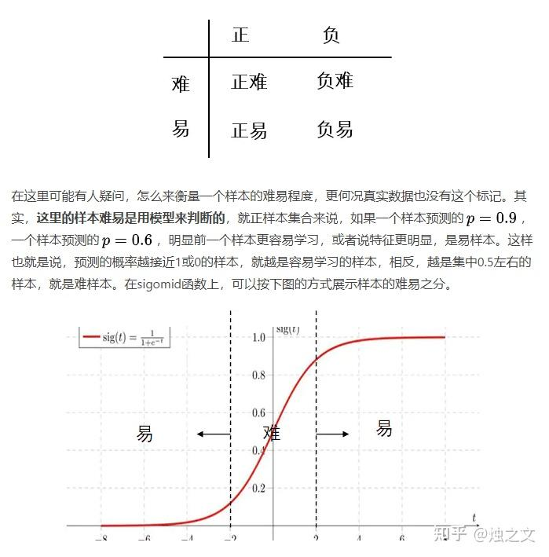

## 分类任务损失函数

### 交叉熵（Cross Entropy）

$$
\text{H}_p(q) = \sum_x q(x) \log_2(\frac{1}{p(x)}) = - \sum_x q(x) \log_2(p(x))
$$

交叉熵为我们提供了一种表达两种概率分布的差异的方法。p和q的分布越不相同，p相对于q的交叉熵将越大于p的熵。

在实际计算中，

$$
\text{L} = - \sum_x q(y|x) \log_2(p(y|x))
= - \frac{1}{N} \sum_x \sum_c y_{xc} \log_2(p(y_c|x))
$$

其中，$N$表示样本数量，$x$表示样本，$c$表示类别，$y_{xc}$表示类别为$c$时$x$的预测标签，只有$c$与真实标签的类别$\hat{c}$相同时，$y_{x\hat{c}} = 1$，即$q(y_{\hat{c}}|x)=1/N$，其余类别$y_{xc} = 0$，即$q(y_c|x)=0/N=0$。

举个例子，

| 预测（softmax归一化后） | 真实值 |
|:----------------------:|:-------:|
| [0.1, 0.2, 0.7] | [0, 0, 1] |
| [0.3, 0.4, 0.3] | [0, 1, 0] |
| [0.1, 0.2, 0.7] | [1, 0, 0] |

计算损失函数值：

$$
\text{sample 1 Loss} = - (0 \times \log{0.1} + 0 \times \log{0.2} + 1 \times \log{0.7}) = 0.36
$$

$$
\text{sample 2 Loss} = - (0 \times \log{0.3} + 1 \times \log{0.4} + 0 \times \log{0.3}) = 0.92
$$

$$
\text{sample 3 Loss} = - (1 \times \log{0.1} + 0 \times \log{0.2} + 0 \times \log{0.7}) = 2.30
$$

$$
\text{L} = \frac{0.36+0.92+2.3}{3} = 1.19
$$


### KL 散度（KL Divergence）

$$
\text{D}_{\text{KL}}(q \| p) = - \sum_i q(x) \log_2(p(x)) + \sum_x p(x) \log_2(p(x)) = \text{H}_p(q) - \text{H}(p)
$$

在交叉熵的基础上减去了p的熵，衡量了两个分布之间的距离。

在神经网络的训练当中，由于p往往是标签的分布，p的熵值是确定的。所以KL散度和交叉熵是等价的。但是由于交叉熵不惜要计算信息熵，计算更加简单，所以交叉熵使用更加广泛。

### 二值交叉熵（Binary Cross Entropy）

模型预测结果：

$$
P_\theta(y=1)=\theta ~~~~~~~ P_\theta(y=0)=1 - \theta
$$

合并上面两个式子，得到：

$$
p_\theta(y) = \theta^y(1-\theta)^{(1-y)}
$$

观测到这些数据点的对数似然为：

$$
l(\theta) = \log \prod^N_{i=1} p_\theta(y_i) = \log \prod^N_{i=1}\theta^y(1-\theta)^{(1-y)} = \sum_{i=1}^N [y_i\log \theta + (1-y_i)\log(1-\theta)]
$$

这个损失函数就是$y_i$与$\theta$的交叉熵$H_y(\theta)$。

### 平衡交叉熵（Balenced Cross Entropy）

为了解决**样本数量不平衡**这个问题，我们可以选择给Cross Entropy添加权重。以二分类问题举例，[Binary Cross Entropy](#二值交叉熵binary-cross-entropy)已经介绍过Binary Cross Entropy：

$$
\text{L} = - \sum_{i=1}^N [y_i\log p + (1-y_i)\log(1-p)]
$$

改写一下，

$$
\text{L} =
\begin{cases}
-\log(p) & \text{if}~y=1 \\\\
-\log(1-p) & \text{otherwise}
\end{cases}
$$

再改写一下，

$$
p_t=
\begin{cases}
& p & \text{if}~y=1 \\\\
& 1-p & \text{otherwise}
\end{cases}
$$

$$
\text{L} = -\log(p_t)
$$

添加权重，

$$
\text{L} = -\alpha_t\log(p_t)
$$

其中$y=1$时$\alpha_t=\alpha$；$y=0$时$\alpha_t=1-\alpha$。$\frac{\alpha}{1-\alpha}=\frac{n}{m}$，$n$为$y=0$的样本（负样本）个数，$m$为$y=1$的样本（正样本）个数。

Balenced Cross Entropy确实解决了样本不均衡问题，但并未解决样本难易问题。为解决这个问题，详见[Focal Loss](#focal-loss).



### Focal Loss

$$
\text{FL}(p_t) = (1-p_t)^\gamma\log(p_t)
$$

$p_t$是模型预测的结果的类别概率值。$−\log(p_t)$和交叉熵损失函数一致，因此当前样本类别对应的那个$p_t$如果越小，说明预测越不准确，那么$(1-p_t)^{\gamma}$这一项就会增大，这一项也作为困难样本的系数，预测越不准，Focal Loss越倾向于把这个样本当作困难样本，这个系数也就越大，目的是让困难样本对损失和梯度的贡献更大。


前面的$\alpha_t$是类别权重系数。如果你有一个类别不平衡的数据集，那么你肯定想对数量少的那一类在loss贡献上赋予一个高权重，这个$\alpha_t$就起到这样的作用。因此，$\alpha_t$应该是一个**向量**，向量的长度等于类别的个数，用于存放各个类别的权重。一般来说$\alpha_t$中的值为**每一个类别样本数量的倒数**，相当于平衡样本的数量差距


### Lovasz Loss

#### Lovasz Loss的推导

IoU (intersection-over-union，也叫jaccard index)是自然图像分割比赛中常用的一个衡量分割效果的评价指标，所以一个自然的想法就是能否将IoU作为loss function来直接优化。交并比公式：

$$
J_c(y^\*, \widetilde{y}) = \frac{ | \{ y^\* = c \} \cap \{ \widetilde{y} = c \} | }{ | \{ y^\* = c \} \cup \{ \widetilde{y} = c \} | }
$$

其中$y^{*}$表示Ground Truth标签，$\widetilde{y}$表示预测标签，$\vert \cdot \vert$表示集合中的元素个数。可以看出上式的值是介于0到1之间的，由此可以设计出损失函数：

$$
\Delta_{J_c}(y^{\*},\widetilde{y})=1-J_c(y^{\*},\widetilde{y})
$$

这个损失函数是离散的，无法直接求导，需要对其做**光滑延拓**。

改写一下$\Delta_{J_c}$,

$$
\Delta_{J_c} = 1-J_c(y^{\*},\widetilde{y}) = \frac{\vert M_c \vert}{\vert \{y^{\*}=c\} \cup M_c \vert} \tag{1}
$$

其中，$M_c(y^{\*},\widetilde{y}) = \{y^{\*}=c,\widetilde{y}\neq c\} \cup \{y^{\*} \neq c,\widetilde{y}=c\}$，$M_c$是损失函数的自变量，它表达网络分割结果与Ground Truth标签不匹配的集合。$M_c$的定义域为$\{0,1\}^p$，即$M_c \in \{0,1\}^p$，$p$表示集合$M_c$中像素的个数。

由于(1)是次模（submodular）函数，故可以对其做**光滑延拓**。


**定义1** 若一个集合函数$\Delta:\{0,1\}^p \rightarrow \mathbb{R}$对于所有的集合$A,B \in \{0,1\}^p$满足

$$
\Delta(A) + \Delta(B) \geq \Delta(A \cup B) + \Delta(A \cap B)
$$

则我们称$\Delta$是**次模函数**。

**定义2** **Lovasz extension** 现存在一集合函数$\Delta:\{0,1\}^p \rightarrow \mathbb{R}$且$\Delta(\pmb{0})=0$，则其Lovasz extension为

$$
\overline{\Delta} = \sum_{i=1}^p m_i g_i(\pmb{m}) \tag{2}
$$

$$
g_i(m) = \Delta(\{\pi_1,\cdots,\pi_i\}) - \Delta(\{\pi_1,\cdots,\pi_{i-1}\})
$$

$\pi$是一个数组，根据元素$\pmb{m}$降序排序。例如，$x_{\pi_1} \geq x_{\pi_2} \geq \cdots \geq x_{\pi_p}$。

此时$\overline{\Delta}$已经是一个连续、分段线性的函数了，可以直接对误差$m$求导，导数为$g(m)$。

#### Lovasz Loss在多类分割中的应用

假设$F_i(c)$表示的是模型最后输出的像素$i$预测为类别$c$的非归一化分数，则可以通过softmax函数将$F_i(c)$归一化得到像素$i$预测为类别$c$的概率：

$$
f_i(c) = \frac{e^{F_i(c)}}{\sum_{c' \in C} e^{F_i(c')}}
$$

那么(2)中的$m_i(c)$可以定义为

$$
m_i(c) = 
\begin{cases}
& 1-f_i(c) & \text{if}~c=y_i^{\*} \\\\
& f_i(c) & \text{otherwise}
\end{cases}
$$

那么损失函数为

$$
loss(\pmb{f}(c)) = \overline{\Delta_{J_c}}(\pmb{m}(c))
$$

考虑到类别平均mIoU的计算方式，最终的损失函数为

$$
loss(\pmb{f}) = \frac{1}{\vert C \vert} \sum_{c \in C} \overline{\Delta_{J_c}}(\pmb{m}(c))
$$

#### Lovasz Loss在多类分割中的代码流程

**步骤1** 计算预测结果的误差

``` py
signs = 2. * predictions.float() - 1.
errors = (1. - logits * Variable(signs))
errors_sorted, perm = torch.sort(errors, dim=0, descending=True)
```

这一步得到公式(2)中的$m_i$。

**步骤2** 计算IoU得分

``` py
gts = gt_sorted.sum()
intersection = gts - gt_sorted.float().cumsum(0)
union = gts + (1 - gt_sorted).float().cumsum(0)
jaccard = 1. - intersection / union
```

这一步得到公式(1)的值，即IoU得分。

**步骤3** 根据IoU得分计算Lovasz extension的梯度

``` py
jaccard[1:p] = jaccard[1:p] - jaccard[0:-1]
```

这一步得到公式(2)中的$g_i(\pmb{m})$。

**步骤4** 计算Loss

``` py
loss = torch.dot(F.relu(errors_sorted), Variable(grad))
```

这一步得到公式(2)的值。