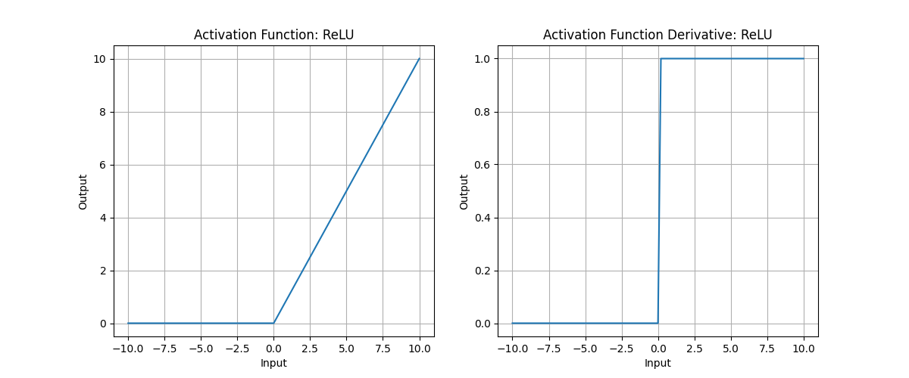
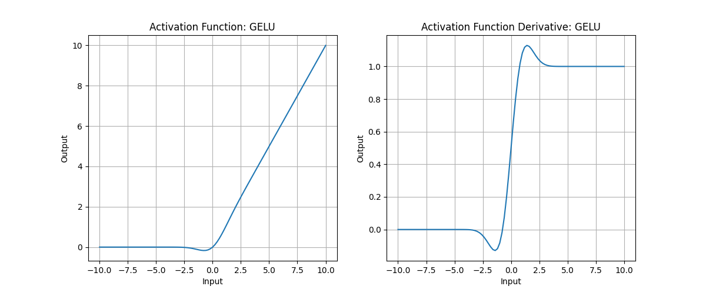
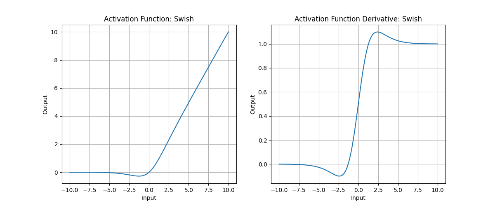

### ReLU

$$
\text{ReLU}(x) = \max(0, x)
$$



---

### GELU (Gaussian Error Linear Unit)

$$
\text{GELU}(x) = x \cdot \Phi(x)
$$

$\Phi(x)$ is the cumulative distribution function (CDF) of the standard normal distribution:

$$
\Phi(x) = \frac{1}{2}[1+\text{erf}(\frac{x}{\sqrt{2}})]
$$

$\text{erf}$ is the Gauss error function. Therefore, GELU can be written as

$$
\text{GELU}(x) = \frac{x}{2}[1+\text{erf}(\frac{x}{\sqrt{2}})]
$$

It is commonly approximated by

$$
\text{GELU}(x) = 0.5x(1+\tanh(\sqrt{\frac{2}{\pi}}(x+0.044715x^3)))
$$



#### Intuition

GELU can be understood as:
> Instead of “hard-clipping” negative inputs to 0 like ReLU, it uses a probability-weighted gate so the output transitions smoothly.

In other words, it passes the input $x$ through a “Gaussian gate”:
- When $x$ is large, $\Phi(x) \approx 1$, so the output is $\approx x$
- When $x$ is very negative, $\Phi(x) \approx 0$, so the output is $\approx 0$
- Near $x=0$, $\Phi(x)$ smoothly transitions between 0 and 1

So GELU is “softer” than ReLU and can retain some information from negative inputs.

#### Advantages

1. **Smooth derivative**: the derivative of GELU is continuous, which often helps gradient flow and avoids the non-differentiability of ReLU at $x=0$.
2. **Strong empirical performance**: GELU is widely used in NLP and vision models and often improves results compared to ReLU.
3. **Potentially faster convergence**: the smooth nonlinearity can make optimization more stable.

---

### Swish

$$
\text{Swish}(x) = x \cdot \sigma(x) = \frac{x}{1 + e^{-x}}
$$

The derivative is smooth and behaves like a gate.



Swish can be adjusted with a smoothing parameter $\beta$:

$$
\text{Swish}(x) = x \cdot \sigma(\beta x) = \frac{x}{1 + e^{-\beta x}}
$$

---

### GLU(Gated Linear Unit)

$$
\begin{align}
[x_1,x_2]&=xW+b \\\\
\text{GLU}(x_1, x_2) &= x_1 \odot \sigma(x_2)
\end{align}
$$

Where:
- The input $x$ is projected (or convolved) and split into two parts $x_1, x_2$.
- $\sigma$ is the sigmoid function, acting as a gate.
- $\odot$ denotes element-wise multiplication (Hadamard product).
- $x_1$ is the content stream and $x_2$ is the control/gating stream.

#### Intuition: content stream + control stream

For a plain linear layer:

$$
y=xW+b
$$

All inputs are treated uniformly.

In GLU, we add a **learnable gate** to dynamically modulate the content stream:

$$
y=content \times gate
$$

- If $\sigma(x_2)$ is close to 1, the content $x_1$ passes through.
- If $\sigma(x_2)$ is close to 0, the content $x_1$ is suppressed.
- For intermediate values, the content is partially passed.

You can think of it as:
> GLU adds a learnable “switch” that controls how strongly information flows.

#### Code

```python
import torch
import torch.nn.functional as F

def GLU(x):
    x1, x2 = x.chunk(2, dim=-1)
    return x1 * torch.sigmoid(x2)
```

#### Advantages

1. Selective information flow: the gate learns which features should pass.
2. Better gradient behavior: sigmoid has non-zero derivative in many regions.
3. Improved interpretability: gate values (often in $[0,1]$) can be visualized as importance weights.

---

### ReGLU(ReLU-GLU)

$$
\text{ReGLU}(x) = x_1 \odot \text{ReLU}(x_2)
$$

This makes the gating sparse and can be cheaper to compute.

```python
import torch 
from torch import nn


class ReGLU(nn.Module):
    def __init__(self, d_in, d_out):
        super().__init__()
        self.w_gate = nn.Linear(d_in, d_out, bias=False)
        self.w_up   = nn.Linear(d_in, d_out, bias=False)
        self.w_down = nn.Linear(d_out, d_in, bias=False)

    def forward(self, x):
        gate = F.relu(self.w_gate(x))
        up   = self.w_up(x)
        return self.w_down(gate * up)
```

---

### GEGLU(Gaussian Error GLU)

$$
\text{GEGLU}(x) = x_1 \odot \text{GELU}(x_2)
$$

This keeps the gating smooth while preserving the GLU structure.

```python
import torch 
from torch import nn

class GEGLU(nn.Module):
    def __init__(self, d_in, d_out):
        super().__init__()
        self.w_gate = nn.Linear(d_in, d_out, bias=False)
        self.w_up   = nn.Linear(d_in, d_out, bias=False)
        self.w_down = nn.Linear(d_out, d_in, bias=False)

    def forward(self, x):
        gate = F.gelu(self.w_gate(x))
        up   = self.w_up(x)
        return self.w_down(gate * up)
```

---

### SwiGLU(Swish-GLU)

$$
\text{SwiGLU}(x) = x_1 \odot \text{Swish}(x_2)
$$

```python
import torch
from torch import nn

class SwiGLU(nn.Module):
    def __init__(self, d_in, d_out, beta=1.0):
        super().__init__()
        self.beta   = beta
        self.w_gate = nn.Linear(d_in, d_out, bias=False)
        self.w_up   = nn.Linear(d_in, d_out, bias=False)
        self.w_down = nn.Linear(d_out, d_in, bias=False)

    def forward(self, x):
        gate = self.w_gate(x)
        gate = gate * torch.sigmoid(self.beta * gate)   # Swish
        up   = self.w_up(x)
        return self.w_down(gate * up)
```