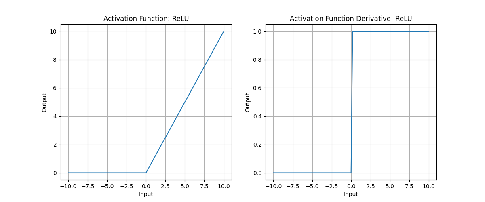
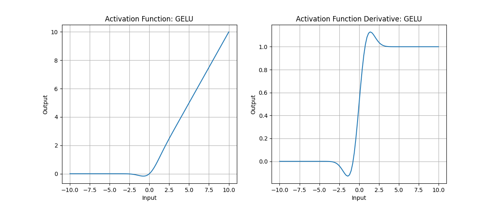
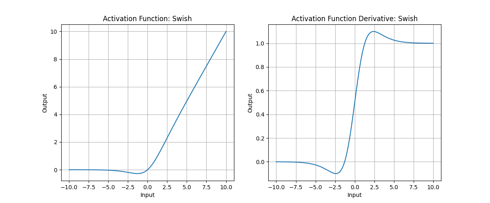

### ReLU

$$
\text{ReLU}(x) = \max(0, x)
$$



---

### GELU(Gaussian Error Linear Unit)

$$
\text{GELU}(x) = x \cdot \Phi(x)
$$

其中$\Phi(x)$是标准正态分布的累积分布函数（CDF）：

$$
\Phi(x) = \frac{1}{2}[1+\text{erf}(\frac{x}{\sqrt{2}})]
$$

其中$\text{erf}$是高斯误差函数（error function），因此GELU可写为

$$
\text{GELU}(x) = \frac{x}{2}[1+\text{erf}(\frac{x}{\sqrt{2}})]
$$

可近似为

$$
\text{GELU}(x) = 0.5x(1+\tanh(\sqrt{\frac{2}{\pi}}(x+0.044715x^3)))
$$



#### 直觉理解

GELU 的思想是：
> 不再像 ReLU 一样“硬地”把负数截为 0，而是用一个概率加权的方式，让输出平滑地过渡。

也就是说，它让输入 $x$ 通过一个“高斯门控”：
- 当 $x$ 很大时，$\Phi(x) \approx 1$，输出 $\approx x$ 
- 当 $x$ 很小时，$\Phi(x) \approx 0$，输出 $\approx 0$ 
- $x$ 接近 0 时，$\Phi(x)$ 在 0 和 1 之间平滑变化

→ 所以 GELU 比 ReLU 更“柔和”，能保留一些负数输入的信息

#### 优点

1. **具有更光滑的导数**：GELU函数的导数是连续的，这使得在训练深度神经网络时可以更容易地传播梯度，避免了ReLU函数在$x=0$处的导数不连续的问题，从而减少了训练过程中出现的梯度消失问题
2. **可以提高模型的性能**：在实际任务中，使用GELU函数的模型通常比使用ReLU函数的模型表现更好，尤其是在自然语言处理和计算机视觉任务中
3. **可以加速收敛**：GELU函数在激活函数的非线性变换中引入了类似于sigmoid函数的变换，这使得GELU函数的输出可以落在一个更广的范围内，有助于加速模型的收敛速度

---

### Swish

$$
\text{Swish}(x) = x \cdot \sigma(x) = \frac{x}{1 + e^{-x}}
$$

导数平滑，类似于门控



Swish可以通过参数$\beta$进行平滑调整

$$
\text{Swish}(x) = x \cdot \sigma(\beta x) = \frac{x}{1 + e^{-\beta x}}
$$

---

### GLU(Gated Linear Unit)

$$
\begin{align}
[x_1,x_2]&=xW+b \\\\
\text{GLU}(x_1, x_2) &= x_1 \odot \sigma(x_2)
\end{align}
$$

其中：
- 输入$x$经线性映射（或卷积）被拆分成两个部分 $x_1, x_2$；
- $\sigma$ 是 Sigmoid 函数，作为“门控函数”；
- $\odot$ 表示逐元素相乘（Hadamard product）；
- 第一部分 $x_1$ 是“信息流（content）”，第二部分 $x_2$ 是“控制流（gate）”

#### 直觉理解：信息流 + 控制流

普通的线性层输出：

$$
y=xW+b
$$

所有输入都被同等处理

而在 GLU 中，我们为信息流加了一个**动态调节门**：

$$
y=content \times gate
$$

- 当 $\sigma(x_2)$ 接近 1 → 内容 $x_1$ 完全通过；
- 当 $\sigma(x_2)$ 接近 0 → 内容 $x_1$ 被抑制；
- 当 $\sigma(x_2)$ 在中间值 → 内容部分通过

可以理解为：
> GLU 给神经网络每个神经元加上了一个“可学习的开关”，让模型能控制信息在不同路径上的流动强弱

#### 代码

```python
import torch
import torch.nn.functional as F

def GLU(x):
    x1, x2 = x.chunk(2, dim=-1)
    return x1 * torch.sigmoid(x2)
```

#### 优点

1. 选择性信息传递：门可以学习“该让哪些特征通过、哪些被压制”，这提高了模型的表达灵活性
2. 缓解梯度消失 / 饱和：Sigmoid 的导数非零，使得梯度能在负区间流动
3. 模型可解释性更强：门值（通常介于 0~1 之间）可以理解为“注意力权重”，可视化后能显示模型关注哪些通道或特征

---

### ReGLU(ReLU-GLU)

$$
\text{ReGLU}(x) = x_1 \odot \text{ReLU}(x_2)
$$

使得门控具备稀疏性，计算更便宜

```python
import torch 
from torch import nn


class ReGLU(nn.Module):
    def __init__(self, d_in, d_out):
        super().__init__()
        self.w_gate = nn.Linear(d_in, d_out, bias=False)
        self.w_up   = nn.Linear(d_in, d_out, bias=False)
        self.w_down = nn.Linear(d_out, d_in, bias=False)

    def forward(self, x):
        gate = F.relu(self.w_gate(x))
        up   = self.w_up(x)
        return self.w_down(gate * up)
```

---

### GEGLU(Gaussian Error GLU)

$$
\text{GEGLU}(x) = x_1 \odot \text{GELU}(x_2)
$$

兼顾稀疏与平滑

```python
import torch 
from torch import nn

class GEGLU(nn.Module):
    def __init__(self, d_in, d_out):
        super().__init__()
        self.w_gate = nn.Linear(d_in, d_out, bias=False)
        self.w_up   = nn.Linear(d_in, d_out, bias=False)
        self.w_down = nn.Linear(d_out, d_in, bias=False)

    def forward(self, x):
        gate = F.gelu(self.w_gate(x))
        up   = self.w_up(x)
        return self.w_down(gate * up)
```

---

### SwiGLU(Swish-GLU)

$$
\text{SwiGLU}(x) = x_1 \odot \text{Swish}(x_2)
$$

```python
import troch
from torch import nn

class SwiGLU(nn.Module):
    def __init__(self, d_in, d_out, beta=1.0):
        super().__init__()
        self.beta   = beta
        self.w_gate = nn.Linear(d_in, d_out, bias=False)
        self.w_up   = nn.Linear(d_in, d_out, bias=False)
        self.w_down = nn.Linear(d_out, d_in, bias=False)

    def forward(self, x):
        gate = self.w_gate(x)
        gate = gate * torch.sigmoid(self.beta * gate)   # Swish
        up   = self.w_up(x)
        return self.w_down(gate * up)
```