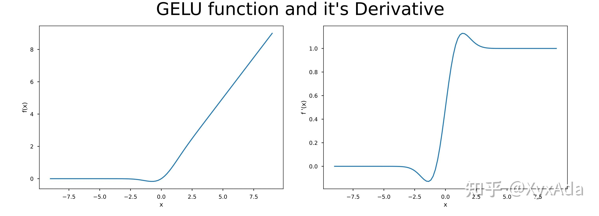

### GELU

$$
\text{GELU}(x) = 0.5x(1+\tanh(\sqrt{\frac{2}{\pi}}(x+0.044715x^3)))
$$

#### 优点

1. **具有更光滑的导数**：GELU函数的导数是连续的，这使得在训练深度神经网络时可以更容易地传播梯度，避免了ReLU函数在$x=0$处的导数不连续的问题，从而减少了训练过程中出现的梯度消失问题。
2. **可以提高模型的性能**：在实际任务中，使用GELU函数的模型通常比使用ReLU函数的模型表现更好，尤其是在自然语言处理和计算机视觉任务中。
2. **可以加速收敛**：GELU函数在激活函数的非线性变换中引入了类似于sigmoid函数的变换，这使得GELU函数的输出可以落在一个更广的范围内，有助于加速模型的收敛速度。