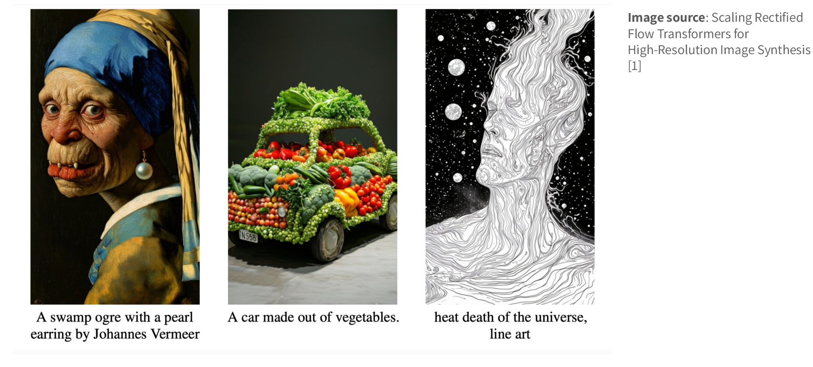
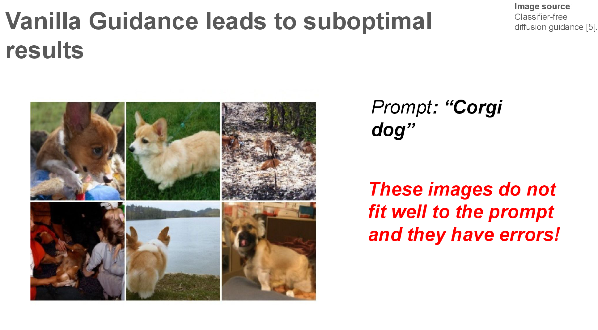
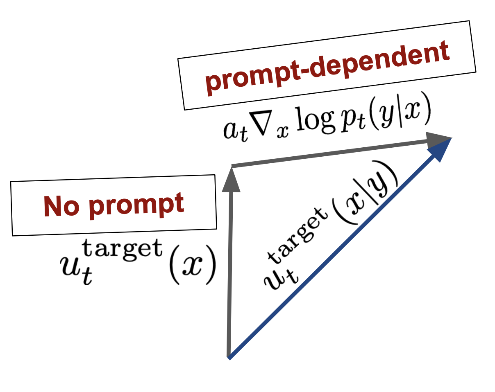
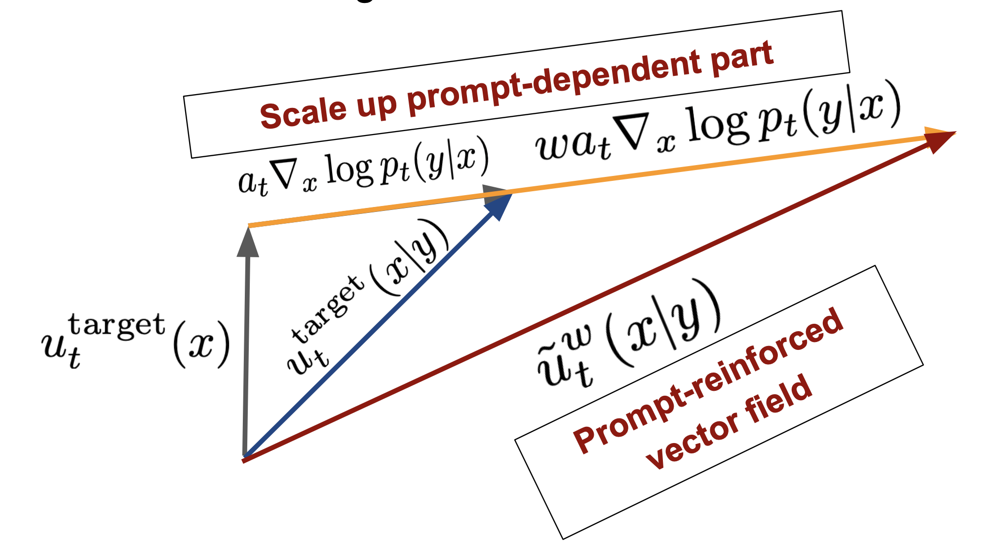
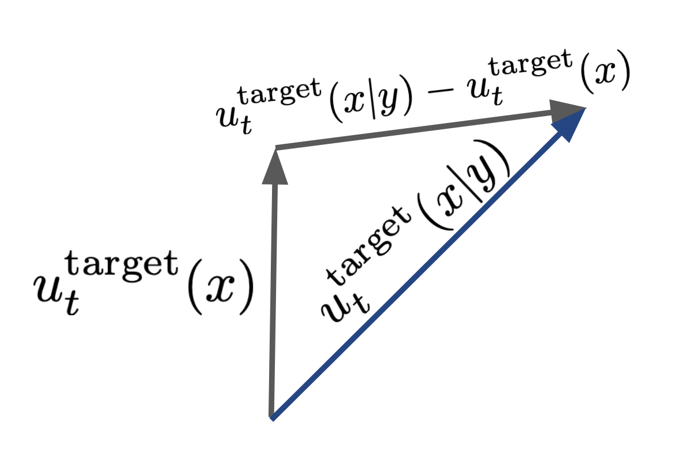
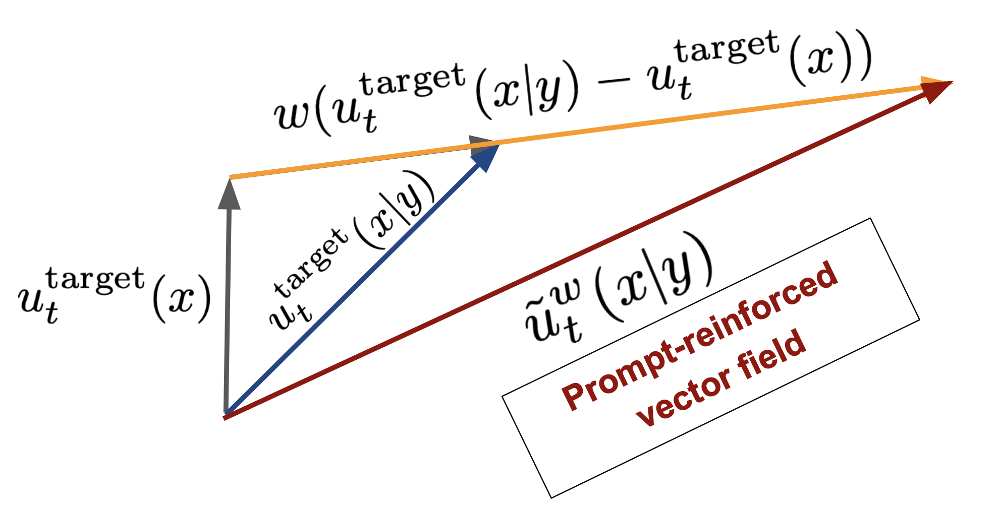
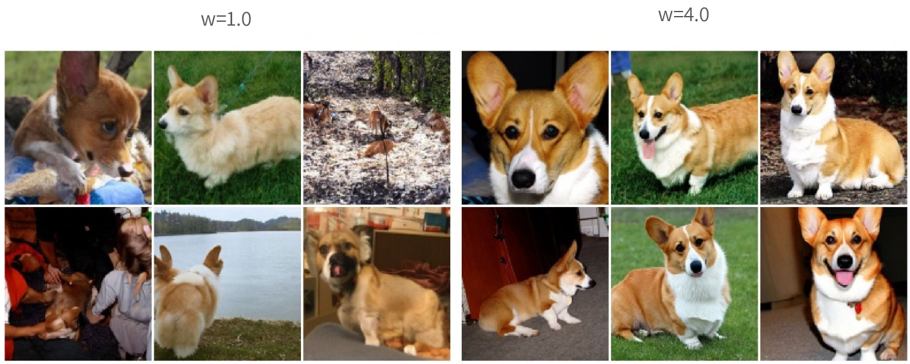
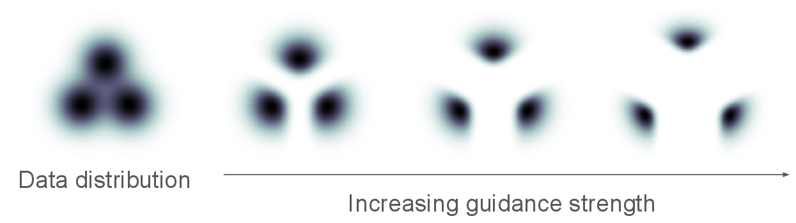

## 1. Guided generation: Controlling samples with conditions

Unguided generation only asks the model to produce a sample, without specifying its content. For example, the prompt can be “Generate an image.” Guided generation additionally provides a condition \(y\), steering the generation process toward a desired result. With the prompt “Generate an image of a cat baking a cake,” the model must satisfy this semantic condition while generating the image.

- **Unguided**: “Generate an image.”
- **Guided**: “Generate an image of a cat baking a cake.”

Figure 1: Examples of unguided and guided generation. Figure source: MIT 6.S184 Lecture 3; example images from *Scaling Rectified Flow Transformers for High-Resolution Image Synthesis*.

## 2. Vanilla guided sampling: Integrating a **Guided Vector Field**

During training, **sample a data sample and prompt pair** \((z,y)\sim p_{\mathrm{data}}\), where \(y\in\mathcal{Y}\) is the **prompt vector**. The model learns a **Guided Vector Field** \(u_t^{\theta}(x\mid y)\in\mathbb{R}^d\) by fitting the target vector field \(u_t^{\mathrm{target}}(x\mid z)\) with the **Guided Flow Matching Loss**:

\[
\begin{aligned}
\mathcal{L}_{\mathrm{CFM}}(\theta)
&= \mathbb{E}_{\substack{t\sim\operatorname{Unif}[0,1],\\(z,y)\sim p_{\mathrm{data}},\\x\sim p_t(\cdot\mid z)}}\left[
\left\lVert
u_t^{\theta}(x\mid y)-u_t^{\mathrm{target}}(x\mid z)
\right\rVert^2
\right].
\end{aligned}
\]

| **Algorithm 2** Vanilla Guided Sampling |
| --- |
| **Input**: a trained **Guided Vector Field** \(u_t^{\theta}(x\mid y)\) |
| 1: Select a prompt \(y\in\mathcal{Y}\), such as “a cat baking a cake.” |
| 2: Initialize \(X_0\sim p_{\mathrm{init}}\). |
| 3: Simulate \(dX_t=u_t^{\theta}(X_t\mid y)\,dt\) from \(t=0\) to \(t=1\). |

Vanilla guidance can produce suboptimal results. For the prompt “Corgi dog,” some generated images do not fit the prompt well and contain obvious errors.

Figure 2: Suboptimal results from vanilla guidance for the prompt “Corgi dog.” Figure source: MIT 6.S184 Lecture 3; examples from *Classifier-free diffusion guidance*.

## 3. Classifier guidance: Correcting the vector field with classifier gradients

Classifier guidance uses the gradient provided by a classifier \(p_t(y\mid x)\) to correct the generation direction. Its central result is to correct the unconditional **Guided Vector Field** with the classifier gradient:

\[
u_t^{\mathrm{target}}(x\mid y)
=\underbrace{u_t^{\mathrm{target}}(x)}_{\text{VF}}
+\underbrace{a_t\nabla_x\log p_t(y\mid x)}_{\text{classifier}}.
\]

Here, \(\nabla_x\log p_t(y\mid x)\) is the classifier gradient for condition \(y\) at the current sample \(x\), and \(a_t\) controls the strength of the classifier-gradient correction. A **classifier** is a model that takes an image \(x\) as input and outputs its label \(y\), thereby estimating \(p_t(y\mid x)\).

Derivation: From Bayes' rule to the guided vector field

By Bayes' rule,

\[
p_t(x\mid y)=\frac{p_t(y\mid x)p_t(x)}{p_t(y)}.
\]

Because \(p_t(y)\) is independent of \(x\), taking the gradient with respect to \(x\) gives

\[
\begin{aligned}
\nabla_x\log p_t(x\mid y)
&= \nabla_x\log p_t(x)+\nabla_x\log p_t(y\mid x).
\end{aligned}
\]

Write the vector field in terms of the score function. Let \(a_t\) be the coefficient of the score term and let \(b_t x\) denote the part independent of the condition \(y\):

\[
\begin{aligned}
u_t^{\mathrm{target}}(x\mid y)
&=a_t\nabla_x\log p_t(x\mid y)+b_t x,\\
u_t^{\mathrm{target}}(x)
&=a_t\nabla_x\log p_t(x)+b_t x.
\end{aligned}
\]

Substituting the conditional-score decomposition into the first equation gives

\[
\begin{aligned}
u_t^{\mathrm{target}}(x\mid y)
&=a_t\left[
\nabla_x\log p_t(x)+\nabla_x\log p_t(y\mid x)
\right]+b_t x\\
&=\left[a_t\nabla_x\log p_t(x)+b_t x\right]
+a_t\nabla_x\log p_t(y\mid x)\\
&=u_t^{\mathrm{target}}(x)+a_t\nabla_x\log p_t(y\mid x).
\end{aligned}
\]

Figure 3: The classifier gradient as the prompt-dependent component added to the no-prompt vector field. Figure source: MIT 6.S184 Lecture 3.

### 3.1. Reinforcing the classifier: Amplifying the classifier gradient

As the experimental results in Figure 2 show, vanilla guided sampling can produce poor samples. One idea is to reinforce the classifier. Given a weight \(w>1\), amplify the classifier-gradient term as

\[
u_t^{\mathrm{target}}(x\mid y)
=\underbrace{u_t^{\mathrm{target}}(x)}_{\text{VF}}
+\underbrace{w a_t\nabla_x\log p_t(y\mid x)}_{\text{classifier}}.
\]

Figure 4: Scaling up the prompt-dependent component to obtain a prompt-reinforced vector field. Figure source: MIT 6.S184 Lecture 3.

## 4. Classifier-free guidance: Amplifying the condition-dependent component

Classifier-free Guidance (CFG) strengthens the prompt by amplifying the condition-dependent component of the vector field. Given a weight \(w\ge 1\), its core formula is

\[
\widetilde{u}_t^{w}(x\mid y)
=w u_t^{\mathrm{target}}(x\mid y)
+(1-w)u_t^{\mathrm{target}}(x).
\]

This formula linearly combines the conditional and unconditional vector fields, with \(w\) controlling the strength of the condition. The derivation is as follows:

Derivation: Rewriting the classifier gradient as a difference of two vector fields

\[
\begin{aligned}
\widetilde{u}_t^{w}(x\mid y)
&=u_t^{\mathrm{target}}(x)
+w\left(
a_t\nabla_x\log p_t(x\mid y)
-a_t\nabla_x\log p_t(x)
\right)\\
&=u_t^{\mathrm{target}}(x)
+w\left(
u_t^{\mathrm{target}}(x\mid y)-u_t^{\mathrm{target}}(x)
\right)\\
&=w u_t^{\mathrm{target}}(x\mid y)
+(1-w)u_t^{\mathrm{target}}(x).
\end{aligned}
\]

### 4.1. Empty tokens: Replacing the unconditional vector field

In practice, an empty prompt \(\phi\) (Empty tokens) can be introduced, where \(\phi\) denotes a missing prompt. Use the vector field with the empty prompt, \(u_t^{\mathrm{target}}(x\mid\phi)\), to replace the unconditional vector field \(u_t^{\mathrm{target}}(x)\):

\[
u_t^{\mathrm{target}}(x)\ \longrightarrow\ u_t^{\mathrm{target}}(x\mid\phi).
\]

Figure 5: Classifier-free guidance using the vector field with an empty prompt in place of the unconditional vector field. Figure source: MIT 6.S184 Lecture 3.

Thus, classifier-free guidance can be written as

\[
\widetilde{u}_t^{w}(x\mid y)
=w u_t^{\mathrm{target}}(x\mid y)
+(1-w)u_t^{\mathrm{target}}(x\mid\phi).
\]

Figure 6: Scaling up the condition-dependent component to obtain a prompt-reinforced vector field. Figure source: MIT 6.S184 Lecture 3.

Consequently, classifier-free guidance only requires a conditional vector field and an unconditional vector field: the former uses the prompt \(y\), while the latter does not. Since \(w\ge 1\), the conditional vector field is amplified, and the coefficient of the unconditional vector field becomes \(1-w\).

### 4.2. Classifier-free guidance training: Randomly dropping the prompt

To train a classifier-free guidance model, the same network must learn both conditional and unconditional vector fields. The procedure randomly drops the prompt with a certain probability, replacing \(y\) with the empty prompt \(\phi\), and then trains the model with the same loss.

| **Algorithm 3** Classifier-free Guidance Training |
| --- |
| **Input**: paired dataset \((z,y)\sim p_{\mathrm{data}}\), neural vector field \(u_t^\theta\) |
| 1: **for** each mini-batch of data **do** |
| 2: \(\quad\)Sample a data example and prompt \((z,y)\) from the dataset |
| 3: \(\quad\)Sample a random time \(t\sim\operatorname{Unif}[0,1]\) |
| 4: \(\quad\)Sample noise \(\epsilon\sim\mathcal{N}(0,I_d)\) |
| 5: \(\quad\)Set \(x=\alpha_tz+\beta_t\epsilon\) |
| 6: \(\quad\)With probability \(p\), drop the prompt: \(y\leftarrow\phi\) |
| 7: \(\quad\)Compute \(\mathcal{L}(\theta)=\left\lVert u_t^\theta(x\mid y)-u_t^{\mathrm{target}}(x\mid z)\right\rVert^2\) |
| 8: \(\quad\)Update the model parameters \(\theta\) via gradient descent on \(\mathcal{L}(\theta)\) |
| 9: **end for** |

Randomly dropping the prompt exposes the model to the empty prompt during training, so \(u_t^\theta(x\mid\phi)\) can approximate the unconditional vector field at inference time.

### 4.3. Classifier-free guidance sampling: Using the weighted vector field

At sampling time, compute the vector field with the prompt \(y\) and with the empty prompt \(\phi\), then combine them with weights:

\[
u_t^{\theta,w}(x)
=(1-w)u_t^\theta(x\mid\phi)+w u_t^\theta(x\mid y).
\]

| **Algorithm 4** Classifier-free Guidance Sampling |
| --- |
| **Input**: a trained guided vector field \(u_t^\theta(x\mid y)\) |
| 1: Select a prompt \(y\in\mathcal{Y}\); set \(y=\phi\) for unguided sampling |
| 2: Select a guidance scale \(w>1\) |
| 3: Initialize \(X_0\sim p_{\mathrm{init}}\) |
| 4: Simulate \(dX_t=\left[(1-w)u_t^\theta(X_t\mid\phi)+w u_t^\theta(X_t\mid y)\right]dt\) from \(t=0\) to \(t=1\) |

### 4.4. Guidance-scale example: Increasing \(w\) improves prompt consistency

When \(w\) increases from \(1.0\) to \(4.0\), the generated results become more consistent with the prompt “corgi dog.”

Figure 7: Comparison of generated results at different guidance scales. Figure source: MIT 6.S184 Lecture 3; examples from *Classifier-free diffusion guidance*.

### 4.5. Applications and limitation of CFG: Effective but heuristic

Classifier-free guidance has become a key component in image and video generation. Many practical generative systems rely on CFG to strengthen the prompt's control over the generated result. For example, Stable Diffusion 3 commonly uses a guidance scale of approximately \(w\approx 4.0\).

CFG is a technique driven by empirical results. Its performance is so effective that image-generation models can hardly do without it.

However, when \(w>1\), the weighted vector field

\[
u_t^{\theta,w}(x)
=(1-w)u_t^\theta(x\mid\phi)+w u_t^\theta(x\mid y)
\]

generally no longer corresponds to the vector field learned from the original data distribution. CFG pushes the sampling direction beyond the data distribution, so it is not a strict model of the original distribution but a heuristic. Its main justification is empirical: an appropriate guidance scale often improves prompt consistency, but it can also change the generation distribution.

Figure 8: As guidance strength increases, the sampling direction may move beyond the data distribution. Figure source: MIT 6.S184 Lecture 3; illustration from *Classifier-free diffusion guidance*.

## References

[1] P. Holderrieth and R. Shprints, "Score Matching and Guidance," MIT 6.S184 Lecture 3 slides, 2026. [Online]. Available: https://diffusion.csail.mit.edu/2026/docs/20260123_Lecture_03.pdf
