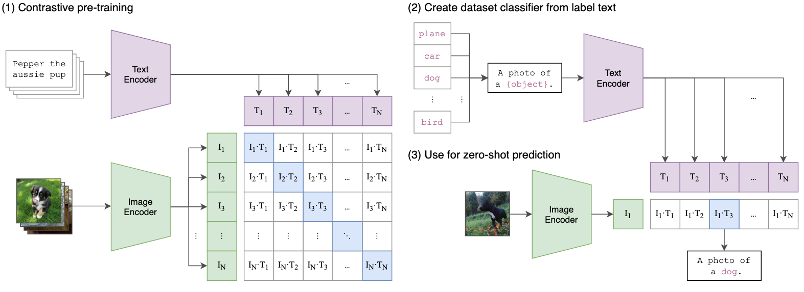
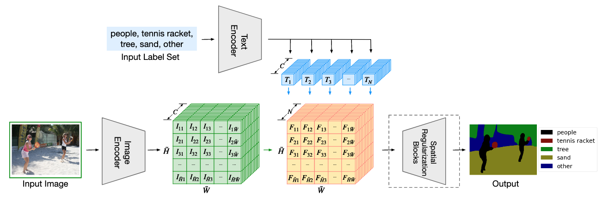

## CLIP

  

1. 对比预训练：
    
    - 从网络上收集N个图片-文本对（OpenAI收集了4亿个图片文本对）作为正样本；
        
    - N张图片与剩下的N-1张图片对应的文本组成数据对，作为负样本（即文本描述和图片内容不符）；
        
    - N张图片送入图像编码器，对应文本送入文本编码器，将图像特征与文本特征做点积，得到相似度矩阵；
        
    - 将矩阵的每一行当作是一个N类预测的结果，以第 i 行为例，为了使第 i 行、第 i 列的值最大（在第 i 行中相似度最大），我们的 label 应该也是 i，将第 i 行与 label 作 cross entropy，即可完成矩阵的优化；
        
    - 将矩阵的每一列当作是一个N类预测的结果，以第 i 列为例，为了使第 i 列、第 i 行的值最大（在第 i 列中相似度最大），我们的 label 应该也是 i，将第 i 列与 label 作 cross entropy，即可完成矩阵的优化。
        
2. 从 label 中构建数据分类器：
    
    - 用文本标签构建句子，送入文本编码器得到文本特征。
        
3. 用于zero-shot预测：
    
    - 将标签构建的文本特征与图像特征进行相似度匹配，从而完成预测。

## LSeg

  

1. 与CLIP的关系：
    
    - 利用已经对齐好的 CLIP 特征空间，将语义标签和像素特征映射到同一空间，通过相似性进行分割预测；
    
    - 文本编码器：与CLIP保持一致，训练时不更新参数:snowflake:；

2. 与CLIP不同的点：

<table style="width:100%; text-align:center;">
  <tr>
    <th>列1</th>
    <th>列2</th>
    <th>列3</th>
  </tr>
  <tr>
    <td>内容1</td>
    <td>内容2</td>
    <td>内容3</td>
  </tr>
  <tr>
    <td>内容4</td>
    <td>内容5</td>
    <td>内容6</td>
  </tr>
</table>

    - 对比学习:x:，有监督学习:white_check_mark:；

    - 