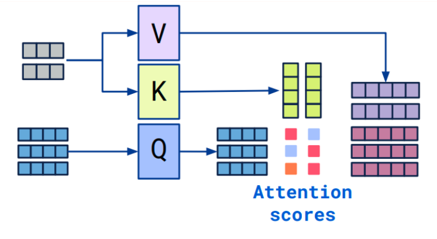

## Cross-Attention

### Overview

Cross-attention is an attention mechanism that fuses two embedding sequences:

- The two sequences must have the **same embedding dimension**.
- They can come from different modalities (e.g., text, images, audio).
- One sequence provides the **queries (Q)** and determines the **output length**.
- The other sequence provides the **keys (K)** and **values (V)**.

### Cross-attention vs. self-attention

The key difference is the input:

- **Self-attention** uses a single sequence to produce Q/K/V.
- **Cross-attention** uses two sequences: one for Q and the other for K/V.

### Cross-attention algorithm

- Given two sequences $S_1$ and $S_2$
- Compute $K$ and $V$ from $S_1$
- Compute $Q$ from $S_2$
- Compute the attention matrix from $Q$ and $K$
- Apply attention to $V$
- The output sequence length matches $S_2$

$$
\pmb{\text{softmax}}((W_Q S_2)(W_K S_1)^\mathrm{T})W_V S_1
$$

