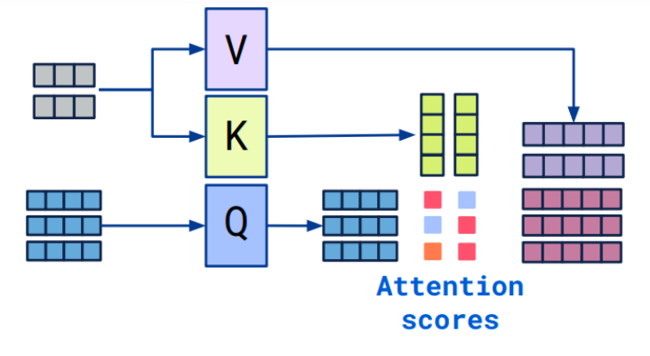

## Cross Attention

来自[博客](https://vaclavkosar.com/ml/cross-attention-in-transformer-architecture)

### 简介

Cross Attention是：

- 融合两种不同的嵌入序列的注意力机制
- 两个序列必须包含**相同的维度**
- 两个序列可以来自不同的模态（例如文本、图像、声音）
- 其中一个序列作为**Query的输入**，决定了输出的长度
- 另一个序列作为**Key和Value的输入**

### Cross Attention vs Self-attention

Cross Attention与Self-attention只有输入不同。Cross Attention输入为两个维度相同的嵌入序列；Self-attention输入为一个嵌入序列，其KQV均由该序列生成。

### Cross Attention算法

- 拥有两个序列S1、S2
- 计算S1的K、V
- 计算S2的Q
- 根据K和Q计算注意力矩阵
- 将V应用于注意力矩阵
- 输出的序列长度与S2一致

$$
\pmb{\text{softmax}}((W_Q S_2)(W_K S_1)^\mathrm{T})W_v S_1
$$

