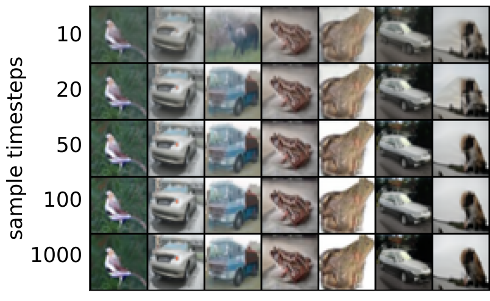

## 1. Denoising Diffusion Probabilistic Models (DDPM)

In [Flow and Diffusion Models](../flow_and_diffusion_models/), a generative model starts from an easy-to-sample initial distribution and gradually transforms its samples into the data distribution through stochastic dynamics:

\[
p_{\mathrm{init}} \xrightarrow{\mathrm{SDE}} p_{\mathrm{data}}.
\]

The initial distribution is usually the standard normal distribution \(\mathcal{N}(0,I)\). Generation can therefore be understood as first sampling Gaussian noise and then using a neural-network-controlled stochastic process to turn that noise into data.

### 1.1. From Continuous Stochastic Dynamics to a Discrete Generative Chain

A continuous-time diffusion model can be written as a stochastic differential equation:

\[
dX_t=u_t^\theta(X_t)\,dt+\sigma_t\,dW_t,
\]

where the neural-network-parameterized \(u_t^\theta\) controls the overall direction of motion, while \(\sigma_t\,dW_t\) introduces random perturbations. Starting from noise and numerically simulating this SDE gradually produces a data sample.

Denoising Diffusion Probabilistic Models (DDPMs) describe generation in discrete time. The paper denotes data by \(x_0\) and the progressively noised variables by \(x_1,\ldots,x_T\). Generation runs in the opposite direction:

\[
x_T\rightarrow x_{T-1}\rightarrow\cdots\rightarrow x_1\rightarrow x_0,
\qquad x_T\sim\mathcal{N}(0,I).
\]

This time convention is opposite to the one used earlier in this series: the preceding posts generally use \(t=0\) for noise and \(t=1\) for data, whereas DDPM uses \(x_0\) for data and \(x_T\) for noise. Both conventions describe the same generative direction, from Gaussian noise to data.

### 1.2. Forward and Reverse Processes: Two Markov Chains in Opposite Directions

DDPM uses two Markov chains running in opposite directions to describe noising and generation. Generation uses a neural-network-parameterized reverse process:

\[
\begin{aligned}
p_\theta(x_{0:T})
&=p(x_T)\prod_{t=1}^{T}p_\theta(x_{t-1}\mid x_t),
\qquad p(x_T)=\mathcal{N}(x_T;0,I),\\
p_\theta(x_{t-1}\mid x_t)
&=\mathcal{N}\!\left(x_{t-1};\mu_\theta(x_t,t),\Sigma_\theta(x_t,t)\right).
\end{aligned}
\tag{1}
\]

The model starts from Gaussian noise \(x_T\), predicts the conditional Gaussian for the next state from the current state \(x_t\), and samples a less noisy \(x_{t-1}\).

Training uses a fixed forward process that gradually adds Gaussian noise to data \(x_0\):

\[
\begin{aligned}
q(x_{1:T}\mid x_0)
&=\prod_{t=1}^{T}q(x_t\mid x_{t-1}),\\
q(x_t\mid x_{t-1})
&=\boxed{\mathcal{N}\!\left(x_t;\sqrt{1-\beta_t}\,x_{t-1},\beta_t I\right)}.
\end{aligned}
\tag{2}
\]

Design intuition: Why use this mean and variance?

Equation (2) is equivalent to the following sampling operation:

\[
x_t=\sqrt{1-\beta_t}\,x_{t-1}+\sqrt{\beta_t}\,\epsilon_t,
\qquad \epsilon_t\sim\mathcal{N}(0,I).
\]

Conditioned on \(x_{t-1}\), all randomness comes from \(\epsilon_t\). The conditional mean and covariance are therefore

\[
\mathbb{E}[x_t\mid x_{t-1}]=\sqrt{1-\beta_t}\,x_{t-1},
\qquad
\operatorname{Cov}(x_t\mid x_{t-1})=\beta_t I.
\]

The square roots appear because the coefficients scale standard deviations. If \(x_{t-1}\) has covariance \(I\) and is independent of the new noise, then

\[
\operatorname{Cov}(x_t)=(1-\beta_t)I+\beta_t I=I.
\]

Each step therefore replaces a fraction \(\beta_t\) of the signal variance with noise variance while keeping the overall scale stable. This is a modeling design with these useful properties, rather than a form uniquely derived from the data.

Here, \(\beta_1,\ldots,\beta_T\) form the variance schedule that controls the amount of noise added at each step.

Define

\[
\alpha_t:=1-\beta_t,
\qquad
\bar{\alpha}_t:=\prod_{s=1}^{t}\alpha_s.
\]

Because every step is a linear Gaussian transition, \(x_t\) at any timestep can be sampled directly from \(x_0\):

\[
\boxed{
q(x_t\mid x_0)
=\mathcal{N}\!\left(
x_t;\sqrt{\bar{\alpha}_t}\,x_0,
(1-\bar{\alpha}_t)I
\right)
}.
\tag{4}
\]

Derivation: From Step-by-Step Noising to the Closed-Form Distribution at Any Timestep

From Equation (2), one noising step can be reparameterized as

\[
x_t=\sqrt{\alpha_t}\,x_{t-1}
+\sqrt{1-\alpha_t}\,\epsilon_t,
\qquad
\epsilon_t\sim\mathcal{N}(0,I).
\]

The result follows directly from the one-step formula when \(t=1\). Suppose that at timestep \(t-1\),

\[
x_{t-1}
=\sqrt{\bar{\alpha}_{t-1}}\,x_0
+\sqrt{1-\bar{\alpha}_{t-1}}\,\bar{\epsilon}_{t-1},
\qquad
\bar{\epsilon}_{t-1}\sim\mathcal{N}(0,I).
\]

Substituting this expression into the step at \(t\) gives

\[
\begin{aligned}
x_t
&=\sqrt{\alpha_t\bar{\alpha}_{t-1}}\,x_0
+\sqrt{\alpha_t(1-\bar{\alpha}_{t-1})}\,\bar{\epsilon}_{t-1}
+\sqrt{1-\alpha_t}\,\epsilon_t.
\end{aligned}
\]

Because \(\bar{\epsilon}_{t-1}\) and \(\epsilon_t\) are independent standard Gaussian noises, the sum of the last two terms is also Gaussian, with covariance

\[
\begin{aligned}
&\left[\alpha_t(1-\bar{\alpha}_{t-1})+(1-\alpha_t)\right]I\\
&=(1-\alpha_t\bar{\alpha}_{t-1})I
=(1-\bar{\alpha}_t)I.
\end{aligned}
\]

At the same time, \(\alpha_t\bar{\alpha}_{t-1}=\bar{\alpha}_t\). All accumulated noise can therefore be represented by a new standard Gaussian \(\epsilon\sim\mathcal{N}(0,I)\):

\[
x_t
=\sqrt{\bar{\alpha}_t}\,x_0
+\sqrt{1-\bar{\alpha}_t}\,\epsilon.
\]

This gives the conditional distribution in Equation (4):

\[
q(x_t\mid x_0)
=\mathcal{N}\!\left(
x_t;\sqrt{\bar{\alpha}_t}\,x_0,
(1-\bar{\alpha}_t)I
\right).
\]

Training therefore does not need to generate \(x_1,\ldots,x_t\) sequentially; Equation (4) directly samples \(x_t\) at the required noise level.

The roles of the two chains are:

| Process | Direction | Role |
| --- | --- | --- |
| Forward process \(q\) | \(x_0\rightarrow x_T\) | Gradually adds noise according to a fixed rule |
| Reverse process \(p_\theta\) | \(x_T\rightarrow x_0\) | Learns to denoise and generate data |

### 1.3. Training Objective: A Variational Upper Bound on Negative Log-Likelihood

The ideal objective is to minimize the expected negative log-likelihood \(\mathbb{E}[-\log p_\theta(x_0)]\). Directly evaluating \(p_\theta(x_0)\), however, requires integrating out all intermediate variables in the reverse chain. DDPM instead optimizes a tractable variational upper bound:

\[
\begin{aligned}
\mathbb{E}\left[-\log p_\theta(x_0)\right]
&\leq
\mathbb{E}_{q}\left[
-\log\frac{p_\theta(x_{0:T})}{q(x_{1:T}\mid x_0)}
\right]\\
&=
\mathbb{E}_{q}\left[
-\log p(x_T)
-\sum_{t\geq 1}\log
\frac{p_\theta(x_{t-1}\mid x_t)}{q(x_t\mid x_{t-1})}
\right]
=:L.
\end{aligned}
\tag{3}
\]

Using the Markov factorizations and Bayes' rule, \(L\) can be rewritten as

\[
\begin{aligned}
L
=\mathbb{E}_{q}\Bigg[
&\underbrace{D_{\mathrm{KL}}\!\left(
q(x_T\mid x_0)\,\|\,p(x_T)
\right)}_{L_T}\\
&+\sum_{t>1}
\underbrace{D_{\mathrm{KL}}\!\left(
q(x_{t-1}\mid x_t,x_0)\,\|\,
p_\theta(x_{t-1}\mid x_t)
\right)}_{L_{t-1}}\\
&+\underbrace{-\log p_\theta(x_0\mid x_1)}_{L_0}
\Bigg].
\end{aligned}
\tag{5}
\]

Derivation: Decomposing the Variational Bound into Three Loss Terms

Expand the log-ratio in Equation (3) and separate the reverse transition at \(t=1\):

\[
\begin{aligned}
L=\mathbb{E}_q\Bigg[
&-\log p(x_T)
-\sum_{t=2}^{T}\log p_\theta(x_{t-1}\mid x_t)
-\log p_\theta(x_0\mid x_1)\\
&+\sum_{t=1}^{T}\log q(x_t\mid x_{t-1})
\Bigg].
\end{aligned}
\]

For \(t>1\), Bayes' rule and the Markov property of the forward process give

\[
q(x_{t-1}\mid x_t,x_0)
=\frac{q(x_t\mid x_{t-1})q(x_{t-1}\mid x_0)}
{q(x_t\mid x_0)}.
\]

Taking logarithms and rearranging yields

\[
\log q(x_t\mid x_{t-1})
=\log q(x_{t-1}\mid x_t,x_0)
+\log q(x_t\mid x_0)
-\log q(x_{t-1}\mid x_0).
\]

Summing this identity from \(t=2\) to \(T\) makes the intermediate marginal terms telescope. Adding the \(t=1\) term \(\log q(x_1\mid x_0)\) gives

\[
\sum_{t=1}^{T}\log q(x_t\mid x_{t-1})
=\log q(x_T\mid x_0)
+\sum_{t=2}^{T}\log q(x_{t-1}\mid x_t,x_0).
\]

Substitute this result into \(L\) and group the corresponding log-differences:

\[
\begin{aligned}
L=\mathbb{E}_q\Bigg[
&\log\frac{q(x_T\mid x_0)}{p(x_T)}\\
&+\sum_{t=2}^{T}
\log\frac{q(x_{t-1}\mid x_t,x_0)}
{p_\theta(x_{t-1}\mid x_t)}\\
&-\log p_\theta(x_0\mid x_1)
\Bigg].
\end{aligned}
\]

By the definition \(D_{\mathrm{KL}}(q\|p)=\mathbb{E}_q[\log(q/p)]\), the first term becomes \(L_T\), each term in the sum becomes \(L_{t-1}\), and the final term becomes the reconstruction loss \(L_0\), giving Equation (5).

Here, \(L_T\) compares the endpoint of the forward process with the standard normal prior, \(L_{t-1}\) trains each reverse transition, and \(L_0\) reconstructs the data \(x_0\) from \(x_1\). In DDPM, the forward variance schedule \(\beta_t\) is fixed in advance, so \(L_T\) contains no learnable parameter \(\theta\) and can be treated as a constant when training the reverse process. With sufficiently many noising steps, \(q(x_T\mid x_0)\) also approaches \(\mathcal N(0,I)\), matching \(p(x_T)\).

The distribution \(q(x_{t-1}\mid x_t,x_0)\) in Equation (5) is analytically tractable. Because every step of the forward process is a linear Gaussian transition, the posterior of \(x_{t-1}\), conditioned on both \(x_t\) and the original data \(x_0\), is also Gaussian:

\[
\boxed{
q(x_{t-1}\mid x_t,x_0)
=\mathcal{N}\!\left(
x_{t-1};\tilde{\mu}_t(x_t,x_0),
\tilde{\beta}_t I
\right)
}.
\tag{6}
\]

Its mean and variance are

\[
\boxed{
\begin{aligned}
\tilde{\mu}_t(x_t,x_0)
&:=
\frac{\sqrt{\bar{\alpha}_{t-1}}\,\beta_t}
{1-\bar{\alpha}_t}x_0
+
\frac{\sqrt{\alpha_t}\,(1-\bar{\alpha}_{t-1})}
{1-\bar{\alpha}_t}x_t,\\
\tilde{\beta}_t
&:=
\frac{1-\bar{\alpha}_{t-1}}
{1-\bar{\alpha}_t}\,\beta_t.
\end{aligned}
}
\tag{7}
\]

Derivation: The One-Step Posterior of the Forward Process

Bayes' rule and the Markov property of the forward process give

\[
\begin{aligned}
q(x_{t-1}\mid x_t,x_0)
&=\frac{q(x_t\mid x_{t-1},x_0)q(x_{t-1}\mid x_0)}
{q(x_t\mid x_0)}\\
&=\frac{q(x_t\mid x_{t-1})q(x_{t-1}\mid x_0)}
{q(x_t\mid x_0)}.
\end{aligned}
\]

The denominator does not depend on \(x_{t-1}\), so the distribution as a function of \(x_{t-1}\) satisfies

\[
q(x_{t-1}\mid x_t,x_0)
\propto q(x_t\mid x_{t-1})q(x_{t-1}\mid x_0).
\]

Substitute Equations (2) and (4):

\[
\begin{aligned}
q(x_t\mid x_{t-1})
&=\mathcal{N}\!\left(
x_t;\sqrt{\alpha_t}x_{t-1},\beta_tI
\right),\\
q(x_{t-1}\mid x_0)
&=\mathcal{N}\!\left(
x_{t-1};\sqrt{\bar{\alpha}_{t-1}}x_0,
(1-\bar{\alpha}_{t-1})I
\right).
\end{aligned}
\]

Ignoring constants independent of \(x_{t-1}\), the posterior log-density is

\[
\begin{aligned}
\log q(x_{t-1}\mid x_t,x_0)
=C
&-\frac{1}{2\beta_t}
\left\|x_t-\sqrt{\alpha_t}x_{t-1}\right\|^2\\
&-\frac{1}{2(1-\bar{\alpha}_{t-1})}
\left\|x_{t-1}-\sqrt{\bar{\alpha}_{t-1}}x_0\right\|^2,
\end{aligned}
\]

where \(C\) is independent of \(x_{t-1}\). Collecting the coefficient of \(\|x_{t-1}\|^2\) gives the posterior precision:

\[
\begin{aligned}
\frac{1}{\tilde{\beta}_t}
&=\frac{\alpha_t}{\beta_t}
+\frac{1}{1-\bar{\alpha}_{t-1}}\\
&=\frac{1-\bar{\alpha}_t}
{\beta_t(1-\bar{\alpha}_{t-1})}.
\end{aligned}
\]

Taking the reciprocal gives the posterior variance:

\[
\tilde{\beta}_t
=\frac{1-\bar{\alpha}_{t-1}}
{1-\bar{\alpha}_t}\,\beta_t.
\]

The coefficient of the terms linear in \(x_{t-1}\) is

\[
\frac{\sqrt{\alpha_t}}{\beta_t}x_t
+\frac{\sqrt{\bar{\alpha}_{t-1}}}
{1-\bar{\alpha}_{t-1}}x_0.
\]

The mean of a Gaussian equals its covariance multiplied by the linear coefficient, so

\[
\begin{aligned}
\tilde{\mu}_t(x_t,x_0)
&=\tilde{\beta}_t\left(
\frac{\sqrt{\alpha_t}}{\beta_t}x_t
+\frac{\sqrt{\bar{\alpha}_{t-1}}}
{1-\bar{\alpha}_{t-1}}x_0
\right)\\
&=\frac{\sqrt{\bar{\alpha}_{t-1}}\,\beta_t}
{1-\bar{\alpha}_t}x_0
+\frac{\sqrt{\alpha_t}(1-\bar{\alpha}_{t-1})}
{1-\bar{\alpha}_t}x_t.
\end{aligned}
\]

Substituting \(\tilde{\mu}_t\) and \(\tilde{\beta}_t\) back into the Gaussian distribution gives Equations (6) and (7).

### 1.4. Loss Function: Paper Derivation

Equation (5) decomposes the training objective into three parts. \(L_T\) only compares the endpoint of the fixed forward process with the prior, so it does not update the model parameters \(\theta\). At intermediate steps, \(L_{t-1}\) compares the true posterior \(q(x_{t-1}\mid x_t,x_0)\) with the model reverse transition \(p_\theta(x_{t-1}\mid x_t)\). Once the reverse variance is fixed, this Gaussian KL divergence reduces to mean regression and can then be rewritten as a noise prediction loss. Finally, \(L_0\) reconstructs the data \(x_0\) from \(x_1\).

#### Fixing the Reverse Variance Turns the KL into Mean Regression

The reverse transition is written as

\[
p_\theta(x_{t-1}\mid x_t)
=\mathcal N\!\left(
x_{t-1};\mu_\theta(x_t,t),\sigma_t^2I
\right),
\]

with \(\sigma_t^2\) fixed to either \(\beta_t\) or \(\tilde\beta_t\). Because both the true posterior in Equation (6) and the model distribution are Gaussian, \(L_{t-1}\) reduces to a weighted squared error between their means:

\[
L_{t-1}
=\mathbb E_q\left[
\frac{1}{2\sigma_t^2}
\left\|
\tilde\mu_t(x_t,x_0)-\mu_\theta(x_t,t)
\right\|^2
\right]+C.
\tag{8}
\]

Here, \(C\) is independent of \(\theta\). Training the reverse process therefore amounts to predicting the true posterior mean \(\tilde\mu_t\).

#### Rewriting Posterior Mean Regression as Noise Prediction

Equation (4) permits direct sampling through

\[
x_t=\sqrt{\bar\alpha_t}x_0+
\sqrt{1-\bar\alpha_t}\,\epsilon,
\qquad \epsilon\sim\mathcal N(0,I).
\]

Substituting the resulting expression for \(x_0\) into Equation (7) rewrites the true posterior mean as

\[
\tilde\mu_t(x_t,x_0)
=\frac{1}{\sqrt{\alpha_t}}
\left(
x_t-\frac{\beta_t}{\sqrt{1-\bar\alpha_t}}\epsilon
\right).
\]

The paper therefore predicts the noise \(\epsilon_\theta(x_t,t)\) instead of predicting the mean directly:

\[
\mu_\theta(x_t,t)
=\frac{1}{\sqrt{\alpha_t}}
\left(
x_t-\frac{\beta_t}{\sqrt{1-\bar\alpha_t}}
\epsilon_\theta(x_t,t)
\right).
\tag{11}
\]

Substituting this parameterization into Equation (8) gives the weighted noise prediction loss:

\[
L_{t-1}
=\mathbb E_{x_0,\epsilon}\left[
\frac{\beta_t^2}
{2\sigma_t^2\alpha_t(1-\bar\alpha_t)}
\left\|
\epsilon-\epsilon_\theta(x_t,t)
\right\|^2
\right].
\tag{12}
\]

Derivation: From Equation (8) to Equation (12)

Applying \(x_t=\sqrt{\bar\alpha_t}x_0+\sqrt{1-\bar\alpha_t}\epsilon\) to Equation (8) first gives

\[
L_{t-1}-C
=\mathbb E_{x_0,\epsilon}\left[
\frac{1}{2\sigma_t^2}
\left\|
\tilde\mu_t(x_t(x_0,\epsilon),x_0)
-\mu_\theta(x_t(x_0,\epsilon),t)
\right\|^2
\right].
\tag{9}
\]

Solving the sampling equation for \(x_0\) gives

\[
x_0=\frac{x_t-\sqrt{1-\bar\alpha_t}\epsilon}
{\sqrt{\bar\alpha_t}}.
\]

Substituting this into Equation (7) and using \(\bar\alpha_t=\alpha_t\bar\alpha_{t-1}\) yields

\[
\begin{aligned}
L_{t-1}-C
=\mathbb E_{x_0,\epsilon}\Bigg[
\frac{1}{2\sigma_t^2}
\Bigg\|
&\frac{1}{\sqrt{\alpha_t}}
\left(
x_t-\frac{\beta_t}{\sqrt{1-\bar\alpha_t}}\epsilon
\right)\\
&-\mu_\theta(x_t,t)
\Bigg\|^2
\Bigg].
\end{aligned}
\tag{10}
\]

Finally, substitute Equation (11). The two \(x_t/\sqrt{\alpha_t}\) terms cancel, leaving only the difference between the true and predicted noise:

\[
\tilde\mu_t-\mu_\theta
=\frac{\beta_t}
{\sqrt{\alpha_t}\sqrt{1-\bar\alpha_t}}
\left(\epsilon_\theta-\epsilon\right).
\]

Squaring this expression and multiplying by \(1/(2\sigma_t^2)\) gives Equation (12).

#### The Simplified Objective Removes the Time-Dependent Weight

The coefficient in Equation (12) changes the contribution of each time step. In practice, this coefficient is removed and \(t\) is sampled uniformly, producing the simplified objective:

\[
\boxed{
L_{\mathrm{simple}}
=\mathbb E_{t,x_0,\epsilon}\left[
\left\|
\epsilon-
\epsilon_\theta\!\left(
\sqrt{\bar\alpha_t}x_0+
\sqrt{1-\bar\alpha_t}\epsilon,t
\right)
\right\|^2
\right].
}
\tag{14}
\]

Equation (14) still trains the network to predict the noise added by the forward process, but it reweights the noise levels and is therefore no longer the direct sum of the terms in the original variational bound.

### 1.5. Score-Loss Derivation: From a Conditional Gaussian Score to the DDPM Loss

[Score Functions and Score Matching](../score_matching_guidance/) introduces the Gaussian conditional probability path

\[
p_t(x\mid z)=\mathcal N(x;\alpha_tz,\sigma_t^2I)
\]

and derives its conditional score:

\[
\nabla_x\log p_t(x\mid z)
=-\frac{x-\alpha_tz}{\sigma_t^2}.
\]

The DDPM forward distribution is exactly this Gaussian example. Note that \(\alpha_t\) in the general path above shares a symbol with DDPM's one-step retention coefficient but has a different meaning: the former corresponds to \(\sqrt{\bar\alpha_t}\) in DDPM. The complete notation mapping is:

| Gaussian conditional path | DDPM forward process |
| --- | --- |
| \(z\) | \(x_0\) |
| \(x\) | \(x_t\) |
| \(\alpha_t\) | \(\sqrt{\bar\alpha_t}\) |
| \(\sigma_t^2\) | \(1-\bar\alpha_t\) |

After substitution, the DDPM conditional score is

\[
\nabla_{x_t}\log q(x_t\mid x_0)
=-\frac{x_t-\sqrt{\bar\alpha_t}x_0}
{1-\bar\alpha_t}.
\]

Using the reparameterization in Equation (4),

\[
x_t=\sqrt{\bar\alpha_t}x_0+
\sqrt{1-\bar\alpha_t}\epsilon,
\qquad \epsilon\sim\mathcal N(0,I),
\]

rewrites the conditional score as

\[
\nabla_{x_t}\log q(x_t\mid x_0)
=-\frac{\epsilon}{\sqrt{1-\bar\alpha_t}}.
\]

The score network can therefore be parameterized by a noise prediction network:

\[
s_\theta(x_t,t)
:=-\frac{\epsilon_\theta(x_t,t)}
{\sqrt{1-\bar\alpha_t}}.
\]

Noise prediction and score prediction differ only by a known, time-dependent scale.

#### Obtaining the DDPM Loss from Denoising Score Matching

The time-weighted denoising score matching objective is

\[
L_{\mathrm{DSM}}
=\mathbb E_{t,x_0,x_t}\left[
\lambda_t
\left\|
s_\theta(x_t,t)-
\nabla_{x_t}\log q(x_t\mid x_0)
\right\|^2
\right].
\]

Substituting the two score expressions above gives

\[
\begin{aligned}
L_{\mathrm{DSM}}
&=\mathbb E\left[
\frac{\lambda_t}{1-\bar\alpha_t}
\left\|
\epsilon-\epsilon_\theta(x_t,t)
\right\|^2
\right].
\end{aligned}
\]

Choose \(\lambda_t=1-\bar\alpha_t\). The denominator cancels, giving

\[
\boxed{
\begin{aligned}
L_{\mathrm{DSM}}
&=\mathbb E_{t,x_0,\epsilon}\left[
\left\|
\epsilon-
\epsilon_\theta\!\left(
\sqrt{\bar\alpha_t}x_0+
\sqrt{1-\bar\alpha_t}\epsilon,t
\right)
\right\|^2
\right]\\
&=L_{\mathrm{simple}}.
\end{aligned}
}
\]

This is the core DDPM loss in Equation (14): sample \(x_0\), a time step \(t\), and noise \(\epsilon\); construct \(x_t\); then train the network to recover that noise from \(x_t\).

[Score Functions and Score Matching](../score_matching_guidance/) proves that denoising score matching and marginal score matching differ only by a constant independent of the model parameters. Thus, although the computable conditional score supplies the supervision here, the trained network learns the score of the perturbed marginal distribution \(q_t(x_t)\).

Supplement: Relating the Score Loss to the Variational-Bound Weight

If we choose

\[
\lambda_t
=\frac{\beta_t^2}{2\sigma_t^2\alpha_t},
\]

then the noise-error weight in the denoising score loss becomes

\[
\frac{\lambda_t}{1-\bar\alpha_t}
=\frac{\beta_t^2}
{2\sigma_t^2\alpha_t(1-\bar\alpha_t)},
\]

which is exactly the variational-bound weight in Equation (12). Here, \(\sigma_t^2\) denotes the fixed variance of the reverse Gaussian distribution in Section 1.4.

Equations (12) and (14) can therefore both be written as denoising score losses; they differ in how they weight the time steps.

Substituting the score parameterization into Equation (11) also rewrites the reverse mean as

\[
\mu_\theta(x_t,t)
=\frac{1}{\sqrt{\alpha_t}}
\left(x_t+\beta_t s_\theta(x_t,t)\right).
\]

The network trained by the score loss can therefore be used directly in DDPM's step-by-step reverse denoising process.

### 1.6. Training and Sampling

Equation (14) gives the training algorithm in the paper. Each iteration samples data, a time step, and noise, then constructs one \(x_t\); it does not need to generate the entire forward trajectory sequentially.

| **Algorithm 1** DDPM Training |
| --- |
| **Input**: data distribution \(q(x_0)\), noise schedule \(\beta_{1:T}\), noise prediction network \(\epsilon_\theta\) |
| 1: **repeat** |
| 2: \(\quad\)Sample \(x_0\sim q(x_0)\) |
| 3: \(\quad\)Sample \(t\sim\operatorname{Uniform}(\{1,\ldots,T\})\) |
| 4: \(\quad\)Sample \(\epsilon\sim\mathcal N(0,I)\) |
| 5: \(\quad\)Set \(x_t=\sqrt{\bar\alpha_t}x_0+\sqrt{1-\bar\alpha_t}\epsilon\) |
| 6: \(\quad\)Take a gradient step on \(\left\|\epsilon-\epsilon_\theta(x_t,t)\right\|^2\) to update \(\theta\) |
| 7: **until** converged |
| **Output**: trained noise prediction network \(\epsilon_\theta\) |

Sampling starts from standard Gaussian noise \(x_T\) and uses the reverse mean in Equation (11) to generate \(x_{T-1},\ldots,x_0\) step by step:

| **Algorithm 2** DDPM Sampling |
| --- |
| **Input**: trained \(\epsilon_\theta\), noise schedule \(\beta_{1:T}\), reverse standard deviations \(\sigma_{1:T}\) |
| 1: Sample \(x_T\sim\mathcal N(0,I)\) |
| 2: **for** \(t=T,\ldots,1\) **do** |
| 3: \(\quad\)**if** \(t>1\), sample \(z\sim\mathcal N(0,I)\); **else** set \(z=0\) |
| 4: \(\quad\)Set \(x_{t-1}=\dfrac{1}{\sqrt{\alpha_t}}\left(x_t-\dfrac{\beta_t}{\sqrt{1-\bar\alpha_t}}\epsilon_\theta(x_t,t)\right)+\sigma_tz\) |
| 5: **end for** |
| **Output**: generated sample \(x_0\) |

To inspect what information the reverse process has recovered at each time step, estimate the final data sample from the current \(x_t\) and predicted noise:

\[
\hat{x}_0
=\frac{x_t-\sqrt{1-\bar\alpha_t}\epsilon_\theta(x_t,t)}
{\sqrt{\bar\alpha_t}}.
\tag{15}
\]

<figure>
  
  <figcaption>Figure 1: Unconditional progressive generation on CIFAR-10. Each row shows the predicted \(\hat{x}_0\) during the reverse process from left to right: large-scale structure appears first, followed by local details. Source: Ho et al., <a href="https://arxiv.org/abs/2006.11239"><em>Denoising Diffusion Probabilistic Models</em></a>, Figure 6.</figcaption>
</figure>

Algorithm 1 uses the conditional forward distribution to construct supervision, while the network receives only \(x_t\) and \(t\). Algorithm 2 then uses the learned marginal-score information for reverse generation.

## 2. Denoising Diffusion Implicit Models (DDIM)

### 2.1. Motivation: Reducing Diffusion Sampling Steps

The DDPM reverse process must move from \(x_T\) to \(x_0\) one step at a time. Every step calls the noise prediction network, and the steps run serially; with \(T=1000\), generating one image typically requires 1,000 network evaluations.

DDPM training, however, can construct any \(x_t\) directly with Equation (4). The objective requires the distributions \(q(x_t\mid x_0)\) at each time to remain fixed, but it does not uniquely determine how \(x_{1:T}\) are connected.

[DDIM](https://arxiv.org/abs/2010.02502) therefore constructs non-Markovian processes with the same \(q(x_t\mid x_0)\). They reuse the DDPM objective and noise prediction network while allowing the reverse process to skip time steps. The deterministic special case completes sampling with fewer network evaluations.

### 2.2. Skip-Step Generation: Reducing Mean Error

The linear Gaussian structure of DDPM ensures that \(q(x_t\mid x_0)\) remains Gaussian. Once the noise schedule \(\beta_{1:T}\) is fixed, Equation (4) constructs any \(x_t\) in one step without sequentially computing \(x_1,\ldots,x_{t-1}\). The forward process can therefore be constructed efficiently in a single step.

The DDPM reverse process, however, is composed of adjacent transitions \(p_\theta(x_{t-1}\mid x_t)\) and is tightly coupled to the predefined \(T\) time steps. Jumping directly from \(x_t\) to \(x_s\), where \(s\lt t\), requires a skip-step posterior. Its true mean is

\[
\tilde\mu^{\mathrm{DDPM}}_{t\to s}
=\frac{\sqrt{\bar\alpha_s}(1-\bar\alpha_t/\bar\alpha_s)}{1-\bar\alpha_t}x_0
+\frac{\sqrt{\bar\alpha_t/\bar\alpha_s}(1-\bar\alpha_s)}{1-\bar\alpha_t}x_t.
\tag{16}
\]

During generation, the true \(x_0\) is unavailable and must be replaced by the estimate \(\hat x_0\) from the noise network. If \(\epsilon_\theta(x_t,t)=\epsilon+e\), where \(e\) is the noise prediction error, then \(\hat x_0=x_0-\sqrt{(1-\bar\alpha_t)/\bar\alpha_t}\,e\). Substitution into Equation (16) gives the DDPM skip-step mean error

\[
\Delta\mu^{\mathrm{DDPM}}_{t\to s}
=-\frac{\bar\alpha_s-\bar\alpha_t}
{\sqrt{\bar\alpha_s\bar\alpha_t(1-\bar\alpha_t)}}e.
\tag{17}
\]

Derivation: DDPM Skip-Step Mean Error

The linear Gaussian forward process gives \(q(x_t\mid x_s)=\mathcal N\!\left(x_t;\sqrt{\bar\alpha_t/\bar\alpha_s}\,x_s,(1-\bar\alpha_t/\bar\alpha_s)I\right)\), while \(q(x_s\mid x_0)=\mathcal N\!\left(x_s;\sqrt{\bar\alpha_s}x_0,(1-\bar\alpha_s)I\right)\). Multiplying the two Gaussian densities and completing the square gives Equation (16).

From \(x_t=\sqrt{\bar\alpha_t}x_0+\sqrt{1-\bar\alpha_t}\,\epsilon\) and \(\epsilon_\theta=\epsilon+e\), we obtain \(\hat x_0-x_0=-\sqrt{(1-\bar\alpha_t)/\bar\alpha_t}\,e\). Only the first term of Equation (16) depends on \(x_0\), so

\[
\begin{aligned}
\Delta\mu^{\mathrm{DDPM}}_{t\to s}
&=\frac{\sqrt{\bar\alpha_s}(1-\bar\alpha_t/\bar\alpha_s)}{1-\bar\alpha_t}
(\hat x_0-x_0)\\
&=-\frac{\bar\alpha_s-\bar\alpha_t}
{\sqrt{\bar\alpha_s\bar\alpha_t(1-\bar\alpha_t)}}e.
\end{aligned}
\]

DDIM instead constructs a family of skip-step conditional distributions:

\[
\boxed{
\begin{aligned}
q_\sigma(x_s\mid x_t,x_0)
=\mathcal N\Bigg(
x_s;
&\sqrt{\bar\alpha_s}x_0
+\sqrt{1-\bar\alpha_s-\sigma_{t\to s}^2}
\frac{x_t-\sqrt{\bar\alpha_t}x_0}{\sqrt{1-\bar\alpha_t}},
\sigma_{t\to s}^2I
\Bigg).
\end{aligned}
}
\tag{18}
\]

This construction preserves \(q_\sigma(x_s\mid x_0)=\mathcal N\!\left(x_s;\sqrt{\bar\alpha_s}x_0,(1-\bar\alpha_s)I\right)\) while allowing \(\sigma_{t\to s}\) to control skip-step randomness. When \(\sigma_{t\to s}=0\), replacing the true \(x_0\) with \(\hat x_0\) gives the deterministic DDIM skip-step error

\[
\Delta x_s^{\mathrm{DDIM}}
=\left(
\sqrt{1-\bar\alpha_s}
-\sqrt{\frac{\bar\alpha_s(1-\bar\alpha_t)}{\bar\alpha_t}}
\right)e.
\tag{19}
\]

To simplify the comparison below, write \(r_u:=\sqrt{(1-\bar\alpha_u)/\bar\alpha_u}\). For an intermediate state \(0\lt s\lt t\), \(0\lt r_s\lt r_t\), and

\[
\boxed{
\frac{
\left\|\Delta x_s^{\mathrm{DDIM}}\right\|
}{
\left\|\Delta\mu^{\mathrm{DDPM}}_{t\to s}\right\|
}
=\frac{r_t}{r_t+r_s}<1.
}
\tag{20}
\]

Derivation: DDIM Skip-Step Error and Comparison with DDPM

When \(\sigma_{t\to s}=0\), Equation (18) gives the generation update \(x_s^{\mathrm{DDIM}}=\sqrt{\bar\alpha_s}\hat x_0+\sqrt{1-\bar\alpha_s}\,\epsilon_\theta(x_t,t)\). Substituting \(\hat x_0=x_0-r_te\) and \(\epsilon_\theta=\epsilon+e\), then subtracting the update using the true noise, gives Equation (19).

The absolute error coefficient in Equation (19) is \(\sqrt{\bar\alpha_s}(r_t-r_s)\). The absolute error coefficient in Equation (17) can be written as \(\sqrt{\bar\alpha_s}(r_t-r_s)(r_t+r_s)/r_t\). Their ratio gives Equation (20).

Thus, for the same start and end times and the same noise prediction error, one deterministic DDIM skip-step update to an intermediate state is less sensitive to that error and is more stable than a DDPM skip step in this sense. When the endpoint is \(x_0\), \(r_0=0\), so the two updates have the same error coefficient. This statement compares one-step mean error; actual generation quality also depends on the number of sampling steps, accumulated errors, and the network's accuracy at different noise levels.

<figure>
  
  <figcaption>Figure 2: Images generated from the same random \(x_T\) using 10, 20, 50, 100, and 1000 sampling steps. Despite the different step counts, samples in each column retain broadly consistent high-level semantics. Source: Song et al., <a href="https://arxiv.org/abs/2010.02502"><em>Denoising Diffusion Implicit Models</em></a>, Figure 5 (cropped).</figcaption>
</figure>

### 2.3. ODE View: DDIM as a Discrete Solver of a Deterministic Trajectory

[Flow and Diffusion Models](../flow_and_diffusion_models/) describes generation as a trajectory moving along a neural vector field and uses the Euler method to solve its ODE:

\[
X_{\tau+h}=X_\tau+h\,u_\tau^\theta(X_\tau).
\]

The earlier posts use forward time from noise to data, while DDPM and DDIM use reverse time from \(x_T\) to \(x_0\); both conventions describe the same generation direction.

When \(\sigma_{t\to s}=0\), DDIM no longer injects fresh random noise into the update. Its deterministic update can be written as

\[
\frac{x_s}{\sqrt{\bar\alpha_s}}
=\frac{x_t}{\sqrt{\bar\alpha_t}}
+\left(
\sqrt{\frac{1-\bar\alpha_s}{\bar\alpha_s}}
-\sqrt{\frac{1-\bar\alpha_t}{\bar\alpha_t}}
\right)\epsilon_\theta(x_t,t).
\tag{21}
\]

Derivation: Equation (21)

The deterministic DDIM update is

\[
x_s
=\sqrt{\bar\alpha_s}\hat x_0
+\sqrt{1-\bar\alpha_s}\,\epsilon_\theta(x_t,t),
\]

where

\[
\hat x_0
=\frac{x_t-\sqrt{1-\bar\alpha_t}\,\epsilon_\theta(x_t,t)}
{\sqrt{\bar\alpha_t}}.
\]

Substituting \(\hat x_0\) and dividing by \(\sqrt{\bar\alpha_s}\) gives

\[
\frac{x_s}{\sqrt{\bar\alpha_s}}
=\frac{x_t}{\sqrt{\bar\alpha_t}}
-\left(
\sqrt{\frac{1-\bar\alpha_t}{\bar\alpha_t}}
-\sqrt{\frac{1-\bar\alpha_s}{\bar\alpha_s}}
\right)\epsilon_\theta(x_t,t).
\]

Rearranging the signs inside the parentheses gives Equation (21).

Equation (21) corresponds to the Euler update \(X_{\tau+h}=X_\tau+h\,u_\tau^\theta(X_\tau)\) as follows:

| Euler update | Corresponding DDIM quantity |
| --- | --- |
| Current state \(X_\tau\) | \(x_t/\sqrt{\bar\alpha_t}\) |
| Updated state \(X_{\tau+h}\) | \(x_s/\sqrt{\bar\alpha_s}\) |
| Vector field \(u_\tau^\theta(X_\tau)\) | \(\epsilon_\theta(x_t,t)\) |
| Step size \(h\) | \(\sqrt{(1-\bar\alpha_s)/\bar\alpha_s}-\sqrt{(1-\bar\alpha_t)/\bar\alpha_t}\) |

In the continuous limit, the ODE solved by DDIM can be written as

\[
\frac{\mathrm dy}{\mathrm d\rho}
=\epsilon_\theta\!\left(
\sqrt{\bar\alpha(t(\rho))}\,y,t(\rho)
\right).
\tag{22}
\]

DDIM skipping therefore amounts to solving the same ODE on a sparser grid. Reducing the sampling trajectory from \(T\) steps to \(S\) steps reduces the number of network evaluations, but it also increases the size of each Euler step and may increase numerical discretization error.

This matches the two types of error summarized in the earlier post: the noise prediction error \(e\) is a <strong>training error</strong>, while solving the ODE with finitely many steps produces a <strong>simulation error</strong>. Equation (19) describes how one DDIM step amplifies the former, and the Euler view explains why the number of sampling steps cannot be reduced without limit.

[Flow Matching](../flow_matching/) shows that marginal flow matching can be trained through the conditional vector field. For the DDIM trajectory, define

\[
y_\rho
:=\frac{x_t}{\sqrt{\bar\alpha_t}}
=x_0+\rho\epsilon,
\qquad
\rho:=\sqrt{\frac{1-\bar\alpha_t}{\bar\alpha_t}},
\qquad
\frac{\mathrm dy_\rho}{\mathrm d\rho}=\epsilon.
\]

Its conditional vector field is simply the noise \(\epsilon\). Marginal and conditional flow matching differ only by a constant independent of the model parameters. Therefore, setting \(u_\rho^\theta(y_\rho):=\epsilon_\theta(x_t,t)\) and retaining DDPM's uniform sampling of \(t\) gives

\[
\mathcal L_{\mathrm{DDIM}}
=\mathbb E_{t,x_0,\epsilon}
\left[
\left\|
\epsilon-\epsilon_\theta\!\left(
\sqrt{\bar\alpha_t}x_0
+\sqrt{1-\bar\alpha_t}\epsilon,t
\right)
\right\|^2
\right].
\]

This is \(L_{\mathrm{simple}}\) in Equation (14). DDIM and DDPM therefore use the same network and training objective, while changing the sampling dynamics.

## References

[1] J. Ho, A. Jain, and P. Abbeel, "Denoising Diffusion Probabilistic Models," in *Advances in Neural Information Processing Systems*, vol. 33, 2020, pp. 6840–6851. [Online]. Available: https://arxiv.org/abs/2006.11239

[2] J. Song, C. Meng, and S. Ermon, "Denoising Diffusion Implicit Models," in *International Conference on Learning Representations*, 2021. [Online]. Available: https://arxiv.org/abs/2010.02502
