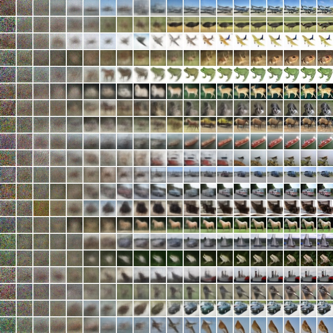

## 1. 去噪扩散概率模型（Denoising Diffusion Probabilistic Models，DDPM）

在[《流模型与扩散模型》](../flow_and_diffusion_models/)中，生成模型从容易采样的初始分布出发，通过随机动力学将样本逐渐变换到数据分布：

\[
p_{\mathrm{init}} \xrightarrow{\mathrm{SDE}} p_{\mathrm{data}}.
\]

初始分布通常取标准正态分布 \(\mathcal{N}(0,I)\)。因此，生成过程可以理解为：先采样一份高斯噪声，再利用神经网络控制的随机过程，逐渐将噪声转化为数据。

### 1.1. 从连续随机动力学到离散生成链

连续时间扩散模型可以写成随机微分方程：

\[
dX_t=u_t^\theta(X_t)\,dt+\sigma_t\,dW_t,
\]

其中，神经网络参数化的 \(u_t^\theta\) 控制样本的整体移动方向，\(\sigma_t\,dW_t\) 引入随机扰动。给定初始噪声后，对这条 SDE 进行数值模拟，便可以逐步得到数据样本。

去噪扩散概率模型（Denoising Diffusion Probabilistic Models，DDPM）采用离散时间描述生成过程。论文将数据记为 \(x_0\)，将逐渐加噪后得到的变量记为 \(x_1,\ldots,x_T\)。生成时沿相反方向运行：

\[
x_T\rightarrow x_{T-1}\rightarrow\cdots\rightarrow x_1\rightarrow x_0,
\qquad x_T\sim\mathcal{N}(0,I).
\]

这里的时间方向与本系列前文的记号相反：前文通常令 \(t=0\) 对应噪声、\(t=1\) 对应数据，而 DDPM 令 \(x_0\) 表示数据、\(x_T\) 表示噪声。二者描述的生成方向相同，都是从高斯噪声走向数据。

### 1.2. 前向与反向过程：方向相反的两条马尔可夫链

DDPM 用两条方向相反的马尔可夫链描述加噪和生成。生成时使用神经网络参数化的反向过程：

\[
\begin{aligned}
p_\theta(x_{0:T})
&=p(x_T)\prod_{t=1}^{T}p_\theta(x_{t-1}\mid x_t),
\qquad p(x_T)=\mathcal{N}(x_T;0,I),\\
p_\theta(x_{t-1}\mid x_t)
&=\mathcal{N}\!\left(x_{t-1};\mu_\theta(x_t,t),\Sigma_\theta(x_t,t)\right).
\end{aligned}
\tag{1}
\]

也就是说，模型从高斯噪声 \(x_T\) 开始，根据当前状态 \(x_t\) 预测下一步条件高斯分布，再从中采样噪声更少的 \(x_{t-1}\)。

训练时则使用固定的前向过程，从数据 \(x_0\) 开始逐步加入高斯噪声：

\[
\begin{aligned}
q(x_{1:T}\mid x_0)
&=\prod_{t=1}^{T}q(x_t\mid x_{t-1}),\\
q(x_t\mid x_{t-1})
&=\boxed{\mathcal{N}\!\left(x_t;\sqrt{1-\beta_t}\,x_{t-1},\beta_t I\right)}.
\end{aligned}
\tag{2}
\]

设计直觉：为什么均值和方差采用这种形式？

公式（2）等价于下面的采样过程：

\[
x_t=\sqrt{1-\beta_t}\,x_{t-1}+\sqrt{\beta_t}\,\epsilon_t,
\qquad \epsilon_t\sim\mathcal{N}(0,I).
\]

给定 \(x_{t-1}\) 后，随机性只来自 \(\epsilon_t\)，因此条件均值和条件协方差分别为

\[
\mathbb{E}[x_t\mid x_{t-1}]=\sqrt{1-\beta_t}\,x_{t-1},
\qquad
\operatorname{Cov}(x_t\mid x_{t-1})=\beta_t I.
\]

平方根来自对标准差的缩放。如果 \(x_{t-1}\) 的协方差为 \(I\)，并且它与新噪声相互独立，那么

\[
\operatorname{Cov}(x_t)=(1-\beta_t)I+\beta_t I=I.
\]

因此，每一步都用比例 \(\beta_t\) 将一部分信号方差替换为噪声方差，同时保持整体尺度稳定。这是一种满足上述性质的建模设计，并不是由数据唯一推导出的形式。

其中，\(\beta_1,\ldots,\beta_T\) 是控制每一步加噪强度的方差调度。

令

\[
\alpha_t:=1-\beta_t,
\qquad
\bar{\alpha}_t:=\prod_{s=1}^{t}\alpha_s.
\]

由于每一步都是线性高斯转移，可以直接从 \(x_0\) 采样任意时刻的 \(x_t\)：

\[
\boxed{
q(x_t\mid x_0)
=\mathcal{N}\!\left(
x_t;\sqrt{\bar{\alpha}_t}\,x_0,
(1-\bar{\alpha}_t)I
\right)
}.
\tag{4}
\]

推导：从逐步加噪到任意时刻的闭式分布

由公式（2），单步加噪可以重参数化为

\[
x_t=\sqrt{\alpha_t}\,x_{t-1}
+\sqrt{1-\alpha_t}\,\epsilon_t,
\qquad
\epsilon_t\sim\mathcal{N}(0,I).
\]

当 \(t=1\) 时结论由单步加噪公式直接成立。假设在第 \(t-1\) 步已经有

\[
x_{t-1}
=\sqrt{\bar{\alpha}_{t-1}}\,x_0
+\sqrt{1-\bar{\alpha}_{t-1}}\,\bar{\epsilon}_{t-1},
\qquad
\bar{\epsilon}_{t-1}\sim\mathcal{N}(0,I).
\]

将其代入第 \(t\) 步：

\[
\begin{aligned}
x_t
&=\sqrt{\alpha_t\bar{\alpha}_{t-1}}\,x_0
+\sqrt{\alpha_t(1-\bar{\alpha}_{t-1})}\,\bar{\epsilon}_{t-1}
+\sqrt{1-\alpha_t}\,\epsilon_t.
\end{aligned}
\]

由于 \(\bar{\epsilon}_{t-1}\) 与 \(\epsilon_t\) 是相互独立的标准高斯噪声，后两项之和仍是高斯噪声，其协方差为

\[
\begin{aligned}
&\left[\alpha_t(1-\bar{\alpha}_{t-1})+(1-\alpha_t)\right]I\\
&=(1-\alpha_t\bar{\alpha}_{t-1})I
=(1-\bar{\alpha}_t)I.
\end{aligned}
\]

同时，\(\alpha_t\bar{\alpha}_{t-1}=\bar{\alpha}_t\)。因此可以用一个新的标准高斯噪声 \(\epsilon\sim\mathcal{N}(0,I)\) 表示所有累计噪声：

\[
x_t
=\sqrt{\bar{\alpha}_t}\,x_0
+\sqrt{1-\bar{\alpha}_t}\,\epsilon.
\]

于是得到公式（4）中的条件分布

\[
q(x_t\mid x_0)
=\mathcal{N}\!\left(
x_t;\sqrt{\bar{\alpha}_t}\,x_0,
(1-\bar{\alpha}_t)I
\right).
\]

因此，训练时不需要依次生成 \(x_1,\ldots,x_t\)，只需从公式（4）直接采样所需噪声水平的 \(x_t\)。

两条链的作用可以概括为：

| 过程 | 方向 | 作用 |
| --- | --- | --- |
| 前向过程 \(q\) | \(x_0\rightarrow x_T\) | 按固定规则逐步加入噪声 |
| 反向过程 \(p_\theta\) | \(x_T\rightarrow x_0\) | 学习逐步去噪并生成数据 |

### 1.3. 训练目标：负对数似然的变分上界

理想目标是最小化数据的期望负对数似然 \(\mathbb{E}[-\log p_\theta(x_0)]\)，但直接计算 \(p_\theta(x_0)\) 需要积分掉整条反向链中的中间变量。DDPM 改为优化一个可以计算的变分上界：

\[
\begin{aligned}
\mathbb{E}\left[-\log p_\theta(x_0)\right]
&\leq
\mathbb{E}_{q}\left[
-\log\frac{p_\theta(x_{0:T})}{q(x_{1:T}\mid x_0)}
\right]\\
&=
\mathbb{E}_{q}\left[
-\log p(x_T)
-\sum_{t\geq 1}\log
\frac{p_\theta(x_{t-1}\mid x_t)}{q(x_t\mid x_{t-1})}
\right]
=:L.
\end{aligned}
\tag{3}
\]

利用马尔可夫分解和贝叶斯公式，可以将 \(L\) 改写为

\[
\begin{aligned}
L
=\mathbb{E}_{q}\Bigg[
&\underbrace{D_{\mathrm{KL}}\!\left(
q(x_T\mid x_0)\,\|\,p(x_T)
\right)}_{L_T}\\
&+\sum_{t>1}
\underbrace{D_{\mathrm{KL}}\!\left(
q(x_{t-1}\mid x_t,x_0)\,\|\,
p_\theta(x_{t-1}\mid x_t)
\right)}_{L_{t-1}}\\
&+\underbrace{-\log p_\theta(x_0\mid x_1)}_{L_0}
\Bigg].
\end{aligned}
\tag{5}
\]

推导：将变分上界分解为三个损失项

从公式（3）展开对数比，并将 \(t=1\) 的反向转移单独取出：

\[
\begin{aligned}
L=\mathbb{E}_q\Bigg[
&-\log p(x_T)
-\sum_{t=2}^{T}\log p_\theta(x_{t-1}\mid x_t)
-\log p_\theta(x_0\mid x_1)\\
&+\sum_{t=1}^{T}\log q(x_t\mid x_{t-1})
\Bigg].
\end{aligned}
\]

对于 \(t>1\)，由贝叶斯公式和前向过程的马尔可夫性质可得

\[
q(x_{t-1}\mid x_t,x_0)
=\frac{q(x_t\mid x_{t-1})q(x_{t-1}\mid x_0)}
{q(x_t\mid x_0)}.
\]

取对数并整理：

\[
\log q(x_t\mid x_{t-1})
=\log q(x_{t-1}\mid x_t,x_0)
+\log q(x_t\mid x_0)
-\log q(x_{t-1}\mid x_0).
\]

将上式从 \(t=2\) 累加到 \(T\) 后，中间的边缘分布项首尾相消；再加上 \(t=1\) 的 \(\log q(x_1\mid x_0)\)，得到

\[
\sum_{t=1}^{T}\log q(x_t\mid x_{t-1})
=\log q(x_T\mid x_0)
+\sum_{t=2}^{T}\log q(x_{t-1}\mid x_t,x_0).
\]

代回 \(L\) 并把相应的对数差组合在一起：

\[
\begin{aligned}
L=\mathbb{E}_q\Bigg[
&\log\frac{q(x_T\mid x_0)}{p(x_T)}\\
&+\sum_{t=2}^{T}
\log\frac{q(x_{t-1}\mid x_t,x_0)}
{p_\theta(x_{t-1}\mid x_t)}\\
&-\log p_\theta(x_0\mid x_1)
\Bigg].
\end{aligned}
\]

根据 KL 散度的定义 \(D_{\mathrm{KL}}(q\|p)=\mathbb{E}_q[\log(q/p)]\)，第一项成为 \(L_T\)，求和中的每一项成为 \(L_{t-1}\)，最后一项成为重构损失 \(L_0\)，于是得到公式（5）。

其中，\(L_T\) 比较前向过程的终点与标准正态先验，\(L_{t-1}\) 训练每一步反向转移，\(L_0\) 负责从 \(x_1\) 重构数据 \(x_0\)。在 DDPM 中，前向过程的方差序列 \(\beta_t\) 是预先设定的，因此 \(L_T\) 不含可学习参数 \(\theta\)，训练反向过程时可将其视为常数；同时，噪声步数足够多时，\(q(x_T\mid x_0)\) 会接近 \(\mathcal N(0,I)\)，与 \(p(x_T)\) 相匹配。

公式（5）中的 \(q(x_{t-1}\mid x_t,x_0)\) 可以解析计算。由于前向过程的每一步都是线性高斯转移，在同时给定 \(x_t\) 和原始数据 \(x_0\) 后，\(x_{t-1}\) 的后验仍为高斯分布：

\[
\boxed{
q(x_{t-1}\mid x_t,x_0)
=\mathcal{N}\!\left(
x_{t-1};\tilde{\mu}_t(x_t,x_0),
\tilde{\beta}_t I
\right)
}.
\tag{6}
\]

其均值和方差分别为

\[
\boxed{
\begin{aligned}
\tilde{\mu}_t(x_t,x_0)
&:=
\frac{\sqrt{\bar{\alpha}_{t-1}}\,\beta_t}
{1-\bar{\alpha}_t}x_0
+
\frac{\sqrt{\alpha_t}\,(1-\bar{\alpha}_{t-1})}
{1-\bar{\alpha}_t}x_t,\\
\tilde{\beta}_t
&:=
\frac{1-\bar{\alpha}_{t-1}}
{1-\bar{\alpha}_t}\,\beta_t.
\end{aligned}
}
\tag{7}
\]

推导：前向过程的单步后验

由贝叶斯公式和前向过程的马尔可夫性质，

\[
\begin{aligned}
q(x_{t-1}\mid x_t,x_0)
&=\frac{q(x_t\mid x_{t-1},x_0)q(x_{t-1}\mid x_0)}
{q(x_t\mid x_0)}\\
&=\frac{q(x_t\mid x_{t-1})q(x_{t-1}\mid x_0)}
{q(x_t\mid x_0)}.
\end{aligned}
\]

分母与 \(x_{t-1}\) 无关，因此在求关于 \(x_{t-1}\) 的分布时可以写成

\[
q(x_{t-1}\mid x_t,x_0)
\propto q(x_t\mid x_{t-1})q(x_{t-1}\mid x_0).
\]

代入公式（2）和公式（4）：

\[
\begin{aligned}
q(x_t\mid x_{t-1})
&=\mathcal{N}\!\left(
x_t;\sqrt{\alpha_t}x_{t-1},\beta_tI
\right),\\
q(x_{t-1}\mid x_0)
&=\mathcal{N}\!\left(
x_{t-1};\sqrt{\bar{\alpha}_{t-1}}x_0,
(1-\bar{\alpha}_{t-1})I
\right).
\end{aligned}
\]

忽略不含 \(x_{t-1}\) 的常数，后验的对数密度为

\[
\begin{aligned}
\log q(x_{t-1}\mid x_t,x_0)
=C
&-\frac{1}{2\beta_t}
\left\|x_t-\sqrt{\alpha_t}x_{t-1}\right\|^2\\
&-\frac{1}{2(1-\bar{\alpha}_{t-1})}
\left\|x_{t-1}-\sqrt{\bar{\alpha}_{t-1}}x_0\right\|^2,
\end{aligned}
\]

其中 \(C\) 与 \(x_{t-1}\) 无关。收集 \(\|x_{t-1}\|^2\) 的系数，得到后验精度：

\[
\begin{aligned}
\frac{1}{\tilde{\beta}_t}
&=\frac{\alpha_t}{\beta_t}
+\frac{1}{1-\bar{\alpha}_{t-1}}\\
&=\frac{1-\bar{\alpha}_t}
{\beta_t(1-\bar{\alpha}_{t-1})}.
\end{aligned}
\]

取倒数便得到后验方差

\[
\tilde{\beta}_t
=\frac{1-\bar{\alpha}_{t-1}}
{1-\bar{\alpha}_t}\,\beta_t.
\]

关于 \(x_{t-1}\) 的一次项系数为

\[
\frac{\sqrt{\alpha_t}}{\beta_t}x_t
+\frac{\sqrt{\bar{\alpha}_{t-1}}}
{1-\bar{\alpha}_{t-1}}x_0.
\]

高斯分布的均值等于协方差乘以一次项系数，因此

\[
\begin{aligned}
\tilde{\mu}_t(x_t,x_0)
&=\tilde{\beta}_t\left(
\frac{\sqrt{\alpha_t}}{\beta_t}x_t
+\frac{\sqrt{\bar{\alpha}_{t-1}}}
{1-\bar{\alpha}_{t-1}}x_0
\right)\\
&=\frac{\sqrt{\bar{\alpha}_{t-1}}\,\beta_t}
{1-\bar{\alpha}_t}x_0
+\frac{\sqrt{\alpha_t}(1-\bar{\alpha}_{t-1})}
{1-\bar{\alpha}_t}x_t.
\end{aligned}
\]

将 \(\tilde{\mu}_t\) 和 \(\tilde{\beta}_t\) 代回高斯分布，就得到公式（6）和公式（7）。

### 1.4. 损失函数：论文方法

公式（5）已经把训练目标拆成了三部分。\(L_T\) 只比较固定前向过程的终点与先验，不参与模型参数 \(\theta\) 的更新。对于中间步骤，\(L_{t-1}\) 比较真实后验 \(q(x_{t-1}\mid x_t,x_0)\) 与模型反向转移 \(p_\theta(x_{t-1}\mid x_t)\)；固定反向方差后，这个高斯 KL 散度可以继续化为均值回归，并最终改写成噪声预测损失。\(L_0\) 则负责从 \(x_1\) 恢复最终数据 \(x_0\)。

#### 反向方差固定后，KL 散度化为均值回归

论文把反向转移写成

\[
p_\theta(x_{t-1}\mid x_t)
=\mathcal N\!\left(
x_{t-1};\mu_\theta(x_t,t),\sigma_t^2I
\right),
\]

并将 \(\sigma_t^2\) 固定为 \(\beta_t\) 或 \(\tilde\beta_t\)。由于公式（6）中的真实后验与模型分布都是高斯分布，\(L_{t-1}\) 可以化为两个均值之间的加权平方误差：

\[
L_{t-1}
=\mathbb E_q\left[
\frac{1}{2\sigma_t^2}
\left\|
\tilde\mu_t(x_t,x_0)-\mu_\theta(x_t,t)
\right\|^2
\right]+C.
\tag{8}
\]

这里的 \(C\) 与 \(\theta\) 无关。因此，只要能够预测真实后验均值 \(\tilde\mu_t\)，就能训练反向过程。

#### 后验均值回归改写为噪声预测

由公式（4）可以直接采样

\[
x_t=\sqrt{\bar\alpha_t}x_0+
\sqrt{1-\bar\alpha_t}\,\epsilon,
\qquad \epsilon\sim\mathcal N(0,I).
\]

把其中的 \(x_0\) 代入公式（7），真实后验均值可以改写为

\[
\tilde\mu_t(x_t,x_0)
=\frac{1}{\sqrt{\alpha_t}}
\left(
x_t-\frac{\beta_t}{\sqrt{1-\bar\alpha_t}}\epsilon
\right).
\]

论文据此不让网络直接预测均值，而是令网络预测噪声 \(\epsilon_\theta(x_t,t)\)：

\[
\mu_\theta(x_t,t)
=\frac{1}{\sqrt{\alpha_t}}
\left(
x_t-\frac{\beta_t}{\sqrt{1-\bar\alpha_t}}
\epsilon_\theta(x_t,t)
\right).
\tag{11}
\]

代回公式（8）便得到论文的加权噪声预测损失：

\[
L_{t-1}
=\mathbb E_{x_0,\epsilon}\left[
\frac{\beta_t^2}
{2\sigma_t^2\alpha_t(1-\bar\alpha_t)}
\left\|
\epsilon-\epsilon_\theta(x_t,t)
\right\|^2
\right].
\tag{12}
\]

推导：从公式（8）到公式（12）

对公式（8）使用 \(x_t=\sqrt{\bar\alpha_t}x_0+\sqrt{1-\bar\alpha_t}\epsilon\)，首先得到

\[
L_{t-1}-C
=\mathbb E_{x_0,\epsilon}\left[
\frac{1}{2\sigma_t^2}
\left\|
\tilde\mu_t(x_t(x_0,\epsilon),x_0)
-\mu_\theta(x_t(x_0,\epsilon),t)
\right\|^2
\right].
\tag{9}
\]

由采样公式解出

\[
x_0=\frac{x_t-\sqrt{1-\bar\alpha_t}\epsilon}
{\sqrt{\bar\alpha_t}},
\]

再代入公式（7），并使用 \(\bar\alpha_t=\alpha_t\bar\alpha_{t-1}\)，可得

\[
\begin{aligned}
L_{t-1}-C
=\mathbb E_{x_0,\epsilon}\Bigg[
\frac{1}{2\sigma_t^2}
\Bigg\|
&\frac{1}{\sqrt{\alpha_t}}
\left(
x_t-\frac{\beta_t}{\sqrt{1-\bar\alpha_t}}\epsilon
\right)\\
&-\mu_\theta(x_t,t)
\Bigg\|^2
\Bigg].
\end{aligned}
\tag{10}
\]

最后代入公式（11）。两个均值中的 \(x_t/\sqrt{\alpha_t}\) 相互抵消，只留下真实噪声与预测噪声之差：

\[
\tilde\mu_t-\mu_\theta
=\frac{\beta_t}
{\sqrt{\alpha_t}\sqrt{1-\bar\alpha_t}}
\left(\epsilon_\theta-\epsilon\right).
\]

将其平方并乘以 \(1/(2\sigma_t^2)\)，即得到公式（12）。

#### 简化目标去掉时间相关权重

公式（12）的系数会改变不同时间步对训练的贡献。实际训练进一步去掉该系数，并均匀采样 \(t\)，得到简化目标：

\[
\boxed{
L_{\mathrm{simple}}
=\mathbb E_{t,x_0,\epsilon}\left[
\left\|
\epsilon-
\epsilon_\theta\!\left(
\sqrt{\bar\alpha_t}x_0+
\sqrt{1-\bar\alpha_t}\epsilon,t
\right)
\right\|^2
\right].
}
\tag{14}
\]

公式（14）仍然训练网络预测前向过程加入的噪声，但它重新调整了各噪声水平的权重，因此不再等于原始变分下界中各项的直接求和。

### 1.5. 分数损失方法：从条件高斯分数到 DDPM Loss

[《分数函数与分数匹配》](../score_matching_guidance/)已经给出高斯条件概率路径

\[
p_t(x\mid z)=\mathcal N(x;\alpha_tz,\sigma_t^2I)
\]

的条件分数：

\[
\nabla_x\log p_t(x\mid z)
=-\frac{x-\alpha_tz}{\sigma_t^2}.
\]

DDPM 的前向分布正是这个高斯例子。需要注意，上述一般路径中的 \(\alpha_t\) 与 DDPM 的单步保留系数同名，但含义不同；前者对应 DDPM 中的 \(\sqrt{\bar\alpha_t}\)。两套记号的完整对应关系为：

| 高斯条件路径 | DDPM 前向过程 |
| --- | --- |
| \(z\) | \(x_0\) |
| \(x\) | \(x_t\) |
| \(\alpha_t\) | \(\sqrt{\bar\alpha_t}\) |
| \(\sigma_t^2\) | \(1-\bar\alpha_t\) |

代入后，DDPM 的条件分数为

\[
\nabla_{x_t}\log q(x_t\mid x_0)
=-\frac{x_t-\sqrt{\bar\alpha_t}x_0}
{1-\bar\alpha_t}.
\]

再使用公式（4）的重参数化

\[
x_t=\sqrt{\bar\alpha_t}x_0+
\sqrt{1-\bar\alpha_t}\epsilon,
\qquad \epsilon\sim\mathcal N(0,I),
\]

就能把条件分数写成

\[
\nabla_{x_t}\log q(x_t\mid x_0)
=-\frac{\epsilon}{\sqrt{1-\bar\alpha_t}}.
\]

因此，分数网络可以通过噪声预测网络参数化：

\[
s_\theta(x_t,t)
:=-\frac{\epsilon_\theta(x_t,t)}
{\sqrt{1-\bar\alpha_t}}.
\]

预测噪声与预测分数只相差一个已知的时间相关缩放系数。

#### 从去噪分数匹配得到 DDPM Loss

带时间权重的去噪分数匹配目标为

\[
L_{\mathrm{DSM}}
=\mathbb E_{t,x_0,x_t}\left[
\lambda_t
\left\|
s_\theta(x_t,t)-
\nabla_{x_t}\log q(x_t\mid x_0)
\right\|^2
\right].
\]

代入上面的两种分数表示：

\[
\begin{aligned}
L_{\mathrm{DSM}}
&=\mathbb E\left[
\frac{\lambda_t}{1-\bar\alpha_t}
\left\|
\epsilon-\epsilon_\theta(x_t,t)
\right\|^2
\right].
\end{aligned}
\]

取 \(\lambda_t=1-\bar\alpha_t\)，分母被抵消，于是得到

\[
\boxed{
\begin{aligned}
L_{\mathrm{DSM}}
&=\mathbb E_{t,x_0,\epsilon}\left[
\left\|
\epsilon-
\epsilon_\theta\!\left(
\sqrt{\bar\alpha_t}x_0+
\sqrt{1-\bar\alpha_t}\epsilon,t
\right)
\right\|^2
\right]\\
&=L_{\mathrm{simple}}.
\end{aligned}
}
\]

这正是公式（14）的 DDPM 核心 Loss：随机选择 \(x_0\)、时间步 \(t\) 和噪声 \(\epsilon\)，构造 \(x_t\)，再让网络从 \(x_t\) 中预测这份噪声。

[《分数函数与分数匹配》](../score_matching_guidance/)已经证明，去噪分数匹配与边缘分数匹配只相差一个不依赖模型参数的常数。因此，虽然这里使用容易计算的条件分数作为监督信号，训练后的网络实际学习的是扰动后边缘分布 \(q_t(x_t)\) 的分数。

补充：分数损失与变分下界权重的关系

若取

\[
\lambda_t
=\frac{\beta_t^2}{2\sigma_t^2\alpha_t},
\]

则去噪分数损失中的噪声误差权重变为

\[
\frac{\lambda_t}{1-\bar\alpha_t}
=\frac{\beta_t^2}
{2\sigma_t^2\alpha_t(1-\bar\alpha_t)},
\]

这正是公式（12）的变分下界权重。这里的 \(\sigma_t^2\) 表示 1.4 节中反向高斯分布的固定方差。

因此，公式（12）和公式（14）都可以写成去噪分数损失，区别在于如何加权不同的时间步。

将分数参数化代回公式（11），还可以把反向均值写成

\[
\mu_\theta(x_t,t)
=\frac{1}{\sqrt{\alpha_t}}
\left(x_t+\beta_t s_\theta(x_t,t)\right).
\]

由此，分数损失训练出的网络可以直接用于 DDPM 的逐步反向去噪。

### 1.6. 训练与采样

公式（14）对应论文中的训练算法：每次随机选择数据、时间步和噪声，只需构造一个 \(x_t\)，不需要依次生成整条前向轨迹。

| **算法 1** DDPM 训练 |
| --- |
| **输入**：数据分布 \(q(x_0)\)、噪声调度 \(\beta_{1:T}\)、噪声预测网络 \(\epsilon_\theta\) |
| 1: **repeat** |
| 2: \(\quad\)采样 \(x_0\sim q(x_0)\) |
| 3: \(\quad\)采样 \(t\sim\operatorname{Uniform}(\{1,\ldots,T\})\) |
| 4: \(\quad\)采样 \(\epsilon\sim\mathcal N(0,I)\) |
| 5: \(\quad\)令 \(x_t=\sqrt{\bar\alpha_t}x_0+\sqrt{1-\bar\alpha_t}\epsilon\) |
| 6: \(\quad\)对 \(\left\|\epsilon-\epsilon_\theta(x_t,t)\right\|^2\) 做梯度下降，更新 \(\theta\) |
| 7: **until** 收敛 |
| **输出**：训练好的噪声预测网络 \(\epsilon_\theta\) |

采样时从标准高斯噪声 \(x_T\) 出发，按照公式（11）的反向均值逐步生成 \(x_{T-1},\ldots,x_0\)：

| **算法 2** DDPM 采样 |
| --- |
| **输入**：训练好的 \(\epsilon_\theta\)、噪声调度 \(\beta_{1:T}\)、反向标准差 \(\sigma_{1:T}\) |
| 1: 采样 \(x_T\sim\mathcal N(0,I)\) |
| 2: **for** \(t=T,\ldots,1\) **do** |
| 3: \(\quad\)**if** \(t>1\)，采样 \(z\sim\mathcal N(0,I)\)；**else** 令 \(z=0\) |
| 4: \(\quad\)令 \(x_{t-1}=\dfrac{1}{\sqrt{\alpha_t}}\left(x_t-\dfrac{\beta_t}{\sqrt{1-\bar\alpha_t}}\epsilon_\theta(x_t,t)\right)+\sigma_tz\) |
| 5: **end for** |
| **输出**：生成样本 \(x_0\) |

为了观察反向过程在每个时间步已经恢复了哪些信息，可以根据当前的 \(x_t\) 和预测噪声计算最终数据的估计值：

\[
\hat{x}_0
=\frac{x_t-\sqrt{1-\bar\alpha_t}\epsilon_\theta(x_t,t)}
{\sqrt{\bar\alpha_t}}.
\tag{15}
\]

<figure>
  
  <figcaption>图 1：CIFAR-10 无条件渐进生成。每一行从左到右展示反向过程中预测的 \(\hat{x}_0\)：大尺度结构先出现，局部细节随后补全。图源：Ho 等，<a href="https://arxiv.org/abs/2006.11239"><em>Denoising Diffusion Probabilistic Models</em></a>，图 6。</figcaption>
</figure>

算法 1 使用条件前向分布构造监督样本，但网络输入只有 \(x_t\) 和 \(t\)；算法 2 则使用网络学到的边缘分数信息完成反向生成。

## 2. 去噪扩散隐式模型（Denoising Diffusion Implicit Models，DDIM）

### 2.1. 研究动机：减少扩散模型的采样步数

DDPM 的反向过程必须从 \(x_T\) 逐步计算到 \(x_0\)。每一步都要调用噪声预测网络，而且各步只能串行执行；当 \(T=1000\) 时，生成一张图像通常需要运行网络 1000 次。

但 DDPM 的训练可以利用公式（4）直接构造任意 \(x_t\)。训练目标只要求各时刻的 \(q(x_t\mid x_0)\) 保持不变，并没有唯一确定 \(x_{1:T}\) 之间如何连接。

[DDIM](https://arxiv.org/abs/2010.02502)据此构造具有相同 \(q(x_t\mid x_0)\) 的非马尔可夫过程，继续使用 DDPM 的训练目标和噪声预测网络，同时允许反向生成跳过部分时间步。其确定性特例可以用更少的网络计算完成采样。

### 2.2. 跨步生成：降低均值误差

根据 DDPM 线性高斯过程的性质，\(q(x_t\mid x_0)\) 仍然是高斯分布。固定噪声调度 \(\beta_{1:T}\) 后，可以利用公式（4）一步构造任意 \(x_t\)，无须依次计算 \(x_1,\ldots,x_{t-1}\)。因此，前向过程的构造速度是令人满意的，仅需单步即可完成。

DDPM 的反向过程则由相邻转移 \(p_\theta(x_{t-1}\mid x_t)\) 组成，与预定义的 \(T\) 个时间步紧密绑定。若从 \(x_t\) 直接跳到 \(x_s\)，其中 \(s\lt t\)，就需要使用跨步后验，其真实均值为

\[
\tilde\mu^{\mathrm{DDPM}}_{t\to s}
=\frac{\sqrt{\bar\alpha_s}(1-\bar\alpha_t/\bar\alpha_s)}{1-\bar\alpha_t}x_0
+\frac{\sqrt{\bar\alpha_t/\bar\alpha_s}(1-\bar\alpha_s)}{1-\bar\alpha_t}x_t.
\tag{16}
\]

生成时不知道真实的 \(x_0\)，只能使用噪声网络给出的估计 \(\hat x_0\)。若 \(\epsilon_\theta(x_t,t)=\epsilon+e\)，其中 \(e\) 为噪声预测误差，则 \(\hat x_0=x_0-\sqrt{(1-\bar\alpha_t)/\bar\alpha_t}\,e\)。代入公式（16）后，DDPM 的跨步均值误差为

\[
\Delta\mu^{\mathrm{DDPM}}_{t\to s}
=-\frac{\bar\alpha_s-\bar\alpha_t}
{\sqrt{\bar\alpha_s\bar\alpha_t(1-\bar\alpha_t)}}e.
\tag{17}
\]

推导：DDPM 的跨步均值误差

线性高斯前向过程给出 \(q(x_t\mid x_s)=\mathcal N\!\left(x_t;\sqrt{\bar\alpha_t/\bar\alpha_s}\,x_s,(1-\bar\alpha_t/\bar\alpha_s)I\right)\)，而 \(q(x_s\mid x_0)=\mathcal N\!\left(x_s;\sqrt{\bar\alpha_s}x_0,(1-\bar\alpha_s)I\right)\)。将两个高斯分布相乘并配方，就得到公式（16）。

由 \(x_t=\sqrt{\bar\alpha_t}x_0+\sqrt{1-\bar\alpha_t}\,\epsilon\) 和 \(\epsilon_\theta=\epsilon+e\)，可得 \(\hat x_0-x_0=-\sqrt{(1-\bar\alpha_t)/\bar\alpha_t}\,e\)。公式（16）中只有第一项依赖 \(x_0\)，因此

\[
\begin{aligned}
\Delta\mu^{\mathrm{DDPM}}_{t\to s}
&=\frac{\sqrt{\bar\alpha_s}(1-\bar\alpha_t/\bar\alpha_s)}{1-\bar\alpha_t}
(\hat x_0-x_0)\\
&=-\frac{\bar\alpha_s-\bar\alpha_t}
{\sqrt{\bar\alpha_s\bar\alpha_t(1-\bar\alpha_t)}}e.
\end{aligned}
\]

DDIM 改为构造一族跨步条件分布：

\[
\boxed{
\begin{aligned}
q_\sigma(x_s\mid x_t,x_0)
=\mathcal N\Bigg(
x_s;
&\sqrt{\bar\alpha_s}x_0
+\sqrt{1-\bar\alpha_s-\sigma_{t\to s}^2}
\frac{x_t-\sqrt{\bar\alpha_t}x_0}{\sqrt{1-\bar\alpha_t}},
\sigma_{t\to s}^2I
\Bigg).
\end{aligned}
}
\tag{18}
\]

这个构造保持 \(q_\sigma(x_s\mid x_0)=\mathcal N\!\left(x_s;\sqrt{\bar\alpha_s}x_0,(1-\bar\alpha_s)I\right)\)，同时允许通过 \(\sigma_{t\to s}\) 调节跨步随机性。当 \(\sigma_{t\to s}=0\) 时，将真实 \(x_0\) 替换为 \(\hat x_0\)，确定性 DDIM 的跨步误差为

\[
\Delta x_s^{\mathrm{DDIM}}
=\left(
\sqrt{1-\bar\alpha_s}
-\sqrt{\frac{\bar\alpha_s(1-\bar\alpha_t)}{\bar\alpha_t}}
\right)e.
\tag{19}
\]

为了简化误差比较，在下式中记 \(r_u:=\sqrt{(1-\bar\alpha_u)/\bar\alpha_u}\)。对于中间状态 \(0\lt s\lt t\)，有 \(0\lt r_s\lt r_t\)，并且

\[
\boxed{
\frac{
\left\|\Delta x_s^{\mathrm{DDIM}}\right\|
}{
\left\|\Delta\mu^{\mathrm{DDPM}}_{t\to s}\right\|
}
=\frac{r_t}{r_t+r_s}<1.
}
\tag{20}
\]

推导：DDIM 的跨步误差及其与 DDPM 的比较

当 \(\sigma_{t\to s}=0\) 时，公式（18）对应的生成更新为 \(x_s^{\mathrm{DDIM}}=\sqrt{\bar\alpha_s}\hat x_0+\sqrt{1-\bar\alpha_s}\,\epsilon_\theta(x_t,t)\)。代入 \(\hat x_0=x_0-r_te\) 和 \(\epsilon_\theta=\epsilon+e\)，减去使用真实噪声时的更新，就得到公式（19）。

公式（19）的误差系数绝对值为 \(\sqrt{\bar\alpha_s}(r_t-r_s)\)。公式（17）的误差系数绝对值可以写成 \(\sqrt{\bar\alpha_s}(r_t-r_s)(r_t+r_s)/r_t\)。两者相除即得到公式（20）。

因此，在相同的起止时间步和相同的噪声预测误差下，确定性 DDIM 到中间状态的单次跨步更新对误差更不敏感，在这一意义上比 DDPM 跨步更稳定。当终点为 \(x_0\) 时，\(r_0=0\)，两种更新的误差系数相同。这个结论比较的是单步均值误差；实际生成质量还会受到采样步数、误差累积和网络在不同噪声水平上的预测能力影响。

<figure>
  
  <figcaption>图 2：固定同一个随机 \(x_T\)，分别使用 10、20、50、100 和 1000 个采样步生成图像。即使步数不同，同一列样本的高层语义仍基本一致。图源：Song 等，<a href="https://arxiv.org/abs/2010.02502"><em>Denoising Diffusion Implicit Models</em></a>，图 5（局部）。</figcaption>
</figure>

### 2.3. 常微分方程（ODE）视角：DDIM 是确定性轨迹的离散求解

[《流模型与扩散模型》](../flow_and_diffusion_models/)已经将生成过程描述为沿神经网络向量场运动的轨迹，并使用 Euler 方法离散求解 ODE：

\[
X_{\tau+h}=X_\tau+h\,u_\tau^\theta(X_\tau).
\]

需要注意，已有博客使用“噪声到数据”的正向时间，而 DDPM 与 DDIM 使用 \(x_T\) 到 \(x_0\) 的反向时间；两者描述的是同一个生成方向。

当 \(\sigma_{t\to s}=0\) 时，DDIM 不再向更新中加入新的随机噪声。其确定性更新可以写成

\[
\frac{x_s}{\sqrt{\bar\alpha_s}}
=\frac{x_t}{\sqrt{\bar\alpha_t}}
+\left(
\sqrt{\frac{1-\bar\alpha_s}{\bar\alpha_s}}
-\sqrt{\frac{1-\bar\alpha_t}{\bar\alpha_t}}
\right)\epsilon_\theta(x_t,t).
\tag{21}
\]

推导：公式（21）

确定性 DDIM 更新为

\[
x_s
=\sqrt{\bar\alpha_s}\hat x_0
+\sqrt{1-\bar\alpha_s}\,\epsilon_\theta(x_t,t),
\]

其中

\[
\hat x_0
=\frac{x_t-\sqrt{1-\bar\alpha_t}\,\epsilon_\theta(x_t,t)}
{\sqrt{\bar\alpha_t}}.
\]

将 \(\hat x_0\) 代回并除以 \(\sqrt{\bar\alpha_s}\)，可以得到

\[
\frac{x_s}{\sqrt{\bar\alpha_s}}
=\frac{x_t}{\sqrt{\bar\alpha_t}}
-\left(
\sqrt{\frac{1-\bar\alpha_t}{\bar\alpha_t}}
-\sqrt{\frac{1-\bar\alpha_s}{\bar\alpha_s}}
\right)\epsilon_\theta(x_t,t).
\]

整理括号中的符号，即得到公式（21）。

公式（21）与 Euler 更新 \(X_{\tau+h}=X_\tau+h\,u_\tau^\theta(X_\tau)\) 的对应关系如下：

| Euler 更新 | DDIM 中的对应量 |
| --- | --- |
| 当前状态 \(X_\tau\) | \(x_t/\sqrt{\bar\alpha_t}\) |
| 更新后状态 \(X_{\tau+h}\) | \(x_s/\sqrt{\bar\alpha_s}\) |
| 向量场 \(u_\tau^\theta(X_\tau)\) | \(\epsilon_\theta(x_t,t)\) |
| 步长 \(h\) | \(\sqrt{(1-\bar\alpha_s)/\bar\alpha_s}-\sqrt{(1-\bar\alpha_t)/\bar\alpha_t}\) |

在连续极限下，DDIM 求解的 ODE 可以写成

\[
\frac{\mathrm dy}{\mathrm d\rho}
=\epsilon_\theta\!\left(
\sqrt{\bar\alpha(t(\rho))}\,y,t(\rho)
\right).
\tag{22}
\]

因此，DDIM 跳步相当于使用更稀疏的网格求解同一个 ODE。采样步数从 \(T\) 减少到 \(S\) 后，网络计算次数随之减少；但每次 Euler 更新的步长变大，数值离散误差也可能增大。

这正好对应已有博客总结的两类误差：噪声预测误差 \(e\) 属于<strong>训练误差</strong>，有限步数求解 ODE 产生的是<strong>模拟误差</strong>。公式（19）刻画了前者如何被一次 DDIM 跨步放大，而 Euler 视角补充说明了为什么采样步数不能无限减少。

[《流匹配》](../flow_matching/)说明，边缘流匹配可以改用条件向量场训练。对 DDIM 轨迹令

\[
y_\rho
:=\frac{x_t}{\sqrt{\bar\alpha_t}}
=x_0+\rho\epsilon,
\qquad
\rho:=\sqrt{\frac{1-\bar\alpha_t}{\bar\alpha_t}},
\qquad
\frac{\mathrm dy_\rho}{\mathrm d\rho}=\epsilon.
\]

它的条件向量场就是噪声 \(\epsilon\)。边缘流匹配与条件流匹配只相差一个不依赖模型参数的常数，因此令 \(u_\rho^\theta(y_\rho):=\epsilon_\theta(x_t,t)\)，并沿用 DDPM 对 \(t\) 的均匀采样，便得到

\[
\mathcal L_{\mathrm{DDIM}}
=\mathbb E_{t,x_0,\epsilon}
\left[
\left\|
\epsilon-\epsilon_\theta\!\left(
\sqrt{\bar\alpha_t}x_0
+\sqrt{1-\bar\alpha_t}\epsilon,t
\right)
\right\|^2
\right].
\]

这就是公式（14）的 \(L_{\mathrm{simple}}\)。因此，DDIM 与 DDPM 使用相同的网络和训练目标，只改变采样动力学。

## 参考文献

[1] J. Ho, A. Jain, and P. Abbeel, "Denoising Diffusion Probabilistic Models," in *Advances in Neural Information Processing Systems*, vol. 33, 2020, pp. 6840–6851. [Online]. Available: https://arxiv.org/abs/2006.11239

[2] J. Song, C. Meng, and S. Ermon, "Denoising Diffusion Implicit Models," in *International Conference on Learning Representations*, 2021. [Online]. Available: https://arxiv.org/abs/2010.02502
