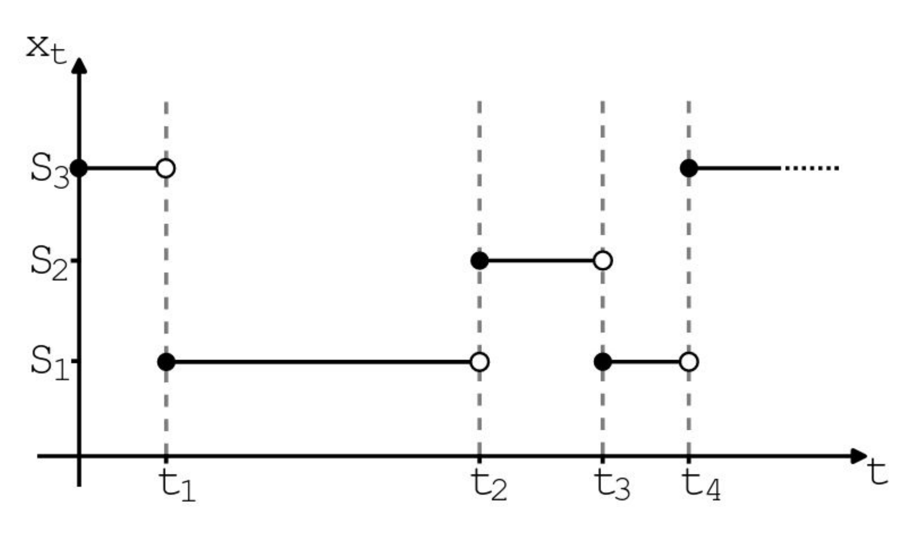
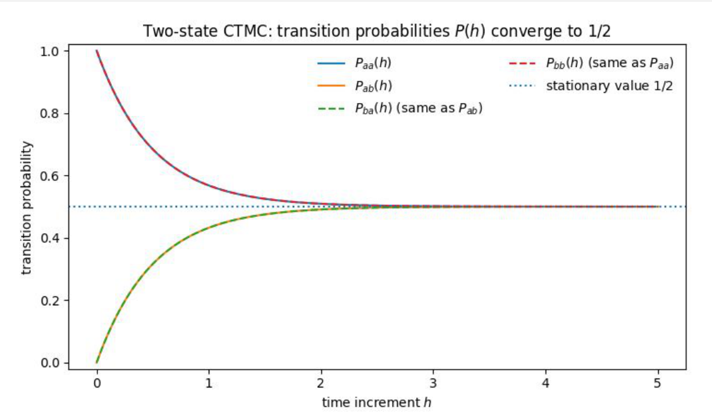
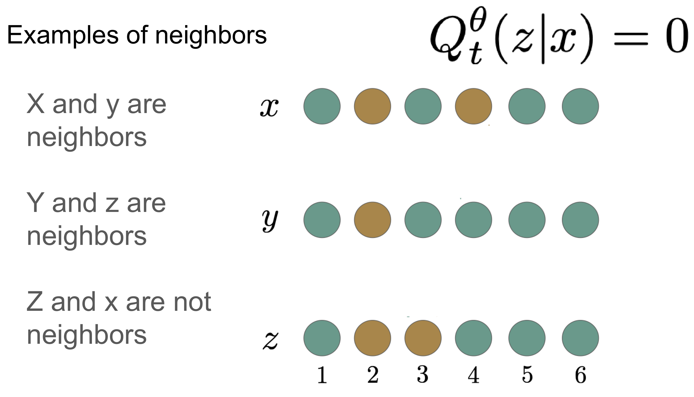
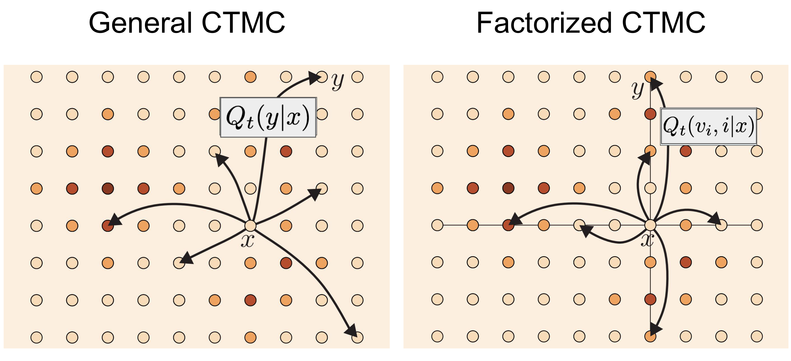
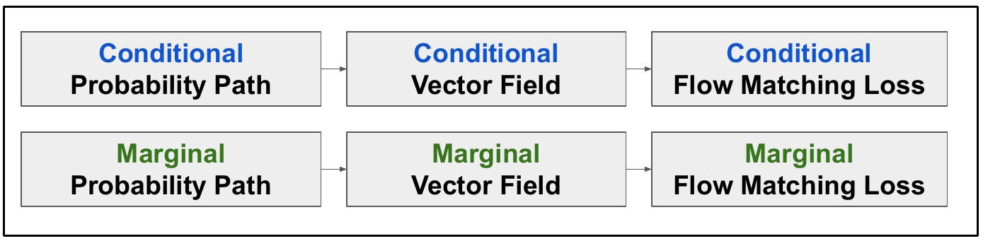
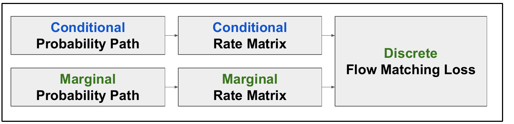
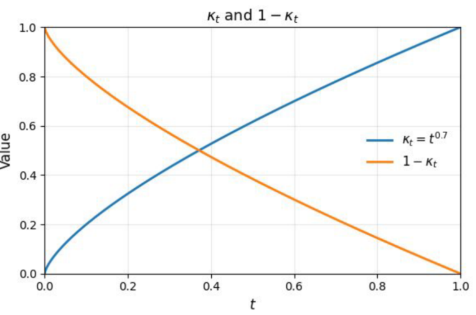
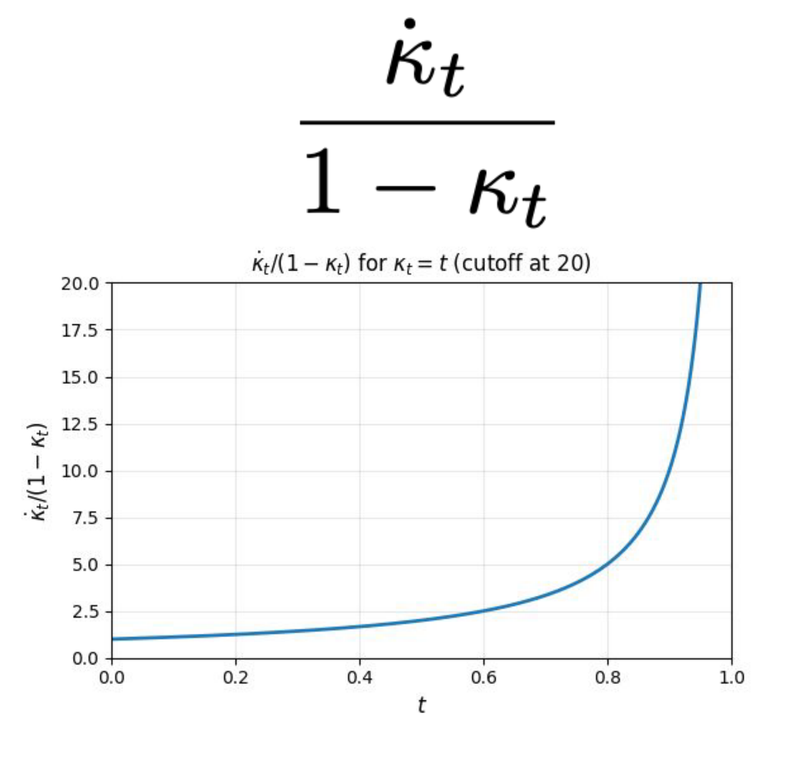
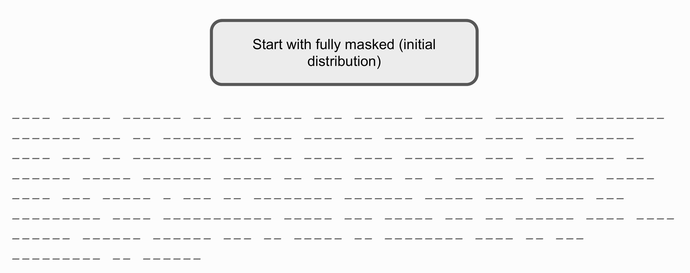
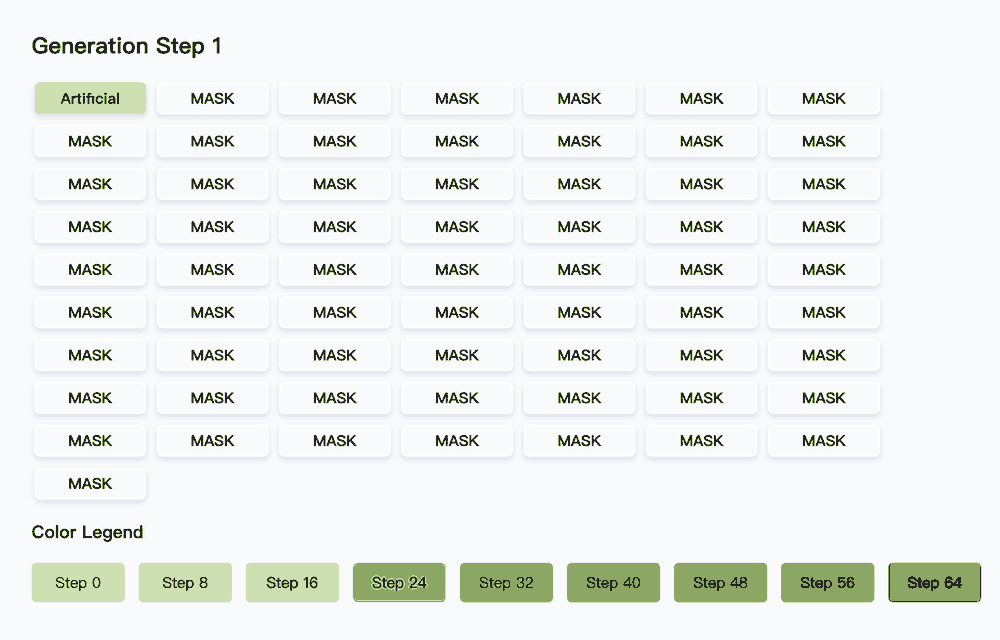

前面几讲讨论的都是连续空间上的过程：数据可以写成连续向量，加噪与去噪都能用 SDE 或 ODE 描述。语言和蛋白质序列则不同，它们是离散数据——一个 token 只能取词表里的某个值，不存在“移动一点”这样的中间状态。

离散扩散模型（discrete diffusion model）把去噪和流匹配的学习原则搬到了离散状态上，这个方向也因此频繁出现在新闻里：Google 在 I/O 上发布的 [Gemini Diffusion](https://blog.google/technology/google-deepmind/gemini-diffusion/) 用扩散过程生成文本，官方演示的采样速度约为 1500 tokens/s；Inception Labs 声称在 NVIDIA H100 上超过 1000 tokens/s；字节跳动发布了基于离散扩散的 Seed Diffusion。

<figure>
  
  <figcaption>图 1：离散扩散模型出现在新闻报道中。图源：MIT 6.S184 Lecture 5；拼图素材来自 Forbes、Fortune、Inception Labs 与 ByteDance Seed 的公开发布。</figcaption>
</figure>

与自回归（autoregressive）模型不同，扩散语言模型不是严格从左到右生成的，而是按任意顺序生成文本（generate text in arbitrary order）：每一步都能看到整段序列的所有位置，并同时决定哪些位置需要更新。这条路线可以追溯到 Austin 等人 2021 年的工作 [<em>Structured Denoising Diffusion Models in Discrete State-Spaces</em>](https://arxiv.org/abs/2107.03006)，他们提出的离散去噪扩散概率模型（Discrete Denoising Diffusion Probabilistic Models，D3PM）把扩散过程推广到了离散状态空间。

## 1. 连续时间马尔可夫链（Continuous-Time Markov Chains，CTMC）

离散状态空间里既没有 SDE，也没有 ODE：连续空间中的演化可以靠“沿向量场移动一小步”来描述，而离散状态只能整块地从一个值变成另一个值。替代品是连续时间马尔可夫链（CTMC），它把时间当作连续的，把状态的变化当作瞬间的跳变。

### 1.1. 状态空间与速率矩阵

先列出这一节要用到的记号：

- <strong>状态空间</strong>（state space）\(S\)：系统所有可能状态的集合。
- \(d\)：序列长度。一个状态写成 \(x = (x_1, \dots, x_d) \in S\)，也就是一条长度为 \(d\) 的序列。
- <strong>词表</strong>（vocabulary）\(V\)：每个位置 \(x_i\) 的取值范围，因此状态空间的大小为 \(|V|^d\)。
- \((X_t)_{t \ge 0}\)：取值于 \(S\) 的随机过程，\(X_t\) 表示系统在时刻 \(t\) 所处的状态。
- \(p_{t+h|t}\)：从时刻 \(t\) 到时刻 \(t+h\) 的转移概率，其中 \(h \ge 0\) 是时间间隔。
- \(Q_t(y \mid x)\)：从状态 \(x\) 跳到状态 \(y\) 的速率。

CTMC 的全部信息都压缩在这些速率组成的<strong>速率矩阵</strong>（rate matrix）里。它随时间 \(t \in [0,1]\) 变化：

\[
Q: S \times S \times [0,1] \to \mathbb{R}_{\ge 0}, \qquad (x, y, t) \mapsto Q_t(y \mid x)
\]

这些速率需要满足两条约束：

- 约束 1：\(Q_t(y \mid x) \ge 0\)，跳变速率非负。
- 约束 2：\(Q_t(x \mid x) = -\sum_{y \ne x} Q_t(y \mid x)\)，对角线元素取负值，其绝对值等于离开 \(x\) 的全部跳变速率之和，因此矩阵每一行之和为 0。

速率矩阵还有一个等价的无穷小刻画：它就是转移概率在 \(h = 0\) 处的导数。

\[
\left.\frac{d}{dh} p_{t+h|t}(X_{t+h} = y \mid X_t = x)\right|_{h=0} = Q_t(y \mid x)
\]

这个式子的含义是：当 \(h\) 很小时，从 \(x\) 跳到另一个状态 \(y \ne x\) 的概率约为 \(h \cdot Q_t(y \mid x)\)，即 \(Q_t(y \mid x)\) 是这段概率随 \(h\) 增长的斜率；而当 \(y = x\) 时，左边的导数取负值，正好对应约束 2 中的对角线元素。

由此定义的 \(Q_t\) 也叫这个过程的<strong>无穷小生成元</strong>（infinitesimal generator）：它不给出有限时间内的转移概率，只描述下一步往哪里跳、跳得多快。把演化方程按 Euler 方法离散一步，得到的也正是同样的近似 \(p_{t+h|t}(y \mid x) \approx h \cdot Q_t(y \mid x)\)（\(y \ne x\)）。

### 1.2. 样本路径：状态在随机时刻跳变

固定一次随机试验，得到的 \(t \mapsto X_t\) 是一条阶梯状的<strong>样本路径</strong>（sample path）：链在一段随机长度的时间（holding time）内停在某个状态，然后在某个随机时刻瞬间跳到另一个状态。

<figure>
  
  <figcaption>图 2：一条 CTMC 样本路径。链在 \(t_1, t_2, t_3, t_4\) 处依次经过 \(S_3 \to S_1 \to S_2 \to S_1 \to S_3\)，两次跳变之间状态保持不变。图源：MIT 6.S184 Lecture 5；插图：Andrew Campbell。</figcaption>
</figure>

### 1.3. 二状态例子：转移概率收敛到均匀分布

取最简单的状态空间 \(S = \{a, b\}\)，速率矩阵可以写成

\[
Q = \begin{pmatrix} -\lambda & \lambda \\ \lambda & -\lambda \end{pmatrix}
\]

行对应出发状态，列对应目标状态，所以两个方向的跳变速率都是 \(\lambda\)。解出演化方程（对 \(h\) 求导）后，间隔 \(h\) 的转移概率为

\[
\begin{pmatrix}
p(X_{t+h} = a \mid X_t = a) & p(X_{t+h} = a \mid X_t = b) \\
p(X_{t+h} = b \mid X_t = a) & p(X_{t+h} = b \mid X_t = b)
\end{pmatrix}
= \frac{1}{2}\begin{pmatrix}
1 + e^{-2\lambda h} & 1 - e^{-2\lambda h} \\
1 - e^{-2\lambda h} & 1 + e^{-2\lambda h}
\end{pmatrix}
\]

推导：间隔 \(h\) 的转移概率是怎么解出来的

记 \(a(h) = p(X_{t+h} = a \mid X_t = a)\)，\(b(h) = p(X_{t+h} = b \mid X_t = a)\)，两者之和恒为 1。先看从 \(a\) 出发、再走一小步 \(dh\) 之后仍然落在 \(a\) 的概率。这一小步里发生两次以上跳变的概率是 \(o(dh)\)，可以忽略，于是只剩两条路径：一直没有跳变，概率为 \(1 - \lambda\,dh\)；或者先跳到 \(b\) 再跳回 \(a\)，概率为 \(b(h)\,\lambda\,dh\)。两种情况相加得到

\[
a(h + dh) = a(h)\,(1 - \lambda\,dh) + b(h)\,\lambda\,dh + o(dh)
\]

两边减去 \(a(h)\)、除以 \(dh\) 再令 \(dh \to 0\)，就得到 1.1 节那个导数关系写出的演化方程

\[
a'(h) = \lambda\,(b(h) - a(h)) = \lambda\,(1 - 2a(h))
\]

初值是 \(a(0) = 1\)。这是一阶线性方程 \(a'(h) + 2\lambda\,a(h) = \lambda\)，两边乘积分因子 \(e^{2\lambda h}\) 后左边正好合成一个导数

\[
\frac{d}{dh}\left(e^{2\lambda h} a(h)\right) = \lambda\,e^{2\lambda h}
\]

对 \(h\) 积分得 \(e^{2\lambda h} a(h) = \frac{1}{2}e^{2\lambda h} + C\)，再用 \(a(0) = 1\) 定出 \(C = \frac{1}{2}\)，因此

\[
a(h) = \frac{1}{2} + \frac{1}{2}e^{-2\lambda h} = \frac{1}{2}\left(1 + e^{-2\lambda h}\right)
\]

由 \(a(h) + b(h) = 1\) 立即得到 \(b(h) = \frac{1}{2}\left(1 - e^{-2\lambda h}\right)\)。把出发点换成 \(b\)，就是把 \(a\) 与 \(b\) 的角色互换，于是得到正文里的转移概率矩阵。

当 \(h \to \infty\) 时指数项衰减到 0，矩阵收敛到全为 \(1/2\) 的矩阵：无论从 \(a\) 还是 \(b\) 出发，足够长时间后落在两个状态上的概率都是 \(1/2\)。

<figure>
  
  <figcaption>图 3：二状态 CTMC 的转移概率随间隔 \(h\) 的演化。对角项从 1 衰减到 \(1/2\)，非对角项从 0 增长到 \(1/2\)。图源：MIT 6.S184 Lecture 5。</figcaption>
</figure>

这个例子里，初始状态的信息会被逐渐“遗忘”，分布最终收敛到与初始状态无关的均匀分布。用 CTMC 做生成建模时利用的正是这一点：让初始分布充当与数据无关的噪声分布，再让模型学会把它逐步变成数据。

## 2. CTMC 模型（CTMC Models）

上一节把速率矩阵当成给定的对象。要做生成建模，还需要让它可学习：由神经网络输出所有的跳变速率。

### 2.1. 模型：用网络参数化速率矩阵

把速率矩阵交给一个带参数的神经网络来输出，记作 \(Q_t^\theta(y \mid x)\)，其中 \(\theta\) 是网络参数。

麻烦在于规模。状态空间的大小是 \(|S| = |V|^d\)，完整的速率矩阵因此有 \(|V|^{2d}\) 个条目，无论是存储还是学习都不现实。模型需要一条约束，把绝大多数速率直接设为零，这就是<strong>因子化条件</strong>（factorization condition）：

只要 \(x\) 与 \(y\) 有多于一个位置的取值不同，就令 \(Q_t^\theta(y \mid x) = 0\)。

换句话说，<strong>只有邻居之间才允许跳变</strong>。于是网络不必描述任意两个状态之间的关系，只需描述“把某一个位置换成别的 token”这一类跳变。

网络的输入是当前状态和时间 \((x, t)\)，一次前向传播后输出一个 \(d \times |V|\) 的数组，其中第 \(i\) 行对应第 \(i\) 个位置，第 \(j\) 列对应词表里的 token \(v_j\)；写成带下标的缩写形式就是：

\[
\begin{pmatrix}
Q_t^\theta(v_1, 1 \mid x) & Q_t^\theta(v_2, 1 \mid x) & \cdots & Q_t^\theta(v_{|V|}, 1 \mid x) \\
Q_t^\theta(v_1, 2 \mid x) & Q_t^\theta(v_2, 2 \mid x) & \cdots & Q_t^\theta(v_{|V|}, 2 \mid x) \\
\vdots & \vdots & \ddots & \vdots \\
Q_t^\theta(v_1, d \mid x) & Q_t^\theta(v_2, d \mid x) & \cdots & Q_t^\theta(v_{|V|}, d \mid x)
\end{pmatrix}
= \left(Q_t^\theta(v, i \mid x)\right)_{\substack{v \in V \\ i \in [d]}} \in \mathbb{R}^{d \times |V|}
\]

其中 \(Q_t^\theta(v, i \mid x)\) 表示把第 \(i\) 个位置的 token 换成 \(v\) 的速率：下标 \(v\) 遍历词表、\(i\) 遍历位置，填满这两个下标就还原成左边的矩阵，后文算法里的 \(Q_t^\theta(\cdot \mid X_t)\) 用的就是这个写法。

因子化条件已经把“同时改多个位置”的跳变排除掉了，所以网络只需要为每个位置输出一个 \(|V|\) 维的向量，共 \(d \times |V|\) 个数；当 \(v\) 就是位置 \(i\) 上原有的 token 时，这一项对应“不改动该位置”。跳回自身的对角线速率由约束 2 自动确定，不需要网络单独输出。

### 2.2. 因子化条件：只在邻居之间跳变

**定义一 邻居（Neighbors）**：两个状态 \(x\) 与 \(y\) 互为邻居，如果它们只有一个位置上的取值不同，即存在某个 \(i \in [d]\) 使得 \(x_i \ne y_i\)，而对所有 \(j \ne i\) 都有 \(x_j = y_j\)。

有了邻居的概念，因子化条件可以写成一句话：\(Q_t^\theta(y \mid x)\) 只在 \(x\) 与 \(y\) 互为邻居时才可能非零。

<figure>
  
  <figcaption>图 4：邻居的例子。\(x\) 与 \(y\) 只有第 4 个位置的取值不同，\(y\) 与 \(z\) 只有第 3 个位置的取值不同，所以这两对都是邻居；\(z\) 与 \(x\) 在第 3、4 两个位置上都不同，不是邻居，因此 \(Q_t^\theta(z \mid x) = 0\)。图源：MIT 6.S184 Lecture 5。</figcaption>
</figure>

对长度为 \(d\)、词表大小为 \(|V|\) 的序列，每个状态 \(x\) 的邻居共有 \(d(|V| - 1)\) 个：\(d\) 个位置各自可以换成剩下 \(|V| - 1\) 个 token 中的任意一个。因子化条件把可能跳变的目标从 \(|V|^d\) 个压缩到了这个数量级。

### 2.3. 因子化 CTMC 与一般 CTMC

- <strong>一般 CTMC</strong>（general CTMC）：允许一次跳变同时改变多个位置，因此需要为状态空间中每一对状态 \((x, y)\) 指定速率 \(Q_t(y \mid x)\)。
- <strong>因子化 CTMC</strong>（factorized CTMC）：把跳变限制为每次只改一个位置，速率随之写成 \(Q_t(v_i, i \mid x)\)，即把第 \(i\) 个位置换成 token \(v_i\)。

<figure>
  
  <figcaption>图 5：一般 CTMC 与因子化 CTMC。左图中从 \(x\) 出发的箭头可以指向网格中的任意状态，速率记为 \(Q_t(y \mid x)\)；右图的箭头只能沿着过 \(x\) 的水平线与垂直线，即只改变一个位置，速率记为 \(Q_t(v_i, i \mid x)\)。图源：MIT 6.S184 Lecture 5；插图：Yaron Lipman。</figcaption>
</figure>

两边的差别最终体现在参数量上：一般 CTMC 要指定 \(|V|^{2d}\) 个速率，因子化 CTMC 只需要 \(d|V|\) 个。这也是离散扩散模型能够训练起来的前提。

## 3. 采样：从 CTMC 模型生成样本

模型训练好之后，剩下的问题是怎么从它里面抽样本。这一步只需要回答两件事：从哪个分布出发，以及每一步怎样更新状态。

### 3.1. 采样公式：用一步展开近似转移概率

起点是<strong>极限分布</strong> \(p_{init} = \mathrm{Unif}_S\)，即状态空间里全部 \(|V|^d\) 个状态等概率。

> **delta 函数（delta function）**：\(\delta_y(X_t) = \begin{cases} 1, & y = X_t \\ 0, & y \ne X_t \end{cases}\)。它描述的是一个点质量分布——概率全部压在 \(X_t\) 这一个状态上，其余状态都是 0。

采样从 \(X_0 \sim p_{init}\) 开始，按步长 \(h > 0\) 往前推进。每一步需要的转移概率 \(p_{t+h|t}(\cdot \mid X_t)\) 没法直接从网络读出来，只能对 \(h\) 做一步泰勒展开：

\[
\begin{aligned}
X_{t+h} \sim p_{t+h|t}(y \mid X_t) &= p_{t|t}(y \mid X_t) + h\left.\frac{d}{dh}p_{t+h|t}(y \mid X_t)\right|_{h=0} \\
&= \delta_y(X_t) + h\,Q_t(y \mid X_t)
\end{aligned}
\]

第一项 \(p_{t|t}(y \mid X_t)\) 是零间隔的转移概率：时间没有流逝，状态不会改变，所以它等于 delta 函数 \(\delta_y(X_t)\)。

这份分布只在有限个状态上非零：留在 \(X_t\) 的概率是 \(1 + h\,Q_t(X_t \mid X_t)\)，跳到某个 \(y \ne X_t\) 的概率是 \(h\,Q_t(y \mid X_t)\)。

### 3.2. 采样算法：对每个位置并行做一步 Euler 更新

| **算法 7** 从因子化 CTMC 模型采样（Euler／τ-leaping） |
|-------------------------------|
| **输入**: 因子化速率网络 \(Q_t^\theta\)、初始分布 \(p_{init}\)、采样步数 \(n\) |
| 1: 设 \(t \leftarrow 0\) |
| 2: 设步长 \(h \leftarrow \frac{1}{n}\) |
| 3: 采样 \(X_0 \sim p_{init}\)，其中 \(X_0 = (X_0^{(1)}, \dots, X_0^{(d)}) \in V^d\) |
| 4: **for** \(i = 1, \dots, n\) **do** |
| 5: \(~~~~\)把网络输出读成因子化的跳变速率 \(\{q_j(v)\}_{j = 1..d,\ v \in V} \leftarrow Q_t^\theta(\cdot \mid X_t)\) |
| 6: \(~~~~\)**for** \(j = 1, \dots, d\)（并行）**do** |
| 7: \(~~~~~~~~\)\(x \leftarrow X_t^{(j)}\)，即第 \(j\) 个位置当前的 token |
| 8: \(~~~~~~~~\)按下面的式子定义该位置的 Euler 转移概率 \(\tilde p_{j,t}(\cdot \mid X_t^{(j)} = x)\) |
| 9: \(~~~~~~~~\)\(\tilde p_{j,t}(v \mid x) = \begin{cases} h\,q_j(v), & v \ne x \\ 1 - h\sum_{v' \in V \setminus \{x\}} q_j(v'), & v = x \end{cases}\) |
| 10: \(~~~~~~~~\)采样 \(X_{t+h}^{(j)} \sim \mathrm{Categorical}\left(\{\tilde p_{j,t}(v \mid x)\}_{v \in V}\right)\) |
| 11: \(~~~~\)**end for** |
| 12: \(~~~~\)设 \(t \leftarrow t + h\) |
| 13: **end for** |
| **输出**: \(X_1\) |

<figure>
  
  <figcaption>图 6：掩码扩散语言模型（Masked Diffusion Language Model，MDLM）的采样过程。序列从掩码出发，每一步把一部分位置替换成真实 token，替换顺序是随机的（动画中掩码位置显示为空白）。图源：<a href="https://s-sahoo.com/mdlm/">MDLM 项目页</a>，论文为 Sahoo 等人 <a href="https://arxiv.org/abs/2406.07524"><em>Simple and Effective Masked Diffusion Language Models</em></a>（NeurIPS 2024）。</figcaption>
</figure>

## 4. 生成建模：用 CTMC 把噪声变成数据

- <strong>数据分布</strong>（data distribution）\(p_{data}(z)\)，\(z \in S\)：希望模型最终生成的分布，例如互联网上的文本分布。
- <strong>初始分布</strong>（initial distribution）\(p_{init}(z)\)，\(z \in S\)：采样的起点，例如均匀分布 \(p_{init}(z) = \frac{1}{|S|}\)。
- <strong>目标</strong>：用一个 CTMC 把“噪声”变成数据，

\[
X_0 \sim p_{init} \xrightarrow{\ \text{CTMC}\ } X_1 \sim p_{data}
\]

## 5. 离散流匹配（Discrete Flow Matching）

### 5.1. 路线图：从条件概率路径到训练损失

<figure>
  
  <figcaption>图 7：连续流匹配的三步。上行的条件版本与下行的边缘版本一一对应。图源：MIT 6.S184 Lecture 5。</figcaption>
</figure>

<figure>
  
  <figcaption>图 8：离散流匹配把中间一环的向量场换成速率矩阵，其余一一对应。图源：MIT 6.S184 Lecture 5。</figcaption>
</figure>

### 5.2. 条件概率路径与边缘概率路径

<strong>条件概率路径</strong>（conditional probability path）\(p_t(x \mid z)\)（\(0 \le t \le 1\)，\(x, z \in S\)）：以数据点 \(z\) 为终点的那条路径。对每个固定的 \(z\)，它都是 \(S\) 上一个合法的概率分布：

\[
p_t(x \mid z) \ge 0, \qquad \sum_{x \in S} p_t(x \mid z) = 1
\]

两端是已知的：\(t = 0\) 时数据还没进来，\(t = 1\) 时数据已经确定：

\[
p_0(x \mid z) = p_{init}(x), \qquad p_1(x \mid z) = \delta_z(x)
\]

<strong>边缘概率路径</strong>（marginal probability path）\(p_t(x)\)：把数据点按数据分布 \(p_{data}\) 平均起来，就得到 \(X_t\) 的无条件分布：

\[
p_t(x) = \sum_{z \in S} p_t(x \mid z)\, p_{data}(z) = \mathbb{E}_{z \sim p_{data}}\left[p_t(x \mid z)\right]
\]

两端同样对齐：

\[
p_0 = p_{init}, \qquad p_1 = p_{data}
\]

一个常用的具体例子是<strong>因子化混合路径</strong>（factorized mixture path）。它用一个<strong>调度器</strong>（scheduler）\(\kappa_t\) 控制混合比例：\(0 \le \kappa_t \le 1\)，\(\kappa_0 = 0\)，\(\kappa_1 = 1\)，例如 \(\kappa_t = t^{0.7}\)（图 9）。

<figure>
  
  <figcaption>图 9：调度器 \(\kappa_t = t^{0.7}\) 与 \(1 - \kappa_t\) 随 \(t\) 的变化。图源：MIT 6.S184 Lecture 5。</figcaption>
</figure>

路径让每个位置独立地在噪声和数据之间做混合：

\[
p_t(x \mid z) = \prod_{j=1}^{d} \left[(1 - \kappa_t)\, p_{init}^{(j)}(x_j) + \kappa_t\, \delta_{z_j}(x_j)\right] \tag{5.2}
\]

其中 \(p_{init}^{(j)}\) 是初始分布在第 \(j\) 个位置上的边缘分布。两端都对得上：\(t = 0\) 时 \(\kappa_0 = 0\)，乘积退化成 \(p_{init}(x)\)；\(t = 1\) 时 \(\kappa_1 = 1\)，退化成 \(\delta_z(x)\)。

采样就是每个位置独立地二选一：\(m_j \sim \mathrm{Bernoulli}(\kappa_t)\) 取 1 时用数据 token \(z_j\)，否则从 \(p_{init}^{(j)}\) 抽一个噪声 token \(\xi_j\)，得到 \(x_j = m_j z_j + (1 - m_j)\, \xi_j\)。

### 5.3. 速率矩阵：条件版本与边缘版本

<strong>条件速率矩阵</strong>（conditional rate matrix）\(Q_t^z(y \mid x)\)（\(x, y \in S\)，\(0 \le t \le 1\)）：以数据点 \(z\) 为终点的那条条件概率路径 \(p_t(\cdot \mid z)\) 所对应的速率矩阵：

\[
X_0 \sim p_{init}, \quad X_t \sim \mathrm{CTMC}(Q_t^z) \implies X_t \sim p_t(\cdot \mid z)
\]

**定理一 离散边缘化技巧（Discrete Marginalization Trick）**：由

\[
Q_t(y \mid x) = \sum_{z \in S} Q_t^z(y \mid x)\, \frac{p_t(x \mid z)\, p_{data}(z)}{p_t(x)} \tag{5.3}
\]

定义的<strong>边缘速率矩阵</strong>（marginal rate matrix）\(Q_t(y \mid x)\) 满足

\[
X_0 \sim p_{init}, \quad X_t \sim \mathrm{CTMC}(Q_t) \implies X_t \sim p_t \implies X_1 \sim p_{data}
\]

> 权重里的分式是后验概率 \(p_t(z \mid x)\)：给定当前状态 \(x\)，它来自数据点 \(z\) 的可能性。

### 5.4. 柯尔莫哥洛夫前向方程（Kolmogorov Forward Equation，KFE）：速率矩阵如何决定概率的变化

速率矩阵 \(Q_t\) 只说明链往哪里跳、跳得多快；我们真正关心的是概率分布 \(p_t\)。把两者绑定在一起的是一条方程：速率矩阵为 \(Q_t\) 的 CTMC 沿着概率路径 \(X_t \sim p_t\)（\(0 \le t \le 1\)）演化，当且仅当

\[
\frac{d}{dt} p_t(x) = \sum_{y \in S} Q_t(x \mid y)\, p_t(y) \tag{5.4}
\]

这是<strong>柯尔莫哥洛夫前向方程</strong>（Kolmogorov Forward Equation，KFE），连续性方程在离散状态空间里的对应物——只是概率不是被搬运过去的，而是整块跳过去的。

#### 定理一的证明

有了式 (5.4) 的 KFE，5.3 节的定理一就只需要几行。起点是边缘路径的定义 \(p_t(x) = \sum_{z \in S} p_t(x \mid z)\, p_{data}(z)\)，两边对 \(t\) 求导：

\[
\begin{aligned}
\frac{d}{dt} p_t(x) &= \sum_{z \in S} \frac{d}{dt} p_t(x \mid z)\, p_{data}(z) \\
&= \sum_{z \in S} \left[\sum_{y \in S} Q_t^z(x \mid y)\, p_t(y \mid z)\right] p_{data}(z) \\
&= \sum_{y \in S} \left[\sum_{z \in S} Q_t^z(x \mid y)\, \frac{p_t(y \mid z)\, p_{data}(z)}{p_t(y)}\right] p_t(y) \\
&= \sum_{y \in S} Q_t(x \mid y)\, p_t(y)
\end{aligned}
\]

### 5.5. 因子化混合路径的条件速率矩阵：只在单个 token 上跳变

5.3 节的条件速率矩阵是对任意路径定义的，换成 5.2 节的因子化混合路径（式 (5.2)），它可以写成闭式，而且只在单个 token 上更新（因子化）：

\[
Q_t^z(y \mid x) = \left(Q_t^z(v_i, j \mid x_j)\right)_{v_i, j}
\]

\[
Q_t^z(v_i, j \mid x_j) = \frac{\dot\kappa_t}{1 - \kappa_t}\left(\delta_{z_j}(v_i) - \delta_{x_j}(v_i)\right) \tag{5.5}
\]

其中 \(v_i\) 是词表里的第 \(i\) 个 token，\(j\) 是位置，下标 \(v_i, j\) 选中的是「位置 \(j\) 上取到 \(v_i\)」这一项。因为一次只改一个 token，速率只取决于该位置上当前的 token \(x_j\)。把两个 delta 函数展开，得到四类情形：

\[
Q_t^z(v_i, j \mid x_j) = \frac{\dot\kappa_t}{1 - \kappa_t}
\begin{cases}
0, & x_j = z_j \\
1, & v_i = z_j,\ x_j \ne z_j \\
0, & v_i \ne z_j,\ v_i \ne x_j,\ x_j \ne z_j \\
-1, & v_i = x_j,\ x_j \ne z_j
\end{cases}
\]

- 当前 token 已经正确（\(x_j = z_j\)）：速率为 0，没什么要改的。
- 当前 token 错了，目标正是正确 token（\(v_i = z_j\)）：以速率 \(\frac{\dot\kappa_t}{1 - \kappa_t}\) 跳过去。
- 当前 token 错了，目标是另一个错误 token（\(v_i \ne z_j,\ v_i \ne x_j\)）：速率为 0，链不会从一个错误 token 跳到另一个错误 token。
- 目标是当前 token 自己（\(v_i = x_j\)）：对角线上的负元，大小正好等于跳出去的速率。

推导：闭式解 (5.5) 是怎么来的

固定位置 \(j\)。式 (5.2) 在该位置给出

\[
p_t(u \mid z_j) = (1 - \kappa_t)\, p_{init}^{(j)}(u) + \kappa_t\, \delta_{z_j}(u)
\]

当 \(u\ne z_j\) 时，\(\delta_{z_j}(u)=0\)，故 \(p_t(u\mid z_j)=(1-\kappa_t)p_{init}^{(j)}(u)\)。

令错误 token 只跳向 \(z_j\)。由 1.1 节的对角元约束和式 (5.4) 的 KFE，\(u\ne z_j\) 时有 \(\dot p_t(u\mid z_j)=Q_t^z(u,j\mid u)p_t(u\mid z_j)\)。代入上式，在 \(p_{init}^{(j)}(u)>0\)、\(t<1\) 时得到

\[
\begin{aligned}
Q_t^z(z_j,j\mid u)&=-Q_t^z(u,j\mid u) \\
&= -\frac{1}{p_t(u\mid z_j)}\frac{d}{dt}p_t(u\mid z_j) \\
&= -\frac{d}{dt}\log(1-\kappa_t) \\
&= \frac{\dot\kappa_t}{1-\kappa_t}.
\end{aligned}
\]

对当前 token \(x_j\ne z_j\)，跳向 \(z_j\) 的非对角元取上述速率，对角元取其相反数（1.1 节），其余元素为 0。两个 delta 函数分别选中这两项：

\[
\begin{aligned}
Q_t^z(v_i,j\mid x_j)
&= \frac{\dot\kappa_t}{1-\kappa_t}\delta_{z_j}(v_i)
-\frac{\dot\kappa_t}{1-\kappa_t}\delta_{x_j}(v_i) \\
&= \frac{\dot\kappa_t}{1-\kappa_t}\left(\delta_{z_j}(v_i)-\delta_{x_j}(v_i)\right).
\end{aligned}
\]

当 \(x_j=z_j\) 时两项抵消，速率为 0，因此同一式子也适用。代回单位置的 KFE 验算：

\[
\begin{aligned}
\sum_{v\in V}Q_t^z(u\mid v)\,p_t(v\mid z_j)
&= \frac{\dot\kappa_t}{1-\kappa_t}\left[\delta_{z_j}(u)-p_t(u\mid z_j)\right] \\
&= \dot\kappa_t\left[\delta_{z_j}(u)-p_{init}^{(j)}(u)\right] \\
&= \frac{d}{dt}p_t(u\mid z_j).
\end{aligned}
\]

右边正是式 (5.2) 的导数，因此式 (5.5) 满足 KFE。“错误 token 只跳向 \(z_j\)”是这里选取的构造条件。

速率在 \(t \to 1\) 时发散：\(\kappa_1 = 1\) 让分母 \(1 - \kappa_t\) 归零，而分子 \(\dot\kappa_t\) 在 \(t = 1\) 处并不归零（图 10 取的是 \(\kappa_t = t\)，分子恒为 1）。

<figure>
  
  <figcaption>图 10：速率里的系数 \(\dot\kappa_t / (1 - \kappa_t)\) 随 \(t\) 的变化，这里取 \(\kappa_t = t\)，纵轴在 20 处截断。图源：MIT 6.S184 Lecture 5。</figcaption>
</figure>

> 发散对应的是路径终点：\(\kappa_t \to 1\) 时全部概率质量已经压在数据点 \(z\) 上，还停在错误 token 上的样本必须被立刻纠正过来。

### 5.6. 条件/边缘路径与速率矩阵总结

#### 条件对象：因子化混合路径下有闭式

| 对象 | 记号 | 核心性质 | 因子化混合路径 |
| --- | --- | --- | --- |
| 条件概率路径 | \(p_t(x \mid z)\) | 在 \(p_{init}\) 和数据点 \(z\) 之间插值 | \(\prod_{j=1}^{d}\left[(1 - \kappa_t)\, p_{init}^{(j)}(x_j) + \kappa_t\, \delta_{z_j}(x_j)\right]\) |
| 条件速率矩阵 | \(Q_t^z(y \mid x)\) | 让 CTMC 沿条件路径演化 | \(Q_t^z(y \mid x) = \left(Q_t^z(v_i, j \mid x_j)\right)_{v_i, j}\) \(Q_t^z(v_i, j \mid x_j) = \frac{\dot\kappa_t}{1 - \kappa_t}\left(\delta_{z_j}(v_i) - \delta_{x_j}(v_i)\right)\) |

#### 边缘对象：由条件对象按后验加权求和

| 对象 | 记号 | 核心性质 | 公式 |
| --- | --- | --- | --- |
| 边缘概率路径 | \(p_t\) | 在 \(p_{init}\) 和 \(p_{data}\) 之间插值 | \(p_t(x) = \sum_{z \in S} p_t(x \mid z)\, p_{data}(z)\) |
| 边缘速率矩阵 | \(Q_t(y \mid x)\) | 让 CTMC 沿边缘路径演化 | \(Q_t(y \mid x) = \sum_{z \in S} Q_t^z(y \mid x)\, \frac{p_t(x \mid z)\, p_{data}(z)}{p_t(x)}\) \(Q_t(v_i, j \mid x) = \frac{\dot\kappa_t}{1 - \kappa_t}\left(p_{1\vert t}(z_j = v_i \mid x) - \delta_{x_j}(v_i)\right)\) |

> \(p_{1\vert t}(z_j = v_i \mid x)\) 是「当前状态为 \(x\) 时，位置 \(j\) 的终值等于 \(v_i\)」的条件概率，也是边缘速率矩阵里唯一需要网络预测的量。

推导：边缘速率矩阵的因子化闭式

要证的只是表格里的最后一行：把条件侧的闭式 (5.5) 代进边缘化技巧 (5.3)。

先看求和号里有哪些项。条件速率矩阵只在单个 token 上跳变，所以只有「位置 \(j\) 上取 \(v_i\)」这一项 \(y = (v_i, j)\) 非零，条件那一侧还可以退回到只依赖该位置的 \(x_j\)：

\[
Q_t(v_i, j \mid x) = \sum_{z \in S} Q_t^z(v_i, j \mid x_j)\, \frac{p_t(x \mid z)\, p_{data}(z)}{p_t(x)}
\]

代入 (5.5)，与 \(z\) 有关的只剩 \(\delta_{z_j}(v_i)\)，与 \(z\) 无关的系数提到求和号外面：

\[
Q_t(v_i, j \mid x) = \frac{\dot\kappa_t}{1 - \kappa_t} \sum_{z \in S} \left(\delta_{z_j}(v_i) - \delta_{x_j}(v_i)\right) \frac{p_t(x \mid z)\, p_{data}(z)}{p_t(x)}
\]

把求和拆成两项。第二项里的 \(\delta_{x_j}(v_i)\) 与 \(z\) 无关，提出后剩下的求和就是后验概率的全和：

\[
\sum_{z \in S} \frac{p_t(x \mid z)\, p_{data}(z)}{p_t(x)} = \frac{p_t(x)}{p_t(x)} = 1
\]

第一项只在 \(z_j = v_i\) 时保留，剩下的正是「给定当前状态 \(x\)，数据点在第 \(j\) 个位置上是 \(v_i\)」的后验概率。这里的 \(z\) 就是时刻 1 的终值，所以它写成 \(p_{1\vert t}\)：

\[
\sum_{z \in S} \delta_{z_j}(v_i)\, \frac{p_t(x \mid z)\, p_{data}(z)}{p_t(x)} = p_{1\vert t}(z_j = v_i \mid x)
\]

两项合起来就是表格里的闭式

\[
Q_t(v_i, j \mid x) = \frac{\dot\kappa_t}{1 - \kappa_t}\left(p_{1\vert t}(z_j = v_i \mid x) - \delta_{x_j}(v_i)\right)
\]

和条件侧不同，这个后验概率没有闭式：它要对所有数据点做加权求和，正是训练时要用网络拟合的那个量。

## 6. 训练：用交叉熵拟合后验概率

### 6.1. 离散流匹配损失：把后验概率当成分类问题

边缘速率矩阵的闭式 (5.5) 里只剩一个未知量：后验概率 \(p_{1\vert t}(z_j = v_i \mid x)\)，即「看到当前状态 \(x\)，位置 \(j\) 的终值是什么」。用一个网络去拟合它，记作<strong>后验概率网络</strong>（posterior probability network）\(p_{1\vert t}^\theta(z_j \mid x)\)。

训练方式是分类：输入含噪状态 \(x\) 和时间 \(t\)，每个位置输出词表上的一个分布，标签是该位置的真实 token \(z_j\)。逐位置各算一个交叉熵再求和，就是离散流匹配损失（Discrete Flow Matching loss）

\[
\mathcal{L}_{DFM}(\theta) = \mathbb{E}_{z \sim p_{data},\ t \sim \mathrm{Unif}[0,1],\ x \sim p_t(\cdot \mid z)}\left[\sum_{j=1}^{d} -\log p_{1\vert t}^\theta(z_j \mid x)\right]
\tag{6.1}
\]

期望里的 \(x\) 取自条件路径 \(p_t(\cdot \mid z)\)：条件路径有闭式，采一个 \(x\) 不需要网络。

### 6.2. 训练算法：一次前向算出所有位置

| **算法 8** 训练因子化 CTMC 模型（离散扩散） |
|-------------------------------|
| **输入**: 由序列 \(z \sim p_{data}\) 构成的数据集，其中 \(z = (z_1, \dots, z_d) \in V^d\)；每个位置的初始（噪声）token 边缘分布 \(p_{init}^{(j)}\)；调度 \(\kappa_t \in [0, 1]\)；输出每个位置词表 logits 的后验网络 \(f_\theta\)；优化器 \(\mathrm{OPT}\) |
| 1: **for** 每个训练迭代 **do** |
| 2: \(~~~~\)采样一个数据点 \(z \sim p_{data}\) |
| 3: \(~~~~\)采样时间 \(t \sim \mathrm{Unif}[0, 1]\)，并计算 \(\kappa \leftarrow \kappa_t\) |
| 4: \(~~~~\)采样含噪状态 \(x \sim p_t(\cdot \mid z)\)（因子化混合路径）： |
| 5: \(~~~~~~~~\)**for** \(j = 1, \dots, d\)（并行）**do** |
| 6: \(~~~~~~~~~~~~\)采样掩码 \(m_j \sim \mathrm{Bernoulli}(\kappa)\) |
| 7: \(~~~~~~~~~~~~\)采样噪声 token \(\xi_j \sim p_{init}^{(j)}\) |
| 8: \(~~~~~~~~~~~~\)令 \(x_j \leftarrow m_j z_j + (1 - m_j)\xi_j\) |
| 9: \(~~~~~~~~\)**end for** |
| 10: \(~~~~~~~~\)令 \(x \leftarrow (x_1, \dots, x_d)\) |
| 11: \(~~~~\)用网络 logits 预测终值 token 的后验：\(\ell_j(\cdot) \leftarrow f_\theta(x, t)_j \quad \Rightarrow \quad p_{1\vert t}^\theta(v \mid x)_j = \mathrm{Softmax}(\ell_j)(v)\) |
| 12: \(~~~~\)离散流匹配损失（\(z\) 的逐 token 负对数似然）：\(\mathcal{L}_{DFM}(\theta) \leftarrow \sum_{j=1}^{d}\left[-\log p_{1\vert t}^\theta(z_j \mid x)_j\right]\) |
| 13: \(~~~~\)更新参数：\(\theta \leftarrow \mathrm{OPT.STEP}(\nabla_\theta \mathcal{L}_{DFM}(\theta))\) |
| 14: **end for** |

## 7. 掩码扩散语言模型（Masked Diffusion Language Model，MDLM）：从全掩码生成文本

### 7.1. 词表与初始分布：用 [MASK] 表示「还没定下来」

前面的 \(p_{init}\) 一直取均匀分布，放到文本上就意味着初始状态是一串随机 token。掩码扩散语言模型换了一个更贴合文本的做法：往词表里加一个特殊 token <strong>[MASK]</strong>，它不参与真实文本，只表示这个位置还没有定下来，初始分布随之改成

\[
p_{init} = \delta_{[MASK]}
\]

即整条序列从一开始全部是 [MASK]。

这样做的直觉是：对文本来说「已经确定的 token」和「还没想好的位置」是两种本质不同的状态，均匀随机 token 把两者混在一起，模型得额外花力气分辨哪些 token 其实是噪声。把噪声显式标出来之后，条件路径上每个位置就只剩两种可能——真实 token \(z_j\) 或 [MASK]。这与 5.5 节的因子化混合路径正好对上：取 \(p_{init}^{(j)} = \delta_{[MASK]}\)，位置 \(j\) 就以概率 \(\kappa_t\) 是 \(z_j\)，以概率 \(1 - \kappa_t\) 是 [MASK]。边缘速率矩阵 (5.5) 里的那一项 \(\frac{\dot\kappa_t}{1 - \kappa_t}p_{1\vert t}(z_j = v_i \mid x)\)，说的正是一个还掩着的位置以什么速率跳向 token \(v_i\)。

> 采样流程本身不用改：算法 7 里只剩第 3 步的 \(X_0 \sim p_{init}\) 要换成「整条序列全取 [MASK]」。\(\kappa_t \to 1\) 时系数 \(\dot\kappa_t/(1 - \kappa_t)\) 发散（图 10），对应的是剩下的掩码位置必须被迅速填上。

### 7.2. 生成过程：掩码逐批揭开成完整文本

采样从 \(t = 0\) 出发，此时 \(X_0\) 是一整条 [MASK]。之后每一步把当前序列和时间 \(t\) 一起喂给网络，得到每个位置的后验分布 \(p_{1\vert t}^\theta(\cdot \mid x)\)，再按 (5.5) 的速率决定哪些掩码位置跳变成哪个 token；已经揭开的 token 留在原处。

<figure>
  
  <figcaption>图 11：掩码扩散语言模型的一次完整生成。序列从全掩码出发（Start with fully masked），按 \(t = 0.3\)、\(t = 0.6\)、\(t = 0.8\)、\(t = 1.0\) 的顺序逐批揭开；未被揭开的位置用短横线表示，长度对应真实 token 的长度。图源：MIT 6.S184 Lecture 5。</figcaption>
</figure>

整个流程在真实大模型上跑起来是什么样子，可以直接看 [LLaDA](https://arxiv.org/abs/2502.09992)（Large Language Diffusion Model）——一个 8B 的掩码扩散语言模型：

<figure>
  
  <figcaption>图 12：LLaDA 的生成过程。网格中每个方块是一个 token，每帧对应一次生成步（Generation Step）；颜色按揭晓时机从浅绿（Step 0）渐变到深绿（Step 64），标着 MASK 的位置还没有揭开。图源：<a href="https://github.com/NVlabs/Fast-dLLM">NVlabs/Fast-dLLM</a>，模型为 LLaDA。</figcaption>
</figure>

整个过程是并行的：一步之内可以同时揭开多个位置，不像自回归模型那样一次只推进一个 token。代价是每个位置的揭晓都要看当前整条序列，所以揭一批 token 的开销是一次完整的前向。
