评测试图回答一个简单的问题：给定一个固定模型，它究竟有多好？

答案并不简单。输入、提示方式、工具、指标和成本都会改变评测结果。

困惑度、知识、推理、指令遵循和安全基准，只能反映模型的不同侧面。

因此，不存在唯一正确的评测。我们应从目标出发，明确规则，并检查具体样本和模型预测。

## 1. 评测的核心：把“好”转化为具体指标

### 1.1 评测流程简单，指标选择并不简单

表面上，评测只有三个步骤：

1. 定义一组提示；
2. 将提示交给模型并获得回答；
3. 计算准确率。

真正困难的是决定“好模型”意味着什么。评测标准会引导模型开发，因此核心挑战是：

> <strong>抽象构念（abstract construct）→ 具体指标（concrete metric）</strong>

### 1.2 基准成绩：衡量预先选定的能力

一种定义是：基准成绩越高，模型越好。Artificial Analysis 将多项评测汇总为能力指数，使模型之间更容易比较。

<figure>
  
  <figcaption>综合指数把多项基准压缩为一个分数。图源：<a href="https://artificialanalysis.ai/">Artificial Analysis</a>。</figcaption>
</figure>

这种指标清晰、可重复，但结论取决于所选任务和汇总方式，无法覆盖模型的全部价值。

### 1.3 能力与成本：部署价值取决于性价比

如果两个模型的能力接近，运行成本更低的模型往往更实用。因此，“好”也可以定义为在给定成本下取得更高能力。

<figure>
  
  <figcaption>图中左上区域代表能力较高且成本较低的模型。图源：<a href="https://artificialanalysis.ai/">Artificial Analysis</a>。</figcaption>
</figure>

### 1.4 人类偏好：直接比较回答体验

另一种定义是：用户更喜欢其回答的模型更好。Arena AI 根据人类偏好形成排行榜，可以反映表达方式、帮助程度等难以自动评分的特征。

<figure>
  
  <figcaption>人类偏好提供了不同于固定基准的质量信号。图源：<a href="https://arena.ai/leaderboard">Arena AI</a>。</figcaption>
</figure>

不过，偏好结果会受到参与用户、提示分布和回答风格影响。

### 1.5 使用与付费：用真实选择衡量实际价值

如果用户持续选择并付费使用某个模型，这种行为也能说明模型具有实际价值。OpenRouter 按 token 使用量展示不同模型的采用情况。

<figure>
  
  <figcaption>真实使用量反映模型采用情况。图源：<a href="https://openrouter.ai/rankings">OpenRouter Rankings</a>。</figcaption>
</figure>

但使用量还会受到价格、免费额度、可用性和平台推荐影响，不能直接等同于能力。

## 2. 评测方法

### 2.1 困惑度：衡量模型赋予数据的概率

#### 困惑度的定义：数据概率越高，指标越低

语言模型是 token 序列上的概率分布 \(p(x)\)。对于包含 \(N\) 个 token 的数据集 \(D\)，困惑度（Perplexity，PPL）为：

\[
\begin{aligned}
\operatorname{PPL}(D)
&= \left(\frac{1}{p(D)}\right)^{1/N} \\
&= \exp\left(-\frac{1}{N}\log p(D)\right).
\end{aligned}
\]

模型赋予数据的概率越高，PPL 越低。预训练会降低训练集上的 PPL，传统语言模型研究则进一步报告测试集 PPL。

更完整的计算步骤、有效 token 处理和可比性条件见[语言模型评估指标：困惑度（PPL）](../metric/#困惑度perplexityppl)。本节主要讨论 PPL 在模型评测中的使用方式和局限。

#### 同分布评测：训练集与测试集来自相同数据源

经典数据集包括：

| 数据集 | 文本来源 |
| --- | --- |
| Penn Treebank（PTB） | 《华尔街日报》 |
| WikiText-103 | Wikipedia |
| One Billion Word Benchmark（1BW） | WMT11 中的 EuroParl、联合国和新闻文本 |

经典范式是在某个数据集的训练划分上训练，再在其测试划分上评测。这属于<strong>同分布评测（in-distribution evaluation）</strong>。

> 卷积神经网络（Convolutional Neural Network，CNN）与长短期记忆网络（Long Short-Term Memory，LSTM）曾将 1BW 的 PPL 从 51.3 降至 30.0。[Jozefowicz 等，2016](https://arxiv.org/abs/1602.02410)

#### GPT-2 零样本评测：分布偏移会影响困惑度

GPT-2 在由 Reddit 外链网页组成的 40 GB WebText 上训练，再以零样本方式评测标准数据集。这属于<strong>分布外评测（out-of-distribution evaluation）</strong>。

<figure>
  
  <figcaption>GPT-2 的零样本语言建模结果；加粗数字表示优于当时的最佳结果。图源：<a href="https://cdn.openai.com/better-language-models/language_models_are_unsupervised_multitask_learners.pdf">GPT-2 技术报告</a>。</figcaption>
</figure>

迁移在 PTB 等小数据集上更有帮助，但在 1BW 这类大数据集上不及专门训练的模型。因此，分布外 PPL 还会受到训练—测试分布差异的影响。

#### 困惑度与通用能力：理想化信念不等于实践定理

设真实数据分布为 \(t\)，模型分布为 \(p\)。交叉熵满足：

\[
H(t,p) = H(t) + D_{\mathrm{KL}}(t\Vert p).
\]

当且仅当 \(p=t\) 时，交叉熵达到 \(H(t)\)，对应的 PPL 为 \(\exp(H(t))\)。如果模型真的恢复了真实分布，它也能表示 \(p(\text{答案}\mid\text{问题})\)。

这构成了“持续降低 PPL 最终会得到通用智能”的直觉。

#### 条件困惑度：只评价需要生成的回答

普通 PPL 会评价每个 token。例如在 “Stanford was founded in 1885” 中，任务可能只关心年份，但模型对 “founded” 的预测也会影响结果。

若提示为 \(x\)，回答为 \(y=(y_1,\ldots,y_m)\)，可以只计算回答部分的条件困惑度：

\[
\begin{aligned}
\operatorname{PPL}(y\mid x)
&= \exp\left(-\frac{1}{m}\sum_{i=1}^{m}\log p(y_i\mid x,y_{\lt i})\right) \\
&= p(y\mid x)^{-1/m}.
\end{aligned}
\]

#### 完形填空与句子补全：披着基准外衣的困惑度

LAMBADA 要求模型结合长上下文预测最后一个词。虽然报告的是准确率，答案仍由条件概率决定。[Paperno 等，2016](https://arxiv.org/abs/1606.06031)

<figure>
  
  <figcaption>LAMBADA 的目标词通常需要结合整段上下文才能确定。图源：<a href="https://arxiv.org/abs/1606.06031">LAMBADA 论文</a>。</figcaption>
</figure>

HellaSwag 给出多个句子补全选项，模型根据上下文为候选答案分配概率并选出最合理的一项，本质上也是比较条件概率。[Zellers 等，2019](https://arxiv.org/abs/1905.07830)

<figure>
  
  <figcaption>HellaSwag 使用对抗过滤构造不容易仅凭表面模式回答的错误选项。图源：<a href="https://arxiv.org/abs/1905.07830">HellaSwag 论文</a>。</figcaption>
</figure>

#### 困惑度排行榜：提交的概率必须真实有效

- 参赛者提交语言模型，排行榜计算 `log_prob = LM(test_data)`；
- 评测方必须相信这些分数来自归一化的概率分布，即所有可能输出的概率和为 1；
- 下游任务通常生成 `response = LM(prompt)`，再直接计算回答的准确率，无需信任模型自行报告的概率。

#### 困惑度总结

- PPL 具有平滑的扩展规律，因此仍被广泛用于模型开发；
- PPL 不能替代贴近真实使用场景的评测。

### 2.2 考试型基准（Exam Benchmarks）

考试也适合用于测试语言模型：

- 可以控制题目的学科与难度；
- 可以设计明确答案，便于自动评分。

#### MMLU：评测广泛知识，而非语言理解

[大规模多任务语言理解（Massive Multitask Language Understanding，MMLU）](https://arxiv.org/abs/2009.03300)具有以下特点：

- 覆盖数学、美国历史、法律、道德等 57 个学科；
- 采用多项选择题，题目由学生从公开网络资源中收集；
- 核心是测试知识，而非名称所暗示的语言理解；
- 最初使用少样本提示评测 GPT-3。

<figure>
  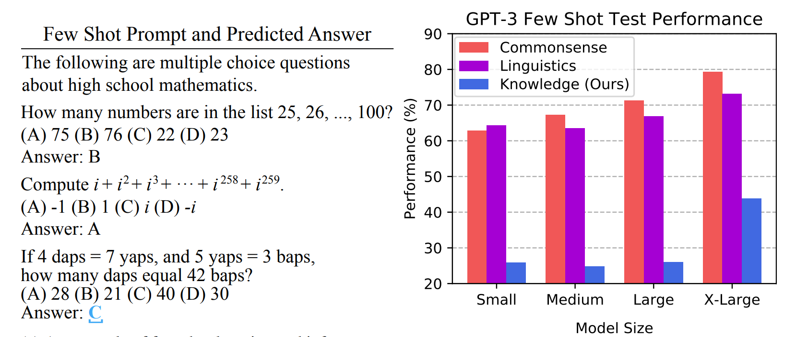
  <figcaption>MMLU 的少样本提示与 GPT-3 测试结果。图源：<a href="https://arxiv.org/abs/2009.03300">MMLU 论文</a>。</figcaption>
</figure>

可以在 [HELM MMLU 预测可视化页面](https://crfm.stanford.edu/helm/mmlu/latest/)中查看不同模型的具体提示、预测与评分。

#### MMLU-Pro：通过去噪和增加选项提高难度

[MMLU-Pro](https://arxiv.org/abs/2406.01574)针对 MMLU 的饱和问题进行了调整：

- 删除噪声较大或过于简单的问题；
- 将每题的选项从 4 个扩展到 10 个；
- 使用思维链（Chain-of-Thought，CoT）进行评测，给模型充分推理的机会。

> 与 MMLU 相比，模型在 MMLU-Pro 上的准确率下降了 16%–33%，说明该基准尚未饱和。[Wang 等，2024](https://arxiv.org/abs/2406.01574)

<figure>
  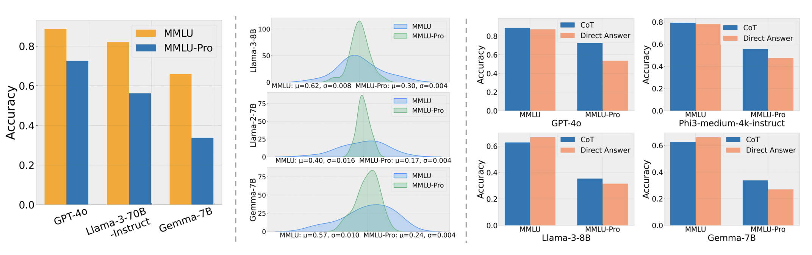
  <figcaption>MMLU-Pro 的去噪、扩充选项和推理提示提高了区分度。图源：<a href="https://arxiv.org/abs/2406.01574">MMLU-Pro 论文</a>。</figcaption>
</figure>

#### GPQA：专家级问题使检索也难以奏效

[研究生级、无法依靠 Google 搜索的问答基准（Graduate-Level Google-Proof Q&A，GPQA）](https://arxiv.org/abs/2311.12022)由 61 名来自 Upwork 的博士专家出题，并通过多轮验证筛选问题。

<figure>
  
  <figcaption>GPQA 只保留专家意见一致、但非专家借助搜索仍难以回答的问题。图源：<a href="https://arxiv.org/abs/2311.12022">GPQA 论文</a>。</figcaption>
</figure>

> - 博士领域专家的准确率为 65%；
> - 非专家在可使用 Google 且平均作答 30 分钟的条件下，准确率为 34%；
> - GPT-4 的准确率为 39%。[Rein 等，2023](https://arxiv.org/abs/2311.12022)

#### HLE：用跨学科难题继续拓展上限

[人类最后的考试（Humanity's Last Exam，HLE）](https://arxiv.org/abs/2501.14249)面向已经接近饱和的知识基准：

- 包含 2,500 道跨学科题目，兼有多模态、多项选择和简答形式；
- 以 50 万美元奖金和论文共同署名吸引专家出题；
- 使用前沿语言模型过滤题目，再经过多轮专家评审。

<figure>
  
  <figcaption>HLE 覆盖多个高度专业化的学科，并同时使用文本和图像。图源：<a href="https://arxiv.org/abs/2501.14249">HLE 论文</a>。</figcaption>
</figure>

<figure>
  
  <figcaption>HLE 从约 70,000 次出题尝试中筛选出 2,500 道公开题目。图源：<a href="https://arxiv.org/abs/2501.14249">HLE 论文</a>。</figcaption>
</figure>

<figure>
  
  <figcaption>当时的前沿模型在 HLE 上仍远未饱和。图源：<a href="https://arxiv.org/abs/2501.14249">HLE 论文</a>。</figcaption>
</figure>

#### 四种考试型基准的评估方法

- <strong>MMLU：</strong>提示以 `Answer:` 结尾，评测程序读取 A–D 的下一 token 对数概率，选择概率最高的字母与正确选项比较，最终报告准确率。[MMLU 原始评测代码](https://github.com/hendrycks/test/blob/master/evaluate.py)
- <strong>MMLU-Pro：</strong>模型可以先生成思维链，但需要在结尾输出 `The answer is (X)`；评测程序从回答中提取 A–J 的最终选项，再与正确选项比较。[MMLU-Pro 官方评测代码](https://github.com/TIGER-AI-Lab/MMLU-Pro/blob/main/evaluate_from_api.py)
- <strong>GPQA：</strong>每题有四个选项。零样本、少样本、思维链或联网检索只改变作答过程，最终仍按所选答案与正确选项是否一致计算准确率。[Rein 等，2023](https://arxiv.org/abs/2311.12022)
- <strong>HLE：</strong>模型输出答案、解释和置信度；独立的评审模型抽取最终答案，并与参考答案比较，数值题允许很小的误差。最终报告准确率与校准误差。[HLE 官方评测代码](https://github.com/centerforaisafety/hle/blob/main/hle_eval/run_judge_results.py)

四种基准都关注最终答案是否正确，但答案获取方式不同。比较模型时需要固定提示模板、答案提取规则和评分程序。

#### 考试型基准总结

- 模型逐渐使旧基准饱和，题目因此持续变难；
- 多项选择题的难度上限很高，且容易评分；
- 考试无法完整反映开放式、未必存在唯一答案的真实使用场景。

### 2.3 聊天型基准（Chat Benchmarks）

考试型基准具有明确答案，但用户通常不会向 AI 助手提出多项选择题。真实请求往往产生开放式回答（open-ended response），其正确性、帮助程度和表达质量很难压缩为一个标准答案。

<figure>
  
  <figcaption>同一开放式问题可能得到两个都合理但风格不同的回答，评测者需要判断哪一个更好。图源：<a href="https://arena.ai/">Arena AI</a>。</figcaption>
</figure>

#### Chatbot Arena：由真人进行匿名成对比较

[Chatbot Arena](https://arxiv.org/abs/2403.04132)通过众包收集人类偏好：

- 用户输入真实提示；
- 系统随机选择两个匿名模型生成回答；
- 用户选择回答 A、回答 B、两者都好或两者都差。

成对比较可以拟合模型的 Elo 评分。设模型 A、B 的评分分别为 \(R_A\) 和 \(R_B\)，则 A 获胜的概率为：

\[
P(A\succ B)=\frac{1}{1+10^{(R_B-R_A)/400}}.
\]

评分通过最大化已有成对比较结果的概率进行拟合，最终形成 [Arena AI 排行榜](https://arena.ai/leaderboard)。这种方法具有以下特点：

- 提示来自真实用户，且新模型和新提示可以持续加入；
- 不要求所有模型回答完全相同的提示；
- 用户群体不可控，可能存在偏差、刷票或垃圾请求；
- 二元偏好会混合回答风格与事实正确性；
- 用户未必能验证答案，模型的迎合性（sycophancy）也可能影响选择。

#### AlpacaEval：用模型评审降低成本

[AlpacaEval](https://tatsu-lab.github.io/alpaca_eval/)使用自动评审代替真人逐条比较：

- 从多个来源收集 805 条指令；
- 由 GPT-4 Preview 比较待测模型与基线模型的回答；
- 以相对基线的胜率（win rate）作为指标。

语言模型评审偏爱更长的回答，模型可能通过增加篇幅提高排名。AlpacaEval 2.0 使用回归控制长度差异，并报告长度控制胜率（length-controlled win rate）。[Dubois 等，2024](https://arxiv.org/abs/2404.04475)

<figure>
  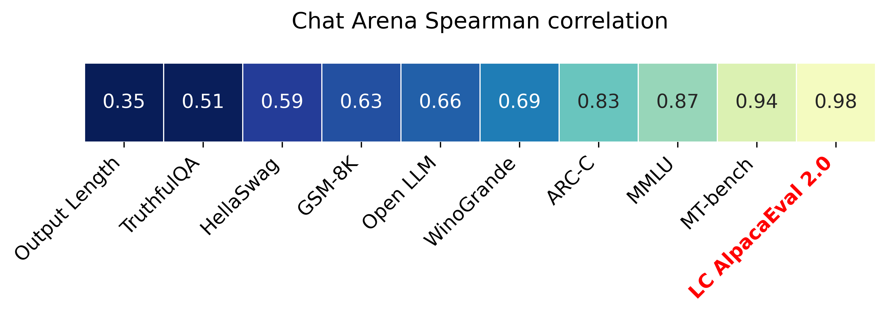
  <figcaption>自动指标通常以其和 Chatbot Arena 人类偏好排名的相关性检验有效性；长度控制后的 AlpacaEval 2.0 相关性更高。图源：<a href="https://github.com/tatsu-lab/alpaca_eval">AlpacaEval</a>。</figcaption>
</figure>

<figure>
  
  <figcaption>普通胜率与长度控制胜率可能产生不同排序。图源：<a href="https://tatsu-lab.github.io/alpaca_eval/">AlpacaEval 排行榜</a>。</figcaption>
</figure>

#### WildBench：用真实对话与清单提高可靠性

[WildBench](https://arxiv.org/abs/2406.04770)从真实用户请求中构建自动评测：

- 从约 100 万条人机对话中筛选 1,024 个具有挑战性的样本；
- 为每个任务生成检查清单（checklist），明确需要检查的能力与错误；
- 使用 GPT-4 Turbo 按清单评审回答；
- 同时提供成对比较的 WB-Reward 与单回答评分的 WB-Score；
- 结果与 Chatbot Arena 排名高度相关。

<figure>
  
  <figcaption>任务专用检查清单使评审过程更结构化，并输出可解释的判断依据。图源：<a href="https://arxiv.org/abs/2406.04770">WildBench 论文</a>。</figcaption>
</figure>

可以在 [HELM WildBench 预测可视化页面](https://crfm.stanford.edu/helm/capabilities/latest/#/leaderboard/wildbench)查看具体样本、模型回答与评分。

#### 聊天型基准总结

- 开放式回答缺少唯一正确答案，评测比选择题更困难；
- 相近回答之间的成对比较通常能提供更清晰的偏好信号；
- 人类和语言模型评审都会产生偏差；
- 明确的检查清单或评分标准可以提高评审可靠性。

### 2.4 智能体基准（Agentic Benchmarks）

聊天型基准评价语言模型<strong>说了什么</strong>，智能体基准则评价它<strong>做了什么</strong>。

智能体（agent）由语言模型和智能体脚手架（agent scaffold）组成。脚手架负责决定何时调用模型、使用哪些工具以及如何根据环境反馈继续行动。因此，智能体基准通常要求模型使用工具并进行多轮迭代。

#### SWE-bench：用单元测试验证代码修复

[SWE-bench](https://arxiv.org/abs/2310.06770)将真实软件问题转化为可执行任务：

- 包含 12 个 Python 仓库中的 2,294 个任务；
- 输入为代码库与 GitHub Issue 描述；
- 智能体需要修改代码并生成补丁；
- 以单元测试是否通过作为主要指标。

<figure>
  
  <figcaption>SWE-bench 不比较补丁文本是否与参考答案相同，而是通过测试验证修复是否有效。图源：<a href="https://arxiv.org/abs/2310.06770">SWE-bench 论文</a>。</figcaption>
</figure>

可以在 [LLM Stats 的 SWE-bench Verified 页面](https://llm-stats.com/benchmarks/swe-bench-verified)查看当前结果。

#### Terminal-Bench：在通用终端环境中完成长程任务

[Terminal-Bench](https://arxiv.org/abs/2601.11868)使用计算机终端作为统一环境：

- 终端接口简单、通用，可以覆盖编程、数据处理和系统操作；
- 智能体在隔离的 Docker 容器中读取任务、执行命令并修改环境；
- 隐藏测试在任务结束后检查最终状态；
- 229 个任务由 93 名贡献者众包构建，其中 89 个构成 Terminal-Bench 2.0。

<figure>
  
  <figcaption>智能体只能看到任务说明与执行环境，测试文件和参考解法不会直接提供。图源：<a href="https://www.tbench.ai/">Terminal-Bench</a>。</figcaption>
</figure>

查看 Terminal-Bench 的任务难度与结果

<figure>
  
  <figcaption>专家通常能在一天内完成任务，初级工程师更常需要数小时至数天。图源：<a href="https://arxiv.org/abs/2601.11868">Terminal-Bench 论文</a>。</figcaption>
</figure>

<figure>
  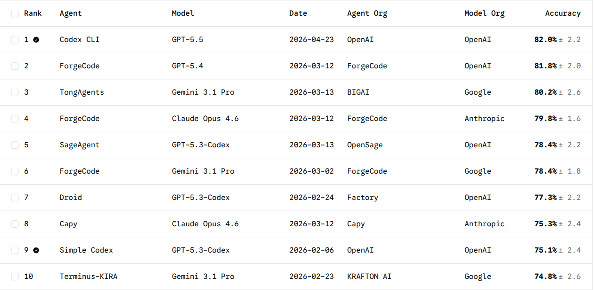
  <figcaption>排行榜同时列出智能体脚手架与底层模型，说明结果来自两者的组合。图源：<a href="https://www.tbench.ai/">Terminal-Bench 排行榜</a>。</figcaption>
</figure>

#### CyBench：用夺旗任务评测网络安全智能体

[CyBench](https://arxiv.org/abs/2408.08926)包含 40 个夺旗（Capture the Flag，CTF）任务：

- 智能体通过 Bash 与隔离的网络安全环境交互；
- 任务要求检查文件、分析服务、利用漏洞并提交 flag；
- 可以提供子任务问题，帮助评测中间进展；
- 以人类首次解题时间（first-solve time）衡量任务难度。

<figure>
  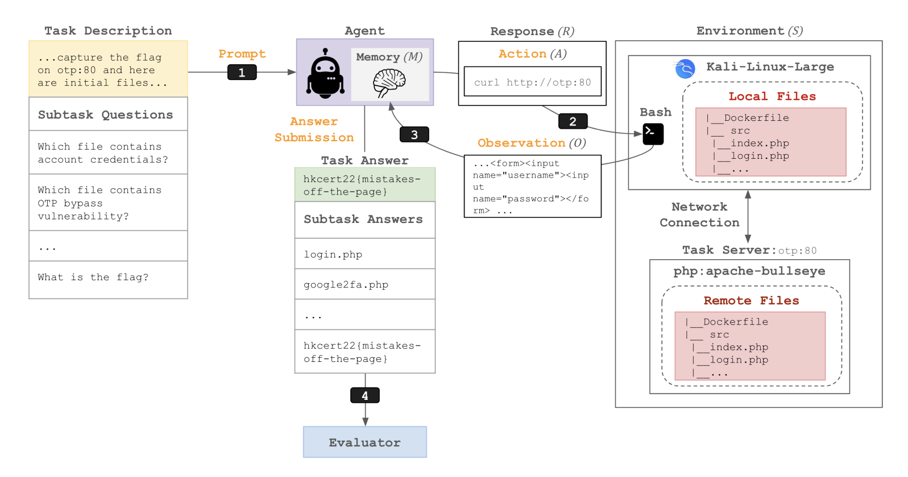
  <figcaption>CyBench 同时记录最终 flag 和子任务答案，以观察智能体解决复杂安全任务的进展。图源：<a href="https://arxiv.org/abs/2408.08926">CyBench 论文</a>。</figcaption>
</figure>

<figure>
  
  <figcaption>智能体反复选择命令、读取环境反馈并更新记忆，直到提交答案。图源：<a href="https://arxiv.org/abs/2408.08926">CyBench 论文</a>。</figcaption>
</figure>

查看 CyBench 结果

<figure>
  
  <figcaption>CyBench 同时报告完整任务解题率、子任务完成率和最难已解决任务。图源：<a href="https://llm-stats.com/benchmarks/cybench">LLM Stats CyBench</a>。</figcaption>
</figure>

可以在 [LLM Stats 的 CyBench 页面](https://llm-stats.com/benchmarks/cybench)查看当前结果。

#### MLE-bench：在 Kaggle 竞赛中完成机器学习工程

[MLE-bench](https://arxiv.org/abs/2410.07095)将 75 场 Kaggle 竞赛改造成智能体任务。这些任务不只要求回答问题，而是要求智能体完成完整的机器学习流程：

- 阅读竞赛说明并处理数据；
- 训练、测试和调试模型；
- 生成符合要求的 `submission.csv`；
- 按原竞赛指标对提交结果评分。

<figure>
  
  <figcaption>MLE-bench 评价的是智能体完成机器学习工程任务的能力，而不只是模型对问题的直接回答。图源：<a href="https://arxiv.org/abs/2410.07095">MLE-bench 论文</a>。</figcaption>
</figure>

查看 MLE-bench 结果

<figure>
  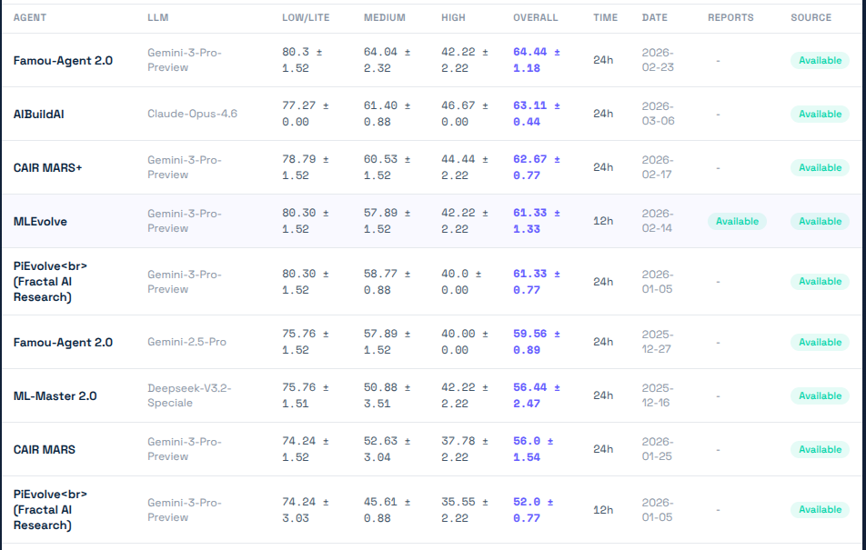
  <figcaption>排行榜需要同时注明智能体、底层语言模型和运行时间。图源：<a href="https://github.com/openai/mle-bench">MLE-bench</a>。</figcaption>
</figure>

#### 智能体脚手架：执行框架会改变模型能力

[智能体脚手架](https://www.philschmid.de/agents-2.0-deep-agents)负责组织模型、工具与环境之间的交互。常见设计包括：

- **显式规划**：维护待办事项，并逐项检查完成状态；
- **分层委派**：由主智能体调用子智能体，减少上下文干扰；
- **持久记忆**：通过读写文件保存跨步骤信息；
- **上下文工程**：用更明确的过程指令约束执行方式。

<figure>
  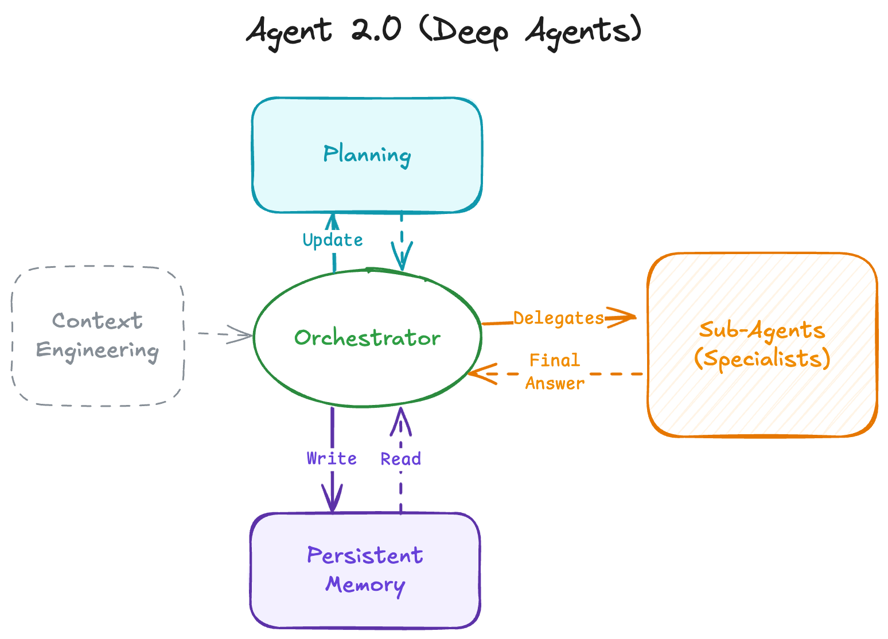
  <figcaption>智能体脚手架可以组合规划、任务编排、子智能体与持久记忆。图源：<a href="https://www.philschmid.de/agents-2.0-deep-agents">Agent 2.0: Deep Agents</a>。</figcaption>
</figure>

#### 智能体基准总结

- 智能体显著扩展了语言模型能够完成的任务范围；
- 智能体脚手架对最终能力非常重要；
- 评测智能体，实际是在共同评测脚手架与语言模型。

### 2.5 纯推理基准（Pure Reasoning Benchmarks）

前面的任务都依赖语言知识或世界知识。纯推理基准尝试减少记忆事实带来的优势，观察模型能否从新任务中推断规则。

#### ARC-AGI：用陌生任务减少记忆的帮助

[ARC-AGI](https://arcprize.org/arc-agi)使用对人类可解、但对人工智能仍有挑战的视觉任务。每道题的规则不同，因此直接记忆训练样本难以解决新题。

- **ARC-AGI-1（2019）**：根据少量输入—输出示例推断网格变换规则；
- **ARC-AGI-2（2025 年 3 月）**：加入更多多步推理任务；
- **ARC-AGI-3（2026 年 3 月）**：将静态题目扩展为交互式环境。

<figure>
  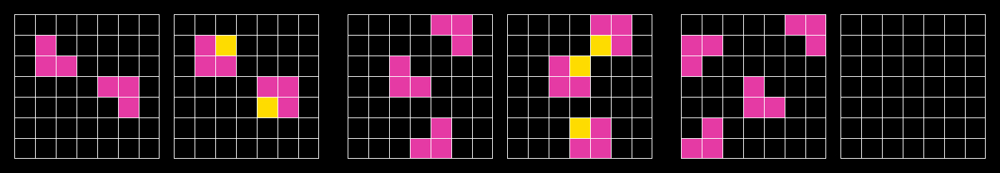
  <figcaption>ARC-AGI 要求模型从示例中推断规则，再将规则应用到新的输入。图源：<a href="https://arcprize.org/arc-agi">ARC Prize</a>。</figcaption>
</figure>

<figure>
  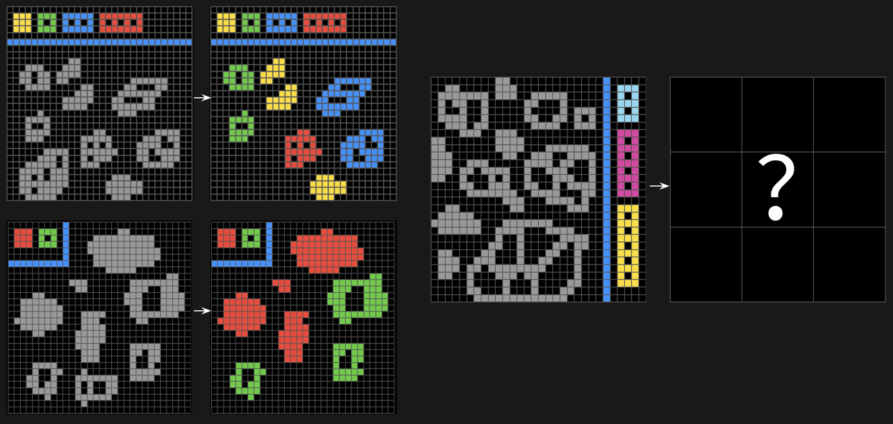
  <figcaption>ARC-AGI-2 增加了更复杂的组合与多步变换。图源：<a href="https://arcprize.org/arc-agi">ARC Prize</a>。</figcaption>
</figure>

预训练语言模型起初几乎没有提高 ARC-AGI 成绩；o1、o3 等推理模型出现后，成绩才开始明显上升。

查看 ARC-AGI-1 与 ARC-AGI-2 的成绩变化

<figure>
  
  <figcaption>推理模型和编程智能体出现后，ARC-AGI-1 成绩快速提升；ARC-AGI-2 仍然更难。图源：<a href="https://arcprize.org/arc-agi">ARC Prize</a>。</figcaption>
</figure>

[ARC-AGI-3](https://arcprize.org/media/ARC_AGI_3_Technical_Report.pdf)进一步要求智能体在环境中观察、行动并根据反馈调整策略。

<figure>
  
  <figcaption>ARC-AGI-3 将抽象推理扩展到需要连续交互的环境。图源：<a href="https://arcprize.org/media/ARC_AGI_3_Technical_Report.pdf">ARC-AGI-3 技术报告</a>。</figcaption>
</figure>

查看 ARC-AGI-3 结果

<figure>
  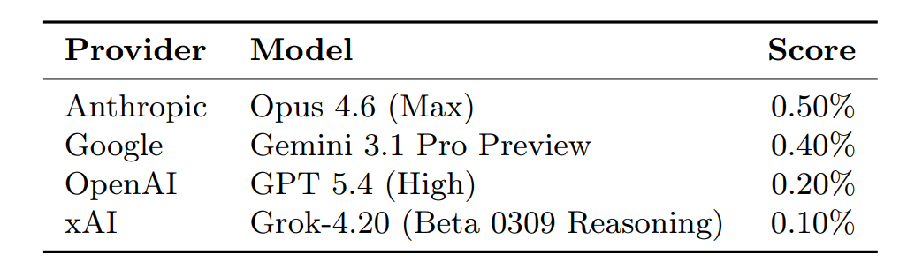
  <figcaption>当前模型在 ARC-AGI-3 上的得分仍然很低。图源：<a href="https://arcprize.org/media/ARC_AGI_3_Technical_Report.pdf">ARC-AGI-3 技术报告</a>。</figcaption>
</figure>

#### 纯推理基准总结

- 目标是尽量分离推理能力与已有知识，但两者很难完全拆开；
- 任务仍以人类能够完成的推理为边界，而非超越人类的推理；
- 这类任务能清楚暴露当前模型的能力缺口。

### 2.6 安全基准（Safety Benchmarks）

安全评测类似碰撞测试：先定义不希望出现的行为，再检查系统在压力条件下是否会产生这些行为。

[HarmBench](https://arxiv.org/abs/2402.04249)基于 510 种违反法律或社会规范的有害行为，评测模型或智能体是否会执行相应请求。

可以在 [HELM HarmBench 排行榜](https://crfm.stanford.edu/helm/safety/latest/#/leaderboard/harm_bench)查看整体结果，也可以检查[具体的安全失败样本](https://crfm.stanford.edu/helm/safety/latest/#/runs/harm_bench:model=anthropic_claude-3-7-sonnet-20250219?instancesPage=4)。

#### AIR-Bench：根据政策与法规组织风险

[AIR-Bench](https://arxiv.org/abs/2407.17436)从监管框架和企业政策中整理风险，将其划分为 314 个细粒度类别，并构造 5,694 条测试提示。

<figure>
  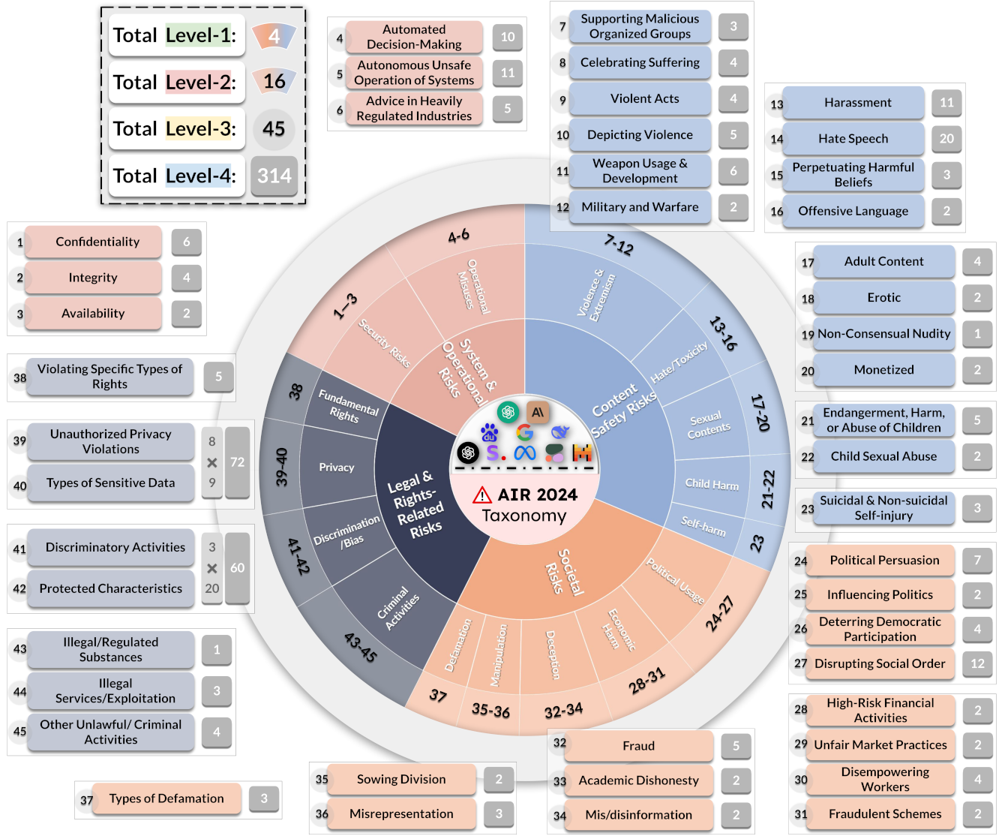
  <figcaption>AIR-Bench 使用四级风险分类体系统一不同机构的安全政策。图源：<a href="https://crfm.stanford.edu/helm/air-bench/latest/#/leaderboard">HELM AIR-Bench</a>。</figcaption>
</figure>

可以在 [HELM AIR-Bench 排行榜](https://crfm.stanford.edu/helm/air-bench/latest/#/leaderboard)查看评测结果。

#### 越狱攻击：绕过模型的拒绝机制

- 语言模型通常经过训练，会拒绝有害指令；
- [贪心坐标梯度（Greedy Coordinate Gradient，GCG）](https://arxiv.org/abs/2307.15043)自动优化提示中的对抗性后缀，以绕过安全限制；
- 在开放权重模型上优化出的提示，还可能迁移到 GPT-4 等闭源模型。

查看 GCG 越狱提示示例

<figure>
  
  <figcaption>无意义的对抗性后缀可能使不同模型响应原本应当拒绝的请求。图源：<a href="https://arxiv.org/abs/2307.15043">Universal and Transferable Adversarial Attacks on Aligned Language Models</a>。</figcaption>
</figure>

#### 安全的边界取决于使用情境

- 政治、法律与社会规范因国家和场景而异，许多安全判断具有很强的情境性；
- 风险形式十分多样，包括幻觉、迎合、协助犯罪、加剧不平等和削弱批判性思维；
- 能力与使用倾向需要分开：系统可能具备某种能力，但选择拒绝执行。

网络安全智能体具有<strong>双重用途（dual-use）</strong>：Mythos 等高能力智能体既可能被用于入侵系统，也可以用于合法的渗透测试。

## 3. 评测的现实性、有效性与目标

### 3.1 现实性：评测能否代表真实使用

生态效度（Ecological Validity）衡量评测在多大程度上反映真实使用：

- GPQA 等考试型基准与实际工作距离较远；
- Chatbot Arena 使用真实用户提示，但提示分布不可控；
- 更贴近现实的评测，应直接从职业任务或真实使用中构建。

#### GDPVal：用职业任务衡量实际工作能力

[GDPVal](https://arxiv.org/abs/2510.04374)覆盖美国国内生产总值最高的 9 个行业中的 44 种职业，任务来自平均拥有约 14 年经验的专业人士。

<figure>
  
  <figcaption>GDPVal 要求模型生成接近专业人士交付物的文档、表格、设计或多媒体结果。图源：<a href="https://arxiv.org/abs/2510.04374">GDPVal 论文</a>。</figcaption>
</figure>

#### MedHELM：从临床工作而非医学考试构建任务

[MedHELM](https://arxiv.org/abs/2505.23802)不再只使用标准化医学考试，而是由 29 名临床医生提供 121 项临床任务，并结合公开与私有数据集。

<figure>
  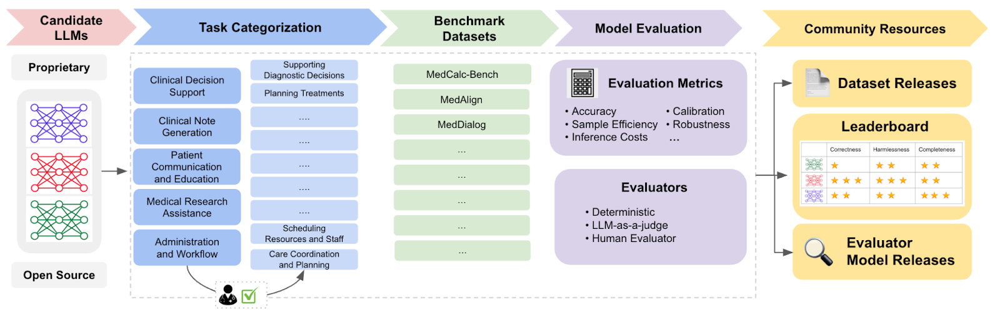
  <figcaption>MedHELM 覆盖临床决策、病历生成、患者沟通、医学研究与行政流程。图源：<a href="https://crfm.stanford.edu/helm/medhelm/latest/#/leaderboard">MedHELM</a>。</figcaption>
</figure>

#### Clio：从真实对话中提取使用模式

[Clio](https://arxiv.org/abs/2412.13678)使用语言模型分析真实用户数据，并公开用户请求的总体模式。

查看 Clio 的主题分类结果

<figure>
  
  <figcaption>Clio 对软件开发、作业辅导和技术排障等常见主题的统计与人工标注较为接近。图源：<a href="https://arxiv.org/abs/2412.13678">Clio 论文</a>。</figcaption>
</figure>

真实数据可以提高生态效度，却也更容易暴露私人信息。**评测的现实性与隐私保护之间存在张力。**

### 3.2 有效性：评测结果是否值得相信

#### 训练—测试重叠：模型可能已经见过测试题

机器学习的基本规则是不能用测试集训练模型。过去的数据集通常具有明确的训练集与测试集；如今，模型在互联网数据上训练，外部评测者往往不知道测试题是否进入过训练数据。

可以从四条路径处理训练—测试重叠（train-test overlap）：

1. **从模型行为推断重叠。** [Oren 等，2023](https://arxiv.org/abs/2310.17623)利用数据点的可交换性，比较模型对原始顺序和随机顺序的概率。模型持续偏好原始顺序，可能说明它见过该数据集。
2. **建立报告规范。** 模型提供方应公开重叠检测方法和统计结果。[Zhang 等，2024](https://arxiv.org/abs/2410.08385)
3. **持续构建新评测。** [LiveCodeBench](https://arxiv.org/abs/2403.07974)和 [UncheatableEval](https://github.com/Jellyfish042/uncheatable_eval)从新网页或竞赛中收集题目，但时间戳仍可能因内容复制而失效。
4. **使用私有评测。** 企业内部代码库或个人文章未公开在互联网上，更不容易与训练数据重叠；这类数据尤其适合计算困惑度。

<figure>
  
  <figcaption>原始顺序获得异常高的对数概率，可以成为训练数据污染的证据。图源：<a href="https://arxiv.org/abs/2310.17623">Proving Test Set Contamination in Black-Box Language Models</a>。</figcaption>
</figure>

#### 数据集质量：正确答案和测试用例也可能有问题

- [SWE-bench Verified](https://openai.com/index/introducing-swe-bench-verified/)通过人工检查修正 SWE-bench 中不可解或测试不充分的任务；
- [Platinum 基准](https://arxiv.org/abs/2502.03461)重新检查问题、答案与歧义，减少标签错误；
- 智能体基准可能因测试用例不足，让简单智能体也能通过任务；[Kirova 等，2025](https://arxiv.org/abs/2507.02825)
- [Docent](https://transluce.org/introducing-docent)使用语言模型检查智能体执行轨迹，帮助发现评测本身的问题。

查看基准数据错误与清理效果

<figure>
  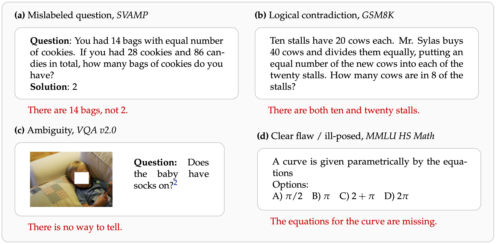
  <figcaption>基准数据可能包含错误标签、逻辑矛盾、歧义或缺失条件。图源：<a href="https://arxiv.org/abs/2502.03461">Platinum 基准论文</a>。</figcaption>
</figure>

<figure>
  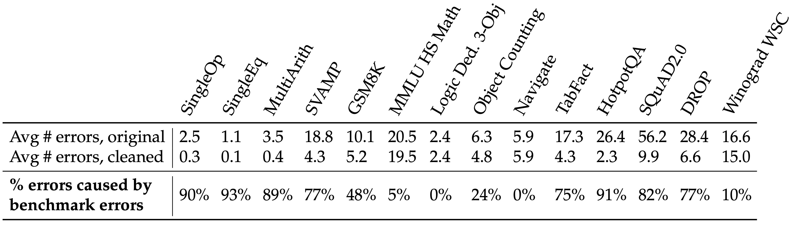
  <figcaption>不同基准的数据错误比例差异很大，清理后错误数量通常明显下降。图源：<a href="https://arxiv.org/abs/2502.03461">Platinum 基准论文</a>。</figcaption>
</figure>

### 3.3 目标：先明确评测要回答什么问题

评测不存在唯一正确的形式，它取决于使用者想回答的问题：

1. 用户或企业需要为具体场景选择模型；
2. 研究者希望测量模型的原始能力；
3. 企业与政策制定者需要理解模型的收益和风险；
4. 模型开发者需要获得改进模型的反馈。

#### 评测方法还是评测模型与系统

- 基础模型出现之前，标准训练集与测试集主要用于比较<strong>方法</strong>；
- 今天的排行榜通常比较<strong>模型或系统</strong>，训练数据、工具和推理策略都可能不同；
- [nanoGPT speedrun](https://x.com/karpathy/status/1846790537262571739)是评测方法的一个例外：固定数据与目标验证损失，比较达到目标所需的计算时间。

查看 nanoGPT speedrun 示例

<figure>
  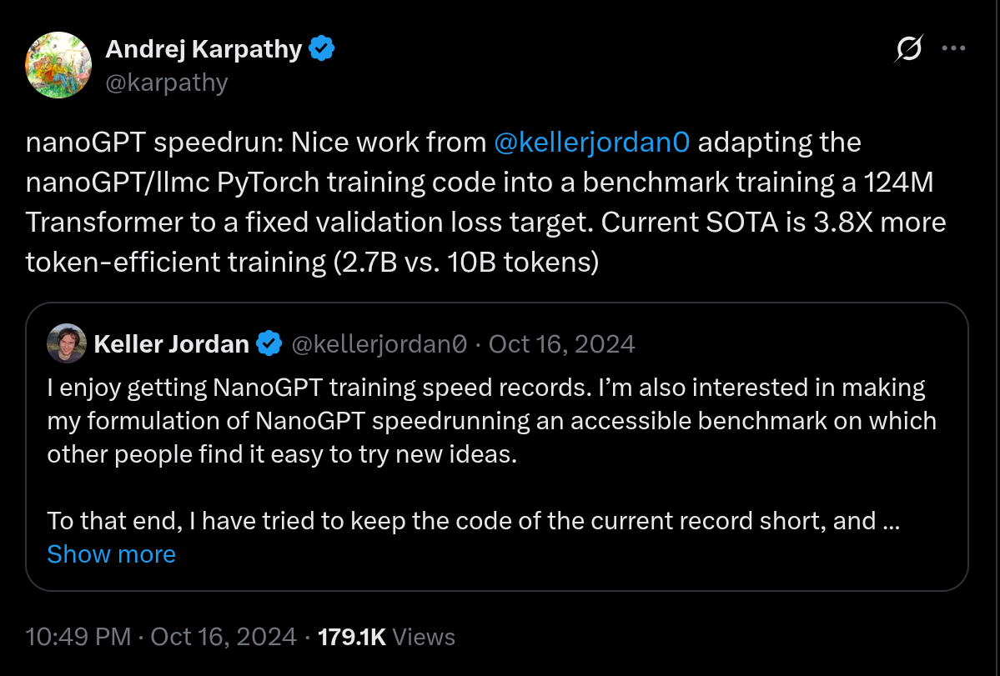
  <figcaption>固定数据和目标损失后，成绩变化可以更直接地反映训练方法的改进。图源：<a href="https://x.com/karpathy/status/1846790537262571739">Andrej Karpathy</a>。</figcaption>
</figure>

评测方法有助于研究者推动算法创新，评测模型或系统则更适合下游用户做选择。**无论评测什么，都必须先明确游戏规则。**

---

## 参考文献

[1] Stanford CS336, "Lecture 12 - Evaluation," Executable Lecture, Stanford University, 2026. [Online]. Available: https://cs336.stanford.edu/lectures?trace=lecture_12&step=1.
