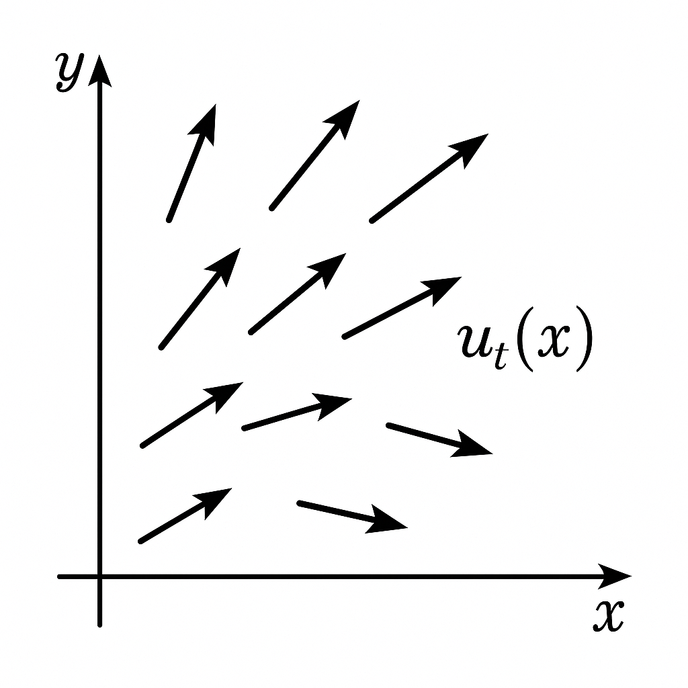
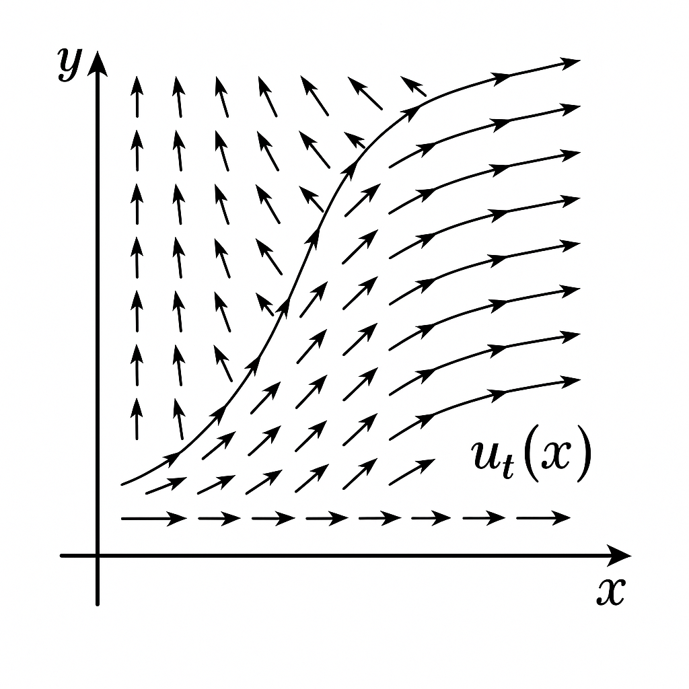
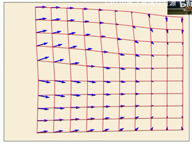

## 1. 生成对象

### 1.1. 将生成对象表征为向量

1. 图像：
    - 尺度维度：高度 $H$ 和 宽度 $W$
    - 颜色维度：三维颜色通道 RGB

$$
z \in \mathbb{R}^{H \times W \times 3}
$$

2. 视频：
    - 时间维度：时间帧 $T$
    - 每一帧为图像

$$
z \in \mathbb{R}^{T \times H \times W \times 3}
$$

3. 分子结构：
    - N 个原子
    - 每个原子包含三个维度
  
$$
z \in \mathbb{R}^{N \times 3}
$$

**我们可以将我们想要生成的目标表征为向量：**

$$
z \in \mathbb{R}^{d}
$$

---

### 1.2. 生成——从数据分布中采样

**数据分布**：我们想要生成的对象的分布$p_{data}$

**概率密度**：$p_{data}: \mathbb{R}^d \to \mathbb{R} \ge 0, z \mapsto p_{data}$


我们并不知道实际的概率密度


**生成**：意味着从数据分布中进行采样 $z \sim p_{data}$，采样 $z$ 如下：

---

### 1.3. 数据集——由数据分布中的样本组成

**数据集**：数据分布中有限数量的样本的集合 $z_1, \cdots, z_N \sim p_{data}$

---

### 1.4. 条件生成

**条件生成**：意味着从条件数据分布中进行采样 $z \sim p_{data}(\cdot | y)$

---

## 2. Flow and Diffusion Model

### 2.1. Flow Models

<dl class="definition-list">
  <dt>轨迹（Trajectory）</dt>
  <dd>
    $X: [0, 1] \to \mathbb{R}^d, t \mapsto X_t$
    
  </dd>
</dl>

<dl class="definition-list">
  <dt>向量场（Vector Feild）</dt>
  <dd>
    $u: R^d \times [0,1] \to \mathbb{R}^d, (x, t) \mapsto u_t(x)$
    
     其中 $x$ 表示点的位置，$u_t$ 表示向量方向
  </dd>
</dl>

<dl class="definition-list">
  <dt>常微分方程（Ordinary Differential Equation, ODE）</dt>
  <dd>
    初始条件
    $X_0 = x_0$
    
     
    常微分方程/动力学方程
    $dX_t/dt = u_t(X_t)$
    
  </dd>
</dl>

> $dX_t/dt$ 即为轨迹的切线，可以理解为速度，因此ODE描述了粒子在向量场中的运动

<dl class="definition-list">
  <dt>流（Flow）</dt>
  <dd>
    $\phi: \mathbb{R}^d \times [0, 1] \to \mathbb{R}^d, (t, x) \mapsto \phi_t(x)$
    
     其中 $\phi_t(x)$ 表示时间 $t$ 时刻，位置为 $x$ 的粒子沿着ODE轨迹运动到的新位置
     $\phi_0(x_0) = x_0$
    
     $\frac{d}{dt}\phi_t(x_0) = u_t(\phi_t(x_0))$
  </dd>
</dl>

流本质是针对许多初始条件的常微分方程解的集合

Flow 可视化：

