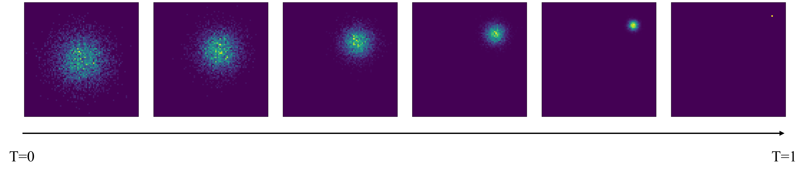
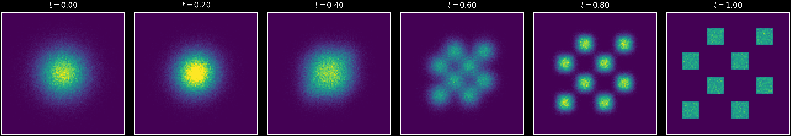
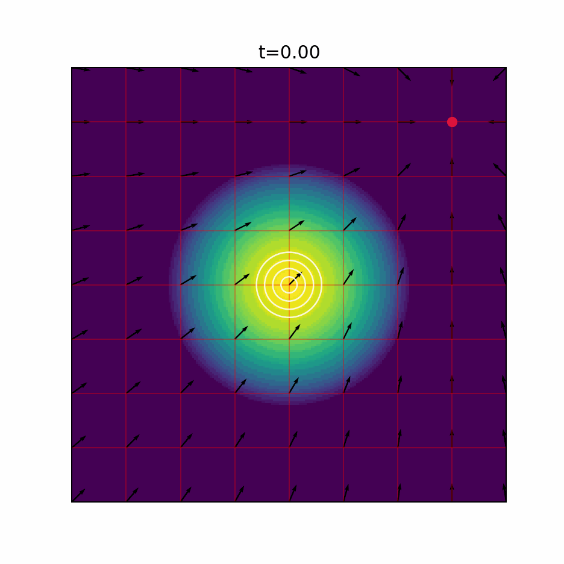
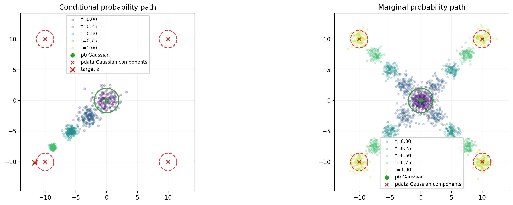
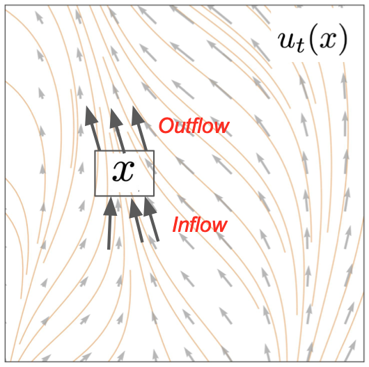
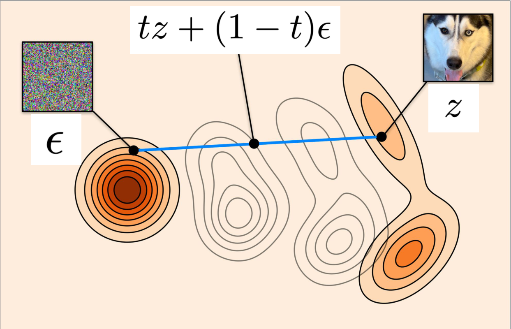

## 引言

流模型（Flow Model）和扩散模型（Diffusion Model）都从初始分布中采样 \(X_0 \sim p_{init}\)，其中 \(p_{init}\) 通常为高斯分布。两者的区别在于样本随时间演化的方式：

| 模型 | 初始化 | 动力学方程 |
| --- | --- | --- |
| 流模型 | \(X_0 \sim p_{init}\) | 常微分方程（Ordinary Differential Equation，ODE）： \(dX_t = u_t^\theta(X_t)dt\) |
| 扩散模型 | \(X_0 \sim p_{init}\) | 随机微分方程（Stochastic Differential Equation，SDE）： \(dX_t = u_t^\theta(X_t)dt + g_t dW_t\) |

其中，\(u_t^\theta\) 是由神经网络参数化的向量场，\(g_t\) 是扩散系数。生成样本时，从 \(t=0\) 到 \(t=1\) 模拟 ODE 或 SDE，并返回终点 \(X_1\)。

## 1. 训练目标

训练 = 找到参数 $\theta$，使得:

$$
X_0 \sim p_{init}, dX_t = u_t^{\theta}(X_t) dt~\text{or}~dX_t = u_t^{\theta}(X_t) dt + g_t dW_t
$$

最终找到：

$$
X_1 \sim p_{data}
$$

在回归和分类任务中，训练目标往往是数据标签（label），然而在生成模型中，训练目标为向量场 $u_t^{\theta}$。因此，我们通过最小化均方差（MSE）来拟合向量场：

$$
L(\theta) = || u_t^{\theta}(x) - u_t^{target}(x) ||^2
$$

## 2. 条件概率路径与边缘概率路径

**定义一 狄拉克测度**（Dirac measure，也可理解为点质量分布）：对 $z \in \mathbb{R}^d$，若 $X \sim \delta_z$，则 $X = z~a.s.$（即 $P(X = z) = 1$）。 

> 测度： 衡量集合大小的函数。
> - 长度测度：在 $(\mathbb R)$ 上，区间 $([a,b])$ 的测度是长度 $(b-a)$；
> - 面积测度：在 $(\mathbb R^2)$ 上，矩形 $([a,b]\times[c,d])$ 的测度是面积 $(b-a)(d-c)$；
> - 概率测度：在概率空间 $(\Omega, \mathcal{F}, P)$ 上，事件 $A \in \mathcal{F}$ 的测度是概率 $P(A)$。
>
> 狄拉克测度 $\delta_z$ 是一种特殊的概率测度，它将所有质量集中在单个点 $z$ 上：
> $$
> \delta_z(A)=
> \begin{cases}
> 1, & z\in A \\\\
> 0, & z\notin A \\\\
> \end{cases}
> $$

**定义二 条件概率路径（Conditional Probability Path）**：$\{P_t(\cdot|z), t \in [0,1]\}$，满足：
1. $P_t(\cdot|z)$ 是定义在 $\mathbb{R}^d$ 上的一个分布；
2. $P_0(\cdot|z) = P_{init},~P_1(\cdot|z) = \delta_z$。其中 $\delta_z$ 为狄拉克测度。

> 举例：高斯条件概率路径
> 
> $$
> P_t(\cdot|z) = \mathcal{N}(\alpha_t z, \sigma_t^2 I_d)
> $$
>
> 其中，我们令噪声调度函数（noise schedule）满足 $\alpha_t = t, \sigma_t = 1 - t$，则有 $\alpha_0 = 0, \sigma_0 = 1$，以及 $\alpha_1 = 1, \sigma_1 = 0$。
> 高斯条件概率路径如下图所示：
>
> 

**定义三 边缘概率路径（Marginal Probability Path）**：已知 $z \sim P_{data}$，$x \sim P_t(\cdot|z)$，边缘概率路径 $\{P_t, t \in [0,1]\}$（该分布与 $z$ 无关）满足：
1. $p_t(x) = \int p_t(x|z) p_{data}(z) dz$；
2. $P_0 = P_{init},~P_1 = P_{data}$。

> 边缘概率路径如下图所示：
>
> 

## 3. 条件向量场与边缘向量场

**定义四 条件向量场**（Conditional Vector Field）：$u_t^{target}(x|z), t \in [0,1], x,z \in \mathbb{R}^d$，使得：

$$
X_0 \sim P_{init}, \frac{d}{dt} X_t = u_t^{target}(X_t|z)
$$

可推出 $X_t$ 满足条件概率路径：

$$
X_t \sim P_t(\cdot|z), t \in [0,1]
$$

> $P_{init}$ 往往等于 $P_0(\cdot|z)$。

> 举例：高斯条件向量场
>
> 已知高斯条件概率路径为：
>
> $$
> P_t(\cdot|z) = \mathcal{N}(\alpha_t z, \sigma_t^2 I_d)
> $$
>
> 由于 $X_t \sim P_t(\cdot|z)$，因此 $X_t$ 可表示为：
>
> $$
> X_t = \alpha_t z + \sigma_t \epsilon,~\epsilon \sim \mathcal{N}(0, I_d)
> $$
>
> 对 $X_t$ 关于 $t$ 求导，得到高斯条件向量场：
>
> $$
> \frac{d}{dt} X_t = \dot{\alpha}_t z + \dot{\sigma}_t \epsilon = \dot{\alpha}_t z + \dot{\sigma}_t \frac{X_t - \alpha_t z}{\sigma_t} = \left(\dot{\alpha}_t - \frac{\dot{\sigma}_t}{\sigma_t}\alpha_t \right) z + \frac{\dot{\sigma}_t}{\sigma_t} X_t
> $$
>
> 即
>
> $$
> u_t^{target}(x|z) = \left(\dot{\alpha}_t - \frac{\dot{\sigma}_t}{\sigma_t}\alpha_t \right) z + \frac{\dot{\sigma}_t}{\sigma_t} x
> $$
>
> 其中 $\dot{\alpha}_t$ 和 $\dot{\sigma}_t$ 分别为 $\alpha_t$ 和 $\sigma_t$ 关于 $t$ 的导数。
> 该公式要求 $\sigma_t > 0$。对于 $\sigma_t=1-t$，它适用于 $0 \leq t < 1$；终点 $P_1(\cdot|z)=\delta_z$ 应理解为分布的极限。
>
> 

**定理一 边缘化技巧**/**定义五 边缘向量场**（Marginal Vector Field）：如果 $u_t^{target}(x|z)$ 是条件向量场，那么边缘向量场为：

$$
u_t^{target}(x) = \int u_t^{target}(x|z) P_{data}(z|x) dz \\\\
u_t^{target}(x) = \int u_t^{target}(x|z) \frac{p_t(x|z) p_{data}(z)}{p_t(x)} dz
$$

可推出 $X_t$ 满足边缘概率路径：

$$
X_0 \sim P_{init}, \frac{d}{dt} X_t = u_t^{target}(X_t) \Longrightarrow X_t \sim P_t, t \in [0,1] \Longrightarrow X_1 \sim P_{data}
$$

> 根据条件期望的定义：
>
> $$
> \mathbb{E}[Y|X_t = x] = \int Y(z) p(z|x) dz
> $$
>
> 令 Y(z) = $u_t^{target}(x|z)$，则有：
>
> $$
> u_t^{target}(x) = \mathbb{E}[u_t^{target}(x|z)|X_t = x] = \int u_t^{target}(x|z) p(z|x) dz
> $$
>
> 即得到了定理一中的第一个等式。

> 说人话就是：如果我们令 ODE（$X_0 \sim P_{init}, \frac{d}{dt} X_t = u_t^{target}(X_t|z)$）中的向量场为条件向量场，则 $X_t$ 满足条件概率路径；如果我们令 ODE（$X_0 \sim P_{init}, \frac{d}{dt} X_t = u_t^{target}(X_t)$）中的向量场为边缘向量场，则 $X_t$ 满足边缘概率路径：
> 1. 条件概率路径的终点为狄拉克测度（$P_1(\cdot|z) = \delta_z$），因此 $X_1 = z$；
> 2. 边缘概率路径的终点为数据分布（$P_1 = P_{data}$），因此 $X_1 \sim P_{data}$。
> 
> 这便是条件向量场和边缘向量场的核心差别。为什么导致了这样的差别呢？因为条件向量场是针对每个数据点 $z$ 定义的，而边缘向量场则是对所有数据点进行平均（边缘化）后（$p_t(x) = \int p_t(x|z) p_{data}(z) dz$）的结果。

> 

**定理 连续性方程**（来自流体力学）：给定任意初始化的 ODE：$X_0 \sim P_{init}, \frac{d}{dt} X_t = u_t(X_t)$，则 $p_t$ 满足以下偏微分方程：

> 
>
> 图示说明局部区域中概率质量沿向量场流入和流出的变化。

$$
\frac{d}{dt}p_t(x) = - \text{div}(p_t u_t)(x) \Longleftrightarrow X_t \sim P_t, t \in [0,1]
$$

这其中，$\text{div}$ 表示散度（divergence），定义为 $\text{div}(f)(x) = \sum_{i=1}^d \frac{\partial f_i(x)}{\partial x_i}$。而 $p_t(x)u_t(x)$ 是一个向量场，叫做**概率流**或**通量**：
- $p_t(x)$ 是概率密度，表示单位体积内的概率质量；
- $u_t(x)$ 是速度向量，表示单位时间内概率质量的流动方向和速率。

所以 $\text{div}(p_t u_t)(x)$ 表示在点 $x$ 处概率流的散度，即单位时间内流入或流出点 $x$ 的概率质量的净变化量。

> - 当 $\text{div}(p_tu_t)(x) > 0$ 时，局部概率质量净流出，密度下降；
> - 当 $\text{div}(p_tu_t)(x) < 0$ 时，局部概率质量净流入，密度上升；
> - 当 $\text{div}(p_tu_t)(x) = 0$ 时，局部密度不变。
>
> 这就是为什么散度 $\text{div}(p_t u_t)(x)$ 前面带有负号。
>
> 该公式的证明在此省略（因为我没学过流体力学，看不懂推导）。

## 4. 流匹配训练流程

| **算法 3** 流匹配训练流程（通用形式） |
| --- |
| **输入**：由样本 \(z \sim p_{data}\) 构成的数据集，神经网络向量场 \(u_t^\theta\) |
| 1: **for** 每个小批量数据 **do** |
| 2: \(\quad\)从数据集中采样一个数据样本 \(z\) |
| 3: \(\quad\)采样随机时间 \(t \sim \operatorname{Unif}[0,1]\) |
| 4: \(\quad\)从条件概率路径中采样 \(x \sim p_t(\cdot\mid z)\) |
| 5: \(\quad\)计算损失 \(\mathcal{L}(\theta)=\lVert u_t^\theta(x)-u_t^{target}(x\mid z)\rVert^2\) |
| 6: \(\quad\)在 \(\mathcal{L}(\theta)\) 上通过梯度下降更新模型参数 \(\theta\) |
| 7: **end for** |

> **例：高斯概率路径上的条件流匹配**
>
> 设条件概率路径为
>
> \[P_t(\cdot\mid z)=\mathcal{N}(\alpha_tz,\sigma_t^2I_d)\]
>
> 对应的条件向量场为
>
> \[u_t^{target}(x\mid z)=\left(\dot{\alpha}_t-\frac{\dot{\sigma}_t}{\sigma_t}\alpha_t\right)z+\frac{\dot{\sigma}_t}{\sigma_t}x\]
>
> 从条件概率路径中采样等价于先采样 \(\epsilon\sim\mathcal{N}(0,I_d)\)，再令
>
> \[x=\alpha_tz+\sigma_t\epsilon\]
>
> 将这一噪声采样方式代入条件流匹配损失：
>
> \[\mathcal{L}_{CFM}(\theta)=\mathbb{E}_{\substack{t\sim\operatorname{Unif}[0,1],\ z\sim p_{data},\ x\sim p_t(\cdot\mid z)}}\left[\left\lVert u_t^\theta(x)-u_t^{target}(x\mid z)\right\rVert^2\right]\]
>
> \[=\mathbb{E}_{\substack{t\sim\operatorname{Unif}[0,1],\ z\sim p_{data},\ \epsilon\sim\mathcal{N}(0,I_d)}}\left[\left\lVert u_t^\theta(\alpha_tz+\sigma_t\epsilon)-u_t^{target}(\alpha_tz+\sigma_t\epsilon\mid z)\right\rVert^2\right]\]
>
> \[=\mathbb{E}_{\substack{t\sim\operatorname{Unif}[0,1],\ z\sim p_{data},\ \epsilon\sim\mathcal{N}(0,I_d)}}\left[\left\lVert u_t^\theta(\alpha_tz+\sigma_t\epsilon)-\left(\dot{\alpha}_tz+\dot{\sigma}_t\epsilon\right)\right\rVert^2\right]\]
>
> 因此，模型的输入是数据与噪声的组合 \(\alpha_tz+\sigma_t\epsilon\)，训练目标是对应的速度 \(\dot{\alpha}_tz+\dot{\sigma}_t\epsilon\)。

### 4.1 直线调度：模型预测数据与噪声之差

令高斯条件概率路径采用直线调度：

\[
\alpha_t=t,\qquad \sigma_t=1-t.
\]

此时条件概率路径和采样方式分别为：

\[
P_t(\cdot\mid z)=\mathcal{N}\left(tz,(1-t)^2I_d\right),
\qquad
x=tz+(1-t)\epsilon,\epsilon\sim\mathcal{N}(0,I_d).
\]

由于 \(\dot{\alpha}_t=1\)、\(\dot{\sigma}_t=-1\)，目标速度化简为 \(z-\epsilon\)。因此，条件流匹配损失变为：

\[
\begin{aligned}
\mathcal{L}_{CFM}(\theta)
&=\mathbb{E}_{\substack{t\sim\operatorname{Unif}[0,1],\ z\sim p_{data},\ \epsilon\sim\mathcal{N}(0,I_d)}}
\left[\left\lVert u_t^\theta(\alpha_tz+\sigma_t\epsilon)-\left(\dot{\alpha}_tz+\dot{\sigma}_t\epsilon\right)\right\rVert^2\right] \\
&=\mathbb{E}_{\substack{t\sim\operatorname{Unif}[0,1],\ z\sim p_{data},\ \epsilon\sim\mathcal{N}(0,I_d)}}
\left[\left\lVert u_t^\theta\left(tz+(1-t)\epsilon\right)-\left(z-\epsilon\right)\right\rVert^2\right].
\end{aligned}
\]

这条直线路径也称为条件最优传输（Conditional Optimal Transport，CondOT）路径。模型输入是噪声与数据的线性插值，训练目标是数据与噪声之差。

> 
>
> 直线调度从噪声 \(\epsilon\) 出发，沿直线移动到数据样本 \(z\)。图源：Yaron Lipman。

| **算法 4** CondOT 路径的流匹配训练流程 |
| --- |
| **输入**：由样本 \(z\sim p_{data}\) 构成的数据集，神经网络向量场 \(u_t^\theta\) |
| 1: **for** 每个小批量数据 **do** |
| 2: \(\quad\)从数据集中采样一个数据样本 \(z\) |
| 3: \(\quad\)采样随机时间 \(t\sim\operatorname{Unif}[0,1]\) |
| 4: \(\quad\)采样噪声 \(\epsilon\sim\mathcal{N}(0,I_d)\) |
| 5: \(\quad\)令 \(x=tz+(1-t)\epsilon\) |
| 6: \(\quad\)计算损失 \(\mathcal{L}(\theta)=\left\lVert u_t^\theta(x)-(z-\epsilon)\right\rVert^2\) |
| 7: \(\quad\)在 \(\mathcal{L}(\theta)\) 上通过梯度下降更新模型参数 \(\theta\) |
| 8: **end for** |

训练完成后，可以使用《流模型与扩散模型》中的[算法 1：利用欧拉方法从流模型中采样](../flow_and_diffusion_models/#213-流模型的定义)，沿学到的向量场从初始分布生成样本。

## 5. 条件/边缘路径与向量场总结

流匹配中的对象可以按照以下顺序理解：

| 层次 | 条件形式 | 边缘形式 | 作用 |
| --- | --- | --- | --- |
| 概率路径 | 条件概率路径 | 边缘概率路径 | 定义从噪声到数据的分布演化 |
| 向量场 | 条件向量场 | 边缘向量场 | 定义希望模型学习的训练目标 |
| 流匹配损失 | 条件流匹配损失 | 边缘流匹配损失 | 定义训练时最小化的目标函数 |

### 5.1 条件对象：均可由解析公式计算

| 对象 | 记号 | 核心性质 | 高斯例子 |
| --- | --- | --- | --- |
| 条件概率路径 | \(P_t(\cdot \mid z)\) | 在 \(P_{init}\) 和数据点 \(z\) 之间插值 | \(\mathcal{N}(\alpha_t z, \sigma_t^2 I_d)\) |
| 条件向量场 | \(u_t^{target}(x \mid z)\) | 对应的 ODE 沿条件路径演化 | \(\left(\dot{\alpha}_t - \frac{\dot{\sigma}_t}{\sigma_t}\alpha_t\right) z + \frac{\dot{\sigma}_t}{\sigma_t} x\) |
| 条件流匹配损失 | \(\mathcal{L}_{CFM}(\theta)\) | 训练时直接最小化的损失 | \(\mathbb{E}_{t,z,x}\!\left[\left\lVert u_t^\theta(x)-u_t^{target}(x\mid z)\right\rVert^2\right]\) |

其中，\(t\sim\operatorname{Unif}[0,1]\)、\(z\sim P_{data}\)、\(x\sim P_t(\cdot\mid z)\)。对于常用的高斯条件概率路径，这三个条件对象都有解析公式，因此可以直接采样并计算训练损失。

### 5.2 边缘对象：不可直接计算，但可以隐式学习

| 对象 | 记号 | 核心性质 | 公式 |
| --- | --- | --- | --- |
| 边缘概率路径 | \(P_t\) | 在 \(P_{init}\) 和 \(P_{data}\) 之间插值 | \(p_t(x) = \int p_t(x \mid z) p_{data}(z) \, dz\) |
| 边缘向量场 | \(u_t^{target}(x)\) | 对应的 ODE 沿边缘路径演化 | \(u_t^{target}(x) = \int u_t^{target}(x \mid z) \frac{p_t(x \mid z) p_{data}(z)}{p_t(x)} \, dz\) |
| 边缘流匹配损失 | \(\mathcal{L}_{FM}(\theta)\) | 理想情况下希望最小化的损失 | \(\mathbb{E}_{t,x}\!\left[\left\lVert u_t^\theta(x)-u_t^{target}(x)\right\rVert^2\right]\) |

在边缘流匹配损失中，\(t\sim\operatorname{Unif}[0,1]\)、\(x\sim P_t\)。边缘概率路径需要对整个数据分布积分，边缘向量场又依赖边缘密度，因此这些对象通常无法直接计算。不过，我们可以证明条件流匹配损失与边缘流匹配损失只相差一个与模型参数 \(\theta\) 无关的常数。

条件流匹配损失与边缘流匹配损失只相差常数的推导

根据边缘向量场的定义：

\[
u_t^{target}(X_t)
=\mathbb{E}\!\left[u_t^{target}(X_t\mid Z)\mid t,X_t\right].
\]

在条件流匹配的预测误差中加上再减去边缘向量场：

\[
u_t^\theta(X_t)-u_t^{target}(X_t\mid Z)
=\left(u_t^\theta(X_t)-u_t^{target}(X_t)\right)
-\left(u_t^{target}(X_t\mid Z)-u_t^{target}(X_t)\right).
\]

将上式代入条件流匹配损失并展开平方：

\[
\begin{aligned}
\mathcal{L}_{CFM}(\theta)
&=\mathbb{E}_{t,X_t}\!\left[
\left\lVert u_t^\theta(X_t)-u_t^{target}(X_t)\right\rVert^2
\right] \\
&\quad+\mathbb{E}_{t,Z,X_t}\!\left[
\left\lVert u_t^{target}(X_t\mid Z)-u_t^{target}(X_t)\right\rVert^2
\right] \\
&\quad-2\mathbb{E}_{t,Z,X_t}\!\left[
\left\langle
u_t^\theta(X_t)-u_t^{target}(X_t),
u_t^{target}(X_t\mid Z)-u_t^{target}(X_t)
\right\rangle
\right].
\end{aligned}
\]

下面分三步说明交叉项为什么为零。

1. **给定 \(t,X_t\) 后，只有 \(Z\) 仍然是随机的。**

   如果进一步写成给定 \(t,X_t=x\)，那么 \(u_t^\theta(x)\) 和 \(u_t^{target}(x)\) 都是已经确定的向量。此时仍然具有随机性的只有数据点 \(Z\)，因为同一个含噪样本 \(x\) 可能由不同的数据点 \(Z\) 产生。

2. **条件向量场关于 \(Z\) 的条件平均等于边缘向量场。**

   根据边缘向量场的定义，在固定 \(t,X_t=x\) 后：

   \[
   \begin{aligned}
   &\mathbb{E}\!\left[u_t^{target}(x\mid Z)\mid t,X_t=x\right] \\
   &\quad=\int u_t^{target}(x\mid z)
   \frac{p_t(x\mid z)p_{data}(z)}{p_t(x)}\,dz \\
   &\quad=u_t^{target}(x).
   \end{aligned}
   \]

   因此，条件向量场与边缘向量场之差的条件平均为零：

   \[
   \begin{aligned}
   &\mathbb{E}\!\left[
   u_t^{target}(X_t\mid Z)-u_t^{target}(X_t)
   \mid t,X_t
   \right] \\
   &\quad=\mathbb{E}\!\left[
   u_t^{target}(X_t\mid Z)\mid t,X_t
   \right]-u_t^{target}(X_t) \\
   &\quad=u_t^{target}(X_t)-u_t^{target}(X_t)=0.
   \end{aligned}
   \]

3. **对交叉项使用全期望公式。**

   先对给定的 \(t,X_t\) 计算条件期望，再对 \(t,X_t\) 取外层期望。由于交叉项的第一个因子在给定 \(t,X_t\) 后已经确定，因此可以移到内层条件期望之外：

   \[
   \begin{aligned}
   &\mathbb{E}_{t,Z,X_t}\!\left[
   \left\langle
   u_t^\theta(X_t)-u_t^{target}(X_t),
   u_t^{target}(X_t\mid Z)-u_t^{target}(X_t)
   \right\rangle
   \right] \\
   &\quad=\mathbb{E}_{t,X_t}\!\left[
   \left\langle
   u_t^\theta(X_t)-u_t^{target}(X_t),
   \mathbb{E}\!\left[
   u_t^{target}(X_t\mid Z)-u_t^{target}(X_t)
   \mid t,X_t
   \right]
   \right\rangle
   \right] \\
   &\quad=0.
   \end{aligned}
   \]

因此交叉项为零。第一项正是边缘流匹配损失，于是

\[
\begin{aligned}
\mathcal{L}_{CFM}(\theta)
&=\mathcal{L}_{FM}(\theta)+C, \\
C
&=\mathbb{E}_{t,Z,X_t}\!\left[
\left\lVert
u_t^{target}(X_t\mid Z)-u_t^{target}(X_t)
\right\rVert^2
\right].
\end{aligned}
\]

由于条件向量场和边缘向量场都不依赖模型参数 \(\theta\)，所以 \(C\) 也与 \(\theta\) 无关。因此，两种损失对 \(\theta\) 的梯度相同。训练时虽然计算的是可处理的条件流匹配损失，模型最终学到的却是边缘向量场：

\[
\begin{aligned}
\nabla_\theta\mathcal{L}_{CFM}(\theta)
&=\nabla_\theta\mathcal{L}_{FM}(\theta).
\end{aligned}
\]

---

## 参考文献

[1] GPT中英字幕课程资源, "《流匹配与扩散模型|6.S184 Flow Matching and Diffusion Models》中英字幕（Claude-3.7-s）》," Bilibili, Jul. 29, 2025. [Online video]. Available: https://www.bilibili.com/video/BV1gc8Ez8EFL. Accessed: Jan. 30, 2026.

[2] P. Holderrieth and R. Shprints, "Flow Matching," MIT 6.S184 Lecture 2 slides, 2026. [Online]. Available: https://diffusion.csail.mit.edu/2026/docs/20260122_Lecture_02.pdf
