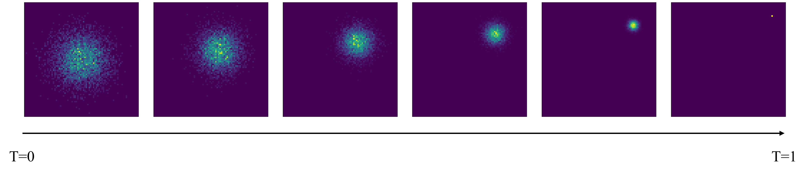
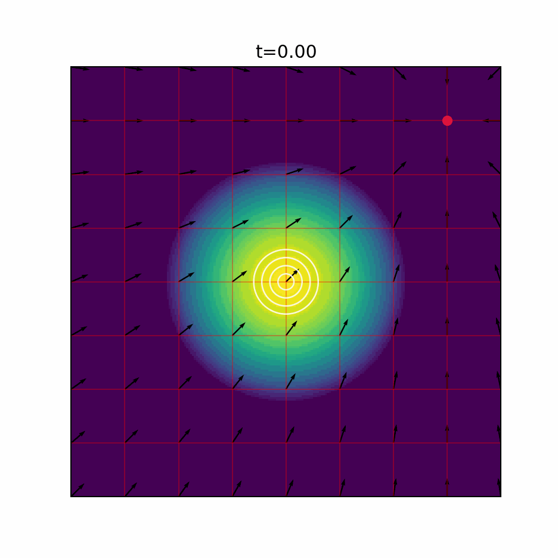

## 1. 训练目标

训练 = 找到参数 $\theta$，使得:

$$
X_0 \sim p_{init}, dX_t = u_t^{\theta}(X_t) dt~\text{or}~dX_t = u_t^{\theta}(X_t) dt + \sigma_t dW_t
$$

最终找到：

$$
X_1 \sim p_{data}
$$

在回归和分类任务中，训练目标往往是数据标签（label），然而在生成模型中，训练目标为向量场 $u_t^{\theta}$。因此，我们通过最小化均方差（MSE）来拟合向量场：

$$
L(\theta) = || u_t^{\theta}(x) - u_t^{target}(x) ||^2
$$

## 2. 条件概率路径与边缘概率路径

**定义一 狄拉克测度**（Dirac measure，也可理解为点质量分布）：对 $z \in \mathbb{R}^d$，若 $X \sim \delta_z$，则 $X = z~a.s.$（即 $P(X = z) = 1$）。 

> 测度： 衡量集合大小的函数。
> - 长度测度：在 $(\mathbb R)$ 上，区间 $([a,b])$ 的测度是长度 $(b-a)$；
> - 面积测度：在 $(\mathbb R^2)$ 上，矩形 $([a,b]\times[c,d])$ 的测度是面积 $(b-a)(d-c)$；
> - 概率测度：在概率空间 $(\Omega, \mathcal{F}, P)$ 上，事件 $A \in \mathcal{F}$ 的测度是概率 $P(A)$。
>
> 狄拉克测度 $\delta_z$ 是一种特殊的概率测度，它将所有质量集中在单个点 $z$ 上：
> $$
> \delta_z(A)=
> \begin{cases}
> 1, & z\in A \\\\
> 0, & z\notin A \\\\
> \end{cases}
> $$

**定义二 条件概率路径（Conditional Probability Path）**：$\{P_t(\cdot|z), t \in [0,1]\}$，满足：
1. $P_t(\cdot|z)$ 是定义在 $\mathbb{R}^d$ 上的一个分布；
2. $P_0(\cdot|z) = P_{init},~P_1(\cdot|z) = \delta_z$。其中 $\delta_z$ 为狄拉克测度。

> 举例：高斯条件概率路径
> 
> $$
> P_t(\cdot|z) = \mathcal{N}(\alpha_t z, \sigma_t^2 I_d)
> $$
>
> 其中，我们令噪声调度函数（noise schedule）满足 $\alpha_t = t, \sigma_t = 1 - t$，则有 $\alpha_0 = 0, \sigma_0 = 1$，以及 $\alpha_1 = 1, \sigma_1 = 0$。
> 高斯条件概率路径如下图所示：
>
> 

**定义三 边缘概率路径（Marginal Probability Path）**：已知 $z \sim P_{data}$，$x \sim P_t(\cdot|z)$，边缘概率路径 $\{P_t, t \in [0,1]\}$（该分布与 $z$ 无关）满足：
1. $P_t(x) = \int P_t(x|z) P_{data}(z) dz$；
2. $P_0 = P_{init},~P_1 = P_{data}$。

## 3. 条件向量场与边缘向量场

**定义四 条件向量场**（Conditional Vector Field）：$u_t^{target}(x|z), t \in [0,1], x,z \in \mathbb{R}^d$，使得：

$$
X_0 \sim P_{init}, \frac{d}{dt} X_t = u_t^{target}(X_t|z)
$$

可推出 $X_t$ 满足条件概率路径：

$$
X_t \sim P_t(\cdot|z), t \in [0,1]
$$

> $P_{init}$ 往往等于 $P_0(\cdot|z)$。

> 举例：高斯条件向量场
>
> 已知高斯条件概率路径为：
>
> $$
> P_t(\cdot|z) = \mathcal{N}(\alpha_t z, \sigma_t^2 I_d)
> $$
>
> 由于 $X_t \sim P_t(\cdot|z)$，因此 $X_t$ 可表示为：
>
> $$
> X_t = \alpha_t z + \sigma_t \epsilon,~\epsilon \sim \mathcal{N}(0, I_d)
> $$
>
> 对 $X_t$ 关于 $t$ 求导，得到高斯条件向量场：
>
> $$
> \frac{d}{dt} X_t = \dot{\alpha}_t z + \dot{\sigma}_t \epsilon = \dot{\alpha}_t z + \dot{\sigma}_t \frac{X_t - \alpha_t z}{\sigma_t} = \left(\dot{\alpha}_t - \frac{\dot{\sigma}_t}{\sigma_t}\alpha_t \right) z + \frac{\dot{\sigma}_t}{\sigma_t} X_t
> $$
>
> 即
>
> $$
> u_t^{target}(x|z) = \left(\dot{\alpha}_t - \frac{\dot{\sigma}_t}{\sigma_t}\alpha_t \right) z + \frac{\dot{\sigma}_t}{\sigma_t} x
> $$
>
> 其中 $\dot{\alpha}_t$ 和 $\dot{\sigma}_t$ 分别为 $\alpha_t$ 和 $\sigma_t$ 关于 $t$ 的导数。
>
> 

**定理一 边缘化技巧**/**定义五 边缘向量场**（Marginal Vector Field）：如果 $u_t^{target}(x|z)$ 是条件向量场，那么边缘向量场为：

$$
u_t^{target}(x) = \int u_t^{target}(x|z) P_{data}(z|x) dz \\\\
u_t^{target}(x) = \int u_t^{target}(x|z) \frac{P_t(x|z) P_{data}(z)}{P_t(x)} dz
$$

可推出 $X_t$ 满足边缘概率路径：

$$
X_0 \sim P_{init}, \frac{d}{dt} X_t = u_t^{target}(X_t) \Longrightarrow X_t \sim P_t, t \in [0,1] \Longrightarrow X_1 \sim P_{data}
$$

> 根据条件期望的定义：
>
> $$
> \mathbb{E}[Y|X_t = x] = \int Y(z) p(z|x) dz
> $$
>
> 令 Y(z) = $u_t^{target}(x|z)$，则有：
>
> $$
> u_t^{target}(x) = \mathbb{E}[u_t^{target}(x|z)|X_t = x] = \int u_t^{target}(x|z) p(z|x) dz
> $$
>
> 即得到了定理一中的第一个等式。

> 说人话就是：如果我们令 ODE（$X_0 \sim P_{init}, \frac{d}{dt} X_t = u_t^{target}(X_t)$） 中的向量场为条件向量场，则 $X_t$ 满足条件概率路径；如果我们令 ODE 中的向量场为边缘向量场，则 $X_t$ 满足边缘概率路径:
> 1. 条件概率路径的终点为狄拉克测度（$P_1(\cdot|z) = \delta_z$），因此 $X_1 = z$；
> 2. 边缘概率路径的终点为数据分布（$P_1 = P_{data}$），因此 $X_1 \sim P_{data}$。
> 
> 这便是条件向量场和边缘向量场的核心差别。为什么导致了这样的差别呢？因为条件向量场是针对每个数据点 $z$ 定义的，而边缘向量场则是对所有数据点进行平均（边缘化）后（$P_t(x) = \int P_t(x|z) P_{data}(z) dz$）的结果。

**定理 连续性方程**（来自流体力学）：给定任意初始化的 ODE：$X_0 \sim P_{init}, \frac{d}{dt} X_t = u_t(X_t)$，则 $p_t$ 满足以下偏微分方程：

$$
\partial_t p_t(x) = - \text{div}(p_t u_t)(x) \Longleftrightarrow X_t \sim P_t, t \in [0,1]
$$

这其中，$\text{div}$ 表示散度（divergence），定义为 $\text{div}(f)(x) = \sum_{i=1}^d \frac{\partial f_i(x)}{\partial x_i}$。而 $p_t(x)u_t(x)$ 是一个向量场，叫做**概率流**或**通量**：
- $p_t(x)$ 是概率密度，表示单位体积内的概率质量；
- $u_t(x)$ 是速度向量，表示单位时间内概率质量的流动方向和速率。

所以 $\text{div}(p_t u_t)(x)$ 表示在点 $x$ 处概率流的散度，即单位时间内流入或流出点 $x$ 的概率质量的净变化量。

> 当净流出大，局部密度就会下降；
> 当净流出小，局部密度就会上升。
>
> 这就是为什么散度 $\text{div}(p_t u_t)(x)$ 前面带有负号。
>
> 该公式的证明在此省略（因为我没学过流体力学，看不懂推导）。

## 4. 条件/边缘向量场评分函数

**定义六 条件分数**（Conditional Score）：$\nabla_x \log p_t(x|z)$。

**定义七 边缘分数**（Marginal Score）：$\nabla_x \log p_t(x)$。

> 从**条件分数**中推导出**边缘分数**：
>
> $$
> \nabla_x \log p_t(x) = \frac{\nabla_x p_t(x)}{p_t(x)} = \frac{\int \nabla_x(x|z) p_{data}(z) dz}{p_t(x)} = \int \nabla_x \log p_t(x|z) \frac{p_t(x|z) p_{data}(z)}{p_t(x)} dz \\\\
= \int s_t^{target}(x|z) p(z|x) dz = \nabla_x \log p_t(x)
> $$

> **高斯分数**（Gaussian Score）：
>
> $$
> \nabla_x \log p_t(x|z) = \nabla_x \log \mathcal{N}(\alpha_t z, \sigma_t^2 I_d) = -\frac{1}{\sigma_t^2}(x - \alpha_t z)
> $$

## 5. SDE 扩展定理与 Fokker-Planck 方程

**定理二 SDE 扩展定理**（SDE Extension Trick）：令 $u_t^{target}(x) = \int u_t^{target}(x|z) p_{data}(z|x) dz$，则对于任意 $\sigma_t \geq 0$：

$$
X_0 \sim P_{init}, dX_t = [u_t^{target}(X_t) + \frac{\sigma_t^2}{2} \nabla_x \log p_t(X_t)] dt + \sigma_t dW_t \Longrightarrow X_t \sim P_t, t \in [0,1] \\\\
\Longrightarrow X_1 \sim P_{data}
$$

**定理三 Fokker-Planck 方程**（Fokker-Planck Equation）：给定任意的 SDE：$X_0 \sim P_{init}, dX_t = u_t(X_t) dt + \sigma_t dW_t$，则 $p_t$ 满足以下偏微分方程：

$$
\partial_t p_t(x) = - \text{div}(p_t u_t)(x) + \frac{1}{2} \sigma_t^2 \Delta p_t(x) \Longleftrightarrow X_t \sim P_t, t \in [0,1]
$$

其中 $- \text{div}(p_t u_t)(x)$ 为连续性方程，而 $\frac{1}{2} \sigma_t^2 \Delta p_t(x)$ 则表示热度方程（热扩散项）。

## 6. 条件/边缘路径、向量场与分数函数总结

条件概率路径、条件向量场与条件分数：

| 对象 | 记号 | 核心性质 | 高斯例子 |
| --- | --- | --- | --- |
| 条件概率路径 | $p_t(\cdot \mid z)$ | 在 $p_{init}$ 和数据点 $z$ 之间插值 | $\mathcal{N}(\alpha_t z, \beta_t^2 I_d)$ |
| 条件向量场 | $u_t^{target}(x \mid z)$ | 对应的 ODE 沿条件路径演化 | $\left(\dot{\alpha}_t - \frac{\dot{\beta}_t}{\beta_t}\alpha_t\right) z + \frac{\dot{\beta}_t}{\beta_t} x$ |
| 条件分数函数 | $\nabla_x \log p_t(x \mid z)$ | 对数似然关于 $x$ 的梯度 | $-\frac{x - \alpha_t z}{\beta_t^2}$ |

边缘概率路径、边缘向量场与边缘分数：

| 对象 | 记号 | 核心性质 | 公式 |
| --- | --- | --- | --- |
| 边缘概率路径 | $p_t(x)$ | 在 $p_{init}$ 和 $p_{data}$ 之间插值 | $p_t(x) = \int p_t(x \mid z) p_{data}(z) \, dz$ |
| 边缘向量场 | $u_t^{target}(x)$ | 对应的 ODE 沿边缘路径演化 | $u_t^{target}(x) = \int u_t^{target}(x \mid z) \frac{p_t(x \mid z) p_{data}(z)}{p_t(x)} \, dz$ |
| 边缘分数函数 | $\nabla_x \log p_t(x)$ | 可用于将 ODE 目标转换为 SDE 目标 | $\nabla_x \log p_t(x) = \int \nabla_x \log p_t(x \mid z) \frac{p_t(x \mid z) p_{data}(z)}{p_t(x)} \, dz$ |