## 1. GPU 的架构

### 1.1 GPU 和 CPU 的区别

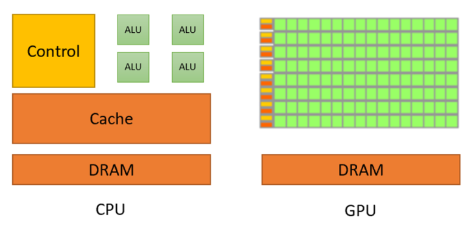

- **CPU** 把更多芯片面积留给控制逻辑和缓存，适合处理复杂分支、系统调度、少量但灵活的任务；

- **GPU** 把更多面积留给计算单元，适合同时执行大量相似的小计算，比如矩阵乘法和深度学习训练。

基础单元解释：

- **算术逻辑单元**（**Arithmetic Logic Unit，ALU**）：负责加法、乘法、比较等计算；
- **Control**：控制单元，负责解释指令、安排计算顺序、处理分支；
- **Cache**：高速缓存，容量比 DRAM 小，但离计算单元更近、访问更快。它用来临时保存马上要用或刚用过的数据，减少反复访问慢速内存的次数；
- **DRAM**：容量较大的外部内存，用来存放更多数据，但访问速度比 Cache 慢。

GPU 有许多小的 ALU，优化了计算延迟（每个线程（Thread）完成计算更快了）。

GPU 降低了控制和存储的比重，保证了计算的吞吐量（总的处理的数据量增大了）。

**总结**：CPU 针对少量但复杂的线程进行了优化，而 GPU 针对大量但简单的线程进行了优化。

### 1.2 GPU 的详细构造

#### 1.2.1 GPU 与 SM

<figure>
  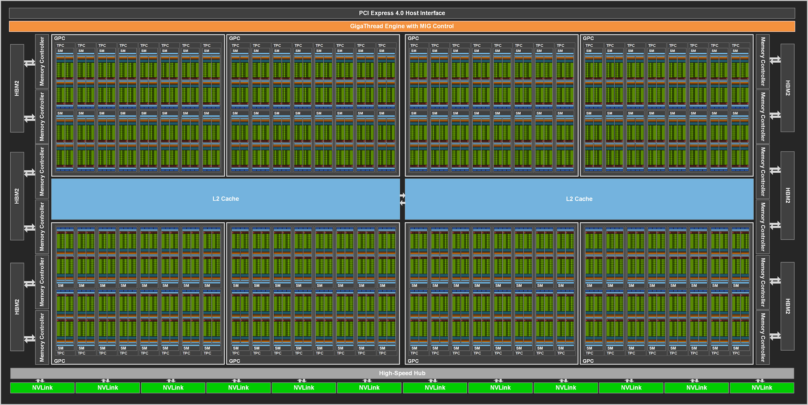
  <figcaption>GA100 GPU 的整体结构。一个完整 GA100 包含 128 个 SM；实际 A100 启用其中 108 个 SM。</figcaption>
</figure>

<figure>
  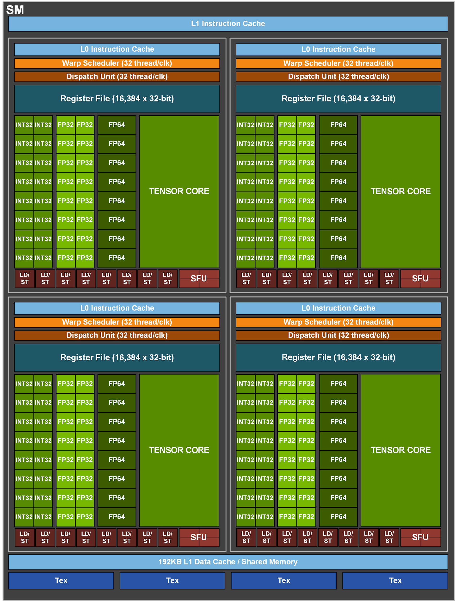
  <figcaption>GA100 中单个 SM（Streaming Multiprocessor）的内部结构；图中 SM 被分成 4 个处理分区，每个分区都有自己的调度、寄存器和计算单元。</figcaption>
</figure>

GPU 中包含许多 **SM**（Streaming Multiprocessor），每个 SM 都可以独立执行一个 **block**（可以理解成一个任务）。

每个 SM 中又包含许多 **SP**（Streaming Processor），这些 SP 可以**并行**执行多个 **thread**。

#### 1.2.2 内存层级

<figure>
  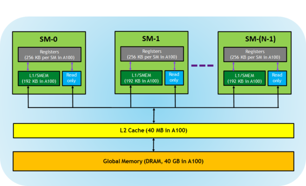
  <figcaption>GPU 的内存层级。L1 / shared memory 在 SM 内部，L2 cache 在 GPU 芯片上，global memory / DRAM 在 GPU 旁边的显存芯片中。</figcaption>
</figure>

GPU 的内存越靠近 **SM**，访问速度越快：

- **Register**：每个 thread 私有，用来存放正在计算的临时变量。它在 SM 内部，离 ALU 最近，速度最快，但容量最小；
- **Shared memory**：在 SM 内部，同一个 block 里的 thread 可以共享。它通常由片上 SRAM 实现，需要程序员显式读写；
- **L1 cache**：在 SM 内部，用来缓存最近访问的数据。它也在片上，很多 GPU 上 L1 和 shared memory 会共享同一块物理 SRAM，只是使用方式不同；
- **L2 cache**：在 GPU 芯片上，被多个 SM 共享。它仍然是片上 cache，但离具体的 ALU 更远；
- **Global memory / DRAM**：在 GPU 旁边的显存芯片中，容量最大，但访问最慢。

所以它们不是完全一样的东西。**Register、L1/shared memory、L2 cache** 都在 GPU 芯片内部，通常属于高速片上存储；**global memory** 是片外 DRAM/HBM。速度差异既来自距离，也来自物理介质、容量、共享范围和访问方式的不同。

为什么需要这么多层存储？因为**又快又大的内存做不出来**。越快的存储越贵、越占芯片面积、容量越小；越大的存储越便宜、容量越大，但离计算单元更远、访问更慢。

这些存储层的作用不同：

- **Register**：服务单个 thread，保存当前计算马上要用的变量；
- **Shared memory**：服务一个 block，让同一个 block 里的 thread 交换和复用数据；
- **L1 cache**：服务一个 SM，自动缓存最近访问的数据，减少去更远层级取数据；
- **L2 cache**：服务整颗 GPU，让不同 SM 访问 global memory 前先经过一个共享缓存；
- **Global memory**：服务整个 GPU，存放模型参数、输入输出、激活值等大数据。

以下列出 A100、H100 和 B200 三代 GPU 的关键硬件规格，可以更直观地看到不同代际之间的演进：

| Accelerator                        | A100      | H100      | B200      |
|------------------------------------|-----------|-----------|-----------|
| # SMs                              |       108 |       132 |       148 |
| Register size (per SM)             |    256 KB |    256 KB |    256 KB |
| L1 cache + shared memory (per SM)  |    192 KB |    256 KB |    256 KB |
| L2 cache size                      |     40 MB |     50 MB | 96-126 MB |
| HBM size                           |     80 GB |     80 GB |    192 GB |
| Register bandwidth                 | ~116 TB/s | ~401 TB/s | ~447 TB/s |
| L1 cache + shared memory bandwidth |  ~19 TB/s |  ~33 TB/s |  ~19 TB/s |
| L2 cache bandwidth                 | ~5-8 TB/s |  ~12 TB/s |   ~9 TB/s |
| HBM bandwidth                      |    2 TB/s | 3.35 TB/s |    8 TB/s |

（B200 还在 Tensor Core 和寄存器 / shared memory 之间引入了 **tensor memory（TMEM）**，对程序员不可见，但可以进一步提升 Tensor Core 的效率。）

### 1.2.3 板卡组成

<figure>
  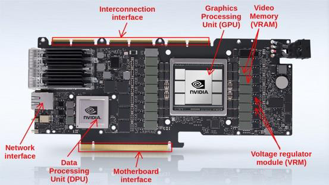
  <figcaption>GPU 板卡结构。GPU 芯片负责计算，旁边的 VRAM / HBM 负责存放数据，板卡上的接口和供电模块负责连接与供电。</figcaption>
</figure>

从物理板卡上看，GPU 不只是一个计算芯片，而是一整块加速卡：

- **Graphics Processing Unit（GPU）**：核心计算芯片，里面包含许多 SM，负责执行 CUDA kernel；
- **Video Memory（VRAM）**：GPU 旁边的显存芯片，也就是前面说的 global memory / DRAM。模型参数、激活值、输入输出等大数据主要放在这里；
- **Motherboard interface**：连接主板的接口，一般是 PCIe。CPU 和 GPU 之间的数据传输会经过这里；
- **Interconnection interface**：GPU 之间互联的接口，用来让多张 GPU 交换数据；
- **Voltage Regulator Module（VRM）**：电压调节模块，把外部供电转换成 GPU 芯片和显存需要的稳定电压；
- **Network interface / DPU**：图中这张板卡还包含网络和 DPU 相关模块，用来处理网络通信或数据搬运。

#### 1.2.4 执行模型

<figure>
  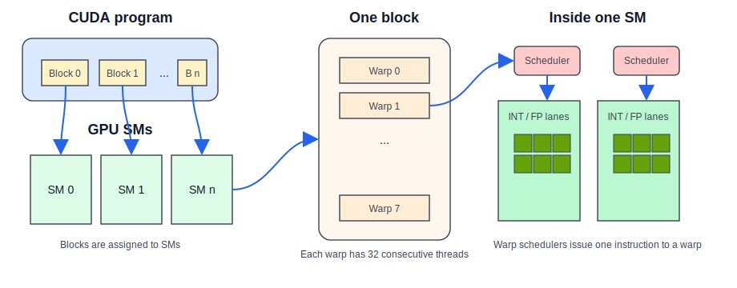
  <figcaption>CUDA 执行模型。程序被拆成 blocks，block 被分配到 SM 上执行；每个 block 又被拆成多个 warp，每个 warp 通常包含 32 个连续 thread。</figcaption>
</figure>

GPU 的执行模型中有三个重要概念：

- **Thread**：真正执行计算的单位。许多 thread 会并行工作，它们通常执行相同的指令，但处理不同的数据，这种模式叫 **SIMT**（Single Instruction, Multiple Threads）；
- **Block**：一组 thread。每个 block 会被分配到某个 SM 上执行，并拥有自己的 shared memory；
- **Warp**：GPU 实际调度 thread 的基本单位。thread 总是按 warp 执行，一个 warp 通常包含 32 个连续编号的 thread。

它们和硬件的关系可以这样理解：

- **Block**：分配给一个 SM；
- **Warp**：SM 内部实际调度的单位；
- **Thread**：warp 里的单个逻辑执行流，最终由 SM 内部计算单元执行。

具体来说，当你启动一个 CUDA kernel（例如 `my_kernel<<<gridDim, blockDim>>>(args)` 或 Triton 中的 `my_kernel[(grid,)](args)`）时，GPU 的执行流程如下：

1. **划分 Grid**：整个计算任务被包装成一个 **grid**。grid 的维度由启动参数决定——比如 `gridDim` 为 `(M, N)` 表示有 M × N 个 block。grid 的划分是你**显式指定**的，你需要自己决定"把任务切成多少个 block"；

2. **分配 Block 到 SM**：硬件把 grid 中的 block **逐个分配**到有空闲资源的 SM 上。一个 SM 可以同时容纳多个 block（取决于 shared memory 和寄存器容量），分配完的 block 就驻留在 SM 上直到执行完成；

3. **Block 内部分组为 Warp**：每个 block 进入 SM 后，硬件会按 thread ID 顺序，每 32 个连续 thread 分成一个 **warp**。这个过程是**硬件自动完成**的——你只需指定 block 大小，不需要手动管理 warp；

4. **Warp Scheduler 调度**：SM 内部的 **warp scheduler** 在每个时钟周期选择一个"就绪"的 warp，向其中的 32 个 thread **同时发出同一条指令**。这 32 个 thread 各自在不同的数据上执行相同的指令，这就是 **SIMT（Single Instruction, Multiple Threads）**；

5. **零开销切换**：当某个 warp 因为等待 HBM 读写而阻塞时，warp scheduler 直接切换到另一个就绪的 warp，切换本身不消耗额外时钟周期。一个 SM 上通常同时驻留多个 warp，靠这种频繁切换来隐藏内存延迟。

所以，从代码到硬件的映射链路是：

```
kernel 启动参数 → Grid（block 数量由你指定）
                   → Block（分配到各个 SM）
                       → Warp（硬件自动按 32 个 thread 分组）
                           → Thread（执行计算的逻辑个体）
```

简单记：**你决定 grid 和 block 的大小，硬件负责把 block 内的 thread 编成 warp 并调度执行**。

#### 1.2.5 内存访问范围

<figure>
  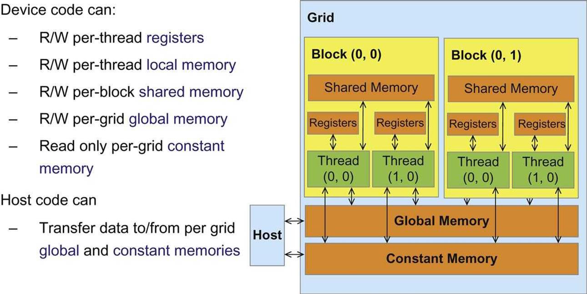
  <figcaption>CUDA 内存访问范围。每个 thread 有自己的 registers；同一个 block 内的 threads 可以共享 shared memory；跨 block 的数据交换需要经过 global memory。</figcaption>
</figure>

CUDA 程序中的内存访问范围可以这样理解：

- **每个 thread** 可以读写自己的 **registers** 和 local memory；
- **每个 block** 有自己的 **shared memory**，block 内的 threads 可以共同访问；
- **整个 grid** 可以访问 **global memory**，不同 block 之间交换数据通常需要通过 global memory；
- **constant memory** 是整个 grid 可读的只读内存；
- **host code** 可以在 CPU 侧和 GPU 的 global / constant memory 之间传输数据。

#### 1.2.6 Warp Occupancy（寄存器压力与占用率）

每个 thread 可以使用 0 到 255 个寄存器。thread 使用的寄存器越多，SM 上能同时容纳的 thread 就越少，**occupancy**（**占用率**）就越低。

用一个具体例子来理解：假设每个 thread block 有 128 个 thread，每个 thread 使用 160 个寄存器，SM 最多有 65536 个寄存器、最多支持 64 个并发 warp：

```
num_threads_per_block = 128
num_registers_per_thread = 160

max_registers = 65536  # SM 上的寄存器总数
max_warps = 64         # SM 最多支持的并发 warp 数

num_registers_per_block = 128 × 160 = 20480
num_blocks = 65536 // 20480 = 3      # 受寄存器数量限制，最多放 3 个 block
num_warps = 3 × 128 / 32 = 12       # 实际运行的 warp 数
occupancy = 12 / 64 = 18.75%        # 占用率不到 20%
```

occupancy 低不一定是坏事——如果每个 thread 在做更多工作（例如 **thread coarsening**，一个 thread 处理多个元素），低 occupancy 也可能是合理的。关键不是 occupancy 本身，而是 SM 的计算资源是否被高效利用。

#### 1.2.7 Bank Conflicts（共享内存的 Bank 冲突）

Shared memory 被划分成 **32 个 bank**，每个 bank 宽度为 4 字节。排列方式如下：

```
B00 B01 B02 B03 B04 B05 B06 B07 B08 B09 B10 B11 B12 B13 B14 B15 ...
... ... ... ... ... ... ... ... ... ... ... ... ... ... ... ... ...
```

每个时钟周期内，每个 bank 只能被一个 thread 访问（除非访问的是完全相同的地址，此时会触发广播）。如果多个 thread 同时访问同一个 bank 的不同地址，访问会被**串行化**，这就是 **bank conflict**。

最坏情况的例子：一个矩阵的每一行横跨所有 bank。如果 32 个 thread 同时访问第一列，它们会全部命中不同的 row 但相同的 column offset——即全部命中 bank 0——导致 32 路 bank conflict。

在矩阵乘法 `A @ B` 中，bank conflict 一定程度不可避免：需要同时访问 A 的行和 B 的列。

一个常用的缓解手段是 **swizzling**：对 shared memory 的地址做某种变换（如行和列的 XOR），打散 bank 的分配，从而减少冲突。

#### 1.2.8 Block Occupancy（Block 级占用率）

Thread block 会被分批调度到 SM 上执行。如果 SM 数量不能整除 thread block 数量，最后一波（wave）的 block 数会少于 SM 数量，造成部分 SM 空闲（wave quantization 问题）。

以 B200 为例：它有 148 个 SM。如果启动 160 个 thread block，第一波 148 个 block 全部跑满，第二波只剩 12 个 block，其余 136 个 SM 空闲。

解决思路很简单：**让 thread block 数量能被 SM 数量整除**，避免最后一波出现"吃不饱"的情况。

### 1.3 TPU 简单对比

<figure>
  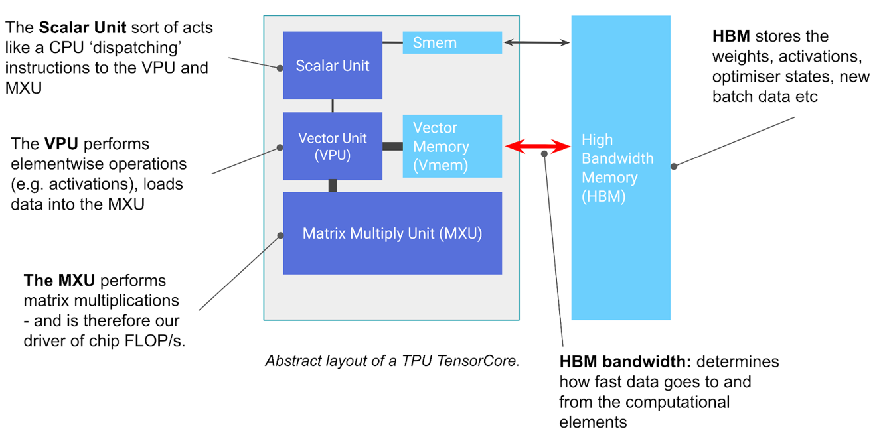
  <figcaption>TPU TensorCore 的抽象结构。TPU 和 GPU 在高层上很像：轻量控制、大矩阵乘法单元、快速内存。</figcaption>
</figure>

GPU、TPU 和很多 AI 加速器在高层上是相似的：

- 都有较轻量的控制单元；
- 都有很快的矩阵乘法单元；
- 都有靠近计算单元的高速内存；
- 都依赖 HBM 存放权重、激活值、优化器状态和 batch 数据。

TPU 中几个重要部件可以这样理解：

- **Scalar Unit**：类似控制单元，负责调度指令；
- **VPU**（Vector Unit）：做 elementwise 操作，比如激活函数，也会把数据送入矩阵乘法单元；
- **MXU**（Matrix Multiply Unit）：负责大规模矩阵乘法，是 TPU FLOPs 的主要来源；
- **VMEM / SMEM**：靠近计算单元的片上高速内存；
- **HBM**：高带宽显存，用来存放大规模数据。HBM bandwidth 决定数据进入计算单元的速度。

GPU 和 TPU 的大致对应关系：

| GPU | TPU | 含义 |
| --- | --- | --- |
| Streaming Multiprocessor（SM） | TensorCore | 包含其他单元的核心计算模块 |
| Warp Scheduler | VPU | SIMD 向量算术单元 |
| CUDA Core | VPU ALU | SIMD ALU |
| SMEM（L1 Cache） | VMEM | 快速片上缓存 |
| Tensor Core | MXU | 矩阵乘法单元 |
| HBM（也就是 GMEM） | HBM | 高带宽大容量显存 |

从数量上看，GPU 往往有更多小计算模块，TPU 则有更少但更大的矩阵计算模块：

| GPU | TPU | H100 数量 | TPU v5p 数量 |
| --- | --- | ---: | ---: |
| SM | Tensor Core | 132 | 2 |
| Warp Scheduler | VPU slots | 528 | 8 |
| SMEM（L1 cache） | VMEM | 32MB | 128MB |
| Registers | Vector Registers（VRegs） | 32MB | 256kB |
| Tensor Core | MXU | 528 | 8 |

主要差异：

- **GPU** 有更多 SM，调度粒度更细，通用性更强；
- **TPU** 的 TensorCore 数量更少，但矩阵乘法单元更大，更偏向规则的大矩阵计算；
- **GPU** 有 warp，硬件以 warp 为单位调度 thread；
- **TPU** 没有 warp，更多是 block 级执行，这会带来矩阵乘法和非矩阵计算之间的取舍；
- 多 GPU / 多 TPU 的差异，还和加速器之间如何互联有关。

**总结**：GPU 和 TPU 的共同目标都是让矩阵乘法跑得很快。GPU 更通用，TPU 更专门面向大规模矩阵计算。

### 1.4 GPU 模型的优势与限制

早期 NVIDIA GPU 主要面向图形渲染，提供的是 programmable shaders。研究者发现，矩阵乘法也可以“伪装”成图形计算来运行，这就是早期用 GPU 做通用计算的思路之一。

现在的 GPU 已经有专门的矩阵乘法硬件，例如 **Tensor Core**。Tensor Core 是专门为矩阵乘加设计的电路，因此 matmul 的速度远高于普通浮点运算。

<figure>
  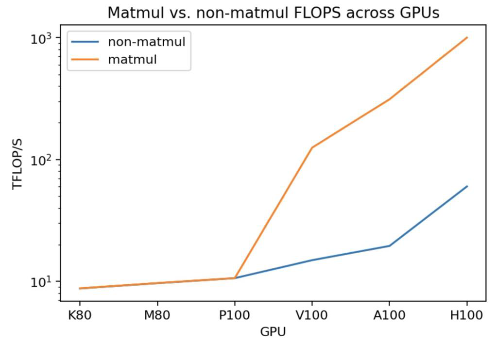
  <figcaption>随着 GPU 架构演进，matmul FLOPs 增长明显快于普通浮点运算。</figcaption>
</figure>

这对大模型非常重要，因为 Transformer 里的主要计算就是大规模矩阵乘法。也就是说，现代 GPU 不是“所有计算都一样快”，而是**特别擅长矩阵乘法**。

但是，计算能力增长得比内存和互联带宽更快：

<figure>
  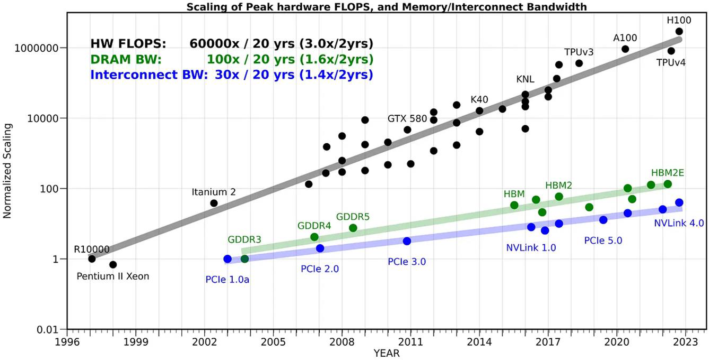
  <figcaption>硬件 FLOPs 增长速度快于 DRAM 带宽和互联带宽。</figcaption>
</figure>

这会带来一个问题：计算单元越来越快，但数据不一定能及时送到计算单元。也就是说，GPU 程序慢不一定是因为“算得不够快”，也可能是因为“数据搬得太慢”。这就是为什么现在的很多工程优化都是面向内存和传输的。

**总结（GPU 的优势）**：

- **容易扩展**：如果任务足够大，可以通过增加更多 SM 来提升吞吐量；
- **相对容易编程**：SIMT 模型让程序员可以像写很多 thread 一样写程序，硬件负责把它们组织成 warp 执行；
- **线程很轻量**：GPU 可以在大量 thread 之间切换。当一些 thread 等待内存时，SM 可以调度其他 ready thread 继续执行；

## 2. 如何在机器学习中更好地使用 GPU

接下来这一部分会讨论：当图形处理器（Graphics Processing Unit，GPU）已经有很强的计算能力时，为什么机器学习程序仍然可能跑不快，以及如何尽量避免程序被内存访问和数据传输限制。

### 2.1 屋顶线模型（Roofline Model）：程序到底被什么卡住？

机器学习工作负载（workload）快不快，不能只看 GPU 的峰值每秒浮点运算次数（Floating Point Operations per Second，FLOPs）。GPU 的计算单元很强，但前提是数据能及时送到计算单元。

**Roofline Model** 想回答的问题是：一个程序现在是被**计算能力**限制，还是被**内存带宽**限制。

<figure>
  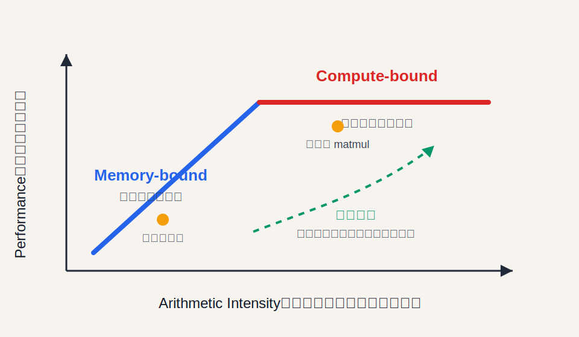
  <figcaption>Roofline Model 的核心想法：当数据复用率低时，程序更容易被内存带宽限制；当数据复用率足够高时，程序才可能接近 GPU 的计算上限。</figcaption>
</figure>

图里的横轴可以理解为**算术强度（arithmetic intensity）**，也就是“每搬一次数据，能做多少计算”。如果一个算子反复从**全局内存（global memory）**读数据，但每个数据只用一两次，它就很容易是**内存受限（memory-bound）**。

所以这一节的关键问题是：**如何避免程序被 memory-bound 卡住？**

直觉上，优化方向就是让数据被搬进来之后尽量多用几次。比如把数据放进**共享内存（shared memory）**或**缓存（cache）**中复用，减少反复访问 global memory，让 GPU 的计算单元不要一直等数据。

### 2.2 控制流分歧（Control Divergence）：分支也会让 GPU 变慢

GPU 不是只会被内存卡住，也会被**控制流分歧**卡住。

GPU 采用**单指令多线程（Single Instruction, Multiple Threads，SIMT）**模型：同一个**线程束（warp）**里的**线程（thread）**通常要执行同一条指令。如果这些 thread 在 `if / else` 中走了不同分支，GPU 往往需要把不同分支分开执行。

<figure>
  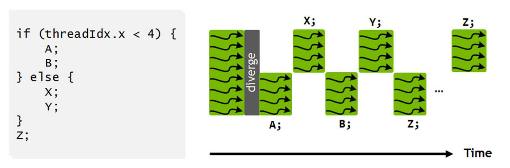
  <figcaption>Control divergence 示意图：同一个 warp 里的 threads 走向不同分支时，GPU 会分批执行这些分支，而不是所有 thread 一直同时向前推进。</figcaption>
</figure>

如果一个 warp 里有些 thread 满足条件，有些 thread 不满足条件，GPU 通常会这样执行：

- 先执行 `if` 分支里的 `A; B;`，只让满足条件的 thread 生效，其他 thread 被**掩码（mask）**掉；
- 再执行 `else` 分支里的 `X; Y;`，只让不满足条件的 thread 生效，前一批 thread 被 mask 掉；
- 最后所有 thread 重新汇合，一起执行 `Z;`。

所以，条件判断本身不是问题；真正的问题是**同一个 warp 里的 thread 走了不同路径**。分歧越多，并行效率越低。

### 2.3 技巧一：低精度计算——少搬一点数据

#### 2.3.1. 低精度改进算术强度

低精度计算（low precision computation）的核心很简单：**一个数占用的比特（bit）越少，从内存里搬它需要的数据也越少**。

比如**单精度浮点数（Float 32，FP32）**通常占 4 字节（byte），而**半精度浮点数（Float 16，FP16）**通常占 2 bytes。

#### 2.3.2. 低精度加速矩阵乘法

> 0.40625 的 FP8 表示为 0 0101 101；
>
> 0.40625 x 0.40625 = 0.1650390625
>
> 0.1650390625 无法用 FP8 精确表示。它附近的 FP8 数是 0.15625（0 0100 010）和 0.171875（0 0100 011），其中 0.171875 更接近。
> 
> 但可以用 FP16 表示 0.1650390625，FP16 的表示是 0 01100 0101001000。

<figure>
  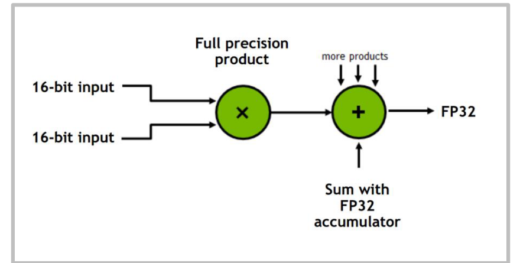
  <figcaption>Tensor Core 很多时候会使用混合精度（mixed precision）。它可以用 FP16 或 Brain Floating Point 16（BF16） 作为输入来提高吞吐量，但在累加时使用 FP32，从而尽量减少数值误差。</figcaption>
</figure>

- **适合 16-bit 存储（FP16/BF16）**：矩阵乘法，以及大多数逐元素操作，比如 ReLU、tanh、add、sub、mul；
- **需要更高精度（FP32/FP16）**：小数加到大数上的求和，以及 sum、softmax、normalization 这类归约操作；
- **需要更大数值范围（FP32/BF16）**：exp、log、pow 这类输出可能比输入大很多的操作，以及 loss function。

#### 2.3.3. 更前沿的低精度

**微缩放 FP8（Microscaling FP8，MXFP8）**的做法是：不让一整块数据共用一个 scale factor，而是让更小的一组数据共享一个**缩放因子（scaling factor）**。这样每组数据可以有自己的数值范围。

<figure>
  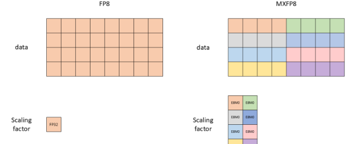
  <figcaption>普通 FP8 可以理解成一大块数据（图中为 4 x 8 = 32 个 FP8 数据）共用一个 scale factor；MXFP8 会给更小的数据块分配各自的 scale factor。</figcaption>
</figure>

MXFP8 有几个要点：

- 通常使用 **E4M3**，也就是 4 位 exponent、3 位 mantissa；
- scale factor 自己也可以是 FP8，比如 **E8M0**；
- scale factor 是通过统计得到的。例如，FP8 E4M3 的数值范围是 [-448, 448]，而在真实训练中，某些数据过大，普通 FP8 的数值范围无法覆盖，我们可以统计这些数值的绝对最大值 $x_{\textbf{absmax}} = \max(|x|)$，从而计算出 scale factor $s = \frac{x_{\textbf{absmax}}}{448}$，让 FP8 的数值范围适应实际数据。当数据过小时，普通 FP8 的精度又无法覆盖，我们也可以通过统计得到一个合适的 scale factor 来扩大 FP8 的数值范围。
- 因为 scale factor 按小块分配，矩阵转置会变复杂：转置之后，原来的分组方向变了，scale factor 也需要重新处理。

这样做的好处是：相比于普通 FP8，MXFP8 可以更灵活地适应不同数据块的数值范围，使得训练更加稳定。

<figure>
  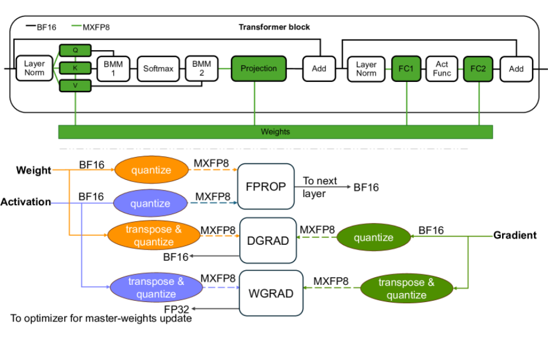
  <figcaption>MXFP8 训练流程示意图：矩阵乘法前会把权重、激活值或梯度量化成 MXFP8；计算结果通常再输出为 BF16 或 FP32。</figcaption>
</figure>

实际训练里，MXFP8 不是把所有东西都直接换成 FP8。如上图所示：

- **前向传播（forward propagation，FPROP）**：权重和激活值先量化成 MXFP8，矩阵乘法之后输出 **BF16**；
- **反向传播中的数据梯度（data gradient，DGRAD）**：输入会量化成 MXFP8，输出回到 **BF16**；
- **反向传播中的权重梯度（weight gradient，WGRAD）**：输入会量化成 MXFP8，输出通常保留为 **FP32**，用于更稳定地更新高精度权重。

**MXFP4** 更激进。4 bit 能表示的数非常少，所以它通常更依赖 scaling factor 来扩大可表示范围。

<figure>
  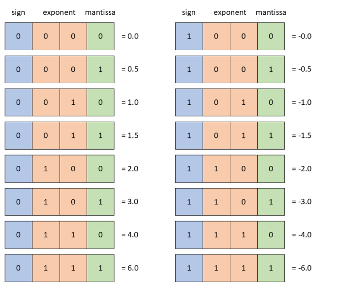
  <figcaption>MXFP4 的单个数只能表示很少的离散值，因此必须依赖 scaling factor 才能覆盖更大的数值范围。目前暂时没有使用 MXFP4 成功训练的模型。</figcaption>
</figure>

### 2.4 技巧二：算子融合——少来回搬数据

<figure>
  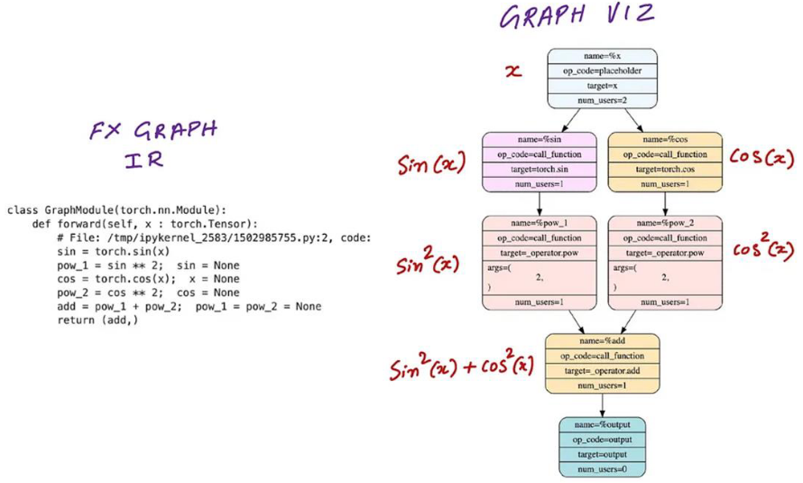
  <figcaption>没有融合时，`sin(x)^2 + cos(x)^2` 会被拆成多个 pointwise operations，每一步都可能对应一次独立的 CUDA kernel 调用。每次 kernel 的调用都需要读入和写入数据，造成传输开销。</figcaption>
</figure>

算子融合的想法是：把这些连续的小操作合并到一个 kernel 里完成。

<figure>
  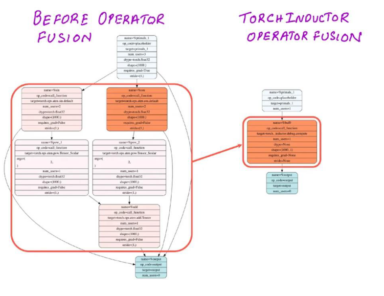
  <figcaption>算子融合前，多个 pointwise operations 分散执行；融合后，编译器可以把它们合成一个 CUDA kernel。</figcaption>
</figure>

这样做的好处很直接：

- **减少 kernel launch 开销**；
- **减少中间结果写回 global memory**；
- **让数据在寄存器或 cache 里多用几次**。

所以，算子融合本质上也是在解决 memory-bound 问题：少搬数据，多做计算。像这种比较简单的融合，很多时候可以由编译器自动完成，比如 `torch.compile`。

### 2.5 技巧三：重计算

在反向传播中，我们需要存储前向传播的激活值（activations），并计算反向传播中需要的雅可比矩阵（Jacobian）。以三层 sigmoid 为例，若不使用重计算：

<figure>
  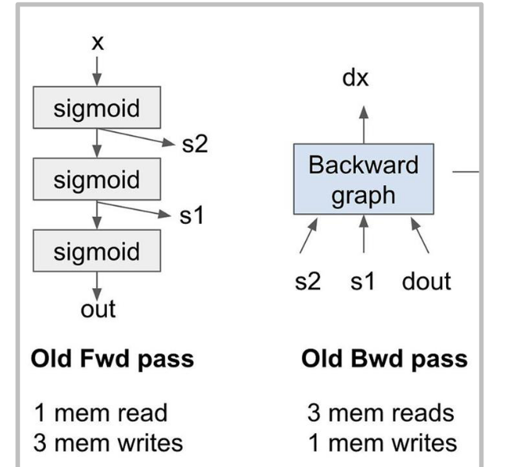
  <figcaption>不使用重计算，需要完成 8 次读或写操作（低算术强度）。</figcaption>
</figure>

<figure>
  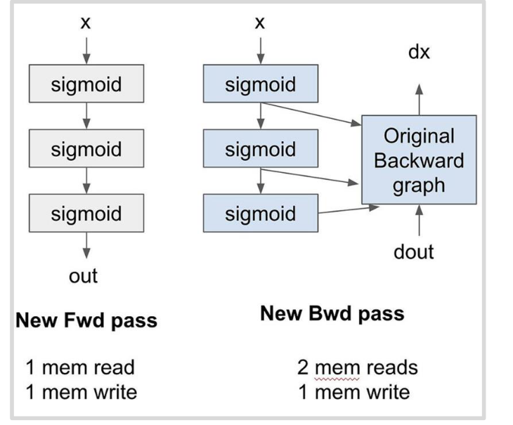
  <figcaption>通过重计算，仅需 6 次读或写操作（高算术强度）。</figcaption>
</figure>

### 2.6 技巧四：内存合并访问（memory coalescing）

<strong>内存合并访问（memory coalescing）</strong>的核心问题是：一个 warp 里的 threads 能不能一起访问一段连续的内存。

这和<strong>动态随机存取存储器（Dynamic Random Access Memory，DRAM）</strong>的读取方式有关。DRAM，也就是 GPU 的<strong>全局内存（global memory）</strong>，通常不是只读一个很小的数据，而是以<strong>突发模式（burst mode）</strong>一次读出一整段相邻数据。

<figure>
  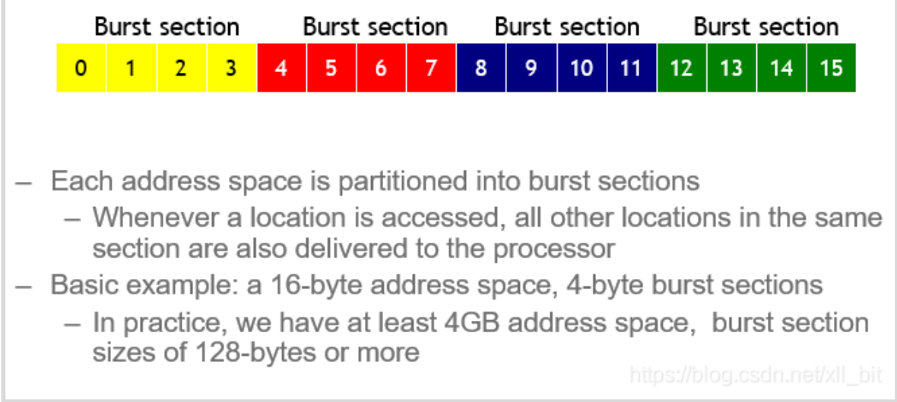
  <figcaption>DRAM 会按 burst section 读取数据。访问其中一个位置时，同一段里的相邻位置也会一起被送到处理器。</figcaption>
</figure>

所以，GPU 最喜欢的访问模式是：同一个<strong>线程束（warp）</strong>里的 threads 同时访问相邻地址。这样多个 thread 的读取可以合并成更少的 DRAM 请求。

<figure>
  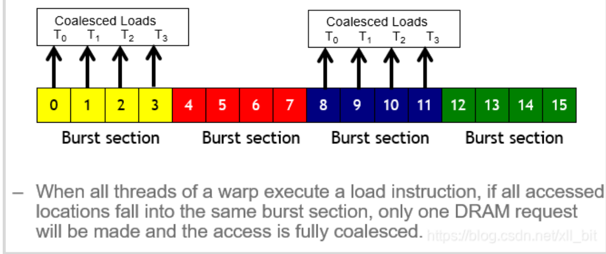
  <figcaption>如果一个 warp 中的 threads 访问同一个 burst section，硬件可以把这些访问合并成一次 DRAM request。</figcaption>
</figure>

反过来，如果同一个 warp 里的 threads 访问分散的地址，GPU 就需要发出更多次内存请求。计算单元可能还没开始算，就已经在等数据了。

矩阵乘法里很容易遇到这个问题。对于<strong>行主序矩阵（row-major matrix）</strong>，一行里的元素在内存中是连续的。但要注意，memory coalescing 看的不是“单个 thread 顺着哪里走”，而是“同一个 warp 在同一时刻访问的地址是不是连续”。

<figure>
  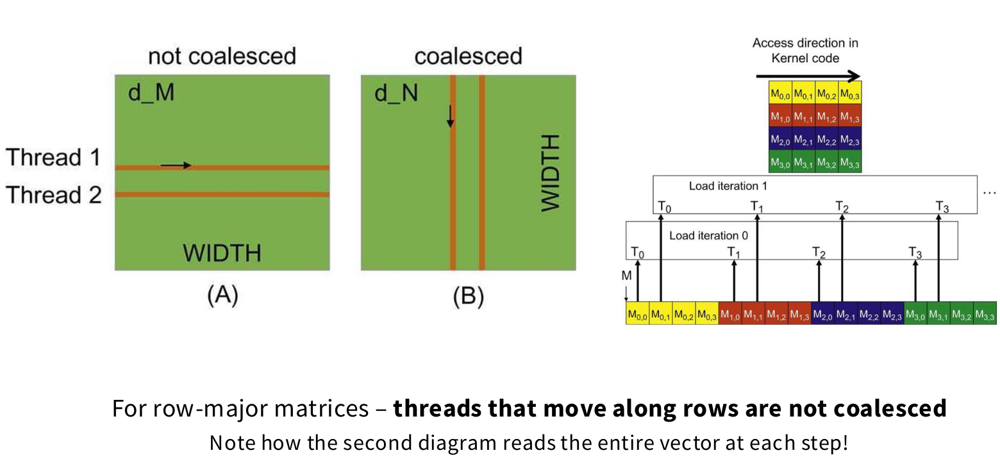
  <figcaption>在 row-major matrix 中，如果同一时刻不同 threads 访问的是相邻地址，就更容易 coalesced；如果它们跨很大的 stride 访问，就不容易 coalesced。</figcaption>
</figure>

因此，写 GPU kernel 时，要尽量让一个 warp 里的 threads 访问连续内存。这样可以减少 DRAM request，更好地利用 global memory bandwidth。

### 2.7 技巧五：分块（tiling）

<strong>分块（tiling）</strong>的想法是：重新组织 threads 和计算顺序，尽量减少对<strong>全局内存（global memory）</strong>的访问。

在普通<strong>矩阵乘法（matrix multiplication）</strong>里，同一个输入元素可能会被反复从 global memory 读取，而且这些读取不一定满足 memory coalescing。

<figure>
  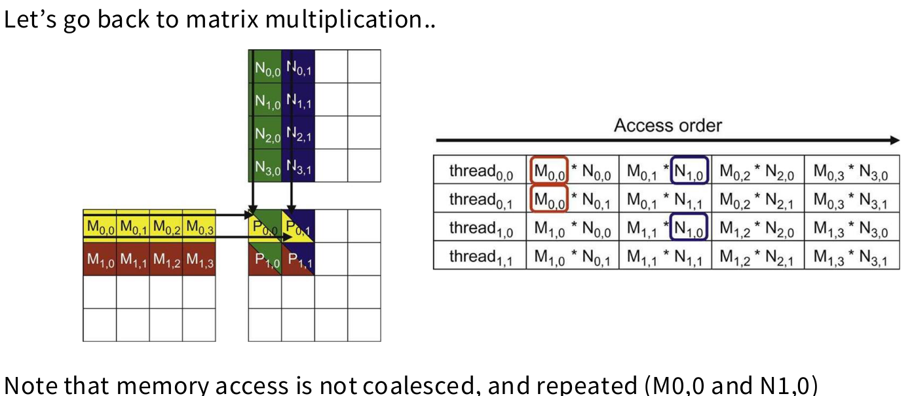
  <figcaption>普通矩阵乘法中，同一个元素可能被多个 thread 反复读取；访问顺序也可能不利于 memory coalescing。</figcaption>
</figure>

Tiling 会把矩阵切成更小的<strong>块（tile）</strong>，并把当前要用的 tile 先放进<strong>共享内存（shared memory，SHM）</strong>。矩阵乘法会按阶段执行：

1. 把当前需要的两个 tile 读入 SHM；
2. 用这两个 tile 计算输出矩阵的一部分结果；
3. 再读入下一组 tile；
4. 重复这个过程。

<figure>
  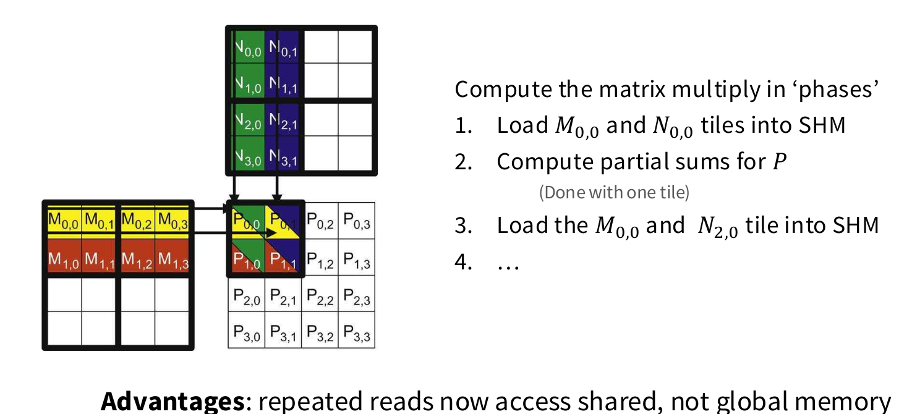
  <figcaption>Tiling 会先把需要复用的矩阵块放进 shared memory。之后重复读取时访问 shared memory，而不是反复访问 global memory。</figcaption>
</figure>

这样做的好处很直接：重复读取现在发生在 shared memory 中，而不是 global memory 中；同时，global memory 的读取也更容易做成 coalesced access。

<figure>
  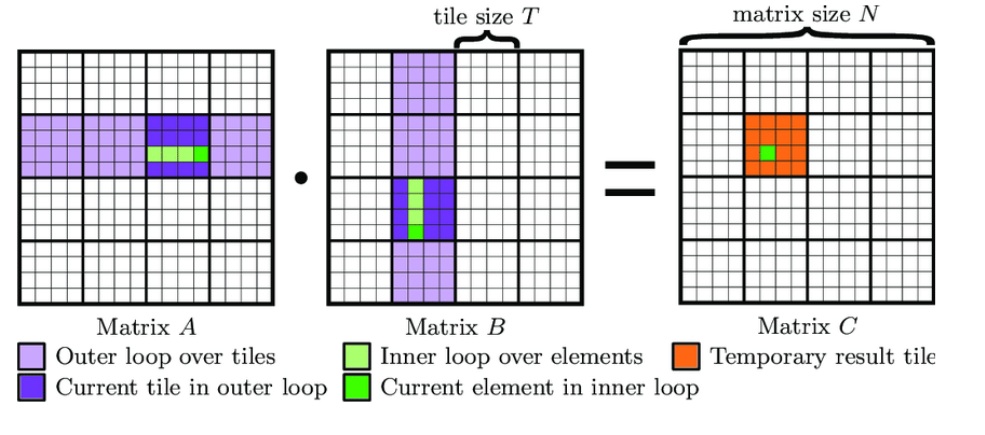
  <figcaption>Tiling 的核心收益是数据复用：把一小块数据读进来之后，在 tile 内多次使用。</figcaption>
</figure>

如果矩阵规模是 `N`，tile size 是 `T`：

- 不使用 tiling：每个输入元素会从 global memory 读取 `N` 次；
- 使用 tiling：每个输入元素会从 global memory 读取 `N / T` 次，然后在每个 tile 内复用 `T` 次；
- 所以，global memory 访问量可以减少约 `T` 倍。

Tiling 也有代价。tile size 不一定能整除矩阵大小，这会导致一部分 thread block 做很多无效工作。

<figure>
  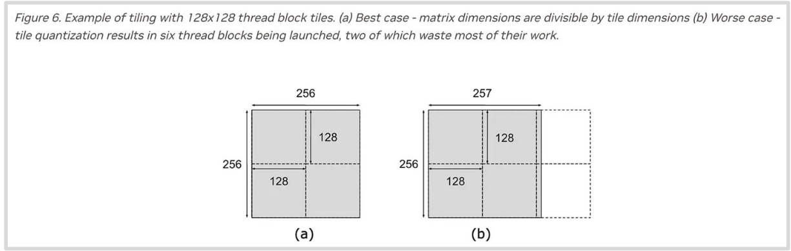
  <figcaption>当矩阵维度不能被 tile size 整除时，边缘 tile 里会有很多空位置，GPU 利用率会下降。</figcaption>
</figure>

选择 tile size 时，至少要考虑三件事：

1. 是否有利于<strong>内存合并访问（memory coalescing）</strong>；
2. shared memory 的容量是否放得下；
3. tile size 是否能较好地整除矩阵维度。

还有一个细节是<strong>内存对齐（memory alignment）</strong>。DRAM 按 burst 读取数据，如果 tile 和 burst section 对齐，读取会更快；如果不对齐，就可能需要读更多段数据。

<figure>
  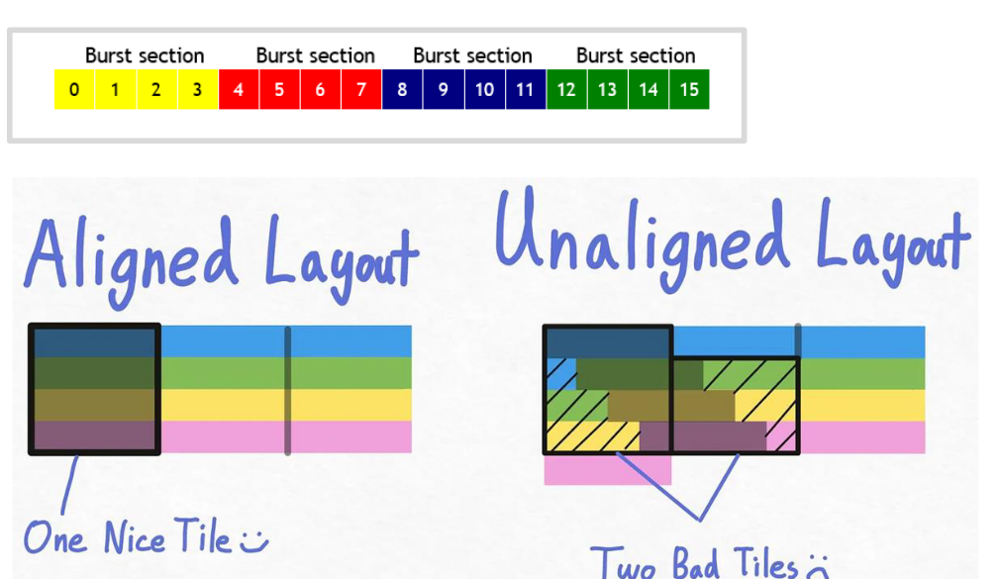
  <figcaption>左边的 tile 与 burst section 对齐，一次读取更干净；右边的 tile 没有对齐，可能需要跨多个 burst section。</figcaption>
</figure>

所以，有些矩阵维度天然不容易做到 coalesced access，需要通过<strong>填充（padding）</strong>来让内存布局更适合 GPU。

> 自己的一些理解：
>
> 分块的意义在于，矩阵的数据量超过了 GPU 内部的高速存储（registers、shared memory、L1 cache）的容量，无法一次性把所有数据都放进来。分块的做法是：把矩阵切成更小的块，每次只把当前需要用的块读进来，这样就能在块内复用数据，减少对全局内存的访问。

---

## 参考文献

[1] Stanford CS336, "Lecture 5 - GPUs," YouTube. [Online video]. Available: https://www.youtube.com/watch?v=izZba4UA7iY&list=PLoROMvodv4rMqXOcazWaTUHhq-yembLCV&index=7.
