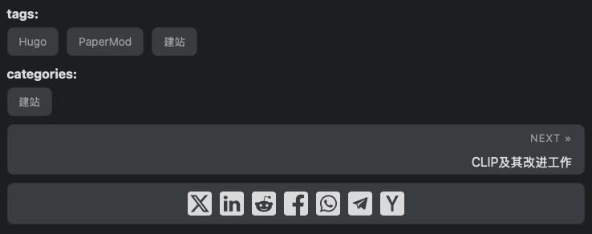
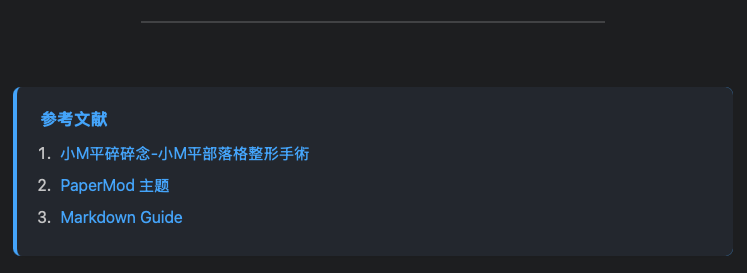

## 自定义post_meta显示

- **最后编辑(Lastmod)**

    在`config.yaml`中添加：

    ```yaml
    frontmatter:
        date:
            - date
            - publishDate
            - lastmod
        lastmod:
            - :git
            - :fileModTime
            - lastmod
            - date
            - publishDate
    ```

    最后编辑时间會根據frontmatter中的順序取值
    - `:git`：會去抓git提交紀錄的日期，且必須於config.yml中啟用enableGitInfo = true(沒試成功)
    - `:fileModTime`：根據本機的文件最後修改紀錄
    - `lastmod`：可以在文章的frontmatter區塊中直接設定
    - `date`：可以在文章的frontmatter區塊中直接設定
    - `publishDate`：文章發布的日期

- **修改 post_meta.html 文件**

    ```html
    <!-- layouts/partials/post_meta.html -->
    {{ $scratch := newScratch }}

    {{ if not .Date.IsZero }}
    {{ $scratch.Add "meta" (slice (printf `<span class="post-meta-item"><svg xmlns="http://www.w3.org/2000/svg" width="16" height="16" viewBox="0 0 24 24" fill="none" stroke="currentColor" stroke-width="2" stroke-linecap="round" stroke-linejoin="round"><rect x="3" y="4" width="18" height="18" rx="2" ry="2"></rect><line x1="16" y1="2" x2="16" y2="6"></line><line x1="8" y1="2" x2="8" y2="6"></line><line x1="3" y1="10" x2="21" y2="10"></line></svg> %s</span>` (.Date | time.Format (default "January 2, 2006" site.Params.DateFormat)))) }}
    {{ end }}

    {{ if not .Lastmod.IsZero }}
    {{ $scratch.Add "meta" (slice (printf `<span class="post-meta-item"><svg xmlns="http://www.w3.org/2000/svg" width="16" height="16" viewBox="0 0 24 24" fill="none" stroke="currentColor" stroke-width="2" stroke-linecap="round" stroke-linejoin="round"><path d="M12 19l7-7 3 3-7 7-3-3z"></path><path d="M18 13l-1.5-7.5L2 2l3.5 14.5L13 18l5-5z"></path><path d="M2 2l7.586 7.586"></path><circle cx="11" cy="11" r="2"></circle></svg> %s</span>` (.Lastmod | time.Format (default "January 2, 2006" site.Params.DateFormat)))) }}
    {{ end }}

    {{ if (.Param "ShowWordCount") }}
    {{ $scratch.Add "meta" (slice (printf `<span class="post-meta-item"><svg xmlns="http://www.w3.org/2000/svg" width="16" height="16" viewBox="0 0 24 24" fill="none" stroke="currentColor" stroke-width="2" stroke-linecap="round" stroke-linejoin="round"><path d="M14 2H6a2 2 0 0 0-2 2v16a2 2 0 0 0 2 2h12a2 2 0 0 0 2-2V8z"></path><path d="M14 2v6h6"></path><line x1="8" y1="13" x2="16" y2="13"></line><line x1="8" y1="17" x2="16" y2="17"></line><line x1="8" y1="9" x2="12" y2="9"></line></svg> %s</span>` (i18n "words" .WordCount | default (printf "%d words" .WordCount)))) }}
    {{ end }}

    {{ if (.Param "ShowReadingTime") }}
    {{ $scratch.Add "meta" (slice (printf `<span class="post-meta-item"><svg xmlns="http://www.w3.org/2000/svg" width="16" height="16" viewBox="0 0 24 24" fill="none" stroke="currentColor" stroke-width="2" stroke-linecap="round" stroke-linejoin="round"><circle cx="12" cy="12" r="10"></circle><polyline points="12 6 12 12 16 14"></polyline></svg> %s</span>` (i18n "read_time" .ReadingTime | default (printf "%d min" .ReadingTime)))) }}
    {{ end }}

    {{ with (partial "author.html" .) }}
    {{ $scratch.Add "meta" (slice (printf `<span class="post-meta-item"><svg xmlns="http://www.w3.org/2000/svg" width="16" height="16" viewBox="0 0 24 24" fill="none" stroke="currentColor" stroke-width="2" stroke-linecap="round" stroke-linejoin="round"><path d="M20 21v-2a4 4 0 0 0-4-4H8a4 4 0 0 0-4 4v2"></path><circle cx="12" cy="7" r="4"></circle></svg> %s</span>` .)) }}
    {{ end }}

    {{ with ($scratch.Get "meta") }}
    {{ delimit . " ｜ " | safeHTML }}
    {{ end }}
    ```

- **添加 CSS 样式来调整图标的显示效果**

    ```css
    /* assests/css/extended/blank.css */
    .post-meta-item {
        display: inline-flex;
        align-items: center;
        gap: 4px;
    }

    .post-meta-item svg {
        stroke: var(--secondary);
    }
    ```

- **列表页面隐藏** （可选）

    若不希望列表页出现`ReadingTime`，则复制一份`layouts/partials/post_meta.html`，命名为`post_meta_list.html`，将`post_meta_list.html`中的如下代码删去

    ```html
    <!-- layouts/partials/post_meta_list.html -->
    <!-- 删掉 -->
    {{ if (.Param "ShowReadingTime") }}
        ...
    {{ end }}
    ```

    并在`layouts/_default/list.html`中将：

    ```html
    <!-- layouts/_default/list.html -->
    {{- partial "post_meta.html" . -}}
    ```

    修改为

    ```html
    <!-- layouts/_default/list.html -->
    {{- partial "post_meta_list.html" . -}}
    ```

## 代码块改进

### 代码块缩进设置

在 `blank.css` 中添加以下代码：

```css
/* assets/css/extended/blank.css */
.post-content pre { /* 代码块缩进样式 */
    margin-left: 2em;  /* 缩进距离 */
}
.post-content li pre {  /* 列表中的代码块额外缩进 */
    margin-left: 4em;  /* 列表中的代码块缩进更多 */
}
```

### PaperMod 主题的语法高亮设置

- `config.yaml`中设置正确的语法高亮：

    ```yaml
    params:
    # ...existing code...
    assets:
        disableHLJS: false  # 启用 highlight.js

    # 设置代码高亮主题
    syntax_highlighter: "highlight.js"
    ```

- 高亮代码语法如下：

    ```python {hl_lines=[3]}
    print("第一行")
    print("第二行")
    print("**这一行会高亮**")
    print("第四行")
    ```

### 限制代码块长度

- **限制代码块长度，超出部分滚动**

    ```css
    /* assets/css/extended/blank.css */
    .post-content pre {  /* 代码块缩进样式 */
        max-height: 400px;      /* 最大高度，可自定义 */
        overflow: auto;         /* 超出部分滚动 */
    }
    ```

- **设置滚动条大小**

    ```css
    .post-content pre::-webkit-scrollbar {
        width: 10px;   /* 更细的滚动条 */
        height: 10px;
    }
    ```

## 博客文章封面图片缩小并移到侧边

- **复制`list.html`**
    
    从`themes/PaperMod/layouts/_default/list.html`中复制一份`list.html`放置于`layouts/_default/list.html`，并将

    ```html
    <!-- layouts/_default/list.html -->
    <article class="{{ $class }}">
    {{- $isHidden := (.Param "cover.hiddenInList") | default (.Param "cover.hidden") | default false }}
    {{- partial "cover.html" (dict "cxt" . "IsSingle" false "isHidden" $isHidden) }}
    <header class="entry-header">
        <h2 class="entry-hint-parent">
        {{- .Title }}
        {{- if .Draft }}
        <span class="entry-hint" title="Draft">
            <svg xmlns="http://www.w3.org/2000/svg" height="20" viewBox="0 -960 960 960" fill="currentColor">
            <path
                d="M160-410v-60h300v60H160Zm0-165v-60h470v60H160Zm0-165v-60h470v60H160Zm360 580v-123l221-220q9-9 20-13t22-4q12 0 23 4.5t20 13.5l37 37q9 9 13 20t4 22q0 11-4.5 22.5T862.09-380L643-160H520Zm300-263-37-37 37 37ZM580-220h38l121-122-18-19-19-18-122 121v38Zm141-141-19-18 37 37-18-19Z" />
            </svg>
        </span>
        {{- end }}
        </h2>
    </header>
    {{- if (ne (.Param "hideSummary") true) }}
    <div class="entry-content">
        <p>{{ .Summary | plainify | htmlUnescape }}{{ if .Truncated }}...{{ end }}</p>
    </div>
    {{- end }}
    {{- if not (.Param "hideMeta") }}
    <footer class="entry-footer">
        {{- partial "post_meta.html" . -}}
    </footer>
    {{- end }}
    <a class="entry-link" aria-label="post link to {{ .Title | plainify }}" href="{{ .Permalink }}"></a>
    </article>
    ```

    修改为

    ```html
    <!-- layouts/_default/list.html -->
    <article class="{{ $class }}">
        <div class="post-info">
            <header class="entry-header">
                <h2>{{ .Title }}</h2>
            </header>
            {{- if .Description }}
            <section class="entry-content">
                <p>{{ .Description }}</p>
            </section>
            {{- else if (ne (.Param "hideSummary") true) }}
            <section class="entry-content">
                <p>{{ .Summary | plainify | htmlUnescape }}{{ if .Truncated }}...{{ end }}</p>
            </section>
            {{- end }}
            {{- if not (.Param "hideMeta") }}
            <footer class="entry-footer">
                {{- partial "post_meta.html" . -}}
            </footer>
            {{- end }}
        </div>
        {{- $isHidden := (.Param "cover.hiddenInList") | default (.Param "cover.hidden") | default false }}
        {{- partial "cover.html" (dict "cxt" . "IsHome" true "isHidden" $isHidden) }}
        <a class="entry-link" aria-label="post link to {{ .Title | plainify }}" href="{{ .Permalink }}"></a>
    </article>
    ```

- **添加自定义样式**
    
    ```css
    /* assets/css/extended/blank.css */
    .post-entry {
        display: flex;
        flex-direction: row;
        align-items: center;
    }
    .entry-cover {
        overflow: hidden;
        /* padding-left: 18px; */
        height: 100%;
        width: 50%;
        margin-bottom: unset;
        border-radius: 12px; /* 你可以根据需要调整圆角大小 */
    }
    .entry-cover img {
        border-radius: 12px;
    }
    .post-info {
        display: inline-block;
        overflow: hidden;
        width: 90%;
    }
    ```

- **侧边首图放大动画**

    ```css
    /* assets/css/extended/blank.css */
    .post-entry img{
        transition: all 0.3s ease-out;
        transform:scale(1,1);
    }
    .post-entry:hover img{
        transition: all 0.3s ease-out;
        transform:scale(1.02,1.02);
    }
    ```

## 自定义 Post Footer

- **复制`single.html`**

在路径`themes/PaperMod/layouts/_default`找到`single.html`这个文件，复制到`layouts/_default/single.html`这个位置

- **修改`post-footer`段落**

找到

```html
<!-- layouts/_default/single.html -->
<footer class="post-footer">
    ...
</footer>
```

修改为

```html
<!-- layouts/_default/single.html -->
<footer class="post-footer">
  {{- $tags := .Language.Params.Taxonomies.tag | default "tags" }}
  <p style="font-size: medium; margin-bottom: 5px; font-weight: bold;">tags:</p>
  <ul class="post-tags">
    {{- range ($.GetTerms $tags) }}
    <li><a href="{{ .Permalink }}">{{ .LinkTitle }}</a></li>
    {{- end }}
  </ul>
  {{- $categories := .Language.Params.Taxonomies.categories | default "categories" }}
  <p style="font-size: medium; margin-bottom: 5px; font-weight: bold;">categories:</p>
  <ul class="post-tags">
    {{- range ($.GetTerms $categories) }}
    <li><a href="{{ .Permalink }}">{{ .LinkTitle }}</a></li>
    {{- end }}
  </ul>
  {{- if (.Param "ShowPostNavLinks") }}
  {{- partial "post_nav_links.html" . }}
  {{- end }}
  {{- if (and site.Params.ShowShareButtons (ne .Params.disableShare true)) }}
  {{- partial "share_icons.html" . -}}
  {{- end }}
</footer>
```

- **效果**

<p align="center">
  
</p>

## 博客末尾放参考链接

- 在`blank.css`里加一点样式

    ```css
    /* assets/css/extended/blank.css */
    /* 浅色模式 */
    .zhihu-ref {
        background: #f6f7fa;
        border-radius: 8px;
        padding: 1.2em 1.5em 1.2em 1.5em;
        margin-top: 2em;
        font-size: 1em;
        box-shadow: 0 2px 8px rgba(0,0,0,0.03);
        border-left: 4px solid #0084ff;
        transition: background 0.3s, border-color 0.3s;
    }
    .zhihu-ref-title {
        font-weight: bold;
        color: #175199;
        margin-bottom: 0.5em;
        font-size: 1.1em;
    }
    .zhihu-ref a {
        color: #175199;
    }
    .zhihu-ref a:hover {
        color: #0084ff;
    }
    /* 深色模式（PaperMod主题深色class为 .dark） */
    .dark .zhihu-ref {
        background: #23272e;
        border-left: 4px solid #3ea6ff;
    }
    .dark .zhihu-ref-title,
    .dark .zhihu-ref a {
        color: #3ea6ff;
    }
    .dark .zhihu-ref a:hover {
        color: #8cc8ff;
    }
    ```

- markdown中语法如下

    ```md
    <hr>
    <div class="references">
    <h3>参考资料</h3>
    <ol>
        <li><a href="https://gohugo.io/documentation/" target="_blank">Hugo 官方文档</a></li>
        <li><a href="https://github.com/adityatelange/hugo-PaperMod" target="_blank">PaperMod 主题</a></li>
        <li><a href="https://www.markdownguide.org/" target="_blank">Markdown Guide</a></li>
    </ol>
    </div>
    ```

- 效果如下

<p align="center">
  
</p>

## 侧边目录设置

- 在`layouts/partials`文件夹下创建`toc.html`，添加如下代码：

    ```html
    <!-- layouts/partials/toc.html -->
    {{- $headers := findRE "<h[1-6].*?>(.|\n])+?</h[1-6]>" .Content -}}
    {{- $has_headers := ge (len $headers) 1 -}}
    {{- if $has_headers -}}
    <aside id="toc-container" class="toc-container wide">
        <div class="toc">
            <details {{if (.Param "TocOpen") }} open{{ end }}>
                <summary accesskey="c" title="(Alt + C)">
                    <span class="details">{{- i18n "toc" | default "Table of Contents" }}</span>
                </summary>

                <div class="inner">
                    {{- $largest := 6 -}}
                    {{- range $headers -}}
                    {{- $headerLevel := index (findRE "[1-6]" . 1) 0 -}}
                    {{- $headerLevel := len (seq $headerLevel) -}}
                    {{- if lt $headerLevel $largest -}}
                    {{- $largest = $headerLevel -}}
                    {{- end -}}
                    {{- end -}}

                    {{- $firstHeaderLevel := len (seq (index (findRE "[1-6]" (index $headers 0) 1) 0)) -}}

                    {{- $.Scratch.Set "bareul" slice -}}
                    <ul>
                        {{- range seq (sub $firstHeaderLevel $largest) -}}
                        <ul>
                            {{- $.Scratch.Add "bareul" (sub (add $largest .) 1) -}}
                            {{- end -}}
                            {{- range $i, $header := $headers -}}
                            {{- $headerLevel := index (findRE "[1-6]" . 1) 0 -}}
                            {{- $headerLevel := len (seq $headerLevel) -}}

                            {{/* get id="xyz" */}}
                            {{- $id := index (findRE "(id=\"(.*?)\")" $header 9) 0 }}

                            {{- /* strip id="" to leave xyz, no way to get regex capturing groups in hugo */ -}}
                            {{- $cleanedID := replace (replace $id "id=\"" "") "\"" "" }}
                            {{- $header := replaceRE "<h[1-6].*?>((.|\n])+?)</h[1-6]>" "$1" $header -}}

                            {{- if ne $i 0 -}}
                            {{- $prevHeaderLevel := index (findRE "[1-6]" (index $headers (sub $i 1)) 1) 0 -}}
                            {{- $prevHeaderLevel := len (seq $prevHeaderLevel) -}}
                            {{- if gt $headerLevel $prevHeaderLevel -}}
                            {{- range seq $prevHeaderLevel (sub $headerLevel 1) -}}
                            <ul>
                                {{/* the first should not be recorded */}}
                                {{- if ne $prevHeaderLevel . -}}
                                {{- $.Scratch.Add "bareul" . -}}
                                {{- end -}}
                                {{- end -}}
                                {{- else -}}
                                </li>
                                {{- if lt $headerLevel $prevHeaderLevel -}}
                                {{- range seq (sub $prevHeaderLevel 1) -1 $headerLevel -}}
                                {{- if in ($.Scratch.Get "bareul") . -}}
                            </ul>
                            {{/* manually do pop item */}}
                            {{- $tmp := $.Scratch.Get "bareul" -}}
                            {{- $.Scratch.Delete "bareul" -}}
                            {{- $.Scratch.Set "bareul" slice}}
                            {{- range seq (sub (len $tmp) 1) -}}
                            {{- $.Scratch.Add "bareul" (index $tmp (sub . 1)) -}}
                            {{- end -}}
                            {{- else -}}
                        </ul>
                        </li>
                        {{- end -}}
                        {{- end -}}
                        {{- end -}}
                        {{- end }}
                        <li>
                            <a href="#{{- $cleanedID -}}" aria-label="{{- $header | plainify -}}">{{- $header | safeHTML -}}</a>
                            {{- else }}
                        <li>
                            <a href="#{{- $cleanedID -}}" aria-label="{{- $header | plainify -}}">{{- $header | safeHTML -}}</a>
                            {{- end -}}
                            {{- end -}}
                            <!-- {{- $firstHeaderLevel := len (seq (index (findRE "[1-6]" (index $headers 0) 1) 0)) -}} -->
                            {{- $firstHeaderLevel := $largest }}
                            {{- $lastHeaderLevel := len (seq (index (findRE "[1-6]" (index $headers (sub (len $headers) 1)) 1) 0)) }}
                        </li>
                        {{- range seq (sub $lastHeaderLevel $firstHeaderLevel) -}}
                        {{- if in ($.Scratch.Get "bareul") (add . $firstHeaderLevel) }}
                    </ul>
                    {{- else }}
                    </ul>
                    </li>
                    {{- end -}}
                    {{- end }}
                    </ul>
                </div>
            </details>
        </div>
    </aside>
    <script>
        let activeElement;
        let elements;
        window.addEventListener('DOMContentLoaded', function (event) {
            checkTocPosition();

            elements = document.querySelectorAll('h1[id],h2[id],h3[id],h4[id],h5[id],h6[id]');
            // Make the first header active
            activeElement = elements[0];
            const id = encodeURI(activeElement.getAttribute('id')).toLowerCase();
            document.querySelector(`.inner ul li a[href="#${id}"]`).classList.add('active');
        }, false);

        window.addEventListener('resize', function(event) {
            checkTocPosition();
        }, false);

        window.addEventListener('scroll', () => {
            // Check if there is an object in the top half of the screen or keep the last item active
            activeElement = Array.from(elements).find((element) => {
                if ((getOffsetTop(element) - window.pageYOffset) > 0 && 
                    (getOffsetTop(element) - window.pageYOffset) < window.innerHeight/2) {
                    return element;
                }
            }) || activeElement

            elements.forEach(element => {
                const id = encodeURI(element.getAttribute('id')).toLowerCase();
                if (element === activeElement){
                    document.querySelector(`.inner ul li a[href="#${id}"]`).classList.add('active');
                } else {
                    document.querySelector(`.inner ul li a[href="#${id}"]`).classList.remove('active');
                }
            })
        }, false);

        const main = parseInt(getComputedStyle(document.body).getPropertyValue('--article-width'), 10);
        const toc = parseInt(getComputedStyle(document.body).getPropertyValue('--toc-width'), 10);
        const gap = parseInt(getComputedStyle(document.body).getPropertyValue('--gap'), 10);

        function checkTocPosition() {
            const width = document.body.scrollWidth;

            if (width - main - (toc * 2) - (gap * 4) > 0) {
                document.getElementById("toc-container").classList.add("wide");
            } else {
                document.getElementById("toc-container").classList.remove("wide");
            }
        }

        function getOffsetTop(element) {
            if (!element.getClientRects().length) {
                return 0;
            }
            let rect = element.getBoundingClientRect();
            let win = element.ownerDocument.defaultView;
            return rect.top + win.pageYOffset;   
        }
    </script>
    {{- end }}
    ```

- 修改css:

    ```css
    /* assets/css/extended/blank.css */
    :root {
        --nav-width: 1380px;
        --article-width: 650px;
        --toc-width: 300px;
    }
    .toc {
        margin: 0 2px 40px 2px;
        border: 1px solid var(--border);
        background: var(--entry);
        border-radius: var(--radius);
        padding: 0.4em;
    }
    .toc-container.wide {
        position: absolute;
        height: 100%;
        border-right: 1px solid var(--border);
        left: calc((var(--toc-width) + var(--gap)) * -1);
        top: calc(var(--gap) * 2);
        width: var(--toc-width);
    }
    .wide .toc {
        position: sticky;
        top: var(--gap);
        border: unset;
        background: unset;
        border-radius: unset;
        width: 100%;
        margin: 0 2px 40px 2px;
    }
    .toc details summary {
        cursor: zoom-in;
        margin-inline-start: 20px;
        padding: 12px 0;
    }
    .toc details[open] summary {
        font-weight: 500;
    }
    .toc-container.wide .toc .inner {
        margin: 0;
    }
    .active {
        font-size: 110%;
        font-weight: 600;
    }
    .toc ul {
        list-style-type: circle;
    }
    .toc .inner {
        margin: 0 0 0 20px;
        padding: 0px 15px 15px 20px;
        font-size: 16px;
    }
    .toc li ul {
        margin-inline-start: calc(var(--gap) * 0.5);
        list-style-type: none;
    }
    .toc li {
        list-style: none;
        font-size: 0.95rem;
        padding-bottom: 5px;
    }
    .toc li a:hover {
        color: var(--secondary);
    }
    ```

## 按照LastMod参数进行文章排序

### Posts界面

- 修改`layouts/_default/list.html`如下

    ```html {hl_lines=[7]}
    <!-- layouts/_default/list.html -->
    {{- if .IsHome }}
    {{- $pages = where site.RegularPages "Type" "in" site.Params.mainSections }}
    {{- $pages = where $pages "Params.hiddenInHomeList" "!=" "true"  }}
    {{- end }}

    {{- $pages := $pages.ByLastmod.Reverse }} <!-- 添加这行代码 -->

    {{- $paginator := .Paginate $pages }}
    ```

### archives界面

- 复制`themes/PaperMod/layouts/_default/archives.html`至`layouts/_default`，将

    ```html
    <!-- layouts/_default/archives.html -->
    {{- range $pages.GroupByPublishDate "2006" }}
        ...
        {{- range .Pages.GroupByDate "January" }}
        ...
            {{- range .Pages }}
            ...
            {{- end }}
            ...
        {{- end }}
        ...
    {{- end }}
    ```

    修改为

    ```html {hl_lines=[2, 4, 6]}
    <!-- layouts/_default/archives.html -->
    {{- range $pages.GroupByParamDate "lastmod" "2006" }}
        ...
        {{- range .Pages.GroupByParamDate "lastmod" "January" }}
        ...
            {{- range .Pages.ByLastmod.Reverse }}
            ...
            {{- end }}
            ...
        {{- end }}
        ...
    {{- end }}
    ```

---

<div class="zhihu-ref">
  <div class="zhihu-ref-title">参考文献</div>
  <ol>
    <li><a href="https://www.lilmp.com/categories/小m平部落格整形手術/" target="_blank">小M平碎碎念-小M平部落格整形手術</a></li>
    <li><a href="https://blog.csdn.net/Xuyiming564445/article/details/122011603" target="_blank">CSDN-Hugo博客PaperMod主题目录放在侧边</a></li>
  </ol>
</div>