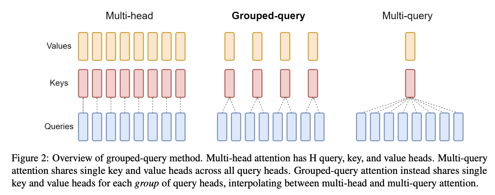
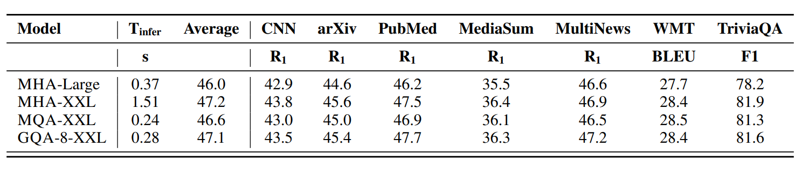
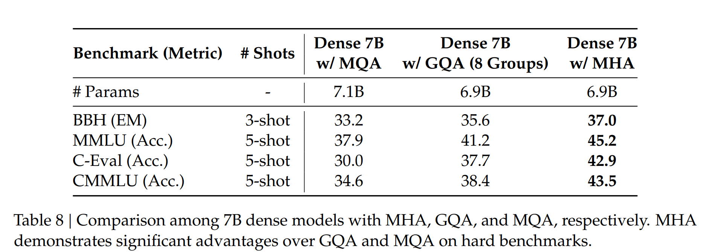
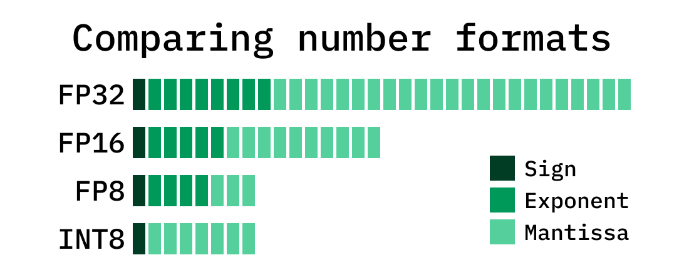
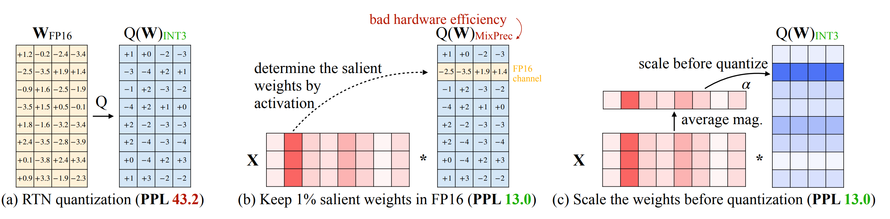
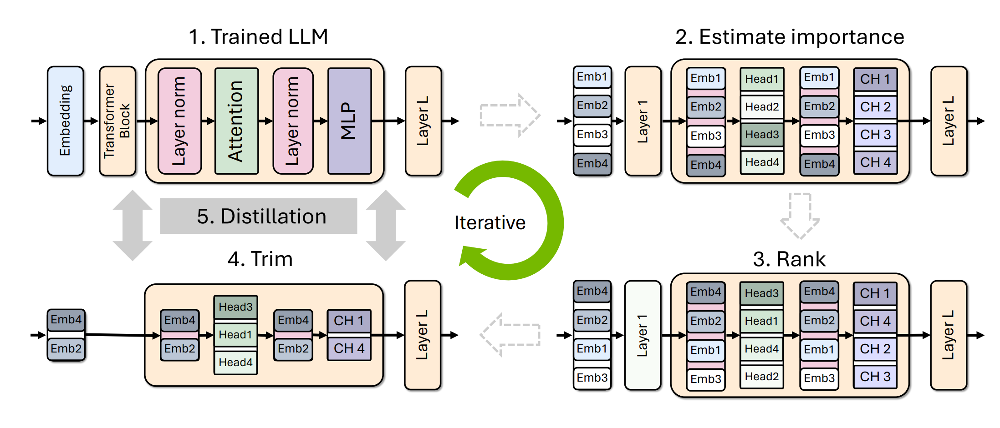
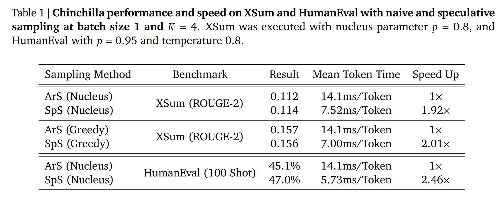

<figure>
  
  <figcaption>训练完成的模型接收提示词，通过推理过程生成响应。图源：Stanford CS336 Lecture 10。</figcaption>
</figure>

## 1. 理解大语言模型推理负载

### 1.1 大语言模型推理的应用场景与效率指标

大语言模型（Large Language Model，LLM）推理不只发生在用户与聊天机器人对话时。只要模型根据已有输入生成新的词元（token），就需要执行推理。常见场景包括：<a href="#参考文献">[1]</a>

- **实际应用**：聊天机器人、代码补全、智能体和批量数据处理；
- **模型评估**：生成回答，再衡量模型的指令遵循能力等指标；
- **强化学习（Reinforcement Learning，RL）**：为同一个问题采样多条回复，评分后再更新模型。

#### 大语言模型推理为什么强调效率

训练通常是一次性成本，推理却会随着每次模型调用反复发生。一份 2025 年的公开统计估计，OpenAI 每天处理约 8.6 万亿个词元<a href="#参考文献">[2]</a>；作为量级对比，DeepSeek-V4 的技术报告称其预训练使用了 32 万亿个词元<a href="#参考文献">[3]</a>。前者是持续产生的推理流量，后者是一次性的训练数据量，二者不能直接等同，但这个对比能够说明推理成本为何重要。

不同应用中的生成规模也不相同：

- 聊天机器人的输出主要供人阅读，因此人类的阅读速度和耐心限制了回复长度；
- 智能体通常经历“查询—内部推理轨迹—最终输出”的过程，内部生成的词元数量可能远多于最终回复；
- 生成的词元越多，需要消耗的计算资源通常也越多。

因此，对拥有产品或推理平台的团队来说，降低单次推理成本会在大量请求上持续累积收益。

#### 大语言模型推理服务与开源框架

推理服务提供者大致可以分为两类：一类托管 OpenAI、Anthropic、Google 等闭源模型，另一类托管开放权重模型，例如 Together、Fireworks、Baseten、DeepInfra、Groq 和 Cerebras。

常见的开源推理框架包括：

- [vLLM](https://github.com/vllm-project/vllm)：由加州大学伯克利分校团队开发，引入分页注意力（PagedAttention），是常用的通用推理框架；
- [SGLang](https://sgl-project.github.io/)：同样源自加州大学伯克利分校，引入基数注意力（RadixAttention），适合包含大量前缀复用的智能体负载；
- [TensorRT-LLM](https://nvidia.github.io/TensorRT-LLM/overview.html)：由 NVIDIA 针对图形处理器（Graphics Processing Unit，GPU）高度优化；
- [llama.cpp](https://github.com/ggml-org/llama.cpp)：使用 C/C++ 实现，支持在本地和中央处理器（Central Processing Unit，CPU）上运行模型。

#### 大语言模型推理速度的三个指标

“推理更快”需要由具体指标定义：

- **首词元时间（Time to First Token，TTFT）**：从用户提交请求到模型生成第一个词元的时间，反映用户需要等待多久才能看到回复开始出现；
- **延迟（Latency）**：单个请求生成词元的速度，常用秒/词元表示，决定回复出现得是否流畅；
- **吞吐量（Throughput）**：系统面对多个请求时每秒能够生成的词元总数，常用词元/秒表示。

交互式应用通常更关注 TTFT 和单请求延迟，离线批处理则更关注总吞吐量。优化其中一个指标不一定会改善另外两个指标，后续需要结合批大小和内存占用分析它们之间的权衡。

#### 训练与推理的并行性差异

| 对比维度 | 监督训练 | 自回归推理 |
| --- | --- | --- |
| 词元是否已知 | 整个训练序列的词元都已给出 | 下一个词元尚未生成 |
| 序列并行性 | 可以沿序列维度并行计算 | 必须逐个生成词元 |
| 计算形式 | 适合执行大规模矩阵乘法 | 当前词元生成后才能继续下一步 |
| 计算设备利用率 | 通常较容易充分利用 | 较难充分利用 |

这种顺序依赖使推理比训练更难充分利用大规模计算设备。后续分析推理效率时，需要分别考虑可以并行处理提示词的阶段，以及必须逐词元生成回复的阶段。

### 1.2 Transformer 计算中的张量维度记号

为了简洁地描述 Transformer 中的张量运算，后续采用类似 einops 的维度记号。字母既表示某个维度，也表示该维度的长度。这里先使用以下四个符号：

- \(B\)：批大小；
- \(T\)：序列长度；
- \(D\)：模型维度；
- \(H\)：注意力头维度。

以矩阵乘法 \(\mathrm{BTD}\times\mathrm{DH}\rightarrow\mathrm{BTH}\) 为例，可以把参与运算的维度分为三类：

- **收缩维度（contracting dimension）**：同时出现在两个操作数中，但不会出现在结果中。上式中的 \(D\) 就是收缩维度；
- **普通维度**：只出现在一个操作数中，并保留到结果中。上式中的 \(B\)、\(T\) 和 \(H\) 属于这种情况；
- **批处理维度（batching dimension）**：同时出现在两个操作数和结果中。例如 \(\mathrm{BD}\times\mathrm{BD}\rightarrow\mathrm{B}\) 中，\(D\) 被收缩，而 \(B\) 作为批处理维度保留下来。

<figure>
  
  <figcaption>Transformer 的注意力层与多层感知机层。红色表示收缩维度，蓝色表示批处理维度，各运算旁标出了输入与输出的张量形状。图源：How to Scale Your Model。<a href="#参考文献">[4]</a></figcaption>
</figure>

#### Transformer 结构中的维度约定

在后续计算中，还采用以下常见约定：

- \(F=4D\)：多层感知机（Multilayer Perceptron，MLP）通常先将模型维度上投影到约 4 倍的隐藏维度；
- \(D=NH\)：模型维度被拆分到 \(N\) 个注意力头中，每个头的维度为 \(H\)；
- \(N=KG\)：在分组查询注意力（Grouped-Query Attention，GQA）中，\(K\) 表示键值头数量，每个键值头对应 \(G\) 个查询头；
- \(S=T\)：训练时使用 \(S\) 个输入位置预测 \(T\) 个输出位置，两者的序列长度相同。

### 1.3 矩阵乘法的算术强度（Arithmetic Intensity）

算术强度衡量每传输一个字节的数据能够完成多少次浮点运算。算术强度越高，计算设备越有机会充分利用自身的计算能力；算术强度过低时，大量时间会消耗在等待数据搬运上。

考虑 MLP 中的一次矩阵乘法：

\[
Y=XW,\qquad X\in\mathbb{R}^{B\times D},\quad W\in\mathbb{R}^{D\times F},\quad Y\in\mathbb{R}^{B\times F}.
\]

其中，\(B\) 是批大小，\(D\) 是模型维度，\(F\) 是 MLP 上投影后的隐藏维度。假设张量使用脑浮点格式（Brain Floating Point，BF16），每个元素占 2 字节，并暂时忽略缓存复用和额外开销。

#### MLP 矩阵乘法的计算量与访存量

这次矩阵乘法可以拆成四个步骤：

| 步骤 | 操作 | 浮点运算次数或访存量 |
| --- | --- | --- |
| 1 | 从高带宽显存（High Bandwidth Memory，HBM）读取 \(X\) | \(2BD\) 字节 |
| 2 | 从 HBM 读取 \(W\) | \(2DF\) 字节 |
| 3 | 计算 \(Y=XW\) | \(2BDF\) 次浮点运算 |
| 4 | 将 \(Y\) 写回 HBM | \(2BF\) 字节 |

因此，浮点运算次数（Floating-Point Operations，FLOPs）和总数据传输量分别为：

\[
\mathrm{FLOPs}=2BDF,\qquad \mathrm{Bytes}=2BD+2DF+2BF.
\]

算术强度 \(I\) 为：

\[
\begin{aligned}
I&=\frac{\mathrm{FLOPs}}{\mathrm{Bytes}}\\
&=\frac{2BDF}{2BD+2DF+2BF}\\
&=\frac{BDF}{BD+DF+BF}.
\end{aligned}
\]

#### 批大小决定矩阵乘法的近似算术强度

当批大小远小于模型维度和 MLP 隐藏维度，即 \(B\ll D,F\) 时，读取权重矩阵 \(W\) 的 \(DF\) 项占主导地位。此时：

\[
I\approx B.
\]

直觉上，同一份权重被批中的 \(B\) 个样本共同使用。批越大，读取一次权重后完成的计算越多，算术强度也越高。

#### H100 上计算受限与内存受限的分界

以 H100 的理论峰值为例，BF16 计算能力约为 \(989\times 10^{12}\) FLOPs/s，显存带宽约为 \(3.35\times 10^{12}\) Bytes/s。<a href="#参考文献">[7]</a>两者之比给出加速器的算术强度分界：

\[
I_{\text{H100}}=\frac{989\times 10^{12}}{3.35\times 10^{12}}\approx 295\ \text{FLOPs/Byte}.
\]

- 当计算本身的算术强度高于约 \(295\) FLOPs/Byte 时，操作更可能是<strong>计算受限（compute-bound）</strong>；
- 当算术强度低于这个分界时，操作更可能是<strong>内存受限（memory-bound）</strong>。

结合 \(I\approx B\)，在上述理论峰值与简化假设下，只有 \(B>295\) 时，这个 MLP 矩阵乘法才可能进入计算受限区域。

极端情况下，\(B=1\)，矩阵乘法退化为矩阵—向量乘法。此时算术强度约为 \(1\)：为了完成约 \(2DF\) 次浮点运算，需要读取包含 \(DF\) 个元素的权重矩阵，因此明显受内存带宽限制。单请求、逐词元生成时经常接近这种工作负载，这也是大语言模型推理容易受到内存带宽约束的直观原因。

### 1.4 大语言模型推理的算术强度

#### 朴素自回归推理会重复计算历史前缀

最直接的自回归推理方法是：每生成一个新词元，就把当前的全部历史重新输入 Transformer，再从最后一个位置的概率分布中采样下一个词元。

<figure>
  
  <figcaption>朴素自回归推理每生成一个词元，都会将扩展后的完整序列重新输入 Transformer，历史前缀因此被反复计算。图源：How to Scale Your Model。<a href="#参考文献">[5]</a></figcaption>
</figure>

当序列长度为 \(t\) 时，一次完整注意力计算的复杂度为 \(O(t^2)\)。若最终生成 \(T\) 个词元，累计计算量为：

\[
\sum_{t=1}^{T}O(t^2)=O(T^3).
\]

相邻生成步骤共享几乎相同的历史前缀，因此其中的大量计算可以复用。常见做法是把历史词元在每一层注意力中产生的键和值保存在高带宽显存中，这就是<strong>键值缓存（Key-Value Cache，KV Cache）</strong>。

#### KV Cache 将推理拆分为预填充与生成

<figure>
  
  <figcaption>使用 KV Cache 后，提示词在预填充阶段并行编码；生成阶段只计算新词元，并把新产生的键和值追加到缓存中。图源：How to Scale Your Model。<a href="#参考文献">[5]</a></figcaption>
</figure>

对于批中的每个序列、每个历史词元、每一层和每个键值头，KV Cache 都需要保存对应的 \(H\) 维键向量和值向量。忽略常数项后，缓存大小随 \(B S L K H\) 增长，其中 \(B\) 是批大小，\(S\) 是历史序列长度，\(L\) 是层数，\(K\) 是键值头数量。

使用 KV Cache 后，推理可以分为两个阶段：

1. **预填充（prefill）**：一次性编码提示词中的所有词元，可以像训练一样沿序列维度并行；
2. **生成（generation）**：每次生成一个新词元，并将对应的键和值追加到 KV Cache，时间维度上仍然是顺序执行的。

下面分别计算 MLP 层和注意力层的 FLOPs、访存量与算术强度。记 \(S\) 为已有的上下文长度，\(T\) 为当前一次前向计算处理的新词元数量：预填充阶段取 \(T=S\)，生成阶段取 \(T=1\)。

#### MLP 层的算术强度取决于 \(BT\)

只考虑 MLP 中的矩阵乘法，并假设 \(BT\ll D,F\)，可以得到：

\[
I_{\mathrm{MLP}}\approx BT.
\]

- **预填充**：\(T=S\)，因此 \(I_{\mathrm{MLP}}\approx BS\)。较大的批和较长的提示词都能提高算术强度，使 MLP 更容易进入计算受限区域；
- **生成**：\(T=1\)，因此 \(I_{\mathrm{MLP}}\approx B\)。它需要足够多的并发请求才能提高算术强度，而交互式服务中的并发量通常会动态变化。

  
展开：MLP 层的 FLOPs 与访存量推导

  设输入 \(X\) 的形状为 \(B\times T\times D\)，上投影矩阵 \(W_{\mathrm{up}}\) 和门控矩阵 \(W_{\mathrm{gate}}\) 的形状为 \(D\times F\)，下投影矩阵 \(W_{\mathrm{down}}\) 的形状为 \(F\times D\)。只统计矩阵乘法，并继续假设使用 BF16：

  | 步骤 | 操作 | FLOPs 或访存量 |
  | --- | --- | --- |
  | 1 | 读取 \(X\) | \(2BTD\) 字节 |
  | 2 | 读取 \(W_{\mathrm{up}}\)、\(W_{\mathrm{gate}}\) 和 \(W_{\mathrm{down}}\) | \(6DF\) 字节 |
  | 3 | 计算 \(U=XW_{\mathrm{up}}\) | \(2BTDF\) FLOPs |
  | 4 | 写回 \(U\) | \(2BTF\) 字节 |
  | 5 | 计算 \(G=XW_{\mathrm{gate}}\) | \(2BTDF\) FLOPs |
  | 6 | 写回 \(G\) | \(2BTF\) 字节 |
  | 7 | 计算 \(Y=[\operatorname{GeLU}(G)\odot U]W_{\mathrm{down}}\) | \(2BTDF\) FLOPs |
  | 8 | 写回 \(Y\) | \(2BTD\) 字节 |

  其中，GeLU 是高斯误差线性单元（Gaussian Error Linear Unit，GeLU），\(\odot\) 表示逐元素乘法。忽略激活函数和逐元素乘法本身的计算量，总量为：

  \[
  \begin{aligned}
  \mathrm{FLOPs}_{\mathrm{MLP}}&=6BTDF,\\
  \mathrm{Bytes}_{\mathrm{MLP}}&=4BTD+4BTF+6DF.
  \end{aligned}
  \]

  因此：

  \[
  I_{\mathrm{MLP}}=\frac{6BTDF}{4BTD+4BTF+6DF}.
  \]

  当 \(BT\ll D,F\) 时，分母中的权重读取项 \(6DF\) 占主导地位，从而得到 \(I_{\mathrm{MLP}}\approx BT\)。

#### 注意力层的生成算术强度小于 1

以下只统计采用 FlashAttention 后的主要矩阵乘法和必要访存，不显式写出完整注意力矩阵。令 \(S\) 为已经存在于 KV Cache 中的历史词元数量，\(T\) 为本次需要计算输出的新词元数量，则注意力层的算术强度为：

\[
I_{\mathrm{Attention}}=\frac{ST}{S+T}.
\]

两个推理阶段分别为：

- **预填充**：\(T=S\)，因此 \(I_{\mathrm{Attention}}=S/2\)。上下文越长，算术强度越高；
- **生成**：\(T=1\)，因此 \(I_{\mathrm{Attention}}=S/(S+1)<1\)。即使增加批大小 \(B\)，这个结果也不会改变。

  
展开：注意力层的 FLOPs 与访存量推导

  查询 \(Q\) 的形状为 \(B\times T\times D\)，缓存中的键 \(K\) 和值 \(V\) 的形状均为 \(B\times S\times D\)。计算过程可以写成：

  | 步骤 | 操作 | FLOPs 或访存量 |
  | --- | --- | --- |
  | 1 | 读取 \(Q\)、\(K\) 和 \(V\) | \(2BTD+4BSD\) 字节 |
  | 2 | 计算 \(A=QK^\top\) | \(2BSTD\) FLOPs |
  | 3 | 计算 \(Y=\operatorname{softmax}(A)V\) | \(2BSTD\) FLOPs |
  | 4 | 写回 \(Y\) | \(2BTD\) 字节 |

  总计算量与访存量为：

  \[
  \begin{aligned}
  \mathrm{FLOPs}_{\mathrm{Attention}}&=4BSTD,\\
  \mathrm{Bytes}_{\mathrm{Attention}}&=4BSD+4BTD.
  \end{aligned}
  \]

  两者相除后，\(B\) 和 \(D\) 被约去：

  \[
  I_{\mathrm{Attention}}=\frac{4BSTD}{4BSD+4BTD}=\frac{ST}{S+T}.
  \]

#### 预填充与生成阶段的计算瓶颈不同

| 推理阶段 | MLP 算术强度 | 注意力算术强度 | 主要特征 |
| --- | --- | --- | --- |
| 预填充 | \(BS\) | \(S/2\) | 可以沿序列并行，通常更容易达到计算受限 |
| 生成 | \(B\) | \(S/(S+1)<1\) | 逐词元执行，通常受内存带宽限制 |

结论是：<strong>预填充通常更接近计算受限，逐词元生成通常更接近内存受限</strong>。这一区分解释了为什么两阶段需要不同的批处理策略，也为后续分析延迟、吞吐量和 KV Cache 优化奠定了基础。

### 1.5 批大小对推理延迟与吞吐量的影响

在内存受限的逐词元生成阶段，增大批大小 \(B\) 会带来一个直接的权衡：

- **吞吐量提高**：更大的批能够将模型参数的读取成本分摊到更多序列上；
- **生成延迟增加**：更大的批也会扩大 KV Cache，增加每个词元需要读取的数据量。

下面用一个简化的内存模型估算这种权衡。这里得到的是理想条件下的理论上限，而不是实际系统的基准测试结果。

#### Transformer 参数量与 KV Cache 的内存模型

设词表大小为 \(V\)，隐藏维度为 \(D\)，MLP 中间维度为 \(F\)，注意力头数量为 \(N\)，键值头数量为 \(K\)，每个头的维度为 \(H\)，层数为 \(L\)。简化后的 Transformer 参数量为：

\[
P=2VD+3LDF+L(2DNH+2DKH).
\]

其中，\(2VD\) 对应输入与输出嵌入，\(3LDF\) 对应每层 MLP 的三个投影矩阵，最后一项对应注意力层的查询、键、值与输出投影。

假设参数和 KV Cache 都使用 BF16，每个元素占 2 字节。模型参数占用的内存为：

\[
M_{\mathrm{param}}=2P.
\]

对于上下文长度为 \(S\) 的一条序列，每层都需要保存键和值，因此单条序列的 KV Cache 大小为：

\[
M_{\mathrm{KV,seq}}=4SKHL.
\]

系数 4 分别来自键和值两份缓存，以及每个 BF16 元素的 2 字节。批大小为 \(B\) 时，逐词元生成需要读取的总数据量近似为：

\[
M(B)=2P+4BSKHL.
\]

若显存带宽为 \(\beta_{\mathrm{mem}}\)，并假设生成过程完全受内存带宽限制，则每生成一个词元的理论延迟与吞吐量分别为：

\[
\begin{aligned}
\operatorname{Latency}(B)&=\frac{M(B)}{\beta_{\mathrm{mem}}},\\
\operatorname{Throughput}(B)&=\frac{B}{\operatorname{Latency}(B)}
=\frac{B\beta_{\mathrm{mem}}}{M(B)}.
\end{aligned}
\]

#### Llama 2 13B 在 H100 上的理论结果

以 Llama 2 13B 为例，取上下文长度 \(S=1024\)，并采用以下模型与硬件参数：<a href="#参考文献">[6]</a><a href="#参考文献">[7]</a>

| 参数 | 数值 |
| --- | ---: |
| 隐藏维度 \(D\) | 5120 |
| MLP 中间维度 \(F\) | 13824 |
| 注意力头数 \(N\) | 40 |
| 键值头数 \(K\) | 40 |
| 头维度 \(H\) | 128 |
| Transformer 层数 \(L\) | 40 |
| 词表大小 \(V\) | 32000 |
| H100 显存带宽 \(\beta_{\mathrm{mem}}\) | 3.35 TB/s |

代入上面的公式，可得约 \(130.15\) 亿个参数；BF16 参数约占 \(26.03\) GB，每条序列的 KV Cache 约占 \(0.84\) GB。

| 批大小 \(B\) | 总显存占用 | 理论延迟 | 理论吞吐量 | 单张 80 GB H100 |
| ---: | ---: | ---: | ---: | --- |
| 1 | 26.87 GB | 8.02 ms/词元 | 124.7 词元/秒 | 可以容纳 |
| 64 | 79.72 GB | 23.80 ms/词元 | 2689.5 词元/秒 | 接近上限 |
| 256 | 240.78 GB | 71.87 ms/词元 | 3561.8 词元/秒 | 无法容纳 |

这些结果建立在理想化假设上：计算与访存可以完美重叠，不考虑算子启动、调度、通信和其他系统开销，并假设每一步都需要读取全部参数与相应的 KV Cache。因此，表中的数值应理解为理论估计。

#### 批大小造成延迟与吞吐量的权衡

随着 \(B\) 增大，KV Cache 占用按 \(O(B)\) 增长，因此单个生成步骤需要搬运更多数据，延迟随之上升。与此同时，同一次参数读取可以服务更多序列，吞吐量也会提高。

不过，吞吐量的提升会逐渐放缓。批大小从 1 增加到 64 时，吞吐量提高约 21.6 倍；继续增加到 256，批大小扩大 4 倍，吞吐量却只提高约 32%。此时 KV Cache 已经成为主要的显存负担。

因此，两种目标之间存在明确取舍：

- 较小的批更适合降低单请求延迟；
- 较大的批更适合提高整体吞吐量，但会增加延迟和显存占用。

#### 推理并行与两阶段批处理策略

当一张 GPU 能够容纳完整模型时，可以采用以下两种并行方式：

- **模型复制**：在 \(M\) 张 GPU 上部署 \(M\) 个独立副本。理想情况下，单请求延迟基本不变，总吞吐量可以提高到原来的 \(M\) 倍；
- **模型或 KV Cache 切分**：将参数或缓存分布到多张 GPU 上，但需要额外通信，实现与性能分析都更复杂。

预填充与生成阶段的批处理目标也不同：

- **预填充阶段**：首词元延迟（Time to First Token，TTFT）主要取决于预填充时间，因此通常使用较小的批，以尽快处理新请求；
- **生成阶段**：可以使用较大的批，把多个请求合并执行，以提高整体吞吐量。

## 2. 有损捷径（Taking Shortcuts，Lossy）

第一章已经说明，逐词元生成通常受内存带宽限制。因此，一类直接的优化思路是<strong>减少推理时需要读取和保存的数据</strong>，使模型用更低的内存成本完成生成。

这些方法会改变原始模型的结构、数值精度或参数，因此属于“有损”捷径：它们可能影响模型精度。优化目标不是不计代价地压缩模型，而是<strong>在尽量不损害精度的前提下，降低推理复杂度</strong>。

### 2.1 缩小 KV Cache

KV Cache 会随序列长度、层数和键值头数量增长。减少缓存中的向量数量、向量维度或历史词元数量，都能降低生成阶段的访存量，进而改善延迟和吞吐量。

#### 分组查询注意力在多个查询头之间共享键和值

在标准的多头注意力（Multi-Head Attention，MHA）中，每个查询头都有一组对应的键头和值头。分组查询注意力（Grouped-Query Attention，GQA）保留 \(N\) 个查询头，但只使用 \(K\) 个键头和值头，每个键值头由 \(N/K\) 个查询头共享。<a href="#参考文献">[8]</a>

根据 \(K\) 的取值，可以得到三种注意力形式：

- **MHA**：\(K=N\)，每个查询头使用独立的键头和值头；
- **多查询注意力（Multi-Query Attention，MQA）**：\(K=1\)，所有查询头共享同一组键和值；
- **GQA**：\(1 < K < N\)，在 MHA 的表达能力与 MQA 的缓存效率之间折中。

<figure>
  
  <figcaption>MHA、GQA 与 MQA 的键值头共享方式。GQA 让一组查询头共享同一个键头和值头。图源：GQA。</figcaption>
</figure>

与 MHA 相比，GQA 将 KV Cache 缩小为原来的 \(K/N\)，压缩倍率为 \(N/K\)。逐词元生成受内存带宽限制时，需要读取的缓存越小，理论延迟越低；节省出的显存还可以容纳更大的批，从而进一步提高吞吐量。

<figure>
  
  <figcaption>GQA 实验中的单样本推理时间。随着键值头组数增加，GQA 的推理时间逐渐接近 MHA；MQA 的缓存最小，推理时间也最低。图源：GQA。</figcaption>
</figure>

沿用前文 Llama 2 13B 的简化配置，比较 \(N=40\) 时的 MHA 与 \(K=8\) 的 GQA，可以得到：

| 注意力形式 | \(K\) | 批大小 \(B\) | 总显存占用 | 理论延迟 | 理论吞吐量 |
| --- | ---: | ---: | ---: | ---: | ---: |
| MHA | 40 | 64 | 79.72 GB | 23.80 ms/词元 | 2689.5 词元/秒 |
| GQA | 8 | 64 | 33.41 GB | 9.97 ms/词元 | 6416.7 词元/秒 |
| GQA | 8 | 256 | 65.63 GB | 19.59 ms/词元 | 13068.2 词元/秒 |

在相同批大小下，GQA 同时降低了理论延迟并提高了吞吐量。缓存缩小后，批大小还可以从 64 增加到 256：此时延迟相对 \(B=64\) 上升，但吞吐量进一步提高，而且理论显存占用仍低于 80 GB。

缓存效率不能代替精度验证。GQA 论文的实验表明，GQA-8-XXL 的平均任务得分接近 MHA-XXL，同时推理时间明显更短；具体结果仍取决于模型结构、训练方法和评测任务。<a href="#参考文献">[8]</a>

<figure>
  
  <figcaption>MHA、MQA 与 GQA 的推理时间和任务精度对比。GQA 在该实验中取得了接近 MHA 的平均得分，同时保留了接近 MQA 的推理效率。图源：GQA。</figcaption>
</figure>

#### 多头潜在注意力压缩键值表示

多头潜在注意力（Multi-Head Latent Attention，MLA）不直接缓存完整的键向量和值向量，而是先把隐藏状态 \(h\) 压缩为低维潜在向量：<a href="#参考文献">[9]</a>

\[
c=W_ch.
\]

需要计算注意力时，再从 \(c\) 恢复键向量和值向量：

\[
\mathbf{k}=W_Kc,\qquad \mathbf{v}=W_Vc.
\]

普通注意力需要缓存维度为 \(NH\) 的键和值，MLA 则主要缓存维度为 \(C\) 的压缩向量。只要 \(C\ll NH\)，KV Cache 就会显著缩小。

<figure>
  
  <figcaption>MHA、GQA、MQA 与 MLA 的缓存结构。阴影部分表示推理时需要保存的数据；MLA 只缓存压缩后的潜在 KV，再按需投影。图源：DeepSeek-V2。</figcaption>
</figure>

在 DeepSeek-V2 中，原本 \(NH=16384\) 维的键值表示被压缩到 \(C=512\) 维。MLA 不能直接把旋转位置编码（Rotary Position Embedding，RoPE）完全吸收到这一路压缩中，因此还需要保留额外的 64 维 RoPE 键，最终每个词元缓存 \(512+64=576\) 维。<a href="#参考文献">[9]</a>

MLA 的优势同样来自 KV Cache 的缩小：生成阶段需要从显存读取的数据更少，因此延迟和吞吐量都可能改善。不过，压缩维度不能只根据显存占用选择，还需要检查它是否损害模型能力。

DeepSeek-V2 的消融实验给出了两个观察：<a href="#参考文献">[9]</a>

1. 在比较 MHA、GQA 和 MQA 的 7B 稠密模型时，MHA 在较难的基准上整体表现更好，但缓存成本也最高；
2. 在相同实验设置下，MLA 的整体精度略高于 MHA，同时每个词元的 KV Cache 明显更小。

  
展开：DeepSeek-V2 的注意力消融实验

  <figure>
    
    <figcaption>DeepSeek-V2 对 MHA、GQA 和 MQA 的消融实验。在这组较难的基准上，MHA 整体优于 GQA 和 MQA。图源：DeepSeek-V2。</figcaption>
  </figure>

  <figure>
    
    <figcaption>DeepSeek-V2 对 MLA 与 MHA 的消融实验。MLA 大幅减少了每个词元的 KV Cache，并在大多数列出的任务上取得更高分数。图源：DeepSeek-V2。</figcaption>
  </figure>

这些结果是特定模型与训练设置下的经验观察，不能直接推导出 MLA 在所有模型上都一定优于 MHA。

#### 跨层注意力在相邻层之间共享键和值

跨层注意力（Cross-Layer Attention，CLA）把共享范围从注意力头扩展到 Transformer 层。GQA 让多个查询头共享键和值，CLA 则让多个相邻层共享同一组键和值，因此不必为每一层分别保存完整的 KV Cache。<a href="#参考文献">[10]</a>

<figure>
  
  <figcaption>传统 Transformer 每层分别计算并缓存键和值；CLA 让上层注意力复用下层产生的键和值。图源：Reducing Transformer Key-Value Cache Size with Cross-Layer Attention。</figcaption>
</figure>

CLA 的实验结果表明，在 1B 模型上引入跨层共享后，模型可以在相近验证困惑度下使用更小的 KV Cache，从而改善精度与缓存大小之间的帕累托前沿。<a href="#参考文献">[10]</a>

<figure>
  
  <figcaption>CLA 实验中的验证困惑度与每词元 KV Cache 大小。红色点表示使用 CLA 的模型，展示了更优的精度—缓存权衡。图源：Reducing Transformer Key-Value Cache Size with Cross-Layer Attention。</figcaption>
</figure>

#### 局部注意力截断需要保留的历史范围

局部注意力（Local Attention）或滑动窗口注意力（Sliding-Window Attention）不再让每个词元关注全部历史，而是只读取最近一个固定窗口内的词元。局部上下文往往包含最相关的信息，同时固定窗口使每层需要保留的 KV Cache 不再随完整序列长度增长。<a href="#参考文献">[11]</a><a href="#参考文献">[12]</a><a href="#参考文献">[13]</a>

<figure>
  
  <figcaption>全局注意力与三种稀疏注意力模式。滑动窗口限制局部关注范围，扩张窗口扩大感受野，全局词元则补充跨越长距离的信息。图源：Longformer。</figcaption>
</figure>

局部注意力具有两个重要边界：

- **有效上下文随层数扩大**：信息可以逐层在窗口之间传播，因此有效感受野大致随层数线性增长；
- **可能损害长距离建模能力**：如果早期信息已经滑出窗口，当前层便无法直接访问它。

一种折中方案是在不同层之间交替使用局部注意力和全局注意力，形成混合注意力层。局部层控制 KV Cache 和计算成本，全局层则定期恢复长距离信息交互。

#### DeepSeek-V4 组合压缩与稀疏选择

DeepSeek-V4 支持最长 100 万词元的上下文。为了控制长上下文下的注意力成本，它组合使用了三种机制：<a href="#参考文献">[3]</a>

- **压缩稀疏注意力（Compressed Sparse Attention，CSA）**：将每 \(m\) 个历史词元压缩为一个表示；
- **DeepSeek 稀疏注意力（DeepSeek Sparse Attention，DSA）**：通过轻量索引器为历史位置打分，只选择分数最高的 \(k\) 个压缩 KV；
- **高度压缩注意力（Heavily Compressed Attention，HCA）**：进一步提高压缩程度，降低超长上下文的缓存与计算成本。

<figure>
  
  <figcaption>DeepSeek-V4 的稀疏注意力结构。模型将最近的滑动窗口 KV 与索引器选出的压缩 KV 拼接，再执行共享键值的多查询注意力。图源：DeepSeek-V4。</figcaption>
</figure>

#### 缩小 KV Cache 的方法总结

这些方法的共同目标是：在推理受内存带宽限制时，减少 KV Cache 的大小，同时尽量保持模型精度。

- **降低缓存维度**：GQA 在查询头之间共享键和值，MLA 缓存低维潜在表示，CLA 在层之间共享键和值；
- **截断或稀疏化历史**：局部注意力只保留固定窗口，稀疏注意力只选择少量相关历史位置；
- **采用其他序列模型**：线性注意力、状态空间模型，如 Mamba 2 和 GatedDeltaNet，以及扩散模型，也在尝试绕开完整注意力的缓存成本。

它们都用更强的结构假设换取更低的推理成本，因此必须通过训练和评测确认精度损失是否可以接受。

### 2.2 量化：通过降低数值精度减少访存

量化（Quantization）的核心是用更少的位数表示模型中的数值。位宽降低后，模型参数和中间张量占用的内存更少；对于内存受限的生成阶段，这通常意味着更低的延迟和更高的吞吐量。

代价是低精度格式只能表示有限的数值范围和离散取值，原始数值会产生舍入误差。因此，量化仍然需要在内存、速度和模型精度之间进行权衡。

#### 量化与反量化的基本机制

一种常见方法是仿射量化。设原始浮点数为 \(x\)，缩放因子为 \(s\)，零点为 \(z\)，量化和反量化过程分别为：

\[
\begin{aligned}
q&=\operatorname{round}\left(\frac{x}{s}\right)+z,\\
\hat{x}&=(q-z)s.
\end{aligned}
\]

其中，\(q\) 是保存下来的低精度整数，\(\hat{x}\) 是计算时恢复出的近似浮点数。实际实现还会将 \(q\) 截断到目标整数格式能够表示的范围内。

例如，取 \(x=5.2342\)、\(s=0.1\)、\(z=4\)，可以得到：

\[
\begin{aligned}
q&=\operatorname{round}(5.2342/0.1)+4=56,\\
\hat{x}&=(56-4)\times 0.1=5.2.
\end{aligned}
\]

反量化后的 \(5.2\) 与原值 \(5.2342\) 相差 \(0.0342\)。缩放因子越小，离散间隔通常越细，但可覆盖的实数范围也会相应缩小。

#### 常见数值格式的位宽与用途

<figure>
  
  <figcaption>不同数值格式的位结构。浮点数需要为符号、指数和尾数分配位，整数格式则没有指数与尾数字段。图源：<a href="https://www.baseten.co/blog/fp8-efficient-model-inference-with-8-bit-floating-point-numbers/">Baseten</a>。</figcaption>
</figure>

| 数值格式 | 每个元素占用 | 主要特点 |
| --- | ---: | --- |
| 32 位浮点数（FP32） | 4 字节 | 精度和动态范围较高；训练时常用于主权重、梯度累积或优化器状态 |
| BF16 | 2 字节 | 保留与 FP32 相同的指数位数，常用于训练和推理 |
| 8 位浮点数（FP8） | 1 字节 | E4M3 在 H100 上可表示到 \(\pm448\)，也可用于混合精度训练 |
| 8 位整数（INT8） | 1 字节 | 有符号整数范围通常为 \([-128,127]\)，常用于推理 |
| 4 位整数（INT4） | 0.5 字节 | 有符号整数范围通常为 \([-8,7]\)，内存更小，但量化误差通常更大 |

FP8 仍保留指数位，因此动态范围通常优于相同位宽的整数；INT8 和 INT4 则能以更规则的离散间隔表示数值。选择哪种格式不仅取决于精度，还取决于硬件是否原生支持对应格式，以及是否存在高效的矩阵乘法和反量化算子。<a href="#参考文献">[14]</a><a href="#参考文献">[15]</a>

#### 量化感知训练与训练后量化

根据量化误差是在训练中还是训练后处理，可以将方法分为量化感知训练（Quantization-Aware Training，QAT）和训练后量化（Post-Training Quantization，PTQ）：

| 对比维度 | QAT | PTQ |
| --- | --- | --- |
| 执行阶段 | 模型训练期间 | 模型训练完成后 |
| 基本机制 | 在前向过程中执行量化和反量化，模拟低精度误差 | 使用少量校准数据，确定每层或每个张量的缩放因子与零点 |
| 优点 | 权重能够在训练中适应量化误差 | 成本较低，不需要重新训练完整模型 |
| 局限 | 需要重新进行昂贵的大规模训练 | 对低位宽量化更敏感，精度更容易下降 |

两类方法的取舍可以概括为：

1. **QAT**：把量化误差纳入优化过程，通常更容易保持精度；
2. **PTQ**：更适合直接压缩已经训练完成的模型；
3. **实际效果**：两者都依赖量化粒度、校准数据和目标硬件。<a href="#参考文献">[15]</a>

> **补充：GPTQ**
>
> GPTQ 是一种面向生成式预训练 Transformer 的训练后权重量化方法。它利用近似二阶信息衡量量化误差，并在逐步量化权重时更新尚未量化的权重，以补偿已经引入的误差。<a href="#参考文献">[16]</a>

#### 激活感知权重量化保护显著权重

激活感知权重量化（Activation-Aware Weight Quantization，AWQ）的出发点是：不同权重对输出的影响并不相同。某些激活通道的数值明显更大，与这些通道相乘的权重对模型输出更加重要，因此应当重点降低它们的量化误差。<a href="#参考文献">[17]</a>

AWQ 的过程可以概括为：

1. 在少量校准数据上统计激活分布；
2. 根据激活幅度识别约 \(0.1\%\)–\(1\%\) 的显著权重通道；
3. 对显著通道进行缩放，再统一执行低位宽权重量化。

直接把少量显著权重保留为 FP16 虽然可以降低误差，却会形成混合精度计算，硬件执行效率较低。AWQ 采用等价缩放保护这些通道，使全部权重仍能使用统一的低精度格式。

<figure>
  
  <figcaption>AWQ 的核心机制。直接舍入到 INT3 会造成较大误差；保留少量 FP16 权重会降低硬件效率；AWQ 在量化前缩放显著通道，从而兼顾精度与统一的低精度计算。图源：AWQ。</figcaption>
</figure>

相关实验中，从 FP16 权重转换到 INT3 可将模型内存降低约 4 倍，并获得约 3.2 倍的推理加速。不过，这些收益取决于模型、硬件、量化粒度和算子实现，不能只根据位宽比例直接推断。<a href="#参考文献">[17]</a>

### 2.3 模型剪枝：移除不重要结构并用蒸馏恢复能力

模型剪枝（Model Pruning）的核心思路是：<strong>从计算成本较高的模型中移除不重要的结构，得到更小的模型，再修复剪枝造成的能力损失</strong>。

与把单个权重置零的非结构化剪枝不同，结构化剪枝会直接移除完整的 Transformer 层、注意力头或隐藏维度。这样得到的模型具有更规则的张量形状，更容易在现有硬件上获得实际加速。

NVIDIA 提出的剪枝与知识蒸馏流程可以概括为：<a href="#参考文献">[18]</a>

1. **估计结构重要性**：在一个包含 1024 个样本的小型校准集上，评估 Transformer 层、注意力头和隐藏维度的重要性；
2. **移除不重要结构**：根据重要性排序裁剪模型，得到参数量和计算量更小的学生模型；
3. **使用知识蒸馏修复模型**：把原始模型作为教师模型，将其知识迁移到剪枝后的学生模型中。

<figure>
  
  <figcaption>结构化剪枝与知识蒸馏流程。先估计并排序嵌入维度、注意力头和 MLP 通道的重要性，再移除不重要结构，最后通过蒸馏恢复模型能力；这一过程可以迭代执行。图源：Compact Language Models via Pruning and Knowledge Distillation。</figcaption>
</figure>

#### 剪枝降低重新训练小模型的成本

该方法从已经训练完成的 Nemotron-4 15B 出发，剪枝并蒸馏出 8B 和 4B 的 Minitron 模型。论文报告，相比从头训练同等规模的模型，这些模型最多只需要约 \(1/40\) 的训练词元；在部分对比中，MMLU 分数还能获得提升。<a href="#参考文献">[18]</a>

<figure>
  
  <figcaption>Minitron 4B 和 8B 的训练成本与 MMLU 分数。绿色虚线表示从 Nemotron-4 15B 出发的剪枝路径；结果展示了剪枝加蒸馏在较低训练成本下得到小模型的可能性。图源：Compact Language Models via Pruning and Knowledge Distillation。</figcaption>
</figure>

这些结果说明，已有大模型可以作为多个小模型的起点，避免为每一种部署规模都从头训练。不过，剪枝后的精度能否恢复，仍然取决于重要性评估、剪枝比例、蒸馏数据和训练预算。

### 2.4 总结：两条路线构建更快的模型

有损捷径的共同目标是：<strong>降低推理复杂度，同时尽量保持模型精度</strong>。确定更高效的模型架构后，可以选择从头训练，也可以复用已有模型并通过蒸馏修复。<a href="#参考文献">[1]</a>

#### 从头训练：直接训练高效架构

1. 设计推理速度更快的模型架构；
2. 从头训练这个高效模型。

这条路线最直接，但需要承担完整的训练成本。

#### 蒸馏修复：复用已有模型的能力

1. 设计推理速度更快的模型架构；
2. 使用原模型中可以复用的权重初始化新模型，即使两者的架构并不完全相同；
3. 将原模型作为教师模型，通过知识蒸馏修复高效模型的能力。

这条路线能够利用已经投入的训练成本，但最终效果取决于新旧架构之间的兼容程度，以及蒸馏能否弥补压缩造成的能力损失。<a href="#参考文献">[18]</a>

## 3. 使用捷径并进行校验（Use Shortcuts but Double Check，Lossless）

第二章中的方法通过改变模型结构或数值精度换取速度，可能造成精度损失。另一条路线是先用低成本方法猜测结果，再由原始模型进行校验；如果校验过程经过严格修正，就能在加速生成的同时保持原始模型的输出分布。

这里的“无损”是指<strong>最终采样分布与目标模型一致</strong>，而不是每次随机生成都得到完全相同的词元序列。

### 3.1 推测采样：用草稿模型提议、目标模型校验

预填充可以并行处理一段词元，而普通生成必须逐词元执行。换句话说，目标模型一次并行检查多个候选词元，通常比依次生成这些词元更高效。推测采样（Speculative Sampling）正是利用了<strong>校验比生成更容易并行</strong>这一不对称性。<a href="#参考文献">[19]</a><a href="#参考文献">[20]</a>

推测采样使用两个模型：

- **草稿模型 \(p\)**：参数量较小、生成成本较低，先自回归地猜测 \(K\) 个候选词元，例如一次猜测 4 个；
- **目标模型 \(q\)**：原始的大模型，一次前向计算并行评估这些候选位置，再根据接受规则决定保留多少个词元。

一次推测采样可以概括为：

1. 草稿模型连续生成 \(K\) 个候选词元；
2. 目标模型并行计算每个候选位置的概率；
3. 按顺序接受候选词元，直到遇到第一个被拒绝的词元；
4. 如果发生拒绝，从修正后的残差分布中采样一个词元；如果全部接受，再从目标模型中额外采样一个词元。

对于草稿模型提出的词元 \(x\)，接受概率为：

\[
a(x)=\min\left(1,\frac{q(x)}{p(x)}\right).
\]

当候选被拒绝时，不能简单地重新从 \(q\) 采样，而应从归一化后的残差分布采样：

\[
r(x)=\frac{\max(q(x)-p(x),0)}
{\sum_y\max(q(y)-p(y),0)}.
\]

这种修正拒绝采样保证每轮目标模型调用至少生成一个词元，并在理论上使最终词元精确服从目标分布 \(q\)；实际实现还会受到硬件数值精度的限制。<a href="#参考文献">[20]</a>

  
展开：推测采样的完整算法

  <figure>
    
    <figcaption>推测采样算法。草稿模型 \(p\) 连续提出 \(K\) 个词元，目标模型 \(q\) 并行计算候选前缀的概率，再通过接受概率和残差分布修正采样。图源：Accelerating Large Language Model Decoding with Speculative Sampling。</figcaption>
  </figure>

> **补充材料**
>
> 可以通过 Google 的[推测解码动画](https://storage.googleapis.com/gweb-research2023-media/media/SpeculativeDecoding-1-Illustration.mp4)直观看到“草稿—并行校验—接受或拒绝”的过程。

  
展开：二元词表示例验证目标分布不变

  假设词表只有 \(A\) 和 \(B\)，目标模型与草稿模型的概率分别为 \([q(A),q(B)]\) 和 \([p(A),p(B)]\)。进一步假设草稿模型过度采样 \(A\)：

  \[
  p(A)>q(A),\qquad p(B) < q(B).
  \]

  此时残差分布只会采样 \(B\)，即 \(r(A)=0\)、\(r(B)=1\)。最终采样到 \(A\) 的概率为：

  \[
  \begin{aligned}
  \Pr(A)
  &=p(A)\frac{q(A)}{p(A)}+p(B)\times 0\\
  &=q(A).
  \end{aligned}
  \]

  最终采样到 \(B\) 的概率为：

  \[
  \begin{aligned}
  \Pr(B)
  &=p(B)+p(A)\left(1-\frac{q(A)}{p(A)}\right)\\
  &=p(A)+p(B)-q(A)\\
  &=1-q(A)\\
  &=q(B).
  \end{aligned}
  \]

  因此，无论候选来自草稿模型还是残差分布，最终得到 \(A\) 和 \(B\) 的概率都与目标模型完全一致。这个二元例子展示了推测采样保持目标分布的核心原因。

#### 加速效果取决于候选接受率

在 Chinchilla 70B 的实验中，推测采样在 XSum 和 HumanEval 上获得了约 \(2\)–\(2.5\) 倍的解码加速，同时任务结果与普通自回归采样基本一致。<a href="#参考文献">[20]</a>

不过，草稿词元数量 \(K\) 并不是越大越好：

1. 增大 \(K\) 可以让一次目标模型调用尝试确认更多词元；
2. 越靠后的候选越依赖前面所有候选正确，整体接受率会逐渐下降；
3. 草稿生成和目标校验本身也有成本，因此过大的 \(K\) 可能使总时间重新上升。

  
展开：推测采样的实验结果与草稿长度权衡

  <figure>
    
    <figcaption>普通自回归采样与推测采样的实验对比。推测采样在保持相近任务结果的同时，将平均词元时间降低约一半。图源：Accelerating Large Language Model Decoding with Speculative Sampling。</figcaption>
  </figure>

  <figure>
    
    <figcaption>草稿词元数量 \(K\) 的影响。增加 \(K\) 能减少目标模型调用次数，但候选接受率随之下降，单轮校验时间也会上升，因此最佳 \(K\) 取决于具体任务。图源：Accelerating Large Language Model Decoding with Speculative Sampling。</figcaption>
  </figure>

#### 草稿模型需要足够便宜且接近目标模型

实践中常用明显更小的模型充当草稿模型，例如用约 8B 的模型辅助 70B 目标模型，或用约 1B 的模型辅助 8B 目标模型。模型越小，提出候选的成本越低；但如果它与目标模型差异过大，候选接受率会下降。

因此，草稿模型需要在两个目标之间折中：

1. **生成成本低**：否则草稿阶段本身会抵消加速收益；
2. **分布接近目标模型**：提高候选词元的接受率，可以通过知识蒸馏进行训练。

#### Medusa 与 EAGLE 改进候选生成

推测采样的改进空间主要集中在如何更快、更准确地产生候选词元：

- **Medusa**：在目标模型上增加多个解码头，并行预测多个未来词元，再使用树形注意力一次校验多条候选路径，不再需要维护一个完整的独立草稿模型；<a href="#参考文献">[21]</a>
- **EAGLE**：利用目标模型倒数第二层的高层特征进行自回归预测，并结合前移一位的词元序列降低特征预测的不确定性。<a href="#参考文献">[22]</a>

<figure>
  
  <figcaption>不同候选生成方法的对比。Medusa 使用多个解码头并行预测未来词元；EAGLE 同时利用词元和目标模型的高层特征生成候选。图源：Stanford CS336 Lecture 10。</figcaption>
</figure>

#### 推测采样总结

- 通过数学修正，最终结果在数值精度允许范围内仍然是目标模型分布的精确样本；
- 通过草稿生成与目标校验，利用了“并行检查比顺序生成更高效”的不对称性；
- 实际加速取决于草稿成本、候选接受率和一次提出的词元数量，草稿模型仍有较大的训练与结构创新空间。

## 4. 处理动态工作负载（Handling Dynamic Workloads）

离线训练的数据形状通常是预先确定的，在线推理流量却会持续变化。实时请求很难直接组成稳定、规则的批次，主要有三个原因：

1. **请求到达时间不同**：为了凑满批次而等待，会增加较早到达请求的排队时间；
2. **请求可能共享前缀**：系统提示词或同一提示词的多次采样会产生重复前缀，如果分别处理，就会重复计算并保存相同的 KV Cache；
3. **序列长度不同**：提示词长度和生成长度都不固定，简单填充到相同长度会产生无效计算和显存浪费。

因此，动态推理系统不仅要提高 GPU 利用率，还要及时接纳新请求、移除已经完成的请求，并高效处理不同长度的序列。

### 4.1 连续批处理：按生成迭代动态调整批次

#### 在线推理请求形成不规则批次

训练与在线推理的数据形状不同：

- **训练**：一个批次通常可以表示为规则的 \(B\times S\times D\) 张量，批中每条序列具有相同长度 \(S\)；
- **在线推理**：请求会在不同时间到达，并在生成不同数量的词元后结束，因此活跃序列更像一个长度不一的参差数组（ragged array）。

在静态批处理（Static Batching）中，批次一旦开始执行，通常要等所有请求都生成完毕后才能整体更新。短请求提前结束后，对应位置会闲置；与此同时，新到达的请求必须等待当前批次结束。

<figure>
  
  <figcaption>静态批处理中的序列长度差异。黄色表示提示词，蓝色表示生成词元，红色表示序列结束；较短请求结束后，批次中会留下无法被新请求立即利用的空闲位置。图源：Stanford CS336 Lecture 10。</figcaption>
</figure>

#### 迭代级调度：每轮生成后更新批次

连续批处理（Continuous Batching）把调度粒度从“整个请求”缩小到“一次生成迭代”。Orca 将这一机制称为迭代级调度（Iteration-Level Scheduling）：<a href="#参考文献">[23]</a>

1. 调度器选择当前要执行的一组请求；
2. 模型只为这组请求执行一次生成迭代，即每个请求生成一个词元；
3. 调度器检查哪些请求已经完成，并立即将其移出批次；
4. 下一轮开始前，将等待队列中的新请求加入空出的位置。

这样一来，新请求只需要等待当前生成迭代结束，而不必等待整个批次中的最长请求完成；提前结束的请求也可以立即返回结果。

#### 选择性批处理：注意力分开、其余算子合并

迭代级调度会让同一批中的请求具有不同上下文长度。普通批处理要求张量形状一致，因而不能直接把这些序列堆叠成一个规则的 \(B\times S\times D\) 张量。

Orca 使用选择性批处理（Selective Batching）分别处理两类运算：<a href="#参考文献">[23]</a>

1. **注意力运算**：每条序列需要读取不同长度的 KV Cache，因此按照各自的序列长度分别计算；
2. **非注意力运算**：MLP、线性投影和归一化等操作不需要跨词元交互，可以把所有序列的词元沿序列维度拼接后统一计算。

例如，三条序列的张量形状分别为 \([3,D]\)、\([9,D]\) 和 \([5,D]\)。注意力分别处理三条序列，而非注意力运算可以将它们拼接为：

\[
\begin{aligned}
X_{\mathrm{packed}}
&=\operatorname{concat}(X_1,X_2,X_3)\\
&\in\mathbb{R}^{(3+9+5)\times D}\\
&=\mathbb{R}^{17\times D}.
\end{aligned}
\]

这种方法避免了把所有序列填充到长度 9，同时仍能让共享模型参数的运算形成较大的矩阵计算。其核心是：<strong>只在形状兼容且确实能够受益的算子上进行批处理</strong>。

### 4.2 PagedAttention：用分页机制管理 KV Cache

连续批处理会不断加入和移除请求，KV Cache 也会随序列生成而动态增长。vLLM 提出的 PagedAttention 借鉴操作系统的分页机制，把逻辑上连续的 KV Cache 映射到物理上离散的显存块，从而按需分配显存，并支持不同序列共享相同的前缀缓存。<a href="#参考文献">[24]</a>

#### 连续预分配：内外部碎片浪费显存

传统方法会在请求到达时，根据提示词长度和最大生成长度，为整条序列预留一段连续的 KV Cache。这种预分配会产生两类显存浪费：

1. **内部碎片（Internal Fragmentation）**：实际生成往往早于最大长度结束，已经预留却从未使用的空间无法被其他请求利用；
2. **外部碎片（External Fragmentation）**：不同请求的缓存之间会留下零散空隙。即使空闲显存总量足够，也可能找不到一段足够大的连续空间。

<figure>
  
  <figcaption>连续预分配造成的显存碎片。为最大生成长度预留但未使用的槽位形成内部碎片，请求之间无法组成大块连续空间的空隙形成外部碎片。图源：vLLM。</figcaption>
</figure>

#### 分页映射：逻辑连续、物理离散

PagedAttention 将一条序列的 KV Cache 划分为固定大小的块。序列在逻辑上仍按词元顺序连续排列，但每个逻辑块可以映射到任意空闲的物理块；只有现有块写满后，系统才为后续词元分配新块。

<figure>
  
  <figcaption>PagedAttention 中的注意力计算。查询通过块映射读取分散在不同物理块中的历史键和值，物理存储不必连续。图源：vLLM。</figcaption>
</figure>

<figure>
  
  <figcaption>逻辑块与物理块的映射。每个请求维护自己的逻辑顺序，块表再将逻辑块映射到任意可用的物理 KV 块。图源：vLLM。</figcaption>
</figure>

这种设计带来两个直接结果：

1. **按需增长**：缓存不再按照最大生成长度一次性预留，内部碎片最多只出现在最后一个未填满的块中；
2. **灵活分配**：新块可以使用任意空闲位置，不再要求整段 KV Cache 在物理显存中连续，从而避免外部碎片对分配的限制。

#### KV Cache 共享：相同前缀只保存一份

不同序列之间经常存在相同前缀，主要包括：

1. **共享系统提示词**：多个请求使用相同的系统提示词或少样本示例；
2. **对同一提示词多次采样**：程序合成等任务会从同一个提示词生成多个候选答案。

<figure>
  
  <figcaption>不同请求可以共享相同前缀对应的 KV Cache，只为各自不同的输入与输出分配新块。图源：vLLM。</figcaption>
</figure>

PagedAttention 使用块级写时复制（Copy-on-Write，CoW）实现这种共享：多个序列可以把自己的逻辑块映射到同一组只读物理块；当其中一条序列需要修改共享块时，系统才复制该块，并让这条序列写入自己的副本。这样既避免重复保存前缀，又不会让一条序列的写入影响其他序列。

<figure>
  
  <figcaption>同一提示词的多次采样先共享前缀块；序列开始分叉时，仅复制需要写入的最后一个共享块，并更新块引用关系。图源：vLLM。</figcaption>
</figure>

#### vLLM 的其他优化

除 PagedAttention 外，vLLM 还通过以下方法减少推理开销：

1. **融合块读取与注意力计算**：在同一个内核中完成物理块读取和注意力运算，减少内核启动开销；
2. **使用高效注意力内核**：采用 FlashAttention、FlashDecoding 等实现加速注意力计算；
3. **使用 CUDA 图（CUDA Graphs）**：复用预先记录的 GPU 工作流，降低 CPU 调度与内核启动开销。

PagedAttention 的核心不是改变模型计算，而是<strong>用操作系统的分页思想管理动态工作负载中的显存</strong>。连续批处理负责动态更新正在执行的请求，PagedAttention 则让这些请求的 KV Cache 能够按需增长、及时回收并共享前缀。

## 5. 总结

1. **推理具有广泛用途**：大语言模型推理不仅服务于聊天机器人、代码补全和智能体等实际应用，也是模型评估与强化学习的重要组成部分；
2. **推理负载不同于训练负载**：自回归生成具有顺序依赖，生成阶段通常受内存带宽限制；在线请求的到达时间和序列长度还会动态变化；
3. **模型层面的优化可以降低推理成本**：新的注意力架构、量化、剪枝、知识蒸馏和推测采样分别从缓存大小、数值精度、模型规模或生成方式入手，提高推理效率；
4. **系统领域的思想同样重要**：推测采样借鉴推测执行，PagedAttention 借鉴操作系统的分页机制，为大语言模型推理提供了新的优化方法；
5. **新模型架构仍有很大改进空间**：推理效率不只是部署阶段的问题，也可以在模型设计与训练阶段提前考虑。

## 参考文献

[1] Stanford CS336. Lecture 10: Inference. [Online]. Available: https://github.com/stanford-cs336/lectures/blob/main/lecture_10.py

[2] OpenAI Bests Google in Race for Consumer AI Token Consumption. [Online]. Available: https://www.pymnts.com/artificial-intelligence-2/2025/openai-bests-google-in-race-for-consumer-ai-token-consumption/

[3] DeepSeek-V4: Towards Highly Efficient Million-Token Context Intelligence. [Online]. Available: https://huggingface.co/deepseek-ai/DeepSeek-V4-Pro/blob/main/DeepSeek_V4.pdf

[4] How to Scale Your Model: Transformers. [Online]. Available: https://jax-ml.github.io/scaling-book/transformers/

[5] How to Scale Your Model: Inference. [Online]. Available: https://jax-ml.github.io/scaling-book/inference/

[6] Llama 2: Open Foundation and Fine-Tuned Chat Models. [Online]. Available: https://arxiv.org/abs/2307.09288

[7] NVIDIA H100 Tensor Core GPU. [Online]. Available: https://www.nvidia.com/en-us/data-center/h100/

[8] GQA: Training Generalized Multi-Query Transformer Models from Multi-Head Checkpoints. [Online]. Available: https://arxiv.org/abs/2305.13245

[9] DeepSeek-V2: A Strong, Economical, and Efficient Mixture-of-Experts Language Model. [Online]. Available: https://arxiv.org/abs/2405.04434

[10] Reducing Transformer Key-Value Cache Size with Cross-Layer Attention. [Online]. Available: https://arxiv.org/abs/2405.12981

[11] Longformer: The Long-Document Transformer. [Online]. Available: https://arxiv.org/abs/2004.05150

[12] Generating Long Sequences with Sparse Transformers. [Online]. Available: https://arxiv.org/abs/1904.10509

[13] Mistral 7B. [Online]. Available: https://arxiv.org/abs/2310.06825

[14] FP8-LM: Training FP8 Large Language Models. [Online]. Available: https://arxiv.org/abs/2310.18313

[15] FP8 versus INT8 for Efficient Deep Learning Inference. [Online]. Available: https://arxiv.org/abs/2303.17951

[16] GPTQ: Accurate Post-Training Quantization for Generative Pre-trained Transformers. [Online]. Available: https://arxiv.org/abs/2210.17323

[17] AWQ: Activation-Aware Weight Quantization for LLM Compression and Acceleration. [Online]. Available: https://arxiv.org/abs/2306.00978

[18] Compact Language Models via Pruning and Knowledge Distillation. [Online]. Available: https://arxiv.org/abs/2407.14679

[19] Fast Inference from Transformers via Speculative Decoding. [Online]. Available: https://arxiv.org/abs/2211.17192

[20] Accelerating Large Language Model Decoding with Speculative Sampling. [Online]. Available: https://arxiv.org/abs/2302.01318

[21] Medusa: Simple LLM Inference Acceleration Framework with Multiple Decoding Heads. [Online]. Available: https://arxiv.org/abs/2401.10774

[22] EAGLE: Speculative Sampling Requires Rethinking Feature Uncertainty. [Online]. Available: https://arxiv.org/abs/2401.15077

[23] Orca: A Distributed Serving System for Transformer-Based Generative Models. [Online]. Available: https://www.usenix.org/system/files/osdi22-yu.pdf

[24] Efficient Memory Management for Large Language Model Serving with PagedAttention. [Online]. Available: https://arxiv.org/abs/2309.06180
