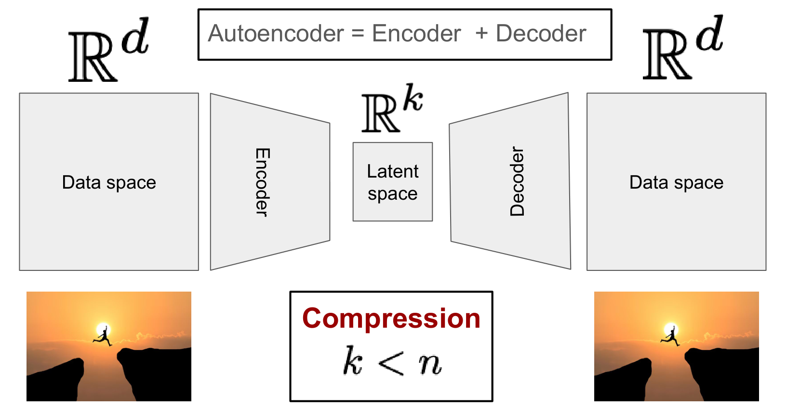
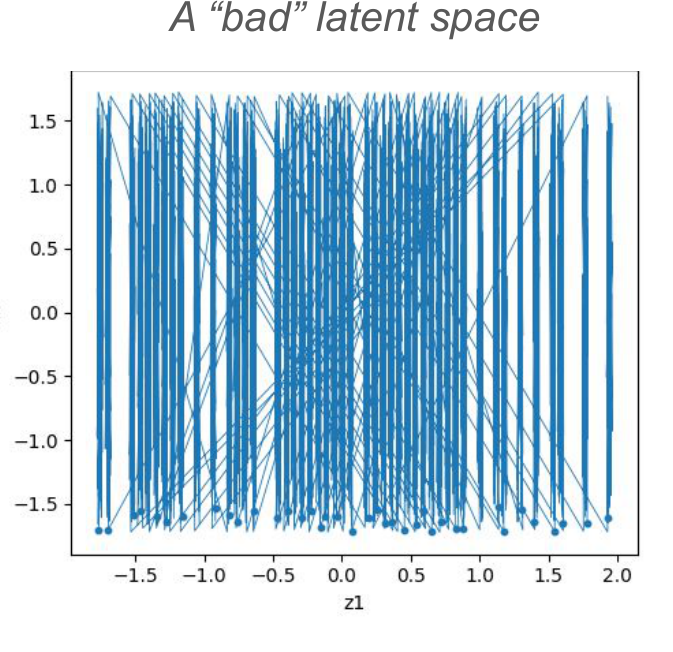
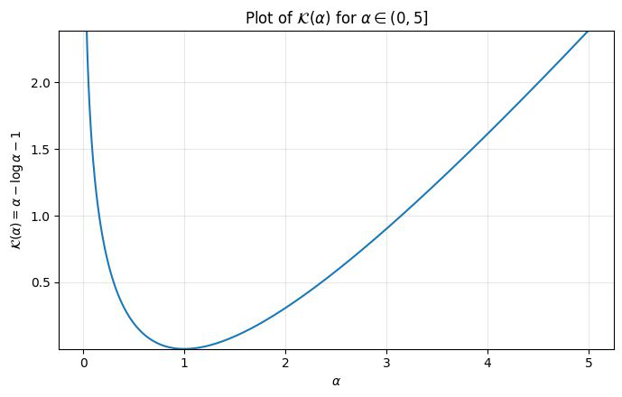
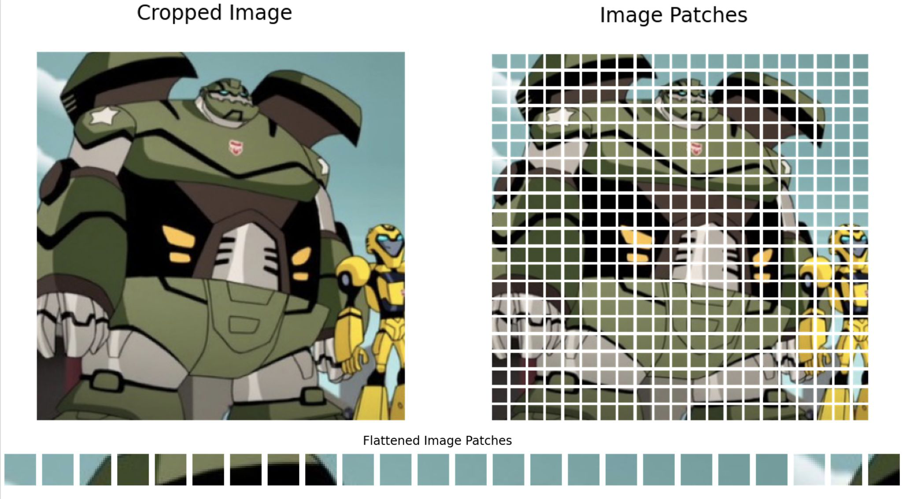
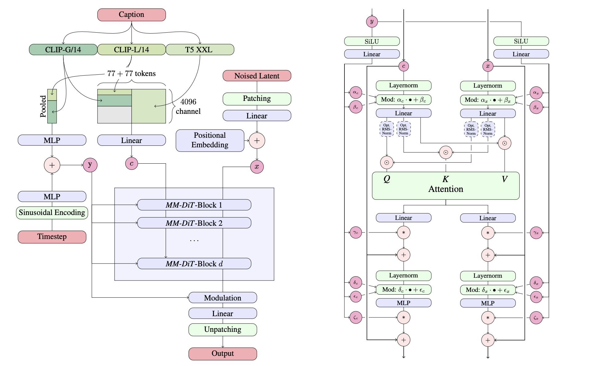
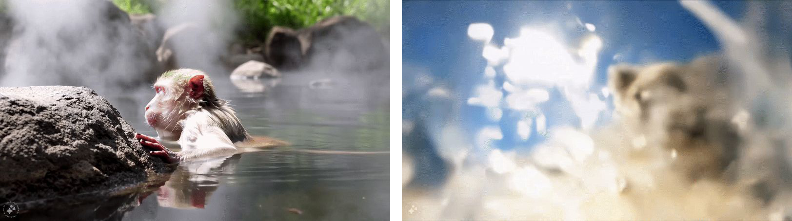

## 1. 标准自编码器（Standard Autoencoders）

### 1.1. 为什么需要潜空间：高维数据带来的三个问题

一张 600×1000 的彩色图像有 3 个颜色通道，展平成一个向量后维度为：

\[
3 \times 600 \times 1000 = 1.8 \times 10^6
\]

这是一个非常高维的空间，直接在上面建模会遇到三个问题：

- **GPU 显存爆炸**：向量场网络的输入输出都是这个维度的向量。
- **学习问题非常困难**：网络需要在 180 万维的空间里拟合一个向量场。
- **冗余**：相邻像素高度相关，原始表示中存在大量重复信息。

高维对扩散模型的伤害比对监督学习更大，原因有两点：

- 扩散模型学习的是一个向量场 \(u_t^{\theta}: \mathbb{R}^d \to \mathbb{R}^d\)，它的<strong>输出本身就是高维的</strong>，而不只是一个标量标签。
- 采样时要反复应用这个向量场（模拟 ODE），高维带来的误差会在多步迭代中累积。

因此，如果能把数据搬到一个维度低得多的空间里，再去学那里的分布，上述问题都能缓解。

### 1.2. 潜空间的构造：编码器与解码器

潜空间由<strong>自编码器（Autoencoder）</strong>构造。一个自编码器由编码器（Encoder）和解码器（Decoder）两部分组成，作用是把数据空间中的样本压缩到潜空间，再还原回数据空间：

\[
\text{Data space } \mathbb{R}^d \;\xrightarrow{\ \text{Encoder}\ }\; \text{Latent space } \mathbb{R}^k \;\xrightarrow{\ \text{Decoder}\ }\; \text{Data space } \mathbb{R}^d
\]

潜空间维度 \(k\) 小于数据空间维度 \(d\)，这一步称为<strong>压缩（Compression）</strong>。正因为 \(k < d\)，编码器必须丢掉信息，而解码器只能依赖保留下来的那部分信息重建原图——这正是自编码器能学到有意义表示的原因。

<figure>
  
  <figcaption>图 1：自编码器的编码器—潜空间—解码器结构。数据空间 \(\mathbb{R}^d\) 中的样本经编码器压缩为潜空间 \(\mathbb{R}^k\) 中的潜变量，再由解码器还原回数据空间。图中同一张图像在两端出现，表示重构目标是还原输入本身。图源：MIT 6.S184 Lecture 4。</figcaption>
</figure>

### 1.3. 标准自编码器：编码器、解码器与重构损失

记数据空间中的样本为 \(x \in \mathbb{R}^d\)，潜空间中的潜变量为 \(z \in \mathbb{R}^k\)。标准自编码器由两个网络组成：

| 组件 | 记号 | 映射 | 参数 |
| --- | --- | --- | --- |
| 编码器（Encoder） | \(\mu_\phi\) | \(\mathbb{R}^d \to \mathbb{R}^k\) | \(\phi\) |
| 解码器（Decoder） | \(\mu_\theta\) | \(\mathbb{R}^k \to \mathbb{R}^d\) | \(\theta\) |

编码器把样本映射为潜变量 \(z = \mu_\phi(x)\)，解码器再把潜变量映射回数据空间 \(\mu_\theta(z)\)。训练目标要求“编码再解码”能还原输入，对应的<strong>重构损失（Reconstruction Loss）</strong>为：

\[
L_{\mathrm{recon}}(\theta, \phi) = \mathbb{E}_{x \sim p_{\mathrm{data}}}\left[\left\|\mu_\theta(\mu_\phi(x)) - x\right\|^2\right]
\]

也就是重构结果与原图之间的均方误差。训练完成后，标准自编码器在两方面是成功的：

- ✓ **压缩（Compression）**：数据被映射到低维潜空间。
- ✓ **重构（Reconstruction）**：潜变量能还原出原始样本。

同时，编码器也<strong>诱导出潜变量的分布</strong>：给定数据分布 \(x \sim p_{\mathrm{data}}\)，令 \(z = \mu_\phi(x)\)，就有

\[
z \sim p_{\mathrm{latent}}
\]

这个 \(p_{\mathrm{latent}}\) 是 \(p_{\mathrm{data}}\) 经过编码器推前（push-forward）得到的分布，而不是我们事先指定的分布。

#### 潜分布不受约束：能压缩但难以采样

使用潜空间的完整计划是两步：先把数据变换成潜变量，再在潜空间里学习潜变量的分布。于是有一个关键问题：

> 数据分布被变换到潜空间之后，变成了什么分布？

答案是：<strong>不知道</strong>。重构损失只约束重构质量，对潜变量的分布没有任何约束。

后果是：我们可能把学习问题（也就是训练）变得更困难了。潜空间虽然降低了维度，但如果 \(p_{\mathrm{latent}}\) 本身是一个形状怪异的分布，那么学它并不比学原空间的分布容易。最终的结果是——<strong>能压缩，但学不会如何采样这个分布</strong>。

<figure>
  
  <figcaption>图 2：“坏的”潜空间。把邻近的样本用线连起来可以看到，编码器学到的潜分布杂乱无章，没有可利用的几何结构，因此很难在上面训练生成模型。图源：MIT 6.S184 Lecture 4。</figcaption>
</figure>

要解决这个问题，需要的不是一个重构得更好的自编码器，而是一个能产生<strong>“好的”潜分布</strong>的自编码器：让 \(p_{\mathrm{latent}}\) 本身具备简单、规整的形状，这样才能在其上有效地训练和采样。变分自编码器（Variational Autoencoder，VAE）正是朝这个方向的答案。

## 2. 变分自编码器（Variational Autoencoder，VAE）

变分自编码器换了一个做法：让编码器不再输出一个点，而是输出一个分布。

### 2.1. 编码器与解码器：从确定性映射到概率分布

VAE 的编码器是一个条件分布：

\[
q_\phi(z \mid x) = \mathcal{N}\left(z;\, \mu_\phi(x),\, \sigma_\phi^2(x) I_k\right)
\]

给定样本 \(x\)，编码器输出的是一个高斯分布：均值 \(\mu_\phi(x)\) 与方差 \(\sigma_\phi^2(x)\) 都由网络预测，协方差取对角形式 \(\sigma_\phi^2(x) I_k\)。相比标准自编码器只学一个均值网络，VAE 的编码器额外学一个方差网络，用方差刻画“这个样本应该被编码到潜空间中多大的范围里”。

解码器同样建模为条件分布：

\[
p_\theta(x \mid z) = \mathcal{N}\left(x;\, \mu_\theta(z),\, \sigma^2 I_d\right)
\]

关键区别在于方差 \(\sigma^2 I_d\) 是<strong>固定的常数</strong>（fixed），不由网络学习。既然方差固定，最大化对数似然就等价于让均值去逼近 \(x\)，因此给定潜变量 \(z\) 之后，最优的重构就是直接取均值：

\[
x \approx \mu_\theta(z)
\]

这就是“确定性解码（Deterministic decoding）”的含义：解码端不需要真的做一次随机采样，取分布的均值就够了。

两端的采样流程分别是：

- **编码（Encode）**：从编码器分布中采样，\(z \sim q_\phi(\cdot \mid x)\)。
- **解码（Decode）**：从解码器分布中采样，\(x \sim p_\theta(\cdot \mid z)\)；由于方差固定，实际取 \(\mu_\theta(z)\) 即可。

### 2.2. VAE 的重构损失：负对数似然等价于加权的均方误差

VAE 的重构项不是直接写成均方误差，而是定义为解码器对数似然的负数，在高斯解码器下再化为均方误差：

\[
\begin{aligned}
L_{\mathrm{recon}}(\phi, \theta)
&= \mathbb{E}_{\substack{x \sim p_{\mathrm{data}},\\ z \sim q_\phi(\cdot \mid x)}} \left[ -\log p_\theta(x \mid z) \right] \\
&= \mathbb{E}_{\substack{x \sim p_{\mathrm{data}},\\ z \sim q_\phi(\cdot \mid x)}} \left[ \frac{1}{2\sigma^2}\left\|x - \mu_\theta(z)\right\|^2 \right]
\end{aligned}
\]

期望同时对两个分布取：\(x\) 来自数据分布 \(p_{\mathrm{data}}\)，\(z\) 由编码器分布 \(q_\phi(\cdot \mid x)\) 采样得到。

推导：从负对数似然到均方误差

代入 2.1 节的高斯解码器 \(p_\theta(x \mid z) = \mathcal{N}\left(x;\, \mu_\theta(z),\, \sigma^2 I_d\right)\)，利用高斯分布的对数密度

\[
-\log p_\theta(x \mid z) = \frac{1}{2\sigma^2}\left\|x - \mu_\theta(z)\right\|^2 + \text{const}
\]

常数项只与固定的 \(\sigma^2\) 有关，不含 \(\phi, \theta\)，对优化没有影响。系数 \(\frac{1}{2\sigma^2}\) 同样是固定常数，不改变最优解，只改变损失的量级。因此在高斯解码器下，重构损失本质上就是标准自编码器的均方误差。

### 2.3. 先验损失：把潜分布拉向标准正态分布

重构损失只约束重构质量，潜分布 \(p_{\mathrm{latent}}\) 的形状仍然完全不受约束。要让潜分布变成指定的形状，需要再加一项把它主动拉过去。先验损失（Prior Loss）选定的目标形状是标准正态分布 \(\mathcal{N}(0, I)\)，它直接最小化编码器分布与目标分布之间的 KL 散度：

\[
L_{\mathrm{prior}}(\phi) = \mathbb{E}_{x \sim p_{\mathrm{data}}}\left[ D_{\mathrm{KL}}\left(q_\phi(z \mid x) \,\|\, \mathcal{N}(0, I)\right) \right]
\]

KL 散度（Kullback-Leibler Divergence）衡量两个分布的差异：\(D_{\mathrm{KL}}(q \,\|\, p) \ge 0\)，且当且仅当 \(q = p\) 时取 0。两个分布都是对角正态分布时，它有闭式解：

\[
D_{\mathrm{KL}}(q \,\|\, p) = \frac{1}{2}\left( \underbrace{\mathcal{K}\left(\frac{\sigma_q^2}{\sigma_p^2}\right)}_{\text{Dist. of variances}} + \underbrace{\frac{\left\|\mu_q - \mu_p\right\|^2}{\sigma_p^2}}_{\text{Dist. of mean}} \right), \qquad \mathcal{K}(\alpha) = \sum_i \left( \alpha_i - \log \alpha_i - 1 \right)
\]

推导：两个正态分布之间的 KL 散度

从 KL 散度的定义出发，\(D_{\mathrm{KL}}(q \,\|\, p) = \mathbb{E}_{x \sim q}\left[\log q(x) - \log p(x)\right]\)，也就是在对数密度之差上取期望。协方差是对角阵，各维可以分开处理，先看第 \(i\) 维。正态分布的对数密度是

\[
\log q_i(x_i) = -\frac{1}{2}\log 2\pi - \frac{1}{2}\log \sigma_{q,i}^2 - \frac{\left(x_i - \mu_{q,i}\right)^2}{2\sigma_{q,i}^2}
\]

其中 \(-\frac{1}{2}\log 2\pi\) 对 \(p\) 也完全相同，相减时抵消。于是

\[
\log q_i(x_i) - \log p_i(x_i) = \frac{1}{2}\log\frac{\sigma_{p,i}^2}{\sigma_{q,i}^2} + \frac{1}{2}\left( \frac{\left(x_i - \mu_{p,i}\right)^2}{\sigma_{p,i}^2} - \frac{\left(x_i - \mu_{q,i}\right)^2}{\sigma_{q,i}^2} \right)
\]

对 \(x \sim q\) 取期望只用到两个矩：一个是方差的定义，另一个把 \(x_i - \mu_{p,i}\) 拆成 \(\left(x_i - \mu_{q,i}\right) + \left(\mu_{q,i} - \mu_{p,i}\right)\) 后展开，交叉项期望为零：

\[
\mathbb{E}_{q}\left[\left(x_i - \mu_{q,i}\right)^2\right] = \sigma_{q,i}^2, \qquad \mathbb{E}_{q}\left[\left(x_i - \mu_{p,i}\right)^2\right] = \left(\mu_{q,i} - \mu_{p,i}\right)^2 + \sigma_{q,i}^2
\]

代回并逐项整理，第一项期望为 \(1\)：

\[
D_{\mathrm{KL}}(q_i \,\|\, p_i) = \frac{1}{2}\left( \log\frac{\sigma_{p,i}^2}{\sigma_{q,i}^2} + \frac{\left(\mu_{q,i} - \mu_{p,i}\right)^2}{\sigma_{p,i}^2} + \frac{\sigma_{q,i}^2}{\sigma_{p,i}^2} - 1 \right)
\]

记 \(\alpha_i = \sigma_{q,i}^2 / \sigma_{p,i}^2\)，则 \(\log\frac{\sigma_{p,i}^2}{\sigma_{q,i}^2} = -\log\alpha_i\)，与后面两项合并正好凑出 \(\alpha_i - \log\alpha_i - 1\)。对所有维度求和，就得到前面的公式：

\[
D_{\mathrm{KL}}(q \,\|\, p) = \frac{1}{2}\left( \sum_i \left( \alpha_i - \log \alpha_i - 1 \right) + \sum_i \frac{\left(\mu_{q,i} - \mu_{p,i}\right)^2}{\sigma_{p,i}^2} \right)
\]

第一个求和只含方差，第二个求和只含均值，分别就是 \(\mathcal{K}(\sigma_q^2/\sigma_p^2)\) 与 \(\|\mu_q - \mu_p\|^2/\sigma_p^2\)。

<figure>
  
  <figcaption>图 3：\(\mathcal{K}(\alpha) = \alpha - \log \alpha - 1\) 的图像。函数在 \(\alpha = 1\) 处取到最小值 0，对应 \(\sigma_q^2 = \sigma_p^2\) 的退化情形，此时方差项消失；这与 KL 散度恒非负、且仅当两个分布相同时才为零一致。图源：MIT 6.S184 Lecture 4。</figcaption>
</figure>

第一项只与方差有关，第二项只与均值有关。先验取 \(\mathcal{N}(0, I)\) 时 \(\sigma_p^2 = 1\)、\(\mu_p = 0\)，两项的分母都退化为 1，直接得到先验损失：

\[
L_{\mathrm{prior}}(\phi) = \mathbb{E}_{x \sim p_{\mathrm{data}}}\left[ \frac{1}{2}\left( \mathcal{K}\left(\frac{\sigma_\phi^2(x)}{1}\right) + \frac{\left\|\mu_\phi(x)\right\|^2}{1} \right) \right]
\]

把 \(\mathcal{K}\) 展开成逐维求和，就是实际实现时使用的形式：

\[
L_{\mathrm{prior}}(\phi) = \mathbb{E}_{x \sim p_{\mathrm{data}}}\left[ \frac{1}{2} \sum_{j=1}^{k} \left( \mu_{\phi,j}^2(x) + \sigma_{\phi,j}^2(x) - \log \sigma_{\phi,j}^2(x) - 1 \right) \right]
\]

加上先验损失之后：

- ✓ **压缩（Compression）**
- ✓ **训练（Training）**
- ✗ **重构（Reconstruction）**

### 2.4. VAE 的训练：两项损失与 β

训练时把重构损失与先验损失合并成一个目标，用系数 \(\beta \ge 0\) 调节两者的相对权重。这个总损失记作 \(L_{\mathrm{VAE}}\)，展开就是把 2.2 节与 2.3 节的两项损失写在一起：

\[
\begin{aligned}
L_{\mathrm{VAE}}(\phi, \theta)
&= L_{\mathrm{recon}}(\phi, \theta) + \beta\,L_{\mathrm{prior}}(\phi) \\
&= \mathbb{E}_{x \sim p_{\mathrm{data}},\, z \sim q_\phi(\cdot \mid x)}\left[ \frac{1}{2\sigma^2}\left\| x - \mu_\theta(z) \right\|^2 + \beta\,\frac{1}{2}\left( \mathcal{K}\left(\frac{\sigma_\phi^2(x)}{1}\right) + \frac{\left\|\mu_\phi(x)\right\|^2}{1} \right) \right]
\end{aligned}
\]

| **算法 7** \(\beta\)-VAE 训练流程 |
| --- |
| **输入**：由样本 \(x \sim p_{\mathrm{data}}\) 构成的数据集，编码器网络 \((\mu_\phi(x), \log\sigma_\phi^2(x))\)，解码器网络 \(\mu_\theta(z)\)，潜空间维度 \(k\)，常数 \(\beta \ge 0\)、\(\sigma^2 > 0\) |
| 1: **for** 每个小批量数据 \(\{x_i\}_{i=1}^{B}\) **do** |
| 2: \(\quad\)编码每个 \(x_i\)：\(\mu_i \leftarrow \mu_\phi(x_i)\)，\(\log\sigma_i^2 \leftarrow \log\sigma_\phi^2(x_i)\) |
| 3: \(\quad\)采样噪声 \(\epsilon_i \sim \mathcal{N}(0, I_k)\) |
| 4: \(\quad\)重参数化：\(z_i \leftarrow \mu_i + \sigma_i \odot \epsilon_i\) |
| 5: \(\quad\)解码均值：\(\hat{x}_i \leftarrow \mu_\theta(z_i)\) |
| 6: \(\quad\)计算重构损失 \(\mathcal{L}_{\mathrm{recon}} \leftarrow \frac{1}{B}\sum_{i=1}^{B}\frac{1}{2\sigma^2}\lVert x_i - \hat{x}_i\rVert^2\) |
| 7: \(\quad\)计算对先验 \(p_{\mathrm{prior}}(z) = \mathcal{N}(0, I_k)\) 的 KL 损失 \(\mathcal{L}_{\mathrm{KL}} \leftarrow \frac{1}{B}\sum_{i=1}^{B}\frac{1}{2}\sum_{j=1}^{k}\left(\mu_{i,j}^2 + \sigma_{i,j}^2 - \log\sigma_{i,j}^2 - 1\right)\) |
| 8: \(\quad\)总损失 \(\mathcal{L} \leftarrow \mathcal{L}_{\mathrm{recon}} + \beta\,\mathcal{L}_{\mathrm{KL}}\) |
| 9: \(\quad\)在 \(\mathcal{L}\) 上通过梯度下降更新模型参数 \((\phi, \theta)\) |
| 10: **end for** |

其中 \(\mathcal{L}_{\mathrm{recon}}\) 与 \(\mathcal{L}_{\mathrm{KL}}\)（即上式中的 \(L_{\mathrm{recon}}\) 与 \(L_{\mathrm{prior}}\)）分别是 2.2 节重构损失与 2.3 节先验损失的 mini-batch 平均形式。

\(\beta\) 决定先验损失占多大分量：\(\beta = 0\) 时退化为标准自编码器，\(\beta\) 越大潜分布越贴近 \(\mathcal{N}(0, I)\)。

加上先验损失之后：

- ✓ **压缩（Compression）**
- ✓ **重构（Reconstruction）**
- ✓ **训练（Training）**

### 2.5. 重参数化技巧：让采样可导

2.4 节的总损失里有一个期望要对 \(q_\phi(z \mid x)\) 采样 \(z\)，而采样这一步本身不可导，梯度传不回去。<strong>重参数化技巧（Reparameterization Trick）</strong>把随机性挪到参数之外：先在标准正态里采一个与 \(\phi\) 无关的噪声，再用编码器的输出做一次确定性的变换。

编码器给出的分布是

\[
q_\phi(z \mid x) = \mathcal{N}\left(z;\, \mu_\phi(x),\, \sigma_\phi^2(x) I_k\right)
\]

重参数化把采样拆成两步，先从与 \(\phi\) 无关的标准正态里采噪声，再做变换：

\[
\epsilon \sim \mathcal{N}(0, I_k), \qquad z = \mu_\phi(x) + \sigma_\phi(x)\,\epsilon \implies z \sim q_\phi(\cdot \mid x)
\]

这样 \(z\) 对 \(\phi\) 的依赖就是确定性的线性关系，梯度可以正常回传，而 \(z\) 的分布仍然是 \(q_\phi(\cdot \mid x)\)。

把 \(z\) 的这个表达式代回总损失，期望里的随机变量就从 \(z\) 换成了 \(\epsilon\)：

\[
L_{\mathrm{VAE}}(\phi, \theta) = \mathbb{E}_{x \sim p_{\mathrm{data}},\ \epsilon \sim \mathcal{N}(0, I_k)}\left[ \frac{1}{2\sigma^2}\left\| x - \mu_\theta\left(\mu_\phi(x) + \sigma_\phi(x)\,\epsilon\right) \right\|^2 + \frac{\beta}{2}\left( \mathcal{K}\left(\frac{\sigma_\phi^2(x)}{1}\right) + \frac{\left\|\mu_\phi(x)\right\|^2}{1} \right) \right]
\]

## 3. 潜空间扩散模型（Latent Diffusion Models，LDM）

有了能把数据压进规整潜空间的 VAE，扩散模型就不必在像素上训练，可以改在潜空间上训练。完整流程是：

1. **数据（Data）**：取全部训练数据 \(x_1, \dots, x_N\)（例如互联网上的所有图像）。
2. **编码（Encoding）**：把所有图像转成潜变量（对 VAE 直接取均值预测即可）。
3. **潜数据（Latent data）**：得到潜变量数据集 \(z_1, \dots, z_N\)，规模远小于原始高分辨率图像。
4. **潜扩散模型（Latent diffusion model）**：在潜变量数据集上训练扩散模型，也就是说，扩散模型从此生成的是潜向量。
5. **解码（Decoding）**：从扩散模型采样之后，把生成的潜变量映射回数据空间。

返回解码后的图像作为样本。配方和之前的扩散模型完全一样，只是数据集换成了变换后的潜数据集。

几乎所有看得见的 AI 生成图像或视频，都是在潜空间里生成的。原因在显存：直接在像素空间做扩散，显存会爆掉。把数据压到潜空间之后，模型才能把容量集中到关键内容上，而不是均匀地分摊到每一个像素。

两个代表性模型的张量形状：

| 模型 | 图像张量 | 潜变量张量 | 压缩倍数 |
| --- | --- | --- | --- |
| Stable Diffusion | \(3 \times 256 \times 256\) | \(4 \times 32 \times 32\) | \(48\times\) |
| FLUX 2.0 | \(3 \times 1024 \times 1024\) | \(32 \times 64 \times 64\) | \(24\times\) |

## 4. 神经网络架构（Neural Network Architectures）

前面几节一直把向量场 \(u_t^\theta\) 当作已经存在的函数在用，这一章回答它由什么网络实现：输入有哪几种、各自怎么编码成向量、用哪种结构处理。

### 4.1. 向量场的参数化：网络要处理的三种输入

整章要搭的神经网络，输出的是向量场本身，写成

\[
u_t^\theta(x \mid y)
\]

每个符号各有来源：

| 符号 | 含义 |
| --- | --- |
| \(u_t^\theta(x \mid y)\) | 网络输出的向量场 |
| \(\theta\) | 网络参数 |
| \(t\) | 时间，写在右下角 |
| \(x\) | 潜图像（latent image） |
| \(y\) | 提示词（prompt） |

时间是一维标量，潜图像是高维张量，提示词是文本序列。三者形态完全不同，得先各自编码成向量，再送进网络。

### 4.2. 时间编码：正弦嵌入

时间只有一维，而其他变量都是高维的。为了让它在网络里“更有分量”，用下面的正弦嵌入把它摊成一个高维向量：

\[
\operatorname{TimeEmb}(t) = \frac{1}{\sqrt{d}}\left[\cos(2\pi w_1 t)\ \cdots\ \cos(2\pi w_{d/2}t)\ \ \sin(2\pi w_1 t)\ \cdots\ \sin(2\pi w_{d/2}t)\right]^{\top}
\]

频率按几何级数选取：

\[
w_i = w_{\min}\left(\frac{w_{\max}}{w_{\min}}\right)^{\frac{i-1}{d/2-1}}, \qquad i = 1, \dots, d/2
\]

具体形式并不重要，关键性质是时间嵌入是一个 \(d\) 维的归一化向量：

\[
\left\| \operatorname{TimeEmb}(t) \right\| = 1
\]

### 4.3. 语言提示词编码：预训练文本嵌入

提示词是一句自然语言，比如 “A dog running on grass in a park at sunshine in an Italian city.”。要把文本变成向量，大多数模型直接用预训练的语言嵌入：

- CLIP 嵌入（Contrastive Language-Image Pre-training）
- T5 嵌入等（其他预训练模型）
- 也可以用 LLM 的嵌入

这些嵌入的结果，是提示词变成一条长度为 \(S\) 的向量序列：

\[
\operatorname{PromptEmbed}(y_{\mathrm{raw}}) \in \mathbb{R}^{S \times k}
\]

### 4.4. Patchify：把图像变成向量序列

Transformer 处理的是向量序列，而图像是三维张量，所以先把图像切成小块（patch），再展平成序列。图像记为

\[
x \in \mathbb{R}^{3 \times H \times W}
\]

切块展平后得到

\[
\tilde{x} = \operatorname{Patchify}(x), \qquad \tilde{x} \in \mathbb{R}^{L \times k}
\]

其中 \(L\) 是序列长度，也就是 patch 的个数。

<figure>
  
  <figcaption>图 4：Patchify 把图像变成向量序列。左侧是原始图像 \(x \in \mathbb{R}^{3 \times H \times W}\)；右侧把图像切成规则的小块（patch）；下方把每个小块展平成一维向量并排成一行，得到序列 \(\tilde{x} \in \mathbb{R}^{L \times k}\)。图源：MIT 6.S184 Lecture 4。</figcaption>
</figure>

### 4.5. 扩散 Transformer（DiT）：三步流程与 DiTBlock

**扩散 Transformer（Diffusion Transformer，DiT）** 是面向扩散模型的 Transformer，它把 Transformer 改造扩散模型所需要的形式。整个网络分三步：

**1. 输入（Inputs）**：三种输入先各自编码成向量序列

\[
\tilde{t} = \operatorname{TimeEmb}(t) \in \mathbb{R}^k, \qquad \tilde{x}_0 = \operatorname{PatchEmb}(x) \in \mathbb{R}^{N \times k}, \qquad \tilde{y} = \operatorname{PromptEmb}(y) \in \mathbb{R}^{S \times k}
\]

**2. 注意力循环（Attention loop）**：图像序列反复穿过 DiT 块

\[
\tilde{x}_{i+1} = \operatorname{DiTBlock}(\tilde{x}_i, \tilde{t}, \tilde{y}) \in \mathbb{R}^{N \times k}, \qquad i = 0, \dots, N-1
\]

**3. 反变换（Unpatchify）**：把处理完的序列还原回图像形状，得到向量场

\[
u = \operatorname{Unpatchify}(\tilde{z}_N \tilde{W}) \in \mathbb{R}^{C \times H \times W}
\]

三步里反复调用的 \(\operatorname{DiTBlock}\) 是网络的核心。它要同时吃下三种输入，每种用一套机制：

- **图像走自注意力（Self-attention）**：查询、键、值都取图像本身，让图像处理自己。
- **文本走交叉注意力（Cross-attention）**：查询取图像，键和值取文本嵌入，让图像去关注文本。
- **时间走自适应层归一化（Adaptive Layer Normalization）**：归一化的缩放与偏移由时间变量决定。

三种输入的结果相加合并成一路。

理解 Transformer 最好的方式是把它实现一遍——课程 Lab 03 有实现，讲义里有详细说明。

## 5. 大规模扩散模型（Large-Scale Diffusion Models）

### 5.1. 案例：Stable Diffusion 3

Stable Diffusion 3 的概览：

- 流匹配模型，用“直线”调度器（CondOT 路径）
- 无分类器引导（Classifier-free guidance），权重 2.0 - 5.0
- 在潜空间做流匹配（用预训练 VAE）
- 模型参数量：80 亿
- 采样步数：50
- 数据集：LAION

<figure>
  
  <figcaption>图 5：Stable Diffusion 3 的生成样例。图源：Scaling Rectified Flow Transformers for High-Resolution Image Synthesis [3]。</figcaption>
</figure>

网络架构上：

- 通过交叉注意力，把条件建在 **CLIP**（粗粒度）与 **T5-XXL**（序列级）两种文本嵌入上。
- **MM-DiT 架构**：把 DiT 从类别条件扩展到文本条件，让文本与图像通过交叉注意力贯穿整个网络。

<figure>
  
  <figcaption>图 6：Stable Diffusion 3 的架构。左侧是整体流程：提示词分别经 CLIP-G/14、CLIP-L/14 与 T5-XXL 三个文本编码器得到文本嵌入，带噪潜变量经 Patching 与位置编码后进入 \(d\) 个 MM-DiT 块，最后 Unpatching 回图像空间；时间步经正弦编码后与池化文本嵌入一起调制这些块。右侧是单个 MM-DiT 块的内部结构：文本与图像两条流各自做归一化与线性投影，共享同一个注意力层，再各自过 MLP 后返回。图源：Scaling Rectified Flow Transformers for High-Resolution Image Synthesis [3]。</figcaption>
</figure>

### 5.2. 案例：Meta MovieGen

Meta MovieGen 的概览：

- 流匹配模型，用“直线”调度器（CondOT 路径）
- 无分类器引导
- 在潜空间做流匹配（用预训练 VAE）——对视频尤其关键，因为多了时间维度
- 网络架构：把 DiT 改造到视频上（改的是什么？）
- 模型参数量：300 亿
- 用了 6,144 张 H100 GPU

<figure>
  
  <figcaption>图 7：Meta MovieGen 生成的视频帧示例。左侧是一只泡在温泉里的猕猴，右侧是一次溅起水花的特写。图源：MIT 6.S184 Lecture 4。</figcaption>
</figure>

## 参考文献

[1] P. Holderrieth and R. Shprints, "Latent Spaces, Neural network architectures," MIT 6.S184 Lecture 4 slides, 2026. [Online]. Available: https://diffusion.csail.mit.edu/2026/docs/20260128_Lecture_04_edited.pdf

[2] W. Peebles and S. Xie, "Scalable Diffusion Models with Transformers," in Proceedings of the IEEE/CVF International Conference on Computer Vision (ICCV), 2023, pp. 4195–4205.

[3] P. Esser, S. Kulal, A. Blattmann, et al., "Scaling Rectified Flow Transformers for High-Resolution Image Synthesis," in Proceedings of the 41st International Conference on Machine Learning (ICML), 2024.
