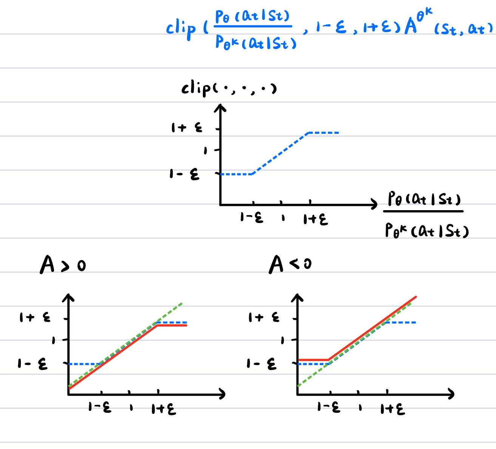

Policy optimization for large language models follows two main routes:

- **Online reinforcement learning**: PPO, TRPO, GRPO, and the policy-optimization method used by Kimi k1.5 generate responses with the current policy and update it from rewards and advantages.
- **Direct preference optimization**: methods such as DPO and SimPO learn directly from preferred-dispreferred response pairs without online rollouts in the training loop.

This article focuses on the core objectives and connections among these methods. General training details outside language-model post-training remain in the corresponding algorithm-specific posts.

## 1. Policy Gradients: Where the TRPO Surrogate Comes From

The probability of a trajectory \(\tau=(s_1,a_1,\ldots,s_T,a_T)\) is

\[
p_\theta(\tau)
=p(s_1)\prod_{t=1}^{T}
\pi_\theta(a_t\mid s_t)\,
p(s_{t+1}\mid s_t,a_t).
\]

Environment-transition probabilities do not depend on \(\theta\). Applying the log-derivative trick to \(J(\theta)=\mathbb{E}_{\tau\sim p_\theta}[R(\tau)]\) gives

\[
\nabla_\theta J(\theta)
=\mathbb{E}_{\tau\sim p_\theta}
\left[
R(\tau)\sum_t\nabla_\theta\log\pi_\theta(a_t\mid s_t)
\right].
\]

In practice, an advantage estimate \(\hat A_t\) replaces the whole-trajectory return and measures whether an action was better than the baseline for that state.

Expand: why can old-policy data update a new policy?

Importance sampling rewrites an expectation under \(p\) as one under \(q\):

\[
\mathbb{E}_{x\sim p}[f(x)]
=\mathbb{E}_{x\sim q}
\left[\frac{p(x)}{q(x)}f(x)\right].
\]

For data collected by \(\pi_{\theta_{\mathrm{old}}}\), each step uses the probability ratio

\[
\rho_t(\theta)
=\frac{\pi_\theta(a_t\mid s_t)}
{\pi_{\theta_{\mathrm{old}}}(a_t\mid s_t)}
\]

to correct the distribution mismatch. This ratio can have high variance when the policies differ substantially or when the old policy rarely samples an action. TRPO controls this divergence through its KL constraint.

## 2. PPO: Approximating Trust-region Updates with Clipping

The most common core objective of [Proximal Policy Optimization (PPO)](https://arxiv.org/abs/1707.06347) is PPO-Clip:

\[
\boxed{
\begin{aligned}
L^{\mathrm{CLIP}}(\theta)
&=\mathbb{E}_t\left[
\min\!\left(
\rho_t(\theta)\hat A_t,\,
\operatorname{clip}\!\left(\rho_t(\theta),1-\epsilon,1+\epsilon\right)\hat A_t
\right)
\right].
\end{aligned}
}
\]

Here,

\[
\boxed{
\rho_t(\theta)
=\frac{\pi_\theta(a_t\mid s_t)}
{\pi_{\theta_{\mathrm{old}}}(a_t\mid s_t)}
}
\]

is the probability ratio assigned to the sampled action by the new and old policies, \(\epsilon\) is the clipping range, and \(\hat A_t\) is the advantage estimate. PPO performs several minibatch updates on the same batch of sampled data.

<strong>PPO's central idea: preserve beneficial policy updates while removing the incentive for excessively large probability changes.</strong>

### 2.1 Optimization Signal: Computing Advantages with MC, TD, n-step TD, or GAE

PPO does not prescribe one advantage estimator. Practical choices include MC, one-step TD, n-step TD, and GAE; see [Deep Reinforcement Learning Overview](../deep-reinforcement-learning-overview/) for the underlying concepts.

#### 2.1.1 Monte Carlo (MC): Using the Complete Return

After the trajectory terminates, compute

\[
\boxed{
G_t^{(\gamma)}
=\sum_{n=t}^{T}\gamma^{\,n-t}r_n.
}
\]

Without a critic, the complete return can be used directly as the actor weight, as in REINFORCE:

\[
A_t=G_t^{(\gamma)}.
\]

Here, \(A_t\) follows the notation used in the overview post and denotes the sample weight passed to the actor. Without a baseline, it is simply the complete return.

In a typical PPO Actor-Critic implementation, MC trains the critic with the complete return and subtracts the state-value baseline to obtain the advantage:

\[
\hat A_t^{\mathrm{MC}}
=G_t^{(\gamma)}-V_\phi(s_t),
\]

\[
L_{\mathrm{critic}}^{\mathrm{MC}}(\phi)
=\frac{1}{2}\sum_t
\left[V_\phi(s_t)-G_t^{(\gamma)}\right]^2.
\]

Thus, \(G_t^{(\gamma)}\) is the complete return actually observed, while \(V_\phi(s_t)\) is the return normally expected from the state; when a critic is used, their difference is the advantage used by the actor. MC does not bootstrap, but it normally waits for trajectory termination and has relatively high variance.

#### 2.1.2 One-step Temporal Difference (TD): Using a One-step Bootstrap Target

Denote the one-step TD error by

\[
\boxed{
\delta_t
=r_t+\gamma(1-d_t)V_\phi(s_{t+1})-V_\phi(s_t).
}
\]

It can be used directly as a one-step advantage estimate:

\[
\hat A_t^{\mathrm{TD}}=\delta_t.
\]

The corresponding critic loss is

\[
L_{\mathrm{critic}}^{\mathrm{TD}}(\phi)
=\frac{1}{2}\sum_t
\left[
V_\phi(s_t)
-\operatorname{stopgrad}\!\left(
r_t+\gamma(1-d_t)V_\phi(s_{t+1})
\right)
\right]^2.
\]

TD does not need to wait for a complete trajectory and can propagate information backward from the next-state value estimate. Its bootstrap target depends on the critic, however, so value-approximation bias is introduced.

#### 2.1.3 n-step TD: Interpolating between MC and One-step TD

If the trajectory does not terminate within the next \(n\) steps, the n-step TD target is

\[
\boxed{
\begin{aligned}
G_t^{(n)}
&=\sum_{k=0}^{n-1}\gamma^k r_{t+k}
+\gamma^n V_\phi(s_{t+n}).
\end{aligned}
}
\]

The n-step TD advantage is therefore

\[
\begin{aligned}
\hat A_t^{(n)}
&=G_t^{(n)}-V_\phi(s_t) \\
&=-V_\phi(s_t)
+\sum_{k=0}^{n-1}\gamma^k r_{t+k}
+\gamma^nV_\phi(s_{t+n}).
\end{aligned}
\]

Expanding and canceling adjacent value terms gives the same advantage as a sum of the first \(n\) TD errors:

\[
\hat A_t^{(n)}
=\delta_t+\gamma\delta_{t+1}
+\cdots+\gamma^{n-1}\delta_{t+n-1}.
\]

The corresponding critic loss is

\[
L_{\mathrm{critic}}^{(n)}(\phi)
=\frac{1}{2}\sum_t
\left[
V_\phi(s_t)
-\operatorname{stopgrad}\!\left(G_t^{(n)}\right)
\right]^2.
\]

If the trajectory terminates before step \(n\), reward accumulation stops at the terminal state and the final bootstrap term is removed. At \(n=1\), this is one-step TD; when \(n\) spans the complete remaining trajectory, it reduces to MC. Larger \(n\) normally gives lower bias and higher variance.

#### 2.1.4 Generalized Advantage Estimation (GAE): Combining Multi-step Advantages

GAE can be interpreted as an exponentially weighted combination of TD advantages over different step lengths. Without crossing a terminal boundary, first write it as a weighted sum of TD errors:

\[
\hat A_t^{\mathrm{GAE}(\gamma,\lambda)}
=\delta_t
+\gamma\lambda\delta_{t+1}
+(\gamma\lambda)^2\delta_{t+2}
+\cdots.
\]

An implementation need not evaluate this long sum explicitly. It works backward from the end of a rollout:

\[
\hat A_t^{\mathrm{GAE}(\gamma,\lambda)}
=\delta_t
+\gamma\lambda(1-d_t)
\hat A_{t+1}^{\mathrm{GAE}(\gamma,\lambda)},
\qquad
\hat A_{T+1}^{\mathrm{GAE}(\gamma,\lambda)}=0.
\]

Finally, expand \(\delta_t\) to obtain the form used directly in an implementation:

\[
\boxed{
\begin{aligned}
\hat A_t^{\mathrm{GAE}(\gamma,\lambda)}
&=r_t+\gamma(1-d_t)V_\phi(s_{t+1})-V_\phi(s_t) \\
&\quad+\gamma\lambda(1-d_t)
\hat A_{t+1}^{\mathrm{GAE}(\gamma,\lambda)}.
\end{aligned}
}
\]

- At \(\lambda=0\), GAE reduces to the one-step TD advantage.
- As \(\lambda\) approaches \(1\), GAE approaches the MC advantage with a value baseline.
- Smaller \(\lambda\) normally gives lower variance and stronger dependence on the critic; larger \(\lambda\) normally gives lower bias and higher variance.

GAE can also construct a value-regression target for the critic:

\[
\hat G_t^{\mathrm{GAE}}
=\operatorname{stopgrad}\!\left(
\hat A_t^{\mathrm{GAE}(\gamma,\lambda)}+V_\phi(s_t)
\right).
\]

The corresponding critic loss is

\[
L_{\mathrm{critic}}^{\mathrm{GAE}}(\phi)
=\frac{1}{2}\sum_t
\left[
V_\phi(s_t)-\hat G_t^{\mathrm{GAE}}
\right]^2.
\]

#### 2.1.5 Comparing MC, One-step TD, n-step TD, and GAE

| Method | Required future information | Backward recursion? |
| --- | --- | --- |
| MC | From \(t\) to the end of the episode | Usually |
| One-step TD | Current transition and next state | No global recursion |
| n-step TD | The next \(n\) steps | Only within the \(n\)-step window |
| GAE | Multiple subsequent TD errors in the current rollout | Usually |

Whether the estimate comes from MC, one-step TD, n-step TD, or GAE, the final result is \(\hat A_t\), which is passed to PPO-Clip as a fixed weight. The actor update should apply \(\operatorname{stopgrad}\) to \(\hat A_t\) so that actor gradients do not continue through the advantage into the critic.

Expand: how do a rollout and an episode differ?

- **Episode**: one complete task defined by the environment, beginning at an initial state and ending at a terminal state.
- **Rollout**: a trajectory segment collected by the policy for training. It may be a complete episode or only part of one; a fixed-length rollout may also contain the end of one episode and the beginning of the next.

For example, suppose a game episode lasts 1,000 steps, while PPO collects only 128 steps before each update. Steps 1–128 form one rollout, not a complete episode. If the environment has not terminated at step 128, TD or GAE bootstraps beyond the rollout with the critic value

\[
V_\phi(s_{129}).
\]

If step 128 is terminal, the subsequent value is instead treated as \(0\).

Therefore, **the environment determines episode boundaries, while the data-collection procedure determines rollout boundaries.**

### 2.2 Loss Construction: From Advantages to the PPO Loss

Once Section 2.1 has produced \(\hat A_t\), the most direct Policy Gradient actor loss is an advantage-weighted negative log-likelihood:

\[
L_{\mathrm{actor}}^{\mathrm{PG}}(\theta)
=-\mathbb E_t\left[
\operatorname{stopgrad}(\hat A_t)
\log\pi_\theta(a_t\mid s_t)
\right].
\]

#### 2.2.1 PPO-Clip: Clipping the Probability Ratio

PPO data are collected by the old policy \(\pi_{\theta_{\mathrm{old}}}\), while the current policy \(\pi_\theta\) is updated. The probability ratio

\[
\rho_t(\theta)
=\frac{\pi_\theta(a_t\mid s_t)}
{\pi_{\theta_{\mathrm{old}}}(a_t\mid s_t)}
\]

therefore gives the unclipped surrogate \(\rho_t(\theta)\hat A_t\). To limit each policy change, PPO-Clip defines the per-sample surrogate as

\[
\boxed{
\begin{aligned}
\ell_t^{\mathrm{clip}}(\theta)
&=\min\!\left(
\rho_t(\theta)\operatorname{stopgrad}(\hat A_t),
\operatorname{clip}\!\left(
\rho_t(\theta),1-\epsilon,1+\epsilon
\right)
\operatorname{stopgrad}(\hat A_t)
\right).
\end{aligned}
}
\]

The core objective above uses maximization notation. Implementations normally minimize its negative instead:

\[
L_{\mathrm{actor}}^{\mathrm{clip}}(\theta)
=-\mathbb E_t\left[
\ell_t^{\mathrm{clip}}(\theta)
\right].
\]

- **\(\hat A_t>0\)**: the action was better than expected, so its probability should increase; improvement stops once \(\rho_t(\theta)>1+\epsilon\).
- **\(\hat A_t\lt 0\)**: the action was worse than expected, so its probability should decrease; improvement stops once \(\rho_t(\theta)\lt 1-\epsilon\).
- **Clipping is not a hard constraint**: it removes further objective improvement in an out-of-range direction, but the resulting policy may still cross the interval.

#### 2.2.2 PPO-Penalty: Penalizing the KL between Old and Current Policies

PPO-Penalty does not clip the probability ratio. Instead, its surrogate subtracts a KL penalty between the old and current policies:

\[
\boxed{
\begin{aligned}
\ell_t^{\mathrm{KLPEN}}(\theta)
&=\rho_t(\theta)\operatorname{stopgrad}(\hat A_t) \\
&\quad-\beta_{\mathrm{KL}}
D_{\mathrm{KL}}\!\left(
\pi_{\theta_{\mathrm{old}}}(\cdot\mid s_t)
\parallel
\pi_\theta(\cdot\mid s_t)
\right).
\end{aligned}
}
\]

\[
L_{\mathrm{actor}}^{\mathrm{KLPEN}}(\theta)
=-\mathbb E_t\left[
\ell_t^{\mathrm{KLPEN}}(\theta)
\right].
\]

Here, \(\beta_{\mathrm{KL}}\) controls the update size: increase it when the observed KL exceeds a target and decrease it when the KL is far below that target. The original PPO paper discusses both PPO-Clip and PPO-Penalty, while PPO-Clip is more common in practice. They provide two alternative actor losses:

\[
L_{\mathrm{actor}}^{\mathrm{PPO}}(\theta)
=\begin{cases}
L_{\mathrm{actor}}^{\mathrm{clip}}(\theta),
& \text{PPO-Clip},\\
L_{\mathrm{actor}}^{\mathrm{KLPEN}}(\theta),
& \text{PPO-Penalty}.
\end{cases}
\]

#### 2.2.3 RLHF PPO: From a Sequence-level Objective to a Per-token Loss

<figure>
  
  <figcaption>RLHF trains a reward model and then optimizes the policy with online reinforcement learning. Source: Rafailov et al., 2023.</figcaption>
</figure>

PPO-based RLHF methods such as [InstructGPT](https://arxiv.org/abs/2203.02155) treat prompt \(x\) as the initial context, each generated token \(y_t\) as an action, the existing prefix \(s_t=(x,y_{1:t-1})\) as a state, and the complete response \(y\) as a trajectory. For a fixed prompt \(x\), define the sequence-level objective

\[
\boxed{
\begin{aligned}
J_x(\pi_\theta)
&=\mathbb{E}_{y\sim\pi_\theta(\cdot\mid x)}
\left[r_\psi(x,y)\right] \\
&\quad-\beta_{\mathrm{ref}}
D_{\mathrm{KL}}\!\left(
\pi_\theta(\cdot\mid x)
\parallel
\pi_{\mathrm{ref}}(\cdot\mid x)
\right).
\end{aligned}
}
\]

Training then averages over prompts in the dataset, giving the overall objective \(\max_\theta\mathbb E_{x\sim D}[J_x(\pi_\theta)]\).

- \(r_\psi(x,y)\): the score assigned to the complete response by a reward model with parameters \(\psi\).
- \(\pi_\theta\): the LLM being trained, which serves as the actor.
- \(\pi_{\mathrm{ref}}\): an SFT reference model frozen before RLHF to limit drift in language ability and style.
- \(V_\phi(s_t)\): the critic with parameters \(\phi\), which estimates token-state values used to compute advantages.

**From the Sequence-level Objective to Per-token Rewards**

For a rollout collected by the old policy \(\pi_{\theta_{\mathrm{old}}}\), the reference-KL reward for each token is

\[
r_t^{\mathrm{KL}}
=-\beta_{\mathrm{ref}}
\log\frac{
\pi_{\theta_{\mathrm{old}}}(y_t\mid s_t)
}{
\pi_{\mathrm{ref}}(y_t\mid s_t)
}.
\]

The reward model normally assigns one sequence-level score after the complete response has been generated. The per-token reward passed to return and advantage estimation can therefore be written as

\[
\tilde r_t
=r_t^{\mathrm{KL}}
+\mathbf{1}[t=T]r_\psi(x,y).
\]

Intermediate tokens mainly receive the reference-KL reward, while the final token also receives the reward model's score for the complete response.

Expand: How Do Per-token Rewards Recover the Sequence-level Objective?

Let the complete response be \(y=(y_1,\ldots,y_T)\). When token \(t\) is generated, the state

\[
s_t=(x,y_{1:t-1})
=\left(x,y_1,\ldots,y_{t-1}\right)
\]

contains prompt \(x\) and the already generated response prefix \(y_{1:t-1}\). Therefore, the full meaning of \(\pi_\theta(y_t\mid s_t)\) is

\[
\pi_\theta(y_t\mid s_t)
=\pi_\theta(y_t\mid x,y_1,\ldots,y_{t-1}).
\]

At \(t=1\), the response prefix is empty, so \(s_1=x\). Here, \(s_t\) is not an additional independent input: it is the full context visible to the LLM when it generates the current token.

By the autoregressive chain rule, the probability of a complete response is

\[
\pi_\theta(y\mid x)
=\prod_{t=1}^{T}
\pi_\theta(y_t\mid x,y_{1:t-1})
=\prod_{t=1}^{T}\pi_\theta(y_t\mid s_t).
\]

The log sequence-probability ratio therefore decomposes into a sum of token-level log-probability ratios:

\[
\log\frac{
\pi_{\theta_{\mathrm{old}}}(y\mid x)
}{
\pi_{\mathrm{ref}}(y\mid x)
}
=\sum_{t=1}^{T}
\log\frac{
\pi_{\theta_{\mathrm{old}}}(y_t\mid s_t)
}{
\pi_{\mathrm{ref}}(y_t\mid s_t)
}.
\]

When \(\gamma=1\) and no other rewards are present, summing the per-token rewards for one response gives

\[
\begin{aligned}
\sum_{t=1}^{T}\tilde r_t
&=r_\psi(x,y)+\sum_{t=1}^{T}r_t^{\mathrm{KL}} \\
&=r_\psi(x,y)
-\beta_{\mathrm{ref}}
\log\frac{
\pi_{\theta_{\mathrm{old}}}(y\mid x)
}{
\pi_{\mathrm{ref}}(y\mid x)
}.
\end{aligned}
\]

Finally, taking the expectation over prompts and responses generated by the old policy recovers the sequence-level objective corresponding to the current rollout:

\[
\begin{aligned}
&\mathbb E_{x\sim D,\,y\sim\pi_{\theta_{\mathrm{old}}}(\cdot\mid x)}
\left[\sum_{t=1}^{T}\tilde r_t\right] \\
&=\mathbb E_{x\sim D,\,y\sim\pi_{\theta_{\mathrm{old}}}(\cdot\mid x)}
\left[r_\psi(x,y)\right] \\
&\quad-\beta_{\mathrm{ref}}
\mathbb E_{x\sim D}
\left[
D_{\mathrm{KL}}\!\left(
\pi_{\theta_{\mathrm{old}}}(\cdot\mid x)
\parallel
\pi_{\mathrm{ref}}(\cdot\mid x)
\right)
\right].
\end{aligned}
\]

During rollout collection, \(\pi_{\theta_{\mathrm{old}}}\) is a frozen snapshot of the current policy. PPO then uses the probability ratio to update \(\pi_\theta\) on that batch.

**From Rewards to the PPO Loss**

\[
\tilde r_{1:T}
\longrightarrow
\hat A_{1:T}^{\mathrm{GAE}}
\longrightarrow
L_{\mathrm{actor}}^{\mathrm{PPO}}.
\]

GAE from Section 2.1.4 first converts \(\tilde r_t\) into advantages \(\hat A_t\), which are then passed to PPO-Clip in Section 2.2.1 or PPO-Penalty in Section 2.2.2. **The sequence-level reward objective does not replace PPO's probability ratio and advantage: the former defines the optimization direction, while the latter specifies the actual policy update.**

Expand: the Reference KL Can Also Be Added Directly to the Loss

An alternative adds the reference KL directly to the actor loss:

\[
L_{\mathrm{actor}}^{\mathrm{PPO+ref}}(\theta)
=L_{\mathrm{actor}}^{\mathrm{PPO}}(\theta)
+\beta_{\mathrm{ref}}\mathbb E_t\left[
D_{\mathrm{KL}}\!\left(
\pi_\theta(\cdot\mid s_t)
\parallel
\pi_{\mathrm{ref}}(\cdot\mid s_t)
\right)
\right].
\]

Putting the reference KL into the reward or directly into the loss serves the same regularization goal: limiting drift from \(\pi_{\mathrm{ref}}\). After sampling, advantage estimation, clipping, and multiple update epochs, however, the two implementations are not strictly equivalent. An implementation normally uses one placement to avoid counting the reference KL twice.

**Question 1: Why Does Standard PPO Optimize \(\mathbb E_t[\rho_t(\theta)\hat A_t]\), While RLHF Is Written as \(\mathbb E_{x,y}[r_\psi(x,y)]\)?**

- **Standard PPO**: the old policy collects trajectories used to estimate \(\hat A_t\). When the batch is reused to update the current policy, \(\rho_t(\theta)\) corrects the probability mismatch between the two policies.
- **RLHF PPO**: a reward model scores the LLM's complete response, so the high-level objective is written as \(\mathbb E_{x,y}[r_\psi(x,y)]\). The actual update still estimates advantages and optimizes the clipped or KL-penalized form of \(\rho_t(\theta)\hat A_t\).

**Question 2: How Do \(\pi_{\mathrm{old}}\) in Standard PPO and \(\pi_{\mathrm{ref}}\) in RLHF PPO Differ?**

- \(\pi_{\mathrm{old}}\): the policy that collected the current rollout, used to compute the importance-sampling ratio; it is continually refreshed during training.
- \(\pi_{\mathrm{ref}}\): a reference policy frozen before RLHF, usually the SFT model; it defines the reference KL and is not updated.

PPO-Penalty therefore compares the continually refreshed \(\pi_{\mathrm{old}}\) with the current policy, while RLHF's reference KL compares fixed \(\pi_{\mathrm{ref}}\) with the current policy. For PPO's general training loop and parameter definitions, see [Proximal Policy Optimization (PPO)](../ppo/).

#### 2.2.4 Critic Loss and the Total PPO Loss

The critic does not use either actor objective. It regresses toward the value target \(\hat G_t^{\mathrm{target}}\) constructed in Section 2.1:

\[
L_{\mathrm{critic}}(\phi)
=\frac{1}{2}\mathbb E_t
\left[
V_\phi(s_t)
-\operatorname{stopgrad}\!\left(\hat G_t^{\mathrm{target}}\right)
\right]^2.
\]

When the actor, critic, and entropy bonus are optimized together, the loss can be written as

\[
L_{\mathrm{PPO}}(\theta,\phi)
=L_{\mathrm{actor}}^{\mathrm{PPO}}(\theta)
+c_VL_{\mathrm{critic}}(\phi)
-c_H\mathbb E_t\left[
H\!\left(\pi_\theta(\cdot\mid s_t)\right)
\right].
\]

The value loss trains the critic, while the entropy bonus prevents the policy from becoming overly deterministic too early. If the actor and critic are fully separate, the two losses may instead be optimized independently. When RLHF adds the reference KL directly to the loss, replace \(L_{\mathrm{actor}}^{\mathrm{PPO}}\) above with \(L_{\mathrm{actor}}^{\mathrm{PPO+ref}}\). If advantages were already computed from the KL-shaped reward \(\tilde r_t\), the term should not be added again.

### 2.3 Gradient: Clipping Stops Rewarding Excessive Updates

Because \(L_{\mathrm{actor}}^{\mathrm{clip}}=-\mathbb E_t[\ell_t^{\mathrm{clip}}]\), first consider the gradient of the surrogate \(\ell_t^{\mathrm{clip}}\). Before clipping becomes active, the per-sample gradient is

\[
\nabla_\theta\!\left[\rho_t(\theta)\hat A_t\right]
=\rho_t(\theta)\hat A_t
\nabla_\theta\log\pi_\theta(a_t\mid s_t).
\]

Expand: Deriving the Gradient of the Unclipped Surrogate

The probability ratio is

\[
\rho_t(\theta)
=\frac{\pi_\theta(a_t\mid s_t)}
{\pi_{\theta_{\mathrm{old}}}(a_t\mid s_t)}.
\]

The old policy \(\pi_{\theta_{\mathrm{old}}}\) remains frozen during the current update, so the denominator is constant with respect to \(\theta\):

\[
\begin{aligned}
\nabla_\theta\rho_t(\theta)
&=\frac{1}{\pi_{\theta_{\mathrm{old}}}(a_t\mid s_t)}
\nabla_\theta\pi_\theta(a_t\mid s_t) \\
&=\frac{\pi_\theta(a_t\mid s_t)}
{\pi_{\theta_{\mathrm{old}}}(a_t\mid s_t)}
\frac{\nabla_\theta\pi_\theta(a_t\mid s_t)}
{\pi_\theta(a_t\mid s_t)} \\
&=\rho_t(\theta)
\nabla_\theta\log\pi_\theta(a_t\mid s_t).
\end{aligned}
\]

During the actor update, advantage \(\hat A_t\) comes from the collected data and the critic and is treated as a constant by applying \(\operatorname{stopgrad}(\hat A_t)\). Therefore,

\[
\begin{aligned}
\nabla_\theta\!\left[
\rho_t(\theta)\operatorname{stopgrad}(\hat A_t)
\right]
&=\operatorname{stopgrad}(\hat A_t)
\nabla_\theta\rho_t(\theta) \\
&=\rho_t(\theta)\hat A_t
\nabla_\theta\log\pi_\theta(a_t\mid s_t).
\end{aligned}
\]

Ignoring the nondifferentiable points at the clipping boundaries, the PPO-Clip gradient can be summarized as

\[
\nabla_\theta\ell_t^{\mathrm{clip}}=
\begin{cases}
0,
& \hat A_t\gt 0\ \text{and}\ \rho_t(\theta)\gt 1+\epsilon,\\
0,
& \hat A_t\lt 0\ \text{and}\ \rho_t(\theta)\lt 1-\epsilon,\\
\rho_t(\theta)\hat A_t\nabla_\theta\log\pi_\theta(a_t\mid s_t),
& \text{otherwise}.
\end{cases}
\]

A positive advantage pushes the action probability upward, while a negative advantage pushes it downward. Once the probability change crosses the corresponding clipping boundary, that sample no longer provides a gradient encouraging further movement in the same direction. The optimized loss is the negative surrogate \(L_{\mathrm{actor}}^{\mathrm{clip}}\), so its gradient has the opposite sign.

## 3. TRPO: Limiting Policy Updates with a Hard KL Constraint

[Trust Region Policy Optimization (TRPO)](https://arxiv.org/abs/1502.05477) improves a surrogate objective while imposing a hard constraint on the average KL divergence:

\[
\boxed{
\begin{aligned}
\max_\theta\quad
&\hat{\mathbb E}_t\!\left[
\rho_t(\theta)\hat A_t
\right] \\
\text{subject to}\quad
&\hat{\mathbb E}_t\!\left[
D_{\mathrm{KL}}\!\left(
\pi_{\theta_{\mathrm{old}}}(\cdot\mid s_t)
\parallel
\pi_\theta(\cdot\mid s_t)
\right)
\right]\leq\delta.
\end{aligned}
}
\]

The probability ratio \(\rho_t(\theta)\) has the same definition as in PPO, and \(\delta\) is the maximum permitted average KL divergence.

<strong>TRPO's central idea: update in a direction that improves return while keeping every step inside a trust region around the old policy.</strong>

### 3.1 Optimization Signal: Reusing PPO's Advantage Estimation

TRPO does not prescribe how rewards must be converted into advantages. It can likewise use MC, one-step TD, n-step TD, or GAE to obtain \(\hat A_t\); see [PPO Section 2.1](#21-optimization-signal-computing-advantages-with-mctd-n-step-td-or-gae) for the formulas.

The optimization signal is essentially the same in both methods: the old policy collects trajectories, a critic or return estimator computes \(\hat A_t\), and the actor raises the probabilities of positive-advantage actions while lowering those of negative-advantage actions. TRPO differs in <strong>how it limits the size of a policy update</strong>.

### 3.2 Loss Construction: Writing the Hard KL Constraint as a Local Constrained Loss

Let \(L^{\mathrm{sur}}(\theta)\) denote the TRPO surrogate and \(\bar D_{\mathrm{KL}}(\theta)\) its average KL. Around the old parameters \(\theta_{\mathrm{old}}\), apply first- and second-order approximations respectively:

\[
\begin{aligned}
L^{\mathrm{sur}}(\theta_{\mathrm{old}}+\Delta\theta)
&\approx L^{\mathrm{sur}}(\theta_{\mathrm{old}})
+g^\top\Delta\theta, \\
\bar D_{\mathrm{KL}}(\theta_{\mathrm{old}}+\Delta\theta)
&\approx \frac{1}{2}\Delta\theta^\top H\Delta\theta,
\end{aligned}
\]

where

\[
g=\left.\nabla_\theta L^{\mathrm{sur}}(\theta)\right|_{\theta_{\mathrm{old}}},
\qquad
H=\left.\nabla_\theta^2\bar D_{\mathrm{KL}}(\theta)\right|_{\theta_{\mathrm{old}}}.
\]

TRPO therefore solves the following local loss around the current parameters:

\[
\boxed{
\begin{aligned}
\min_{\Delta\theta}\quad
&L_{\mathrm{TRPO}}^{\mathrm{local}}(\Delta\theta)
=-g^\top\Delta\theta \\
\text{subject to}\quad
&\frac{1}{2}\Delta\theta^\top H\Delta\theta\leq\delta.
\end{aligned}
}
\]

Here, \(-g^\top\Delta\theta\) is the negative surrogate improvement to be minimized, while the quadratic form \(\frac{1}{2}\Delta\theta^\top H\Delta\theta\) approximates the average KL between the old and new policies.

Equivalently, introduce a Lagrange multiplier \(\eta\geq 0\):

\[
\mathcal L_{\mathrm{TRPO}}(\Delta\theta,\eta)
=-g^\top\Delta\theta
+\eta\left(
\frac{1}{2}\Delta\theta^\top H\Delta\theta-\delta
\right).
\]

Unlike the preset or adaptively adjusted soft-penalty coefficient in PPO-Penalty, \(\eta\) is a Lagrange multiplier introduced to satisfy the hard KL constraint.

### 3.3 Gradient: From the Surrogate Gradient to the Natural-gradient Direction

The gradient of the TRPO surrogate is the same as that of the [unclipped objective in PPO Section 2.3](#23-gradient-clipping-stops-rewarding-excessive-updates):

\[
\nabla_\theta L^{\mathrm{sur}}(\theta)
=\hat{\mathbb E}_t\!\left[
\rho_t(\theta)\hat A_t
\nabla_\theta\log\pi_\theta(a_t\mid s_t)
\right].
\]

At the expansion point \(\theta=\theta_{\mathrm{old}}\), \(\rho_t(\theta_{\mathrm{old}})=1\), so

\[
g
=\hat{\mathbb E}_t\!\left[
\hat A_t
\nabla_\theta\log\pi_\theta(a_t\mid s_t)
\right]_{\theta=\theta_{\mathrm{old}}}.
\]

Now differentiate the local Lagrangian loss from Section 3.2 with respect to \(\Delta\theta\):

\[
\nabla_{\Delta\theta}\mathcal L_{\mathrm{TRPO}}
=-g+\eta H\Delta\theta=0.
\]

The update direction is therefore the natural-gradient direction \(d=H^{-1}g\). Setting the KL constraint to equality gives the theoretical step

\[
\Delta\theta
=\sqrt{
\frac{2\delta}{d^\top H d}
}\,d.
\]

An implementation does not explicitly form \(H^{-1}\):

1. Compute \(Hv\) with Fisher-vector products.
2. Approximately solve \(Hd=g\) with conjugate gradient.
3. Start from \(\theta_{\mathrm{old}}+\Delta\theta\) and perform backtracking line search.
4. Accept a candidate only if it improves the surrogate and keeps the measured KL below \(\delta\).

**The main difference between TRPO and PPO is not the policy gradient itself: TRPO uses KL curvature \(H\) and line search to limit the update, while PPO constructs an easier loss with clipping or a soft KL penalty.**

## 4. GRPO: Replacing the Critic with Group-relative Rewards

[Group Relative Policy Optimization (GRPO)](https://arxiv.org/abs/2402.03300) has the core objective

\[
\boxed{
\begin{aligned}
J_{\mathrm{GRPO}}(\theta)
&=\mathbb E_{\substack{x\sim D\\y_{1:G}\sim\pi_{\theta_{\mathrm{old}}}}}
\left[
\frac{1}{G}\sum_{i=1}^{G}\frac{1}{T_i}
\sum_{t=1}^{T_i}
\ell^{\mathrm{clip}}_{i,t}(\theta)
\right] \\
&\quad-\beta
\mathbb E_{\substack{x\sim D\\y_{1:G}\sim\pi_{\theta_{\mathrm{old}}}}}
\left[
\frac{1}{G}\sum_{i=1}^{G}\frac{1}{T_i}
\sum_{t=1}^{T_i}
D_{\mathrm{KL}}\!\left(
\pi_\theta(\cdot\mid s_{i,t})
\parallel
\pi_{\mathrm{ref}}(\cdot\mid s_{i,t})
\right)
\right].
\end{aligned}
}
\]

Here, \(J_{\mathrm{GRPO}}(\theta)\) is the GRPO objective to be maximized; \(G\) is the number of responses sampled for one prompt, \(T_i\) is the token count of response \(y_i\), \(\epsilon\) is the clipping range, and \(\beta\) weights the reference-policy KL. The clipped term \(\ell_{i,t}^{\mathrm{clip}}\) and group-relative advantage \(\hat A_i\) are defined below.

<strong>GRPO's central idea: compare several responses to the same problem to determine which ones are relatively better, instead of learning a separate value function.</strong>

### 4.1 Optimization Signal: Replacing the Critic with Group-relative Rewards

For the same prompt \(x\), the old policy samples \(G\) responses \(y_1,\ldots,y_G\). Let \(r_i=r(x,y_i)\) be the reward for response \(i\). GRPO standardizes it into a group-relative advantage:

\[
\boxed{
\hat A_i
=\frac{r_i-\operatorname{mean}(r_1,\ldots,r_G)}
{\operatorname{std}(r_1,\ldots,r_G)+\varepsilon}
}
\]

Here, \(\varepsilon\) is a numerical stabilizer that prevents division by zero. Reward \(r_i\) may come from a reward model, a rule, or a verifier. With an outcome reward assigned only after a response is complete, every token in \(y_i\) shares the same \(\hat A_i\).

- **No critic**: the mean reward of the group acts as a baseline, so no separate value model is trained.
- **Dependence on within-group variation**: if every response receives the same reward, standardized advantages are nearly zero and the group provides almost no update signal.

### 4.2 Loss Construction: Applying PPO-Clip and Reference KL across a Response Group

Let

\[
s_{i,t}=(x,y_{i,1:t-1}),
\]

namely prompt \(x\) followed by the prefix of response \(y_i\) before token \(t\). The new-to-old probability ratio for token \(y_{i,t}\) is

\[
\rho_{i,t}(\theta)
=\frac{\pi_\theta(y_{i,t}\mid s_{i,t})}
{\pi_{\theta_{\mathrm{old}}}(y_{i,t}\mid s_{i,t})}.
\]

It has the same role as \(\rho_t(\theta)\) in [PPO Section 2.2.1](#221-ppo-clip-clipping-the-probability-ratio), with the additional response index \(i\). The clipped objective for one token is

\[
\ell^{\mathrm{clip}}_{i,t}(\theta)
=\min\!\left(
\rho_{i,t}(\theta)\operatorname{stopgrad}(\hat A_i),
\operatorname{clip}\!\left(
\rho_{i,t}(\theta),1-\epsilon,1+\epsilon
\right)
\operatorname{stopgrad}(\hat A_i)
\right).
\]

\(\ell_{i,t}^{\mathrm{clip}}(\theta)\) is only the PPO-Clip contribution of token \(t\) in response \(i\), not the complete GRPO objective. Denote that token's reference-policy KL by

\[
D_{i,t}^{\mathrm{ref}}(\theta)
=D_{\mathrm{KL}}\!\left(
\pi_\theta(\cdot\mid s_{i,t})
\parallel
\pi_{\mathrm{ref}}(\cdot\mid s_{i,t})
\right).
\]

First average all tokens in response \(y_i\) to obtain that response's contribution to the objective:

\[
J_i(\theta)
=\frac{1}{T_i}\sum_{t=1}^{T_i}
\left[
\ell_{i,t}^{\mathrm{clip}}(\theta)
-\beta D_{i,t}^{\mathrm{ref}}(\theta)
\right].
\]

Then average the \(G\) responses for one prompt and take the expectation over prompts and sampled groups:

\[
J_{\mathrm{GRPO}}(\theta)
=\mathbb E_{\substack{x\sim D\\y_{1:G}\sim\pi_{\theta_{\mathrm{old}}}}}
\left[
\frac{1}{G}\sum_{i=1}^{G}J_i(\theta)
\right].
\]

Implementations normally minimize the negative core objective:

\[
L_{\mathrm{actor}}^{\mathrm{GRPO}}(\theta)
=-J_{\mathrm{GRPO}}(\theta).
\]

- **PPO-Clip remains**: \(\pi_{\theta_{\mathrm{old}}}\) still collects samples, while probability ratios and clipping limit each update.
- **The reference KL remains**: frozen \(\pi_{\mathrm{ref}}\) limits policy drift and has a different role from the continually refreshed \(\pi_{\theta_{\mathrm{old}}}\).

### 4.3 Gradient: Group-relative Advantages Set the Direction, Reference KL Limits Drift

Both the group-relative advantage and old-policy probability are treated as constants during the actor update. The gradient of the GRPO core objective is

\[
\nabla_\theta J_{\mathrm{GRPO}}(\theta)
=\mathbb E\left[
\frac{1}{G}\sum_{i=1}^{G}\frac{1}{T_i}
\sum_{t=1}^{T_i}
\left(
\nabla_\theta\ell_{i,t}^{\mathrm{clip}}(\theta)
-\beta\nabla_\theta
D_{\mathrm{KL}}\!\left(
\pi_\theta(\cdot\mid s_{i,t})
\parallel
\pi_{\mathrm{ref}}(\cdot\mid s_{i,t})
\right)
\right)
\right].
\]

When clipping is inactive, the policy gradient for one token is

\[
\nabla_\theta\ell_{i,t}^{\mathrm{clip}}(\theta)
=\rho_{i,t}(\theta)\hat A_i
\nabla_\theta\log\pi_\theta(y_{i,t}\mid s_{i,t}).
\]

The clipping regions in which this gradient becomes zero are exactly those in [PPO Section 2.3](#23-gradient-clipping-stops-rewarding-excessive-updates). The difference is that GRPO normally shares \(\hat A_i\) across every token in one response: token probabilities in high-reward responses rise together, while those in low-reward responses fall together. The reference-KL gradient continuously pulls the policy toward \(\pi_{\mathrm{ref}}\).

### 4.4 Variant: Dr. GRPO Removes Standard-deviation and Response-length Normalization

[GRPO Done Right (Dr. GRPO)](https://arxiv.org/abs/2503.20783) retains GRPO's group-mean baseline and PPO-Clip but removes two normalization terms that can alter sample weights.

First, Dr. GRPO no longer divides by the within-group reward standard deviation:

\[
\boxed{
\hat A_i^{\mathrm{Dr.GRPO}}
=r_i-\operatorname{mean}(r_1,\ldots,r_G)
}
\]

Second, it does not average token losses using the response's actual length \(T_i\). It instead uses a fixed constant \(C\) independent of response length, such as the maximum generation length:

\[
\boxed{
J_{\mathrm{Dr.GRPO}}(\theta)
=\mathbb E\left[
\frac{1}{G}\sum_{i=1}^{G}\frac{1}{C}
\sum_{t=1}^{T_i}
\ell_{i,t}^{\mathrm{clip,Dr}}(\theta)
\right]
}
\]

Here, \(\ell_{i,t}^{\mathrm{clip,Dr}}\) has the same PPO-Clip form as in Section 4.2 but uses \(\hat A_i^{\mathrm{Dr.GRPO}}\).

| Modification | GRPO | Dr. GRPO | Problem it targets |
| --- | --- | --- | --- |
| Advantage scaling | Divides by the within-group reward standard deviation | Subtracts only the group-mean reward | Different prompt weights caused by different reward standard deviations |
| Token-loss aggregation | Divides by actual response length \(T_i\) | Divides by a fixed constant \(C\) | Systematically smaller token updates for longer responses |

The original paper studies verifiable-reward training and sets the reference-KL coefficient to zero. In an implementation that retains a reference KL, the defining Dr. GRPO changes are still the two normalization changes above, not whether a reference policy is used.

Expand: Experimental Results for Dr. GRPO and GRPO

[The experiments by Liu et al.](https://arxiv.org/abs/2503.20783) show that:

- Dr. GRPO and GRPO achieve similar training rewards and average benchmark scores.
- Their correct responses have similar lengths.
- GRPO's overall output length keeps increasing, mainly because its incorrect responses become progressively longer.
- Dr. GRPO substantially limits the growth of incorrect-response length, improving token efficiency while preserving similar performance.

<figure>
  
  <figcaption>Training dynamics and evaluation results for Dr. GRPO and GRPO. Source: Liu et al., 2025.</figcaption>
</figure>

### 4.5 Comparing GRPO and PPO

| Dimension | PPO | GRPO |
| --- | --- | --- |
| Data collection | The old policy collects online rollouts | The old policy samples \(G\) responses for each prompt |
| Advantage baseline | Critic-estimated state value \(V_\phi(s_t)\) | Mean reward of responses in the same group |
| Advantage form | Usually a time-step-level \(\hat A_t\) | Response-level \(\hat A_i\), shared by all tokens with outcome rewards |
| Critic | Required by typical Actor-Critic implementations | Not required |
| Actor loss | PPO-Clip or PPO-Penalty | Retains PPO-Clip and averages across responses and tokens |
| Reference-policy KL | Not required by generic PPO; normally used in RLHF PPO | Normally used in language-model training |
| Main computation | Rollouts, actor, critic, and value regression | Generates \(G\) responses per prompt but removes the critic |
| Main risks | Critic bias, advantage variance, and unstable policy updates | Insufficient within-group reward variation and coarse response-level credit assignment |

<strong>GRPO is not merely “PPO without a critic”: it retains PPO-Clip's policy-update framework while changing the data organization, advantage baseline, and credit-assignment granularity.</strong>

## 5. DPO: Learning a Policy Directly from Preference Pairs

[Direct Preference Optimization (DPO)](https://arxiv.org/abs/2305.18290) has the core loss

\[
\boxed{
\begin{aligned}
\mathcal{L}_{\mathrm{DPO}}(\theta)
&=-\mathbb{E}_{(x,y_w,y_l)\sim D}
\log\sigma
\Bigg(
\beta\log\frac{\pi_\theta(y_w\mid x)}{\pi_{\mathrm{ref}}(y_w\mid x)} \\
&\qquad
-\beta\log\frac{\pi_\theta(y_l\mid x)}{\pi_{\mathrm{ref}}(y_l\mid x)}
\Bigg).
\end{aligned}
}
\]

<strong>DPO's central idea: relative to the reference model, increase the preferred response's probability and decrease the dispreferred response's probability.</strong>

### 5.1 Optimization Signal: Using Pairwise Preference Data

DPO uses fixed preference triples \((x,y_w,y_l)\). It does not generate responses online in the training loop and does not require a separately trained explicit reward model.

- \(x\): the prompt.
- \(y_w\): the preferred response; \(y_l\): the dispreferred response.
- \(\pi_\theta\): the policy being trained; \(\pi_{\mathrm{ref}}\): the frozen reference policy.
- \(\beta\): a coefficient controlling how strongly the policy may move relative to the reference model.

A preference sample states only that \(y_w\) should rank above \(y_l\); it does not directly provide an absolute reward for either response. DPO converts this relative ordering into a difference of policy log-probability ratios against the reference model.

<figure>
  
  <figcaption>DPO removes the explicit reward model and online reinforcement-learning loop. Source: Rafailov et al., 2023.</figcaption>
</figure>

### 5.2 Loss Construction: Deriving DPO from a KL-regularized RLHF Objective

DPO starts from the [sequence-level RLHF PPO objective](#223-rlhf-ppo-from-a-sequence-level-objective-to-a-per-token-loss). For a fixed prompt \(x\), and omitting the parameter subscripts on the reward model and policy, this objective becomes

\[
J_x(\pi)
=\mathbb{E}_{y\sim\pi(\cdot\mid x)}[r(x,y)]
-\beta
D_{\mathrm{KL}}\!\left(
\pi(\cdot\mid x)\parallel\pi_{\mathrm{ref}}(\cdot\mid x)
\right).
\]

The full training objective is therefore \(\max_\pi\mathbb E_{x\sim D}[J_x(\pi)]\). DPO first solves for the optimal policy at each fixed \(x\), then averages over prompts in the preference dataset.

For a fixed reward, the optimal policy is

\[
\pi^\star(y\mid x)
=\frac{1}{Z(x)}
\pi_{\mathrm{ref}}(y\mid x)
\exp\!\left(\frac{r(x,y)}{\beta}\right),
\]

Here, the partition function \(Z(x)=\sum_{y'}\pi_{\mathrm{ref}}(y'\mid x)\exp(r(x,y')/\beta)\) sums over all possible responses and makes \(\pi^\star(\cdot\mid x)\) sum to one. For a fixed prompt \(x\), it does not depend on the response \(y\) being compared.

Expand: why is this policy optimal?

**Step 1: Construct a Candidate Policy**

For a fixed prompt \(x\), define

\[
q(y\mid x)
=\frac{1}{Z(x)}
\pi_{\mathrm{ref}}(y\mid x)
\exp\!\left(\frac{r(x,y)}{\beta}\right).
\]

Here, \(q\) is not another trained model; it is a candidate distribution constructed to identify the optimal policy.

The definition of \(q\) gives

\[
r(x,y)
=\beta\log\frac{q(y\mid x)}{\pi_{\mathrm{ref}}(y\mid x)}
+\beta\log Z(x).
\]

**Step 2: Rewrite the Objective as a KL Divergence**

Expand the \(J_x(\pi)\) obtained above from the sequence-level RLHF PPO objective:

\[
J_x(\pi)
=\sum_y\pi(y\mid x)r(x,y)
-\beta\sum_y\pi(y\mid x)
\log\frac{\pi(y\mid x)}{\pi_{\mathrm{ref}}(y\mid x)}.
\]

Substituting the expression for \(r(x,y)\) gives

\[
\begin{aligned}
J_x(\pi)
&=-\beta\sum_y\pi(y\mid x)
\log\frac{\pi(y\mid x)}{q(y\mid x)}
+\beta\log Z(x) \\
&=-\beta D_{\mathrm{KL}}\!\left(
\pi(\cdot\mid x)\parallel q(\cdot\mid x)
\right)
+\beta\log Z(x).
\end{aligned}
\]

**Step 3: Identify the Optimal Policy**

- \(\beta\log Z(x)\) is independent of the policy \(\pi\).
- A KL divergence is nonnegative and equals zero only when \(\pi=q\).

Therefore, \(J_x(\pi)\) is maximized when \(\pi=q\):

\[
\pi^\star(\cdot\mid x)=q(\cdot\mid x).
\]

Thus, the optimal policy is the reference policy exponentially weighted by the reward and then normalized.

Solving the optimal policy for the reward gives

\[
r(x,y)
=\beta\log\frac{\pi^\star(y\mid x)}
{\pi_{\mathrm{ref}}(y\mid x)}
+\beta\log Z(x).
\]

Expand: algebraic derivation

\[
\begin{aligned}
&\pi^\star(y\mid x)
&&=\frac{1}{Z(x)}\pi_{\mathrm{ref}}(y\mid x)
\exp\!\left(\frac{r(x,y)}{\beta}\right) \\
\Longrightarrow\quad &
\exp\!\left(\frac{r(x,y)}{\beta}\right)
&&=\frac{\pi^\star(y\mid x)}{\pi_{\mathrm{ref}}(y\mid x)}Z(x) \\
\Longrightarrow\quad &
r(x,y)
&&=\beta\log\!\left(
\frac{\pi^\star(y\mid x)}{\pi_{\mathrm{ref}}(y\mid x)}Z(x)
\right) \\
&&&=\beta\log\frac{\pi^\star(y\mid x)}{\pi_{\mathrm{ref}}(y\mid x)}
+\beta\log Z(x).
\end{aligned}
\]

The Bradley–Terry preference model assumes

\[
P(y_w\succ y_l\mid x)
=\sigma\!\left(r(x,y_w)-r(x,y_l)\right).
\]

Expand: an introduction to the Bradley–Terry model

For two objects with positive strength parameters \(\alpha_i\) and \(\alpha_j\), the Bradley–Terry model defines

\[
P(i\succ j)
=\frac{\alpha_i}{\alpha_i+\alpha_j}.
\]

Here, \(P(i\succ j)\) is the probability that object \(i\) beats object \(j\). If every pair \((i,j)\) in dataset \(D\) records a win by \(i\), the negative log-likelihood is

\[
\mathcal L_{\mathrm{BT}}
=-\mathbb E_{(i,j)\sim D}
\left[
\log\frac{\alpha_i}{\alpha_i+\alpha_j}
\right].
\]

For a language model, \(x\) is the prompt, while \(y_w\) and \(y_l\) are the preferred and dispreferred responses. Because reward \(r(x,y)\) can be any real number, it cannot directly serve as a positive strength parameter. Set \(\alpha(x,y)=\exp(r(x,y))\):

\[
\begin{aligned}
P(y_w\succ y_l\mid x)
&=\frac{\exp(r(x,y_w))}
{\exp(r(x,y_w))+\exp(r(x,y_l))} \\
&=\sigma\!\left(r(x,y_w)-r(x,y_l)\right).
\end{aligned}
\]

The corresponding reward-model loss is

\[
\begin{aligned}
\mathcal L_{\mathrm{RM}}
&=-\mathbb E_{(x,y_w,y_l)\sim D}
\left[
\log\frac{\exp(r(x,y_w))}
{\exp(r(x,y_w))+\exp(r(x,y_l))}
\right] \\
&=-\mathbb E_{(x,y_w,y_l)\sim D}
\left[
\log\frac{1}{1+\exp(r(x,y_l)-r(x,y_w))}
\right] \\
&=-\mathbb E_{(x,y_w,y_l)\sim D}
\left[
\log\sigma\!\left(r(x,y_w)-r(x,y_l)\right)
\right],
\end{aligned}
\]

where \(\sigma(z)=1/(1+\exp(-z))\) is the sigmoid function.

Substituting the reward expression into the Bradley–Terry model and parameterizing the optimal policy with the trainable policy \(\pi_\theta\) gives

\[
\boxed{
\begin{aligned}
\mathcal L_{\mathrm{DPO}}(\theta)
&=-\mathbb E_D\log\sigma\!\Bigg(
\beta\log\frac{\pi_\theta(y_w\mid x)}{\pi_{\mathrm{ref}}(y_w\mid x)}
+\beta\log Z(x) \\
&\qquad\qquad
-\beta\log\frac{\pi_\theta(y_l\mid x)}{\pi_{\mathrm{ref}}(y_l\mid x)}
-\beta\log Z(x)
\Bigg) \\
&=-\mathbb E_D\log\sigma\!\left(
\beta\log\frac{\pi_\theta(y_w\mid x)}{\pi_{\mathrm{ref}}(y_w\mid x)}
-\beta\log\frac{\pi_\theta(y_l\mid x)}{\pi_{\mathrm{ref}}(y_l\mid x)}
\right).
\end{aligned}
}
\]

For two responses to the same prompt, \(\log Z(x)\) cancels from the reward difference, so it never has to be evaluated.

### 5.3 Gradient: Larger Updates for Larger Reward-prediction Errors

Define the reward implied by the policy as

\[
\hat r_\theta(x,y)
=\beta\log
\frac{\pi_\theta(y\mid x)}
{\pi_{\mathrm{ref}}(y\mid x)}.
\]

The DPO gradient can then be written as

\[
\boxed{
\begin{aligned}
\nabla_\theta\mathcal L_{\mathrm{DPO}}
=-\beta\,\mathbb E_D\Big[&
\sigma\!\left(
\hat r_\theta(x,y_l)-\hat r_\theta(x,y_w)
\right) \\
&\cdot\left(
\nabla_\theta\log\pi_\theta(y_w\mid x)
-\nabla_\theta\log\pi_\theta(y_l\mid x)
\right)
\Big].
\end{aligned}
}
\]

Expand: derivation of the DPO gradient

First define the logit for one preference pair:

\[
\begin{aligned}
z_\theta
&=\hat r_\theta(x,y_w)-\hat r_\theta(x,y_l) \\
&=\beta\left[
\log\frac{\pi_\theta(y_w\mid x)}{\pi_{\mathrm{ref}}(y_w\mid x)}
-\log\frac{\pi_\theta(y_l\mid x)}{\pi_{\mathrm{ref}}(y_l\mid x)}
\right].
\end{aligned}
\]

The DPO loss is \(\mathcal L_{\mathrm{DPO}}=-\mathbb E_D[\log\sigma(z_\theta)]\). Since \(\sigma'(z)=\sigma(z)(1-\sigma(z))\),

\[
\frac{\partial[-\log\sigma(z)]}{\partial z}
=-\frac{\sigma'(z)}{\sigma(z)}
=-\sigma(-z).
\]

The reference policy is frozen, so \(\nabla_\theta\log\pi_{\mathrm{ref}}(y\mid x)=0\). Therefore,

\[
\nabla_\theta z_\theta
=\beta\left[
\nabla_\theta\log\pi_\theta(y_w\mid x)
-\nabla_\theta\log\pi_\theta(y_l\mid x)
\right].
\]

The chain rule gives

\[
\nabla_\theta\mathcal L_{\mathrm{DPO}}
=-\mathbb E_D\left[
\sigma(-z_\theta)\nabla_\theta z_\theta
\right].
\]

Finally, substituting \(-z_\theta=\hat r_\theta(x,y_l)-\hat r_\theta(x,y_w)\) produces the gradient shown above.

- The second factor increases the preferred response's likelihood and decreases the dispreferred response's likelihood.
- The sigmoid weight represents the implied reward model's prediction error: the more incorrectly the model favors \(y_l\), the stronger the update for that pair.

### 5.4 Variants: Removing the Reference Model or Correcting Length Bias

[SimPO](https://arxiv.org/abs/2405.14734) removes the reference model and compares average response log probabilities:

\[
\mathcal L_{\mathrm{SimPO}}(\theta)
=-\mathbb E\log\sigma\!\left(
\frac{\beta}{|y_w|}\log\pi_\theta(y_w\mid x)
-\frac{\beta}{|y_l|}\log\pi_\theta(y_l\mid x)
-\gamma
\right).
\]

Here, \(|y|\) is the response length in tokens, and \(\gamma\) is a fixed margin by which the preferred response should lead.

[Length-Normalized DPO (DPO-Norm)](https://arxiv.org/abs/2405.14734) retains the reference model but divides each sequence log probability by response length:

\[
\mathcal L_{\mathrm{DPO\text{-}norm}}(\theta)
=-\mathbb E\log\sigma\!\left(
\frac{\beta}{|y_w|}
\log\frac{\pi_\theta(y_w\mid x)}{\pi_{\mathrm{ref}}(y_w\mid x)}
-\frac{\beta}{|y_l|}
\log\frac{\pi_\theta(y_l\mid x)}{\pi_{\mathrm{ref}}(y_l\mid x)}
\right).
\]

Both methods reduce bias caused by sequence log probabilities accumulating with length. SimPO additionally removes the reference model and introduces margin \(\gamma\).

### 5.5 DPO versus PPO

Both methods learn from human preferences and use the reference policy \(\pi_{\mathrm{ref}}\) to limit policy drift. PPO converts preferences into rewards and performs online reinforcement learning, whereas DPO learns directly from response pairs.

| Dimension | RLHF PPO | DPO |
| --- | --- | --- |
| Training data | Responses generated online by the current policy for each prompt | Fixed \((x,y_w,y_l)\) preference triples |
| Reward signal | A reward model scores each complete response | A preference label directly states \(y_w\succ y_l\) |
| Reward model | Requires an explicit reward model | Does not explicitly train a reward model |
| Critic and advantage | Usually requires a critic and computes \(\hat A_t\) | Requires neither a critic nor advantage estimates |
| Old policy | Uses a continually refreshed \(\pi_{\theta_{\mathrm{old}}}\) for probability ratios | Does not require an old policy |
| Reference policy | Constrains the policy through a reference KL | Enters the loss through policy-to-reference log-probability ratios |
| Loss granularity | Optimizes PPO-Clip or PPO-Penalty over rollout tokens | Optimizes a classification loss over complete response pairs |
| Data refresh | Continually samples new responses from the current policy | Usually reuses a fixed dataset |
| Compute and engineering | Requires online generation, reward inference, and critic training | Resembles supervised fine-tuning and has a simpler pipeline |
| Main risks | Reward hacking, instability, and poor KL control | Limited data coverage, length bias, and sensitivity to the reference policy and hyperparameters |

PPO is better suited to settings that can continually generate and reliably score new responses. DPO is better suited to settings with high-quality pairwise-preference data and a need for a simpler training pipeline. DPO removes the explicit reward model and online RL loop, but the preference-model assumptions, data distribution, and reference policy still affect the result.

## 6. Kimi k1.5 Policy Optimization: A Variant of Online Policy Mirror Descent

[Kimi k1.5](https://arxiv.org/abs/2501.12599) uses a variant of Online Policy Mirror Descent; the paper does not give it a separate algorithm name or acronym. At outer iteration \(m\), it freezes \(\pi_{\mathrm{old}}=\pi_{\theta_m}\), samples \(K\) responses for the same problem, and defines

\[
\hat A_i=r_i-\frac{1}{K}\sum_{j=1}^{K}r_j,
\qquad
\Delta_i(\theta)=\log\frac{\pi_\theta(y_i,z_i\mid x)}
{\pi_{\mathrm{old}}(y_i,z_i\mid x)}.
\]

Expand: the mathematical meaning of \(\Delta_i(\theta)\)

\(\Delta_i(\theta)\) is not a new model parameter. It is shorthand for the <strong>new-to-old log-probability ratio of the complete \(i\)-th sequence</strong>. Let \(w_i=(z_i,y_i)\) denote the full reasoning–answer sequence, \(w_{i,t}\) its \(t\)-th token, and \(s_{i,t}=(x,w_{i,1:t-1})\) the prompt together with the generated prefix. Then

\[
\begin{aligned}
\Delta_i(\theta)
&=\log\frac{\pi_\theta(w_i\mid x)}
{\pi_{\mathrm{old}}(w_i\mid x)} \\
&=\sum_{t=1}^{T_i}
\log\frac{\pi_\theta(w_{i,t}\mid s_{i,t})}
{\pi_{\mathrm{old}}(w_{i,t}\mid s_{i,t})}.
\end{aligned}
\]

- \(\Delta_i(\theta)>0\): the new policy has increased the probability of the whole sequence.
- \(\Delta_i(\theta)<0\): the new policy has decreased the probability of the whole sequence.
- \(\Delta_i(\theta)=0\): the two policies assign the same probability to the sequence.

For example, if the new policy doubles a sequence's probability relative to the old policy, \(\Delta_i=\log 2\); if it halves that probability, \(\Delta_i=-\log 2\).

Thus, \(\Delta_i(\theta)\) measures <strong>how much the policy has changed</strong>, whereas \(\hat A_i\) specifies <strong>the direction in which this response should move</strong>.

Its core squared loss is

\[
\boxed{
L_{\mathrm{PMD}}(\theta)=
\mathbb E_{x\sim\mathcal D}
\left[
\frac{1}{K}\sum_{i=1}^{K}
\left(
\operatorname{stopgrad}(\hat A_i)-\tau\Delta_i(\theta)
\right)^2
\right]
}
\]

Here \(z_i\) is the reasoning trace, \(y_i\) is the final answer, \(r_i=r(x,y_i,y^*)\) is the outcome reward, and \(\tau>0\) controls how far the policy may move from the old policy.

<strong>Core intuition: use the group-mean reward to determine the relative quality of each response, then make the sequence log-probability ratio fit that relative advantage.</strong>

### 6.1 Optimization Signal: Subtracting Only the Group-mean Reward

For a problem \(x\) and ground-truth answer \(y^*\), the old policy generates \(K\) reasoning–answer sequences \((z_i,y_i)\). Each sequence first receives an outcome reward \(r_i\), which is converted into a group-relative advantage:

\[
\boxed{
\hat A_i=r_i-\bar r,
\qquad
\bar r=\frac{1}{K}\sum_{j=1}^{K}r_j
}
\]

- \(\hat A_i>0\): the response is better than the group average, so its probability should increase.
- \(\hat A_i<0\): the response is worse than the group average, so its probability should decrease.
- \(\hat A_i=0\): the response provides no relative preference signal.

No critic is trained, and unlike original GRPO, the advantage is not divided by the within-group reward standard deviation. Because the outcome reward evaluates the complete answer, all reasoning and answer tokens in one response share the same sequence-level advantage.

### 6.2 Loss Construction: From a KL-regularized Objective to Squared Regression

At outer iteration \(m\), the objective raises reward while keeping the new policy close to the current old policy:

\[
J_x^{(m)}(\pi)
=\mathbb E_{(y,z)\sim\pi(\cdot\mid x)}[r(x,y,y^*)]
-\tau D_{\mathrm{KL}}\!\left(
\pi(\cdot\mid x)\parallel\pi_{\mathrm{old}}(\cdot\mid x)
\right).
\]

This has the same structure as the [sequence-level RLHF PPO objective](#223-rlhf-ppo-from-a-sequence-level-objective-to-a-per-token-loss), with two differences: the reference distribution is the outer-loop old policy, which is updated between iterations, and the reward comes from answer verification rather than a human-preference reward model.

Expand: how does \(J_x^{(m)}(\pi)\) imply the optimal policy \(\pi^*\)?

For a fixed prompt \(x\), first define the normalized distribution

\[
q_x(y,z)
=\frac{1}{Z(x)}
\pi_{\mathrm{old}}(y,z\mid x)
\exp\!\left(\frac{r(x,y,y^*)}{\tau}\right),
\]

where

\[
Z(x)
=\sum_{y',z'}
\pi_{\mathrm{old}}(y',z'\mid x)
\exp\!\left(\frac{r(x,y',y^*)}{\tau}\right).
\]

The definition of \(q_x\) gives

\[
\log q_x(y,z)
=\log\pi_{\mathrm{old}}(y,z\mid x)
+\frac{r(x,y,y^*)}{\tau}
-\log Z(x).
\]

Substitute this relation into \(J_x^{(m)}(\pi)\):

\[
\begin{aligned}
J_x^{(m)}(\pi)
&=\sum_{y,z}\pi(y,z\mid x)
\left[
r(x,y,y^*)
-\tau\log
\frac{\pi(y,z\mid x)}
{\pi_{\mathrm{old}}(y,z\mid x)}
\right] \\
&=\tau\log Z(x)
-\tau\sum_{y,z}\pi(y,z\mid x)
\log\frac{\pi(y,z\mid x)}{q_x(y,z)} \\
&=\tau\log Z(x)
-\tau D_{\mathrm{KL}}\!\left(
\pi(\cdot\mid x)\parallel q_x
\right).
\end{aligned}
\]

\[
D_{\mathrm{KL}}\!\left(
\pi(\cdot\mid x)\parallel q_x
\right)\ge 0
\quad\Longrightarrow\quad
\pi^*(y,z\mid x)
=\underset{\pi}{\arg\max}\;J_x^{(m)}(\pi)
=q_x(y,z).
\]

The optimal policy is

\[
\pi^*(y,z\mid x)
=\frac{1}{Z(x)}
\pi_{\mathrm{old}}(y,z\mid x)
\exp\!\left(\frac{r(x,y,y^*)}{\tau}\right),
\]

and

\[
r(x,y,y^*)-\tau\log Z(x)
=\tau\log
\frac{\pi^*(y,z\mid x)}
{\pi_{\mathrm{old}}(y,z\mid x)}.
\]

Sample \(K\) responses for the same prompt from the old policy:

\[
\begin{aligned}
\tau\log Z(x)
&\approx\tau\log\!\left[
\frac{1}{K}\sum_{j=1}^{K}
\exp\!\left(\frac{r_j}{\tau}\right)
\right] \\
&=\bar r+\mathcal O(\tau^{-1})
\qquad(\tau\to\infty) \\
&\approx\bar r.
\end{aligned}
\]

Hence,

\[
\begin{aligned}
\hat A_i
&=r_i-\bar r \\
&\approx r_i-\tau\log Z(x) \\
&=\tau\log
\frac{\pi^*(y_i,z_i\mid x)}
{\pi_{\mathrm{old}}(y_i,z_i\mid x)}.
\end{aligned}
\]

Finally, approximate \(\pi^*\) with the parameterized policy \(\pi_\theta\):

\[
\pi_\theta\approx\pi^*
\quad\Longrightarrow\quad
\operatorname{stopgrad}(\hat A_i)
\approx
\tau\log
\frac{\pi_\theta(y_i,z_i\mid x)}
{\pi_{\mathrm{old}}(y_i,z_i\mid x)}.
\]

Use the difference between the two sides as a regression residual and minimize its square:

\[
\boxed{
L_{\mathrm{PMD}}(\theta)
=\mathbb E_{x\sim\mathcal D}
\left[
\frac{1}{K}\sum_{i=1}^{K}
\left(
\operatorname{stopgrad}(\hat A_i)
-\tau\log
\frac{\pi_\theta(y_i,z_i\mid x)}
{\pi_{\mathrm{old}}(y_i,z_i\mid x)}
\right)^2
\right].
}
\]
Within one outer iteration, \(\pi_{\mathrm{old}}\), the rewards, and \(\hat A_i\) are constants. After that iteration, the new policy becomes the next old policy and fresh responses are sampled.

### 6.3 Gradient: Reward Drives Learning while the Squared Term Limits Drift

Minimizing \(L_{\mathrm{PMD}}\) is equivalent to gradient ascent along

\[
\boxed{
\begin{aligned}
g(\theta)
&=-\frac{1}{2\tau}\nabla_\theta L_{\mathrm{PMD}}(\theta) \\
&=\mathbb E_{x\sim\mathcal D}
\left[
\frac{1}{K}\sum_{i=1}^{K}
\left(
\hat A_i\nabla_\theta\log\pi_\theta(y_i,z_i\mid x)
-\frac{\tau}{2}\nabla_\theta\Delta_i(\theta)^2
\right)
\right].
\end{aligned}
}
\]

- **Reward gradient**: increases the sequence probability of positive-advantage responses and decreases that of negative-advantage responses.
- **Policy constraint**: the larger the sequence log-ratio between the new and old policies, the stronger the squared penalty.

The method uses neither PPO-Clip nor the importance ratio \(\rho_{i,t}\). Data generated by the old policy can be reused within the current outer iteration, so the paper presents this update as an off-policy extension of ordinary online regularized policy gradients.

### 6.4 Required Data and Scope

| Required object | Role |
| --- | --- |
| Problem \(x\) | Prompt for rollout |
| Ground-truth answer \(y^*\) or test cases | Reliably determine whether the final answer is correct |
| \(K\) online responses per problem | Compute the group-mean reward and relative advantages |
| Old policy \(\pi_{\mathrm{old}}\) | Generate responses and center the policy constraint for this iteration |

The method is suitable for mathematics, coding, and other tasks with reliable outcome rewards. It needs neither preference pairs nor a critic, but still requires multiple rollouts; response-level rewards also cannot precisely identify which reasoning step caused success or failure.

For its length reward, curriculum sampling, prioritized sampling, and long-context rollout recipes, see the [Kimi k1.5 section of *Reinforcement Learning with Verifiable Rewards (RLVR)*](../rlvr/#4-kimi-k15-scaling-reinforcement-learning-with-long-context).

### 6.5 Comparing Kimi k1.5 Policy Optimization with GRPO and DPO

| Dimension | GRPO | Kimi k1.5 policy optimization | DPO |
| --- | --- | --- | --- |
| Training signal | Numeric rewards for online responses | Numeric rewards for online responses | Fixed winner–loser preference pairs |
| Relative baseline | Group mean and standard deviation | Group mean only | No group-relative advantage |
| Loss | PPO-Clip plus reference KL | Squared regression on sequence log-ratios | Bradley–Terry log loss |
| Policy constraint | Old-policy clipping, usually plus a fixed reference | Iteratively updated old policy | Fixed reference policy |
| Online rollout | Required | Required | Not required |
| Critic | Not required | Not required | Not required |

Kimi k1.5 policy optimization can therefore be viewed as **Dr. GRPO-style group-relative advantages + a DPO-like analytical structure from KL regularization + a squared regression loss**. Both Kimi and DPO express reward differences through policy log-probability ratios, but Kimi trains online from explicit rewards, whereas DPO substitutes an implicit reward into a pairwise preference model.

## References

[1] Stanford CS336, “Lecture 15: RLHF and Alignment,” Stanford University, 2025. [Online]. Available: https://github.com/stanford-cs336/spring2025-lectures/blob/61eddac004df975466cff0329b615f2d24230069/nonexecutable/2025%20Lecture%2015%20-%20RLHF%20Alignment.pdf
