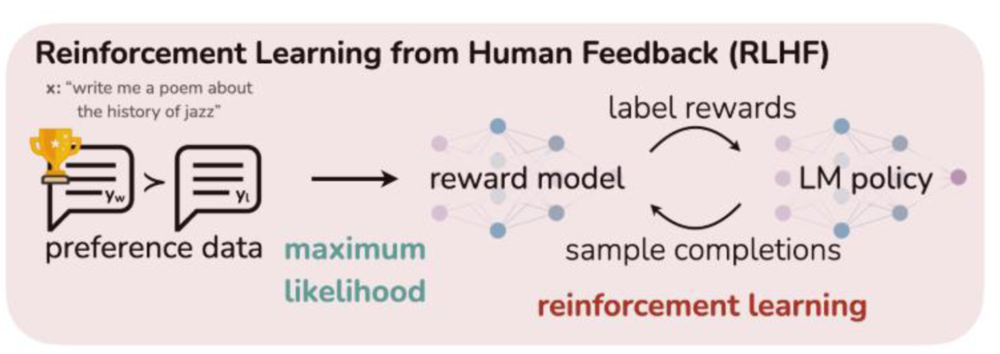
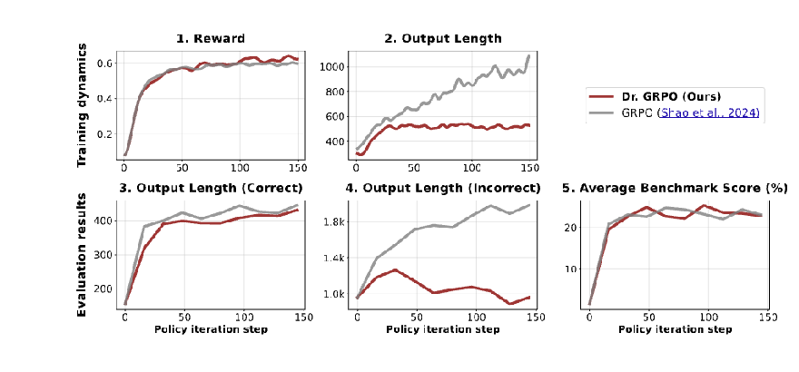
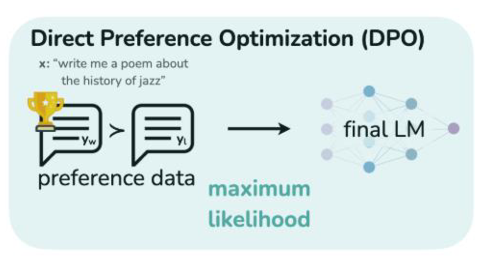

大语言模型的策略优化方法可以分为两条主要路线：

- **在线强化学习**：PPO、TRPO、GRPO，以及 Kimi k1.5 使用的策略优化方法，都让当前策略生成回答，再根据奖励和优势更新策略。
- **直接偏好优化**：DPO、SimPO 等方法从“偏好回答—非偏好回答”直接学习，不在训练循环中执行在线 rollout。

本篇聚焦这些方法的核心目标及其联系；通用强化学习环境中的训练细节放在对应算法的独立博客中。

## 1. 策略梯度：TRPO 代理目标的来源

轨迹 \(\tau=(s_1,a_1,\ldots,s_T,a_T)\) 的概率是

\[
p_\theta(\tau)
=p(s_1)\prod_{t=1}^{T}
\pi_\theta(a_t\mid s_t)\,
p(s_{t+1}\mid s_t,a_t).
\]

环境转移概率与 \(\theta\) 无关。对期望回报 \(J(\theta)=\mathbb{E}_{\tau\sim p_\theta}[R(\tau)]\) 使用对数导数技巧，可以得到

\[
\nabla_\theta J(\theta)
=\mathbb{E}_{\tau\sim p_\theta}
\left[
R(\tau)\sum_t\nabla_\theta\log\pi_\theta(a_t\mid s_t)
\right].
\]

实际训练会用优势估计 \(\hat A_t\) 替代整条轨迹的回报，从而更准确地判断某个动作是否优于状态下的平均水平。

展开：为什么旧策略数据还可以用于更新新策略？

重要性采样（Importance Sampling）可以把分布 \(p\) 下的期望改写成分布 \(q\) 下的期望：

\[
\mathbb{E}_{x\sim p}[f(x)]
=\mathbb{E}_{x\sim q}
\left[\frac{p(x)}{q(x)}f(x)\right].
\]

若数据由旧策略 \(\pi_{\theta_{\mathrm{old}}}\) 采集，则每一步使用概率比

\[
\rho_t(\theta)
=\frac{\pi_\theta(a_t\mid s_t)}
{\pi_{\theta_{\mathrm{old}}}(a_t\mid s_t)}
\]

修正新旧策略的分布差异。概率比可能带来高方差，尤其在两个策略相差很大或旧策略几乎不采样某些动作时。TRPO 通过 KL 约束控制这种偏离。

## 2. PPO：用截断目标近似信赖域更新

[近端策略优化（Proximal Policy Optimization，PPO）](https://arxiv.org/abs/1707.06347)最常用的核心目标是 PPO-Clip：

\[
\boxed{
\begin{aligned}
L^{\mathrm{CLIP}}(\theta)
&=\mathbb{E}_t\left[
\min\!\left(
\rho_t(\theta)\hat A_t,\,
\operatorname{clip}\!\left(\rho_t(\theta),1-\epsilon,1+\epsilon\right)\hat A_t
\right)
\right].
\end{aligned}
}
\]

其中，

\[
\boxed{
\rho_t(\theta)
=\frac{\pi_\theta(a_t\mid s_t)}
{\pi_{\theta_{\mathrm{old}}}(a_t\mid s_t)}
}
\]

是新旧策略对已采样动作的概率比，\(\epsilon\) 是截断范围，\(\hat A_t\) 是优势估计。PPO 会在同一批采样数据上执行多轮小批量更新。

<strong>PPO 的核心直觉：保留有利的策略更新，但不再奖励过大的概率变化。</strong>

### 2.1 优化信号：用 MC、TD、多步 TD 或 GAE 计算优势

PPO 不限定优势的估计方法。实践中可以使用 MC、一步 TD、多步 TD 或 GAE；基础概念参见[《深度强化学习概述》](../deep-reinforcement-learning-overview/)。

#### 2.1.1 蒙特卡洛方法（Monte Carlo，MC）：使用完整回报

等待轨迹结束后，计算

\[
\boxed{
G_t^{(\gamma)}
=\sum_{n=t}^{T}\gamma^{\,n-t}r_n.
}
\]

不使用 Critic 时，可以像 REINFORCE 一样直接把完整回报作为 Actor 的权重：

\[
A_t=G_t^{(\gamma)}.
\]

这里的 \(A_t\) 沿用概述博客中的写法，表示送入 Actor 的样本权重；没有减去基线时，它直接等于完整回报。

在常见的 PPO Actor-Critic 实现中，MC 使用完整回报训练 Critic，并减去状态价值基线得到优势：

\[
\hat A_t^{\mathrm{MC}}
=G_t^{(\gamma)}-V_\phi(s_t),
\]

\[
L_{\mathrm{critic}}^{\mathrm{MC}}(\phi)
=\frac{1}{2}\sum_t
\left[V_\phi(s_t)-G_t^{(\gamma)}\right]^2.
\]

因此，\(G_t^{(\gamma)}\) 表示实际得到的完整回报，\(V_\phi(s_t)\) 表示当前状态下通常能够得到的回报；使用 Critic 时，二者之差才是 Actor 使用的优势。MC 不进行自举，但通常要等待轨迹结束，估计方差也较大。

#### 2.1.2 一步时序差分（Temporal Difference，TD）：使用一步自举目标

记一步 TD 误差为

\[
\boxed{
\delta_t
=r_t+\gamma(1-d_t)V_\phi(s_{t+1})-V_\phi(s_t).
}
\]

它可以直接作为一步优势估计：

\[
\hat A_t^{\mathrm{TD}}=\delta_t.
\]

对应的 Critic 损失为

\[
L_{\mathrm{critic}}^{\mathrm{TD}}(\phi)
=\frac{1}{2}\sum_t
\left[
V_\phi(s_t)
-\operatorname{stopgrad}\!\left(
r_t+\gamma(1-d_t)V_\phi(s_{t+1})
\right)
\right]^2.
\]

TD 不必等待完整轨迹结束，可以借助下一状态的价值估计向前传播信息；代价是自举目标依赖 Critic，因此会引入价值近似的偏差。

#### 2.1.3 n 步时序差分（n-step Temporal Difference，n-step TD）：在 MC 与一步 TD 之间折中

若接下来 \(n\) 步内轨迹没有终止，n-step TD 的目标为

\[
\boxed{
\begin{aligned}
G_t^{(n)}
&=\sum_{k=0}^{n-1}\gamma^k r_{t+k}
+\gamma^n V_\phi(s_{t+n}).
\end{aligned}
}
\]

因此，n-step TD 优势可以写成

\[
\begin{aligned}
\hat A_t^{(n)}
&=G_t^{(n)}-V_\phi(s_t) \\
&=-V_\phi(s_t)
+\sum_{k=0}^{n-1}\gamma^k r_{t+k}
+\gamma^nV_\phi(s_{t+n}).
\end{aligned}
\]

将其中相邻的价值项展开并抵消，同一个优势也可以表示为前 \(n\) 个 TD 误差之和：

\[
\hat A_t^{(n)}
=\delta_t+\gamma\delta_{t+1}
+\cdots+\gamma^{n-1}\delta_{t+n-1}.
\]

对应的 Critic 损失为

\[
L_{\mathrm{critic}}^{(n)}(\phi)
=\frac{1}{2}\sum_t
\left[
V_\phi(s_t)
-\operatorname{stopgrad}\!\left(G_t^{(n)}\right)
\right]^2.
\]

若轨迹在第 \(n\) 步之前终止，就在终止位置停止累加奖励，并去掉最后的自举项。\(n=1\) 时，它就是一步 TD；当 \(n\) 覆盖剩余整条轨迹时，它退化为 MC。\(n\) 越大，通常偏差越小、方差越高。

#### 2.1.4 广义优势估计（Generalized Advantage Estimation，GAE）：加权组合多步优势

GAE 可以理解为对不同步数的 TD 优势进行指数加权。在不跨越终止边界时，先写成多个 TD 误差的加权和：

\[
\hat A_t^{\mathrm{GAE}(\gamma,\lambda)}
=\delta_t
+\gamma\lambda\delta_{t+1}
+(\gamma\lambda)^2\delta_{t+2}
+\cdots.
\]

实际实现不必显式计算这个长和式，而是从 rollout 末端向前递推：

\[
\hat A_t^{\mathrm{GAE}(\gamma,\lambda)}
=\delta_t
+\gamma\lambda(1-d_t)
\hat A_{t+1}^{\mathrm{GAE}(\gamma,\lambda)},
\qquad
\hat A_{T+1}^{\mathrm{GAE}(\gamma,\lambda)}=0.
\]

最后把 \(\delta_t\) 展开，得到直接用于实现的形式：

\[
\boxed{
\begin{aligned}
\hat A_t^{\mathrm{GAE}(\gamma,\lambda)}
&=r_t+\gamma(1-d_t)V_\phi(s_{t+1})-V_\phi(s_t) \\
&\quad+\gamma\lambda(1-d_t)
\hat A_{t+1}^{\mathrm{GAE}(\gamma,\lambda)}.
\end{aligned}
}
\]

- \(\lambda=0\) 时，GAE 退化为一步 TD 优势。
- \(\lambda\) 接近 \(1\) 时，GAE 更接近减去价值基线的 MC 优势。
- \(\lambda\) 越小，通常方差越低、对 Critic 的依赖越强；\(\lambda\) 越大，通常偏差越小、方差越高。

GAE 还可以构造 Critic 的价值回归目标：

\[
\hat G_t^{\mathrm{GAE}}
=\operatorname{stopgrad}\!\left(
\hat A_t^{\mathrm{GAE}(\gamma,\lambda)}+V_\phi(s_t)
\right).
\]

对应的 Critic 损失为

\[
L_{\mathrm{critic}}^{\mathrm{GAE}}(\phi)
=\frac{1}{2}\sum_t
\left[
V_\phi(s_t)-\hat G_t^{\mathrm{GAE}}
\right]^2.
\]

#### 2.1.5 MC、一步 TD、n-step TD 与 GAE 对比

| 方法 | 需要多少未来信息 | 是否需要反向递推 |
| --- | --- | --- |
| MC | 从 \(t\) 到 episode 结束 | 通常需要 |
| 一步 TD | 当前转移和下一状态 | 不需要全局递推 |
| n-step TD | 未来 \(n\) 步 | 只需 \(n\) 步范围 |
| GAE | 当前 rollout 中后续的多个 TD 误差 | 通常需要反向递推 |

无论使用 MC、一步 TD、n-step TD 还是 GAE，最终都要得到 \(\hat A_t\)，再把它作为固定权重送入 PPO-Clip。更新 Actor 时应对 \(\hat A_t\) 使用 \(\operatorname{stopgrad}\)，避免 Actor 的梯度通过优势继续更新 Critic。

展开：rollout 和 episode 有什么区别？

- **Episode**：环境定义的一次完整任务，从初始状态开始，到终止状态结束。
- **Rollout**：训练时由策略采集的一段轨迹。它既可以是完整 episode，也可以只是其中一段；固定长度的 rollout 还可能包含一个 episode 的结尾和下一个 episode 的开头。

例如，一个游戏 episode 实际进行了 1,000 步，但 PPO 每次只采集 128 步再更新模型。那么第 1–128 步就是一个 rollout，而不是完整 episode。若第 128 步环境尚未终止，计算 TD 或 GAE 时需要用 Critic 的

\[
V_\phi(s_{129})
\]

对 rollout 之后的回报进行 bootstrap；如果第 128 步恰好是终止状态，则后续价值按 \(0\) 处理。

因此，**episode 的边界由环境决定，rollout 的边界由数据采集方式决定。**

### 2.2 损失构造：从优势到 PPO Loss

2.1 得到优势 \(\hat A_t\) 后，最直接的 Policy Gradient Actor 损失是优势加权的负对数似然：

\[
L_{\mathrm{actor}}^{\mathrm{PG}}(\theta)
=-\mathbb E_t\left[
\operatorname{stopgrad}(\hat A_t)
\log\pi_\theta(a_t\mid s_t)
\right].
\]

#### 2.2.1 PPO-Clip：截断概率比

PPO 的数据由旧策略 \(\pi_{\theta_{\mathrm{old}}}\) 采集，而更新对象是当前策略 \(\pi_\theta\)，因此先用概率比

\[
\rho_t(\theta)
=\frac{\pi_\theta(a_t\mid s_t)}
{\pi_{\theta_{\mathrm{old}}}(a_t\mid s_t)}
\]

构造未截断的代理目标 \(\rho_t(\theta)\hat A_t\)。为限制单次策略变化，PPO-Clip 将单个样本的代理目标写为

\[
\boxed{
\begin{aligned}
\ell_t^{\mathrm{clip}}(\theta)
&=\min\!\left(
\rho_t(\theta)\operatorname{stopgrad}(\hat A_t),
\operatorname{clip}\!\left(
\rho_t(\theta),1-\epsilon,1+\epsilon
\right)
\operatorname{stopgrad}(\hat A_t)
\right).
\end{aligned}
}
\]

前面的核心目标采用“最大化”写法；代码通常改为最小化其相反数：

\[
L_{\mathrm{actor}}^{\mathrm{clip}}(\theta)
=-\mathbb E_t\left[
\ell_t^{\mathrm{clip}}(\theta)
\right].
\]

- **\(\hat A_t>0\)**：动作优于预期，应提高概率；但当 \(\rho_t(\theta)>1+\epsilon\) 后，不再继续奖励这次增幅。
- **\(\hat A_t\lt 0\)**：动作劣于预期，应降低概率；但当 \(\rho_t(\theta)\lt 1-\epsilon\) 后，不再继续奖励这次降幅。
- **截断不是硬约束**：它只让目标函数在越界方向上失去进一步改进的收益，实际策略仍可能越过区间。

#### 2.2.2 PPO-Penalty：惩罚新旧策略的 KL

PPO-Penalty 不截断概率比，而是在代理目标中减去新旧策略的 KL 惩罚：

\[
\boxed{
\begin{aligned}
\ell_t^{\mathrm{KLPEN}}(\theta)
&=\rho_t(\theta)\operatorname{stopgrad}(\hat A_t) \\
&\quad-\beta_{\mathrm{KL}}
D_{\mathrm{KL}}\!\left(
\pi_{\theta_{\mathrm{old}}}(\cdot\mid s_t)
\parallel
\pi_\theta(\cdot\mid s_t)
\right).
\end{aligned}
}
\]

\[
L_{\mathrm{actor}}^{\mathrm{KLPEN}}(\theta)
=-\mathbb E_t\left[
\ell_t^{\mathrm{KLPEN}}(\theta)
\right].
\]

其中，\(\beta_{\mathrm{KL}}\) 控制更新幅度：实际 KL 高于目标值时增大，明显低于目标值时减小。原始 PPO 论文同时讨论了 PPO-Clip 与 PPO-Penalty，实践中 PPO-Clip 更常见。两者对应两种可选的 Actor Loss：

\[
L_{\mathrm{actor}}^{\mathrm{PPO}}(\theta)
=\begin{cases}
L_{\mathrm{actor}}^{\mathrm{clip}}(\theta),
& \text{PPO-Clip},\\
L_{\mathrm{actor}}^{\mathrm{KLPEN}}(\theta),
& \text{PPO-Penalty}.
\end{cases}
\]

#### 2.2.3 RLHF PPO：从序列级目标到逐 token Loss

<figure>
  
  <figcaption>RLHF 先训练奖励模型，再通过在线强化学习优化策略。图源：Rafailov et al., 2023。</figcaption>
</figure>

[InstructGPT](https://arxiv.org/abs/2203.02155) 等 PPO 式 RLHF 方法把提示词 \(x\) 视为初始上下文，将每个生成 token \(y_t\) 视为动作，将已有前缀 \(s_t=(x,y_{1:t-1})\) 视为状态，完整回答 \(y\) 则构成一条轨迹。对于固定提示词 \(x\)，定义序列级目标

\[
\boxed{
\begin{aligned}
J_x(\pi_\theta)
&=\mathbb{E}_{y\sim\pi_\theta(\cdot\mid x)}
\left[r_\psi(x,y)\right] \\
&\quad-\beta_{\mathrm{ref}}
D_{\mathrm{KL}}\!\left(
\pi_\theta(\cdot\mid x)
\parallel
\pi_{\mathrm{ref}}(\cdot\mid x)
\right).
\end{aligned}
}
\]

训练时再对数据集中的提示词取平均，整体目标为 \(\max_\theta\mathbb E_{x\sim D}[J_x(\pi_\theta)]\)。

- \(r_\psi(x,y)\)：参数为 \(\psi\) 的奖励模型对完整回答给出的评分。
- \(\pi_\theta\)：正在训练的 LLM，也就是 Actor。
- \(\pi_{\mathrm{ref}}\)：RLHF 开始前冻结的 SFT 参考模型，用于限制语言能力和风格漂移。
- \(V_\phi(s_t)\)：参数为 \(\phi\) 的 Critic，对 token 状态价值进行估计，并据此计算优势。

**从序列级目标到逐 token 奖励**

在旧策略 \(\pi_{\theta_{\mathrm{old}}}\) 采集的 rollout 中，每个 token 的参考 KL 奖励为

\[
r_t^{\mathrm{KL}}
=-\beta_{\mathrm{ref}}
\log\frac{
\pi_{\theta_{\mathrm{old}}}(y_t\mid s_t)
}{
\pi_{\mathrm{ref}}(y_t\mid s_t)
}.
\]

奖励模型通常在完整回答生成后给出一个序列级分数。因此，送入回报和优势估计的逐 token 奖励可写为

\[
\tilde r_t
=r_t^{\mathrm{KL}}
+\mathbf{1}[t=T]r_\psi(x,y).
\]

也就是说，中间 token 主要得到参考 KL 奖励，最后一个 token 还会得到奖励模型对完整回答的评分。

展开：逐 token 奖励如何恢复序列级目标？

设完整回答为 \(y=(y_1,\ldots,y_T)\)。在生成第 \(t\) 个 token 时，状态

\[
s_t=(x,y_{1:t-1})
=\left(x,y_1,\ldots,y_{t-1}\right)
\]

由提示词 \(x\) 和已经生成的回答前缀 \(y_{1:t-1}\) 共同组成。因此，\(\pi_\theta(y_t\mid s_t)\) 的完整含义是

\[
\pi_\theta(y_t\mid s_t)
=\pi_\theta(y_t\mid x,y_1,\ldots,y_{t-1}).
\]

当 \(t=1\) 时，回答前缀为空，所以 \(s_1=x\)。这里的 \(s_t\) 不是额外输入的独立状态，而是 LLM 在生成当前 token 时能够看到的完整上下文。

根据自回归概率的链式分解，完整回答的概率为

\[
\pi_\theta(y\mid x)
=\prod_{t=1}^{T}
\pi_\theta(y_t\mid x,y_{1:t-1})
=\prod_{t=1}^{T}\pi_\theta(y_t\mid s_t).
\]

所以，序列概率比的对数可以拆成各 token 对数概率比之和：

\[
\log\frac{
\pi_{\theta_{\mathrm{old}}}(y\mid x)
}{
\pi_{\mathrm{ref}}(y\mid x)
}
=\sum_{t=1}^{T}
\log\frac{
\pi_{\theta_{\mathrm{old}}}(y_t\mid s_t)
}{
\pi_{\mathrm{ref}}(y_t\mid s_t)
}.
\]

在 \(\gamma=1\) 且没有其他奖励时，对一条回答的逐 token 奖励求和：

\[
\begin{aligned}
\sum_{t=1}^{T}\tilde r_t
&=r_\psi(x,y)+\sum_{t=1}^{T}r_t^{\mathrm{KL}} \\
&=r_\psi(x,y)
-\beta_{\mathrm{ref}}
\log\frac{
\pi_{\theta_{\mathrm{old}}}(y\mid x)
}{
\pi_{\mathrm{ref}}(y\mid x)
}.
\end{aligned}
\]

最后，对提示词和旧策略生成的回答取期望，便恢复当前 rollout 对应的序列级目标：

\[
\begin{aligned}
&\mathbb E_{x\sim D,\,y\sim\pi_{\theta_{\mathrm{old}}}(\cdot\mid x)}
\left[\sum_{t=1}^{T}\tilde r_t\right] \\
&=\mathbb E_{x\sim D,\,y\sim\pi_{\theta_{\mathrm{old}}}(\cdot\mid x)}
\left[r_\psi(x,y)\right] \\
&\quad-\beta_{\mathrm{ref}}
\mathbb E_{x\sim D}
\left[
D_{\mathrm{KL}}\!\left(
\pi_{\theta_{\mathrm{old}}}(\cdot\mid x)
\parallel
\pi_{\mathrm{ref}}(\cdot\mid x)
\right)
\right].
\end{aligned}
\]

采集 rollout 时，\(\pi_{\theta_{\mathrm{old}}}\) 就是当前策略的冻结快照；PPO 随后用概率比在这批数据上更新 \(\pi_\theta\)。

**从奖励到 PPO Loss**

\[
\tilde r_{1:T}
\longrightarrow
\hat A_{1:T}^{\mathrm{GAE}}
\longrightarrow
L_{\mathrm{actor}}^{\mathrm{PPO}}.
\]

先用 2.1.4 的 GAE 将 \(\tilde r_t\) 转换为优势 \(\hat A_t\)，再把优势代入 2.2.1 的 PPO-Clip 或 2.2.2 的 PPO-Penalty。**序列级奖励目标并没有取代 PPO 的概率比与优势；前者定义优化方向，后者给出实际的策略更新方式。**

展开：也可以把参考 KL 直接加入 Loss

另一种写法是把参考 KL 直接加入 Actor Loss：

\[
L_{\mathrm{actor}}^{\mathrm{PPO+ref}}(\theta)
=L_{\mathrm{actor}}^{\mathrm{PPO}}(\theta)
+\beta_{\mathrm{ref}}\mathbb E_t\left[
D_{\mathrm{KL}}\!\left(
\pi_\theta(\cdot\mid s_t)
\parallel
\pi_{\mathrm{ref}}(\cdot\mid s_t)
\right)
\right].
\]

把参考 KL 写入奖励或直接写入 Loss，都在约束策略不要偏离 \(\pi_{\mathrm{ref}}\)；但经过采样、优势估计、截断和多轮更新后，两种实现并不严格等价。通常只采用其中一种，避免重复计算参考 KL。

**问题一：为什么传统 PPO 优化 \(\mathbb E_t[\rho_t(\theta)\hat A_t]\)，而 RLHF 写成 \(\mathbb E_{x,y}[r_\psi(x,y)]\)？**

- **传统 PPO**：使用旧策略采集轨迹并计算 \(\hat A_t\)。复用这批数据更新当前策略时，用 \(\rho_t(\theta)\) 修正新旧策略的概率差异。
- **RLHF PPO**：奖励模型为 LLM 的完整回答提供奖励，所以高层目标写成 \(\mathbb E_{x,y}[r_\psi(x,y)]\)；实际更新仍会计算优势，并优化 \(\rho_t(\theta)\hat A_t\) 的截断或 KL 惩罚形式。

**问题二：传统 PPO 中的 \(\pi_{\mathrm{old}}\) 和 RLHF PPO 中的 \(\pi_{\mathrm{ref}}\) 有什么区别？**

- \(\pi_{\mathrm{old}}\)：采集当前 rollout 的旧策略，用于计算重要性采样概率比；它会随训练不断刷新。
- \(\pi_{\mathrm{ref}}\)：RLHF 开始前冻结的参考策略，通常是 SFT 模型；它用于计算参考 KL，不会更新。

因此，PPO-Penalty 比较的是不断刷新的 \(\pi_{\mathrm{old}}\) 与当前策略，RLHF 的参考 KL 比较的是固定的 \(\pi_{\mathrm{ref}}\) 与当前策略。PPO 的通用训练循环和参数含义参见[《近端策略优化（PPO）》](../ppo/)。

#### 2.2.4 Critic Loss 与 PPO 总损失

Critic 不使用上述 Actor 目标，而是回归 2.1 中构造的价值目标 \(\hat G_t^{\mathrm{target}}\)：

\[
L_{\mathrm{critic}}(\phi)
=\frac{1}{2}\mathbb E_t
\left[
V_\phi(s_t)
-\operatorname{stopgrad}\!\left(\hat G_t^{\mathrm{target}}\right)
\right]^2.
\]

若实现中同时优化 Actor、Critic 和熵奖励，可以写成

\[
L_{\mathrm{PPO}}(\theta,\phi)
=L_{\mathrm{actor}}^{\mathrm{PPO}}(\theta)
+c_VL_{\mathrm{critic}}(\phi)
-c_H\mathbb E_t\left[
H\!\left(\pi_\theta(\cdot\mid s_t)\right)
\right].
\]

其中，价值损失训练 Critic，熵奖励避免策略过早变得过于确定。如果 Actor 和 Critic 完全独立，也可以分别优化两个损失。RLHF 若把参考 KL 直接加入 Loss，则将上式的 \(L_{\mathrm{actor}}^{\mathrm{PPO}}\) 替换为 \(L_{\mathrm{actor}}^{\mathrm{PPO+ref}}\)；若已经使用 KL 奖励 \(\tilde r_t\) 计算优势，则无需再次添加。

### 2.3 梯度：截断区域停止奖励过大的更新

由于 \(L_{\mathrm{actor}}^{\mathrm{clip}}=-\mathbb E_t[\ell_t^{\mathrm{clip}}]\)，先考察代理目标 \(\ell_t^{\mathrm{clip}}\) 的梯度。在未触发截断时，单个样本的梯度为

\[
\nabla_\theta\!\left[\rho_t(\theta)\hat A_t\right]
=\rho_t(\theta)\hat A_t
\nabla_\theta\log\pi_\theta(a_t\mid s_t).
\]

展开：未截断代理目标的梯度推导

概率比为

\[
\rho_t(\theta)
=\frac{\pi_\theta(a_t\mid s_t)}
{\pi_{\theta_{\mathrm{old}}}(a_t\mid s_t)}.
\]

旧策略 \(\pi_{\theta_{\mathrm{old}}}\) 在当前一轮更新中保持冻结，因此分母不参与对 \(\theta\) 的求导：

\[
\begin{aligned}
\nabla_\theta\rho_t(\theta)
&=\frac{1}{\pi_{\theta_{\mathrm{old}}}(a_t\mid s_t)}
\nabla_\theta\pi_\theta(a_t\mid s_t) \\
&=\frac{\pi_\theta(a_t\mid s_t)}
{\pi_{\theta_{\mathrm{old}}}(a_t\mid s_t)}
\frac{\nabla_\theta\pi_\theta(a_t\mid s_t)}
{\pi_\theta(a_t\mid s_t)} \\
&=\rho_t(\theta)
\nabla_\theta\log\pi_\theta(a_t\mid s_t).
\end{aligned}
\]

更新 Actor 时，优势 \(\hat A_t\) 来自已经采集的数据和 Critic，应当视为常数，即使用 \(\operatorname{stopgrad}(\hat A_t)\)。因此

\[
\begin{aligned}
\nabla_\theta\!\left[
\rho_t(\theta)\operatorname{stopgrad}(\hat A_t)
\right]
&=\operatorname{stopgrad}(\hat A_t)
\nabla_\theta\rho_t(\theta) \\
&=\rho_t(\theta)\hat A_t
\nabla_\theta\log\pi_\theta(a_t\mid s_t).
\end{aligned}
\]

忽略截断边界处不可导的点，PPO-Clip 的梯度可以概括为

\[
\nabla_\theta\ell_t^{\mathrm{clip}}=
\begin{cases}
0,
& \hat A_t\gt 0\ \text{且}\ \rho_t(\theta)\gt 1+\epsilon,\\
0,
& \hat A_t\lt 0\ \text{且}\ \rho_t(\theta)\lt 1-\epsilon,\\
\rho_t(\theta)\hat A_t\nabla_\theta\log\pi_\theta(a_t\mid s_t),
& \text{其他情况}.
\end{cases}
\]

因此，正优势推动动作概率上升，负优势推动动作概率下降；当变化已经越过对应的截断边界时，该样本不再提供继续越界的梯度。实际优化的是负代理目标 \(L_{\mathrm{actor}}^{\mathrm{clip}}\)，所以损失梯度与上式方向相反。

## 3. TRPO：使用 KL 硬约束限制策略更新

[信赖域策略优化（Trust Region Policy Optimization，TRPO）](https://arxiv.org/abs/1502.05477)在提高代理目标的同时，用平均 KL 散度为策略更新设置硬约束：

\[
\boxed{
\begin{aligned}
\max_\theta\quad
&\hat{\mathbb E}_t\!\left[
\rho_t(\theta)\hat A_t
\right] \\
\text{subject to}\quad
&\hat{\mathbb E}_t\!\left[
D_{\mathrm{KL}}\!\left(
\pi_{\theta_{\mathrm{old}}}(\cdot\mid s_t)
\parallel
\pi_\theta(\cdot\mid s_t)
\right)
\right]\leq\delta.
\end{aligned}
}
\]

其中，概率比 \(\rho_t(\theta)\) 的定义与 PPO 相同；\(\delta\) 是允许的平均 KL 散度上限。

<strong>TRPO 的核心直觉：沿着能够提高回报的方向更新，但每一步都必须留在旧策略附近的信赖域内。</strong>

### 3.1 优化信号：直接沿用 PPO 的优势估计

TRPO 不限定奖励如何转换为优势。它同样可以使用 MC、一步 TD、n-step TD 或 GAE 得到 \(\hat A_t\)，具体公式直接参见 [PPO 2.1](#21-优化信号用-mctd多步-td-或-gae-计算优势)。

两者的优化信号没有本质区别：旧策略采集轨迹，Critic 或回报估计器计算 \(\hat A_t\)，Actor 再提高正优势动作的概率并降低负优势动作的概率。TRPO 的区别出现在<strong>如何限制策略更新幅度</strong>。

### 3.2 损失构造：把 KL 硬约束写成局部约束 Loss

记 TRPO 的代理目标为 \(L^{\mathrm{sur}}(\theta)\)，平均 KL 为 \(\bar D_{\mathrm{KL}}(\theta)\)。在旧参数 \(\theta_{\mathrm{old}}\) 附近，分别使用一阶和二阶近似：

\[
\begin{aligned}
L^{\mathrm{sur}}(\theta_{\mathrm{old}}+\Delta\theta)
&\approx L^{\mathrm{sur}}(\theta_{\mathrm{old}})
+g^\top\Delta\theta, \\
\bar D_{\mathrm{KL}}(\theta_{\mathrm{old}}+\Delta\theta)
&\approx \frac{1}{2}\Delta\theta^\top H\Delta\theta,
\end{aligned}
\]

其中，

\[
g=\left.\nabla_\theta L^{\mathrm{sur}}(\theta)\right|_{\theta_{\mathrm{old}}},
\qquad
H=\left.\nabla_\theta^2\bar D_{\mathrm{KL}}(\theta)\right|_{\theta_{\mathrm{old}}}.
\]

于是，TRPO 在当前参数附近实际求解的局部 Loss 为

\[
\boxed{
\begin{aligned}
\min_{\Delta\theta}\quad
&L_{\mathrm{TRPO}}^{\mathrm{local}}(\Delta\theta)
=-g^\top\Delta\theta \\
\text{subject to}\quad
&\frac{1}{2}\Delta\theta^\top H\Delta\theta\leq\delta.
\end{aligned}
}
\]

这里，\(-g^\top\Delta\theta\) 是需要最小化的负代理收益；二次型 \(\frac{1}{2}\Delta\theta^\top H\Delta\theta\) 近似新旧策略的平均 KL。

等价地，引入拉格朗日乘子 \(\eta\geq 0\)，可以写成

\[
\mathcal L_{\mathrm{TRPO}}(\Delta\theta,\eta)
=-g^\top\Delta\theta
+\eta\left(
\frac{1}{2}\Delta\theta^\top H\Delta\theta-\delta
\right).
\]

与 PPO-Penalty 中预先设置或自适应调节的软惩罚系数不同，\(\eta\) 是为满足 KL 硬约束而引入的拉格朗日乘子。

### 3.3 梯度：从代理梯度得到自然梯度方向

TRPO 代理目标的梯度与 [PPO 2.3 中未截断目标的梯度](#23-梯度截断区域停止奖励过大的更新)相同：

\[
\nabla_\theta L^{\mathrm{sur}}(\theta)
=\hat{\mathbb E}_t\!\left[
\rho_t(\theta)\hat A_t
\nabla_\theta\log\pi_\theta(a_t\mid s_t)
\right].
\]

在展开点 \(\theta=\theta_{\mathrm{old}}\) 处，\(\rho_t(\theta_{\mathrm{old}})=1\)，因此

\[
g
=\hat{\mathbb E}_t\!\left[
\hat A_t
\nabla_\theta\log\pi_\theta(a_t\mid s_t)
\right]_{\theta=\theta_{\mathrm{old}}}.
\]

再对 3.2 的局部拉格朗日 Loss 关于 \(\Delta\theta\) 求梯度：

\[
\nabla_{\Delta\theta}\mathcal L_{\mathrm{TRPO}}
=-g+\eta H\Delta\theta=0.
\]

因此更新方向为自然梯度方向 \(d=H^{-1}g\)。令 KL 约束恰好取等号，可得理论步长

\[
\Delta\theta
=\sqrt{
\frac{2\delta}{d^\top H d}
}\,d.
\]

实际实现不会显式计算 \(H^{-1}\)：

1. 使用 Fisher 向量积计算 \(Hv\)。
2. 使用共轭梯度法近似求解 \(Hd=g\)。
3. 从 \(\theta_{\mathrm{old}}+\Delta\theta\) 开始执行回溯线搜索。
4. 只有当代理目标提高且实际 KL 不超过 \(\delta\) 时，才接受候选参数。

**TRPO 与 PPO 的主要差别不在策略梯度本身：TRPO 使用 KL 曲率 \(H\) 和线搜索限制更新，PPO 则用截断或 KL 软惩罚构造更容易优化的 Loss。**

## 4. GRPO：用组内相对奖励替代 Critic

[群体相对策略优化（Group Relative Policy Optimization，GRPO）](https://arxiv.org/abs/2402.03300)的核心目标为

\[
\boxed{
\begin{aligned}
J_{\mathrm{GRPO}}(\theta)
&=\mathbb E_{\substack{x\sim D\\y_{1:G}\sim\pi_{\theta_{\mathrm{old}}}}}
\left[
\frac{1}{G}\sum_{i=1}^{G}\frac{1}{T_i}
\sum_{t=1}^{T_i}
\ell^{\mathrm{clip}}_{i,t}(\theta)
\right] \\
&\quad-\beta
\mathbb E_{\substack{x\sim D\\y_{1:G}\sim\pi_{\theta_{\mathrm{old}}}}}
\left[
\frac{1}{G}\sum_{i=1}^{G}\frac{1}{T_i}
\sum_{t=1}^{T_i}
D_{\mathrm{KL}}\!\left(
\pi_\theta(\cdot\mid s_{i,t})
\parallel
\pi_{\mathrm{ref}}(\cdot\mid s_{i,t})
\right)
\right].
\end{aligned}
}
\]

其中，\(J_{\mathrm{GRPO}}(\theta)\) 是需要最大化的 GRPO 目标；\(G\) 是同一提示词的回答数量，\(T_i\) 是回答 \(y_i\) 的 token 数，\(\epsilon\) 是截断范围，\(\beta\) 是参考策略 KL 的权重。\(\ell_{i,t}^{\mathrm{clip}}\) 和组内优势 \(\hat A_i\) 将在下面展开。

<strong>GRPO 的核心直觉：不单独学习价值函数，而是通过比较同一问题的多个回答，判断哪些回答相对更好。</strong>

### 4.1 优化信号：用组内相对奖励替代 Critic

对于同一个提示词 \(x\)，旧策略采样 \(G\) 个回答 \(y_1,\ldots,y_G\)。设第 \(i\) 个回答的奖励为 \(r_i=r(x,y_i)\)，GRPO 将它标准化为组内相对优势：

\[
\boxed{
\hat A_i
=\frac{r_i-\operatorname{mean}(r_1,\ldots,r_G)}
{\operatorname{std}(r_1,\ldots,r_G)+\varepsilon}
}
\]

其中，\(\varepsilon\) 是防止除零的数值稳定项。奖励 \(r_i\) 可以来自奖励模型，也可以来自规则或验证器；对于只在回答末尾给分的结果奖励，回答 \(y_i\) 中的每个 token 共用同一个 \(\hat A_i\)。

- **不需要 Critic**：同组回答的平均奖励充当基线，因此不再单独训练价值模型。
- **依赖组内差异**：如果一组回答获得相同奖励，标准化优势接近零，这组样本几乎不提供更新信号。

### 4.2 损失构造：对组内回答应用 PPO-Clip 与参考 KL

令

\[
s_{i,t}=(x,y_{i,1:t-1}),
\]

即提示词 \(x\) 与回答 \(y_i\) 在第 \(t\) 个 token 之前的前缀。新旧策略对 token \(y_{i,t}\) 的概率比为

\[
\rho_{i,t}(\theta)
=\frac{\pi_\theta(y_{i,t}\mid s_{i,t})}
{\pi_{\theta_{\mathrm{old}}}(y_{i,t}\mid s_{i,t})}.
\]

其作用与 [PPO 2.2.1](#221-ppo-clip截断概率比) 中的 \(\rho_t(\theta)\) 相同，只是增加了回答索引 \(i\)。单个 token 的截断目标为

\[
\ell^{\mathrm{clip}}_{i,t}(\theta)
=\min\!\left(
\rho_{i,t}(\theta)\operatorname{stopgrad}(\hat A_i),
\operatorname{clip}\!\left(
\rho_{i,t}(\theta),1-\epsilon,1+\epsilon
\right)
\operatorname{stopgrad}(\hat A_i)
\right).
\]

\(\ell_{i,t}^{\mathrm{clip}}(\theta)\) 只表示回答 \(i\) 中第 \(t\) 个 token 的 PPO-Clip 贡献，并不是完整的 GRPO 目标。记该 token 的参考策略 KL 为

\[
D_{i,t}^{\mathrm{ref}}(\theta)
=D_{\mathrm{KL}}\!\left(
\pi_\theta(\cdot\mid s_{i,t})
\parallel
\pi_{\mathrm{ref}}(\cdot\mid s_{i,t})
\right).
\]

先对回答 \(y_i\) 中的全部 token 取平均，得到单个回答对目标的贡献：

\[
J_i(\theta)
=\frac{1}{T_i}\sum_{t=1}^{T_i}
\left[
\ell_{i,t}^{\mathrm{clip}}(\theta)
-\beta D_{i,t}^{\mathrm{ref}}(\theta)
\right].
\]

再对同一提示词下的 \(G\) 个回答取平均，并对全部提示词与采样结果取期望：

\[
J_{\mathrm{GRPO}}(\theta)
=\mathbb E_{\substack{x\sim D\\y_{1:G}\sim\pi_{\theta_{\mathrm{old}}}}}
\left[
\frac{1}{G}\sum_{i=1}^{G}J_i(\theta)
\right].
\]

代码通常最小化核心目标的相反数：

\[
L_{\mathrm{actor}}^{\mathrm{GRPO}}(\theta)
=-J_{\mathrm{GRPO}}(\theta).
\]

- **保留 PPO-Clip**：\(\pi_{\theta_{\mathrm{old}}}\) 仍负责采样，并通过概率比和截断限制单次更新。
- **保留参考 KL**：冻结的 \(\pi_{\mathrm{ref}}\) 仍用于限制策略漂移；它与不断更新的 \(\pi_{\theta_{\mathrm{old}}}\) 职责不同。

### 4.3 梯度：组内优势决定方向，参考 KL 限制漂移

组内优势和旧策略概率在 Actor 更新时都视为常数。GRPO 核心目标的梯度为

\[
\nabla_\theta J_{\mathrm{GRPO}}(\theta)
=\mathbb E\left[
\frac{1}{G}\sum_{i=1}^{G}\frac{1}{T_i}
\sum_{t=1}^{T_i}
\left(
\nabla_\theta\ell_{i,t}^{\mathrm{clip}}(\theta)
-\beta\nabla_\theta
D_{\mathrm{KL}}\!\left(
\pi_\theta(\cdot\mid s_{i,t})
\parallel
\pi_{\mathrm{ref}}(\cdot\mid s_{i,t})
\right)
\right)
\right].
\]

在没有触发截断时，单个 token 的策略梯度为

\[
\nabla_\theta\ell_{i,t}^{\mathrm{clip}}(\theta)
=\rho_{i,t}(\theta)\hat A_i
\nabla_\theta\log\pi_\theta(y_{i,t}\mid s_{i,t}).
\]

截断区域何时使梯度变为零，与 [PPO 2.3](#23-梯度截断区域停止奖励过大的更新)完全相同。区别在于，GRPO 通常让同一回答的所有 token 共用 \(\hat A_i\)：高奖励回答的 token 概率整体上升，低奖励回答的 token 概率整体下降；参考 KL 的梯度则持续把策略拉向 \(\pi_{\mathrm{ref}}\)。

### 4.4 变体：Dr. GRPO 去掉标准差与回答长度归一化

[GRPO Done Right（Dr. GRPO）](https://arxiv.org/abs/2503.20783)保留 GRPO 的组内均值基线与 PPO-Clip，但删除两项可能改变样本权重的归一化。

首先，Dr. GRPO 不再除以组内奖励的标准差：

\[
\boxed{
\hat A_i^{\mathrm{Dr.GRPO}}
=r_i-\operatorname{mean}(r_1,\ldots,r_G)
}
\]

其次，它不再用回答的实际长度 \(T_i\) 对 token Loss 取平均，而是使用与回答长度无关的固定常数 \(C\)，例如最大生成长度：

\[
\boxed{
J_{\mathrm{Dr.GRPO}}(\theta)
=\mathbb E\left[
\frac{1}{G}\sum_{i=1}^{G}\frac{1}{C}
\sum_{t=1}^{T_i}
\ell_{i,t}^{\mathrm{clip,Dr}}(\theta)
\right]
}
\]

其中，\(\ell_{i,t}^{\mathrm{clip,Dr}}\) 与 4.2 的 PPO-Clip 形式相同，只是使用 \(\hat A_i^{\mathrm{Dr.GRPO}}\)。

| 修改项 | GRPO | Dr. GRPO | 要缓解的问题 |
| --- | --- | --- | --- |
| 优势缩放 | 除以组内奖励标准差 | 只减去组内平均奖励 | 不同问题因奖励标准差不同而获得不同权重 |
| Token Loss 聚合 | 除以回答实际长度 \(T_i\) | 除以固定常数 \(C\) | 长回答中的 token 更新被系统性缩小 |

原论文面向可验证奖励训练，并令参考 KL 系数为 0；在保留参考 KL 的实现中，Dr. GRPO 的核心变化仍是上述两项归一化，而不是是否使用参考策略。

点击展开：Dr. GRPO 与 GRPO 的实验结果

[Liu 等人的实验](https://arxiv.org/abs/2503.20783)表明：

- Dr. GRPO 与 GRPO 的训练奖励和平均基准成绩接近。
- 两者生成的正确回答长度相近。
- GRPO 的总体输出长度持续增长，主要来自错误回答越来越长。
- Dr. GRPO 明显抑制错误回答的长度增长，因此在保持相近性能的同时提高了 token 效率。

<figure>
  
  <figcaption>Dr. GRPO 与 GRPO 的训练动态和评测结果。图源：Liu et al., 2025。</figcaption>
</figure>

### 4.5 GRPO 与 PPO 对比

| 对比维度 | PPO | GRPO |
| --- | --- | --- |
| 数据采集 | 旧策略在线采集 rollout | 旧策略为同一提示词采样 \(G\) 个回答 |
| 优势基线 | Critic 估计的状态价值 \(V_\phi(s_t)\) | 同组回答的平均奖励 |
| 优势形式 | 通常得到时间步级 \(\hat A_t\) | 得到回答级 \(\hat A_i\)，结果奖励下由全部 token 共用 |
| Critic | 典型 Actor-Critic 实现需要 | 不需要 |
| Actor Loss | PPO-Clip 或 PPO-Penalty | 保留 PPO-Clip，并对组内回答和 token 取平均 |
| 参考策略 KL | 通用 PPO 不要求；RLHF PPO 通常使用 | 语言模型训练中通常使用 |
| 主要计算成本 | rollout、Actor、Critic 及价值回归 | 每个提示词生成 \(G\) 个回答，但省去 Critic |
| 主要风险 | Critic 估计偏差、优势方差和策略更新不稳定 | 组内奖励缺少差异、回答级优势的信用分配较粗 |

<strong>GRPO 不只是“删除 Critic 的 PPO”：它保留 PPO-Clip 的策略更新框架，但同时改变了数据组织方式、优势基线和信用分配粒度。</strong>

## 5. DPO：直接从成对偏好学习策略

[直接偏好优化（Direct Preference Optimization，DPO）](https://arxiv.org/abs/2305.18290)的核心损失为

\[
\boxed{
\begin{aligned}
\mathcal{L}_{\mathrm{DPO}}(\theta)
&=-\mathbb{E}_{(x,y_w,y_l)\sim D}
\log\sigma
\Bigg(
\beta\log\frac{\pi_\theta(y_w\mid x)}{\pi_{\mathrm{ref}}(y_w\mid x)} \\
&\qquad
-\beta\log\frac{\pi_\theta(y_l\mid x)}{\pi_{\mathrm{ref}}(y_l\mid x)}
\Bigg).
\end{aligned}
}
\]

<strong>DPO 的核心直觉：相对于参考模型，提高偏好回答的概率，同时降低非偏好回答的概率。</strong>

### 5.1 优化信号：使用成对偏好数据

DPO 使用固定的偏好三元组 \((x,y_w,y_l)\)，不需要在训练循环中在线生成回答，也不需要先训练一个显式奖励模型。

- \(x\)：提示词。
- \(y_w\)：偏好回答；\(y_l\)：非偏好回答。
- \(\pi_\theta\)：正在训练的策略；\(\pi_{\mathrm{ref}}\)：冻结的参考策略。
- \(\beta\)：控制策略相对参考模型偏移强度的系数。

一条偏好样本只说明 \(y_w\) 应当优于 \(y_l\)，并不直接给出两个回答各自的绝对奖励。DPO 将这种相对顺序转换为策略相对参考模型的对数概率差。

<figure>
  
  <figcaption>DPO 省去显式奖励模型和在线强化学习循环。图源：Rafailov et al., 2023。</figcaption>
</figure>

### 5.2 损失构造：从 KL 正则化 RLHF 目标推导 DPO

DPO 从 [RLHF PPO 的序列级目标](#223-rlhf-ppo从序列级目标到逐-token-loss)出发。固定提示词 \(x\)，并省略奖励模型与策略的参数下标后，该目标写成

\[
J_x(\pi)
=\mathbb{E}_{y\sim\pi(\cdot\mid x)}[r(x,y)]
-\beta
D_{\mathrm{KL}}\!\left(
\pi(\cdot\mid x)\parallel\pi_{\mathrm{ref}}(\cdot\mid x)
\right).
\]

因此，完整训练目标为 \(\max_\pi\mathbb E_{x\sim D}[J_x(\pi)]\)。DPO 先对每个固定的 \(x\) 求解最优策略，再对偏好数据中的提示词取平均。

对固定的奖励函数，最优策略为

\[
\pi^\star(y\mid x)
=\frac{1}{Z(x)}
\pi_{\mathrm{ref}}(y\mid x)
\exp\!\left(\frac{r(x,y)}{\beta}\right),
\]

其中，配分函数 \(Z(x)=\sum_{y'}\pi_{\mathrm{ref}}(y'\mid x)\exp(r(x,y')/\beta)\) 对所有可能回答求和，使 \(\pi^\star(\cdot\mid x)\) 的概率和为 1。对于固定提示词 \(x\)，它与当前比较的回答 \(y\) 无关。

点击展开：为什么它是最优策略？

**第一步：构造候选策略**

固定提示词 \(x\)，定义

\[
q(y\mid x)
=\frac{1}{Z(x)}
\pi_{\mathrm{ref}}(y\mid x)
\exp\!\left(\frac{r(x,y)}{\beta}\right).
\]

这里的 \(q\) 不是额外训练的模型，只是为了寻找最优策略而构造的候选分布。

由 \(q\) 的定义可以得到

\[
r(x,y)
=\beta\log\frac{q(y\mid x)}{\pi_{\mathrm{ref}}(y\mid x)}
+\beta\log Z(x).
\]

**第二步：把原目标改写成 KL 散度**

将上面由 RLHF PPO 序列级目标得到的 \(J_x(\pi)\) 展开：

\[
J_x(\pi)
=\sum_y\pi(y\mid x)r(x,y)
-\beta\sum_y\pi(y\mid x)
\log\frac{\pi(y\mid x)}{\pi_{\mathrm{ref}}(y\mid x)}.
\]

将上面的 \(r(x,y)\) 代入：

\[
\begin{aligned}
J_x(\pi)
&=-\beta\sum_y\pi(y\mid x)
\log\frac{\pi(y\mid x)}{q(y\mid x)}
+\beta\log Z(x) \\
&=-\beta D_{\mathrm{KL}}\!\left(
\pi(\cdot\mid x)\parallel q(\cdot\mid x)
\right)
+\beta\log Z(x).
\end{aligned}
\]

**第三步：确定最优策略**

- \(\beta\log Z(x)\) 与待优化的策略 \(\pi\) 无关。
- KL 散度恒不小于 0，并且只在 \(\pi=q\) 时取到 0。

因此，\(J_x(\pi)\) 在 \(\pi=q\) 时最大，即

\[
\pi^\star(\cdot\mid x)=q(\cdot\mid x).
\]

所以，最优策略就是参考策略经过奖励指数加权并归一化后得到的分布。

由最优策略反解奖励：

\[
r(x,y)
=\beta\log\frac{\pi^\star(y\mid x)}
{\pi_{\mathrm{ref}}(y\mid x)}
+\beta\log Z(x).
\]

点击展开：公式推导

\[
\begin{aligned}
&\pi^\star(y\mid x)
&&=\frac{1}{Z(x)}\pi_{\mathrm{ref}}(y\mid x)
\exp\!\left(\frac{r(x,y)}{\beta}\right) \\
\Longrightarrow\quad &
\exp\!\left(\frac{r(x,y)}{\beta}\right)
&&=\frac{\pi^\star(y\mid x)}{\pi_{\mathrm{ref}}(y\mid x)}Z(x) \\
\Longrightarrow\quad &
r(x,y)
&&=\beta\log\!\left(
\frac{\pi^\star(y\mid x)}{\pi_{\mathrm{ref}}(y\mid x)}Z(x)
\right) \\
&&&=\beta\log\frac{\pi^\star(y\mid x)}{\pi_{\mathrm{ref}}(y\mid x)}
+\beta\log Z(x).
\end{aligned}
\]

Bradley–Terry 偏好模型假设

\[
P(y_w\succ y_l\mid x)
=\sigma\!\left(r(x,y_w)-r(x,y_l)\right).
\]

点击展开：Bradley–Terry 模型简介

对于两个具有正强度参数 \(\alpha_i\) 和 \(\alpha_j\) 的对象，Bradley–Terry 模型定义

\[
P(i\succ j)
=\frac{\alpha_i}{\alpha_i+\alpha_j}.
\]

其中，\(P(i\succ j)\) 表示对象 \(i\) 战胜对象 \(j\) 的概率。若数据集 \(D\) 中每个 \((i,j)\) 都表示 \(i\) 获胜，则负对数似然为

\[
\mathcal L_{\mathrm{BT}}
=-\mathbb E_{(i,j)\sim D}
\left[
\log\frac{\alpha_i}{\alpha_i+\alpha_j}
\right].
\]

在大语言模型中，\(x\) 是提示词，\(y_w\) 和 \(y_l\) 分别是偏好回答与非偏好回答。奖励 \(r(x,y)\) 可以为任意实数，不能直接作为正强度参数，因此令 \(\alpha(x,y)=\exp(r(x,y))\)：

\[
\begin{aligned}
P(y_w\succ y_l\mid x)
&=\frac{\exp(r(x,y_w))}
{\exp(r(x,y_w))+\exp(r(x,y_l))} \\
&=\sigma\!\left(r(x,y_w)-r(x,y_l)\right).
\end{aligned}
\]

相应的奖励模型损失为

\[
\begin{aligned}
\mathcal L_{\mathrm{RM}}
&=-\mathbb E_{(x,y_w,y_l)\sim D}
\left[
\log\frac{\exp(r(x,y_w))}
{\exp(r(x,y_w))+\exp(r(x,y_l))}
\right] \\
&=-\mathbb E_{(x,y_w,y_l)\sim D}
\left[
\log\frac{1}{1+\exp(r(x,y_l)-r(x,y_w))}
\right] \\
&=-\mathbb E_{(x,y_w,y_l)\sim D}
\left[
\log\sigma\!\left(r(x,y_w)-r(x,y_l)\right)
\right],
\end{aligned}
\]

其中，\(\sigma(z)=1/(1+\exp(-z))\) 是 Sigmoid 函数。

将奖励表达式送入 Bradley–Terry 模型，并用可训练策略 \(\pi_\theta\) 参数化最优策略，可得

\[
\boxed{
\begin{aligned}
\mathcal L_{\mathrm{DPO}}(\theta)
&=-\mathbb E_D\log\sigma\!\Bigg(
\beta\log\frac{\pi_\theta(y_w\mid x)}{\pi_{\mathrm{ref}}(y_w\mid x)}
+\beta\log Z(x) \\
&\qquad\qquad
-\beta\log\frac{\pi_\theta(y_l\mid x)}{\pi_{\mathrm{ref}}(y_l\mid x)}
-\beta\log Z(x)
\Bigg) \\
&=-\mathbb E_D\log\sigma\!\left(
\beta\log\frac{\pi_\theta(y_w\mid x)}{\pi_{\mathrm{ref}}(y_w\mid x)}
-\beta\log\frac{\pi_\theta(y_l\mid x)}{\pi_{\mathrm{ref}}(y_l\mid x)}
\right).
\end{aligned}
}
\]

同一提示词下的 \(\log Z(x)\) 在奖励差中抵消，因此不需要实际计算 \(Z(x)\)。

### 5.3 梯度：奖励预测越错，更新权重越大

定义策略隐含的奖励

\[
\hat r_\theta(x,y)
=\beta\log
\frac{\pi_\theta(y\mid x)}
{\pi_{\mathrm{ref}}(y\mid x)}.
\]

DPO 损失的梯度可以写成

\[
\boxed{
\begin{aligned}
\nabla_\theta\mathcal L_{\mathrm{DPO}}
=-\beta\,\mathbb E_D\Big[&
\sigma\!\left(
\hat r_\theta(x,y_l)-\hat r_\theta(x,y_w)
\right) \\
&\cdot\left(
\nabla_\theta\log\pi_\theta(y_w\mid x)
-\nabla_\theta\log\pi_\theta(y_l\mid x)
\right)
\Big].
\end{aligned}
}
\]

点击展开：DPO 梯度推导

先定义单个偏好样本的 logit：

\[
\begin{aligned}
z_\theta
&=\hat r_\theta(x,y_w)-\hat r_\theta(x,y_l) \\
&=\beta\left[
\log\frac{\pi_\theta(y_w\mid x)}{\pi_{\mathrm{ref}}(y_w\mid x)}
-\log\frac{\pi_\theta(y_l\mid x)}{\pi_{\mathrm{ref}}(y_l\mid x)}
\right].
\end{aligned}
\]

DPO 损失可以写成 \(\mathcal L_{\mathrm{DPO}}=-\mathbb E_D[\log\sigma(z_\theta)]\)。由于 \(\sigma'(z)=\sigma(z)(1-\sigma(z))\)，因此

\[
\frac{\partial[-\log\sigma(z)]}{\partial z}
=-\frac{\sigma'(z)}{\sigma(z)}
=-\sigma(-z).
\]

参考策略已经冻结，所以 \(\nabla_\theta\log\pi_{\mathrm{ref}}(y\mid x)=0\)。于是

\[
\nabla_\theta z_\theta
=\beta\left[
\nabla_\theta\log\pi_\theta(y_w\mid x)
-\nabla_\theta\log\pi_\theta(y_l\mid x)
\right].
\]

根据链式法则，

\[
\nabla_\theta\mathcal L_{\mathrm{DPO}}
=-\mathbb E_D\left[
\sigma(-z_\theta)\nabla_\theta z_\theta
\right].
\]

最后利用 \(-z_\theta=\hat r_\theta(x,y_l)-\hat r_\theta(x,y_w)\)，即可得到上方的梯度公式。

- 后半部分提高偏好回答的似然，同时降低非偏好回答的似然。
- Sigmoid 权重表示隐式奖励模型的“预测误差”：模型越错误地偏向 \(y_l\)，这对样本的更新越强。

### 5.4 变体：去掉参考模型或修正长度偏差

[SimPO](https://arxiv.org/abs/2405.14734) 不使用参考模型，并对回答的平均对数概率进行比较：

\[
\mathcal L_{\mathrm{SimPO}}(\theta)
=-\mathbb E\log\sigma\!\left(
\frac{\beta}{|y_w|}\log\pi_\theta(y_w\mid x)
-\frac{\beta}{|y_l|}\log\pi_\theta(y_l\mid x)
-\gamma
\right).
\]

其中，\(|y|\) 是回答的 token 数，\(\gamma\) 是要求偏好回答领先的固定间隔。

[长度归一化 DPO（Length-Normalized DPO，DPO-Norm）](https://arxiv.org/abs/2405.14734)保留参考模型，但将序列对数概率除以回答长度：

\[
\mathcal L_{\mathrm{DPO\text{-}norm}}(\theta)
=-\mathbb E\log\sigma\!\left(
\frac{\beta}{|y_w|}
\log\frac{\pi_\theta(y_w\mid x)}{\pi_{\mathrm{ref}}(y_w\mid x)}
-\frac{\beta}{|y_l|}
\log\frac{\pi_\theta(y_l\mid x)}{\pi_{\mathrm{ref}}(y_l\mid x)}
\right).
\]

两种做法都在减少序列总对数概率随长度累加产生的偏差；区别在于 SimPO 进一步去掉了参考模型，并加入间隔 \(\gamma\)。

### 5.5 DPO 与 PPO 对比

两者都从人类偏好中学习，并通过参考策略 \(\pi_{\mathrm{ref}}\) 限制模型偏移；区别在于，PPO 把偏好转换成奖励后执行在线强化学习，DPO 则直接学习成对偏好。

| 维度 | RLHF PPO | DPO |
| --- | --- | --- |
| 训练数据 | 当前策略针对提示词在线生成回答 | 固定的 \((x,y_w,y_l)\) 偏好数据 |
| 奖励信号 | 奖励模型为完整回答打分 | 偏好标签直接指出 \(y_w\succ y_l\) |
| 奖励模型 | 需要显式奖励模型 | 不显式训练奖励模型 |
| Critic 与优势 | 通常需要 Critic，并计算 \(\hat A_t\) | 不需要 Critic，也不计算优势 |
| 旧策略 | 使用不断刷新的 \(\pi_{\theta_{\mathrm{old}}}\) 计算概率比 | 不需要旧策略 |
| 参考策略 | 通过参考 KL 约束策略 | 通过策略—参考策略的对数概率比进入损失 |
| 损失粒度 | 对 rollout 中的 token 优化 PPO-Clip 或 PPO-Penalty | 对完整回答对优化分类损失 |
| 数据更新 | 训练中持续采样当前策略的新回答 | 通常反复使用固定数据集 |
| 计算与工程 | 需要在线生成、奖励推理和 Critic 训练 | 接近监督微调，流程较简单 |
| 主要风险 | 奖励投机、训练不稳定、KL 控制不当 | 数据覆盖不足、长度偏差、对参考策略与超参数敏感 |

PPO 更适合能够持续生成并可靠评分新回答的场景；DPO 更适合已经拥有高质量成对偏好数据、希望简化训练流程的场景。DPO 省去了显式奖励模型和在线 RL 循环，但偏好模型假设、数据分布与参考策略仍会影响结果。

## 6. Kimi k1.5 的策略优化：在线策略镜像下降的变体

[Kimi k1.5](https://arxiv.org/abs/2501.12599) 使用在线策略镜像下降（Online Policy Mirror Descent）的变体；论文没有为它另外命名或给出专用缩写。第 \(m\) 轮固定旧策略 \(\pi_{\mathrm{old}}=\pi_{\theta_m}\)，对同一问题采样 \(K\) 条回答，并定义

\[
\hat A_i=r_i-\frac{1}{K}\sum_{j=1}^{K}r_j,
\qquad
\Delta_i(\theta)=\log\frac{\pi_\theta(y_i,z_i\mid x)}
{\pi_{\mathrm{old}}(y_i,z_i\mid x)}.
\]

点击展开：\(\Delta_i(\theta)\) 的数学含义

\(\Delta_i(\theta)\) 不是新的模型参数，只是<strong>第 \(i\) 条完整序列的新旧策略对数概率比</strong>的简写。令 \(w_i=(z_i,y_i)\) 表示“推理过程—最终答案”组成的完整序列，\(w_{i,t}\) 是第 \(t\) 个 token，\(s_{i,t}=(x,w_{i,1:t-1})\) 是提示词与已生成前缀，则

\[
\begin{aligned}
\Delta_i(\theta)
&=\log\frac{\pi_\theta(w_i\mid x)}
{\pi_{\mathrm{old}}(w_i\mid x)} \\
&=\sum_{t=1}^{T_i}
\log\frac{\pi_\theta(w_{i,t}\mid s_{i,t})}
{\pi_{\mathrm{old}}(w_{i,t}\mid s_{i,t})}.
\end{aligned}
\]

- \(\Delta_i(\theta)>0\)：新策略提高了整条序列的概率。
- \(\Delta_i(\theta)<0\)：新策略降低了整条序列的概率。
- \(\Delta_i(\theta)=0\)：新旧策略对这条序列给出相同概率。

例如，新策略将一条序列的概率提高到旧策略的两倍时，\(\Delta_i=\log 2\)；降低到一半时，\(\Delta_i=-\log 2\)。

因此，\(\Delta_i(\theta)\) 衡量的是<strong>策略改变了多少</strong>，而 \(\hat A_i\) 表示这条回答<strong>应该向哪个方向改变</strong>。

核心平方损失为

\[
\boxed{
L_{\mathrm{PMD}}(\theta)=
\mathbb E_{x\sim\mathcal D}
\left[
\frac{1}{K}\sum_{i=1}^{K}
\left(
\operatorname{stopgrad}(\hat A_i)-\tau\Delta_i(\theta)
\right)^2
\right]
}
\]

其中，\(z_i\) 是推理过程，\(y_i\) 是最终答案，\(r_i=r(x,y_i,y^*)\) 是结果奖励，\(\tau>0\) 控制策略偏离旧策略的幅度。

<strong>核心直觉：用组内平均奖励判断回答的相对好坏，再让策略的序列对数概率比拟合这个相对优势。</strong>

### 6.1 优化信号：只减去组内平均奖励

对问题 \(x\) 与标准答案 \(y^*\)，旧策略生成 \(K\) 条“推理过程—最终答案”序列 \((z_i,y_i)\)。每条序列先获得结果奖励 \(r_i\)，再转换为组内优势：

\[
\boxed{
\hat A_i=r_i-\bar r,
\qquad
\bar r=\frac{1}{K}\sum_{j=1}^{K}r_j
}
\]

- \(\hat A_i>0\)：回答优于组内平均水平，应提高其概率。
- \(\hat A_i<0\)：回答劣于组内平均水平，应降低其概率。
- \(\hat A_i=0\)：回答不提供相对好坏信号。

这里不训练 Critic，也不像原始 GRPO 那样除以组内奖励标准差。结果奖励只评价完整答案，因此同一回答中的推理 token 与答案 token 共享一个序列级优势。

### 6.2 损失构造：从 KL 正则化目标得到平方回归

第 \(m\) 轮的目标是在提高奖励的同时，使新策略靠近本轮旧策略：

\[
J_x^{(m)}(\pi)
=\mathbb E_{(y,z)\sim\pi(\cdot\mid x)}[r(x,y,y^*)]
-\tau D_{\mathrm{KL}}\!\left(
\pi(\cdot\mid x)\parallel\pi_{\mathrm{old}}(\cdot\mid x)
\right).
\]

这与 [RLHF PPO 的序列级目标](#223-rlhf-ppo从序列级目标到逐-token-loss)具有相同结构，但存在两个区别：参考分布换成了随外层迭代更新的 \(\pi_{\mathrm{old}}\)，奖励来自可验证答案而不是人类偏好奖励模型。

点击展开：如何由 \(J_x^{(m)}(\pi)\) 得到最优策略 \(\pi^*\)？

固定提示词 \(x\)，先定义归一化分布

\[
q_x(y,z)
=\frac{1}{Z(x)}
\pi_{\mathrm{old}}(y,z\mid x)
\exp\!\left(\frac{r(x,y,y^*)}{\tau}\right),
\]

其中

\[
Z(x)
=\sum_{y',z'}
\pi_{\mathrm{old}}(y',z'\mid x)
\exp\!\left(\frac{r(x,y',y^*)}{\tau}\right).
\]

由 \(q_x\) 的定义可得

\[
\log q_x(y,z)
=\log\pi_{\mathrm{old}}(y,z\mid x)
+\frac{r(x,y,y^*)}{\tau}
-\log Z(x).
\]

将其代入 \(J_x^{(m)}(\pi)\)：

\[
\begin{aligned}
J_x^{(m)}(\pi)
&=\sum_{y,z}\pi(y,z\mid x)
\left[
r(x,y,y^*)
-\tau\log
\frac{\pi(y,z\mid x)}
{\pi_{\mathrm{old}}(y,z\mid x)}
\right] \\
&=\tau\log Z(x)
-\tau\sum_{y,z}\pi(y,z\mid x)
\log\frac{\pi(y,z\mid x)}{q_x(y,z)} \\
&=\tau\log Z(x)
-\tau D_{\mathrm{KL}}\!\left(
\pi(\cdot\mid x)\parallel q_x
\right).
\end{aligned}
\]

\[
D_{\mathrm{KL}}\!\left(
\pi(\cdot\mid x)\parallel q_x
\right)\ge 0
\quad\Longrightarrow\quad
\pi^*(y,z\mid x)
=\underset{\pi}{\arg\max}\;J_x^{(m)}(\pi)
=q_x(y,z).
\]

最优策略为

\[
\pi^*(y,z\mid x)
=\frac{1}{Z(x)}
\pi_{\mathrm{old}}(y,z\mid x)
\exp\!\left(\frac{r(x,y,y^*)}{\tau}\right),
\]

并且

\[
r(x,y,y^*)-\tau\log Z(x)
=\tau\log
\frac{\pi^*(y,z\mid x)}
{\pi_{\mathrm{old}}(y,z\mid x)}.
\]

用旧策略为同一提示词采样 \(K\) 条回答：

\[
\begin{aligned}
\tau\log Z(x)
&\approx\tau\log\!\left[
\frac{1}{K}\sum_{j=1}^{K}
\exp\!\left(\frac{r_j}{\tau}\right)
\right] \\
&=\bar r+\mathcal O(\tau^{-1})
\qquad(\tau\to\infty) \\
&\approx\bar r.
\end{aligned}
\]

于是

\[
\begin{aligned}
\hat A_i
&=r_i-\bar r \\
&\approx r_i-\tau\log Z(x) \\
&=\tau\log
\frac{\pi^*(y_i,z_i\mid x)}
{\pi_{\mathrm{old}}(y_i,z_i\mid x)}.
\end{aligned}
\]

最后使用参数化策略 \(\pi_\theta\) 逼近 \(\pi^*\)：

\[
\pi_\theta\approx\pi^*
\quad\Longrightarrow\quad
\operatorname{stopgrad}(\hat A_i)
\approx
\tau\log
\frac{\pi_\theta(y_i,z_i\mid x)}
{\pi_{\mathrm{old}}(y_i,z_i\mid x)}.
\]

将两边之差作为回归残差并最小化其平方：

\[
\boxed{
L_{\mathrm{PMD}}(\theta)
=\mathbb E_{x\sim\mathcal D}
\left[
\frac{1}{K}\sum_{i=1}^{K}
\left(
\operatorname{stopgrad}(\hat A_i)
-\tau\log
\frac{\pi_\theta(y_i,z_i\mid x)}
{\pi_{\mathrm{old}}(y_i,z_i\mid x)}
\right)^2
\right].
}
\]
在一轮训练中，\(\pi_{\mathrm{old}}\)、奖励与 \(\hat A_i\) 都视为常量；一轮结束后再用新策略替换旧策略并重新采样。

### 6.3 梯度：奖励项推动学习，平方项限制策略漂移

最小化 \(L_{\mathrm{PMD}}\) 等价于沿下列方向做梯度上升：

\[
\boxed{
\begin{aligned}
g(\theta)
&=-\frac{1}{2\tau}\nabla_\theta L_{\mathrm{PMD}}(\theta) \\
&=\mathbb E_{x\sim\mathcal D}
\left[
\frac{1}{K}\sum_{i=1}^{K}
\left(
\hat A_i\nabla_\theta\log\pi_\theta(y_i,z_i\mid x)
-\frac{\tau}{2}\nabla_\theta\Delta_i(\theta)^2
\right)
\right].
\end{aligned}
}
\]

- **奖励梯度**：提高正优势回答的序列概率，降低负优势回答的序列概率。
- **策略约束**：新旧策略的序列对数概率比越大，平方惩罚越强。

它不使用 PPO-Clip，也不需要重要性采样概率比 \(\rho_{i,t}\)。旧策略生成的数据可以在当前外层迭代中复用，论文因此将其描述为普通在线正则化策略梯度向离策略更新的扩展。

### 6.4 所需数据与适用范围

| 所需对象 | 作用 |
| --- | --- |
| 问题 \(x\) | 作为 rollout 的提示词 |
| 标准答案 \(y^*\) 或测试用例 | 支持可靠地判断最终答案是否正确 |
| 每题 \(K\) 条在线回答 | 计算组内平均奖励与相对优势 |
| 旧策略 \(\pi_{\mathrm{old}}\) | 生成回答，并作为本轮策略约束的中心 |

该方法适合数学、代码等可以稳定计算结果奖励的任务。它不需要偏好对和 Critic，但仍依赖多个 rollout；回答级结果奖励也无法精确判断某个推理步骤的贡献。

长度奖励、课程采样、优先采样和长上下文 rollout 等训练配方参见[《可验证奖励强化学习（RLVR）》中的 Kimi k1.5](../rlvr/#4-kimi-k15用长上下文扩展强化学习)。

### 6.5 Kimi k1.5 策略优化与 GRPO、DPO 对比

| 维度 | GRPO | Kimi k1.5 策略优化 | DPO |
| --- | --- | --- | --- |
| 训练信号 | 在线回答的数值奖励 | 在线回答的数值奖励 | 固定的胜者—败者偏好对 |
| 相对基线 | 组内均值与标准差 | 只减去组内均值 | 不计算组内优势 |
| 损失 | PPO-Clip 与参考 KL | 序列对数概率比的平方回归 | Bradley–Terry 对数损失 |
| 策略约束 | 旧策略截断；通常另有固定参考策略 | 随迭代更新的旧策略 | 固定参考策略 |
| 在线 rollout | 需要 | 需要 | 不需要 |
| Critic | 不需要 | 不需要 | 不需要 |

因此，Kimi k1.5 的策略优化方法可以理解为 **Dr. GRPO 式的组内优势 + DPO 式的 KL 正则化解析结构 + 平方回归损失**。它与 DPO 都把奖励差写成策略对数概率比，但 Kimi 使用显式奖励在线训练；DPO 则把隐式奖励代入成对偏好模型。

## 参考文献

[1] Stanford CS336, “Lecture 15: RLHF and Alignment,” Stanford University, 2025. [Online]. Available: https://github.com/stanford-cs336/spring2025-lectures/blob/61eddac004df975466cff0329b615f2d24230069/nonexecutable/2025%20Lecture%2015%20-%20RLHF%20Alignment.pdf
