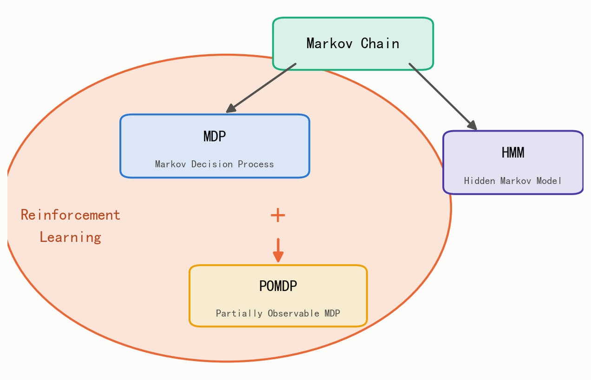
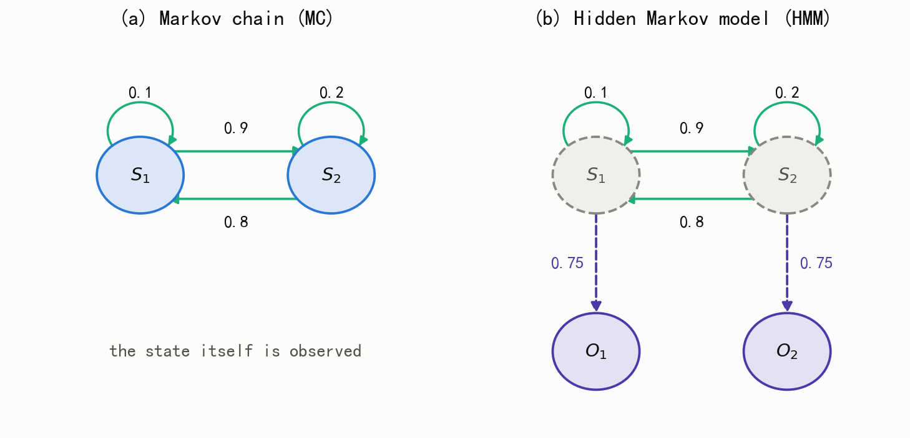
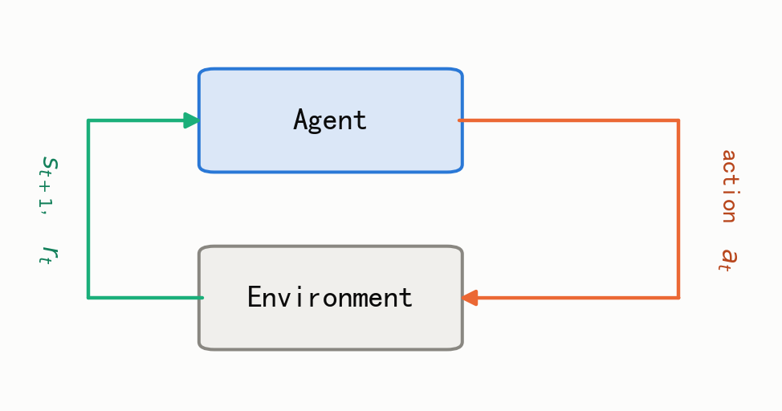
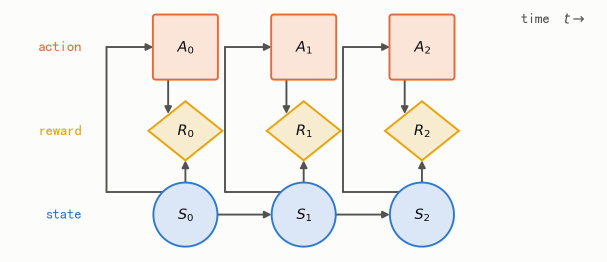
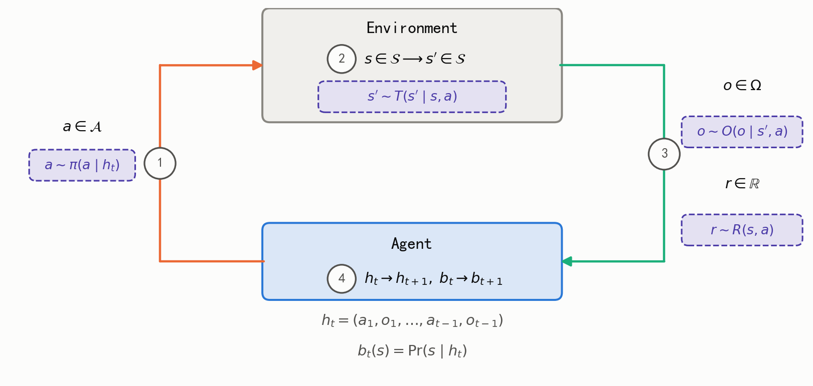
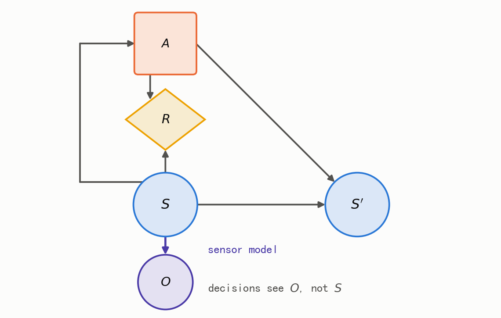

## 1. 马尔可夫模型

### 1.1. 马尔可夫性质

> **定义一 马尔可夫性质**：系统下一时刻的状态只取决于当前状态，与更早的历史状态无关：
>
> \[P(s_{t+1} \mid s_t, s_{t-1}, \ldots, s_1) = P(s_{t+1} \mid s_t)\]

这个性质又称"无后效性"：过去对未来的影响，全部被"现在"所吸收。

### 1.2. 马尔可夫模型家族

按两个维度——状态是否完全可见、是否考虑动作——马尔可夫模型分为四类[1]：

| | 不考虑动作 | 考虑动作 |
|---|---|---|
| 状态完全可见 | 马尔可夫链（MC） | 马尔可夫决策过程（MDP） |
| 状态不完全可见 | 隐马尔可夫模型（HMM） | 部分可观测马尔可夫决策过程（POMDP） |

四个模型之间的关系可以画成一张图：马尔可夫链是共同的起点，向左派生出 MDP，向右派生出 HMM；MDP 与 HMM 相加就是 POMDP，而 MDP 与 POMDP 属于强化学习，HMM 不属于。

<figure>
  
  <figcaption>图 1：马尔可夫模型家族。马尔可夫链是共同的起点，向左派生出 MDP，向右派生出 HMM；MDP 与 HMM 相加得到 POMDP。MDP 与 POMDP 落在强化学习（桃色区域）内，HMM 不在。</figcaption>
</figure>

"状态是否完全可见"这一维度决定了模型里有没有隐变量。用同一条两状态链来对照，差别一目了然：马尔可夫链里状态 \(S_1, S_2\) 直接可见，而隐马尔可夫模型里状态被藏起来，智能体只能看到由状态生成的观测 \(O_1, O_2\)。

<figure>
  
  <figcaption>图 2：同一条两状态链的两种看法。(a) 马尔可夫链：状态 \(S_1, S_2\) 直接可见，转移概率为 0.9、0.8、0.1、0.2。(b) 隐马尔可夫模型：状态不可见（虚线），只能观测到 \(S_1\) 以 0.75 的概率发出 \(O_1\)、\(S_2\) 以 0.75 的概率发出 \(O_2\)。图源：Berkeley CS188 课件（重绘）。</figcaption>
</figure>

- **马尔可夫链（MC）**：概率只取决于当前状态的随机过程，没有决策制定。
- **隐马尔可夫模型（HMM）**：状态不完全可见的马尔可夫模型——只能观测到由隐藏状态生成的观测序列，本身不含决策。
- **马尔可夫决策过程（MDP）**：马尔可夫链上的决策问题。下一个状态是随机的，但概率取决于当前状态与当前决策。
- **部分可观测马尔可夫决策过程（POMDP）**：结合了 MDP 与 HMM 的思想——有决策，但决策者无法直接观测真实状态。

## 2. 马尔可夫模型在强化学习中的应用

### 2.1. 前置知识

强化学习描述**智能体**（agent）与**环境**（environment）的交互[2]：

1. 智能体观测环境的状态 \(s_t\)；
2. 智能体根据**策略**选择动作 \(a_t\)；
3. 环境转移到新状态 \(s_{t+1}\)，并返回**奖励** \(r_t\)；
4. 回到第 1 步，直到回合结束。

<figure>
  
  <figcaption>图 3：智能体执行动作，环境返回新的状态与奖励。图源：Sutton &amp; Barto《Reinforcement Learning: An Introduction》图 3.1（重绘）。</figcaption>
</figure>

> **定义二 策略**：给定状态 \(s\)，输出动作的概率分布 \(\pi(a \mid s)\)。策略是智能体的"大脑"。

> **定义三 回报**：从时刻 \(t\) 起未来奖励的折扣和：
>
> \[U_t = R_t + \gamma R_{t+1} + \gamma^2 R_{t+2} + \cdots = \sum_{k=0}^{\infty} \gamma^k R_{t+k}\]
>
> 其中折扣因子 \(\gamma \in [0, 1)\)：\(\gamma\) 越小，未来奖励越不重要；取 \(\gamma < 1\) 也是上面这个无穷级数收敛的条件。

> **定义四 动作价值函数**：给定策略 \(\pi\)，在状态 \(s\) 采取动作 \(a\) 后回报的期望：
>
> \[Q_{\pi}(s, a) = \mathbb{E}_{\pi}\left[ U_t \mid S_t = s, A_t = a \right]\]

> **定义五 状态价值函数**：给定策略 \(\pi\)，在状态 \(s\) 的回报期望：
>
> \[V_{\pi}(s) = \mathbb{E}_{\pi}\left[ U_t \mid S_t = s \right]\]

强化学习的目标：找到使回报期望最大的最优策略 \(\pi^{*}\)：

\[
J(\pi) = \mathbb{E}\left[ \sum_{t=1}^{\infty} \gamma^{t-1} r(s_t, a_t) \right], \qquad
\pi^{*} = \arg\max_{\pi} J(\pi)
\]

### 2.2. 马尔可夫决策过程（MDP）：状态完全可观测

强化学习可以用马尔可夫决策过程（MDP）\(\langle S, A, P, r, \gamma \rangle\) 来描述[1]。

> **定义六 马尔可夫决策过程**：五元组 \(\langle S, A, P, r, \gamma \rangle\)：
>
> - \(S\)：状态集合
> - \(A\)：动作集合
> - \(P\)：状态转移概率函数 \(P(s' \mid s, a) = \mathbb{P}(S_{t+1} = s' \mid S_t = s, A_t = a)\)
> - \(r\)：奖励函数
> - \(\gamma\)：折扣因子

转移概率同样具有马尔可夫性——下一个状态只取决于当前状态与当前动作，与更早的历史无关：

\[
P(s_{t+1} \mid s_t, a_t, s_{t-1}, a_{t-1}, \ldots) = P(s_{t+1} \mid s_t, a_t)
\]

把 MDP 沿时间展开成概率图模型，各变量之间的依赖关系就清楚了：动作 \(A_t\) 由状态 \(S_t\) 决定（智能体根据当前状态做决策），奖励 \(R_t\) 由 \(S_t\) 与 \(A_t\) 共同决定，下一个状态 \(S_{t+1}\) 也由 \(S_t\) 与 \(A_t\) 共同决定。

<figure>
  
  <figcaption>图 4：MDP 沿时间展开的概率图模型。状态 \(S_t\)（圆）、奖励 \(R_t\)（菱形）、动作 \(A_t\)（方框）。箭头刻画条件依赖：\(S_t \to A_t\)、\(S_t \to R_t\)、\(A_t \to R_t\)、\(S_t \to S_{t+1}\)。图源：Wang Shusen《Deep Reinforcement Learning》课程（重绘）。</figcaption>
</figure>

### 2.3. 部分可观测马尔可夫决策过程（POMDP）：状态部分可观测

部分可观测马尔可夫决策过程（POMDP）结合了 MDP 与 HMM 的思想：像 HMM 一样，当前状态不能直接观测，存在隐变量或只能部分观测；像 MDP 一样，智能体需要做决策并最大化奖励[1]。实际应用中大多是 POMDP，例如无人驾驶（传感器只能感知环境的一小部分）与机器人导航。

- 智能体观测到整个环境 \(\rightarrow\) **MDP**
- 智能体只观测到环境的一部分 \(\rightarrow\) **POMDP**

> **定义七 部分可观测马尔可夫决策过程**：七元组 \(\langle S, A, T, R, \Omega, O, \gamma \rangle\)：
>
> - \(S\)：状态集合
> - \(A\)：动作集合
> - \(T\)：状态转移概率 \(T(s' \mid s, a)\)
> - \(R\)：奖励函数 \(R: S \times A \rightarrow \mathbb{R}\)
> - \(\Omega\)：观测集合
> - \(O\)：观测概率 \(O(s', a, o) = P(o \mid s', a)\)——执行动作 \(a\) 并转移到 \(s'\) 后，观测到 \(o\) 的概率
> - \(\gamma\)：折扣因子

把七个分量沿时间展开，就得到 POMDP 中智能体与环境的完整交互过程：

<figure>
  
  <figcaption>图 5：POMDP 中智能体与环境的交互。(1) 智能体依据历史采取动作 \(a \in A\)；(2) 环境状态发生转移 \(s \rightarrow s'\)；(3) 智能体收到观测 \(o \in \Omega\) 与奖励 \(r \in \mathbb{R}\)；(4) 智能体更新历史 \(h_t \rightarrow h_{t+1}\) 与信念 \(b_t \rightarrow b_{t+1}\)。注意第 4 步：与 MDP 不同，智能体的"输入"不是状态而是观测，因此它必须靠历史 \(h_t = (a_1, o_1, \ldots, a_{t-1}, o_{t-1})\) 和信念 \(b_t(s) = \Pr(s \mid h_t)\) 来决策。图源：Berkeley CS188 课件（重绘）。</figcaption>
</figure>

与 MDP 相比，POMDP 多出的正是 HMM 的那部分：一个**观测模型**。在概率图模型上，这意味着多出一条从状态指向观测的边。

<figure>
  
  <figcaption>图 6：POMDP 的概率图模型。相比 MDP，多出状态到观测的边 \(S \to O\)（紫色虚线）——即传感器模型。智能体能看到的只有观测 \(O\)，看不到真实状态 \(S\)。图源：Berkeley CS188 课件（重绘）。</figcaption>
</figure>

由于看不到真实状态，智能体转而维护一个**信念状态**（belief state）：对当前状态的概率分布 \(b(s)\)。每收到一个新观测，用贝叶斯滤波更新信念：

\[
b'(s') \propto O(o \mid s', a) \sum_{s \in S} T(s' \mid s, a)\, b(s)
\]

> POMDP 可以转化为信念空间上的连续状态 MDP：以信念 \(b\) 作为"状态"。这也是 POMDP 被视为 MDP 自然扩展的原因。

### 2.4. 小结：MDP 与 POMDP 在强化学习中的位置

**MDP 是强化学习问题的标准形式。** 几乎所有的强化学习理论都建立在 MDP 之上：贝尔曼方程、价值迭代、策略迭代、Q-learning、策略梯度。它们能写成今天的样子，靠的正是马尔可夫性带来的两个保证：价值函数可以只依赖当前状态，写成 \(V(s)\) 而不必依赖整段历史；并且存在一个与时间无关的最优策略 \(\pi^{*}(a \mid s)\)。没有马尔可夫性，这两点都不成立，理论会立刻变得难以处理。

**POMDP 是真实世界的常态，MDP 是它的理想化。** 传感器有噪声、视野有遮挡、状态量测不全，现实问题几乎都是 POMDP。

**POMDP 不是"更难的 MDP"，而是估计与决策两个问题的叠加。** 这正是 1.2 节那张模型关系图在算法层面的含义：马尔可夫链描述"状态如何演化"，HMM 解决"如何从观测反推状态"，MDP 解决"如何选动作"；POMDP 等于 MDP 加 HMM，也就是**决策**与**估计**的耦合。这也正是它难的地方——两者无法分开求解：估计的质量决定了决策的上限，而决策又决定了下一步能拿到什么观测。

**MDP 与 POMDP 是强化学习的地基与共同语言，而不是它的全部内容。** 本系列的后续文章——[深度强化学习综述]()、[DQN]()、[PPO]()、[RLHF]()、[RLVR]()——提出的都是挂在这套骨架上的算法与设定选择。

## 参考文献

[1] 平凡的兵, "强化学习、Markov Chain、HMM、Markov Decision Process," 知乎, Jul. 25, 2023. [Online]. Available: https://zhuanlan.zhihu.com/p/645698584. Accessed: Sep. 17, 2026.

[2] S. Wang, "Deep Reinforcement Learning," GitHub repository, 2021. [Online]. Available: https://github.com/wangshusen/DRL

[3] R. S. Sutton and A. G. Barto, *Reinforcement Learning: An Introduction*, 2nd ed. Cambridge, MA, USA: MIT Press, 2018. [Online]. Available: http://incompleteideas.net/book/the-book-2nd.html
