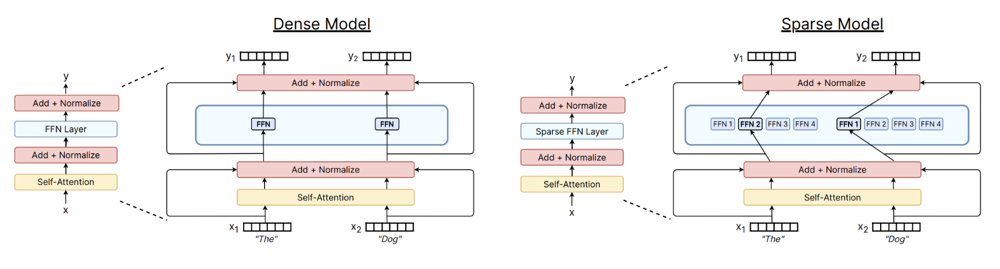

## 1. 混合专家（Mixture of Experts，MoE）

- Dense FFN: 一个大 FFN，每个 token 都要跑它
- MoE FFN: $N$ 个 expert FFN，每个 token 只跑其中 1 个

### 1.1. MoE 的优点

1. 专家数量越多，模型性能越优，而 FLOPs 不变，可参考[图片](more_experts.png)[1]；
2. 在 MoE 模型的激活参数量与 Dense 模型一致的情况下， MoE 模型的训练速度更快，可参考[图片](moe_train.png)[2]；
3. MoE 模型可将专家分布在不同的设备上，单卡显存需求降低，可参考[图片](moe_parallelization.png)。

---

## 参考文献

[1] Fedus W, Zoph B, Shazeer N. Switch transformers: Scaling to trillion parameter models with simple and efficient sparsity[J]. Journal of Machine Learning Research, 2022, 23(120): 1-39.

[2] Muennighoff N, Soldaini L, Groeneveld D, et al. Olmoe: Open mixture-of-experts language models[J]. arXiv preprint arXiv:2409.02060, 2024.