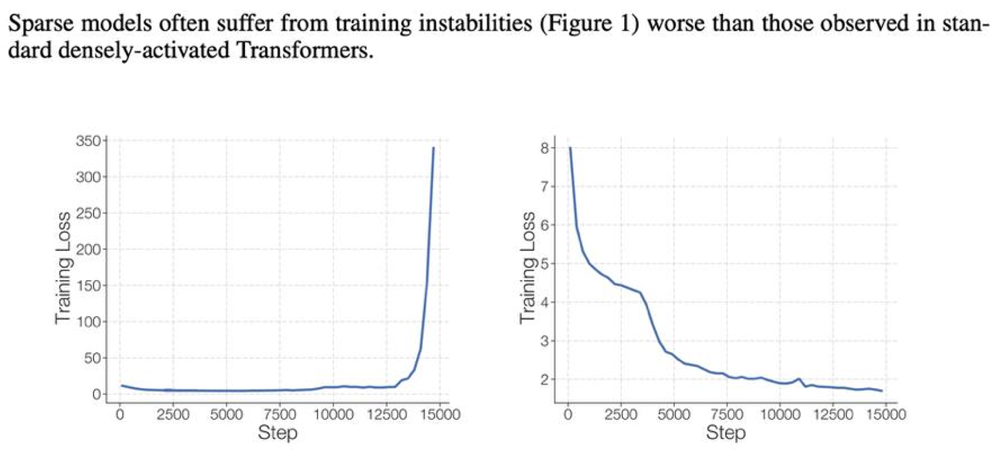
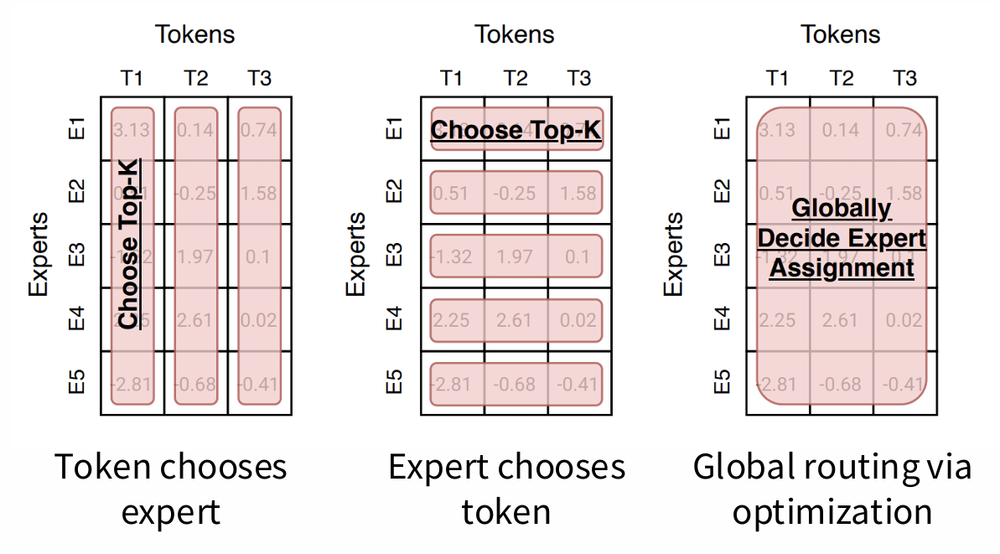

- Dense FFN: 一个大 FFN，每个 token 都要跑它
- MoE FFN: $N$ 个 expert FFN，每个 token 只跑其中 1 个

---

## 1. MoE 的优缺点

**优点**：

1. 专家数量越多，模型性能越优，而 FLOPs 不变，可参考[图片](more_experts.png)[1]；
2. 在 MoE 模型的激活参数量与 Dense 模型一致的情况下， MoE 模型的训练速度更快，可参考[图片](moe_train.png)[2]；
3. MoE 模型可将专家分布在不同的设备上，单卡显存需求降低，可参考[图片](moe_parallelization.png)。

**缺点**：

1. MoE 的甜点区是“大规模分布式系统”，不是“小而简单的单机训练”。
2. 训练目标和训练过程带有启发式，而且有时不稳定，如下图所示[3]：

---

## 2. MoE 的设计方案

### 2.1. 路由函数（Routing Function）

1. **根据 Token 选择专家**：每个 token 选自己最想去的 expert（最为常见）；
2. **根据专家选择 Token**：每个 expert 选自己最想要的 token；
3. **经过优化的全局路由**：在前两者的基础上进行优化，考虑负载均衡、专家利用率等因素。



### 2.2. 路由类型（Routing Type）

#### 2.2.1. Top-k 路由

MoE 架构中最常见的路由类型。



不同模型的 k 值如下表所示：

| 模型 | k |
| --- | --- |
| Switch Transformer | 1 |
| Gshard | 2 |
| Grok | 2 |
| Mixtral | 2 |
| Qwen | 4 |
| DBRX | 4 |
| DeepSeek | 7 |

Top-k 路由的一般实现步骤如下：
1. 计算每个 token 对每个专家的路由分数（routing score）：
$$
s\_{i,t} = \mathrm{softmax}_i({\mathbf{u}^l_t}^\top \mathbf{e}^l_i)\_i,
$$
其中，$l$ 为层数，$t$ 为 token 的位置，$i$ 为专家的编号。$\mathbf{u}^l_t$ 是 token $t$ 在第 $l$ 层的输入表示，$\mathbf{e}^l_i$ 是第 $l$ 层第 $i$ 个专家的权重参数。
2. 选出分数最高的 k 个专家：
$$
g\_{i,t} = \begin{cases}
s\_{i,t} & \text{if } i \in \mathrm{top\_k}(s\_{:,t}) \\\\
0 & \text{otherwise}
\end{cases},
$$
3. 对选出的 k 个专家的分数进行求和：
$$
\mathbf{h}^l_t = \sum\_{i=1}^N (g\_{i,t} \cdot \mathrm{FFN}_i(\mathbf{u}^l_t)) + \mathbf{u}^l_t,
$$
其中 $g\_{i,t}$ 可视作门控值（gating value）。

#### 2.2.2. Hashing 路由



1. 获得 token 的某个 id，可以是：token id、token 字符串等；
2. 对它做哈希；
3. 对专家数量取模，即：

$$
\mathrm{expert\_{id}} = \mathrm{hash}(\mathrm{token\_{id}}) \mod N
$$

#### 2.2.3. 利用强化学习学习路由

由于路由的过程是给 token 分配专家，此过程为离散过程，很适合使用强化学习训练路由函数。



但是，强化学习训练路由函数的过程有两个缺点：
- 训练过程不稳定；
- 训练效率较低。

因此目前该方法并不常用。

#### 2.2.4. BASE 路由

它显式把“负载均衡”放进分配过程本身，而不是像普通 top-k routing 那样，先选完再额外加一个 balancing loss 去补救。



一般步骤：
1. 计算路由分数（routing score）：和普通 router 一样，先用一个小 gating 网络给分；
2. 把整批 token 的分数拼成一个矩阵；
3. 给每个 expert 规定可接收 token 数；
4. 用某种 assignment / matching / optimization 算法求解。

### 2.3. MoE 的变体



MoE 的设计语言的变化主要如下（假设 FFN 原始的特征维度为 $d$）：

(a) 复制 $N$ 个特征维度为 $d$ 的 FFN；

(b) 将特征维度分成 $k$ 份，则原先一个 FFN 变为 $k$ 个特征维度为 $\frac{d}{k}$ 的 FFN；

(c) 固定一个 FFN 为共享专家，其他 $N-1$ 个 FFN 为路由选择专家；

DeepseekMoE[4] 的[消融实验](shared_moe_ablation.png)表明，(c) 的设计比 (b) 更优。

Olmoe[2] 的[消融实验](finegrained_moe_ablation.png)表明，(b) 的设计比 (a) 更优。

不同模型的路由配置如下表所示：

| Model | Routed | Active | Shared | Fine-grained | ratio |
| --- | ---: | ---: | ---: | ---: | ---: |
| GShard | 2048 | 2 | 0 | 0 | - |
| Switch Transformer | 64 | 1 | 0 | 0 | - |
| ST-MOE | 64 | 2 | 0 | 0 | - |
| Mixtral | 8 | 2 | 0 | 0 | - |
| DBRX | 16 | 4 | 0 | 0 | - |
| Grok | 8 | 2 | 0 | 0 | - |
| DeepSeek v1 | 64 | 6 | 2 | 1 | 1/4 |
| Qwen 1.5 | 60 | 4 | 4 | 1 | 1/8 |
| DeepSeek v3 | 256 | 8 | 1 | 1 | 1/14 |
| OlMoE | 64 | 8 | 0 | 1 | 1/8 |
| MiniMax | 32 | 2 | 0 | 0 | 1/4 |
| Llama 4 (maverick) | 128 | 1 | 1 | 0 | 1/2 |

---

## 参考文献

[1] Fedus W, Zoph B, Shazeer N. Switch transformers: Scaling to trillion parameter models with simple and efficient sparsity[J]. Journal of Machine Learning Research, 2022, 23(120): 1-39.

[2] Muennighoff N, Soldaini L, Groeneveld D, et al. Olmoe: Open mixture-of-experts language models[J]. arXiv preprint arXiv:2409.02060, 2024.

[3] Zoph B, Bello I, Kumar S, et al. St-moe: Designing stable and transferable sparse expert models[J]. arXiv preprint arXiv:2202.08906, 2022.

[4] Dai D, Deng C, Zhao C, et al. Deepseekmoe: Towards ultimate expert specialization in mixture-of-experts language models[C]//Proceedings of the 62nd Annual Meeting of the Association for Computational Linguistics (Volume 1: Long Papers). 2024: 1280-1297.