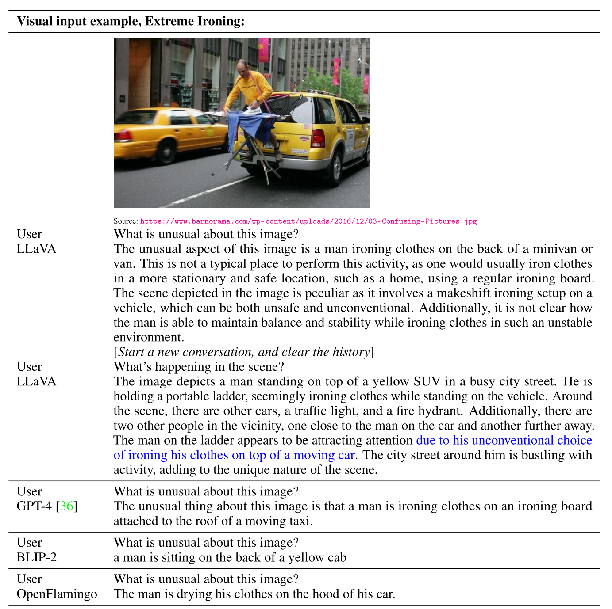
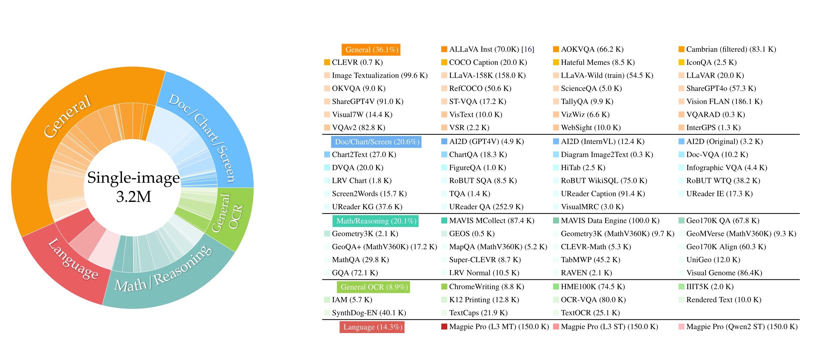
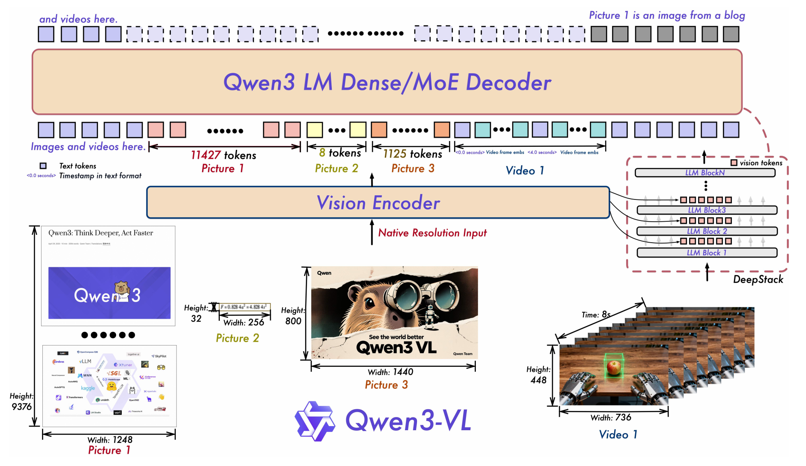

到目前为止，我们讨论的一直是**语言模型**：输入文本、输出文本（text ⇒ text）。但真实世界是多模态的——文本、图像、音频、视频并存，智能体面对的信息远不止文字。

<figure>
  
  <figcaption>世界是多模态的：文本、图像、音频等模态并存。图源：<a href="https://cs336.stanford.edu/lectures/?trace=lecture_17">CS336 Lecture 17 课件</a>。</figcaption>
</figure>

终极目标是**全模态模型**（Omni Model）：

- **理解（Understanding）**：接受任意模态的组合作为输入；
- **生成（Generation）**：输出任意模态的组合。

我们目前所处的位置：

- Transformer 已经表现得非常好，所以必须继续使用它；
- Transformer 的"语言"是 token（离散或连续的），每个 token 近似表示一个语义单元；
- 因此，必须把一切模态都转换成 token；
    - 对文本模态，这件事已经做过了（回忆 tokenization 讲座）；
    - 而对非文本模态，转换要困难得多……

由此引出本讲的两个核心问题：

1. 如何**输入**非文本数据（例如，理解图像）？
2. 如何**输出**非文本数据（例如，生成音频）？

## 1. 视觉编码器

先回答第一个问题（如何输入非文本数据）：第一步是把图像编码成向量（连续 token），CLIP 与 SigLIP 是两种主流方案。

### 1.1 CLIP：对比式语言-图像预训练

[CLIP](https://arxiv.org/abs/2103.00020)（Contrastive Language-Image Pretraining，对比式语言-图像预训练）用对比学习把图像与文本编码进同一个语义空间。

#### 1.1.1 背景：能否利用海量的图像-文本对？

- 传统计算机视觉模型在人工标注的图像上训练，标注成本高、规模受限；
- CLIP 提出的问题是：能否利用规模大得多的 **(图像, 文本) 对**？网页上天然存在大量图片配文，如果能用它们训练，数据规模远超人工标注。

<figure>
  
  <figcaption>CLIP 的对比预训练框架：批量内的图像与文本分别编码后计算相似度矩阵，对齐的图像-文本对（对角线）作为正样本，其余为负样本。图源：<a href="https://cs336.stanford.edu/lectures/?trace=lecture_17">CS336 Lecture 17 课件</a>。</figcaption>
</figure>

#### 1.1.2 方法：对比学习目标

- 取一批 (图像, 文本) 样本（例如 32768 对）；
- 分别编码每张图像和每段文本；
- 对每张图像，让它更偏好与自己配对的文本，而不是批内其他文本；
- 对每段文本，让它更偏好与自己配对的图像，而不是批内其他图像。

<figure>
  
  <figcaption>CLIP 的损失伪代码：对相似度矩阵做对称的交叉熵——图像→文本、文本→图像两个方向各一次。图源：<a href="https://cs336.stanford.edu/lectures/?trace=lecture_17">CS336 Lecture 17 课件</a>。</figcaption>
</figure>

#### 1.1.3 数据：4 亿图像-文本对

- 搜索 500K 个查询词，每个查询约取 20K 个 (图像, 文本) 对；
- 总计在 4 亿（400M）图像-文本对上训练；
- 该数据集没有公开；
- 后来被 [OpenCLIP](https://arxiv.org/abs/2212.07143) 复现——OpenCLIP 使用 LAION-5B 数据集，而 LAION 本身就是用 CLIP 做过滤得到的。

数据处理（[代码](https://github.com/openai/CLIP/blob/main/clip/clip.py#L79)）：

- 图像分辨率各不相同（任意 W × H）；
- 用双三次插值（bicubic interpolation）缩放，使短边为 336 像素；
- 再做中心裁剪（center crop），裁掉边缘得到 336×336。

#### 1.1.4 编码器：ViT-L/14 与 GPT-2

视觉编码器：

- 试验了 ResNet-50 与 [Vision Transformer](https://arxiv.org/pdf/2010.11929)（ViT）两种架构；

<figure>
  
  <figcaption>Vision Transformer（ViT）：图像切成 patch、线性投影并加上位置编码后，作为 token 序列送入标准 Transformer。图源：<a href="https://cs336.stanford.edu/lectures/?trace=lecture_17">CS336 Lecture 17 课件</a>。</figcaption>
</figure>

- Attention Pooling：以激活的全局平均作为 query 做 QKV 注意力，汇聚为单一表示；
- 最终的最佳模型：**ViT-L/14@336px**（L = large，14×14 的 patch、3 通道，在 336×336 分辨率上训练）。

文本编码器：

- GPT-2 Transformer（63M 参数，12 层）；
- 编码 [BOS] ... [EOS]，取最高层 [EOS] 位置的激活作为整段文本的表示。

#### 1.1.5 核心结果与消融

- 在 ImageNet 上，零样本（zero-shot）的 CLIP 超过了在 1.2M 张 ImageNet 图像上监督训练的 ResNet-50；
- 消融：备选方案是直接从图像预测文本（captioning），但相比 CLIP 式的排序（ranking）目标，计算效率低得多。

<figure>
  
  <figcaption>消融对比：直接从图像预测文本的目标（predictive）计算效率远低于 CLIP 的对比式目标（contrastive）。图源：<a href="https://cs336.stanford.edu/lectures/?trace=lecture_17">CS336 Lecture 17 课件</a>。</figcaption>
</figure>

#### 1.1.6 小结

- 图像编码捕捉到了由（带噪声的）文本给出的语义；
- 设计决策围绕图像分类任务做出，粒度不够细；
- 技术要点：需要很大的 batch size，softmax 在整个批上计算。

### 1.2 SigLIP：Sigmoid 损失的图像-文本预训练

[SigLIP](https://arxiv.org/abs/2303.15343)（Sigmoid Loss for Language Image Pre-Training）是 CLIP 的一个简单而有效的改进：把损失从"整个批上的 softmax 多分类"换成"逐对的 sigmoid 二分类"。

#### 1.2.1 目标函数：从"多分类"到"二分类"

- CLIP：多分类——对 (文本, 图像) 与所有 (文本, 图像') 的组合做区分；
- SigLIP：二分类——只判断 (文本, 图像) 是否对齐。

<figure>
  
  <figcaption>SigLIP 的损失伪代码：逐对做 sigmoid 二分类（对齐/不对齐），替代 CLIP 在整个批上做 softmax + 交叉熵的多分类目标（softmax 在交叉熵内部）。图源：<a href="https://cs336.stanford.edu/lectures/?trace=lecture_17">CS336 Lecture 17 课件</a>。</figcaption>
</figure>

这样改的好处：

- **损失与 batch size 解耦**：CLIP 的负样本来自批内，softmax 在整个批上归一化，损失质量强依赖 batch size（因此需要 32768 这样的大批）；SigLIP 逐对独立计算 sigmoid，一个 (图像, 文本) 对的损失不再依赖批内其他样本；
- **小 batch 表现更好**：batch size < 16K 时 SigLIP 优于 CLIP（见 1.2.4）；
- **训练更省**：省掉了大 batch 上 softmax 的开销，训练资源从 256 块 TPUv3 × 10 天降到 32 块 TPUv4 × 5 天（见 1.2.3）。

#### 1.2.2 数据：WebLI

- [WebLI](https://arxiv.org/pdf/2209.06794) 数据集：O(十亿) 量级的 (图像, 文本) 对；
- 从互联网抓取；
- 用自动 OCR 提取图像中的文字；
- 只保留质量最高的 10%；
- 支持 100 种语言。

#### 1.2.3 效率：更快、更省

- CLIP：256 块 TPUv3 训练 10 天；
- SigLIP：32 块 TPUv4 训练 5 天（TPUv4 单卡 FLOP/s 还低于 TPUv3）——快得多！

快的一个重要原因是分布式训练更简单：

- CLIP：softmax 在全局 batch 上归一化，每个 device 必须与其他 device 通信、收集全部特征才能计算相似度矩阵；
- SigLIP：损失逐对分解，每个 device 只对本地 batch 内的对计算 sigmoid 损失即可（负样本来自本地 batch），不需要跨 device 通信。想收集更多负样本也可以，但不是必须的。

<figure>
  
  <figcaption>并行策略与训练资源对比：CLIP 的 softmax 需要跨 device 收集全部特征（全局归一化），SigLIP 的 sigmoid 损失逐对分解、各 device 本地计算即可。CLIP 需要 256 块 TPUv3 训练 10 天，SigLIP 只需 32 块 TPUv4 训练 5 天。图源：<a href="https://cs336.stanford.edu/lectures/?trace=lecture_17">CS336 Lecture 17 课件</a>。</figcaption>
</figure>

#### 1.2.4 Batch Size：损失与批大小解耦

- SigLIP 把损失与 batch size 解耦：小 batch 也能训（而不是像 CLIP 那样必须靠大 batch 提供足够的负样本）；
- batch size < 16K 时优于 CLIP；
- batch size 可以大到 1M，但 32K 就足够了——注意这不是"需要"32K，而是再大收益递减。

> 解耦的边界：损失仍需要批内负样本——batch size = 1 时批内没有任何负样本，损失退化为单纯最大化单对相似度，表示会坍塌；batch size = 2 起损失才有定义，但每个样本只有一个负样本，梯度噪声极大，实践中不会取这么小。

## 2. 把图像编码注入 LLM

### 2.1 LLaVA：CLIP 编码 + 线性投影 + Vicuna

[LLaVA](https://arxiv.org/abs/2304.08485)（Large Language and Vision Assistant）是"视觉编码器 + 投影器 + LM"这个标准 VLM 模板的开创者之一。

#### 2.1.1 数据：用 GPT-4 从 COCO 生成指令数据

- MS COCO 数据集包含带边界框标注的图像与 Mechanical Turk 生成的描述（caption）；
- 用这些描述或检测出的物体提示 GPT-4，生成问题或对话；
- 把生成结果与原始图像配对；
- 共 158K 条样本。

<figure>
  
  <figcaption>LLaVA 的数据生成：用 GPT-4 把 COCO 的标注与描述转成指令对话，再与原始图像配对。图源：<a href="https://cs336.stanford.edu/lectures/?trace=lecture_17">CS336 Lecture 17 课件</a>。</figcaption>
</figure>

#### 2.1.2 模型：CLIP 编码 + 线性投影 + Vicuna

- 视觉编码器：CLIP（ViT-L/14）；
- 文本解码器：[Vicuna](https://www.lmsys.org/blog/2023-03-30-vicuna/)（在 ShareGPT 对话上微调的 LLaMA）；
- 用线性投影（W）把图像编码映射进 LLM 的 embedding 空间；

<figure>
  
  <figcaption>LLaVA 架构：CLIP 编码图像，经线性投影 W 送入 Vicuna 语言模型。图源：<a href="https://cs336.stanford.edu/lectures/?trace=lecture_17">CS336 Lecture 17 课件</a>。</figcaption>
</figure>

#### 2.1.3 训练：两阶段

- 阶段 1（对齐）：冻结视觉编码器与语言模型，只训练 W；
- 阶段 2（微调）：冻结视觉编码器，训练 W 与语言模型。

<figure>
  
  <figcaption>LLaVA 的对话示例。图源：<a href="https://cs336.stanford.edu/lectures/?trace=lecture_17">CS336 Lecture 17 课件</a>。</figcaption>
</figure>

### 2.2 LLaVA OneVision：单图、多图、视频统一

[LLaVA OneVision](https://arxiv.org/pdf/2408.03326) 是 LLaVA 系列的最新版本（继 LLaVA 1.5、LLaVA-Next 之后），可以处理多张图像与视频。

<figure>
  
  <figcaption>LLaVA OneVision 总览：支持单图、多图与视频输入。图源：<a href="https://cs336.stanford.edu/lectures/?trace=lecture_17">CS336 Lecture 17 课件</a>。</figcaption>
</figure>

#### 2.2.1 模型：SigLIP + Qwen-2 72B + 2 层 MLP

- 视觉编码器：SigLIP（使用最后一层 Transformer 层之前和之后的 grid features）；
- 文本解码器：Qwen-2 72B；
- 投影器：2 层 MLP。

#### 2.2.2 数据处理：AnyRes 保留高分辨率

- 保留高分辨率很重要（例如 OCR 任务）；
- CLIP 把图像缩放裁剪到 336×336，信息损失严重；
- 解决方案：LLaVA 1.5 提出的 [AnyRes](https://static.hliu.cc/files/llava/improved_llava.pdf)；
- 把图像切分成 a × b 块（匹配视觉编码器的分辨率），分别编码后拼接；
- 如果 token 过多（原图分辨率太高），改用双线性插值降采样。

<figure>
  
  <figcaption>AnyRes：把高分辨率图像切成 a × b 块，分别编码后拼接，避免信息损失。图源：<a href="https://cs336.stanford.edu/lectures/?trace=lecture_17">CS336 Lecture 17 课件</a>。</figcaption>
</figure>

#### 2.2.3 三类输入：单图、多图、视频

- 目标：让各模态的输入产生大致相同的 token 长度；
- 单图：使用更高分辨率；
- 多图：每张图使用基础分辨率；
- 视频：每帧使用更低分辨率。

<figure>
  
  <figcaption>三类输入（单图/多图/视频）通过调整分辨率统一到相近的 token 长度。图源：<a href="https://cs336.stanford.edu/lectures/?trace=lecture_17">CS336 Lecture 17 课件</a>。</figcaption>
</figure>

#### 2.2.4 数据：质量优先

- 数据理念：质量重于数量。

<figure>
  
  <figcaption>LLaVA OneVision 的数据管线（其一）。图源：<a href="https://cs336.stanford.edu/lectures/?trace=lecture_17">CS336 Lecture 17 课件</a>。</figcaption>
</figure>

<figure>
  
  <figcaption>LLaVA OneVision 的数据管线（其二）。图源：<a href="https://cs336.stanford.edu/lectures/?trace=lecture_17">CS336 Lecture 17 课件</a>。</figcaption>
</figure>

#### 2.2.5 训练：由易到难

- 训练理念：从简单任务到困难任务。
    - Stage-1：低质量数据实现语言-图像对齐；
    - Stage-2：高质量数据实现知识学习；
    - Stage-3：指令数据最终微调。

<figure>
  
  <figcaption>LLaVA OneVision 的训练课程：由易到难。图源：<a href="https://cs336.stanford.edu/lectures/?trace=lecture_17">CS336 Lecture 17 课件</a>。</figcaption>
</figure>

#### 2.2.6 模态间的迁移

- 在单图数据上学图表理解，可以泛化到多图任务；

<figure>
  
  <figcaption>迁移示例 1：单图数据上的图表理解泛化到多图任务。图源：<a href="https://cs336.stanford.edu/lectures/?trace=lecture_17">CS336 Lecture 17 课件</a>。</figcaption>
</figure>

- 在单图数据上学 OCR、在多图数据上学关系推理，可以泛化到 GUI 智能体；

<figure>
  
  <figcaption>迁移示例 2：单图 OCR + 多图关系推理泛化到 GUI 智能体。图源：<a href="https://cs336.stanford.edu/lectures/?trace=lecture_17">CS336 Lecture 17 课件</a>。</figcaption>
</figure>

- 在单图数据上学视觉提示（画圈），可以泛化到视频。

<figure>
  
  <figcaption>迁移示例 3：单图视觉提示（画圈）泛化到视频。图源：<a href="https://cs336.stanford.edu/lectures/?trace=lecture_17">CS336 Lecture 17 课件</a>。</figcaption>
</figure>

#### 2.2.7 小结

- 标准 VLM 模板：视觉编码器 + 投影器 + LM；
- 大部分工作花在数据策展上（大量合成、任务特定的数据）；
- 完全开源（权重与数据都发布了）。

### 2.3 Qwen-VL：交叉注意力适配器

[Qwen-VL](https://arxiv.org/abs/2308.12966) 是通义千问的多模态版本。

#### 2.3.1 架构：OpenCLIP ViT-bigC + 交叉注意力适配器

- 视觉编码器：[OpenCLIP](https://arxiv.org/abs/2212.07143) 的 ViT-bigC（14×14 patch）；
- 适配器（Adapter）：单层交叉注意力，融入 2D 位置编码，把图像映射为固定长度 256；
- 特殊 token：``、`<box>`、`<ref>`。

#### 2.3.2 训练：三阶段

<figure>
  
  <figcaption>Qwen-VL 的三阶段训练总览。图源：<a href="https://cs336.stanford.edu/lectures/?trace=lecture_17">CS336 Lecture 17 课件</a>。</figcaption>
</figure>

- 阶段 1：大规模低质量数据；冻结 LM，训练视觉编码器 + 适配器；

<figure>
  
  <figcaption>阶段 1：大规模低质量数据，冻结 LM，只训练视觉编码器与适配器。图源：<a href="https://cs336.stanford.edu/lectures/?trace=lecture_17">CS336 Lecture 17 课件</a>。</figcaption>
</figure>

- 阶段 2：更高质量的任务特定数据，提高分辨率；训练全部参数；

<figure>
  
  <figcaption>阶段 2：高质量任务特定数据、提高分辨率，训练全部参数。图源：<a href="https://cs336.stanford.edu/lectures/?trace=lecture_17">CS336 Lecture 17 课件</a>。</figcaption>
</figure>

- 阶段 3：指令微调数据；冻结视觉编码器，训练适配器 + LM。

<figure>
  
  <figcaption>Qwen-VL 的能力示例：定位、OCR 等。图源：<a href="https://cs336.stanford.edu/lectures/?trace=lecture_17">CS336 Lecture 17 课件</a>。</figcaption>
</figure>

### 2.4 Qwen2-VL：动态分辨率 + MRoPE

[Qwen2-VL](https://arxiv.org/abs/2409.12191) 在 Qwen-VL 的基础上把视觉编码器换成了更大的 ViT，并引入了动态分辨率与 MRoPE。

#### 2.4.1 视觉编码器：675M ViT + 动态分辨率

<figure>
  
  <figcaption>Qwen2-VL 架构：动态分辨率把图像切成 224×224 的 patch，编码后再压缩。图源：<a href="https://cs336.stanford.edu/lectures/?trace=lecture_17">CS336 Lecture 17 课件</a>。</figcaption>
</figure>

- 更大的 ViT（675M 参数）；
- 关键：动态分辨率（dynamic resolution）处理不同分辨率的图像；
- 每个 224×224 的 patch 用 ViT/14 编码，每 2×2 压缩为 1 个 token，得到 66 tokens；
- 视频：每秒采样 2 帧，最多 16384 tokens。

> 与 LLaVA 的 AnyRes 思路相似、层次不同：AnyRes 在预处理阶段把图像裁成固定大小的瓦片（tile），每个瓦片独立送进固定输入的视觉编码器再拼接；Qwen2-VL 的动态分辨率在视觉编码器内部实现（NaViT 式）——ViT 直接接收任意纵横比的 patch 序列，patch 数随分辨率变化，输出视觉 token 数由 patch 数决定（2×2 压缩后约为其 1/4）。此外 Qwen2-VL 对 token 做 2×2 压缩（224×224 → 66 tokens），AnyRes 则不压缩。

#### 2.4.2 MRoPE：多模态旋转位置编码

> 动机：
> - 1D RoPE 只有"序列索引"一个位置概念；
> - 固定尺寸的 2D 位置嵌入又无法处理动态分辨率下任意数量、任意纵横比的 patch；
> - 而视频理解还需要时间维度——每个 patch 的"位置"其实是三维的：（帧号 t，行坐标 h，列坐标 w）。
>
> MRoPE（Multimodal Rotary Position Embedding，多模态旋转位置编码）就是把 RoPE 扩展到这三个维度。

**1D RoPE 回顾**：d 维向量按隐维度两两成对旋转。对第 i 对（维度 $2i$、$2i+1$）：

\[
\begin{pmatrix} q_{2i}' \\ q_{2i+1}' \end{pmatrix} =
\begin{pmatrix} \cos m\theta_i & -\sin m\theta_i \\ \sin m\theta_i & \cos m\theta_i \end{pmatrix}
\begin{pmatrix} q_{2i} \\ q_{2i+1} \end{pmatrix},
\qquad
\theta_i = \mathrm{base}^{-2i/d},\quad i = 0, 1, \dots, d/2-1
\]

其中 $m$ 是 token 的序列位置，$\theta_i$ 从低频到高频排列：低频频段旋转慢、承载长程结构，高频频段旋转快、承载局部细节。标准 RoPE 里位置只有一个标量 $m$。

**MRoPE 实现**：把 $d/2$ 个旋转对分成三段频带，每段绑定一个位置轴。Qwen2-VL 采用连续分块，从低频到高频依次是 `[t t t t | w w w w | h h h h]`——时间轴占低频段、宽度占中频段、高度占高频段。于是第 i 对旋转实际使用的"位置"是：

\[
m_i = \begin{cases} t, & i < d/6 \\ w, & d/6 \le i < d/3 \\ h, & i \ge d/3 \end{cases}
\]

- 每个视觉 token 的 3D 坐标 $(t, h, w)$：$t$ 是帧号、$h$ 是 patch 的行坐标、$w$ 是列坐标；
- 对图像：$t$ 取常数（单帧），退化为 2D 旋转位置编码（$h$、$w$ 两轴）；
- 对视频：$t$ 是帧索引，同一 $(h, w)$ 位置在不同帧共享空间坐标、靠 $t$ 区分帧；
- 对文本 token：$t = h = w = m$（都取文本序列位置），此时 $m_i \equiv m$，严格退化为标准 1D RoPE——可以直接复用 Qwen2 预训练权重，无需重新训练。

<figure>
  
  <figcaption>MRoPE：在时间、高度、宽度三个维度上分别应用旋转位置编码。图源：<a href="https://cs336.stanford.edu/lectures/?trace=lecture_17">CS336 Lecture 17 课件</a>。</figcaption>
</figure>

**缺憾**：连续分块让每个轴只能访问一个频段——时间轴拿不到高频（难以表示快速运动），空间轴拿不到低频。Qwen3-VL 的交错 MRoPE 修复了这一点，见 2.5.2。

#### 2.4.3 训练：与 Qwen-VL 类似的三阶段

- LM 用 Qwen2 初始化，视觉编码器来自 [DFN](https://arxiv.org/abs/2309.17425)；
- 阶段 1：只训练视觉编码器；
- 阶段 2：训练全部参数；
- 阶段 3：在指令遵循数据集上训练语言模型。

<figure>
  
  <figcaption>Qwen2-VL 的诸多能力。图源：<a href="https://cs336.stanford.edu/lectures/?trace=lecture_17">CS336 Lecture 17 课件</a>。</figcaption>
</figure>

### 2.5 Qwen3-VL：SigLIP-2 + DeepStack 的 SOTA

[Qwen3-VL](https://arxiv.org/abs/2511.21631) 是目前 SOTA 的开源 VLM 之一。

<figure>
  
  <figcaption>Qwen3-VL 总览。图源：<a href="https://cs336.stanford.edu/lectures/?trace=lecture_17">CS336 Lecture 17 课件</a>。</figcaption>
</figure>

#### 2.5.1 语言模型：Qwen-3（Dense 与 MoE，最大 235B-A22B）

- Qwen-3 系列（稠密与 MoE 模型，最大 235B-A22B）；
- 长上下文理解（256K）。

#### 2.5.2 视觉编码器：SigLIP-2 + 交错 MRoPE

- [SigLIP-2](https://arxiv.org/pdf/2502.14786)（架构与 SigLIP 相同）；
- 交错 MRoPE（Interleaved MRoPE）：把全部轴（时间、宽度、高度）交错分布到低频与高频频带——即 [t w h t w h t w h t w h]，而不是 [t t t t w w w w h h h h]；
- 显式视频时间戳：把每帧的绝对时间写成文本 token，插在该帧视觉 token 之前（而不是放在位置编码里）。例如 2 fps 采样的视频，输入序列形如 `<0.0 seconds>` `<第 0 帧视觉 token>` `<0.5 seconds>` `<第 1 帧视觉 token>` ……，时间戳由帧序号 ÷ fps 计算得到。模型靠这些文本直接"看到"时间，回答"第几秒发生了什么"这类时间定位问题时可以直接对齐到秒级时间戳；
- 平方根归一化的逐 token 损失：平衡文本与多模态数据（视频样本很长，不希望它们主导损失）。

#### 2.5.3 适配器：DeepStack 跨层融合

- [DeepStack](https://arxiv.org/abs/2406.04334)：跨层融合，把视觉信息注入到多层（而不是只注入一层）。

#### 2.5.4 训练：4 阶段预训练 + 后训练

- 预训练分 4 个阶段：先训练适配器，再分别在 8K、32K、256K 上下文长度上训练全部参数；

<figure>
  
  <figcaption>Qwen3-VL 的四阶段预训练：先训适配器，再在 8K/32K/256K 长度上训练全部参数。图源：<a href="https://cs336.stanford.edu/lectures/?trace=lecture_17">CS336 Lecture 17 课件</a>。</figcaption>
</figure>

- 后训练：在长 CoT 数据上 SFT、知识蒸馏、RL。

<figure>
  
  <figcaption>Qwen3-VL 的基准结果。图源：<a href="https://cs336.stanford.edu/lectures/?trace=lecture_17">CS336 Lecture 17 课件</a>。</figcaption>
</figure>

#### 2.5.5 小结

- Qwen3-VL 在多个基准上取得了 SOTA 性能；
- 团队在数据上投入了大量工作，但论文公开的实现细节并不多；
- 论文提出了一些规模不大、但可能相当重要的架构改进（交错 MRoPE、DeepStack 等）；
- 进一步提升性能的主要手段是扩大模型与数据规模。

## 3. 走向全模态模型

### 3.1 Chameleon：把一切映射为离散 token

[Chameleon](https://arxiv.org/pdf/2405.09818) 是 Meta 提出的原生多模态模型。Chameleon 的思路是把一切模态都映射成**离散 token**，于是分析与生成图像都可以用同一个 Transformer 统一完成。

<figure>
  
  <figcaption>Chameleon：把图像与文本统一映射为离散 token，用同一个 Transformer 建模。图源：<a href="https://cs336.stanford.edu/lectures/?trace=lecture_17">CS336 Lecture 17 课件</a>。</figcaption>
</figure>

<figure>
  
  <figcaption>Chameleon 的图文交错生成示例：同一个模型既能续写文字，也能生成图像。图源：<a href="https://cs336.stanford.edu/lectures/?trace=lecture_17">CS336 Lecture 17 课件</a>。</figcaption>
</figure>

#### 3.1.1 视觉编码器：VQ-VAE 离散 token 化

- 与 CLIP/SigLIP 的关键区别：后者把图像编码成连续向量、直接投影进 LM 的 embedding 空间（不经过词表，也不改变词表）；Chameleon 的编码器必须把图像映射成**离散** token，并把视觉 token 并入词表（词表随之变大）——只有离散 token 才能被生成出来；
- 使用的工具是 [VQ-VAE](https://arxiv.org/pdf/1711.00937)（Vector Quantized Variational Autoencoder，向量量化变分自编码器）；
- 其思路是：把图像映射到一个离散码本（codebook）上，再从码本解码回图像，最小化重构损失；
- 一张 512×512 的图像被编码成 1024 个 token（码本大小为 8192）；
- 还需要训练一个新的 BPE tokenizer，把视觉 token 与文本 token 合并进同一个词表。

<figure>
  
  <figcaption>VQ-VAE：图像经编码器映射到离散码本，再从码本解码回图像，以最小化重构损失。图源：<a href="https://cs336.stanford.edu/lectures/?trace=lecture_17">CS336 Lecture 17 课件</a>。</figcaption>
</figure>

#### 3.1.2 训练：两阶段

- 阶段 1（占 80% 预算）：大规模无监督数据——2.9T 文本 token、1.5T 文本-图像 token、400B 图文交错 token；
- 阶段 2（占 20% 预算）：50% 来自阶段 1 的数据，加上 50% 高质量数据。

#### 3.1.3 训练稳定性

- 文本 token 熵低、图像 token 熵高，混合训练会出现范数增长（norm growth）与 logit 漂移（logit drift）问题；
- 修复手段：QK-norm 与 z-loss 正则化。

#### 3.1.4 小结

- Chameleon 的设计非常优雅——整个多模态问题被统一为对离散 token 的自回归建模；
- 但它的性能并不突出，因为离散化会丢失信息（例如 OCR 任务）；
- 多模态混合训练本身仍然相当棘手。

## 4. 总结

- 业界预期前沿模型都将走向多模态——原生多模态、全模态（omni）；
- 其中最根本的挑战是：如何编码非文本模态？
- 理解与生成对编码可能提出不同的要求：理解侧重语义，生成侧重更细粒度的细节；
- 训练时需要在图像 + 视频（信息密度更低）与文本之间取得平衡，以保证训练稳定性；
- 当前的主流组合是：连续编码器 + Transformer + 扩散模型（用于生成）。
