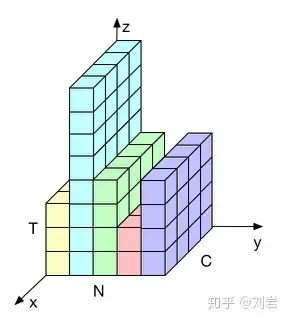

### Layer Normalization

  

在上图中，$N$表示样本轴，$C$表示通道轴，$F$是每个通道的特征数量。BN如右侧所示，它是取**不同样本的同一个通道**的特征做归一化；LN则是如左侧所示，它取的是**同一个样本的不同通道**做归一化

#### 1. BN的问题

##### 1.1. BN与Batch Size

BN是按照**样本数**计算归一化统计量的，当样本数很少时，比如说只有4个，这四个样本的均值和方差便不能反映全局的统计分布息，所以基于少量样本的BN的效果会变得很差。

##### 1.2. BN与RNN

  

在一个batch中，通常各个样本的长度都是不同的，当统计到比较靠后的时间片时，例如上图中$t>4$时，这时只有一个样本还有数据，基于这个样本的统计信息不能反映全局分布，所以这时BN的效果并不好。

另外如果在测试时我们遇到了长度大于任何一个训练样本的测试样本，我们无法找到保存的归一化统计量，所以BN无法运行。

#### 2. LN详解

##### 2.1. MLP中的LN

先看MLP中的LN。设$H$是一层中隐层节点的数量，$l$是MLP的层数，我们可以计算LN的归一化统计量$\mu$和$\sigma$：

$$
\mu^{l} = \frac{1}{H} \sum_{i=1}^{H} a^l_i ~~~~~~~
\sigma^{l} = \sqrt{\frac{1}{H} \sum_{i=1}^{H}(a^l_i-\mu^l)^2}
$$

注意上面统计量的计算是和样本数量没有关系的，它的数量只取决于隐层节点的数量，所以只要隐层节点的数量足够多，我们就能保证LN的归一化统计量足够具有代表性。通过$\mu^{l}$和$\sigma^{l}$
可以得到归一化后的值：

$$
\hat{a}^l = \frac{a^l-\mu^l}{\sqrt{(\sigma^l)^2+\epsilon}} \tag{1}
$$

其中$\epsilon$是一个很小的小数，防止除0。

在LN中我们也需要一组参数来保证归一化操作不会破坏之前的信息，在LN中这组参数叫做增（gain）$g$和偏置（bias）$b$。假设激活函数为$f$，最终LN的输出为：

$$
h^l = f(g^l \odot \hat{a}^l + b^l) \tag{2}
$$

合并公式(1)和(2)并忽略参数$l$，有：

$$
h=f(\frac{g}{\sqrt{\sigma^2+\epsilon}} \odot (a-\mu) + b)
$$

##### 2.2. RNN中的LN

对于RNN时刻$t$时的节点，其输入是$t-1$时刻的隐层状态$h^t$和$t$时刻的输入数据$\text{x}_t$，可以表示为：

$$
\text{a}^t = W_{hh}h^{t-1}+W_{xh}\text{x}^{t}
$$

接着我们便可以在$\text{a}^t$上采取和1.1节中完全相同的归一化过程：

$$
h^t=f(\frac{g}{\sqrt{\sigma^2+\epsilon}} \odot (a^t-\mu^t) + b) ~~~~~~
\mu^{t} = \frac{1}{H} \sum_{i=1}^{H} a^t_i ~~~~~~~
\sigma^{l} = \sqrt{\frac{1}{H} \sum_{i=1}^{H}(a^t_i-\mu^t)^2}
$$

