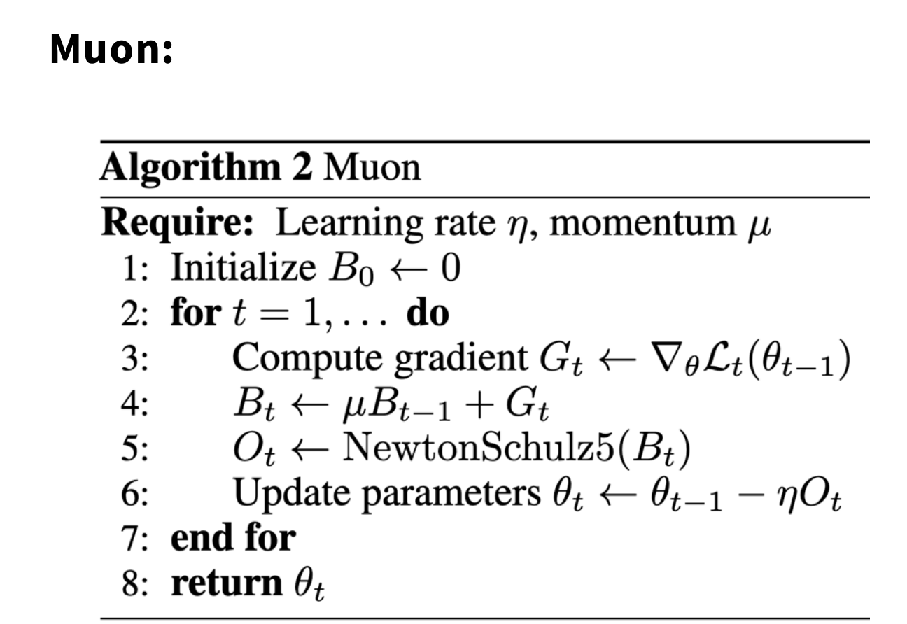

Training a neural network means repeatedly updating its parameters using the gradient of the loss. An optimizer decides **which direction to move and how far to move at each step**.

Let \(\theta_t\) be the parameters at step \(t\), \(\eta\) the learning rate, and

\[
g_t=\nabla_\theta \mathcal{L}_t(\theta_{t-1})
\]

the current gradient. We begin with stochastic gradient descent and then add momentum, adaptive scaling, and matrix structure.

## 1. Stochastic Gradient Descent (SGD)

Stochastic gradient descent estimates the full-dataset gradient from a mini-batch and updates the parameters directly:

\[
\theta_t=\theta_{t-1}-\eta g_t.
\]

SGD is simple and requires little optimizer memory, but the same learning rate applies to every parameter. When different directions of the loss surface have very different scales, updates may oscillate along steep directions and move slowly along flat ones.

### 1.1 Momentum

Momentum maintains an exponential moving average of past gradients:

\[
m_t=\beta m_{t-1}+(1-\beta)g_t,
\]

\[
\theta_t=\theta_{t-1}-\eta m_t.
\]

It suppresses noise from directions that change repeatedly and accumulates updates that remain consistent. SGD sees only the current step, while Momentum retains inertia from recent history.

## 2. AdaGrad: Accumulating Historical Gradients

The adaptive gradient algorithm (AdaGrad) maintains a cumulative squared gradient for every parameter:

\[
v_t=v_{t-1}+g_t^2,
\]

\[
\theta_t=\theta_{t-1}-\eta\frac{g_t}{\sqrt{v_t}+\epsilon}.
\]

Parameters with consistently large gradients receive smaller effective learning rates, while sparse or infrequently updated parameters retain larger steps. This is useful for sparse features, but \(v_t\) never decreases, so the effective learning rate may approach zero too early.

## 3. RMSProp: Focusing on Recent Scale

Root mean square propagation (RMSProp) replaces the sum over all history with an exponential moving average of squared gradients:

\[
v_t=\rho v_{t-1}+(1-\rho)g_t^2,
\]

\[
\theta_t=\theta_{t-1}-\eta\frac{g_t}{\sqrt{v_t}+\epsilon}.
\]

Older gradients gradually fade, avoiding AdaGrad's continually shrinking learning rate. RMSProp still adapts **element by element**: each parameter uses its own recent gradient scale.

## 4. Adam: Combining Momentum and Adaptive Learning Rates

Adaptive moment estimation (Adam) maintains both a first and a second moment of the gradient:

\[
m_t=\beta_1m_{t-1}+(1-\beta_1)g_t,
\]

\[
v_t=\beta_2v_{t-1}+(1-\beta_2)g_t^2.
\]

Because both moving averages start at zero, they require bias correction early in training:

\[
\hat m_t=\frac{m_t}{1-\beta_1^t},
\qquad
\hat v_t=\frac{v_t}{1-\beta_2^t}.
\]

The final update is

\[
\theta_t=\theta_{t-1}-\eta\frac{\hat m_t}{\sqrt{\hat v_t}+\epsilon}.
\]

The first moment provides momentum, while the second moment scales each parameter's update. Adam often reaches a workable training configuration more easily than SGD and is widely used for Transformers and large language models.

## 5. AdamW: Decoupling Weight Decay from the Gradient

Adding an \(L_2\) regularization term directly to Adam also subjects its gradient to second-moment scaling, so the result is no longer equivalent to ordinary weight decay. AdamW separates the two updates:

\[
\theta_t=(1-\eta\lambda)\theta_{t-1}
-\eta\frac{\hat m_t}{\sqrt{\hat v_t}+\epsilon},
\]

where \(\lambda\) is the weight-decay coefficient. Parameter shrinkage no longer depends on gradient history, and the learning rate and weight decay can be tuned more independently.

AdamW is a common baseline for modern large language models. However, it stores a first and a second moment for every parameter, which can consume substantial memory.

## 6. Lion: Sign-Based Momentum Updates

Lion updates parameters using the sign of a momentum direction rather than Adam-style second-moment scaling. Ignoring the learning-rate schedule, its core update is [7]:

\[
\begin{aligned}
c_t&=\beta_1m_{t-1}+(1-\beta_1)g_t,\\
\theta_t&=\theta_{t-1}-\eta_t\left(\operatorname{sign}(c_t)+\lambda\theta_{t-1}\right),\\
m_t&=\beta_2m_{t-1}+(1-\beta_2)g_t.
\end{aligned}
\]

Because each coordinate of \(\operatorname{sign}(c_t)\) is usually \(-1\) or \(+1\), the learning rate \(\eta_t\) largely determines the per-step update magnitude. Lion stores only one momentum state, less than Adam, but discards gradient magnitudes and therefore requires careful learning-rate and weight-decay tuning.

## 7. Muon: Orthogonalizing Matrix Update Directions

Muon stands for MomentUm Orthogonalized by Newton-Schulz. It targets two-dimensional hidden-layer parameters: first accumulate gradients as in Momentum, then approximately orthogonalize the entire update matrix.

The following discussion assumes familiarity with singular values and singular vectors. See [Singular Value Decomposition (SVD)](../svd/).

<figure>
  
  <figcaption>Muon forms a momentum matrix \(B_t\), obtains an update direction \(O_t\) through Newton-Schulz iterations, and then updates the parameters.</figcaption>
</figure>

For a matrix parameter with gradient \(G_t\) at step \(t\), Muon first computes

\[
B_t=\mu B_{t-1}+G_t.
\]

### 7.1 Why the Gradient Is Also a Matrix

Consider a linear layer

\[
y=Wx.
\]

The weight \(W\), its gradient \(G=\nabla_W\mathcal{L}\), and its update \(\Delta W\) all have the same matrix shape. After updating the weight, the output changes by

\[
\Delta y=\Delta W x.
\]

Therefore, \(\Delta W\) is not merely a collection of unrelated numbers. It is itself a linear transformation that determines how much the output changes along different input directions.

The first-order approximation of the loss is

\[
\mathcal{L}(W+\Delta W)
\approx
\mathcal{L}(W)+\langle G,\Delta W\rangle_F.
\]

<strong>Why does the first-order approximation have this form?</strong>

Because \(W\) is a matrix, the Taylor expansion includes all of its elements. Let

\[
G=\nabla_W\mathcal{L}(W),
\]

where \(G_{ij}=\frac{\partial\mathcal{L}}{\partial W_{ij}}\). Then

\[
\mathcal{L}(W+\Delta W)
\approx
\mathcal{L}(W)+
\sum_{i,j}G_{ij}\Delta W_{ij}.
\]

The Frobenius inner product of two matrices with the same shape is

\[
\begin{aligned}
\langle G,\Delta W\rangle_F
&=\sum_{i,j}G_{ij}\Delta W_{ij}\\
&=\operatorname{tr}(G^\top\Delta W).
\end{aligned}
\]

Here, \(\operatorname{tr}\) is the matrix trace. It equals the sum of element-wise products between \(G\) and \(\Delta W\).

Thus, \(\langle G,\Delta W\rangle_F\) measures how closely the update aligns with the gradient. A negative inner product decreases the first-order approximation of the loss. Gradient descent chooses \(\Delta W=-\eta G\), giving

\[
\langle G,\Delta W\rangle_F
=-\eta\lVert G\rVert_F^2\leq 0.
\]

This approximation ignores second- and higher-order terms and is reliable only when \(\Delta W\) is sufficiently small.

The optimizer must construct an update matrix \(\Delta W\) whose inner product with \(G\) is negative.

### 7.2 Interpreting the Gradient Matrix through SVD

Take the SVD of the momentum matrix:

\[
B_t=U\Sigma V^\top
=\sum_i\sigma_i u_i v_i^\top.
\]

Here, \(v_i\) is an input-space direction, \(u_i\) the corresponding output direction, and \(\sigma_i\) the strength of that direction in the momentum update:

\[
B_tv_i=\sigma_i u_i.
\]

Using the Momentum update \(\Delta W=-\eta B_t\) gives

\[
\Delta Wv_i=-\eta\sigma_i u_i.
\]

If the largest singular value greatly exceeds the others, a few directions dominate the update while directions with small singular values receive almost no update.

### 7.3 Why \(UV^\top\) Is a Useful Update Direction

Muon conceptually transforms \(B_t\) into

\[
O_t=UV^\top
=\sum_i u_i v_i^\top.
\]

It preserves the left and right singular vectors but changes every nonzero singular value from \(\sigma_i\) to \(1\):

\[
O_tv_i=u_i.
\]

Muon therefore does not create arbitrary directions or use SVD for dimensionality reduction. It suppresses unusually strong directions and relatively amplifies weak ones while preserving the original singular directions.

Ignoring momentum and setting \(B_t=G_t\), the inner product between the gradient and the orthogonalized result is

\[
\langle G_t,U V^\top\rangle_F
=\operatorname{tr}(\Sigma)
=\sum_i\sigma_i>0.
\]

Choosing

\[
\Delta W=-\eta UV^\top
\]

therefore gives the first-order loss change

\[
\mathcal{L}(W+\Delta W)-\mathcal{L}(W)
\approx
-\eta\sum_i\sigma_i<0.
\]

Thus, \(-UV^\top\) is a descent direction rather than a matrix unrelated to the gradient. With Momentum, \(B_t\) is a smoothed recent direction rather than the current gradient, so—as with ordinary Momentum—strict descent is not guaranteed at every step.

### 7.4 Spectral-Norm View: Limiting the Maximum Effect of an Update

The spectral norm satisfies

\[
\lVert\Delta W\rVert_2
=\max_{\lVert x\rVert_2=1}\lVert\Delta Wx\rVert_2.
\]

It measures the maximum output change that the weight update can produce for any unit input. If \(\lVert\Delta W\rVert_2\leq\eta\) and we want the largest possible first-order loss decrease, the problem is

\[
\underset{\lVert\Delta W\rVert_2\leq\eta}{\arg\min}
\langle G,\Delta W\rangle_F.
\]

One solution is

\[
\Delta W=-\eta UV^\top.
\]

Thus, \(UV^\top\) is the **steepest-descent direction under a spectral-norm constraint**. Its spectral norm is \(1\), uniformly limiting the update's maximum effect over all input directions while using every singular direction supplied by the gradient.

For a full-rank rectangular matrix, \(UV^\top\) is semi-orthogonal: depending on its shape, either \((UV^\top)^\top(UV^\top)=I\) or \((UV^\top)(UV^\top)^\top=I\). “Orthogonalization” describes the update matrix; it does not force the model weight itself to be orthogonal.

### 7.5 Why Newton-Schulz Instead of an Explicit SVD

Explicitly computing an SVD and constructing \(UV^\top\) is mathematically clear but too slow at every training step. Muon instead uses Newton-Schulz iterations, which approximate the same result using matrix multiplications.

One iteration can be written as

\[
X_{k+1}
=aX_k+b(X_kX_k^\top)X_k
+c(X_kX_k^\top)^2X_k.
\]

If \(X_k=U\Sigma_kV^\top\), the iteration preserves \(U\) and \(V\) and transforms each singular value \(s\) as

\[
\phi(s)=as+bs^3+cs^5.
\]

After normalizing the matrix and choosing suitable \(a,b,c\), a few iterations push different singular values toward \(1\). Muon commonly performs five iterations, hence the name `NewtonSchulz5`. The result is an approximate orthogonalization rather than an exact SVD.

### 7.6 Key Difference between Muon and AdamW

AdamW performs **element-wise scaling** using each parameter's historical squared gradients. Muon treats a weight matrix as a whole and adjusts its update using row and column structure.

Muon also does not replace the optimizer for every parameter. Common implementations apply Muon only to two-dimensional hidden-layer weights, while embeddings, output heads, biases, and normalization parameters remain under AdamW.

### 7.7 Costs and Limitations of Muon

- Newton-Schulz iterations add matrix-multiplication and communication overhead.
- Parameters must be grouped by shape between Muon and AdamW, increasing implementation complexity.
- Low-precision and large-scale distributed training require additional numerical-stability handling.
- The best learning rate, momentum, and scaling rules still depend on model size and the training recipe.

## 8. Choosing an Optimizer

| Optimizer | Core mechanism | Main advantage | Main concern |
|---|---|---|---|
| SGD | Current gradient | Simple and low state overhead | Sensitive to learning rate and loss-surface scale |
| SGD + Momentum | First-moment gradient average | Reduces oscillation and accelerates consistent directions | Still applies one update scale |
| AdaGrad | Cumulative squared gradient | Effective for sparse features | Effective learning rate may decay too early |
| RMSProp | Recent squared-gradient average | Adapts to nonstationary gradient scales | Lacks Adam's first-moment combination |
| Adam | First and second moments | Easy to train and broadly applicable | Large state memory; weight decay requires care |
| AdamW | Adam + decoupled weight decay | Common Transformer baseline | Still uses element-wise preconditioning |
| Lion | Momentum + sign update | Less state than Adam and a simple update | Discards gradient magnitude; learning-rate sensitive |
| Muon | Momentum matrix + approximate orthogonalization | Uses the matrix structure of 2D weights | More complex grouping, computation, and distribution |

For a reliable baseline, AdamW is usually the first choice. If memory is sufficient and the training recipe is mature, Muon can then be compared. An optimizer should not be evaluated independently of the learning rate, scheduler, batch size, weight decay, and gradient clipping.

## References

[1] J. Duchi, E. Hazan, and Y. Singer. Adaptive Subgradient Methods for Online Learning and Stochastic Optimization. [Online]. Available: https://jmlr.org/papers/v12/duchi11a.html

[2] T. Tieleman and G. Hinton. Lecture 6.5—RMSProp. [Online]. Available: https://www.cs.toronto.edu/~tijmen/csc321/slides/lecture_slides_lec6.pdf

[3] D. P. Kingma and J. Ba. Adam: A Method for Stochastic Optimization. [Online]. Available: https://arxiv.org/abs/1412.6980

[4] I. Loshchilov and F. Hutter. Decoupled Weight Decay Regularization. [Online]. Available: https://arxiv.org/abs/1711.05101

[5] K. Jordan et al. Muon: An Optimizer for Hidden Layers in Neural Networks. [Online]. Available: https://kellerjordan.github.io/posts/muon/

[6] J. Bernstein and L. Newhouse. Old Optimizer, New Norm: An Anthology. [Online]. Available: https://arxiv.org/abs/2409.20325

[7] Xiangning Chen et al. Symbolic Discovery of Optimization Algorithms. [Online]. Available: https://arxiv.org/abs/2302.06675
