上一讲讨论的是单个 GPU 内部的并行化；这一讲进一步讨论多个 GPU 之间的并行化。

<figure>
  
  <figcaption>多 GPU 节点的层级结构：GPU 内部包含 SM、L2 和 HBM，GPU 之间通过 NVLink / NVSwitch 连接，节点之间通过 InfiniBand / Ethernet 连接。</figcaption>
</figure>

## 1. 为什么需要多个 GPU

从访问速度来看，常见的硬件层级如下：

- 单节点、单 GPU：L1 缓存（L1 Cache）或共享内存（Shared Memory），速度最快；
- 单节点、单 GPU：高带宽内存（High Bandwidth Memory，HBM）；
- 单节点、多 GPU：通过 NVLink 或 NVSwitch 连接；
- 多节点、多 GPU：通过 InfiniBand 或以太网（Ethernet）连接，速度最慢。

层级越远，数据传输通常越慢，通信成本也越高。单个 GPU 内部可以通过算子融合（Operator Fusion）和分块（Tiling）减少内存访问；扩展到多个 GPU 或多个节点后，则需要通过复制（Replication）和分片（Sharding）减少 GPU 之间的通信。

为什么需要多 GPU？主要有两个原因：

1. 模型训练所需的参数、优化器状态、梯度和激活值无法放入单个 GPU。
2. 希望使用更多 GPU（更多浮点运算次数，Floating Point Operations，FLOPs）来更快训练模型。

单个 GPU 的扩展同时受到计算和显存限制。即使超级计算机已经达到每秒百亿亿次浮点运算（ExaFLOPS）的量级，单卡的计算能力和显存容量仍无法持续跟上模型规模增长。因此，多 GPU、多机器并行的目标是把模型的显存需求与计算需求分摊到多个设备和节点上。

## 2. 集合通信原语

集合通信（Collective Operations）是分布式编程中使用的概念性原语，是 20 世纪 80 年代并行编程文献中的经典概念。“集合”意味着：我们描述的是跨越多个设备的通用通信模式，而不是逐一管理点对点通信。这样通常能够获得更好的性能，也能让底层实现进一步优化通信过程。

<figure>
  
  <figcaption>每个参与通信的设备都有一个 Rank，所有设备的数量称为 World Size。</figcaption>
</figure>

### 基本设置

在分布式环境中，每个设备或 GPU 称为一个秩（Rank），例如 Rank 0、Rank 1、Rank 2 和 Rank 3。所有设备的总数称为世界大小（World Size），这里的 World Size 是 4。

下面的代码沿用课程原文，以 `tensor(...)` 展示通信前后各个 Rank 持有的张量。它用于理解数据如何流动，而不是完整的分布式运行代码。

集合通信操作可以分为三类：

- Broadcast、Scatter、Gather 和 Reduce 是基础操作；
- All-gather、Reduce-scatter 和 All-reduce 是实际使用中的主要操作；
- All-to-all 则常用于混合专家模型（Mixture of Experts，MoE）。

<figure>
  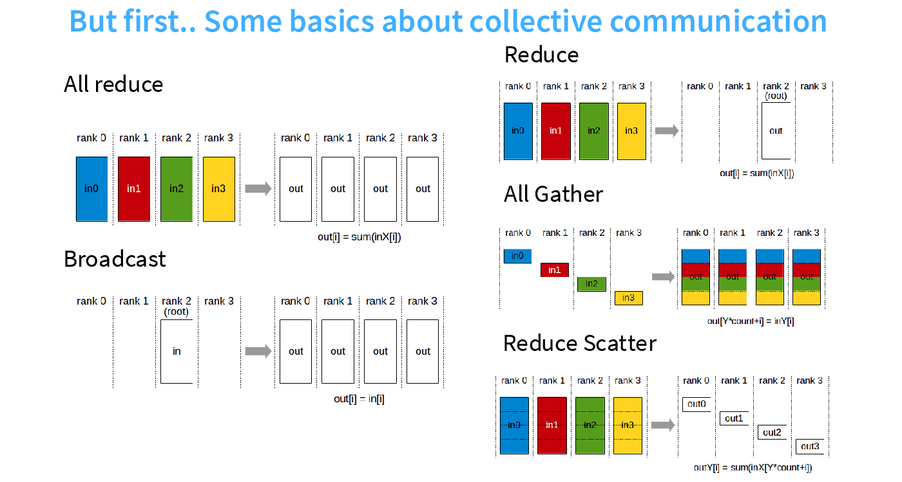
  <figcaption>集合通信原语：All-reduce、Broadcast、Reduce、All-gather 与 Reduce-scatter 的数据流向。</figcaption>
</figure>

### 广播（Broadcast）

Broadcast 将 Rank 0 上的数据复制到所有 Rank。例如，Rank 0 的输入为 `[0, 1, 2, 3]`，操作完成后，每个 Rank 都会得到 `[0, 1, 2, 3]`。

一个简单的使用场景是：Rank 0 加载初始检查点（Checkpoint），然后将其广播给所有 Rank。

```python
# Input
rank0 = tensor([0., 1, 2, 3])

# Output
rank0 = tensor([0., 1, 2, 3])
rank1 = tensor([0., 1, 2, 3])
rank2 = tensor([0., 1, 2, 3])
rank3 = tensor([0., 1, 2, 3])
```

### 分发（Scatter）

Scatter 将 Rank 0 上的张量切分后发送给所有 Rank。例如，Rank 0 上的 `[0, 1, 2, 3]` 会被分发为：

- Rank 0：`[0]`；
- Rank 1：`[1]`；
- Rank 2：`[2]`；
- Rank 3：`[3]`。

Scatter 是理解 Reduce-scatter 的基础。

```python
# Input
rank0 = tensor([0., 1, 2, 3])

# Output
rank0 = tensor([0.])
rank1 = tensor([1.])
rank2 = tensor([2.])
rank3 = tensor([3.])
```

### 收集（Gather）

Gather 将所有 Rank 上的数据收集到 Rank 0，是 Scatter 的逆操作。例如，Rank 0、Rank 1、Rank 2 和 Rank 3 分别持有 `[0]`、`[1]`、`[2]` 和 `[3]`，Gather 后 Rank 0 得到 `[0, 1, 2, 3]`。

Gather 是理解 All-gather 的基础。

```python
# Input
rank0 = tensor([0.])
rank1 = tensor([1.])
rank2 = tensor([2.])
rank3 = tensor([3.])

# Output
rank0 = tensor([0., 1, 2, 3])
```

### 归约（Reduce）

Reduce 将所有 Rank 上的数据收集到 Rank 0，并执行某种操作，例如求和、取最小值或取最大值。若四个 Rank 分别持有 `[0]`、`[1]`、`[2]` 和 `[3]`，使用求和操作后，Rank 0 得到 `[6]`。

Reduce 是理解 All-reduce 的基础。

```python
# Input
rank0 = tensor([0.])
rank1 = tensor([1.])
rank2 = tensor([2.])
rank3 = tensor([3.])

# Output
rank0 = tensor([6.])  # Sum of all ranks (0 + 1 + 2 + 3)
```

### 全收集（All-gather）

All-gather 与 Gather 类似，但它会把收集结果发送给所有 Rank，而不只是 Rank 0。若每个 Rank 持有一个参数分片，All-gather 可以让每个 Rank 都获得完整参数，以便执行前向传播。

```python
# Input
rank0 = tensor([0.])
rank1 = tensor([1.])
rank2 = tensor([2.])
rank3 = tensor([3.])

# Output
rank0 = tensor([0., 1, 2, 3])
rank1 = tensor([0., 1, 2, 3])
rank2 = tensor([0., 1, 2, 3])
rank3 = tensor([0., 1, 2, 3])
```

### 归约-分发（Reduce-scatter）

Reduce-scatter 会沿每个维度执行 Reduce，再将结果分发给各个 Rank。例如：

- Rank 0 输入 `[0, 1, 2, 3]`，得到 `[6]`；
- Rank 1 输入 `[1, 2, 3, 4]`，得到 `[10]`；
- Rank 2 输入 `[2, 3, 4, 5]`，得到 `[14]`；
- Rank 3 输入 `[3, 4, 5, 6]`，得到 `[18]`。

一个使用场景是：反向传播后，将不同数据分片产生的梯度相加，同时把梯度的存储分散到不同 Rank。

```python
# Input
rank0 = tensor([0., 1, 2, 3])
rank1 = tensor([1., 2, 3, 4])
rank2 = tensor([2., 3, 4, 5])
rank3 = tensor([3., 4, 5, 6])

# Output
rank0 = tensor([6.])   # Sum along dim 0 (0 + 1 + 2 + 3)
rank1 = tensor([10.])  # Sum along dim 1 (1 + 2 + 3 + 4)
rank2 = tensor([14.])  # Sum along dim 2 (2 + 3 + 4 + 5)
rank3 = tensor([18.])  # Sum along dim 3 (3 + 4 + 5 + 6)
```

### 全归约（All-reduce）

```
All-reduce = Reduce-scatter + All-gather
```

All-reduce 等价于 Reduce-scatter 加 All-gather。对于上一节的输入，操作完成后每个 Rank 都会得到 `[6, 10, 14, 18]`。

All-reduce 可以在反向传播后汇总不同数据分片产生的梯度，同时复制完整参数。将 All-reduce 拆分为 Reduce-scatter 和 All-gather，还能提供更大的灵活性，例如支持零冗余优化器（Zero Redundancy Optimizer，ZeRO）和完全分片数据并行（Fully Sharded Data Parallel，FSDP）。

<figure>
  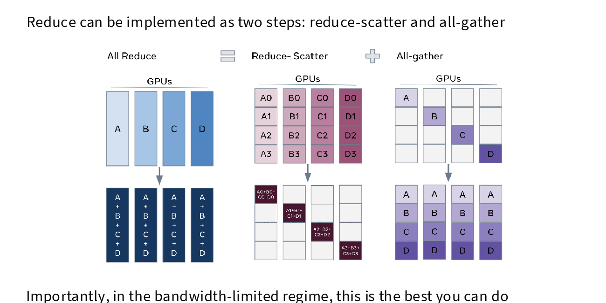
  <figcaption>All-reduce 可分解为 Reduce-scatter 与 All-gather。在带宽受限时，这种分解已经达到最优的数据传输量。</figcaption>
</figure>

```python
# Input
rank0 = tensor([0., 1, 2, 3])
rank1 = tensor([1., 2, 3, 4])
rank2 = tensor([2., 3, 4, 5])
rank3 = tensor([3., 4, 5, 6])

# Output
rank0 = tensor([6., 10, 14, 18])
rank1 = tensor([6., 10, 14, 18])
rank2 = tensor([6., 10, 14, 18])
rank3 = tensor([6., 10, 14, 18])
```

### 全互换（All-to-all）

All-to-all 是最通用的集合通信操作：每个 Rank 都向其他 Rank 发送一部分张量。例如，四个 Rank 的输入分别为：

- Rank 0：`[0, 1, 2, 3]`；
- Rank 1：`[4, 5, 6, 7]`；
- Rank 2：`[8, 9, 10, 11]`；
- Rank 3：`[12, 13, 14, 15]`。

每个 Rank 按位置发送数据后，输出变为：

- Rank 0：`[0, 4, 8, 12]`；
- Rank 1：`[1, 5, 9, 13]`；
- Rank 2：`[2, 6, 10, 14]`；
- Rank 3：`[3, 7, 11, 15]`。

All-to-all 对混合专家模型很有用：每个 Rank 只持有一部分数据和一部分专家，需要通过通信将数据路由到对应专家。对于均衡切分，All-to-all 看起来类似转置；它也可以处理不均衡切分，但实际中应尽量保持各部分大小均衡。

```python
# Input
rank0 = tensor([0., 1, 2, 3])      # send  0 to rank 0,  1 to rank 1,  2 to rank 2,  3 to rank 3
rank1 = tensor([4., 5, 6, 7])      # send  4 to rank 0,  5 to rank 1,  6 to rank 2,  7 to rank 3
rank2 = tensor([8., 9, 10, 11])    # send  8 to rank 0,  9 to rank 1, 10 to rank 2, 11 to rank 3
rank3 = tensor([12., 13, 14, 15])  # send 12 to rank 0, 13 to rank 1, 14 to rank 2, 15 to rank 3

# Output
rank0 = tensor([0, 4, 8, 12])
rank1 = tensor([1, 5, 9, 13])
rank2 = tensor([2, 6, 10, 14])
rank3 = tensor([3, 7, 11, 15])
```

### 术语记忆

- Reduce 表示执行某种满足结合律和交换律的操作，例如求和、取最小值或取最大值；
- Scatter 是 Gather 的逆操作；
- All 表示目标是所有设备。

## 3. GPU 互连硬件

### 3.1. 传统硬件

<figure>
  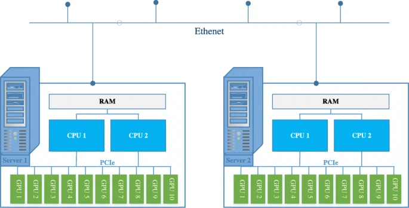
  <figcaption>传统硬件拓扑：同一服务器内的 GPU 通过 PCIe 连接，不同服务器通过 Ethernet 连接。</figcaption>
</figure>

- 同一节点内的 GPU 通过外围组件互连（Peripheral Component Interconnect Express，PCIe）总线通信。以 PCIe 7.0 的 16 条通道为例，带宽约为 242 GB/s；
- 不同节点内的 GPU 通过以太网（Ethernet）通信，带宽约为 200 MB/s。

### 3.2. 现代硬件（数据中心）

<figure>
  
  <figcaption>多 GPU 节点的层级结构：GPU 内部包含 SM、L2 和 HBM，GPU 之间通过 NVLink / NVSwitch 连接，节点之间通过 InfiniBand / Ethernet 连接。</figcaption>
</figure>

上图展示了数据中心中的典型层级：

- 每个节点（node）通常有 8 个 GPU，通过 NVLink 连接到 NVSwitch；
  - B200 的 NVLink 5.0 带宽为 1.8 TB/s
  - 高带宽内存（High Bandwidth Memory，HBM）的带宽约为 8 TB/s；
- 一个 Pod 通常有 256 个节点，通过 InfiniBand 互连：
  - PCIe → 主机通道适配器（Host Channel Adapter，HCA）/ InfiniBand 网卡 → InfiniBand 线缆，带宽约为 0.05 TB/s；
- 集群或数据中心中的多个 Pod 通过以太网连接。
  - 通信路径为 PCIe → CPU。

#### 3.2.1. 绕过 CPU

- 标准以太网通信需要经过 CPU：将数据复制到内核套接字缓冲区、构造 TCP 数据包，再复制到网卡的环形缓冲区；
- 远程直接内存访问（Remote Direct Memory Access，RDMA）允许一个 GPU 直接读写另一个 GPU 的内存，无需 CPU 参与；
- InfiniBand 支持 RDMA，而标准以太网不支持。

#### 3.2.2. 新进展

- GB200/GB300 NVL72：每个托盘有 8 个 GPU，每个机架有 9 个托盘，因此 72 个 GPU 位于同一个 NVLink 域中；
- 融合以太网远程直接内存访问（RDMA over Converged Ethernet，RoCE）让以太网也能绕过 CPU。它与 InfiniBand 类似，但成本更低、能力也较弱；Meta 正在使用这种方案。

### 3.3. NVIDIA 集体通信库（NVIDIA Collective Communication Library，NCCL）

NCCL 会将集合通信操作转换为在 GPU 之间传输的底层数据包，并负责：

- 探测硬件拓扑，例如节点数、交换机数量、NVLink 和 PCIe 的连接情况；
- 优化 GPU 之间的通信路径；
- 启动 GPU 内核来发送和接收数据。

### 3.4. 网络拓扑与扩展域


<figure>
  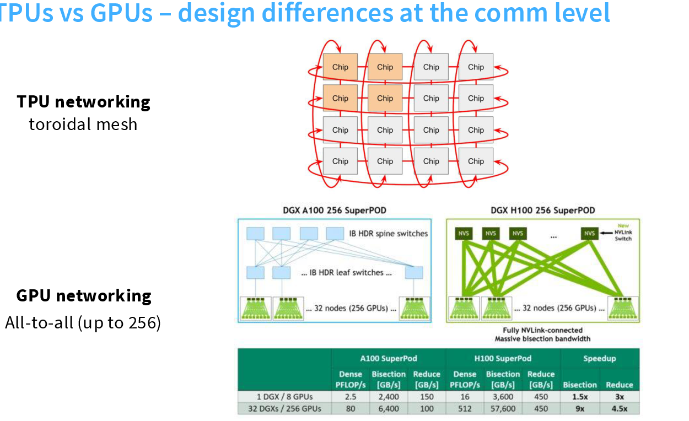
  <figcaption>TPU 的环面网格与 GPU 集群的交换式网络：二者针对的通信模式不同。</figcaption>
</figure>

#### 3.4.1. TPU Mesh 与 GPU 树状网络

TPU 常采用环面网格（Toroidal Mesh）：
- 每个芯片只直接连接到相邻芯片，数据沿网格逐跳传输；
- 这种固定邻接连接的布线简单、成本较低；
- 对于张量并行等结构化通信，可以把需要频繁交换的数据映射到相邻芯片，使局部通信更快。

GPU 集群更常使用树状或交换式网络：
- 设备通过交换机组成分层互连，并在高速域内支持更灵活的 **All-to-all** 通信；
- 与 Mesh 相比，它的硬件和运维成本更高，但能更好地处理目的地**不规则的通信**（例如 MoE 的专家并行方案）。

#### 3.4.2. TPU 也在借鉴交换式设计

TPU 的网络设计也在演进。TPU8i 的互连更接近树状拓扑，可能是为了更好地适应 MoE 等复杂通信；TPU8t 的跨域网络则使用名为 Virgo 的交换网络。也就是说，TPU 在保留 Mesh 对规则通信的效率优势时，也开始借鉴 GPU 的交换式设计来支持更复杂的拓扑和流量模式。

#### 3.4.4. 扩展域的边界

不能把所有加速器直接互连，因为布线、功耗、成本与网络规模都会迅速增加。因此，实际系统通常区分节点内或机架内的扩展域（Scale-up Domain）与跨域的扩展网络（Scale-out Network）。

多机扩展的目标是：模型可容纳的参数量随 GPU 数量近似线性增长，计算能力也随 GPU 数量近似线性增长；这依赖于简单而高效的集合通信原语。

## 4. PyTorch 分布式库（`torch.distributed`）

PyTorch 分布式库（`torch.distributed`）为集合通信提供了统一接口，例如 `all_gather_into_tensor`。它支持针对不同硬件的多种后端：
- Gloo 用于 CPU；
- NCCL 用于 GPU；

还提供完全分片数据并行（Fully Sharded Data Parallel，FSDP）等高层算法，本课程暂不使用。

### All-reduce、Reduce-scatter 与 All-gather

cs336 lecture 7 通过 `setup` 初始化进程组，通过 `cleanup` 销毁进程组；`spawn` 为每个 Rank 启动一个进程。以下代码保留课程源码；其中 `DisableDistributed` 是源码中用于生成可执行讲义追踪结果的上下文管理器。

```python
def setup(rank: int, world_size: int):
    """Initializes the distributed environment (called at start of process)."""
    # Specify where master lives (rank 0), used to coordinate (actual data goes through NCCL)
    os.environ["MASTER_ADDR"] = "localhost"
    os.environ["MASTER_PORT"] = "15623"

    if torch.cuda.is_available():
        dist.init_process_group("nccl", rank=rank, world_size=world_size)
    else:
        dist.init_process_group("gloo", rank=rank, world_size=world_size)


def cleanup():
    """Cleans up the distributed environment (called at end of process)."""
    torch.distributed.destroy_process_group()


def spawn(func: Callable, world_size: int, *args, **kwargs):
    """
    Launches `world_size` processes that each calls `func` on world_size, args, kwargs.
    Note: if we are being traced (inside edtrace), we just run the function directly without multiprocessing and disable distributed functions.
    """
    # Note: assume kwargs are in the same order as what main needs
    if not sys.gettrace():
        # This is the normal code path for multiprocessing
        args = (world_size,) + args + tuple(kwargs.values())
        mp.spawn(func, args=args, nprocs=world_size, join=True)
    else:
        # If we're being traced (inside edtrace), just run the function directly.
        with DisableDistributed():
            args = (0, world_size,) + args + tuple(kwargs.values())
            func(*args)
```

下面是课程中的通信示例。函数会由四个进程异步执行，`rank` 取值为 0 到 3。

```python
def collective_operations_main(rank: int, world_size: int):
    """This function is running asynchronously for each process (rank = 0, ..., world_size - 1)."""
    setup(rank, world_size)

    # All-reduce (dist = torch.distributed)
    dist.barrier()  # Waits for all processes to get to this point (in this case, for print statements)

    data = tensor([0., 1, 2, 3], device=cuda_if_available(rank)) + rank  # Both input and output

    print(f"Rank {rank} [before all-reduce]: {data}", flush=True)
    dist.all_reduce(tensor=data, op=dist.ReduceOp.SUM, async_op=False)  # Modifies tensor in place
    print(f"Rank {rank} [after all-reduce]: {data}", flush=True)

    # Reduce-scatter
    dist.barrier()

    input = torch.arange(world_size, dtype=torch.float32, device=cuda_if_available(rank)) + rank  # Input
    output = torch.empty(1, device=cuda_if_available(rank))  # Allocate output

    print(f"Rank {rank} [before reduce-scatter]: input = {input}, output = {output}", flush=True)
    dist.reduce_scatter_tensor(output=output, input=input, op=dist.ReduceOp.SUM, async_op=False)
    print(f"Rank {rank} [after reduce-scatter]: input = {input}, output = {output}", flush=True)

    # All-gather
    dist.barrier()

    input = output  # Input is the output of reduce-scatter
    output = torch.empty(world_size, device=cuda_if_available(rank))  # Allocate output

    print(f"Rank {rank} [before all-gather]: input = {input}, output = {output}", flush=True)
    dist.all_gather_into_tensor(output_tensor=output, input_tensor=input, async_op=False)
    print(f"Rank {rank} [after all-gather]: input = {input}, output = {output}", flush=True)

    cleanup()
```

这段代码先直接执行 All-reduce；随后执行 Reduce-scatter，再把其输出作为 All-gather 的输入。最终可以验证：All-reduce = Reduce-scatter + All-gather。

## 5. 通信性能基准测试（Benchmarking）

分布式通信的基准测试要测量集合通信真正完成后的耗时，而不是只测量 CPU 发起调用的时间。cs336 lecture 7 采用的基本流程是：分配输入输出张量 → 预热一次 → GPU 同步 → 所有 Rank 对齐 → 计时执行通信 → 再次同步和对齐 → 计算有效带宽。

- 预热（Warmup）可以避免首次初始化带来的额外开销；
- `torch.cuda.synchronize()` 等待 GPU 内核完成，否则 CPU 计时会低估通信时间；
- `dist.barrier()` 让各 Rank 在相同位置开始或结束，避免单个慢 Rank 被忽略；
- 有效带宽（Effective Bandwidth）衡量实际传输量除以总耗时，并不等于硬件链路的峰值带宽。

cs336 lecture 7 设置 `num_elements = 100 * 1024**2 = 104857600`。在 `float32` 下，All-reduce 的单个张量约为 400 MiB；Reduce-scatter 的输入形状为 `[world_size, num_elements]`，四卡时约为 1.56 GiB。显存不足时应先减小 `num_elements`。

```python
def benchmarking():
    # All-reduce
    spawn(all_reduce, world_size=4, num_elements=100 * 1024**2)

    # Reduce-scatter
    spawn(reduce_scatter, world_size=4, num_elements=100 * 1024**2)


def all_reduce(rank: int, world_size: int, num_elements: int):
    setup(rank, world_size)

    # Create tensor
    data = torch.randn(num_elements, device=cuda_if_available(rank))

    # Warmup
    dist.all_reduce(tensor=data, op=dist.ReduceOp.SUM, async_op=False)
    torch.cuda.synchronize()  # Wait for CUDA kernels to finish
    dist.barrier()            # Wait for all the processes to get here

    # Perform all-reduce
    start_time = time.time()
    dist.all_reduce(tensor=data, op=dist.ReduceOp.SUM, async_op=False)
    torch.cuda.synchronize()  # Wait for CUDA kernels to finish
    dist.barrier()            # Wait for all the processes to get here
    end_time = time.time()

    duration = end_time - start_time
    print(f"[all_reduce] Rank {rank}: all_reduce(world_size={world_size}, num_elements={num_elements}) took {render_duration(duration)}", flush=True)

    # Measure the effective bandwidth
    dist.barrier()
    size_bytes = data.element_size() * data.numel()
    sent_bytes = size_bytes * 2 * (world_size - 1)  # 2x because send + receive, world_size-1 steps in all-reduce
    total_duration = world_size * duration
    bandwidth = sent_bytes / total_duration
    print(f"[all_reduce] Rank {rank}: all_reduce measured bandwidth = {round(bandwidth / 1024**3)} GB/s", flush=True)

    cleanup()


def reduce_scatter(rank: int, world_size: int, num_elements: int):
    setup(rank, world_size)

    # Create input and outputs
    input = torch.randn(world_size, num_elements, device=cuda_if_available(rank))  # Each rank has a matrix
    output = torch.empty(num_elements, device=cuda_if_available(rank))

    # Warmup
    dist.reduce_scatter_tensor(output=output, input=input, op=dist.ReduceOp.SUM, async_op=False)
    torch.cuda.synchronize()  # Wait for CUDA kernels to finish
    dist.barrier()            # Wait for all the processes to get here

    # Perform reduce-scatter
    start_time = time.time()
    dist.reduce_scatter_tensor(output=output, input=input, op=dist.ReduceOp.SUM, async_op=False)
    torch.cuda.synchronize()  # Wait for CUDA kernels to finish
    dist.barrier()            # Wait for all the processes to get here
    end_time = time.time()

    duration = end_time - start_time
    print(f"[reduce_scatter] Rank {rank}: reduce_scatter(world_size={world_size}, num_elements={num_elements}) took {render_duration(duration)}", flush=True)

    # Measure the effective bandwidth
    dist.barrier()
    data_bytes = input.element_size() * input.numel()  # How much data in the input
    sent_bytes = data_bytes * (world_size - 1)  # How much needs to be sent (no 2x here)
    total_duration = world_size * duration  # Total time for transmission
    bandwidth = sent_bytes / total_duration
    print(f"[reduce_scatter] Rank {rank}: reduce_scatter measured bandwidth = {round(bandwidth / 1024**3)} GB/s", flush=True)

    cleanup()
```

设 `W = world_size`，`T = duration`。All-reduce 的有效带宽为：

\[
B_{\text{all-reduce}} = \frac{\text{size\_bytes} \times 2 \times (W - 1)}{W \times T}
\]

其中 `2` 表示发送和接收两个方向，`W - 1` 表示每个 Rank 要与其余 Rank 交换数据。

Reduce-scatter 也有有效带宽公式：

\[
B_{\text{reduce-scatter}} = \frac{\text{data\_bytes} \times (W - 1)}{W \times T}
\]

这里的 `data_bytes` 是每个 Rank 输入张量的总字节数。课程代码中，输入形状为 `[W, num_elements]`，因此 `data_bytes = W × size_bytes`，上式可化简为：

\[
B_{\text{reduce-scatter}} = \frac{\text{size\_bytes} \times (W - 1)}{T}
\]

Reduce-scatter 没有 All-reduce 中的 `2`，因为它只执行归约和分发；All-reduce 还需要额外执行一次 All-gather。

实际测试时，应重复多次并取平均值或中位数，再比较不同消息大小、GPU 数量和互连拓扑的结果。cs336 lecture 7 代码用于展示计时与带宽计算的基本方法。

```text
[all_reduce] Rank 0: all_reduce(world_size=4, num_elements=104857600) took 1.60ms
[all_reduce] Rank 2: all_reduce(world_size=4, num_elements=104857600) took 1.38ms
[all_reduce] Rank 1: all_reduce(world_size=4, num_elements=104857600) took 1.50ms
[all_reduce] Rank 3: all_reduce(world_size=4, num_elements=104857600) took 1.38ms
[all_reduce] Rank 1: all_reduce measured bandwidth = 390 GB/s
[all_reduce] Rank 2: all_reduce measured bandwidth = 426 GB/s
[all_reduce] Rank 0: all_reduce measured bandwidth = 366 GB/s
[all_reduce] Rank 3: all_reduce measured bandwidth = 425 GB/s
[reduce_scatter] Rank 0: reduce_scatter(world_size=4, num_elements=104857600) took 2.61ms
[reduce_scatter] Rank 1: reduce_scatter(world_size=4, num_elements=104857600) took 2.47ms
[reduce_scatter] Rank 2: reduce_scatter(world_size=4, num_elements=104857600) took 2.39ms
[reduce_scatter] Rank 3: reduce_scatter(world_size=4, num_elements=104857600) took 2.39ms
[reduce_scatter] Rank 1: reduce_scatter measured bandwidth = 475 GB/s
[reduce_scatter] Rank 0: reduce_scatter measured bandwidth = 450 GB/s
[reduce_scatter] Rank 2: reduce_scatter measured bandwidth = 490 GB/s
[reduce_scatter] Rank 3: reduce_scatter measured bandwidth = 490 GB/s
```

## 6. 分布式训练

### 6.1. 数据并行（Data Parallelism，DP）

数据并行的分片策略是：每个 Rank 获得一部分数据。模型的每一层在所有 Rank 上完整复制，只有 Batch 被切分。

<figure>
  
  <figcaption>数据并行：所有 Rank 复制完整模型，但分别处理不同的数据切片。</figcaption>
</figure>

cs336 lecture 7 用一个 Batch 为 128、特征维度为 1024 的样例，启动 4 个 Rank、训练 4 层多层感知机（Multilayer Perceptron，MLP）一个 step：

```python
def data_parallelism():
    data = generate_sample_data()
    spawn(data_parallelism_main, world_size=4, data=data, num_layers=4, num_steps=1)


def generate_sample_data():
    batch_size = 128
    num_dim = 1024
    data = torch.randn(batch_size, num_dim)
    return data
```

每个 Rank 先切出自己的数据，再创建完整模型参数和各自的 AdamW 优化器状态。前向、反向都在本地进行；与单卡训练相比，唯一的额外步骤是对每一层的梯度执行 All-reduce 平均：

```python
def data_parallelism_main(rank: int, world_size: int, data: tensor, num_layers: int, num_steps: int):
    setup(rank, world_size)

    # Get the slice of data for this rank
    batch_size = data.size(0)
    num_dim = data.size(1)
    local_batch_size = int_divide(batch_size, world_size) # Each rank gets a portion of the batch
    start_index = rank * local_batch_size
    end_index = start_index + local_batch_size
    data = data[start_index:end_index].to(cuda_if_available(rank))

    # Each rank has all parameters and its own optimizer state.
    params = [get_init_params(num_dim, num_dim, rank) for layer in range(num_layers)]
    optimizer = torch.optim.AdamW(params, lr=1e-3)

    for step in range(num_steps):
        # Forward pass
        x = data
        for param in params:
            x = x @ param
            x = F.gelu(x)
        loss = x.square().mean()

        # Backward pass
        loss.backward()

        # The only difference from standard training: synchronize gradients.
        for param in params:
            dist.all_reduce(tensor=param.grad, op=dist.ReduceOp.AVG, async_op=False)

        # Update parameters
        optimizer.step()

        print(f"[data_parallelism] Rank {rank}: step = {step}, loss = {loss.item()}, params = {[summarize_tensor(params[layer]) for layer in range(num_layers)]}", flush=True)

    cleanup()
```

注意：各 Rank 的损失不同，因为它们处理的是本地数据；梯度经过 All-reduce 后相同，因此更新后的参数在各 Rank 上保持一致。

### 6.2. 零冗余优化器 ZeRO（Zero Redundancy Optimizer）

> ZeRO 可以理解为对训练状态进行分片的数据并行优化，本质上是**优化数据并行显存占用**的方法。

#### 朴素数据并行的显存开销

朴素数据并行没有带来模型状态的显存扩展：每个 Rank 都保存一整套参数、梯度和优化器状态。以混合精度 Adam 为例，一个参数通常同时对应五类训练状态：

- BF16/FP16 模型参数：2 字节；
- BF16/FP16 梯度：2 字节；
- 用于累积更新的 FP32 主权重：4 字节；
- Adam 一阶动量：4 字节；
- Adam 二阶动量：4 字节。

因此，每个参数约需要 16 字节、五份相关状态；后面三项合称优化器状态（Optimizer State）。即使增加 GPU 数量，这些状态仍会在每张 GPU 上完整复制，单卡显存占用不会下降。这正是 ZeRO 要消除的冗余。

ZeRO 的直觉是：数据并行仍然让每个 Rank 计算本地 Batch 的完整梯度，但不再让所有 Rank 重复保存昂贵的训练状态。它把状态分给不同 Rank，并把原先的 All-reduce 改写为 Reduce-scatter 与 All-gather。

<figure>
  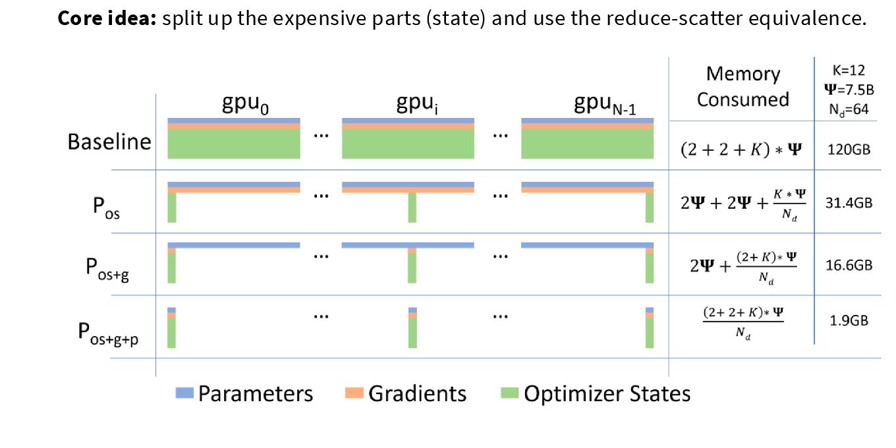
  <figcaption>ZeRO 的状态分片：蓝色为参数，橙色为梯度，绿色为优化器状态。随着阶段提升，单卡保存的状态逐步减少。</figcaption>
</figure>

设模型有 \(\Psi\) 个参数，使用 \(N\) 张 GPU；参数和梯度各占 2 字节，优化器相关状态占 \(K\) 字节。每张 GPU 的模型状态显存可概括为：

| 方案 | 参数 | 梯度 | 优化器状态 | 每张 GPU 的状态显存 |
| --- | --- | --- | --- | --- |
| 朴素数据并行 | 完整副本 | 完整副本 | 完整副本 | \((2 + 2 + K) \times \Psi\) |
| ZeRO Stage 1 | 完整副本 | 完整副本 | 分片 | \((2 + 2 + K / N) \times \Psi\) |
| ZeRO Stage 2 | 完整副本 | 分片 | 分片 | \((2 + (2 + K) / N) \times \Psi\) |
| ZeRO Stage 3 / FSDP | 分片 | 分片 | 分片 | \(((2 + 2 + K) / N) \times \Psi\) |

#### 6.2.1. Stage 1：分片优化器状态

- Stage 1 只分片优化器状态，包括 FP32 主权重与 Adam 的一阶、二阶动量；
- 每个 Rank 仍有完整参数和完整梯度，但只负责更新其中一部分参数。

一次训练 step 中，普通数据并行与 ZeRO Stage 1 的差别如下：

| 步骤 | 普通数据并行 | ZeRO Stage 1 |
| --- | --- | --- |
| 1. 反向传播 | 每个 Rank 在本地数据分片上计算完整梯度 | 每个 Rank 在本地数据分片上计算完整梯度 |
| 2. 同步梯度 | 对完整梯度执行 All-reduce：每个 Rank 得到**完整的全局梯度** | 对梯度执行 Reduce-scatter：每个 Rank 只得到**自己负责参数分片的全局梯度** |
| 3. 更新参数 | 每个 Rank 都有完整优化器状态，因此都更新**完整参数** | 每个 Rank 只用本地优化器状态，更新**自己负责的参数分片** |
| 4. 准备下一步 | 各 Rank 已经更新了相同的完整参数，无需额外通信 | 对更新后的参数分片执行 All-gather，使每个 Rank 再次拥有完整参数 |

> 注：Reduce-scatter 的分片边界需要与优化器状态的分片边界对齐。框架会先按固定顺序将所有参数展平（Flatten）并切成 `N` 份，例如 `P₀, P₁, ..., Pₙ₋₁`；Rank `i` 长期保存 `Pᵢ` 的主权重与 Adam 状态。反向传播后，Reduce-scatter 按同一组边界归约梯度，因此 Rank `i` 收到的恰好是 `Pᵢ` 对应的全局梯度，可以直接完成更新。

| 通信阶段 | 普通数据并行 | ZeRO Stage 1 |
| --- | --- | --- |
| 通信方式及内容 | All-reduce（= Reduce-scatter + All-gather）得到**全局梯度** | Reduce-scatter 得到**自己负责参数分片的全局梯度**；All-gather 收集已更新的参数分片，得到**完整模型参数** |
| 总传输量 | 约 `2 × 参数量`。 | 约 `2 × 参数量`。 |
| 结果 | 每个 Rank 保存完整梯度、完整参数和完整优化器状态 | 每个 Rank 保存完整参数，但优化器状态只保存 `1 / N` |

> **传输量为什么是 `2 × 参数量`？**
>
> 设完整参数（也即完整梯度）的大小为 \(P\) 字节。
>
> 对于普通数据并行，梯度 All-reduce 可分解为一次 Reduce-scatter 和一次 All-gather：
>
> - Reduce-scatter：归约梯度并分发梯度分片，传输量约为 \(P\)；
> - All-gather：收集所有梯度分片，使每个 Rank 得到完整全局梯度，传输量约为 \(P\)。
>
> 因此，普通数据并行每个 step 的梯度同步传输量约为 `2 × P`。
>
> 对于 ZeRO Stage 1：
>
> - Reduce-scatter：归约梯度，并让每个 Rank 获得自己负责参数分片的全局梯度，传输量约为 \(P\)；
> - All-gather：各 Rank 更新本地参数分片后，收集所有更新后的参数分片，使每个 Rank 再次拥有完整模型参数，传输量约为 \(P\)。
>
> 因此，ZeRO Stage 1 的总传输量同样约为 `2 × P`。区别只是普通数据并行的 All-gather 收集的是**梯度**，ZeRO Stage 1 的 All-gather 收集的是**更新后的参数**。
>
> 更精确地说，若有 \(N\) 个 Rank，环形集合通信中每个 Rank 的传输量约为
>
> \[
> 2 \times \frac{N - 1}{N} \times P
> \]
>
> 当 \(N\) 较大时，它接近 `2 × P`。

#### 6.2.2. Stage 2：继续分片梯度

Stage 2 在 Stage 1 的基础上继续分片梯度：参数仍在每个 Rank 上完整复制，但梯度与优化器状态都只长期保存 `1 / N`。它的关键不是不计算完整梯度，而是**不保留完整梯度**。

一次训练 step 中，Stage 2 相比 Stage 1 的关键变化是：将梯度通信嵌入逐层反向传播，而不是等整个反向传播结束后再处理完整梯度。

| 步骤 | ZeRO Stage 1 | ZeRO Stage 2 |
| --- | --- | --- |
| 1. 反向传播 | 逐层计算本地梯度，并累积所有层的梯度； 反向结束时存在完整梯度缓冲区 | 逐层计算本地梯度；某一层梯度一旦就绪，便立刻执行 Reduce-scatter，不再累积完整梯度缓冲区 |
| 2. 同步梯度 | 反向结束后，对完整梯度执行一次 Reduce-scatter | Reduce-scatter 嵌入反向传播，按层执行 |
| 3. 释放梯度 | 直到完整梯度完成同步前，完整梯度缓冲区都需要保留 | 某层梯度完成 Reduce-scatter 后，立即释放该层的本地完整梯度，只保留本地梯度分片 |
| 4. 更新参数 | 每个 Rank 用本地梯度分片和本地优化器状态，更新负责的参数分片 | 相同 |
| 5. 准备下一步 | 对更新后的参数分片执行 All-gather，使每个 Rank 再次拥有完整参数 | 相同 |

| 通信阶段 | ZeRO Stage 1 | ZeRO Stage 2 |
| --- | --- | --- |
| Reduce-scatter | 反向结束后，归约完整梯度；每个 Rank 得到自己负责参数分片的全局梯度 | 某层梯度就绪后立即归约该层；每个 Rank 得到对应分片的全局梯度 |
| All-gather | 更新参数分片后， 收集所有更新后的参数分片，得到完整模型参数 | 相同 |
| 总传输量 | 约 `2 × 参数量` | 约 `2 × 参数量` |
| 梯度状态 | 反向阶段需要完整梯度缓冲区 | 只长期保留本地梯度分片 |

这也带来实现复杂度：梯度分片、优化器状态与参数分片必须继续使用同一组边界；同时需要在某层梯度不再被反向图使用后才释放它。实际实现通常还会把通信与后续层的反向计算重叠，以减少等待时间。

#### 6.2.3. Stage 3：完全分片数据并行

Stage 3 也称完全分片数据并行（Fully Sharded Data Parallel，FSDP）
- 它在 Stage 2 的基础上进一步分片**模型参数**：参数、梯度和优化器状态都只保存 `1 / N`；
- 单个 Rank 在不计算时不再持有完整模型，这是 Stage 3 能近似按 GPU 数量扩展模型状态显存的原因。

| 对比项 | ZeRO Stage 2 | ZeRO Stage 3 / FSDP |
| --- | --- | --- |
| 静态参数 | 每个 Rank 保存完整参数。 | 每个 Rank 只保存参数分片。 |
| 计算某个单元前 | 无需收集参数。 | 按需 All-gather 当前 FSDP 单元的完整参数。 |
| 单元计算完成后 | 完整参数继续保留。 | 立即释放临时完整参数，只保留参数分片。 |
| 参数更新后 | All-gather 更新后的参数分片，恢复完整参数。 | 保持更新后的参数分片；下一次需要时再 All-gather。 |

#### 6.2.3.1. 一个 FSDP 单元的完整生命周期

可以把一个 FSDP 单元理解为一个被包装的模块，例如一个 Transformer 块（Transformer Block）。

<figure>
  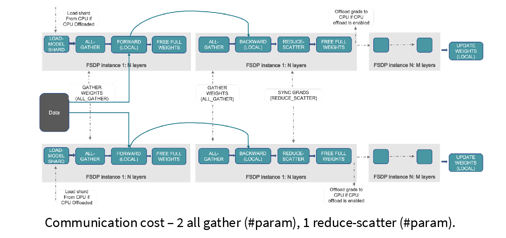
  <figcaption>一个 FSDP 单元的生命周期：前向和反向传播各聚合一次参数，反向后归约梯度；临时完整参数用完即释放。</figcaption>
</figure>

对单元 `i` 而言，一次训练 step 中的操作顺序如下：

1. **加载本地模型分片**：每个 Rank 已保存单元 `i` 的参数分片。若启用了 CPU 卸载（CPU Offload），先将该分片从 CPU 传到 GPU；这不是 GPU 间集合通信。
2. **前向传播**：对该单元执行 All-gather，临时得到完整参数；在本地数据上完成前向计算后，立即释放完整参数，只留下后向所需的激活值。
3. **反向传播**：反向计算到该单元时，再执行一次 All-gather，因为计算该单元梯度仍需要完整参数；完成本地反向计算后，执行 Reduce-scatter，将全局梯度归约并交给负责该参数分片的 Rank。
4. **释放与更新**：释放本地完整梯度和临时完整参数，保留梯度分片。所有单元完成反向传播后，每个 Rank 只用自己的梯度分片和优化器状态更新自己的参数分片。

因此，模型中每个参数在一个 step 内参与两次 All-gather：一次用于前向、一次用于反向；梯度参与一次 Reduce-scatter。总通信量约为 `3 × 参数量`。这里没有 Stage 2 最后的“收集更新后完整参数”步骤：Stage 3 的下一次前向传播会再次按需收集当前单元参数。

#### 6.2.3.2. 增量通信与计算重叠

第 26 页将流程展开为时间线。蓝色与绿色方块分别是前向、反向计算；红色方块是 All-gather（AG），紫色方块是 Reduce-scatter（RS），黄色方块表示参数释放。上方 CPU 时间线负责调度，下方分别是 GPU 计算流与 GPU 通信流。

<figure>
  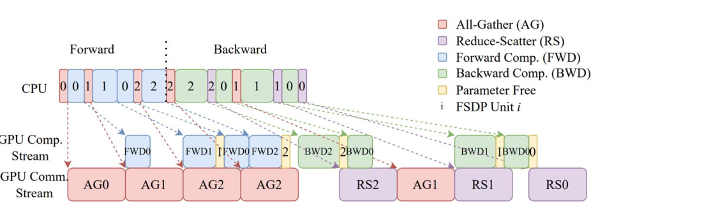
  <figcaption>FSDP 时间线：通信流中的 AG、RS 与计算流中的前向、反向计算交错执行；参数在所属单元计算后立即释放。</figcaption>
</figure>

以正向的单元 `0`、`1`、`2` 为例：`AG0` 完成后可以开始 `FWD0`；在 `FWD0` 运行时，通信流预取单元 `1` 的参数并执行 `AG1`。这样，`FWD0` 结束后，`FWD1` 通常无需再等待完整的参数通信。反向阶段也类似：完成某个单元的反向计算后，将其梯度通过 `RS` 发送出去，同时计算流继续处理相邻单元。

不重叠时，一个单元的等待时间近似为“通信时间 + 计算时间”；进入稳定阶段后，通信与计算并行，单元的耗时更接近二者中较慢的一项：

\[
T_{\text{steady}} \approx \max(T_{\text{compute}}, T_{\text{communication}})
\]

这并不意味着通信完全免费：第一个单元的 All-gather 与最后一个单元的 Reduce-scatter 难以隐藏；通信流中的集合通信也会相互排队。模型过小、FSDP 单元过细、网络延迟过高，或启用 CPU Offload 时，通信仍可能成为瓶颈。

#### 6.2.4. 容量收益与仍然存在的限制

在一个仅估算模型状态的例子中：8 张 80 GB A100，除 FP32 主权重外均使用 BF16，每个参数约占 12 字节。可容纳的参数规模大致如下：

| 方案 | 可容纳的最大参数量 |
| --- | --- |
| 朴素数据并行 | 6.66B |
| ZeRO Stage 1 | 16B |
| ZeRO Stage 2 | 24.62B |
| ZeRO Stage 3 / FSDP | 53.33B |

这只是状态显存的估算，还没有计入激活值、临时张量和通信缓冲区。尤其是，Stage 1、2 仍要求每个 GPU 持有完整参数；Stage 3 虽然分片参数，也不会自动减少激活值显存。

数据并行的计算扩展也仍受 Batch 限制：设备数必须小于 Batch 大小，且 Batch 变大后会出现收益递减。ZeRO 解决的是模型状态冗余，而不是所有并行训练问题；当参数或激活值仍放不下时，还需要结合张量并行、流水线并行或重计算。

### 6.3. 张量并行（Tensor Parallelism，TP）

张量并行的分片策略是：每个 Rank 持有**每一层的一部分参数**，并在层与层之间传输完整数据或激活值。它沿模型宽度切分，而不是沿 Batch 切分。

<figure>
  
  <figcaption>张量并行：所有 Rank 保留完整数据，但每层参数沿宽度维度切分。</figcaption>
</figure>

cs336 lecture 7 用 4 个 Rank 将每层宽度均分为四份。所有 Rank 都持有形状为 `batch_size × num_dim` 的输入，每个 Rank 只计算 `batch_size × local_num_dim` 的局部激活值；随后通过 All-gather 收集并拼接回完整激活值：

```python
def tensor_parallelism():
    data = generate_sample_data()
    spawn(tensor_parallelism_main, world_size=4, data=data, num_layers=4)


def tensor_parallelism_main(rank: int, world_size: int, data: tensor, num_layers: int):
    setup(rank, world_size)

    # All ranks get the data (batch_size x num_dim)
    data = data.to(cuda_if_available(rank))
    batch_size = data.size(0)
    num_dim = data.size(1)
    local_num_dim = int_divide(num_dim, world_size)

    # Each rank gets 1 / world_size of the parameters in every layer.
    params = [get_init_params(num_dim, local_num_dim, rank) for layer in range(num_layers)]

    # Forward pass
    x = data
    for layer in range(num_layers):
        # Compute activations (batch_size x local_num_dim)
        x = x @ params[layer]
        x = F.gelu(x)

        # Allocate memory for activations from every Rank.
        activations = [
            torch.empty(batch_size, local_num_dim, device=cuda_if_available(rank))
            for _ in range(world_size)
        ]

        # Send activations via all-gather, then concatenate them.
        dist.all_gather(tensor_list=activations, tensor=x, async_op=False)
        x = torch.cat(activations, dim=1)

    print(f"[tensor_parallelism] Rank {rank}: forward pass produced activations {summarize_tensor(x)}", flush=True)

    # Backward pass: homework exercise
    cleanup()
```

因此，张量并行减少了每个 GPU 的参数量，但每层前向传播都需要一次 All-gather。这种频繁通信使它更适合 NVLink 等高速互连环境。

#### 6.3.1. 列并行与行并行

上面的示例为了直观展示分片，在每层后都执行一次 All-gather，重新得到完整激活值。实际 Transformer 会把相邻线性层配对：先按列切分，再按行切分，从而避免在两个线性层之间收集完整激活值。

设 MLP 的两个线性层为：

\[
Y = \operatorname{GeLU}(XA), \qquad Z = \operatorname{Dropout}(YB)
\]

将第一个权重矩阵按列切分、第二个矩阵按行切分：

\[
A = [A_1, A_2, \ldots, A_t], \qquad
B =
\begin{bmatrix}
B_1 \\
B_2 \\
\vdots \\
B_t
\end{bmatrix}
\]

第 \(i\) 个 Rank 先独立计算局部激活值 \(Y_i = \operatorname{GeLU}(XA_i)\)；由于 \(Y_i\) 只依赖 \(A_i\)，这里不需要通信。随后它计算局部部分和 \(Z_i = Y_iB_i\)，再通过 All-reduce 求和：\(Z = \sum_i Z_i\)。这样，前向传播只在行并行层的末尾同步一次。

反向传播正好相反：行并行层的输入梯度天然对应各个局部分片，不必收集；列并行层需要把各 Rank 对同一输入的贡献相加，因此在其边界执行 All-reduce。这里的通信位置通常用 `f`、`g` 标记：前向中 `f` 是恒等操作、`g` 是 All-reduce；反向中二者互换。

<figure>
  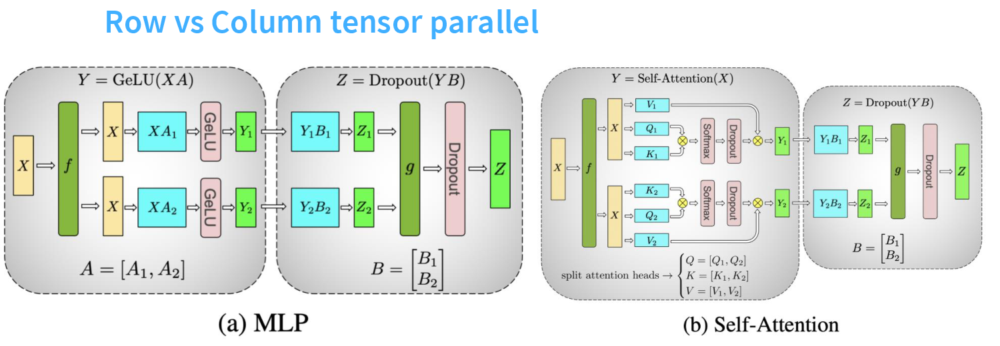
  <figcaption>MLP 中先按列切分上投影，再按行切分下投影；自注意力则按头切分 Q、K、V，再在输出投影处汇合。</figcaption>
</figure>

在 Transformer Block 中，常见的安排如下：

- 列并行：Q、K、V 投影，以及 MLP 的上投影（up-projection）。
- 行并行：注意力输出投影，以及 MLP 的下投影（down-projection）。
- 复制：LayerNorm、路由器（router）等参数量很小或不适合切分的操作。

注意力头可以独立计算，所以把不同的 head 分给不同 Rank 很自然；真正需要归并的地方是输出投影。这个设计的重点不是完全消除通信，而是让一次 All-reduce 覆盖更大的一段计算。

#### 6.3.2. 何时使用张量并行

张量并行每个 Transformer Block 都有集合通信，通常优先放在单个节点内使用。GPU 服务器常在节点内通过 NVLink 或 NVSwitch 连接 8 张左右 GPU；这不是 TP 的硬性上限，但跨节点后延迟和带宽更差，通信很容易盖过分片带来的计算收益。

<figure>
  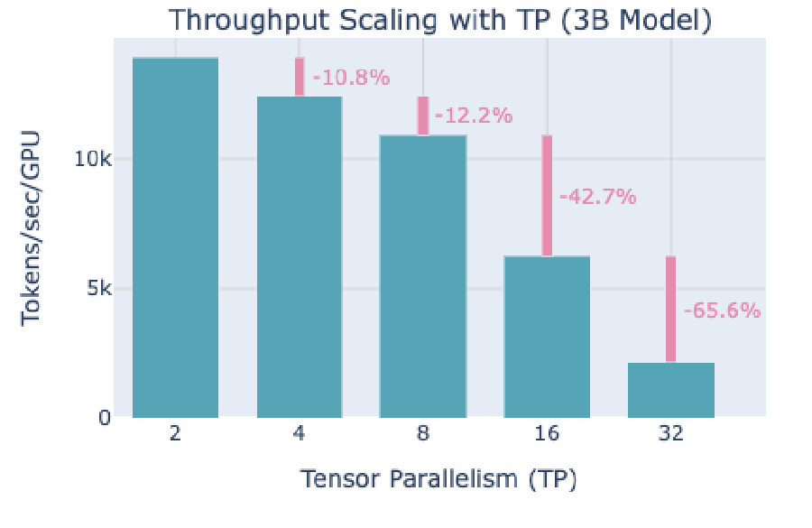
  <figcaption>Lecture 8 的 3B 模型测量：TP 从 2 增至 4、8 时，每卡吞吐分别下降约 10.8%、12.2%；增至 16、32 时下降约 42.7%、65.6%。具体数值依赖模型和硬件，但趋势说明 TP 度不能无限增大。</figcaption>
</figure>

与流水线并行相比，TP：
- 没有流水线气泡，封装也相对直接，并不依赖很大的 Batch；
- 代价是通信更频繁。

对形状为 `b × s × h` 的微批次激活值：
- 流水线并行只在相邻 stage 间点对点传递约 `bsh` 的数据
- Lecture 8 将一个 Transformer Block 的 TP 通信量近似为：

\[
8bsh \frac{t - 1}{t}
\]

> **这个公式如何得到？**
>
> 它估算的是一个 Transformer Block 完成一次前向与反向时，**每个 Rank** 因张量并行产生的通信量，单位是元素数。设一个激活值张量大小为 \(T = bsh\)。
>
> 对环形 All-reduce 而言，Reduce-scatter 与 All-gather 各需传输 \((t - 1)\) 次、每次 \(T / t\) 个元素。因此，一次 All-reduce 在每个 Rank 上的传输量为：
>
> \[
> 2(t - 1)\frac{T}{t}
> = 2bsh\frac{t - 1}{t}
> \]
>
> 其中的 `2` 分别对应 Reduce-scatter 与 All-gather。一个 TP Transformer Block 通常会进行 4 次这样的 All-reduce：注意力输出投影和 MLP 下投影各在前向传播中同步一次；QKV 投影和 MLP 上投影各在反向传播中同步一次。因此总量为：
>
> \[
> 4 \times 2bsh\frac{t - 1}{t}
> = 8bsh\frac{t - 1}{t}
> \]
>
> 这个估算忽略了数据类型的字节数；若使用 BF16，每个元素为 2 字节，实际字节数还要乘以 2。具体实现若融合通信、使用序列并行或改变计算图，通信次数和张量形状也会有所不同。

其中 `t` 是张量并行度。常数项取决于具体 Block 的通信安排，但结论不变：TP 是**逐层**集合通信，最好使用**低延迟、高带宽互连**。

#### 6.3.3. 激活值显存：参数分片后仍可能成为瓶颈

参数、梯度和优化器状态属于相对静态的模型状态；激活值则在一次前向中产生、为了反向传播暂存，并随 Batch 和序列长度变化。TP 与 PP 都能减少每卡的参数显存，却不会自动消除激活值显存。

在保存全部中间激活值的近似下，单个 Transformer Layer 的激活值显存为

\[
M_{\text{act, layer}} = sbh\left(34 + \frac{5as}{h}\right).
\]

其中 \(b\) 为微批次大小，\(s\) 为序列长度，\(h\) 为隐藏维度，\(a\) 为注意力头数。

> **这个公式如何得出？**
>
> 它不是经验常数，而是对反向传播所需张量的一次逐项记账 [5]。这里假设激活值使用 BF16（每个元素 2 字节），Dropout mask 使用 1 字节；忽略 LayerNorm 的均值、方差和 GEMM bias 等很小的缓冲区。因此，公式的单位是**字节**。
>
> - 注意力块：输出投影输入占 \(2sbh\)，注意力 Dropout mask 占 \(sbh\)，QKV 共享输入占 \(2sbh\)，计算 \(QK^\mathsf{T}\) 要保留 Q、K 共 \(4sbh\)，注意力输出还要保留 V 占 \(2sbh\)。这部分共 \(11sbh\)。此外，Softmax 输出、Softmax Dropout mask、注意力 Dropout 输出分别占 \(2as^2b\)、\(as^2b\)、\(2as^2b\)，共 \(5as^2b\)。因此注意力块合计 \(11sbh + 5as^2b\)。
> - MLP：第一层线性层的输入占 \(2sbh\)，第二层线性层的输入和 GeLU 输入各占 \(8sbh\)，Dropout mask 占 \(sbh\)，合计 \(19sbh\)。
> - 两个 LayerNorm：各保存一个输入，共 \(4sbh\)。
>
> 因而总量为 \(11sbh + 5as^2b + 19sbh + 4sbh = 34sbh + 5as^2b = sbh\left(34 + \frac{5as}{h}\right)\)。其中 \(5as^2b\) 就是括号中 \(5as/h\) 乘回 \(sbh\) 后的结果；它来自注意力矩阵及相关 Dropout，因此序列较长时会出现二次增长。

若只使用张量并行，激活值近似变为

\[
  sbh\left(10 + \frac{24}{t} + \frac{5as}{ht}\right).
\]

其中 \(t\) 为张量并行度；\(24 / t\) 与注意力的二次项能随 TP 度缩小，但 \(10\) 对应的 \(10sbh\) 仍留在每个 Rank：LayerNorm 约 \(4sbh\)、Dropout 约 \(2sbh\)，以及注意力和 MLP 输入约 \(4sbh\)。这些操作逐 token 进行，不能仅靠沿 hidden 维度的张量并行继续缩小。

##### 更多减小中间激活的办法

1. **选择性激活重计算**（**Selective Activation Recomputation**）可以在反向传播时重新计算注意力中间结果，而不长期保存它们。它以额外计算换取显存，能去掉上式中随 \(s^2\) 增长的部分；
2. 实际实现还常结合 **FlashAttention** 等内核降低注意力中间张量的存储。

#### 6.3.4. 序列并行

序列并行（Sequence Parallelism，SP）针对的正是上述不随 \(t\) 缩小的 \(10sbh\) 部分：
- 它将 LayerNorm、Dropout 等按 token 独立的操作沿序列维度切分：每个 Rank 只保存 \(s / t\) 个 token 的激活值；
- 进入需要完整 hidden 计算的注意力或 MLP 前，再暂时收集。

<figure>
  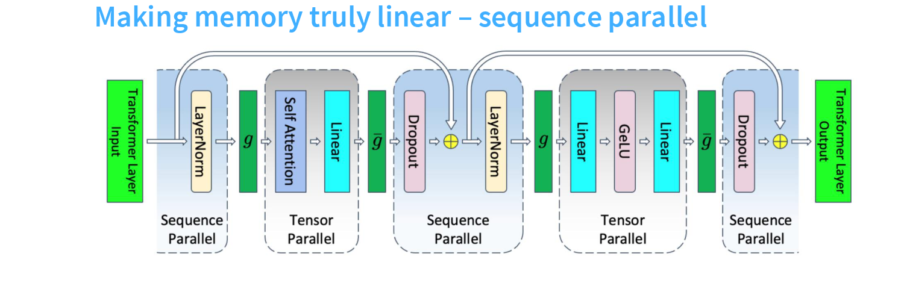
  <figcaption>LayerNorm 和 Dropout 使用序列并行；自注意力、MLP 使用张量并行。两种分片在 Block 内交替。</figcaption>
</figure>

前向传播中，图中的 \(g\) 是 All-gather：把序列分片收集为张量并行所需的输入；\(\bar{g}\) 是 Reduce-scatter：把结果重新沿序列维度分片。反向传播时两者的顺序和作用互换。它不会改变 TP 的参数分片方式，而是把原来复制在每张卡上的逐 token 激活值也分摊出去。

#### 6.3.5. 总结

不同策略的单层激活值显存可写为：

- 无并行：\(sbh(34 + 5as / h)\)。
- 仅 TP：\(sbh(10 + 24 / t + 5as / (ht))\)。
- TP + SP：\(sbh(34 / t + 5as / (ht))\)。
- TP + 选择性激活重计算：\(sbh(10 + 24 / t)\)。
- TP + SP + 选择性激活重计算：\(sbh(34 / t)\)。

因此，TP 主要沿宽度分摊参数和部分激活值；SP 进一步消除逐 token 激活值的复制；重计算则处理注意力带来的二次项。三者互补，但都会引入额外通信或计算，需要按序列长度、显存余量与互连能力取舍。

### 6.4. 上下文并行（Context Parallelism，CP）

上下文并行面向长序列：它沿序列维度切分激活值，让**每个 Rank 只保存并处理一段上下文**。与主要处理逐 token 操作的序列并行不同，CP 还将自注意力本身分布到多个 GPU 上。

在环形注意力（Ring Attention）中：
1. **本地操作**：每个 Rank 固定保留自己的 query block，并先用本地的 key-value block 计算一部分注意力；
2. **环形传输**：各 Rank 沿环传递 key-value block；
3. **分块计算**：每收到一个新的 block，就与本地 query block 累积一次分块注意力（Blockwise Attention）。

<figure>
  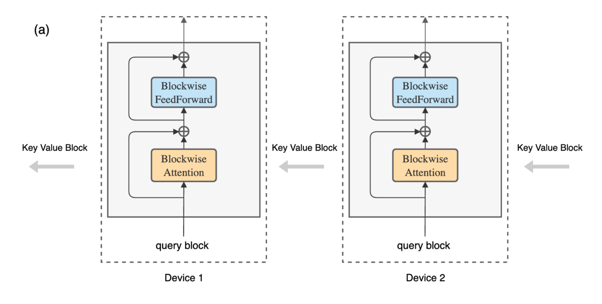
  <figcaption>上下文并行／环形注意力：每张 GPU 保留本地 query block，key-value block 在设备间依次传递，以分块方式完成长序列注意力。</figcaption>
</figure>

这样可以把长序列的激活值和注意力计算分摊到多张 GPU，避免单卡保存完整序列的注意力中间结果。代价是每轮注意力都要传递 key-value block，因此 CP 更适合高带宽互连；序列越长，显存收益通常越明显。

### 6.5. 流水线并行（Pipeline Parallelism，PP）

流水线并行的分片策略是：每个 Rank 持有连续的一部分层，并在相邻 Rank 之间传输完整数据或激活值。它沿模型深度切分。

<figure>
  
  <figcaption>流水线并行：模型层沿深度切分，相邻 Rank 之间传递激活值。</figcaption>
</figure>

cs336 lecture 7 示例将 4 层模型切到 2 个 Rank 上，并把一个 Batch 切成 4 个微批次（Micro-batch）。微批次可以减少流水线气泡（Pipeline Bubble）：不同 Rank 同时处理处于不同阶段的微批次。

```python
def pipeline_parallelism():
    data = generate_sample_data()
    spawn(pipeline_parallelism_main, world_size=2, data=data, num_layers=4, num_micro_batches=4)


def pipeline_parallelism_main(rank: int, world_size: int, data: tensor, num_layers: int, num_micro_batches: int):
    setup(rank, world_size)

    # Use all the data.
    data = data.to(cuda_if_available(rank))
    batch_size = data.size(0)
    num_dim = data.size(1)

    # Split up layers: each Rank gets a consecutive subset.
    local_num_layers = int_divide(num_layers, world_size)
    local_params = [get_init_params(num_dim, num_dim, rank) for layer in range(local_num_layers)]

    # Break up into micro batches to minimize the bubble.
    micro_batch_size = int_divide(batch_size, num_micro_batches)
    if rank == 0:
        micro_batches = data.chunk(chunks=num_micro_batches, dim=0)
    else:
        micro_batches = [
            torch.empty(micro_batch_size, num_dim, device=cuda_if_available(rank))
            for _ in range(num_micro_batches)
        ]

    # Forward pass
    for x in micro_batches:
        # Get activations from the previous Rank.
        if rank - 1 >= 0:
            dist.recv(tensor=x, src=rank - 1)

        # Compute layers assigned to this Rank.
        for param in local_params:
            x = x @ param
            x = F.gelu(x)

        # Send activations to the next Rank.
        if rank + 1 < world_size:
            print(f"[pipeline_parallelism] Rank {rank}: sending {summarize_tensor(x)} to rank {rank + 1}", flush=True)
            dist.send(tensor=x, dst=rank + 1)

    # Backward pass: homework exercise
    cleanup()
```

#### 6.5.1. 按层切分与流水线气泡

最直接的按层切分是：GPU 0 保存前几层，GPU 1 保存接下来的层，依此类推。前向传播时，激活值向后传递；反向传播时，激活值的梯度向前传递。

<figure>
  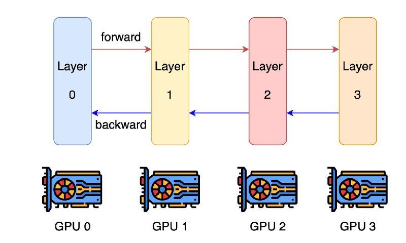
  <figcaption>按层切分：不同 GPU 负责连续的模型层，前向传递激活值，反向传递激活值的梯度。</figcaption>
</figure>

单个 Batch 的按层切分利用率很低。以 `n` 张 GPU 为例，GPU 0 完成第一层前向后，GPU 1 才能开始；直到反向梯度逐层传回前，前面的 GPU 大部分时间都在等待。理想化地看，每张 GPU 的活跃时间只有约 `1 / n`。这些空闲时间称为流水线气泡（Pipeline Bubble）。

<figure>
  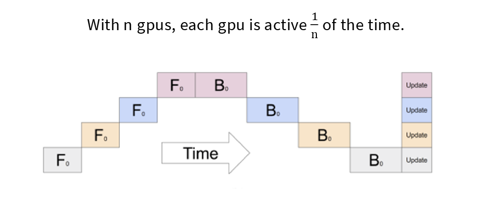
  <figcaption>单个 Batch 的按层切分：前向和反向只能逐阶段推进，四张 GPU 大部分时间处于等待状态。</figcaption>
</figure>

流水线并行把一个 Batch 切成多个微批次（Micro-batch）。GPU 0 将第一个微批次送往下一阶段后，立刻开始处理第二个微批次；不同 GPU 因而能同时处理处于不同阶段的微批次。

<figure>
  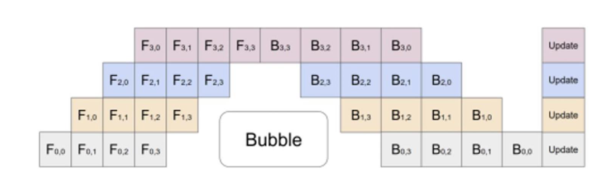
  <figcaption>微批次流水线调度：F<sub>i,j</sub> 表示阶段 i 处理微批次 j 的前向传播，B<sub>i,j</sub> 表示反向传播；开始和结束处仍会出现流水线气泡。</figcaption>
</figure>

设流水线阶段数为 \(n_{\text{stages}}\)，微批次数为 \(n_{\text{micro}}\)，气泡时间与有效计算时间之比近似为：

\[
\frac{T_{\text{bubble}}}{T_{\text{useful}}}
\approx
\frac{n_{\text{stages}} - 1}{n_{\text{micro}}}
\]

阶段越多，流水线填充和排空的气泡越大；增加微批次数可以摊薄气泡，因此流水线通常需要足够大的 Batch。不过微批次数不能无限增加：每个微批次过小会降低单次计算效率，也会增加调度开销。

#### 6.5.2. 显存、通信与 Batch 的取舍

- 流水线并行的首要收益是显存：每张 GPU 只保存连续的一部分层，而不是完整模型；
- 它的通信也适合较慢的跨节点链路：相邻阶段只进行点对点通信，传输规模主要取决于激活值大小 \(b \times s \times h\)（微批次大小、序列长度、隐藏维度），而不是像 FSDP 那样按需交换整个参数分片。

<figure>
  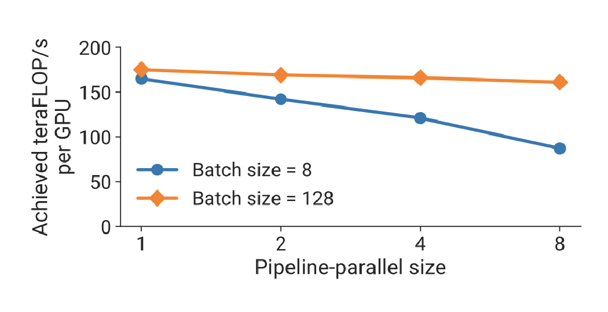
  <figcaption>Batch 较小时，增加流水线阶段会因气泡显著降低每 GPU 吞吐；Batch 较大时，微批次能更好地隐藏气泡。</figcaption>
</figure>

因此，流水线并行常用于节点间的慢速互连，以换取更好的模型显存扩展；但它对 Batch 和微批次数十分敏感。

#### 6.5.3. 更复杂的调度与零气泡（Zero-bubble）

可以给每个设备分配多个流水线阶段，或采用交错调度，让设备在不同微批次和不同阶段之间切换。这会减少空闲时间，却会增加阶段间激活值传输和调度复杂度，是“通信带宽换利用率”的取舍。

Zero-bubble 流水线进一步观察到，反向传播可拆成两部分：

1. 激活值反向传播：计算并传递输入梯度，它必须尽快传回前一个阶段；
2. 权重梯度计算：计算参数梯度，在已经拥有激活值和上游梯度后，可以延后执行。

<figure>
  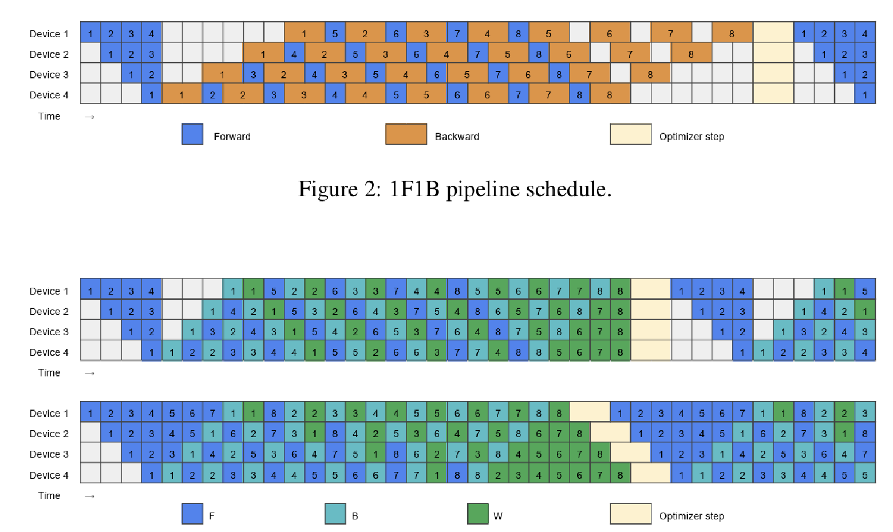
  <figcaption>Zero-bubble 调度：上方为标准 1F1B 调度；下方将可延后的权重梯度计算填入空闲区，以提高设备利用率。</figcaption>
</figure>

因此，调度器可以将权重梯度计算放入原本的气泡中，减少甚至消除设备空闲时间。代价是调度和依赖关系更复杂；实现时还要确保权重更新发生在同一训练 step 的所有微批次梯度都完成之后。

### 6.6. 专家并行（Expert Parallelism，EP）

混合专家模型（Mixture of Experts，MoE）将部分 MLP 替换为多个专家 FFN，并由 Gate 为每个 token 选择少数专家。具体的路由机制可参考[混合专家（MoE）](../mixture-of-experts/)；这里关注这些专家如何分布到多张 GPU。

张量并行切的是一个矩阵的宽度，每个 Rank 都参与同一个矩阵乘法；专家并行切的是**专家轴**：每个 Rank 保存一个或一组完整专家，而不是保存每个专家的一小块矩阵。也就是说，EP 不拆矩阵乘法，而是把激活值送到拥有目标专家的设备上。

#### 6.6.1. 两次 All-to-all：派发 token，再收回结果

设一个 MoE 层有 \(E\) 个专家。EP 的一次前向传播可概括为：

1. 每个 Rank 上的 Gate 为本地 token 选择专家，并按目标专家所在设备对 token 编码、分组；
2. 第一次 All-to-all（dispatch）将 token 激活值发送给对应专家所在的 Rank；
3. 每个 Rank 使用本地保存的完整专家 FFN 计算收到的 token；
4. 第二次 All-to-all（combine）将输出送回 token 的原始 Rank，再按 Gate 权重合并专家输出。

<figure>
  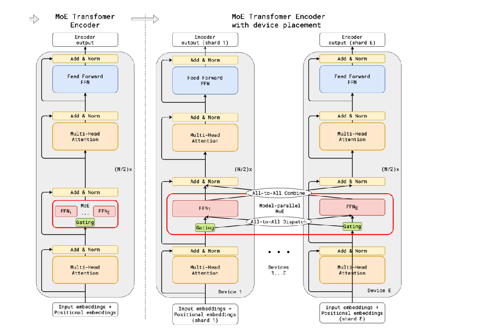
  <figcaption>专家并行：普通层仍按模型副本执行；MoE 层中，Gate 先通过 All-to-all 将 token 派发到专家，再通过 All-to-all 收回并合并结果。</figcaption>
</figure>

> **All-to-all 在这里如何体现“转置”？**
>
> 设 \(S_{i,j}\) 表示：当前在源 Rank \(i\) 上、但目标是专家 Rank \(j\) 的 token 块。分发前，Rank \(i\) 持有一整行 \([S_{i,0}, S_{i,1}, \ldots, S_{i,E-1}]\)，即它把本地 token 按目标专家分桶。
>
> | 源 Rank | 发给 Expert Rank 0 | 发给 Rank 1 | 发给 Rank 2 | 发给 Rank 3 |
> | --- | --- | --- | --- | --- |
> | Rank 0 | \(S_{0,0}\) | \(S_{0,1}\) | \(S_{0,2}\) | \(S_{0,3}\) |
> | Rank 1 | \(S_{1,0}\) | \(S_{1,1}\) | \(S_{1,2}\) | \(S_{1,3}\) |
> | Rank 2 | \(S_{2,0}\) | \(S_{2,1}\) | \(S_{2,2}\) | \(S_{2,3}\) |
> | Rank 3 | \(S_{3,0}\) | \(S_{3,1}\) | \(S_{3,2}\) | \(S_{3,3}\) |
>
> 第一次 All-to-all 后，Rank \(j\) 收到原来矩阵的第 \(j\) 列：\([S_{0,j}, S_{1,j}, \ldots, S_{E-1,j}]\)。换言之，接收块满足 \(\operatorname{recv}_{j,i}=S_{i,j}\)：源 Rank 与目标专家 Rank 两个索引交换了。这就是按 Rank 维度进行的分块转置。
>
> 例如，Rank 0 中选择 Expert 1 的 token 会从 \(S_{0,1}\) 移到 Rank 1；Rank 2 中同样选择 Expert 1 的 token \(S_{2,1}\) 也会到达 Rank 1，因而可以一起交给 Expert 1 计算。专家计算结束后，第二次 All-to-all 再执行一次反向的索引交换，将输出送回原始 Rank。
>
> 实际 token 数常常不均衡，因此它不是形状规则的字面 `tensor.T`，而是变长 token 块的“所有权转置”。

因此，EP 的核心通信是 token 激活值的多对多交换：
- 它不像 PP 那样只与相邻阶段通信；
- 也不像 TP 那样按固定顺序对所有 Rank 做逐层归约；
- 路由目的地由当前 Batch 的 Gate 决定。

这要求 **All-to-all 的带宽足够高**，也**要求路由尽量均衡**：若某个专家收到过多 token，拥有它的 Rank 会成为尾部等待的瓶颈。

#### 6.6.2. 为什么 MoE 的 MLP 往往优先使用 EP

对于 MoE 的专家 MLP，EP 在行为上与 TP 类似：都能分摊每卡的专家参数与激活值，并依赖高带宽互连。但 EP 通常更合适：

- **更大的本地 GEMM**：EP 保留完整专家矩阵，避免 TP 将单个专家的矩阵继续切小；更大的局部矩阵乘法通常有更高的 GPU 利用率。
- **更低的通信负担**：TP 在每个专家 MLP 的线性层边界仍需集合通信；EP 用两次 All-to-all 完成 token 的派发与回收，对 MoE 层通常更省通信。
- **更简单的计算图**：每个专家可在收到 token 后独立计算，较容易将通信与专家计算重叠。
- **减少本地重排**：当 \(\mathrm{EP}=E\) 时，每个 EP Rank 恰好持有一个专家，专家编号直接对应目标 Rank，可以避免“一个设备内有多个专家”带来的额外本地 token permutation（不改变 token 内容，只改变它们在张量中的排列顺序）。

#### 6.6.3. EP 与 DP 的组合

EP 不一定是在 DP 之外额外增加一维；在常见布局中，它是把原有的 DP group 再拆成“专家分片”和“专家副本”两层。固定 TP、PP 等其他维度时，通常有 \(\mathrm{DP}=\mathrm{EP}\times\mathrm{EDP}\)，其中专家数据并行（Expert Data Parallelism，EDP）表示同一专家分片的副本数。

也就是说，若 \(\mathrm{DP}=8\)、\(\mathrm{EP}=2\)，并不需要 \(8\times2=16\) 张 GPU；仍然是 8 张 GPU，只是 \(\mathrm{EDP}=4\)。

例如，假设有 4 个专家，且 \(\mathrm{TP}=\mathrm{PP}=1\)。8 张 GPU 可以按下表放置：

| EP group | Rank | 持有的专家分片 |
| --- | --- | --- |
| 0 | Rank 0 | Expert 0、1 |
| 0 | Rank 1 | Expert 2、3 |
| 1 | Rank 2 | Expert 0、1 |
| 1 | Rank 3 | Expert 2、3 |
| 2 | Rank 4 | Expert 0、1 |
| 2 | Rank 5 | Expert 2、3 |
| 3 | Rank 6 | Expert 0、1 |
| 3 | Rank 7 | Expert 2、3 |

这个布局要从两个方向看：

- **横向看 EP**：例如 `[Rank 0, Rank 1]` 共同持有一套完整专家，但两者保存的是不同分片。Rank 0 上的 token 若选择 Expert 2 或 3，会通过 All-to-all 发送给 Rank 1；同一 EP group 负责完成该 MoE 层的路由与计算。
- **纵向看 EDP**：例如 `[Rank 0, Rank 2, Rank 4, Rank 6]` 都持有 Expert 0、1，是同一专家分片的 4 个副本。它们处理不同数据分片，并在反向传播后同步这部分专家的梯度。

因此，稠密的注意力参数在 8 个 Rank 上都有副本，可以按普通 \(\mathrm{DP}=8\) 同步梯度；而 Expert 0、1 的参数只需在其 4 个副本间按 \(\mathrm{EDP}=4\) 同步。这里 \(\mathrm{EP}\leq\mathrm{DP}\) 的含义是：EP 是在既有 DP 维度中切出的一部分，不应再额外乘到总 GPU 数上。不同框架的 Rank 编排可以不同，但“横向分专家、纵向复制专家”的关系不变。

#### 6.6.4. EP 与 TP、PP 的组合

EP 还可以与 TP、PP 组合；不过不同层的进程组也不能简单地完全共用。

更棘手的是，MoE 通常只替换 MLP，而注意力层仍是稠密层：

- 注意力层不能使用 EP，较高的 TP 有助于分摊其矩阵乘法；
- 专家 MLP 更倾向于较低的 TP 与较高的 EP，以保留较大的本地 GEMM。

若所有层共用同一个 TP 大小，就必须在这两个需求之间妥协；DP 与 TP 的分组也可能让每个专家得到的 token 过少，降低矩阵乘法利用率。

<figure>
  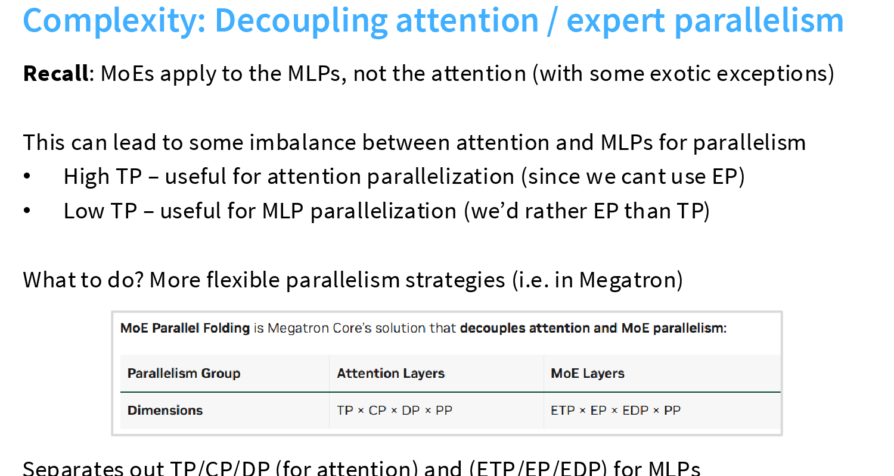
  <figcaption>MoE Parallel Folding：注意力层与 MoE 层采用不同的并行分解，以分别匹配两类计算的需求。</figcaption>
</figure>

Megatron 将这种解耦称为 MoE Parallel Folding：
- 注意力层可使用 \(\mathrm{TP}\times\mathrm{CP}\times\mathrm{DP}\times\mathrm{PP}\)，其中上下文并行（Context Parallelism，CP）沿序列维度切分；
- MoE 层则可使用 \(\mathrm{ETP}\times\mathrm{EP}\times\mathrm{EDP}\times\mathrm{PP}\)，其中专家张量并行（Expert Tensor Parallelism，ETP）只在单个专家仍需继续切分时使用。

两者共享 PP 的阶段边界，却在同一组设备上重组 TP、DP 与 EP 的进程组。

这种方式不是把模型拆成两套独立设备，而是让同一批 GPU 在进入注意力层或 MoE 层时使用不同通信组。它提高了各层的计算效率，但也增加了设备映射、token 路由与通信调度的实现复杂度。

### 6.7. 并行策略对比

<figure>
  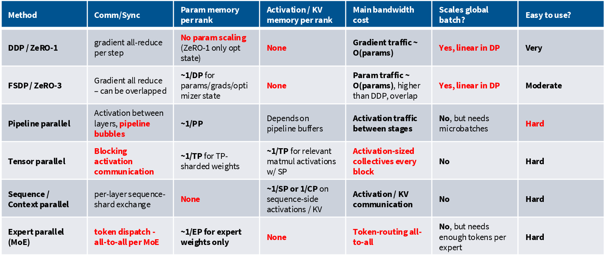
  <figcaption>Lecture 8 的并行策略总览表：DDP、FSDP、PP、TP、SP／CP 与 EP 的主要取舍。</figcaption>
</figure>

### 6.8. 并行配置经验

#### 6.8.1. Batch 与并行策略的匹配

**每卡 Batch 与并行策略的匹配关系**，不是单纯“Batch 越大越好”。我们用 \(B / N\)（全局 Batch 除以芯片数）衡量每张卡分到的工作量。

- \(B / N\) 太小：计算太少，无法摊薄通信；即使模型放得下，GPU 也会等待通信。
- 中等 \(B / N\)：混合 FSDP 与模型并行（Model Parallelism，MP）的通信效率更好。
- \(B / N\) 足够大：纯 FSDP 也能把通信开销摊薄。

因此，Batch 需要同时满足两类约束：
- 一是训练稳定性和显存限制；
- 二是在这个范围内，让每张卡的有效 Batch 足够大；
- 若微批次无法增大，可以使用梯度累积（Gradient Accumulation）提高有效 Batch。

#### 6.8.2. 配置顺序与经验

配置顺序是：

1. 模型未放入显存：
    - 先用足够小的模型并行（Model Parallelism，包括 PP，TP，EP，SP，CP）让模型放下；
    - 节点内增加 TP／EP，跨节点增加 PP，或视带宽使用 ZeRO-3 / FSDP。
2. 模型放入显存：其余 GPU 优先用于 DP，扩展全局 Batch 和吞吐。

| 场景 | 配置经验 |
| --- | --- |
| TP、EP 通信频繁 | 保持在一个 NVLink 域内，通常不超过单节点 8 张 GPU；跨节点优先增加 PP。 |
| PP 气泡明显 | PP ≥ 2 时可使用虚拟流水线并行（Virtual Pipeline Parallelism，VPP）降低气泡。 |
| MoE 专家层 | 优先 EP；本地 GEMM 更大，通信通常少于 TP。 |
| 序列长度约 ≥8K token | 启用 CP，并将 KV 通信与计算重叠。 |
| 激活值显存不足 | 使用激活重计算（Activation Recomputation），以额外计算换取更大 Batch。 |

---

## 参考文献

[1] Stanford CS336, "Lecture 7: Parallelism." [Online]. Available: https://cs336.stanford.edu/lectures/?trace=lecture_07.

[2] NVIDIA, "How to reason about collective operations." [Online]. Available: https://github.com/NVIDIA/nccl-tests/blob/master/doc/PERFORMANCE.md#allreduce.

[3] Stas Bekman, "Sample benchmarking code." [Online]. Available: https://github.com/stas00/ml-engineering/blob/master/network/benchmarks/all_reduce_bench.py.

[4] Stanford CS336, "Lecture 08." [Online]. Available: https://cs336.stanford.edu/lectures/?trace=lecture_08.

[5] V. Korthikanti et al., "Reducing Activation Recomputation in Large Transformer Models." Proceedings of Machine Learning and Systems, 2023. [Online]. Available: https://proceedings.mlsys.org/paper_files/paper/2023/file/80083951326cf5b35e5100260d64ed81-Paper-mlsys2023.pdf.
