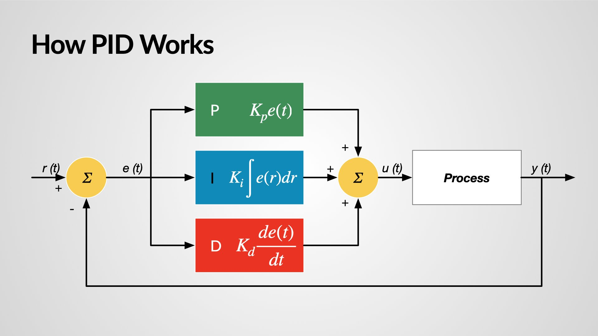
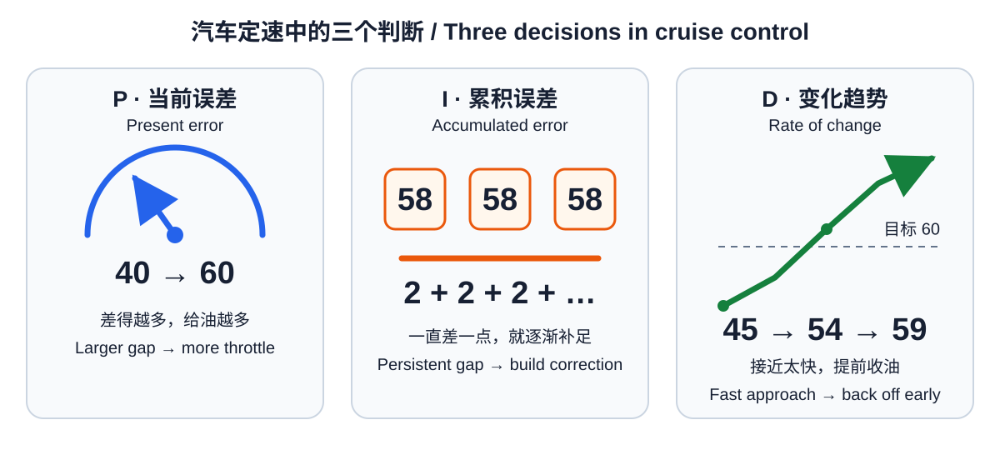
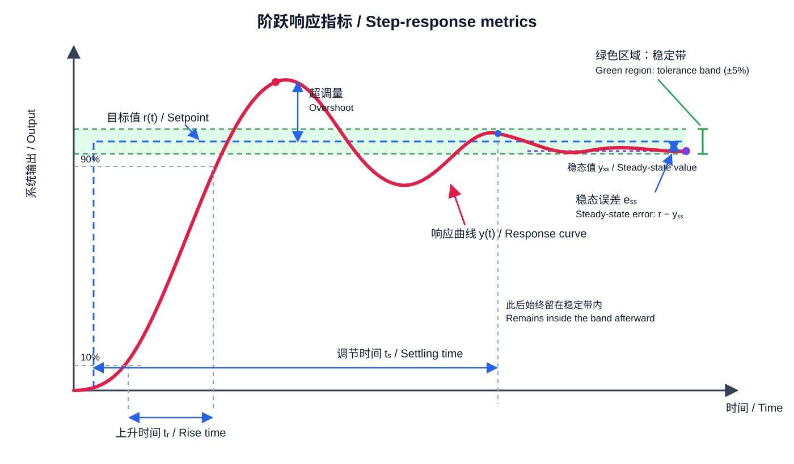

PID 可以理解为一种“边看结果、边纠正”的方法。本文用<strong>汽车定速</strong>贯穿三个控制项，再说明如何将 PID 写进程序。讲解方式参考 [MathWorks 的 PID 入门系列](https://www.mathworks.com/videos/series/understanding-pid-control.html)与[密歇根大学 PID 教程](https://ctms.engin.umich.edu/CTMS/index.php?example=Introduction&section=ControlPID)。

## 1. 闭环反馈：发现偏差，再修正下一步

汽车希望保持 \(60\,\mathrm{km/h}\)，实际只有 \(50\,\mathrm{km/h}\)，误差就是：

\[
e(t)=r(t)-y(t)=10\,\mathrm{km/h}.
\]

控制器根据误差计算油门 \(u(t)\)。汽车加速后，传感器再次测量车速，控制器再算一次。这个不断重复的过程就是<strong>闭环反馈（closed-loop feedback）</strong>。

<figure>
  
  <figcaption>误差 \(e(t)\) 同时进入 P、I、D 三条支路，三项相加形成控制量 \(u(t)\)，输出 \(y(t)\) 再反馈到输入端。</figcaption>
</figure>

如果汽车上坡或迎风，原来的油门不再够用，反馈仍能发现车速下降并继续补偿。这正是闭环相对于固定油门的优势。

## 2. 三个控制项：现在、过去与趋势

PID 控制律为：

\[
u(t)=K_pe(t)+K_i\int_0^t e(\tau)\,\mathrm d\tau+K_d\frac{\mathrm d e(t)}{\mathrm dt}.
\]

<figure>
  
  <figcaption>同一个定速任务中的三种判断：离目标多远、偏差持续多久、接近目标多快。</figcaption>
</figure>

### 2.1 比例项：离目标越远，踩得越深

\[
u_P(t)=K_pe(t).
\]

车速只有 \(40\,\mathrm{km/h}\) 时多给油，达到 \(58\,\mathrm{km/h}\) 时少给油。增大 \(K_p\) 会加快响应，但过大会冲过目标并产生振荡。

### 2.2 积分项：偏差持续存在，就继续加力

\[
u_I(t)=K_i\int_0^t e(\tau)\,\mathrm d\tau.
\]

汽车上坡后长期停在 \(58\,\mathrm{km/h}\)。虽然每一刻只差一点，但积分会把这段偏差累积起来，逐渐补足油门，消除<strong>稳态误差（steady-state error）</strong>。

如果油门已经踩到底，积分还在增加，就会形成<strong>积分饱和（integral windup）</strong>。坡道结束后，过大的积分仍会推着汽车继续加速，因此程序必须限制输出并加入反积分饱和。

### 2.3 微分项：接近得太快，就提前收力

\[
u_D(t)=K_d\frac{\mathrm d e(t)}{\mathrm dt}.
\]

车速虽然还没到 \(60\,\mathrm{km/h}\)，但已经快速上升，微分项会提前减小油门，作用类似阻尼。\(K_d\) 太大时，传感器的一点抖动也会让控制量剧烈变化，所以微分通常需要滤波。

> 一句话记忆：\(P\) 看现在，\(I\) 记过去，\(D\) 看趋势。

## 3. 手动调参：先 P，再 D，最后 I

调参时观察四个现象：上升快不快、有没有超调、多久稳定、最后还差多少。

<figure>
  
  <figcaption>一次目标突变后的典型响应。调参是在速度、超调与最终误差之间折中。</figcaption>
</figure>

推荐顺序如下：

1. 令 \(K_i=K_d=0\)，先确认正控制量确实会减小误差；
2. 从很小的 \(K_p\) 开始增加，直到响应够快但还没有持续振荡；
3. 增加 \(K_d\)，压低超调和来回摆动；
4. 最后缓慢增加 \(K_i\)，只消除剩余的长期偏差；
5. 更换目标、加入扰动，再检查一次。

| 观察到的现象 | 优先调整 |
| --- | --- |
| 反应很慢 | 增大 \(K_p\) |
| 超调、来回振荡 | 减小 \(K_p\) 或 \(K_i\)，适当增大 \(K_d\) |
| 最后总差一点 | 小幅增大 \(K_i\) |
| 输出高频抖动 | 减小 \(K_d\)，加强微分滤波 |
| 饱和后很久才恢复 | 加入反积分饱和 |

并非每个系统都需要完整 PID。没有长期偏差时可以只用 PD；微分信号太嘈杂时，PI 往往更合适。

## 4. 离散实现：控制循环每次做什么

设采样周期为 \(T_s\)。为了与后面的程序一致，把 \(P_k\)、\(I_k\)、\(D_k\) 直接定义为三项各自对控制量的贡献：

\[
e_k=r_k-y_k,
\]

\[
P_k=K_pe_k,
\]

\[
I_k=I_{k-1}+K_ie_kT_s,
\]

\[
D_k=-K_d\frac{y_k-y_{k-1}}{T_s},
\]

\[
u_k=P_k+I_k+D_k.
\]

微分项对测量值 \(y\) 求差分。目标不变时有 \(\dot e=-\dot y\)，因此式中的负号是必要的；这种写法还可以避免目标突然改变时产生微分冲击。

程序的每轮循环只有五步：<strong>读取测量值 → 计算误差 → 更新 P/I/D → 限制输出 → 发送给执行器</strong>。

<details>
<summary>展开一份带微分滤波和反积分饱和的 Python 实现</summary>

```python
class PID:
    def __init__(self, kp, ki, kd, dt, limits,
                 derivative_filter_time=0.02,
                 anti_windup_gain=1.0):
        self.kp, self.ki, self.kd = kp, ki, kd
        self.dt = dt
        self.u_min, self.u_max = limits
        self.tau_d = derivative_filter_time
        self.kaw = anti_windup_gain
        self.integral = 0.0
        self.d_state = 0.0
        self.previous_measurement = None

    def update(self, setpoint, measurement, feedforward=0.0):
        error = setpoint - measurement
        p = self.kp * error

        # 对测量值求微分，避免目标突变造成微分冲击。
        if self.previous_measurement is None:
            d_raw = 0.0
        else:
            d_raw = -(measurement - self.previous_measurement) / self.dt

        alpha = self.tau_d / (self.tau_d + self.dt)
        self.d_state = alpha * self.d_state + (1 - alpha) * d_raw
        d = self.kd * self.d_state

        u_raw = feedforward + p + self.integral + d
        u = min(max(u_raw, self.u_min), self.u_max)

        # 限幅前后的差值把积分项拉回可用范围。
        self.integral += (
            self.ki * error + self.kaw * (u - u_raw)
        ) * self.dt

        self.previous_measurement = measurement
        return u
```

这份实现还做了三件理想公式没有体现的事：限制执行器输出、对微分进行低通滤波、在输出饱和时抑制积分继续增大。

</details>

## 5. 使用前检查：四件最容易出错的事

1. <strong>符号：</strong>正控制量是否真的让误差变小？符号错误会把负反馈变成正反馈。
2. <strong>采样周期：</strong>代码中的 \(T_s\) 是否等于真实循环周期？
3. <strong>物理限制：</strong>是否限制了输出和积分项？
4. <strong>数据记录：</strong>是否记录目标、测量值、误差以及 P/I/D 三项？没有曲线就很难判断该调谁。

PID 的核心并不复杂：先用 \(P\) 让系统愿意回到目标，用 \(D\) 让它别冲得太猛，再用少量 \(I\) 消除最后那一点长期偏差。
