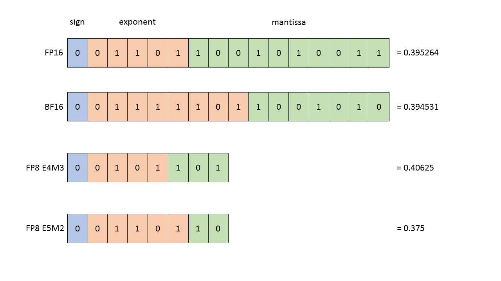
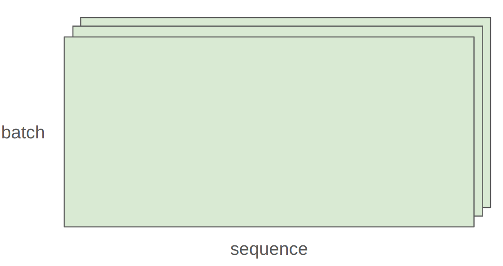
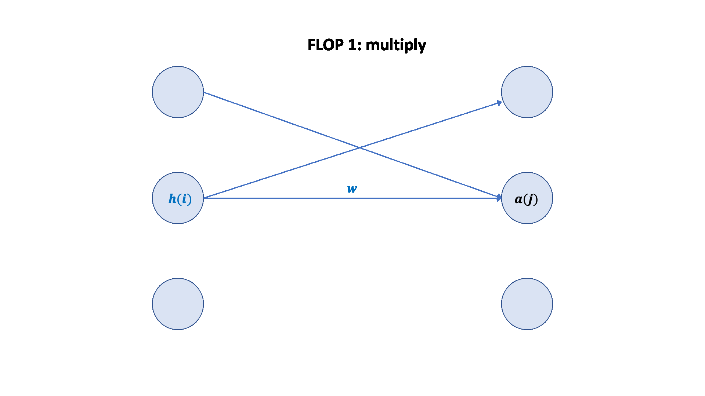

## Key resources in deep learning

- **Memory** (GB): stores parameters, gradients, optimizer states, activations, etc.
- **Compute** (FLOPs): number of floating-point operations required for training.

---

## 1. Tensor basics and memory management

### 1.1. Creating and storing tensors

- A tensor is the basic unit for storing parameters, gradients, optimizer states, data, and activations.
- PyTorch supports many ways to create tensors (e.g., `torch.zeros`, `torch.ones`, `torch.randn`).
    ```python
    x = torch.tensor([[1., 2, 3], [4, 5, 6]])  # @inspect x
    x = torch.zeros(4, 8)  # 4x8 matrix of all zeros @inspect x
    x = torch.ones(4, 8)  # 4x8 matrix of all ones @inspect x
    x = torch.randn(4, 8)  # 4x8 matrix of iid Normal(0, 1) samples @inspect x
    ```
  You can also allocate memory first and then initialize values.
    ```python
    x = torch.empty(4, 8)  # 4x8 matrix of uninitialized values @inspect x
    nn.init.trunc_normal_(x, mean=0, std=1, a=-2, b=2)  # @inspect x
    ```
- Tensor memory usage is determined by **the number of elements** and **the dtype**.

---

### 1.2. Common dtypes

Parameters, gradients, activations, and optimizer states are almost always stored as floating-point values.

#### 1.2.1 float32 (single precision)

Default dtype, 4 bytes, wide dynamic range.

<p align="center">
  
</p>

Memory is determined by (i) the number of values and (ii) the dtype.

```python
x = torch.zeros(4, 8)  # @inspect x
assert x.dtype == torch.float32  # Default type
assert x.numel() == 4 * 8
assert x.element_size() == 4  # Float is 4 bytes
assert get_memory_usage(x) == 4 * 8 * 4  # 128 bytes
```

#### 1.2.2 float16 (half precision)

2 bytes. Saves memory but has a smaller dynamic range and is more prone to underflow.

<p align="center">
  
</p>

```python
x = torch.zeros(4, 8, dtype=torch.float16)  # @inspect x
assert x.element_size() == 2 # Float is 2 bytes
```

Smaller dynamic range (easy to underflow):

```python
x = torch.tensor([1e-8], dtype=torch.float16)  # @inspect x
assert x == 0  # Underflow!
```

#### 1.2.3 bfloat16

2 bytes. Same dynamic range as float32, slightly lower precision.

<p align="center">
  
</p>

Less likely to underflow:

```python
x = torch.tensor([1e-8], dtype=torch.bfloat16)  # @inspect x
assert x != 0  # No underflow!
```

Compare dynamic range and memory usage across dtypes:

```python
float32_info = torch.finfo(torch.float32)  # @inspect float32_info
float16_info = torch.finfo(torch.float16)  # @inspect float16_info
bfloat16_info = torch.finfo(torch.bfloat16)  # @inspect bfloat16_info
```

**Output**:

```python
float32 info="finfo(resolution=1e-06,min=-3.40282e+38,max=3.40282e+38, eps=1.19209e-07,smallest normal=1.17549e-38,tiny=1.17549e-38dtype=float32)"
float1l6 info="finfo(resolution=0.001,min=-65504,max=65504, eps=0.000976562,sma1lest norma1=6.10352e-05,tiny=6.10352e-05,dtype=float16)"
bfloat16 info="finfo(resolution=0.01, min=-3.38953e+38,max=3.38953e+38, eps=0.0078125,smallest normal=1.17549e38, tiny=1.17549e-38,dtype=bfloat16)"
```

#### 1.2.4 fp8

[FP8 primer (NVIDIA docs)](https://docs.nvidia.com/deeplearning/transformer-engine/user-guide/examples/fp8_primer.html)

1 byte. Extreme compression, designed for newer hardware (e.g., H100).

<p align="center">
  
</p>

H100 supports two FP8 formats: E4M3 (range [-448, 448]) and E5M2 ([-57344, 57344]).

#### 1.2.5 Mixed-precision training

<input disabled="" type="checkbox"> TODO: expand mixed-precision training notes

Using different dtypes comes with trade-offs:

- Higher precision: **more accurate and stable**, but needs **more memory** and **more compute**.
- Lower precision: **less accurate/stable**, but reduces **memory** and **compute** requirements.

A common mixed-precision recipe:

- Use bfloat16/fp8 for forward activations.
- Keep parameters and gradients in float32.

[Mixed-precision training paper](https://arxiv.org/pdf/1710.03740)/[PyTorch AMP docs](https://pytorch.org/docs/stable/amp.html)/[NVIDIA mixed-precision training docs](https://docs.nvidia.com/deeplearning/performance/mixed-precision-training/)

---

## 2. Compute resources

### 2.1. Tensor operations

#### 2.1.1. Storage and views

- A tensor is a **memory pointer** + **metadata** (describing how to index into storage, e.g., strides).

<p align="center">
  
</p>

[PyTorch stride definition](https://docs.pytorch.org/docs/stable/generated/torch.Tensor.stride.html)

For a tensor:

```python
x = torch.tensor([
    [0., 1, 2, 3],
    [4, 5, 6, 7],
    [8, 9, 10, 11],
    [12, 13, 14, 15],
])
```

To move to the next row (dim 0), you skip 4 elements in storage:

```python
assert x.stride(0) == 4
```

To move to the next column (dim 1), you skip 1 element in storage:

```python
assert x.stride(1) == 1
```

Indexing into storage using strides:

```python
r, c = 1, 2
index = r * x.stride(0) + c * x.stride(1)  # @inspect index
assert index == 6
```

---

#### 2.1.2. Tensor slicing

Many tensor operations return a different **view** of the same underlying storage (no copy), so modifying one view can affect another.

```python
x = torch.tensor([[1., 2, 3], [4, 5, 6]])  # @inspect x
```

**Operation 1**: get row 0

```python
def same_storage(x: torch.Tensor, y: torch.Tensor):
    return x.untyped_storage().data_ptr() == y.untyped_storage().data_ptr()

y = x[0]  # @inspect y
assert torch.equal(y, torch.tensor([1., 2, 3]))
assert same_storage(x, y)
```

**Operation 2**: get column 1

```python 
y = x[:, 1]  # @inspect y
assert torch.equal(y, torch.tensor([2, 5]))
assert same_storage(x, y)
```

**Operation 3**: reshape a 2×3 matrix into a 3×2 matrix (view)

```python
y = x.view(3, 2)  # @inspect y
assert torch.equal(y, torch.tensor([[1, 2], [3, 4], [5, 6]]))
assert same_storage(x, y)
```

**Operation 4**: transpose the matrix

```python
y = x.transpose(1, 0)  # @inspect y
assert torch.equal(y, torch.tensor([[1, 4], [2, 5], [3, 6]]))
assert same_storage(x, y)
```

**Operation 5**: modifying `x` also modifies `y`

```python 
x[0][0] = 100  # @inspect x, @inspect y
assert y[0][0] == 100
```

**Operation 6**: storage contiguity (`contiguous`)

Some transforms (e.g., `transpose`, some `view` patterns) make a tensor non-contiguous in memory. A non-contiguous tensor often cannot be reshaped with `view` without copying.

```python
x = torch.tensor([[1., 2, 3], [4, 5, 6]])  # @inspect x
y = x.transpose(1, 0)  # @inspect y
assert not y.is_contiguous()
try:
    y.view(2, 3)
    assert False
except RuntimeError as e:
    assert "view size is not compatible with input tensor's size and stride" in str(e)
```

You can force a tensor to be contiguous, but this allocates new storage.

```python
y = x.transpose(1, 0).contiguous().view(2, 3)  # @inspect y
assert not same_storage(x, y)
```

---

#### 2.1.3. Tensor elementwise operations (elementwise)

These operations apply a function to each element and return a tensor of the same shape.

```python
x = torch.tensor([1, 4, 9])
assert torch.equal(x.pow(2), torch.tensor([1, 16, 81]))
assert torch.equal(x.sqrt(), torch.tensor([1, 2, 3]))
assert torch.equal(x.rsqrt(), torch.tensor([1, 1 / 2, 1 / 3]))  # i -> 1/sqrt(x_i)

assert torch.equal(x + x, torch.tensor([2, 8, 18]))
assert torch.equal(x * 2, torch.tensor([2, 8, 18]))
assert torch.equal(x / 0.5, torch.tensor([2, 8, 18]))
```

`triu` constructs the upper-triangular part of a matrix, which is useful for building causal attention masks.

```python
x = torch.ones(3, 3).triu()  # @inspect x
assert torch.equal(x, torch.tensor([
    [1, 1, 1],
    [0, 1, 1],
    [0, 0, 1]],
))
```

---

#### 2.1.4. Tensor multiplication

```python
x = torch.ones(16, 32)
w = torch.ones(32, 2)
y = x @ w
assert y.size() == torch.Size([16, 2])
```

In practice, we apply this multiplication per example in the batch and per token position in the sequence.

<p align="center">
  
</p>

```python
x = torch.ones(4, 8, 16, 32) ## [batch, sequence, H, W]
w = torch.ones(32, 2)
y = x @ w
assert y.size() == torch.Size([4, 8, 16, 2])
```

---

### 2.2. Tensor `einops`

#### 2.2.1. Why use `einops`

```python
x = torch.ones(2, 2, 3)  # batch, sequence, hidden  @inspect x
y = torch.ones(2, 2, 3)  # batch, sequence, hidden  @inspect y
z = x @ y.transpose(-2, -1)  # batch, sequence, sequence  @inspect z
```

> What do dimensions `-2` and `-1` mean?

Tensor dimensions are easy to mix up.

`einops` is a Python library for naming tensor dimensions and transforming tensors with readable patterns.

[einops docs](https://einops.rocks/1-einops-basics/)

---

#### 2.2.2. Naming dimensions with `jaxtyping`

How to define tensor dimensions.

**Old approach**

```python
x = torch.ones(2, 2, 1, 3)  # batch seq heads hidden  @inspect x
```

**New approach (`jaxtyping`)**

```python
x: Float[torch.Tensor, "batch seq heads hidden"] = torch.ones(2, 2, 1, 3)  # @inspect x
```

---

#### 2.2.3. `einops` operations

##### Operation 1: `einsum`

`einsum` is a general-purpose tensor contraction API with a compact, documented notation.

**Define two tensors**

```python
x: Float[torch.Tensor, "batch seq1 hidden"] = torch.ones(2, 3, 4)  # @inspect x
y: Float[torch.Tensor, "batch seq2 hidden"] = torch.ones(2, 3, 4)  # @inspect y
```

**Old approach**

```python
z = x @ y.transpose(-2, -1)  # batch, sequence, sequence  @inspect z
```

**New approach (`einops.einsum`)**

```python
z = einsum(x, y, "batch seq1 hidden, batch seq2 hidden -> batch seq1 seq2")  # @inspect z
z = einsum(x, y, "... seq1 hidden, ... seq2 hidden -> ... seq1 seq2")  # @inspect z
```

Any dimensions that do not appear in the output pattern are reduced (summed over).

##### Operation 2: `reduce`

You can reduce a tensor along one or more axes, e.g. `sum`, `mean`, `max`, `min`.

**Define a tensor**

```python
x: Float[torch.Tensor, "batch seq hidden"] = torch.ones(2, 3, 4)  # @inspect x
```

**Old approach**

```python
y = x.mean(dim=-1)  # @inspect y
```

**New approach (`einops.reduce`)**

```python
y = reduce(x, "... hidden -> ...", "sum")  # @inspect y
```

##### Operation 3: `rearrange`

Sometimes a single axis is a flattened representation of multiple logical axes, and you want to operate on just one of them.

**Define a tensor**

```python
x: Float[torch.Tensor, "batch seq total_hidden"] = torch.ones(2, 3, 8)  # @inspect x
```

Here `total_hidden` is the flattened representation of `heads * hidden1`.

```python
w: Float[torch.Tensor, "hidden1 hidden2"] = torch.ones(4, 4)
```

Split `total_hidden` into `heads` and `hidden1`:

```python
x = rearrange(x, "... (heads hidden1) -> ... heads hidden1", heads=2)  # @inspect x
```

Merge `heads` and `hidden2` back into a single axis:

```python
x = rearrange(x, "... heads hidden2 -> ... (heads hidden2)")  # @inspect x
```

---

### 2.3. Tensor operation FLOPs

A floating-point operation (FLOP) is a basic arithmetic op such as addition ($x + y$) or multiplication ($x \cdot y$).


Two extremely confusing abbreviations (they sound the same!):

- FLOPs: the number of floating-point operations (a measure of compute)
- FLOP/s: floating-point operations per second (also written as FLOPS), a measure of hardware throughput


> Training [GPT-3 (2020)](https://lambda.ai/blog/demystifying-gpt-3) requires 3.14e23 FLOPs
> 
> Training [GPT-4 (2023)](https://patmcguinness.substack.com/p/gpt-4-details-revealed) requires about 2e25 FLOPs
>
> [A100](https://www.nvidia.com/content/dam/en-zz/Solutions/Data-Center/a100/pdf/nvidia-a100-datasheet-us-nvidia-1758950-r4-web.pdf) peak throughput: 312 teraFLOP/s for torch.bfloat16 or torch.float16; 19.5 teraFLOP/s for torch.float32
>
> [H100](https://resources.nvidia.com/en-us-tensor-core/nvidia-tensor-core-gpu-datasheet) peak throughput: 1979 teraFLOP/s for torch.bfloat16 or torch.float16 (often ~50% lower in practice); 67.5 teraFLOP/s for torch.float32
>
> With 8× H100 GPUs, two weeks gives:
>
> ```python
> total_flops = 8 * (60 * 60 * 24 * 7) * h100_flop_per_sec  # @inspect total_flops
> ```
>
> Output:
> ```text
> total_flops = 4.788e+21
> ```

---

#### 2.3.1. FLOPs calculation

- **Linear layer / matrix multiply**: for a $B \times D$ matrix times a $D \times K$ matrix, the FLOPs are:

  ```python
  x = torch.ones(B, D, device=device)
  w = torch.randn(D, K, device=device)
  y = x @ w

  actual_num_flops = 2 * B * D * K  # @inspect actual_num_flops
  ```

  For each triple $(i, j, k)$, you do one multiply $(x[i][j] * w[j][k])$ and one add, which is why the factor is 2.

- **Elementwise ops**: an $m \times n$ tensor costs $O(mn)$ FLOPs.

- **Addition**: adding two $m \times n$ tensors costs $mn$ FLOPs.

In practice, matrix multiplication dominates FLOPs in deep learning. A good first-order estimate is to count the matmul-like operations.

---

#### 2.3.2. Model FLOPs utilization (MFU)

**Definition**: (actual FLOP/s) / (promised FLOP/s), ignoring communication overhead.

> In practice, MFU $\ge 0.5$ is already great (and can be higher when matmuls dominate).

---

#### 2.3.3. Summary

- Matrix multiplication dominates: $(2 \times m \times n \times p)$ FLOPs.
    
- FLOP/s depends on hardware (H100 >> A100) and dtype (bfloat16 >> float32).
    
- MFU: (actual FLOP/s) / (promised FLOP/s).

---

### 2.4. Gradients and backpropagation

#### 2.4.1. Gradient basics

Assume we have a simple linear model:

$$
y = 0.5 \cdot (x \times w - 5)^2
$$

**Forward pass**: compute the loss

```python
x = torch.tensor([1., 2, 3])
w = torch.tensor([1., 1, 1], requires_grad=True)  # Want gradient
pred_y = x @ w
loss = 0.5 * (pred_y - 5).pow(2)
```

**Backward pass**: compute gradients

```python
loss.backward()
assert loss.grad is None
assert pred_y.grad is None
assert x.grad is None
assert torch.equal(w.grad, torch.tensor([1, 2, 3]))
```

---

#### 2.4.2. Gradient FLOPs

To reason about gradient FLOPs, consider a simple two-layer linear example:

```python
x = torch.ones(B, D, device=device)
w1 = torch.randn(D, D, device=device, requires_grad=True)
w2 = torch.randn(D, K, device=device, requires_grad=True)
h1 = x @ w1
h2 = h1 @ w2
loss = h2.pow(2).mean()
```

> Recall the forward-pass FLOPs:
> - Multiply x[i][j] * w1[j][k]
> - Add to h1[i][k]
> - Multiply h1[i][j] * w2[j][k]
> - Add to h2[i][k]
>
> ```python
> num_forward_flops = (2 * B * D * D) + (2 * B * D * K)  # @inspect num_forward_flops
> ```

Backprop path: loss --> h2 --> w2 --> h1 --> w1 --> x

For parameter $w2$, the chain rule gives:

$$
\text{w2.grad} = \frac{\partial loss}{\partial w2} = \frac{\partial loss}{\partial h2} \cdot \frac{\partial h2}{\partial w2}
$$
$$
w2.grad[j,k] = \frac{\partial loss}{\partial w2[j, k]} = \sum_{i=0}^{N-1} \frac{\partial loss}{\partial h2[i, k]} \cdot \frac{\partial h2[i, k]}{\partial w2[j, k]} = \sum_{i=0}^{N-1} h2.grad[i,k] \cdot h1[i,j]
$$

For each triple $(i, j, k)$, you do one multiply and one add, so:

```python
num_backward_flops += 2 * B * D * K  # @inspect num_backward_flops
```

There are four gradient computations in this toy graph, so the total backward FLOPs are:

```python
num_backward_flops = (2 + 2) * B * D * K + (2 + 2) * B * D * D  # @inspect num_backward_flops
```

<p align="center">
  
</p>


- Forward pass: 2 × (# data points) × (# parameters) FLOPs
- Backward pass: 4 × (# data points) × (# parameters) FLOPs
- Total: 6 × (# data points) × (# parameters) FLOPs


---

## 3. Models

### 3.1. Model parameters

Model parameters are stored as `nn.Parameter` objects in PyTorch.

```python
input_dim = 16384
output_dim = 32

w = nn.Parameter(torch.randn(input_dim, output_dim))
assert isinstance(w, torch.Tensor)  # Behaves like a tensor
assert type(w.data) == torch.Tensor  # Access the underlying tensor
```

#### 3.1.1. Parameter initialization

Assume we randomly initialize the weight matrix `w` and multiply it with `x`.

```python
x = nn.Parameter(torch.randn(input_dim))
output = x @ w  # @inspect output
assert output.size() == torch.Size([output_dim])
```

Output:

```text
output = [
  18.919979095458984,
  ...
]
```

Since $output[k] = x \times w[:, k]$, the magnitude of each output element grows with `input_dim`.

If `input_dim` is too large, gradients can blow up, making training unstable.

We want the initialization scale to be roughly independent of `input_dim`, so we scale by $1/\sqrt{\text{input\_dim}}$.

```python
w = nn.Parameter(torch.randn(input_dim, output_dim) / np.sqrt(input_dim))
output = x @ w  # @inspect output
```

Output:

```text
output = [
  -1.5302726030349731,
  ...
]
```

This is essentially [Xavier initialization](https://proceedings.mlr.press/v9/glorot10a/glorot10a.pdf).

For extra safety, we truncate the normal distribution to [-3, 3] to avoid extreme outliers.

```python
w = nn.Parameter(nn.init.trunc_normal_(torch.empty(input_dim, output_dim), std=1 / np.sqrt(input_dim), a=-3, b=3))
```

---

#### 3.1.2. Building a model

Using a simple linear model as an example:

```python
class Linear(nn.Module):
  """Simple linear layer."""
  def __init__(self, input_dim: int, output_dim: int):
      super().__init__()
      self.weight = nn.Parameter(torch.randn(input_dim, output_dim) / np.sqrt(input_dim))
  def forward(self, x: torch.Tensor) -> torch.Tensor:
      return x @ self.weight

class Cruncher(nn.Module):
  def __init__(self, dim: int, num_layers: int):
      super().__init__()
      self.layers = nn.ModuleList([
          Linear(dim, dim)
          for i in range(num_layers)
      ])
      self.final = Linear(dim, 1)
  def forward(self, x: torch.Tensor) -> torch.Tensor:
      # Apply linear layers
      B, D = x.size()
      for layer in self.layers:
          x = layer(x)
      # Apply final head
      x = self.final(x)
      assert x.size() == torch.Size([B, 1])
      # Remove the last dimension
      x = x.squeeze(-1)
      assert x.size() == torch.Size([B])
      return x

B = 8  # Batch size
x = torch.randn(B, D, device=device)
y = model(x)
assert y.size() == torch.Size([B])
```

Model parameters:

```python
param_sizes = [
    (name, param.numel())
    for name, param in model.state_dict().items()
]
assert param_sizes == [
    ("layers.0.weight", D * D),
    ("layers.1.weight", D * D),
    ("final.weight", D),
]
num_parameters = get_num_parameters(model)
assert num_parameters == (D * D) + (D * D) + D
```

---

### 3.2. Model training

#### 3.2.1. Randomness

- Randomness appears in many places: parameter init, dropout, data shuffling, etc.
- For reproducibility, set seeds explicitly whenever you rely on randomness.
- Determinism is especially useful for debugging, because it makes issues easier to reproduce.
- In practice you should set seeds in three places (PyTorch, NumPy, Python's `random`).

```python
# Torch
seed = 0
torch.manual_seed(seed)
# NumPy
import numpy as np
np.random.seed(seed)
# Python
import random
random.seed(seed)
```

---

#### 3.2.2. Data loading

In language models, data can be represented as sequences of integers (tokens).

You can serialize sequences with a NumPy array:

```python
orig_data = np.array([1, 2, 3, 4, 5, 6, 7, 8, 9, 10], dtype=np.int32)
orig_data.tofile("data.npy")
```

You can load the data with NumPy.

If you don't want to load the entire dataset into memory (some datasets are huge; e.g., LLaMA can be ~2.8TB), you can use `memmap` to map only the accessed parts.

```python
data = np.memmap("data.npy", dtype=np.int32)
assert np.array_equal(data, orig_data)
```

A dataloader generates a batch of training data:

```python
def get_batch(data: np.array, batch_size: int, sequence_length: int, device: str) -> torch.Tensor:
  # Sample batch_size random positions into data.
  start_indices = torch.randint(len(data) - sequence_length, (batch_size,))
  assert start_indices.size() == torch.Size([batch_size])

  # Index into the data.
  x = torch.tensor([data[start:start + sequence_length] for start in start_indices])
  assert x.size() == torch.Size([batch_size, sequence_length])

  # Pinned memory
  if torch.cuda.is_available():
    x = x.pin_memory()

  x = x.to(device, non_blocking=True)

  return x

B = 2  # Batch size
L = 4  # Length of sequence
x = get_batch(data, batch_size=B, sequence_length=L, device=get_device())
assert x.size() == torch.Size([B, L])
```

By default, CPU tensors live in paged memory. You can explicitly pin them via `x = x.pin_memory()`.

This allows two tasks to overlap:

- Fetch the next batch on the CPU
- Process the current `x` on the GPU

---

#### 3.2.3. Optimizer

We'll use the familiar linear example again.

```python
B = 2
D = 4
num_layers = 2
model = Cruncher(dim=D, num_layers=num_layers).to(get_device())
```

**Define** an AdaGrad optimizer

- momentum = SGD + exponential averaging of grad
- AdaGrad = SGD + averaging by grad^2 
- RMSProp = AdaGrad + exponentially averaging of grad^2   
- Adam = RMSProp + momentum

[AdaGrad](https://www.jmlr.org/papers/volume12/duchi11a/duchi11a.pdf)

```python
class AdaGrad(torch.optim.Optimizer):
    def __init__(self, params: Iterable[nn.Parameter], lr: float = 0.01):
        super(AdaGrad, self).__init__(params, dict(lr=lr))

    def step(self):
        for group in self.param_groups:
            lr = group["lr"]
            for p in group["params"]:
                # Optimizer state
                state = self.state[p]
                grad = p.grad.data

                # Get squared gradients g2 = sum_{i<t} g_i^2
                g2 = state.get("g2", torch.zeros_like(grad))

                # Update optimizer state
                g2 += torch.square(grad)
                state["g2"] = g2

                # Update parameters
                p.data -= lr * grad / torch.sqrt(g2 + 1e-5)

optimizer = AdaGrad(model.parameters(), lr=0.01)
state = model.state_dict()  # @inspect state
```

Compute gradients

```python
x = torch.randn(B, D, device=get_device())
y = torch.tensor([4., 5.], device=get_device())
pred_y = model(x)
loss = F.mse_loss(input=pred_y, target=y)
loss.backward()
```

Run one optimizer step

```python
optimizer.step()
state = model.state_dict()  # @inspect state
```

Free memory (optional)

```python
optimizer.zero_grad(set_to_none=True)
```

##### Memory accounting

- Memory for parameters

  ```python
  def get_num_parameters(model: nn.Module) -> int:
    return sum(param.numel() for param in model.parameters())

  num_parameters = (D * D * num_layers) + D  # @inspect num_parameters
  assert num_parameters == get_num_parameters(model)
  ```

  Output

  ```python
  num_parameters = 36
  ```

- Memory for activations

  ```python
  num_activations = B * D * num_layers  # @inspect num_activations
  ```

  Output

  ```python
  num_parameters = 16
  ```

- Memory for gradients

  ```python
  num_gradients = num_parameters  # @inspect num_gradients
  ```

  Output

  ```python
  num_parameters = 36
  ```

- Memory for optimizer state

  ```python
  num_optimizer_states = num_parameters  # @inspect num_optimizer_states
  ```

  Output

  ```python
  num_parameters = 36
  ```

- Total memory (assuming float32 storage, 4 bytes)

  ```python
  total_memory = 4 * (num_parameters + num_activations + num_gradients + num_optimizer_states)  # @inspect total_memory
  ```

  Output

  ```python
  num_parameters = 496
  ```

---

#### 3.2.4. Training loop

```python
def train(name: str, get_batch,
          D: int, num_layers: int,
          B: int, num_train_steps: int, lr: float):
    model = Cruncher(dim=D, num_layers=0).to(get_device())
    optimizer = SGD(model.parameters(), lr=0.01)
    for t in range(num_train_steps):
        # Get data
        x, y = get_batch(B=B)
        # Forward (compute loss)
        pred_y = model(x)
        loss = F.mse_loss(pred_y, y)
        # Backward (compute gradients)
        loss.backward()
        # Update parameters
        optimizer.step()
        optimizer.zero_grad(set_to_none=True)

train("simple", get_batch, D=D, num_layers=0, B=4, num_train_steps=10, lr=0.01)
```

---

#### 3.2.5. Checkpointing

During training, periodically saving the model and optimizer state to disk is very useful.

```python
checkpoint = {
    "model": model.state_dict(),
    "optimizer": optimizer.state_dict(),
}
torch.save(checkpoint, "model_checkpoint.pt")
```

Load a checkpoint

```python
loaded_checkpoint = torch.load("model_checkpoint.pt")
```

#### 3.2.6. Mixed-precision training

- Choosing the dtype (float32, bfloat16, fp8) involves trade-offs:
  - Higher precision: more accurate/stable, more memory, more compute
  - Lower precision: less accurate/stable, less memory, less compute
- How do we get the best of both?
  - Typical approach: default to float32, but use {bfloat16, fp8} where possible
  - A common plan:
    1. Use {bfloat16, fp8} in the forward pass (activations)
    2. Keep the rest in float32 (parameters, gradients)
  - [Mixed-precision training](https://arxiv.org/pdf/1710.03740.pdf)
  - [PyTorch automatic mixed precision (AMP)](https://pytorch.org/docs/stable/amp.html)
  - NVIDIA's [Transformer Engine](https://docs.nvidia.com/deeplearning/performance/mixed-precision-training/) supports FP8 for linear layers and is widely used in training; see [FP8](https://arxiv.org/pdf/2310.18313)

---

<div class="zhihu-ref">
  <div class="zhihu-ref-title">References</div>
  <ol>
    <li><a href="https://stanford-cs336.github.io/spring2025-lectures/?trace=var%2Ftraces%2Flecture_02.json" target="_blank">stanford-cs336 lecture 2</a></li>
  </ol>
</div>