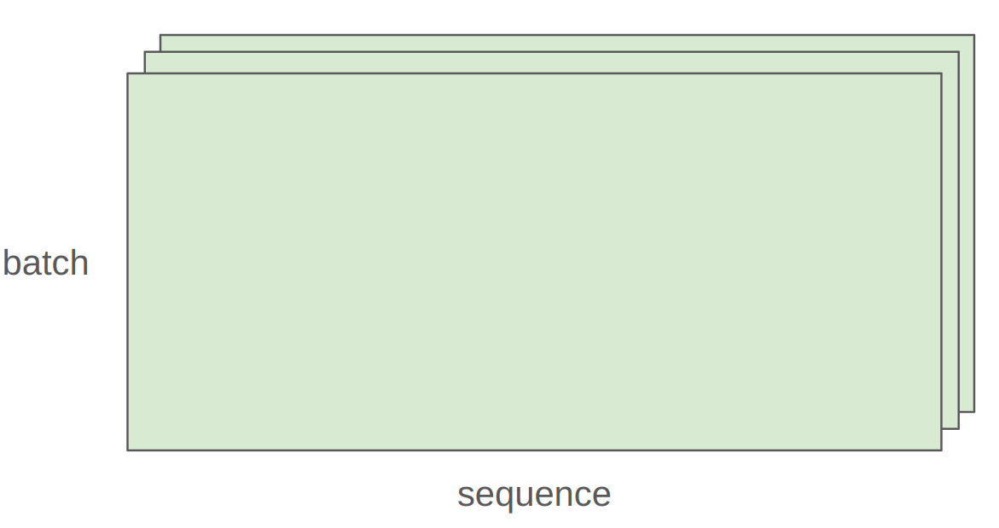
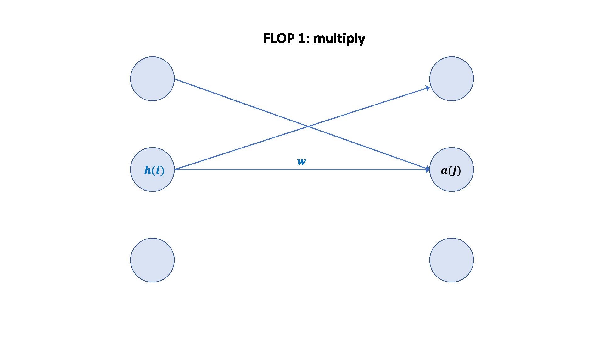

## 深度学习主要资源

- **内存**（GB）：存储参数、梯度、优化器状态、激活值等。
- **计算量**（FLOPs）：浮点运算次数，衡量训练所需的计算资源。

---

## 1. 张量基础与内存管理

### 1.1. 张量的创建与存储

- 张量是存储参数、梯度、优化器状态、数据、激活值的基本单元
- PyTorch 支持多种方式创建张量（如 `torch.zeros`、`torch.ones`、`torch.randn` 等）
    ```python
    x = torch.tensor([[1., 2, 3], [4, 5, 6]])  # @inspect x
    x = torch.zeros(4, 8)  # 4x8 matrix of all zeros @inspect x
    x = torch.ones(4, 8)  # 4x8 matrix of all ones @inspect x
    x = torch.randn(4, 8)  # 4x8 matrix of iid Normal(0, 1) samples @inspect x
    ```
    你也可以先分配空间，再分配数值
    ```python
    x = torch.empty(4, 8)  # 4x8 matrix of uninitialized values @inspect x
    nn.init.trunc_normal_(x, mean=0, std=1, a=-2, b=2)  # @inspect x
    ```
- 张量的内存由**元素数量**和**数据类型**共同决定

---

### 1.2. 常见数据类型

参数、梯度、激活以及优化状态几乎均存储为浮点数

#### 1.2.1 float32（单精度）

默认类型，4 字节，动态范围大。

<p align="center">
  
</p>

内存是由(i)数值的数量和(ii)数值的类型决定的

```python
x = torch.zeros(4, 8)  # @inspect x
assert x.dtype == torch.float32  # Default type
assert x.numel() == 4 * 8
assert x.element_size() == 4  # Float is 4 bytes
assert get_memory_usage(x) == 4 * 8 * 4  # 128 bytes
```

#### 1.2.2 float16（半精度）

2 字节，节省内存但动态范围小，易下溢

<p align="center">
  
</p>

```python
x = torch.zeros(4, 8, dtype=torch.float16)  # @inspect x
assert x.element_size() == 2 # Float is 2 bytes
```

动态范围不佳（易下溢）

```python
x = torch.tensor([1e-8], dtype=torch.float16)  # @inspect x
assert x == 0  # Underflow!
```

#### 1.2.3 bfloat16

2 字节，动态范围与 float32 相同，精度略低

<p align="center">
  
</p>

不易下溢：

```python
x = torch.tensor([1e-8], dtype=torch.bfloat16)  # @inspect x
assert x != 0  # No underflow!
```

不同数据类型的动态范围以及内存使用的比较:

```python
float32_info = torch.finfo(torch.float32)  # @inspect float32_info
float16_info = torch.finfo(torch.float16)  # @inspect float16_info
bfloat16_info = torch.finfo(torch.bfloat16)  # @inspect bfloat16_info
```

**输出**：

```python
float32 info="finfo(resolution=1e-06,min=-3.40282e+38,max=3.40282e+38, eps=1.19209e-07,smallest normal=1.17549e-38,tiny=1.17549e-38dtype=float32)"
float1l6 info="finfo(resolution=0.001,min=-65504,max=65504, eps=0.000976562,sma1lest norma1=6.10352e-05,tiny=6.10352e-05,dtype=float16)"
bfloat16 info="finfo(resolution=0.01, min=-3.38953e+38,max=3.38953e+38, eps=0.0078125,smallest normal=1.17549e38, tiny=1.17549e-38,dtype=bfloat16)"
```

#### 1.2.4 fp8

[FP8使用文档](https://docs.nvidia.com/deeplearning/transformer-engine/user-guide/examples/fp8_primer.html)

1 字节，极致压缩，适合新一代硬件（如 H100）

<p align="center">
  
</p>

H100s支持两种类型的FP8: E4M3 (range [-448, 448]) and E5M2 ([-57344, 57344])

#### 1.2.5 混合精度训练

<input disabled="" type="checkbox"> TODO: 更新混合精度训练

使用不同的数据类型是有一定的代价的：

- 高精度：**更准确和稳定**，但是需要**更多内存**和**更多计算力**
- 低精度：**不准确**也**不稳定**，但是**内存和算力需求减小**

一种混合精度训练方法：

- 前向传播（激活过程）时使用 bfloat16, fp8
- 对参数和梯度使用 float32

[混合精度训练论文](https://arxiv.org/pdf/1710.03740)/[混合精度训练pytorch文档](https://arxiv.org/pdf/1710.03740)/[混合精度训练nvidia文档](https://docs.nvidia.com/deeplearning/performance/mixed-precision-training/)

---

## 2. 计算资源

### 2.1. 张量操作

#### 2.1.1. 存储与视图

- 张量是**内存指针**+**元数据**（描述如何从张量中获取数据，如步幅 stride）

<p align="center">
  
</p>

[pytorch中对stride的定义](https://docs.pytorch.org/docs/stable/generated/torch.Tensor.stride.html)

对于一个张量：

```python
x = torch.tensor([
    [0., 1, 2, 3],
    [4, 5, 6, 7],
    [8, 9, 10, 11],
    [12, 13, 14, 15],
])
```

为了获取张量的下一行（dim 0），需跳过存储中的4个元素

```python
assert x.stride(0) == 4
```

为了获取张量的下一列（dim 1），需跳过存储中的1个元素

```python
assert x.stride(1) == 1
```

通过步幅寻找张量中的元素

```python
r, c = 1, 2
index = r * x.stride(0) + c * x.stride(1)  # @inspect index
assert index == 6
```

---

#### 2.1.2. 张量切片

许多张量操作仅仅提供了一个张量的不同**视图（view）**，它们往往不进行复制（copy）操作，这使得在某个张量上进行操作会影响其他张量

```python
x = torch.tensor([[1., 2, 3], [4, 5, 6]])  # @inspect x
```

**操作一** 获得 row 0

```python
def same_storage(x: torch.Tensor, y: torch.Tensor):
    return x.untyped_storage().data_ptr() == y.untyped_storage().data_ptr()

y = x[0]  # @inspect y
assert torch.equal(y, torch.tensor([1., 2, 3]))
assert same_storage(x, y)
```

**操作二** 获得 column 1

```python 
y = x[:, 1]  # @inspect y
assert torch.equal(y, torch.tensor([2, 5]))
assert same_storage(x, y)
```

**操作三** 将 2x3 矩阵转换为 3x2 矩阵（view）

```python
y = x.view(3, 2)  # @inspect y
assert torch.equal(y, torch.tensor([[1, 2], [3, 4], [5, 6]]))
assert same_storage(x, y)
```

**操作四** 转置矩阵（transpose）

```python
y = x.transpose(1, 0)  # @inspect y
assert torch.equal(y, torch.tensor([[1, 4], [2, 5], [3, 6]]))
assert same_storage(x, y)
```

**操作五** 修改x时也会修改y

```python 
x[0][0] = 100  # @inspect x, @inspect y
assert y[0][0] == 100
```

**操作六** 存储连续性（contiguous）

一些转换操作（view）会导致张量访问不连续，这会导致无法进行后续的转换操作

```python
x = torch.tensor([[1., 2, 3], [4, 5, 6]])  # @inspect x
y = x.transpose(1, 0)  # @inspect y
assert not y.is_contiguous()
try:
    y.view(2, 3)
    assert False
except RuntimeError as e:
    assert "view size is not compatible with input tensor's size and stride" in str(e)
```

可以强制一个张量变为连续，这会导致开辟新的存储空间

```python
y = x.transpose(1, 0).contiguous().view(2, 3)  # @inspect y
assert not same_storage(x, y)
```

---

#### 2.1.3. 张量元素级操作（elementwise）

这些操作会将操作应用于张量中的每一个元素，并返回一个大小相同的张量

```python
x = torch.tensor([1, 4, 9])
assert torch.equal(x.pow(2), torch.tensor([1, 16, 81]))
assert torch.equal(x.sqrt(), torch.tensor([1, 2, 3]))
assert torch.equal(x.rsqrt(), torch.tensor([1, 1 / 2, 1 / 3]))  # i -> 1/sqrt(x_i)

assert torch.equal(x + x, torch.tensor([2, 8, 18]))
assert torch.equal(x * 2, torch.tensor([2, 8, 18]))
assert torch.equal(x / 0.5, torch.tensor([2, 8, 18]))
```

`triu`构建一个矩阵的上三角，这个操作在计算因果注意力掩码（causal attention mask）时非常有用

```python
x = torch.ones(3, 3).triu()  # @inspect x
assert torch.equal(x, torch.tensor([
    [1, 1, 1],
    [0, 1, 1],
    [0, 0, 1]],
))
```

---

#### 2.1.4. 张量乘法

```python
x = torch.ones(16, 32)
w = torch.ones(32, 2)
y = x @ w
assert y.size() == torch.Size([16, 2])
```

通常来说，我们会将乘法操作应用于 batch 的每一个示例（example），以及序列（sequence）中的每一个 token 中

<p align="center">
  
</p>

```python
x = torch.ones(4, 8, 16, 32) ## [batch, sequence, H, W]
w = torch.ones(32, 2)
y = x @ w
assert y.size() == torch.Size([4, 8, 16, 2])
```

---

### 2.2. 张量 einops

#### 2.2.1. 使用 einops 的动机

```python
x = torch.ones(2, 2, 3)  # batch, sequence, hidden  @inspect x
y = torch.ones(2, 2, 3)  # batch, sequence, hidden  @inspect y
z = x @ y.transpose(-2, -1)  # batch, sequence, sequence  @inspect z
```

> 什么是维度 -2， -1？

很容易搞混张量维度

`einops`是一个 python 库，用于命名张量维度并操作张量

[einops文档](https://einops.rocks/1-einops-basics/)

---

####  2.2.2. jaxtyping命名矩阵维度

如何定义张量维度

**老方法**

```python
x = torch.ones(2, 2, 1, 3)  # batch seq heads hidden  @inspect x
```

**新方法（jaxtyping）**

```python
x: Float[torch.Tensor, "batch seq heads hidden"] = torch.ones(2, 2, 1, 3)  # @inspect x
```

---

#### 2.2.3. einops操作

##### 操作一 einsum

Einsum 是具有良好记录功能的通用矩阵乘法

**定义两个张量**

```python
x: Float[torch.Tensor, "batch seq1 hidden"] = torch.ones(2, 3, 4)  # @inspect x
y: Float[torch.Tensor, "batch seq2 hidden"] = torch.ones(2, 3, 4)  # @inspect y
```

**老方法**

```python
z = x @ y.transpose(-2, -1)  # batch, sequence, sequence  @inspect z
```

**新方法（jaxtyping）**

```python
z = einsum(x, y, "batch seq1 hidden, batch seq2 hidden -> batch seq1 seq2")  # @inspect z
z = einsum(x, y, "... seq1 hidden, ... seq2 hidden -> ... seq1 seq2")  # @inspect z
```

输出中未命名的维度将被求和

##### 操作二 reduce

你可以通过一些操作减少一个tensor的维度，例如`sum`、`mean`、`max`、`min`

**定义一个张量**

```python
x: Float[torch.Tensor, "batch seq hidden"] = torch.ones(2, 3, 4)  # @inspect x
```

**老方法**

```python
y = x.mean(dim=-1)  # @inspect y
```

**新方法（jaxtyping）**

```python
y = reduce(x, "... hidden -> ...", "sum")  # @inspect y
```

##### 操作三 rearrange

有时候，有一个维度表征了两个维度，你希望操作两个维度中的一个

**定义一个张量**

```python
x: Float[torch.Tensor, "batch seq total_hidden"] = torch.ones(2, 3, 8)  # @inspect x
```

其中`total_hidden`是`heads * hidden1`的展平表征

```python
w: Float[torch.Tensor, "hidden1 hidden2"] = torch.ones(4, 4)
```

将`total_hidden`拆分成`heads`和`hidden1`

```python
x = rearrange(x, "... (heads hidden1) -> ... heads hidden1", heads=2)  # @inspect x
```

将`heads`和`hidden1`合并

```python
x = rearrange(x, "... heads hidden2 -> ... (heads hidden2)")  # @inspect x
```

---

### 2.3. 张量操作 flops

一个浮点运算（FLOP, floating-point operation）是一次基础操作，例如加法（$x+y$）或乘法（$x \cdot y$）


两个极其令人困惑的缩写词（发音完全相同！）

- FLOPs：浮点运算（衡量计算量）
- FLOP/s：每秒浮点运算次数（也写作FLOPS），用于衡量硬件的速度


> 训练 [GPT-3（2020）](https://lambda.ai/blog/demystifying-gpt-3) 需要 3.14e23 FLOPs
> 
> 训练 [GPT-4（2023）](https://patmcguinness.substack.com/p/gpt-4-details-revealed) 需要大约 2e25 FLOPs
>
> [A100](https://www.nvidia.com/content/dam/en-zz/Solutions/Data-Center/a100/pdf/nvidia-a100-datasheet-us-nvidia-1758950-r4-web.pdf) 处理 torch.bfloat16 或 torch.float16 的峰值性能是 312 teraFLOP/s，处理 torch.float32 的峰值性能为 19.5 teraFLOP/s
>
> [H100](https://resources.nvidia.com/en-us-tensor-core/nvidia-tensor-core-gpu-datasheet) 处理 torch.bfloat16 或 torch.float16 的峰值性能是 1979 teraFLOP/s，但实际会有50%的性能折损；处理 torch.float32 的峰值性能为 67.5 teraFLOP/s
>
> 8 张 H100 两周可以完成：
>
> ```python
> total_flops = 8 * (60 * 60 * 24 * 7) * h100_flop_per_sec  # @inspect total_flops
> ```
>
> 输出：
> ```text
> total_flops = 4.788e+21
> ```

---

#### 2.3.1. FLOPs计算

- **线性模型**：对于一个维度为 B x D 的矩阵和一个 D x K 的矩阵，其所需的 FLOPs 为

  ```python
  x = torch.ones(B, D, device=device)
  w = torch.randn(D, K, device=device)
  y = x @ w

  actual_num_flops = 2 * B * D * K  # @inspect actual_num_flops
  ```

  对于一个三元组 (i, j, k)，需要一次乘法 (x[i][j] * w[j][k]) 和一次加法，最终实现矩阵相乘运算

- **元素级操作**：一个 m x n 的矩阵需要 O(m x n) FLOPs

- **加法操作**：两个 m x n 的矩阵完成加法需要 m x n FLOPs

总结，矩阵乘法是深度学习中 FLOP 需求最大的，你只需要统计深度学习中所需的乘法操作即可大致计算出所需 FLOPs

---

#### 2.3.2. 模型 FLOPs 使用量（Model FLOPs utilization，MFU）

**定义**： (actual FLOP/s) / (promised FLOP/s)，忽略通信开销

> 实际上，MFU >= 0.5 就已经很棒了（如果模型中乘法运算主导的话往往会更高）

---

#### 2.3.3. 总结

- 矩阵乘法占主导地位：(2 x m x n x p) FLOPs
    
- FLOP/s 取决于硬件（H100 >> A100）和数据类型（bfloat16 >> float32）
    
- 模型 FLOPs 利用率（MFU）：(实际 FLOP/s) / (承诺 FLOP/s)

---

### 2.4. 梯度与反向传播

#### 2.4.1. 梯度基础

假设我们有一个简单的线性模型

$$
y = 0.5 \cdot (x \times w - 5)^2
$$

**前向传播**：计算损失

```python
x = torch.tensor([1., 2, 3])
w = torch.tensor([1., 1, 1], requires_grad=True)  # Want gradient
pred_y = x @ w
loss = 0.5 * (pred_y - 5).pow(2)
```

**反向传播**：计算梯度

```python
loss.backward()
assert loss.grad is None
assert pred_y.grad is None
assert x.grad is None
assert torch.equal(w.grad, torch.tensor([1, 2, 3]))
```

---

#### 2.4.2. 梯度 FLOPs

计算梯度 FLOPs，我们以线性模型为例

```python
x = torch.ones(B, D, device=device)
w1 = torch.randn(D, D, device=device, requires_grad=True)
w2 = torch.randn(D, K, device=device, requires_grad=True)
h1 = x @ w1
h2 = h1 @ w2
loss = h2.pow(2).mean()
```

> 回顾一下前向传播的 FLOPs 计算：
> - Multiply x[i][j] * w1[j][k]
> - Add to h1[i][k]
> - Multiply h1[i][j] * w2[j][k]
> - Add to h2[i][k]
>
> ```python
> num_forward_flops = (2 * B * D * D) + (2 * B * D * K)  # @inspect num_forward_flops
> ```

反向传播路径：loss --> h2 --> w2 --> h1 --> w1 --> x

对于参数 w2，根据链式法则，可以得出其梯度为

$$
\text{w2.grad} = \frac{\partial loss}{\partial w2} = \frac{\partial loss}{\partial h2} \cdot \frac{\partial h2}{\partial w2}
$$
$$
w2.grad[j,k] = \frac{\partial loss}{\partial w2[j, k]} = \sum_{i=0}^{N-1} \frac{\partial loss}{\partial h2[i, k]} \cdot \frac{\partial h2[i, k]}{\partial w2[j, k]} = \sum_{i=0}^{N-1} h2.grad[i,k] \cdot h1[i,j]
$$

对于每一个三元组 (i,j,k)，都要做一次乘法和加法，所以

```python
num_backward_flops += 2 * B * D * K  # @inspect num_backward_flops
```

而这其中，有四个参数需要计算梯度，所以最终需要的 FLOPs 为

```python
num_backward_flops = (2 + 2) * B * D * K + (2 + 2) * B * D * D  # @inspect num_backward_flops
```

<p align="center">
  
</p>


- 前向传播：2 (# data points) (# parameters) FLOPs
- 反向传播：4 (# data points) (# parameters) FLOPs
- 总合：6 (# data points) (# parameters) FLOPs


---

## 3. 模型

### 3.1. 模型参数

模型参数均以`nn.Parameter`对象的形式存储于 Pytorch

```python
input_dim = 16384
output_dim = 32

w = nn.Parameter(torch.randn(input_dim, output_dim))
assert isinstance(w, torch.Tensor)  # Behaves like a tensor
assert type(w.data) == torch.Tensor  # Access the underlying tensor
```

#### 3.1.1. 参数初始化

假设我们随机初始化权重 w，并与 x 做乘法操作

```python
x = nn.Parameter(torch.randn(input_dim))
output = x @ w  # @inspect output
assert output.size() == torch.Size([output_dim])
```

输出：

```text
output = [
  18.919979095458984,
  ...
]
```

由于 $output[k] = x \times w[:, k]$，所以 output 中的每一个元素的大小均与 `input_dim` 线性相关

当 `input_dim` 过大时，会导致参数梯度爆炸，倒是模型训练不稳定

我们希望初始值与 `input_dim` 无关，为此，我们将参数统一放缩 1/sqrt(input_dim)

```python
w = nn.Parameter(torch.randn(input_dim, output_dim) / np.sqrt(input_dim))
output = x @ w  # @inspect output
```

输出：

```text
output = [
  -1.5302726030349731,
  ...
]
```

简单来说，这就是 [Xavier 初始化](https://proceedings.mlr.press/v9/glorot10a/glorot10a.pdf)

为了更加安全，我们将正态分布截断为[-3, 3]，以避免出现任何异常值

```python
w = nn.Parameter(nn.init.trunc_normal_(torch.empty(input_dim, output_dim), std=1 / np.sqrt(input_dim), a=-3, b=3))
```

---

#### 3.1.2. 构建模型

以线性模型为例

```python
class Linear(nn.Module):
  """Simple linear layer."""
  def __init__(self, input_dim: int, output_dim: int):
      super().__init__()
      self.weight = nn.Parameter(torch.randn(input_dim, output_dim) / np.sqrt(input_dim))
  def forward(self, x: torch.Tensor) -> torch.Tensor:
      return x @ self.weight

class Cruncher(nn.Module):
  def __init__(self, dim: int, num_layers: int):
      super().__init__()
      self.layers = nn.ModuleList([
          Linear(dim, dim)
          for i in range(num_layers)
      ])
      self.final = Linear(dim, 1)
  def forward(self, x: torch.Tensor) -> torch.Tensor:
      # Apply linear layers
      B, D = x.size()
      for layer in self.layers:
          x = layer(x)
      # Apply final head
      x = self.final(x)
      assert x.size() == torch.Size([B, 1])
      # Remove the last dimension
      x = x.squeeze(-1)
      assert x.size() == torch.Size([B])
      return x

B = 8  # Batch size
x = torch.randn(B, D, device=device)
y = model(x)
assert y.size() == torch.Size([B])
```

模型参数

```python
param_sizes = [
    (name, param.numel())
    for name, param in model.state_dict().items()
]
assert param_sizes == [
    ("layers.0.weight", D * D),
    ("layers.1.weight", D * D),
    ("final.weight", D),
]
num_parameters = get_num_parameters(model)
assert num_parameters == (D * D) + (D * D) + D
```

---

### 3.2. 模型训练

#### 3.2.1. 随机性

- 随机性在许多地方都会出现：参数初始化、dropout、数据排序等。
- 为了确保可重复性，我们建议您在每次使用随机性时都传入不同的随机种子
- 确定性在调试时特别有用，这样您可以定位并解决问题
- 设置随机种子有三个地方，为了安全起见，您应该一次性全部设置好

```python
# Torch
seed = 0
torch.manual_seed(seed)
# NumPy
import numpy as np
np.random.seed(seed)
# Python
import random
random.seed(seed)
```

---

#### 3.2.2. 数据加载

在语言模型中，数据可以表征为整数的序列（以 token 的形式输出）

可以使用 numpy 数组进行序列化

```python
orig_data = np.array([1, 2, 3, 4, 5, 6, 7, 8, 9, 10], dtype=np.int32)
orig_data.tofile("data.npy")
```

你可以使用 numpy 数组加载数据

如果你不希望一次性将所有数据载入内存（有些数据集巨大无比，例如 LLaMA 包含 2.8TB 数据），可以使用 `memmap` 将需要访问的部分载入内存

```python
data = np.memmap("data.npy", dtype=np.int32)
assert np.array_equal(data, orig_data)
```

一个数据加载器（dataloader）会生成一个 batch 的数据用于训练

```python
def get_batch(data: np.array, batch_size: int, sequence_length: int, device: str) -> torch.Tensor:
  # Sample batch_size random positions into data.
  start_indices = torch.randint(len(data) - sequence_length, (batch_size,))
  assert start_indices.size() == torch.Size([batch_size])

  # Index into the data.
  x = torch.tensor([data[start:start + sequence_length] for start in start_indices])
  assert x.size() == torch.Size([batch_size, sequence_length])

  # Pinned memory
  if torch.cuda.is_available():
    x = x.pin_memory()

  x = x.to(device, non_blocking=True)

  return x

B = 2  # Batch size
L = 4  # Length of sequence
x = get_batch(data, batch_size=B, sequence_length=L, device=get_device())
assert x.size() == torch.Size([B, L])
```

默认情况下，CPU 张量存储在分页内存（paged memory）中，我们可以显式地将其固定（pin），运行代码`x = x.pin_memory()`

这允许我们并行完成两项任务：

- 从数据中提取下一个 batch 到 CPU 上
- 在 GPU 上处理 x

---

#### 3.2.3. 优化器 Optimizer

依旧请出老朋友线性模型

```python
B = 2
D = 4
num_layers = 2
model = Cruncher(dim=D, num_layers=num_layers).to(get_device())
```

**定义** AdaGrad 优化器

- momentum = SGD + exponential averaging of grad
- AdaGrad = SGD + averaging by grad^2 
- RMSProp = AdaGrad + exponentially averaging of grad^2   
- Adam = RMSProp + momentum

[AdaGrad](https://www.jmlr.org/papers/volume12/duchi11a/duchi11a.pdf)

```python
class AdaGrad(torch.optim.Optimizer):
    def __init__(self, params: Iterable[nn.Parameter], lr: float = 0.01):
        super(AdaGrad, self).__init__(params, dict(lr=lr))

    def step(self):
        for group in self.param_groups:
            lr = group["lr"]
            for p in group["params"]:
                # Optimizer state
                state = self.state[p]
                grad = p.grad.data

                # Get squared gradients g2 = sum_{i<t} g_i^2
                g2 = state.get("g2", torch.zeros_like(grad))

                # Update optimizer state
                g2 += torch.square(grad)
                state["g2"] = g2

                # Update parameters
                p.data -= lr * grad / torch.sqrt(g2 + 1e-5)

optimizer = AdaGrad(model.parameters(), lr=0.01)
state = model.state_dict()  # @inspect state
```

计算梯度

```python
x = torch.randn(B, D, device=get_device())
y = torch.tensor([4., 5.], device=get_device())
pred_y = model(x)
loss = F.mse_loss(input=pred_y, target=y)
loss.backward()
```

优化一个 step

```python
optimizer.step()
state = model.state_dict()  # @inspect state
```

释放内存（可选）

```python
optimizer.zero_grad(set_to_none=True)
```

##### 关于内存

- 参数所需的内存

  ```python
  def get_num_parameters(model: nn.Module) -> int:
    return sum(param.numel() for param in model.parameters())

  num_parameters = (D * D * num_layers) + D  # @inspect num_parameters
  assert num_parameters == get_num_parameters(model)
  ```

  输出

  ```python
  num_parameters = 36
  ```

- 激活函数所需的内存

  ```python
  num_activations = B * D * num_layers  # @inspect num_activations
  ```

  输出

  ```python
  num_parameters = 16
  ```

- 梯度所需的内存

  ```python
  num_gradients = num_parameters  # @inspect num_gradients
  ```

  输出

  ```python
  num_parameters = 36
  ```

- 优化器 state 所需的内存

  ```python
  num_optimizer_states = num_parameters  # @inspect num_optimizer_states
  ```

  输出

  ```python
  num_parameters = 36
  ```

- 总共需要（假设数据均以 float32 存储，需要 4 Bytes）

  ```python
  total_memory = 4 * (num_parameters + num_activations + num_gradients + num_optimizer_states)  # @inspect total_memory
  ```

  输出

  ```python
  num_parameters = 496
  ```

---

#### 3.2.4. 训练循环（loop）

```python
def train(name: str, get_batch,
          D: int, num_layers: int,
          B: int, num_train_steps: int, lr: float):
    model = Cruncher(dim=D, num_layers=0).to(get_device())
    optimizer = SGD(model.parameters(), lr=0.01)
    for t in range(num_train_steps):
        # Get data
        x, y = get_batch(B=B)
        # Forward (compute loss)
        pred_y = model(x)
        loss = F.mse_loss(pred_y, y)
        # Backward (compute gradients)
        loss.backward()
        # Update parameters
        optimizer.step()
        optimizer.zero_grad(set_to_none=True)

train("simple", get_batch, D=D, num_layers=0, B=4, num_train_steps=10, lr=0.01)
```

---

#### 3.2.5. checkpoint

在训练阶段，阶段性的保存模型以及优化器状态（state）到硬盘中是非常有用的

```python
checkpoint = {
    "model": model.state_dict(),
    "optimizer": optimizer.state_dict(),
}
torch.save(checkpoint, "model_checkpoint.pt")
```

加载 checkpoint

```python
loaded_checkpoint = torch.load("model_checkpoint.pt")
```

#### 3.2.6. 混合精度训练

- 数据类型的选择（float32、bfloat16、fp8）存在权衡
  - 更高精度：更准确/稳定，占用更多内存，计算量更大
  - 精度较低：精度/稳定性较低，内存占用较少，计算量较少
- 如何兼顾两者优势？
  - 解决方案：默认使用float32，但在可能的情况下使用{bfloat16, fp8}
  - 具体计划：
    1. 在前向传播（激活函数）中使用{bfloat16, fp8}
    2. 使用float32进行其余操作（参数、梯度）
  - [混合精度训练](https://arxiv.org/pdf/1710.03740.pdf)
  - [Pytorch 提供自动混合精度（AMP）库](https://pytorch.org/docs/stable/amp.html)
  - [NVIDIA](https://docs.nvidia.com/deeplearning/performance/mixed-precision-training/) 的 Transformer Engine 支持 FP8 用于线性层
    在训练过程中广泛使用 [FP8](https://arxiv.org/pdf/2310.18313)

---

<div class="zhihu-ref">
  <div class="zhihu-ref-title">参考文献</div>
  <ol>
    <li><a href="https://stanford-cs336.github.io/spring2025-lectures/?trace=var%2Ftraces%2Flecture_02.json" target="_blank">stanford-cs336 lecture 2</a></li>
  </ol>
</div>