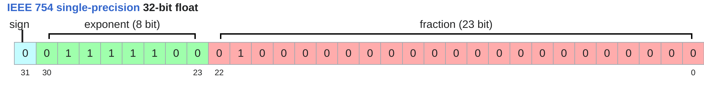

## 深度学习主要资源

- **内存**（GB）：存储参数、梯度、优化器状态、激活值等。
- **计算量**（FLOPs）：浮点运算次数，衡量训练所需的计算资源。

---

## 1. 张量基础与内存管理

### 1.1 张量的创建与存储

- 张量是存储参数、梯度、优化器状态、数据、激活值的基本单元
- PyTorch 支持多种方式创建张量（如 `torch.zeros`、`torch.ones`、`torch.randn` 等）
    ```python
    x = torch.tensor([[1., 2, 3], [4, 5, 6]])  # @inspect x
    x = torch.zeros(4, 8)  # 4x8 matrix of all zeros @inspect x
    x = torch.ones(4, 8)  # 4x8 matrix of all ones @inspect x
    x = torch.randn(4, 8)  # 4x8 matrix of iid Normal(0, 1) samples @inspect x
    ```
    你也可以先分配空间，再分配数值
    ```python
    x = torch.empty(4, 8)  # 4x8 matrix of uninitialized values @inspect x
    nn.init.trunc_normal_(x, mean=0, std=1, a=-2, b=2)  # @inspect x
    ```
- 张量的内存由**元素数量**和**数据类型**共同决定

---

### 1.2 常见数据类型

参数、梯度、激活以及优化状态几乎均存储为浮点数

#### 1.2.1 float32（单精度）

默认类型，4 字节，动态范围大。

<p align="center">
  
</p>

内存是由(i)数值的数量和(ii)数值的类型决定的

```python
x = torch.zeros(4, 8)  # @inspect x
assert x.dtype == torch.float32  # Default type
assert x.numel() == 4 * 8
assert x.element_size() == 4  # Float is 4 bytes
assert get_memory_usage(x) == 4 * 8 * 4  # 128 bytes
```

#### 1.2.2 float16（半精度）

2 字节，节省内存但动态范围小，易下溢

<p align="center">
  
</p>

```python
x = torch.zeros(4, 8, dtype=torch.float16)  # @inspect x
assert x.element_size() == 2 # Float is 2 bytes
```

动态范围不佳（易下溢）

```python
x = torch.tensor([1e-8], dtype=torch.float16)  # @inspect x
assert x == 0  # Underflow!
```

#### 1.2.3 bfloat16

2 字节，动态范围与 float32 相同，精度略低

<p align="center">
  
</p>

不易下溢：

```python
x = torch.tensor([1e-8], dtype=torch.bfloat16)  # @inspect x
assert x != 0  # No underflow!
```

不同数据类型的动态范围以及内存使用的比较:

```python
float32_info = torch.finfo(torch.float32)  # @inspect float32_info
float16_info = torch.finfo(torch.float16)  # @inspect float16_info
bfloat16_info = torch.finfo(torch.bfloat16)  # @inspect bfloat16_info
```

**输出**：

```python
float32 info="finfo(resolution=1e-06,min=-3.40282e+38,max=3.40282e+38, eps=1.19209e-07,smallest normal=1.17549e-38,tiny=1.17549e-38dtype=float32)"
float1l6 info="finfo(resolution=0.001,min=-65504,max=65504, eps=0.000976562,sma1lest norma1=6.10352e-05,tiny=6.10352e-05,dtype=float16)"
bfloat16 info="finfo(resolution=0.01, min=-3.38953e+38,max=3.38953e+38, eps=0.0078125,smallest normal=1.17549e38, tiny=1.17549e-38,dtype=bfloat16)"
```

#### 1.2.4 fp8

[FP8使用文档](https://docs.nvidia.com/deeplearning/transformer-engine/user-guide/examples/fp8_primer.html)

1 字节，极致压缩，适合新一代硬件（如 H100）

<p align="center">
  
</p>

H100s支持两种类型的FP8: E4M3 (range [-448, 448]) and E5M2 ([-57344, 57344])

#### 1.2.5 混合精度训练

<input disabled="" type="checkbox"> TODO: 更新混合精度训练

使用不同的数据类型是有一定的代价的：

- 高精度：**更准确和稳定**，但是需要**更多内存**和**更多计算力**
- 低精度：**不准确**也**不稳定**，但是**内存和算力需求减小**

一种混合精度训练方法：

- 前向传播（激活过程）时使用 bfloat16, fp8
- 对参数和梯度使用 float32

[混合精度训练论文](https://arxiv.org/pdf/1710.03740)/[混合精度训练pytorch文档](https://arxiv.org/pdf/1710.03740)/[混合精度训练nvidia文档](https://docs.nvidia.com/deeplearning/performance/mixed-precision-training/)

---

## 3. 计算资源

### 3.1 张量与 GPU

- 张量默认存储在 CPU，需要手动转移到 GPU（如 `x.to("cuda:0")`）。
- GPU 并行计算能力强，适合大规模深度学习训练。
- 需要关注 GPU 内存分配与释放。

---

## 4. 张量操作

### 存储与视图

- 张量是内存指针+元数据（如 stride）。
- 视图操作（如切片、转置）不会复制数据，节省内存。

### 常见操作

- **切片**、**转置**、**变形**（view/reshape）、**逐元素运算**（如加减乘除、pow、sqrt）。
- **矩阵乘法**（matmul/@）：深度学习的核心操作，计算量最大。

### Einops 与 Jaxtyping

- **Einops**：用命名维度简化张量操作，减少出错。
- **Jaxtyping**：用类型注解标注张量维度，提升代码可读性。

---

## 5. 计算量（FLOPs）分析

- **FLOPs**：浮点运算次数，衡量训练/推理的计算消耗。
- 训练 GPT-3 约需 3.14e23 FLOPs，GPT-4 约 2e25 FLOPs。
- A100 峰值 312 TFLOP/s，H100 峰值 1979 TFLOP/s（稀疏）。
- 线性模型/Transformer 的 FLOPs 主要由矩阵乘法决定。

### FLOPs 利用率（MFU）

- MFU = 实际 FLOP/s / 理论峰值 FLOP/s
- MFU ≥ 0.5 已属高效。

---

## 6. 梯度与反向传播

- 前向传播：计算损失。
- 反向传播：自动求梯度，更新参数。
- 反向传播 FLOPs 通常是前向的 2 倍，总 FLOPs 约为 6 ×（数据点数 × 参数数）。

---

## 7. 模型参数与初始化

- 参数用 `nn.Parameter` 存储，支持自动求导。
- 初始化建议用 Xavier/Glorot 初始化，避免梯度爆炸/消失。
- 可用截断正态分布进一步避免极端值。

---

## 8. 自定义模型与训练循环

- 以 `Cruncher` 为例，堆叠多个线性层，最后输出单值。
- 训练循环包括：采样 batch、前向、反向、优化器 step、梯度清零。

---

## 9. 数据加载与批处理

- 数据通常为整数序列（token）。
- 推荐用 numpy memmap 懒加载大数据集。
- 支持 pinned memory 和异步数据传输提升效率。

---

## 10. 优化器

- 介绍了 SGD、AdaGrad 两种优化器的实现与原理。
- AdaGrad 适合稀疏梯度场景，自动调整学习率。

---

## 11. 检查点与混合精度训练

- 长时间训练需定期保存模型和优化器状态（checkpoint）。
- 混合精度训练（AMP）：前向用低精度，参数/梯度用高精度，兼顾速度与稳定性。

---

## 12. 训练中的随机性

- 随机性影响初始化、dropout、数据顺序等。
- 建议同时设置 torch、numpy、python 的随机种子，保证可复现性。

---

## 参考资料

- [PyTorch 张量文档](https://pytorch.org/docs/stable/tensors.html)
- [Xavier 初始化论文](https://proceedings.mlr.press/v9/glorot10a/glorot10a.pdf)
- [Einops 教程](https://einops.rocks/1-einops-basics/)
- [混合精度训练论文](https://arxiv.org/pdf/1710.03740.pdf)
- [Transformer 计算与内存分析博客](https://erees.dev/transformer-memory/), [Transformer FLOPs 计算](https://www.adamcasson.com/posts/transformer-flops)

---

如需插入图片、代码或进一步细化某一部分，可随时告知！
