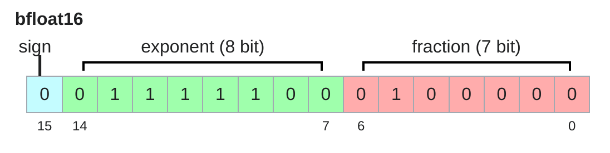
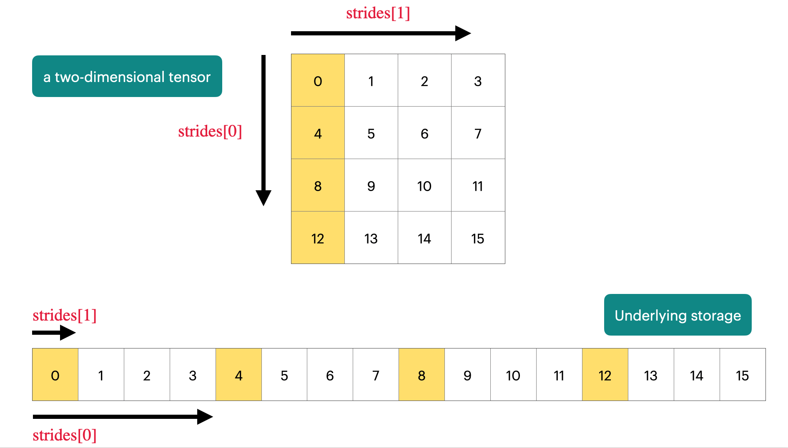

## 深度学习主要资源

- **内存**（GB）：存储参数、梯度、优化器状态、激活值等。
- **计算量**（FLOPs）：浮点运算次数，衡量训练所需的计算资源。

---

## 1. 张量基础与内存管理

### 1.1. 张量的创建与存储

- 张量是存储参数、梯度、优化器状态、数据、激活值的基本单元
- PyTorch 支持多种方式创建张量（如 `torch.zeros`、`torch.ones`、`torch.randn` 等）
    ```python
    x = torch.tensor([[1., 2, 3], [4, 5, 6]])  # @inspect x
    x = torch.zeros(4, 8)  # 4x8 matrix of all zeros @inspect x
    x = torch.ones(4, 8)  # 4x8 matrix of all ones @inspect x
    x = torch.randn(4, 8)  # 4x8 matrix of iid Normal(0, 1) samples @inspect x
    ```
    你也可以先分配空间，再分配数值
    ```python
    x = torch.empty(4, 8)  # 4x8 matrix of uninitialized values @inspect x
    nn.init.trunc_normal_(x, mean=0, std=1, a=-2, b=2)  # @inspect x
    ```
- 张量的内存由**元素数量**和**数据类型**共同决定

---

### 1.2. 常见数据类型

参数、梯度、激活以及优化状态几乎均存储为浮点数

#### 1.2.1 float32（单精度）

默认类型，4 字节，动态范围大。

<p align="center">
  
</p>

内存是由(i)数值的数量和(ii)数值的类型决定的

```python
x = torch.zeros(4, 8)  # @inspect x
assert x.dtype == torch.float32  # Default type
assert x.numel() == 4 * 8
assert x.element_size() == 4  # Float is 4 bytes
assert get_memory_usage(x) == 4 * 8 * 4  # 128 bytes
```

#### 1.2.2 float16（半精度）

2 字节，节省内存但动态范围小，易下溢

<p align="center">
  
</p>

```python
x = torch.zeros(4, 8, dtype=torch.float16)  # @inspect x
assert x.element_size() == 2 # Float is 2 bytes
```

动态范围不佳（易下溢）

```python
x = torch.tensor([1e-8], dtype=torch.float16)  # @inspect x
assert x == 0  # Underflow!
```

#### 1.2.3 bfloat16

2 字节，动态范围与 float32 相同，精度略低

<p align="center">
  
</p>

不易下溢：

```python
x = torch.tensor([1e-8], dtype=torch.bfloat16)  # @inspect x
assert x != 0  # No underflow!
```

不同数据类型的动态范围以及内存使用的比较:

```python
float32_info = torch.finfo(torch.float32)  # @inspect float32_info
float16_info = torch.finfo(torch.float16)  # @inspect float16_info
bfloat16_info = torch.finfo(torch.bfloat16)  # @inspect bfloat16_info
```

**输出**：

```python
float32 info="finfo(resolution=1e-06,min=-3.40282e+38,max=3.40282e+38, eps=1.19209e-07,smallest normal=1.17549e-38,tiny=1.17549e-38dtype=float32)"
float1l6 info="finfo(resolution=0.001,min=-65504,max=65504, eps=0.000976562,sma1lest norma1=6.10352e-05,tiny=6.10352e-05,dtype=float16)"
bfloat16 info="finfo(resolution=0.01, min=-3.38953e+38,max=3.38953e+38, eps=0.0078125,smallest normal=1.17549e38, tiny=1.17549e-38,dtype=bfloat16)"
```

#### 1.2.4 fp8

[FP8使用文档](https://docs.nvidia.com/deeplearning/transformer-engine/user-guide/examples/fp8_primer.html)

1 字节，极致压缩，适合新一代硬件（如 H100）

<p align="center">
  
</p>

H100s支持两种类型的FP8: E4M3 (range [-448, 448]) and E5M2 ([-57344, 57344])

#### 1.2.5 混合精度训练

<input disabled="" type="checkbox"> TODO: 更新混合精度训练

使用不同的数据类型是有一定的代价的：

- 高精度：**更准确和稳定**，但是需要**更多内存**和**更多计算力**
- 低精度：**不准确**也**不稳定**，但是**内存和算力需求减小**

一种混合精度训练方法：

- 前向传播（激活过程）时使用 bfloat16, fp8
- 对参数和梯度使用 float32

[混合精度训练论文](https://arxiv.org/pdf/1710.03740)/[混合精度训练pytorch文档](https://arxiv.org/pdf/1710.03740)/[混合精度训练nvidia文档](https://docs.nvidia.com/deeplearning/performance/mixed-precision-training/)

---

## 2. 计算资源

### 2.1. 张量操作

#### 2.1.1. 存储与视图

- 张量是**内存指针**+**元数据**（描述如何从张量中获取数据，如步幅 stride）

<p align="center">
  
</p>

[pytorch中对stride的定义](https://docs.pytorch.org/docs/stable/generated/torch.Tensor.stride.html)

对于一个张量：

```python
x = torch.tensor([
    [0., 1, 2, 3],
    [4, 5, 6, 7],
    [8, 9, 10, 11],
    [12, 13, 14, 15],
])
```

为了获取张量的下一行（dim 0），需跳过存储中的4个元素

```python
assert x.stride(0) == 4
```

为了获取张量的下一列（dim 1），需跳过存储中的1个元素

```python
assert x.stride(1) == 1
```

通过步幅寻找张量中的元素

```python
r, c = 1, 2
index = r * x.stride(0) + c * x.stride(1)  # @inspect index
assert index == 6
```

---

#### 2.1.2. 张量切片

许多张量操作仅仅提供了一个张量的不同**视图（view）**，它们往往不进行复制（copy）操作，这使得在某个张量上进行操作会影响其他张量

```python
x = torch.tensor([[1., 2, 3], [4, 5, 6]])  # @inspect x
```

**操作一** 获得 row 0

```python
def same_storage(x: torch.Tensor, y: torch.Tensor):
    return x.untyped_storage().data_ptr() == y.untyped_storage().data_ptr()

y = x[0]  # @inspect y
assert torch.equal(y, torch.tensor([1., 2, 3]))
assert same_storage(x, y)
```

**操作二** 获得 column 1

```python 
y = x[:, 1]  # @inspect y
assert torch.equal(y, torch.tensor([2, 5]))
assert same_storage(x, y)
```

**操作三** 将 2x3 矩阵转换为 3x2 矩阵（view）

```python
y = x.view(3, 2)  # @inspect y
assert torch.equal(y, torch.tensor([[1, 2], [3, 4], [5, 6]]))
assert same_storage(x, y)
```

**操作四** 转置矩阵（transpose）

```python
y = x.transpose(1, 0)  # @inspect y
assert torch.equal(y, torch.tensor([[1, 4], [2, 5], [3, 6]]))
assert same_storage(x, y)
```

**操作五** 修改x时也会修改y

```python 
x[0][0] = 100  # @inspect x, @inspect y
assert y[0][0] == 100
```

**操作六** 存储连续性（contiguous）

一些转换操作（view）会导致张量访问不连续，这会导致无法进行后续的转换操作

```python
x = torch.tensor([[1., 2, 3], [4, 5, 6]])  # @inspect x
y = x.transpose(1, 0)  # @inspect y
assert not y.is_contiguous()
try:
    y.view(2, 3)
    assert False
except RuntimeError as e:
    assert "view size is not compatible with input tensor's size and stride" in str(e)
```

可以强制一个张量变为连续，这会导致开辟新的存储空间

```python
y = x.transpose(1, 0).contiguous().view(2, 3)  # @inspect y
assert not same_storage(x, y)
```

---

#### 2.1.3. 张量元素级操作（elementwise）

这些操作会将操作应用于张量中的每一个元素，并返回一个大小相同的张量

```python
x = torch.tensor([1, 4, 9])
assert torch.equal(x.pow(2), torch.tensor([1, 16, 81]))
assert torch.equal(x.sqrt(), torch.tensor([1, 2, 3]))
assert torch.equal(x.rsqrt(), torch.tensor([1, 1 / 2, 1 / 3]))  # i -> 1/sqrt(x_i)

assert torch.equal(x + x, torch.tensor([2, 8, 18]))
assert torch.equal(x * 2, torch.tensor([2, 8, 18]))
assert torch.equal(x / 0.5, torch.tensor([2, 8, 18]))
```

`triu`构建一个矩阵的上三角，这个操作在计算因果注意力掩码（causal attention mask）时非常有用

```python
x = torch.ones(3, 3).triu()  # @inspect x
assert torch.equal(x, torch.tensor([
    [1, 1, 1],
    [0, 1, 1],
    [0, 0, 1]],
))
```

---

#### 2.1.4. 张量乘法

```python
x = torch.ones(16, 32)
w = torch.ones(32, 2)
y = x @ w
assert y.size() == torch.Size([16, 2])
```

通常来说，我们会将乘法操作应用于 batch 的每一个示例（example），以及序列（sequence）中的每一个 token 中

<p align="center">
  
</p>

```python
x = torch.ones(4, 8, 16, 32) ## [batch, sequence, H, W]
w = torch.ones(32, 2)
y = x @ w
assert y.size() == torch.Size([4, 8, 16, 2])
```

---

### 2.2. 张量 einops

#### 2.2.1. 使用 einops 的动机

```python
x = torch.ones(2, 2, 3)  # batch, sequence, hidden  @inspect x
y = torch.ones(2, 2, 3)  # batch, sequence, hidden  @inspect y
z = x @ y.transpose(-2, -1)  # batch, sequence, sequence  @inspect z
```

> 什么是维度 -2， -1？

很容易搞混张量维度

`einops`是一个 python 库，用于命名张量维度并操作张量

[einops文档](https://einops.rocks/1-einops-basics/)

---

####  2.2.2. jaxtyping命名矩阵维度

如何定义张量维度

**老方法**

```python
x = torch.ones(2, 2, 1, 3)  # batch seq heads hidden  @inspect x
```

**新方法（jaxtyping）**

```python
x: Float[torch.Tensor, "batch seq heads hidden"] = torch.ones(2, 2, 1, 3)  # @inspect x
```

---

#### 2.2.3. einops操作

##### 操作一 einsum

Einsum 是具有良好记录功能的通用矩阵乘法

**定义两个张量**

```python
x: Float[torch.Tensor, "batch seq1 hidden"] = torch.ones(2, 3, 4)  # @inspect x
y: Float[torch.Tensor, "batch seq2 hidden"] = torch.ones(2, 3, 4)  # @inspect y
```

**老方法**

```python
z = x @ y.transpose(-2, -1)  # batch, sequence, sequence  @inspect z
```

**新方法（jaxtyping）**

```python
z = einsum(x, y, "batch seq1 hidden, batch seq2 hidden -> batch seq1 seq2")  # @inspect z
z = einsum(x, y, "... seq1 hidden, ... seq2 hidden -> ... seq1 seq2")  # @inspect z
```

输出中未命名的维度将被求和

##### 操作二 reduce

你可以通过一些操作减少一个tensor的维度，例如`sum`、`mean`、`max`、`min`

**定义一个张量**

```python
x: Float[torch.Tensor, "batch seq hidden"] = torch.ones(2, 3, 4)  # @inspect x
```

**老方法**

```python
y = x.mean(dim=-1)  # @inspect y
```

**新方法（jaxtyping）**

```python
y = reduce(x, "... hidden -> ...", "sum")  # @inspect y
```

##### 操作三 rearrange

有时候，有一个维度表征了两个维度，你希望操作两个维度中的一个

**定义一个张量**

```python
x: Float[torch.Tensor, "batch seq total_hidden"] = torch.ones(2, 3, 8)  # @inspect x
```

其中`total_hidden`是`heads * hidden1`的展平表征

```python
w: Float[torch.Tensor, "hidden1 hidden2"] = torch.ones(4, 4)
```

将`total_hidden`拆分成`heads`和`hidden1`

```python
x = rearrange(x, "... (heads hidden1) -> ... heads hidden1", heads=2)  # @inspect x
```

将`heads`和`hidden1`合并

```python
x = rearrange(x, "... heads hidden2 -> ... (heads hidden2)")  # @inspect x
```

---

### 2.3. 张量操作 flops

一个浮点运算（FLOP, floating-point operation）是一次基础操作，例如加法（$x+y$）或乘法（$x \cdot y$）


两个极其令人困惑的缩写词（发音完全相同！）

- FLOPs：浮点运算（衡量计算量）
- FLOP/s：每秒浮点运算次数（也写作FLOPS），用于衡量硬件的速度


> 训练 [GPT-3（2020）](https://lambda.ai/blog/demystifying-gpt-3) 需要 3.14e23 FLOPs
> 
> 训练 [GPT-4（2023）](https://patmcguinness.substack.com/p/gpt-4-details-revealed) 需要大约 2e25 FLOPs
>
> [A100](https://www.nvidia.com/content/dam/en-zz/Solutions/Data-Center/a100/pdf/nvidia-a100-datasheet-us-nvidia-1758950-r4-web.pdf) 处理 torch.bfloat16 或 torch.float16 的峰值性能是 312 teraFLOP/s，处理 torch.float32 的峰值性能为 19.5 teraFLOP/s
>
> [H100](https://resources.nvidia.com/en-us-tensor-core/nvidia-tensor-core-gpu-datasheet) 处理 torch.bfloat16 或 torch.float16 的峰值性能是 1979 teraFLOP/s，但实际会有50%的性能折损；处理 torch.float32 的峰值性能为 67.5 teraFLOP/s
>
> 8 张 H100 两周可以完成：
>
> ```python
> total_flops = 8 * (60 * 60 * 24 * 7) * h100_flop_per_sec  # @inspect total_flops
> ```
>
> 输出：
> ```text
> total_flops = 4.788e+21
> ```

---

#### 2.3.1. FLOPs计算

- **线性模型**：对于一个维度为 B x D 的矩阵和一个 D x K 的矩阵，其所需的 FLOPs 为

  ```python
  x = torch.ones(B, D, device=device)
  w = torch.randn(D, K, device=device)
  y = x @ w

  actual_num_flops = 2 * B * D * K  # @inspect actual_num_flops
  ```

  对于一个三元组 (i, j, k)，需要一次乘法 (x[i][j] * w[j][k]) 和一次加法，最终实现矩阵相乘运算

- **元素级操作**：一个 m x n 的矩阵需要 O(m x n) FLOPs

- **加法操作**：两个 m x n 的矩阵完成加法需要 m x n FLOPs

总结，矩阵乘法是深度学习中 FLOP 需求最大的，你只需要统计深度学习中所需的乘法操作即可大致计算出所需 FLOPs

---

#### 2.3.2. 模型 FLOPs 使用量（Model FLOPs utilization，MFU）

**定义**： (actual FLOP/s) / (promised FLOP/s)，忽略通信开销

> 实际上，MFU >= 0.5 就已经很棒了（如果模型中乘法运算主导的话往往会更高）

---

#### 2.3.3. 总结

- 矩阵乘法占主导地位：(2 x m x n x p) FLOPs
    
- FLOP/s 取决于硬件（H100 >> A100）和数据类型（bfloat16 >> float32）
    
- 模型 FLOPs 利用率（MFU）：(实际 FLOP/s) / (承诺 FLOP/s)

## 5. 计算量（FLOPs）分析

- **FLOPs**：浮点运算次数，衡量训练/推理的计算消耗。
- 训练 GPT-3 约需 3.14e23 FLOPs，GPT-4 约 2e25 FLOPs。
- A100 峰值 312 TFLOP/s，H100 峰值 1979 TFLOP/s（稀疏）。
- 线性模型/Transformer 的 FLOPs 主要由矩阵乘法决定。

### FLOPs 利用率（MFU）

- MFU = 实际 FLOP/s / 理论峰值 FLOP/s
- MFU ≥ 0.5 已属高效。

---

## 6. 梯度与反向传播

- 前向传播：计算损失。
- 反向传播：自动求梯度，更新参数。
- 反向传播 FLOPs 通常是前向的 2 倍，总 FLOPs 约为 6 ×（数据点数 × 参数数）。

---

## 7. 模型参数与初始化

- 参数用 `nn.Parameter` 存储，支持自动求导。
- 初始化建议用 Xavier/Glorot 初始化，避免梯度爆炸/消失。
- 可用截断正态分布进一步避免极端值。

---

## 8. 自定义模型与训练循环

- 以 `Cruncher` 为例，堆叠多个线性层，最后输出单值。
- 训练循环包括：采样 batch、前向、反向、优化器 step、梯度清零。

---

## 9. 数据加载与批处理

- 数据通常为整数序列（token）。
- 推荐用 numpy memmap 懒加载大数据集。
- 支持 pinned memory 和异步数据传输提升效率。

---

## 10. 优化器

- 介绍了 SGD、AdaGrad 两种优化器的实现与原理。
- AdaGrad 适合稀疏梯度场景，自动调整学习率。

---

## 11. 检查点与混合精度训练

- 长时间训练需定期保存模型和优化器状态（checkpoint）。
- 混合精度训练（AMP）：前向用低精度，参数/梯度用高精度，兼顾速度与稳定性。

---

## 12. 训练中的随机性

- 随机性影响初始化、dropout、数据顺序等。
- 建议同时设置 torch、numpy、python 的随机种子，保证可复现性。

---

## 参考资料

- [PyTorch 张量文档](https://pytorch.org/docs/stable/tensors.html)
- [Xavier 初始化论文](https://proceedings.mlr.press/v9/glorot10a/glorot10a.pdf)
- [Einops 教程](https://einops.rocks/1-einops-basics/)
- [混合精度训练论文](https://arxiv.org/pdf/1710.03740.pdf)
- [Transformer 计算与内存分析博客](https://erees.dev/transformer-memory/), [Transformer FLOPs 计算](https://www.adamcasson.com/posts/transformer-flops)

---

如需插入图片、代码或进一步细化某一部分，可随时告知！
