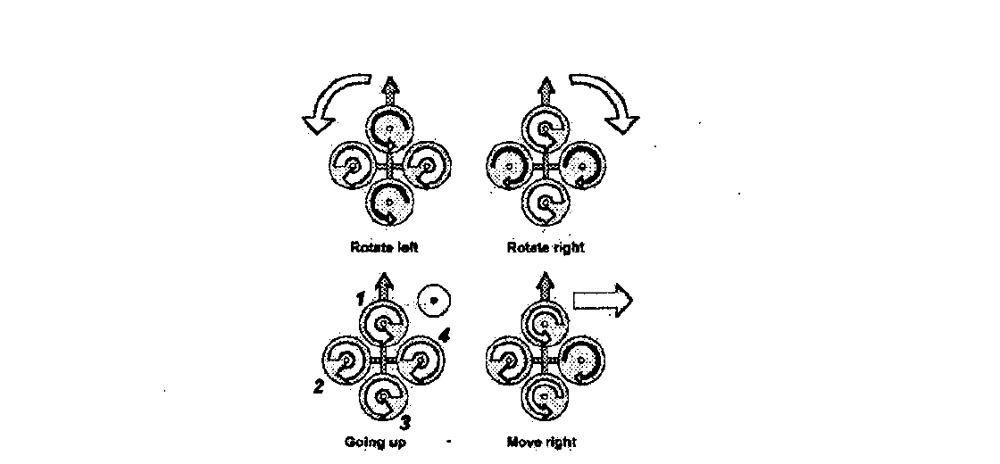
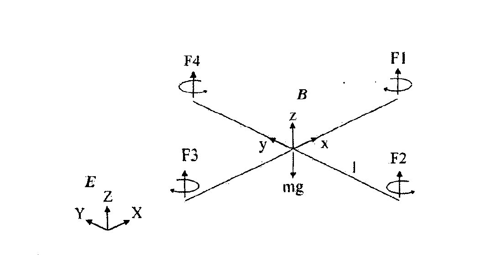
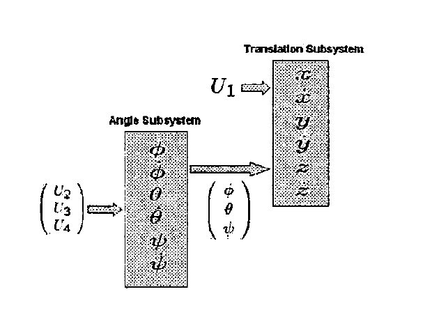

本文参考 [Bouabdallah 等人的室内微型四旋翼研究](https://doi.org/10.1109/ROBOT.2004.1302409)。

## 1. 四旋翼架构：四个旋翼共同控制升力与姿态

### 1.1 十字布局：两对旋翼反向旋转

四旋翼由中心机体、四条机臂和机臂末端的四组电机—旋翼组成，整体呈十字布局。编号相对的旋翼构成两组：旋翼 1、3 为一组，旋翼 2、4 为另一组。

两组旋翼的旋转方向相反。这样可以让正常飞行时的旋翼反扭矩相互抵消，使机体不会在没有偏航指令时持续自转。

单个旋翼的推力近似与转速平方成正比：

\[
T_i=b\Omega_i^2,
\]

其中 \(T_i\) 是第 \(i\) 个旋翼的推力，\(\Omega_i\) 是旋翼角速度，\(b\) 是推力系数。控制器通过改变四个 \(\Omega_i\)，间接控制总推力和三个方向的力矩。

### 1.2 四种运动：不同的转速组合产生不同效果

<figure>
  
  <figcaption>四旋翼的基本运动方式。图中箭头越宽，表示对应旋翼的转速越高。图源：Bouabdallah 等，<a href="https://doi.org/10.1109/ROBOT.2004.1302409"><em>Design and Control of an Indoor Micro Quadrotor</em></a>，Fig. 2。</figcaption>
</figure>

这张图要表达的核心是：四旋翼并不依靠舵面改变方向，而是通过有组织地增减四个旋翼的转速，组合出升降、滚转、俯仰和偏航运动。对应关系如下：

| 旋翼转速变化 | 主要运动 |
| --- | --- |
| 四个旋翼同时增速或减速 | 改变总升力，产生升降运动 |
| 旋翼 2、4 反向调节 | 产生滚转，并进一步带来横向运动 |
| 旋翼 1、3 反向调节 | 产生俯仰，并进一步带来纵向运动 |
| 两组反向旋转的旋翼改变反扭矩差 | 产生偏航 |

滚转和俯仰本身不会直接改变位置。它们先让机体倾斜，再让总推力出现水平分量，最终产生平面运动。

### 1.3 欠驱动：四个输入控制六个自由度

四旋翼在空间中有六个自由度：

\[
(x,y,z,\phi,\theta,\psi),
\]

但它只有四个独立控制通道：总推力、滚转力矩、俯仰力矩和偏航力矩。因此它是一个<strong>欠驱动（underactuated）</strong>系统，无法独立且瞬时地指定全部六个自由度的加速度。

这种架构省去了传统直升机复杂的旋翼机械结构，并能获得较好的载荷能力；代价是能量消耗较高，而且系统本身动态不稳定，需要持续闭环控制。

## 2. 坐标系与姿态表示：区分地面运动与机体方向

后续建模只需要两套坐标系：

- **地面坐标系 \(E\)**：固定在环境中，用来描述位置 \(\zeta=[x,y,z]^T\) 和线速度 \(\nu\)。
- **机体坐标系 \(B\)**：固定在四旋翼上，用来描述机体角速度 \(\omega\)、旋翼推力和机体力矩。

<figure>
  
  <figcaption>四旋翼的坐标系与受力示意：\(E\) 为地面惯性系，\(B\) 为机体系，\(F_1\)–\(F_4\) 为四个旋翼的推力，\(mg\) 为重力。图源：Bouabdallah 等，<a href="https://doi.org/10.1109/ROBOT.2004.1302409"><em>Design and Control of an Indoor Micro Quadrotor</em></a>，Fig. 3。</figcaption>
</figure>

假设机体坐标系原点与质心重合。旋转矩阵 \(R\) 将机体系向量转换到地面系：

\[
\mathbf v_E=R\mathbf v_B.
\]

令

\[
e_3=\begin{bmatrix}0&0&1\end{bmatrix}^{T},
\]

则 \(e_3\) 表示机体 \(z\) 轴方向，\(R e_3\) 表示该方向在地面坐标系中的投影。

## 3. 刚体动力学：从牛顿—欧拉方程到状态演化

### 3.1 牛顿—欧拉方程：用一组方程描述平动与转动

在机体坐标系中，刚体动力学可以写成

\[
\begin{aligned}
m\dot V+\omega\times(mV)&=F,\\
I\dot\omega+\omega\times(I\omega)&=\tau.
\end{aligned}
\]

其中：

- \(m\)：机体质量；
- \(V\)：机体坐标系中的线速度；
- \(\omega\)：机体角速度；
- \(I\)：关于质心的惯性矩阵；
- \(F\)：外力合力；
- \(\tau\)：外力矩合力。

惯性矩阵可以理解为转动版本的“质量”。若机体坐标轴选在主惯性轴上，它通常写成

\[
I=
\begin{bmatrix}
I_x&0&0\\
0&I_y&0\\
0&0&I_z
\end{bmatrix}.
\]

\(I_x,I_y,I_z\) 越大，机体越难绕对应轴产生角加速度。

补充数学：展开叉乘与点积的定义

#### 叉乘：表达垂直方向和旋转耦合

对三维向量

\[
\mathbf a=
\begin{bmatrix}a_x&a_y&a_z\end{bmatrix}^{T},
\qquad
\mathbf b=
\begin{bmatrix}b_x&b_y&b_z\end{bmatrix}^{T},
\]

叉乘的行列式表达为

\[
\begin{aligned}
\mathbf a\times\mathbf b
&=
\begin{vmatrix}
\mathbf e_x&\mathbf e_y&\mathbf e_z\\
a_x&a_y&a_z\\
b_x&b_y&b_z
\end{vmatrix}\\
&=
\begin{bmatrix}
a_yb_z-a_zb_y\\
a_zb_x-a_xb_z\\
a_xb_y-a_yb_x
\end{bmatrix}.
\end{aligned}
\]

叉乘结果仍然是向量。它垂直于 \(\mathbf a\) 和 \(\mathbf b\) 所在的平面，方向由右手定则确定，大小为

\[
\lVert\mathbf a\times\mathbf b\rVert
=\lVert\mathbf a\rVert\lVert\mathbf b\rVert\sin\theta.
\]

两个性质尤其重要：

\[
\mathbf a\times\mathbf b=-\mathbf b\times\mathbf a,
\qquad
\mathbf a\times\mathbf a=0.
\]

在刚体动力学中，叉乘常用来描述“旋转导致另一个向量改变方向”。例如 \(\omega\times(mV)\) 表示坐标系旋转对线动量导数的影响，\(\omega\times(I\omega)\) 表示角速度与角动量之间的旋转耦合。

它们的量纲分别为

\[
\begin{aligned}
[\omega\times(mV)]&=\mathrm N,\\
[\omega\times(I\omega)]&=\mathrm{N\,m}.
\end{aligned}
\]

#### 点积：补充描述投影关系

点积产生的是标量：

\[
\begin{aligned}
\mathbf a\cdot\mathbf b
&=a_xb_x+a_yb_y+a_zb_z\\
&=\lVert\mathbf a\rVert\lVert\mathbf b\rVert\cos\theta.
\end{aligned}
\]

当两个向量垂直时，点积为零。它适合描述一个向量在另一个方向上的投影，也常用于计算功率：

\[
P=\mathbf F\cdot\mathbf v.
\]

点积不是当前动力学方程中的核心运算，但理解它有助于区分两类几何关系：点积关心“同向程度”，叉乘关心“垂直方向与旋转趋势”。

### 3.2 旋转坐标系求导：叉乘项来自坐标轴转动

牛顿第二定律使用惯性坐标系中的动量导数：

\[
\mathbf F=\left(\frac{d(mV)}{dt}\right)_E.
\]

机体坐标轴会以角速度 \(\omega\) 旋转。经过短时间 \(dt\)，任意机体轴向量 \(\mathbf e\) 的变化近似为

\[
d\mathbf e=(\omega\,dt)\times\mathbf e.
\]

因此

\[
\dot{\mathbf e}=\omega\times\mathbf e.
\]

对于任意向量 \(\mathbf a\)，惯性系和机体系中的导数满足

\[
\begin{aligned}
\left(\frac{d\mathbf a}{dt}\right)_E
&=
\left(\frac{d\mathbf a}{dt}\right)_B
+\omega\times\mathbf a.
\end{aligned}
\]

令 \(\mathbf a=mV\)，就得到

\[
\mathbf F=m\dot V+\omega\times(mV).
\]

所以 \(\omega\times(mV)\) 是旋转坐标系带来的导数修正项，不是一个额外施加在无人机上的外力。

### 3.3 刚体状态演化：位置、姿态、速度和角速度相互连接

引入位置、地面系速度和旋转矩阵后，刚体模型写成

\[
\begin{aligned}
\dot\zeta&=\nu,\\
m\dot\nu&=R F_b,\\
\dot R&=R\hat\omega,\\
J\dot\omega&=-\omega\times(J\omega)+\tau_a.
\end{aligned}
\]

**位置运动学：位置变化率等于速度**

\[
\dot\zeta=\nu.
\]

\(\zeta=[x,y,z]^T\) 是地面坐标系中的位置，\(\nu=[\dot x,\dot y,\dot z]^T\) 是对应的线速度。这一行只描述几何关系，不涉及力和质量。

**平动动力学：先转换力的坐标系**

\[
m\dot\nu=R F_b.
\]

\(F_b\) 是用机体坐标系表示的外力。左侧的 \(\dot\nu\) 位于地面坐标系，因此先用 \(R\) 将 \(F_b\) 转换到地面系，再应用牛顿第二定律。

**姿态运动学：角速度决定旋转矩阵变化**

\[
\dot R=R\hat\omega.
\]

若 \(\omega=[p,q,r]^T\)，对应的反对称矩阵为

\[
\hat\omega=
\begin{bmatrix}
0&-r&q\\
r&0&-p\\
-q&p&0
\end{bmatrix},
\qquad
\hat\omega\mathbf v=\omega\times\mathbf v.
\]

旋转矩阵的三列就是三个机体轴在地面坐标系中的方向，因此三个坐标轴的导数关系合在一起，便得到 \(\dot R=R\hat\omega\)。

**转动动力学：力矩改变角动量**

\[
J\dot\omega=-\omega\times(J\omega)+\tau_a.
\]

\(J\dot\omega\) 是惯性对角加速度的响应，\(-\omega\times(J\omega)\) 是刚体自身的旋转耦合，\(\tau_a\) 是旋翼施加给机体的合力矩。这里的 \(J\) 表示机体惯量；后续使用 \(I\) 表示同一类物理量，而 \(J_r\) 专门表示旋翼惯量。

## 4. 四旋翼动力学：从旋翼输入到六自由度运动

### 4.1 受力模型：加入重力、旋翼推力与陀螺效应

把四旋翼的具体受力代入刚体模型，得到

\[
\begin{aligned}
\dot\zeta&=\nu,\\
\dot\nu&=-g e_3+R e_3\left(\frac{b}{m}\sum_{i=1}^{4}\Omega_i^2\right),\\
\dot R&=R\hat\omega,\\
I\dot\omega&=-\omega\times(I\omega)
-\sum_{i=1}^{4}J_r(\omega\times e_3)\Omega_i+\tau_a.
\end{aligned}
\]

**位置运动学：沿用地面系的位置定义**

\[
\dot\zeta=\nu.
\]

这一行与一般刚体模型相同。旋翼推力不会直接改变位置，而是先改变速度，再由速度积分得到位置。

**平动动力学：总加速度由重力和推力组成**

\[
\dot\nu=-g e_3+R e_3\left(\frac{b}{m}\sum_{i=1}^{4}\Omega_i^2\right).
\]

第一项 \(-g e_3\) 是地面坐标系中的重力加速度。第二项是推力加速度：每个旋翼产生 \(b\Omega_i^2\) 的推力，四个推力相加后除以质量 \(m\)，再通过 \(R e_3\) 指向机体 \(z\) 轴在地面系中的方向。

水平悬停时 \(R e_3=e_3\)，加速度为零，因此满足

\[
b\sum_{i=1}^{4}\Omega_i^2=mg.
\]

**姿态运动学：姿态仍由角速度积分得到**

\[
\dot R=R\hat\omega.
\]

受力模型变得更具体，并不会改变姿态的运动学关系。角速度描述当前转得多快，积分这条方程才能得到随时间变化的姿态。

**转动动力学：机体耦合与旋翼陀螺效应共同作用**

\[
I\dot\omega=-\omega\times(I\omega)
-\sum_{i=1}^{4}J_r(\omega\times e_3)\Omega_i+\tau_a.
\]

右侧包含三类力矩：

1. \(-\omega\times(I\omega)\)：机体角速度与角动量之间的刚体旋转耦合。
2. \(-\sum J_r(\omega\times e_3)\Omega_i\)：旋翼自转角动量方向改变时产生的陀螺反作用。
3. \(\tau_a\)：四个旋翼通过推力差和反扭矩主动施加的控制力矩。

旋翼陀螺项中，\(J_r\) 是单个旋翼的转动惯量，\(\Omega_i\) 的符号需要体现对应旋翼的旋转方向。

### 4.2 控制输入：四个转速合成总推力与三轴力矩

按本文采用的旋翼编号和正方向，旋翼对机体的合力矩为

\[
\tau_a=
\begin{bmatrix}
lb(\Omega_4^2-\Omega_2^2)\\
lb(\Omega_3^2-\Omega_1^2)\\
d(\Omega_2^2+\Omega_4^2-\Omega_1^2-\Omega_3^2)
\end{bmatrix}.
\]

**滚转与俯仰：推力差乘以力臂**

旋翼 2、4 的推力差形成滚转力矩：

\[
\tau_x=lT_4-lT_2=lb(\Omega_4^2-\Omega_2^2).
\]

旋翼 1、3 的推力差形成俯仰力矩：

\[
\tau_y=lT_3-lT_1=lb(\Omega_3^2-\Omega_1^2).
\]

这两项都来自力矩关系 \(\tau=\mathbf r\times\mathbf F\)，其中 \(l\) 是旋翼到机体中心的力臂长度。

**偏航：两组旋翼的反扭矩之差**

偏航来自旋翼空气阻力产生的反扭矩。两组旋翼方向相反，因此净偏航力矩为

\[
\tau_z=d(\Omega_2^2+\Omega_4^2-\Omega_1^2-\Omega_3^2),
\]

其中 \(d\) 是阻力矩系数。偏航项不乘 \(l\)，因为它不是由偏置推力产生的力矩。

为了后续书写简洁，定义四个控制输入：

\[
\begin{aligned}
U_1&=b(\Omega_1^2+\Omega_2^2+\Omega_3^2+\Omega_4^2),\\
U_2&=b(\Omega_4^2-\Omega_2^2),\\
U_3&=b(\Omega_3^2-\Omega_1^2),\\
U_4&=d(\Omega_2^2+\Omega_4^2-\Omega_1^2-\Omega_3^2).
\end{aligned}
\]

\(U_1\) 是总推力，\(lU_2\) 和 \(lU_3\) 分别是滚转与俯仰力矩，\(U_4\) 是偏航力矩。

### 4.3 六自由度方程：姿态投影连接转动与平动

采用滚转角 \(\phi\)、俯仰角 \(\theta\) 和偏航角 \(\psi\) 表示姿态，可将模型展开为

\[
\begin{aligned}
\ddot{x}&=\left(\cos\phi\sin\theta\cos\psi+\sin\phi\sin\psi\right)\frac{U_1}{m},\\
\ddot{y}&=\left(\cos\phi\sin\theta\sin\psi-\sin\phi\cos\psi\right)\frac{U_1}{m},\\
\ddot{z}&=-g+\left(\cos\phi\cos\theta\right)\frac{U_1}{m},\\
\ddot\phi&=\dot\theta\dot\psi\frac{I_y-I_z}{I_x}
-\frac{J_r}{I_x}\dot\theta\Omega+\frac{l}{I_x}U_2,\\
\ddot\theta&=\dot\phi\dot\psi\frac{I_z-I_x}{I_y}
+\frac{J_r}{I_y}\dot\phi\Omega+\frac{l}{I_y}U_3,\\
\ddot\psi&=\dot\phi\dot\theta\frac{I_x-I_y}{I_z}
+\frac{1}{I_z}U_4.
\end{aligned}
\]

前三行是地面坐标系中的平动加速度。三角函数来自推力方向 \(R e_3\) 在 \(x,y,z\) 三个轴上的投影。后三行是角加速度，分别包含刚体惯量耦合、旋翼陀螺效应和控制力矩。

展开 \(x\) 方向方程的推导

平动方程为

\[
\dot\nu=-g e_3+\frac{U_1}{m}R e_3.
\]

采用欧拉角旋转顺序

\[
R=R_z(\psi)R_y(\theta)R_x(\phi),
\]

其中

\[
R_x(\phi)=
\begin{bmatrix}
1&0&0\\
0&\cos\phi&-\sin\phi\\
0&\sin\phi&\cos\phi
\end{bmatrix},
\]

\[
R_y(\theta)=
\begin{bmatrix}
\cos\theta&0&\sin\theta\\
0&1&0\\
-\sin\theta&0&\cos\theta
\end{bmatrix},
\]

\[
R_z(\psi)=
\begin{bmatrix}
\cos\psi&-\sin\psi&0\\
\sin\psi&\cos\psi&0\\
0&0&1
\end{bmatrix}.
\]

由于 \(e_3=[0,0,1]^T\)，只需要计算 \(R\) 的第三列：

\[
R e_3=
\begin{bmatrix}
\cos\phi\sin\theta\cos\psi+\sin\phi\sin\psi\\
\cos\phi\sin\theta\sin\psi-\sin\phi\cos\psi\\
\cos\phi\cos\theta
\end{bmatrix}.
\]

又因为

\[
\dot\nu=\begin{bmatrix}\ddot x&\ddot y&\ddot z\end{bmatrix}^{T},
\]

而重力没有 \(x\) 分量，所以取 \(R e_3\) 的第一个分量即可得到横向运动方程。

展开滚转角 \(\phi\) 方程的推导

从第 4.1 节的转动动力学开始：

\[
I\dot\omega=-\omega\times(I\omega)
-J_r(\omega\times e_3)\Omega+\tau_a,
\]

其中旋翼的合成有符号转速为

\[
\Omega=\Omega_2+\Omega_4-\Omega_1-\Omega_3.
\]

令机体轴为主惯性轴，并记

\[
I=\operatorname{diag}(I_x,I_y,I_z),
\qquad
\omega=\begin{bmatrix}p&q&r\end{bmatrix}^{T}.
\]

先计算刚体耦合项：

\[
I\omega=
\begin{bmatrix}
I_xp\\
I_yq\\
I_zr
\end{bmatrix},
\]

\[
\omega\times(I\omega)=
\begin{bmatrix}
(I_z-I_y)qr\\
(I_x-I_z)pr\\
(I_y-I_x)pq
\end{bmatrix}.
\]

因此，它在机体 \(x\) 轴上的分量为

\[
\left[-\omega\times(I\omega)\right]_x
=(I_y-I_z)qr.
\]

再计算旋翼陀螺项。由于

\[
e_3=\begin{bmatrix}0&0&1\end{bmatrix}^{T},
\qquad
\omega\times e_3=
\begin{bmatrix}q&-p&0\end{bmatrix}^{T},
\]

所以其 \(x\) 轴分量为

\[
\left[-J_r(\omega\times e_3)\Omega\right]_x
=-J_rq\Omega.
\]

由第 4.2 节的控制输入定义，滚转控制力矩为

\[
[\tau_a]_x=lb(\Omega_4^2-\Omega_2^2)=lU_2.
\]

将三个 \(x\) 轴分量放回转动方程，得到

\[
I_x\dot p=(I_y-I_z)qr-J_rq\Omega+lU_2.
\]

论文的展开式把机体系角速度分量 \(p,q,r\) 直接对应为欧拉角变化率；这是近悬停、小姿态角条件下的一阶近似：

\[
p\approx\dot\phi,
\qquad q\approx\dot\theta,
\qquad r\approx\dot\psi,
\]

可写成

\[
I_x\ddot\phi
=(I_y-I_z)\dot\theta\dot\psi
-J_r\dot\theta\Omega+lU_2.
\]

最后除以 \(I_x\)，便得到

\[
\ddot\phi
=\dot\theta\dot\psi\frac{I_y-I_z}{I_x}
-\frac{J_r}{I_x}\dot\theta\Omega
+\frac{l}{I_x}U_2.
\]

三项依次表示刚体惯量耦合、旋翼陀螺效应和滚转控制力矩。严格来说，远离悬停状态时，\([p,q,r]^T\) 与欧拉角变化率并不完全相等，需要通过欧拉角速率变换矩阵连接。

### 4.4 悬停近似：复杂耦合退化为四个直观通道

在水平悬停附近，令

\[
\phi=\theta=0,
\qquad
\dot\phi=\dot\theta=\dot\psi=0.
\]

六自由度模型简化为

\[
\begin{aligned}
\ddot x&=0,\\
\ddot y&=0,\\
\ddot z&=-g+\frac{U_1}{m},\\
\ddot\phi&=\frac{l}{I_x}U_2,\\
\ddot\theta&=\frac{l}{I_y}U_3,\\
\ddot\psi&=\frac{1}{I_z}U_4.
\end{aligned}
\]

这时可以把四个控制输入直观地理解为：

- \(U_1\) 主要控制升降；
- \(U_2\) 主要控制滚转；
- \(U_3\) 主要控制俯仰；
- \(U_4\) 主要控制偏航。

这只是悬停附近的局部理解。姿态角和角速度变大后，平动、转动以及三个旋转轴之间会重新表现出明显耦合。

## 5. 四旋翼控制：先稳定姿态，再控制高度

前面已经得到六自由度动力学。控制问题要做的，是根据期望姿态和高度选择 \(U_1,U_2,U_3,U_4\)，使实际状态逐渐接近期望状态。本节的重点不是重新设计一套飞控器，而是看清<strong>控制器的输入、输出，以及姿态子系统如何影响平移子系统</strong>。

### 5.1 状态空间：把六个二阶方程改写成十二个一阶方程

位置和姿态的动力学都是二阶方程。为了统一描述系统，为每个自由度同时保留“量”和“变化率”，定义十二维状态向量

\[
X=\begin{bmatrix}x_1&x_2&\cdots&x_{12}\end{bmatrix}^{T},
\]

其中

| 自由度 | 状态变量 |
| --- | --- |
| \(x\) 方向 | \(x_1=x,\quad x_2=\dot x\) |
| \(y\) 方向 | \(x_3=y,\quad x_4=\dot y\) |
| \(z\) 方向 | \(x_5=z,\quad x_6=\dot z\) |
| 滚转 | \(x_7=\phi,\quad x_8=\dot\phi\) |
| 俯仰 | \(x_9=\theta,\quad x_{10}=\dot\theta\) |
| 偏航 | \(x_{11}=\psi,\quad x_{12}=\dot\psi\) |

于是完整模型可以统一写成

\[
\dot X=f(X,U),
\qquad
U=\begin{bmatrix}U_1&U_2&U_3&U_4\end{bmatrix}^{T}.
\]

这一步没有引入新的物理规律，只是把第 4.3 节的六个二阶方程重新组织成十二个一阶方程。这样的形式便于数值积分、状态估计和控制器设计。

展开完整的十二维状态方程

\[
\begin{aligned}
\dot x_1&=x_2,\\
\dot x_2&=(\cos x_7\sin x_9\cos x_{11}+\sin x_7\sin x_{11})\frac{U_1}{m},\\
\dot x_3&=x_4,\\
\dot x_4&=(\cos x_7\sin x_9\sin x_{11}-\sin x_7\cos x_{11})\frac{U_1}{m},\\
\dot x_5&=x_6,\\
\dot x_6&=-g+(\cos x_7\cos x_9)\frac{U_1}{m},\\
\dot x_7&=x_8,\\
\dot x_8&=x_{10}x_{12}\frac{I_y-I_z}{I_x}
-\frac{J_r}{I_x}x_{10}\Omega+\frac{l}{I_x}U_2,\\
\dot x_9&=x_{10},\\
\dot x_{10}&=x_8x_{12}\frac{I_z-I_x}{I_y}
+\frac{J_r}{I_y}x_8\Omega+\frac{l}{I_y}U_3,\\
\dot x_{11}&=x_{12},\\
\dot x_{12}&=x_8x_{10}\frac{I_x-I_y}{I_z}+\frac{1}{I_z}U_4.
\end{aligned}
\]

奇数编号状态是位置或姿态，紧随其后的偶数编号状态是对应变化率；偶数状态的导数则由力或力矩决定。

### 5.2 子系统关系：姿态决定总推力的方向

<figure>
  
  <figcaption>角运动子系统和平移子系统的连接关系：\(U_2,U_3,U_4\) 改变姿态，姿态再与总推力 \(U_1\) 共同决定平移。图源：Bouabdallah 等，<a href="https://doi.org/10.1109/ROBOT.2004.1302409"><em>Design and Control of an Indoor Micro Quadrotor</em></a>，Fig. 6。</figcaption>
</figure>

十二维状态方程呈现出一个单向依赖关系：

- 角运动子系统 \(X_\alpha=[\phi,\dot\phi,\theta,\dot\theta,\psi,\dot\psi]^T\) 由 \(U_2,U_3,U_4\) 驱动，不依赖位置和线速度。
- 平移子系统 \(X_\Delta=[x,\dot x,y,\dot y,z,\dot z]^T\) 由 \(U_1\) 驱动，但同时依赖 \(\phi,\theta,\psi\)，因为姿态决定总推力指向哪里。

因此可以先让姿态子系统跟踪期望角度，再利用已经受控的姿态控制平移。这种拆分只是建模和控制上的理想结构，并不意味着真实飞行中姿态与位置完全解耦：\(U_2,U_3,U_4\) 会通过姿态间接改变平移运动。

### 5.3 姿态控制：角度误差与角速度共同决定力矩

设期望姿态为

\[
X_\alpha^d=
\begin{bmatrix}
x_7^d&0&x_9^d&0&x_{11}^d&0
\end{bmatrix}^{T}.
\]

期望角速度取零，表示最终不仅要到达目标姿态，还要停止转动。选择下面的 Lyapunov 函数衡量姿态误差和角速度的总量：

\[
\begin{aligned}
V(X_\alpha)=\frac{1}{2}\big[&
(x_7-x_7^d)^2+x_8^2
+(x_9-x_9^d)^2+x_{10}^2\\
&+(x_{11}-x_{11}^d)^2+x_{12}^2
\big].
\end{aligned}
\]

其中三个角度误差项表示“偏离目标有多远”，三个角速度平方项表示“当前转得有多快”。只要状态尚未到达期望平衡点，就有 \(V>0\)。

对于理想十字对称机体，取 \(I_x=I_y\)。此时选择

\[
\begin{aligned}
U_2&=-\frac{I_x}{l}(x_7-x_7^d)-k_1x_8,\\
U_3&=-\frac{I_y}{l}(x_9-x_9^d)-k_2x_{10},\\
U_4&=-I_z(x_{11}-x_{11}^d)-k_3x_{12},
\end{aligned}
\]

其中 \(k_1,k_2,k_3>0\)。每一行都有两种作用：

- 与角度误差成正比的项把机体拉回目标姿态；
- 与角速度反向的项抑制继续旋转，避免机体越过目标后持续振荡。

因此，这组控制律在结构上更接近三个 PD 控制器，而不是完整 PID：它包含比例项和微分项，没有积分项。\(U_2,U_3,U_4\) 同时作用；三轴动力学仍然耦合，只是在对称机体假设下，耦合项在 Lyapunov 导数中能够抵消。

为什么这组控制律能够让姿态误差减小

沿系统轨迹对 \(V\) 求导，可化为

\[
\begin{aligned}
\dot V={}&(x_7-x_7^d)x_8+x_8\frac{l}{I_x}U_2\\
&+(x_9-x_9^d)x_{10}+x_{10}\frac{l}{I_y}U_3\\
&+(x_{11}-x_{11}^d)x_{12}+x_{12}\frac{1}{I_z}U_4.
\end{aligned}
\]

代入控制律后，角度误差项相互抵消，只剩

\[
\dot V
=-\frac{lk_1}{I_x}x_8^2
-\frac{lk_2}{I_y}x_{10}^2
-\frac{k_3}{I_z}x_{12}^2
\leq 0.
\]

它是负半定的，因为当三个角速度都为零时，即使角度暂时仍有误差，也可能出现 \(\dot V=0\)。进一步利用 LaSalle 不变性原理可以说明：能够一直停留在 \(\dot V=0\) 集合中的状态只有目标平衡点，因此姿态最终会渐近趋向目标。

### 5.4 高度控制：补偿重力与姿态倾斜

高度子系统只取 \(x_5=z\) 和 \(x_6=\dot z\)：

\[
\begin{aligned}
\begin{bmatrix}
\dot x_5\\
\dot x_6
\end{bmatrix}
&=
\begin{bmatrix}
x_6\\
-g+\cos x_7\cos x_9\dfrac{U_1}{m}
\end{bmatrix}.
\end{aligned}
\]

这里的 \(\cos x_7\cos x_9\) 表明：当机体发生滚转或俯仰时，只有总推力的垂直分量能够抵消重力。令

\[
U_1=
\frac{mg}{\cos x_7\cos x_9}
+\frac{m\widehat U_1}{\cos x_7\cos x_9}
=\frac{m(g+\widehat U_1)}{\cos\phi\cos\theta},
\]

第一项补偿重力和倾斜造成的垂直推力损失，第二项留下一个新的虚拟输入 \(\widehat U_1\)。代回高度方程后得到

\[
\begin{aligned}
\begin{bmatrix}
\dot x_5\\
\dot x_6
\end{bmatrix}
&=
\begin{bmatrix}
x_6\\
\widehat U_1
\end{bmatrix}.
\end{aligned}
\]

也就是

\[
\ddot z=\widehat U_1.
\]

复杂的高度动力学由此变成一个双积分系统。若以直观的正增益形式书写，可以选择

\[
\widehat U_1=-K_p(z-z_d)-K_d\dot z,
\qquad K_p,K_d>0,
\]

使高度误差满足

\[
\ddot e_z+K_d\dot e_z+K_pe_z=0,
\qquad e_z=z-z_d.
\]

等价的状态反馈也可以写成 \(\widehat U_1=k_4x_5+k_5x_6\)，再通过选择系数把闭环极点放在复平面左半平面。两种写法的差别主要来自误差坐标和增益符号约定。

该补偿要求

\[
\cos\phi\cos\theta\neq 0.
\]

当滚转角或俯仰角接近 \(90^\circ\) 时，维持高度所需的 \(U_1\) 会趋于无穷，模型中的补偿也会失效。因此，先稳定姿态再控制高度并不是任意的设计顺序，而是高度控制成立的重要前提。

这里完成的是姿态与高度稳定，尚未加入 \(x,y\) 位置外环。若要实现自主航点飞行，还需要由位置或速度控制器生成期望滚转角、俯仰角和总推力。

## 6. 小结：从旋翼转速到位置、姿态与闭环控制

四旋翼动力学可以沿下面的因果链理解：

\[
\text{旋翼转速}
\longrightarrow
\text{推力与力矩}
\longrightarrow
\text{姿态变化}
\longrightarrow
\text{推力方向变化}
\longrightarrow
\text{位置变化}.
\]

架构决定了系统只有四个控制输入；旋转矩阵负责在机体系与地面系之间转换方向；牛顿—欧拉方程描述外力和外力矩如何改变速度与角速度；最终的六自由度方程则把这些关系展开成可用于仿真和控制设计的形式。控制器沿相反方向使用这条因果链：先根据期望姿态和高度计算 \(U_1,U_2,U_3,U_4\)，再由旋翼执行相应的推力和力矩。
