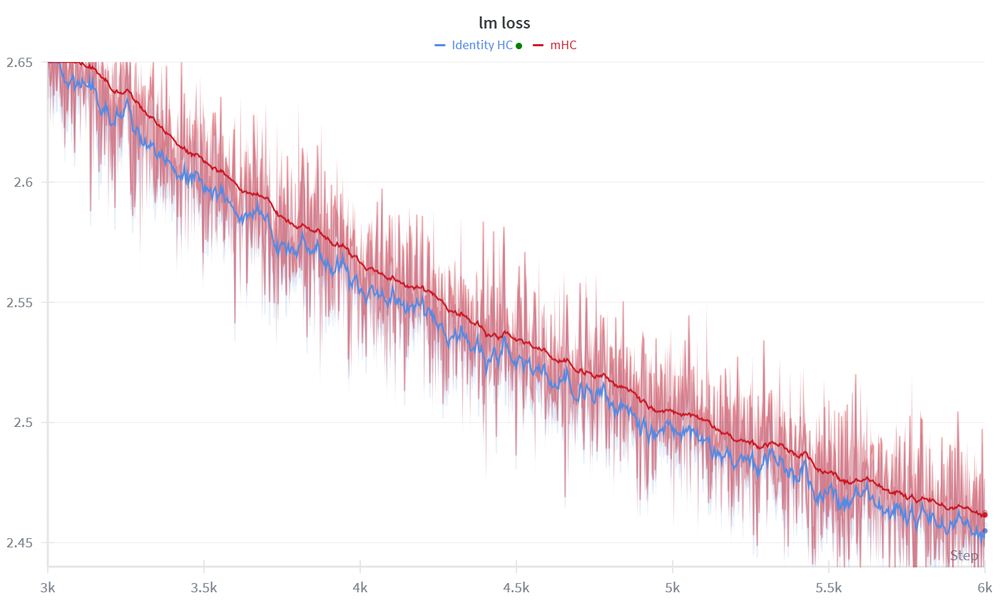
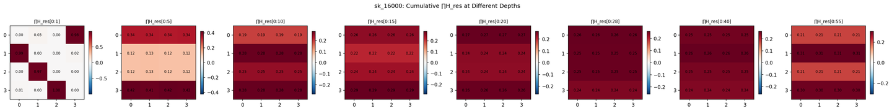

## 1. 残差连接（Residual Connection）

多说无益，直接上公式：

\[
    h_{l+1} = h_l + \mathcal{T}(h_l)
\]

其中，$h_l$ 是第 $l$ 层的输入，$\mathcal{T}$ 是一个神经网络层（如卷积层、注意力层或全连接层）。

## 2. 超连接（Hyper-Connection，HC）

> 先吐槽一下，原文写的并不够清晰，甚至有些混乱...

思想：[超连接](http://arxiv.org/abs/2409.19606)将残差连接转变为“矩阵读写”形式，然后将固定矩阵转变为可学习矩阵。

\[
    \mathbf{H}^{l+1} = \mathbf{A}_r \mathbf{H}^l + \mathbf{B} \mathcal{T}(\mathbf{A}_m^{\top} \mathbf{H}^l)
\]



### 2.1. “单条残差流”到“多条残差流”的转变

传统的残差只有一条残差流，该残差流对隐层信息 \(\mathbf{h}^l\) 维护。

而超连接引入了多条残差流，每条残差流维护不同的隐层信息。具体做法是，对于初始输入 \(\mathbf{h}^0\)，根据超参数拓展率（expansion rate） \(n\) 将其复制 \(n\) 份，得到 \(n\) 条残差流：

\[
    \begin{aligned}
        \mathbf{h}^0_1 &= \mathbf{h}^0 \\
        \mathbf{h}^0_2 &= \mathbf{h}^0 \\
        &\vdots \\
        \mathbf{h}^0_n &= \mathbf{h}^0
    \end{aligned}
\]

每一条残差流均完成残差连接：

\[
    \mathbf{h}^{l+1}_i = \mathbf{h}^l_i + \mathcal{T}(\mathbf{h}^l_i), \quad i = 1, 2, \ldots, n
\]

我们可以将残差流写成一个矩阵的形式：

\[
    \mathbf{H}^l = \begin{bmatrix}
        \mathbf{h}^l_1 \\
        \mathbf{h}^l_2 \\
        \vdots \\
        \mathbf{h}^l_n
    \end{bmatrix}
\]

### 2.2. 残差流的信息整合

对于神经网络层 \(\mathcal{T}\)，往往只接受单个隐层输入 \(\mathbf{h}^l\)，而不是矩阵 \(\mathbf{H}^l\)。因此，需要将矩阵 \(\mathbf{H}^l\) 中的多条残差流整合成一个隐层输入：

\[
    \mathbf{h}^l_0 = \alpha_1 \mathbf{h}^l_1 + \alpha_2 \mathbf{h}^l_2 + \ldots + \alpha_n \mathbf{h}^l_n. = \mathbf{A}_m^{\top} \mathbf{H}^l
\]

其中，\(\alpha_i\) 是可学习的权重，\(\mathbf{A}_m = [\alpha_1, \alpha_2, \ldots, \alpha_n]^\top\) 是一个可学习的权重矩阵。

### 2.3. 新信息和旧信息的融合

新信息为：

\[
    \mathcal{T}(\mathbf{h}^l_0) = \mathcal{T}(\mathbf{A}_m^{\top} \mathbf{H}^l)
\]

旧残差流信息为：

\[
    \mathbf{H}^l
\]

直接相加有点小无聊，我们可以引入一个新的可学习权重矩阵 \(\mathbf{A}_r \in \mathbb{R}^{n \times n}\) 来调整旧信息的权重；引入另一个可学习权重矩阵 \(\mathbf{B} \in \mathbb{R}^{n}\) 来调整新信息的权重：

\[
    \mathbf{H}^{l+1} = \mathbf{A}_r \mathbf{H}^l + \mathbf{B} \mathcal{T}(\mathbf{A}_m^{\top} \mathbf{H}^l)
\]

这便是固定超连接（Static Hyper-Connection，SHC）的核心公式。

### 2.4. 动态超连接（Dynamic Hyper-Connection，DHC）

直接上公式吧，论文中没讲它们的设计初衷是什么...：

\[
    \overline{\mathbf{H}} = \text{norm}(\mathbf{H}) \\
    \mathcal{B} = s_\beta \cdot \text{tanh}(\mathbf{W}_\beta \overline{\mathbf{H}}) + \mathbf{B} \\
    \mathcal{A}_m = s_\alpha \cdot \text{tanh}(\mathbf{W}_m \overline{\mathbf{H}}) + \mathbf{A}_m \\
    \mathcal{A}_r = s_\alpha \cdot \text{tanh}(\mathbf{W}_r \overline{\mathbf{H}}) + \mathbf{A}_r \\
\]

其中动态参数 \(\mathbf{W}_\beta\), \(\mathbf{W}_m\), 和 \(\mathbf{W}_r\) 是可学习的权重矩阵。\(s_\alpha\) 和 \(s_\beta\) 是可学习因子。

\[
    \mathbf{H}^{l+1} = \mathcal{A}_r \mathbf{H}^l + \mathcal{B} \mathcal{T}(\mathcal{A}_m^{\top} \mathbf{H}^l)
\]

### 2.5. 优势

在参数量并没有明显增加的情况下，超连接能够显著提升模型性能。

## 3. 流形约束超连接（Manifold-Constrained Hyper-Connection，mHC）

### 3.1. 超连接的问题

单层超连接：

\[
    \mathbf{H}^{l+1} = \mathbf{A}_r \mathbf{H}^l + \mathbf{B} \mathcal{T}(\mathbf{A}_m^{\top} \mathbf{H}^l)
\]

在 [mHC](https://arxiv.org/abs/2512.24880) 的论文中，将 \(\mathbf{H}^{l+1}\) 写作 \(\mathbf{x}_{i+1}\)，\(\mathbf{H}^l\) 写作 \(\mathbf{x}_i\)，\(\mathbf{A}_r\) 写作 \(\mathcal{H}^{res}_i\)，\(\mathbf{B}\) 写作 \({\mathcal{H}^{post}_i}^\top\)，\(\mathbf{A}_m\) 写作 \(\mathcal{H}^{pre}_i\)，\(\mathcal{T}\) 写作 \(\mathcal{F}_i\)，则单层超连接可以写作：

\[
    \mathbf{x}_{i+1} = \mathcal{H}^{res}_i \mathbf{x}_i + {\mathcal{H}^{post}_i}^\top \mathcal{F}_i(\mathcal{H}^{pre}_i \mathbf{x}_i)
\]

这样的写法，我认为更加的易于理解。

两层超连接可以写为：

\[
    \mathbf{x}_{i+2} = \mathcal{H}^{res}_{i+1} \mathbf{x}_{i+1} + {\mathcal{H}^{post}_{i+1}}^\top \mathcal{F}_{i+1}(\mathcal{H}^{pre}_{i+1} \mathbf{x}_{i+1}) \\
    = \mathcal{H}^{res}_{i+1} (\mathcal{H}^{res}_i \mathbf{x}_i + {\mathcal{H}^{post}_i}^\top \mathcal{F}_i(\mathcal{H}^{pre}_i \mathbf{x}_i)) + {\mathcal{H}^{post}_{i+1}}^\top \mathcal{F}_{i+1}(\mathcal{H}^{pre}_{i+1} \mathbf{x}_{i+1}) \\
    = \mathcal{H}^{res}_{i+1} \mathcal{H}^{res}_i \mathbf{x}_i + \mathcal{H}^{res}_{i+1} {\mathcal{H}^{post}_i}^\top \mathcal{F}_i(\mathcal{H}^{pre}_i \mathbf{x}_i) + {\mathcal{H}^{post}_{i+1}}^\top \mathcal{F}_{i+1}(\mathcal{H}^{pre}_{i+1} \mathbf{x}_{i+1})
\]

不难推导出，多层超连接可以写为：

\[
    \mathbf{x}_{L} = \mathcal{H}^{res}_{L-1} \cdots \mathcal{H}^{res}_{L-l} \mathbf{x}_l + \sum_{i=l}^{L-1} \left( \mathcal{H}^{res}_{L-1} \cdots \mathcal{H}^{res}_{i+1} {\mathcal{H}^{post}_i}^\top \mathcal{F}_i(\mathcal{H}^{pre}_i \mathbf{x}_i) \right) \\
    = \left( \prod_{i=l}^{L-1} \mathcal{H}^{res}_i \right) \mathbf{x}_l + \sum_{i=l}^{L-1} \left( \prod_{j=1}^{L-1-i} \mathcal{H}^{res}_{L-j} \right) {\mathcal{H}^{post}_i}^\top \mathcal{F}_i(\mathcal{H}^{pre}_i \mathbf{x}_i)
\]

其中，旧信息流为 \(\left( \prod_{i=l}^{L-1} \mathcal{H}^{res}_i \right) \mathbf{x}_l\)，新信息流为 \(\sum_{i=l}^{L-1} \left( \prod_{j=1}^{L-1-i} \mathcal{H}^{res}_{L-j} \right) {\mathcal{H}^{post}_i}^\top \mathcal{F}_i(\mathcal{H}^{pre}_i \mathbf{x}_i)\)。

更其中，旧信息流的系数为 \(\prod_{i=l}^{L-1} \mathcal{H}^{res}_i\)。在经典的残差连接中，由于旧信息的系数为 1，因此旧信息流的范数不会发生变化；而在超连接中，旧信息流的系数为 \(\prod_{i=l}^{L-1} \mathcal{H}^{res}_i\)，因此旧信息流的范数可能会发生变化，会对模型的信息和梯度的传递产生影响。

关于范数对梯度和信息的影响

观察 \(\mathcal{H}^{res}_{L-1} \cdots \mathcal{H}^{res}_{L-l} \mathbf{x}_l\) 的范数上界：

\[
    \| \mathcal{H}^{res}_{L-1} \cdots \mathcal{H}^{res}_{L-l} \mathbf{x}_l \| \leq \left( \prod_{i=l}^{L-1} \| \mathcal{H}^{res}_i \| \right) \| \mathbf{x}_l \|
\]

假如 \(\| \mathcal{H}^{res}_i \| = 0.9\)，那么经过 100 层后，旧信息流的范数上界为 \(0.9^{100} \| \mathbf{x}_l \| \approx 2.6561 \times 10^{-5} \| \mathbf{x}_l \|\)，信息的传递几乎消失；假如 \(\| \mathcal{H}^{res}_i \| = 1.1\)，那么经过 100 层后，旧信息流的范数上界为 \(1.1^{100} \| \mathbf{x}_l \| \approx 13780.6123 \| \mathbf{x}_l \|\)，信息就会被放大一万多倍。

反向传播时，梯度会乘雅可比矩阵的转置：

\[
    \frac{\partial \mathcal{L}}{\partial \mathbf{x}_l} = \left( \frac{\partial \mathbf{x}_{l+1}}{\partial \mathbf{x}_l} \right)^\top \left( \frac{\partial \mathcal{x}_{l+2}}{\partial \mathbf{x}_{l+1}} \right)^\top \cdots \left( \frac{\partial \mathbf{x}_{L}}{\partial \mathbf{x}_{L-1}} \right)^\top \frac{\partial \mathcal{L}}{\partial \mathbf{x}_L} \\
    = J_l^\top J_{l+1}^\top \cdots J_{L-1}^\top \frac{\partial \mathcal{L}}{\partial \mathbf{x}_L}
\]

如果这些雅可比矩阵的奇异值多数小于 1，梯度往浅层传时就会越来越小，也就是梯度消失。
如果多数大于 1，就会越来越大，也就是梯度爆炸。

mHC 论文证明了 HC 的训练不够稳定，同时由于额外的学习参数的存在，HC 受内存访问的限制极大影响模型的训练速度。



### 3.2. mHC 的设计

为了解决 HC 的训练不稳定的问题，mHC 限制 \(\mathcal{H}^{\mathrm{res}}_l\) 在一个特殊集合里：

\[
\mathcal{P}_{\mathcal{M}^{\mathrm{res}}}
\left(\mathcal{H}^{\mathrm{res}}_l\right)
:=
\left\{
\mathcal{H}^{\mathrm{res}}_l \in \mathbb{R}^{n \times n}
\ \middle|\
\mathcal{H}^{\mathrm{res}}_l \mathbf{1}_n = \mathbf{1}_n,\ 
\mathbf{1}_n^{\top}\mathcal{H}^{\mathrm{res}}_l = \mathbf{1}_n^{\top},\ 
\mathcal{H}^{\mathrm{res}}_l \geq 0
\right\}.
\]

我们称这样的矩阵为双随机矩阵（Doubly Stochastic Matrix）。它的好处是：
1. 范数上限为：\(\| \mathcal{H}^{\mathrm{res}}_l \| \leq 1\)，避免梯度爆炸；
2. 复合封闭性：两个双随机矩阵的乘积仍然是双随机矩阵。
3. 符合 Birkhoff 多面体（Birkhoff Polytope）的性质：所有双随机矩阵都可以写成若干置换矩阵（Permutation Matrices）的凸组合。也就是说 \(\mathcal{P}_{\mathcal{M}^{\mathrm{res}}} \left(\mathcal{H}^{\mathrm{res}}_l\right) \) 可能写作：

\[
\mathcal{P}_{\mathcal{M}^{\mathrm{res}}} \left(\mathcal{H}^{\mathrm{res}}_l\right) = 
\begin{bmatrix}
0.5 & 0.5 \\
0.5 & 0.5
\end{bmatrix} = 0.5 \begin{bmatrix}
0 & 1 \\
1 & 0
\end{bmatrix} + 0.5 \begin{bmatrix}
1 & 0 \\
0 & 1
\end{bmatrix}
\]

置换矩阵

置换矩阵就是每一行、每一列恰好有一个 1，其余都是 0 的矩阵。例如，以下是一个 4x4 的置换矩阵：
\[
    P = \begin{bmatrix}
        0 & 1 & 0 & 0 \\
        0 & 0 & 1 & 0 \\
        0 & 0 & 0 & 1 \\
        1 & 0 & 0 & 0
    \end{bmatrix}
\]

\(\mathcal{H}^{\mathrm{res}}_l\) 不是任意矩阵，而是多条残差信息流的“概率式软置换 / 软混合”。这种约束让多层残差映射更稳定、更可解释，也更不容易梯度爆炸。

mHC 的完整设计为：

\[
\left\{
\begin{aligned}
\vec{\mathbf{x}}'_l &= \mathrm{RMSNorm}(\vec{\mathbf{x}}_l) \\[2pt]
\tilde{\mathcal{H}}^{\mathrm{pre}}_l
&= \alpha^{\mathrm{pre}}_l \cdot
\left(\vec{\mathbf{x}}'_l \varphi^{\mathrm{pre}}_l\right) + \mathbf{b}^{\mathrm{pre}}_l \\[2pt]
\tilde{\mathcal{H}}^{\mathrm{post}}_l
&= \alpha^{\mathrm{post}}_l \cdot
\left(\vec{\mathbf{x}}'_l \varphi^{\mathrm{post}}_l\right) + \mathbf{b}^{\mathrm{post}}_l \\[2pt]
\tilde{\mathcal{H}}^{\mathrm{res}}_l
&= \alpha^{\mathrm{res}}_l \cdot
\mathrm{mat}\!\left(\vec{\mathbf{x}}'_l \varphi^{\mathrm{res}}_l\right) + \mathbf{b}^{\mathrm{res}}_l
\end{aligned}
\right.
\]

\[
\left\{
\begin{aligned}
\mathcal{H}^{\mathrm{pre}}_l
&= \sigma\!\left(\tilde{\mathcal{H}}^{\mathrm{pre}}_l\right) \\[2pt]
\mathcal{H}^{\mathrm{post}}_l
&= 2\sigma\!\left(\tilde{\mathcal{H}}^{\mathrm{post}}_l\right) \\[2pt]
\mathcal{H}^{\mathrm{res}}_l
&= \mathrm{Sinkhorn\text{-}Knopp}
\!\left(\tilde{\mathcal{H}}^{\mathrm{res}}_l\right)
\end{aligned}
\right.
\]

\[
\mathbf{M}^{(t)} = \mathcal{T}_r
\left(
\mathcal{T}_c
\left(
\mathbf{M}^{(t-1)}
\right)
\right)
\]

其中 \(\vec{\mathbf{x}}_l \in \mathbb{R}^{1 \times nC}\) 是 \(\mathbf{x}_l \in \mathbb{R}^{n \times C}\) 的展开形式。\(\varphi^{\cdot}_l\) 是线性变换的权重矩阵，\(\mathbf{b}^{\cdot}_l\) 是偏置项，\(\alpha^{\cdot}_l\) 是可学习的缩放因子。\(\sigma\) 是 Sigmoid 函数，\(\mathrm{mat}\) 是将向量（\(\mathbb{R}^{1 \times n^2}\)）转换为矩阵（\(\mathbb{R}^{n \times n}\)）的操作，\(\mathrm{Sinkhorn\text{-}Knopp}\) 是一个将矩阵转换为双随机矩阵的算法。\(\mathrm{Sinkhorn\text{-}Knopp}\) 的具体实现为：

\[
    \mathbf{M}^{(0)} = \exp\!\left(\tilde{\mathcal{H}}^{\mathrm{res}}_l\right), \\
    \mathbf{M}^{(t)} = \mathcal{T}_r\!\left(\mathcal{T}_c\!\left(\mathbf{M}^{(t-1)}\right)\right)
\]

当 \(t \to \infty\) 时，\(\mathbf{M}^{(t)}\) 会收敛到一个双随机矩阵（Sinkhorn 定理的保证）。其中 \(\mathcal{T}_c\) 是列归一化——每个元素除以所在列的列和，使每列和为 1；\(\mathcal{T}_r\) 是行归一化——每个元素除以所在行的行和，使每行和为 1：

\[
\mathcal{T}_c(\mathbf{M})_{ij} = \frac{M_{ij}}{\sum_i M_{ij}}, \quad
\mathcal{T}_r(\mathbf{M})_{ij} = \frac{M_{ij}}{\sum_j M_{ij}}
\]

即每轮先做列归一化、再做行归一化。原文只定性说明二者是“行归一化”和“列归一化”，并未给出分量公式；实际实现取 \(t_{\max} = 20\)，得到的是近似解。

### 3.3. mHC 的工程设计（Infrastructure Design）

1. 计算核融合（Kernel Fusion）：小操作太多，反复读写显存，kernel launch overhead 大；将多个小操作融合成一个大操作，减少显存访问和 kernel launch overhead。
2. 重计算（Recomputation）：前向不存中间量，反向时重新计算。
3. 通信计算重叠（Communication-Computation Overlap）：n 个信息流通信开销增大；通信和计算重叠，减少通信开销。

### 3.4. Single-Pass mHC：错位一格消除数据依赖

[DeepSeek-V4.1-Flash](https://huggingface.co/deepseek-ai/DeepSeek-V4.1-Flash/blob/main/DeepSeek_V41_Tech_Report.pdf) 沿用了 mHC，但对实现做了改进。技术报告把 mHC 写成更紧凑的形式：

\[
X_{l+1} = B_l X_l + C_l F_l(A_l X_l), \quad (A_l, B_l, C_l) = H(X_l)
\]

其中 \(X_l \in \mathbb{R}^{n \times d}\) 是相邻 block 之间的 \(n\) 条残差流（对应上文记法中的 \(\mathbf{x}_l\)），\(B_l \in \mathbb{R}^{n \times n}\) 是残差混合矩阵（即 \(\mathcal{H}^{\mathrm{res}}_l\)），\(A_l \in \mathbb{R}^{1 \times n}\) 与 \(C_l \in \mathbb{R}^{n \times 1}\) 分别是输入混合与输出收缩系数（对应 \(\mathcal{H}^{\mathrm{pre}}_l\) 与 \(\mathcal{H}^{\mathrm{post}}_l\) 的角色），三者由系数预测器 \(H\) 从 \(X_l\) 预测得到。

**原实现的问题**：DeepSeek-V4 用三个 kernel 顺序执行上式——残差更新、系数预测、输入混合：

\[
X_l = B_{l-1} X_{l-1} + C_{l-1} Y_{l-1} \quad \text{（残差更新，对 } n \text{ 收缩）}
\]

\[
(A_l, B_l, C_l) = H(X_l) \quad \text{（系数预测，对 } nd \text{ 收缩）}
\]

\[
\hat{X}_l = A_l X_l \quad \text{（输入混合，对 } n \text{ 收缩）}
\]

**Single-Pass mHC 的改进**：把输入混合系数错位一格，每个 block 使用上一个 block 预测的系数 \(A_{l-1}\)：

\[
X_{l+1} = B_l X_l + C_l F_l(A_{l-1} X_l), \quad (A_l, B_l, C_l) = H(X_l)
\]

输入混合不再依赖本 block 的系数预测，\(X_l\) 的每个 tile 算出来就可以立刻同时用于输入混合和系数预测，无需等待完整 reduction。实验表明这一步错位带来的性能损失可忽略。

**Mega-mHC 内核**：部署时把残差更新、输入混合、系数预测融合为单个 kernel。它沿 hidden 维度按 tile 处理 \(X_l\)：每个 tile 既计算混合输入，又累加预测下一 block 系数所需的统计量。三种实现的对比：

| 实现 | 内核数 | 说明 | 激活内存流量（读 + 写） |
|------|--------|------|----------------------|
| DeepSeek-V4 原实现 | 3 | 残差更新、系数预测、输入混合顺序执行 | \((4n+4)d\) |
| Mega-mHC（无错位） | 1 | 三操作融合；仍受 \(A_l\) 依赖，需两遍遍历 | \((3n+2)d\) |
| Mega-mHC + Single-Pass mHC | 1 | 融合 + 系数错位一格 | \((2n+2)d\)（理论下界，减半） |

残差因此只读一次、写一次。

错位在训练与推理中都生效——预训练阶段的模型就已经使用 \(A_{l-1}\) 的语义，只是仍用多 kernel 实现（错位只改变每个 block 使用哪一份系数）；Mega-mHC 的内核融合属于部署侧优化，只在部署时使用。

## 4. 恒等超连接（Identity Hyper-Connection，iHC）

一篇[知乎博客](https://zhuanlan.zhihu.com/p/2010852389670908320)报告了这样的实验结论：**把 mHC 的 \(\mathcal{H}^{\mathrm{res}}\) 直接换成单位阵 \(I\)，效果反而更好**——排序为 Identity HC > mHC > mHC lite > mHC orthogonal。实验在 Qwen3 1.7B 与 8B dense 上从头训练 150B tokens 完成，属于小规模个人实验、未经同行评审，以下内容仅供参考。

iHC 的做法是把 mHC 更新式中的 \(\mathcal{H}^{\mathrm{res}}_l\) 直接换成单位阵 \(I\)：

\[\mathbf{x}_{l+1} = \mathbf{x}_l + \mathrm{diag}\left(\mathcal{H}^{\mathrm{post}}_l\right) \mathcal{F}_l\left(\mathcal{H}^{\mathrm{pre}}_l \mathbf{x}_l\right)\]

<figure>
  
  <figcaption>Qwen3 1.7B 从头训练 150B tokens 的部分训练曲线截图。图源：<a href="https://zhuanlan.zhihu.com/p/2010852389670908320">知乎博客《你的 DeepSeek mHC 可能不需要 “m”》</a>。</figcaption>
</figure>

### 4.1. 观察：\(\mathcal{H}^{\mathrm{res}}\) 的累乘坍缩

训练后的 mHC 学出的 \(\mathcal{H}^{\mathrm{res}}\) 呈现如下模式：

- 单层（depth = 1）：接近单位阵——对角线约 0.96，非对角线约 0.01；
- 累积乘积（depth ≥ 10）：坍缩为全 0.25 矩阵（均匀混合）。

也就是说，Sinkhorn-Knopp 学到的单层 \(\mathcal{H}^{\mathrm{res}}\) 接近单位阵，但多层连乘后变成全 0.25 矩阵，\(n = 4\) 条残差流的信息被完全同质化。

<figure>
  
  <figcaption>多层 \(\mathcal{H}^{\mathrm{res}}\) 的累积：10 层之后，4 条流的信息完全坍缩为均匀混合。图源：<a href="https://zhuanlan.zhihu.com/p/2010852389670908320">知乎博客《你的 DeepSeek mHC 可能不需要 “m”》</a>。</figcaption>
</figure>

背后的数学原因：满足一致正性条件（所有元素有正下界 \(\delta > 0\)）的双随机矩阵，其 Dobrushin 遍历系数 \(\tau(P) \leq 1 - d\delta < 1\)，连乘的遍历系数以几何速率衰减 \(\tau(A_n) \leq (1 - d\delta)^n \to 0\)，迫使所有行趋于一致，最终收敛到均匀矩阵 \(\frac{1}{d}\mathbf{1}\mathbf{1}^\top\)。纯置换矩阵或可约矩阵不满足一致正性条件、不会坍缩，但 Sinkhorn 输出的矩阵通常是严格正的，满足此条件。

Perron-Frobenius 定理给出同样的结论：双随机矩阵的最大特征值为 1，其余特征值模长小于 1（只要不是可约置换矩阵），累积乘积的最小奇异值满足

\[\sigma_{\min}\left(\prod_{l=1}^L H_l\right) \lesssim \prod_{l=1}^L |\lambda_{\min}(H_l)|\]

其中 \(\lambda_{\min}(H_l)\) 是各层双随机矩阵**模长最小的特征值**——特征值满足 \(H_l v = \lambda v\)，双随机矩阵的最大特征值为 1，其余特征值的模长都小于 1；\(\sigma_{\min}\) 是**最小奇异值**，即矩阵对向量做拉伸时最小的拉伸倍数。对任意矩阵，最小奇异值都不超过任何一个特征值的模长，于是原文以 \(\lesssim\) 给出启发式上界：\(L\) 层连乘的最小奇异值被各层最小特征值模长的乘积界定。\(\sigma_{\min}\) 趋近于 0 意味着存在某个方向，信号经过多层后会被（几乎）完全压缩掉——这正是 3.1 节讨论的信号消失。

当 \(|\lambda_{\min}| < 1\) 时，这个乘积指数衰减到零。在 Qwen3-1.7B（28 层、56 个 HC 模块）上，Sinkhorn 版 \(\mathcal{H}^{\mathrm{res}}\) 的最小特征值均值为 0.49，估计 \(\sigma_{\min} \sim 0.49^{56} \approx 10^{-17}\)，实测为 \(9.2 \times 10^{-18}\)——浅层信号经过 56 个 HC 模块后，除均值方向外基本衰减殆尽。

此外，20 步 Sinkhorn-Knopp 迭代并不保证收敛：实测行和的标准差为 0.12，误差会在多层中累积；mHC lite 也报告约 27.9% 的输入相对范围 \(1/\nu \geq 10^{13}\)，此时 20 步迭代后的列和偏差可达 100%。

### 4.2. Identity 的优势

单位阵本身也是双随机矩阵（行列和均为 1、谱范数为 1，完全 norm-preserving），是最简单的 manifold constraint。\(H^{\mathrm{res}} = I\) 的含义是：各残差流保留自己的信息，不与其他流交换。

有人会质疑：这不就退化到置换矩阵了吗？问题是，mHC 不同层学出的 \(\mathcal{H}^{\mathrm{res}}\) 是**不同的近似置换**——每层做一次流重排，流 1 在第 1 层之后变成流 3 的位置、第 5 层之后又变成流 2 的位置，\(\mathcal{H}^{\mathrm{pre}}\) 和 \(\mathcal{H}^{\mathrm{post}}\) 需要不断“追踪”每条流被重排到了哪里，增加了学习难度。Identity 的优势在于：

- 流 0 永远在位置 0——流的语义在深度方向上完全一致；
- \(\mathcal{H}^{\mathrm{pre}}\) / \(\mathcal{H}^{\mathrm{post}}\) 不需要适应流重排，直接学习“从哪条流读、往哪条流写”；
- 累积乘积 \(I^L = I\)，既不会坍缩也不会混乱。

跨流信息混合并没有因此消失：\(\varphi\) 投影把 \(n\) 条流 flatten 后投影到 \(n^2 + 2n\) 维，再拆分出 \(\mathcal{H}^{\mathrm{pre}}\)（\(n\) 维）、\(\mathcal{H}^{\mathrm{post}}\)（\(n\) 维）、\(\mathcal{H}^{\mathrm{res}}\)（\(n^2\) 维）。即使 \(H^{\mathrm{res}} = I\)，\(\varphi\) 生成的 \(\mathcal{H}^{\mathrm{pre}}\) 仍是 input-dependent 的，聚合与写回由 sigmoid 加权动态完成（更新公式见本节开头）。

### 4.3. 对比与失败的替代方案

| 指标 | Sinkhorn | Identity |
|------|----------|----------|
| 累积乘积 | rank-1 坍缩（\(\kappa = 10^{17}\)） | \(I\)（\(\kappa = 1\)） |
| 近似误差 | 行和 std = 0.12 | 精确 |
| 额外计算 | 20 步迭代 + 反向重计算 | 零 |
| 额外参数 | \(nC \times n^2\) 投影权重 | 无 |
| 信号传递 | 浅层信号指数衰减 | 无损传递 |

作者也尝试过其他替代方案，均不如原版 mHC：

- **mHC lite（凸组合做精确双随机，softmax 加权）**：1.7B 上效果不如原版 mHC。观察到 \(\alpha_{\mathrm{res}}\) 增大（从 0.01 增长到 2 附近）时，softmax 温度降低、输出趋向 one-hot，流间混合反而变少。
- **正交化（Cayley 变换、Givens 旋转）**：谱范数恒为 1，不爆炸也不消失；但 \(\alpha_{\mathrm{res}}\) 几乎不动（停在 0.01 附近），且允许负值使某些流被取反，导致容量坍缩。

该方法也已经落地：腾讯混元 4 Preview（[Hy4-preview](https://huggingface.co/tencent/Hy4-preview)）的残差通路采用的就是 iHC——官方模型卡描述为“残差通路采用 iHC（identity Hyper-Connections）以扩展层间信息流动”，模型共 4 条残差流，去掉了 Sinkhorn 约束、把 \(H^{\mathrm{res}}\) 固定为恒等映射。