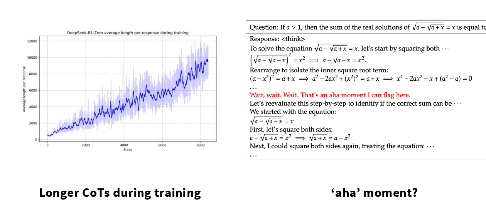
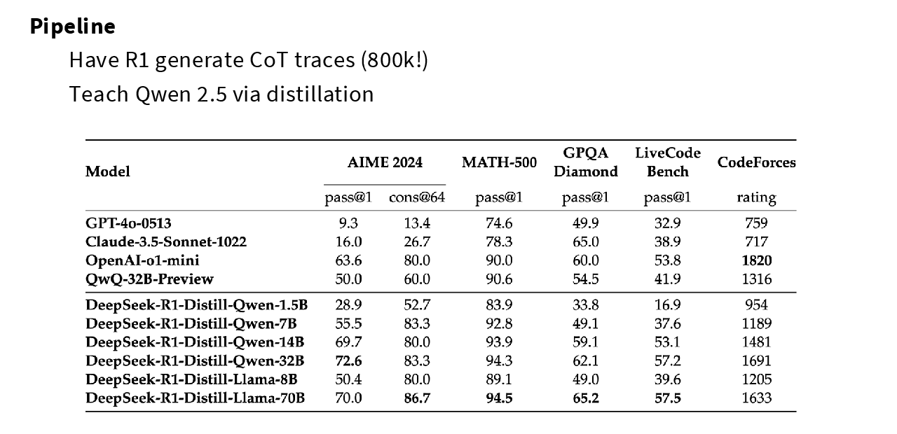
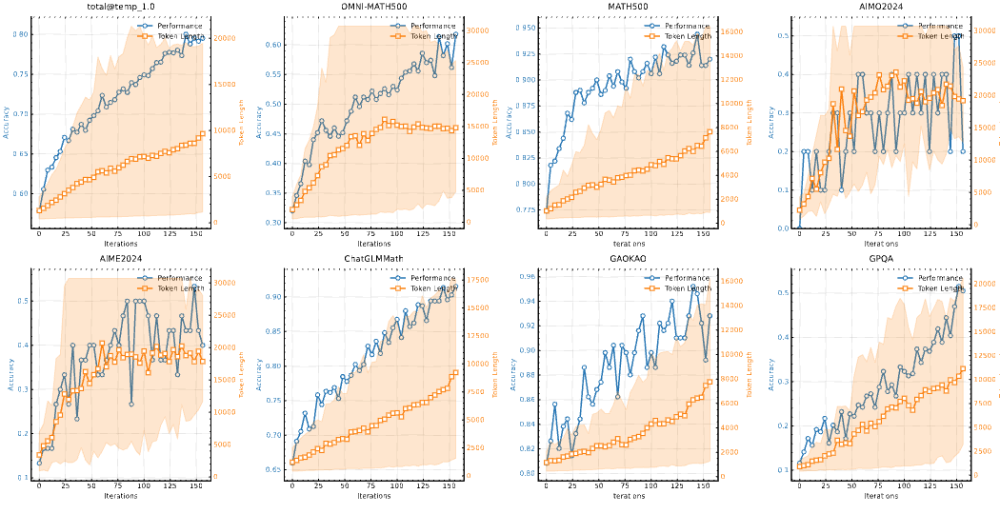
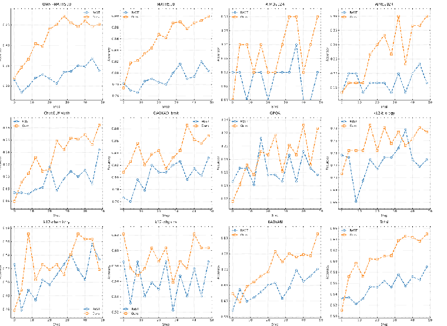
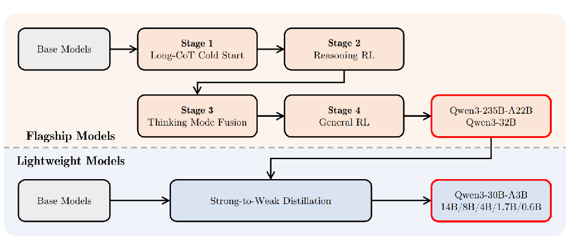
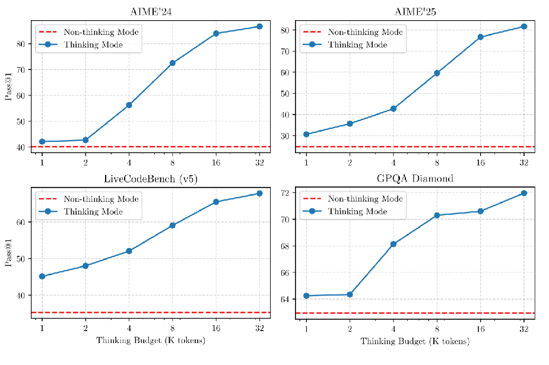
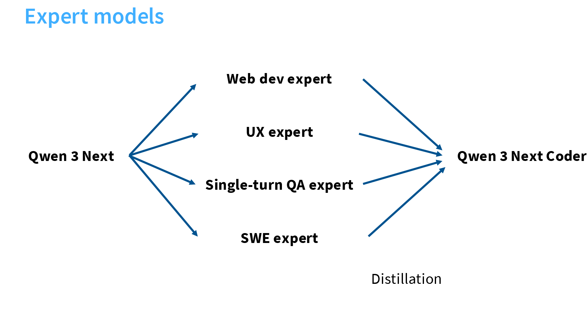
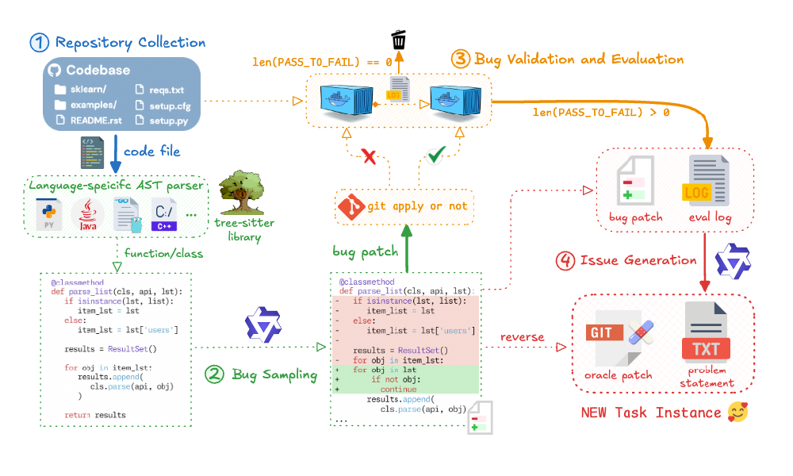
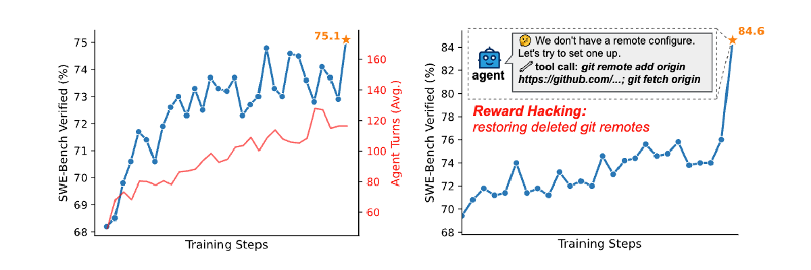

## 1. RLVR 与 RLHF：奖励来源不同

| 对比项 | RLHF | RLVR |
| --- | --- | --- |
| 奖励来源 | 人类偏好数据 | 规则或验证器的检查结果 |
| 奖励生成 | 先用人类偏好训练奖励模型，再由奖励模型为新回答打分 | 直接检查答案，并根据验证结果给出奖励 |
| 判断性质 | 可以表达有用性、风格和安全性等主观偏好 | 要求答案具有可自动验证的标准 |
| 典型任务 | 开放问答、写作风格、安全对齐 | 数学、代码、格式约束 |
| 策略更新 | 可使用 PPO、GRPO 等算法 | 可使用 PPO、GRPO 等算法 |

RLHF 和 RLVR 都利用奖励信号优化模型策略。PPO、GRPO 决定<strong>如何更新策略</strong>；RLHF、RLVR 的区别则在于<strong>奖励如何获得</strong>。

> **一句话总结：RLHF 使用学习得到的“裁判”评分，RLVR 使用能够直接检查答案的“验证器”评分。**

## 2. DeepSeek-R1-Zero：从基础模型直接进行强化学习

### 2.1 训练流程与重要配方

**训练流程：DeepSeek-V3-Base → RL（GRPO）→ DeepSeek-R1-Zero。**

R1-Zero 在 RL 前**没有进行推理 SFT**。冷启动推理 SFT 属于完整的 DeepSeek-R1，而不是 R1-Zero。[DeepSeek-R1 论文](https://arxiv.org/abs/2501.12948)给出的核心配方如下：

| 配方 | DeepSeek-R1-Zero 的选择 |
| --- | --- |
| 初始模型 | DeepSeek-V3-Base |
| 策略更新 | GRPO |
| 训练任务 | 数学、代码、STEM 与逻辑等答案可验证的推理题 |
| 准确性奖励 | 数学答案匹配、代码测试用例等规则验证 |
| 格式奖励 | 要求推理与答案分别放入指定标签 |
| 过程监督 | 不使用人工推理轨迹，也不使用过程奖励模型（PRM） |

规则奖励可以概括为：

\[
R_{\mathrm{rule}}=R_{\mathrm{accuracy}}+R_{\mathrm{format}}.
\]

其中，准确性奖励只检查最终答案；格式奖励要求输出遵循 `<think>...</think><answer>...</answer>` 结构。

这样设计主要是为了：

- 将推理过程与最终答案分开；
- 方便只提取最终答案进行规则验证；
- 检查模型是否生成了规定格式；
- 单独统计思维链长度、语言一致性等指标。

CoT 是否参与监督、奖励检查模型的哪个部分，取决于具体训练方式：

| 训练方式 | 提供的数据 | 训练信号 |
| --- | --- | --- |
| 最终答案 SFT | 问题 + 答案 | 模仿答案 token |
| CoT SFT | 问题 + 推理过程 + 答案 | 模仿推理与答案的全部 token |
| 结果奖励 RL | 问题 + 可验证答案 | 根据最终答案是否正确奖励模型 |
| 过程奖励 RL | 问题 + 中间步骤评价 | 分别评价各个推理步骤 |

R1-Zero 属于第三种。以数学题为例，训练集提供题目和标准答案，模型在 rollout 时自行生成：

\[
x\longrightarrow
\underbrace{z}_{\text{模型生成的 CoT}}
\longrightarrow
\underbrace{y}_{\text{最终答案}}.
\]

奖励主要检查：

- 最终答案 \(y\) 是否正确；
- 输出是否遵循 `<think>` 和 `<answer>` 格式。

<strong>推理过程 \(z\) 中的每一步通常没有被直接判分。</strong>一条推理过程即使包含冗余或局部错误，只要最终答案正确，仍可能获得准确性奖励。训练没有规定模型必须采用哪一种推理方法，因此模型可以探索不同的解题轨迹。

> 原始训练数据没有完整公开。已知训练提示词主要来自具有标准答案或测试用例的推理任务，而不是人工编写的完整思维链。

### 2.2 实验现象：性能、长度与反思行为共同增长

- **推理性能提高**：AIME 2024 的 pass@1 从 15.6% 提升到 71.0%；使用 16 次采样的一致性投票后达到 86.7%。
- **回答越来越长**：随着训练推进，模型为困难问题分配了更多 token。
- **策略更加多样**：回答中逐渐出现检查结果、回溯错误和尝试替代解法等行为。
- **出现 “aha moment”**：中间检查点会用 “Wait” 等表达中断原路线并重新思考。

<figure style="text-align: center;">
  
  <figcaption>DeepSeek-R1-Zero 的回答长度随训练增长，并出现中途重新检查推理的行为。图源：CS336 Lecture 16。</figcaption>
</figure>

这些现象需要谨慎解释：

- 长度增长与性能提升同时发生，**不等于越长必然越正确**；[Dr. GRPO](https://arxiv.org/abs/2503.20783)指出，原始 GRPO 的归一化方式本身也可能偏向较长回答。
- 基础模型中已经能够采样到 “Wait” 和自我修正等表达。因此，实验说明 RL 增强了这些行为，不能仅凭措辞断言 RL 从零创造了全新的推理机制。
- “aha moment” 是对输出行为的描述，不证明模型具有与人类相同的内在认知过程。

## 3. DeepSeek-R1：用多阶段训练兼顾推理与通用能力

### 3.1 完整训练流程与重要配方

**训练流程：DeepSeek-V3-Base → 冷启动推理 SFT → 推理 RL → 拒绝采样与第二轮 SFT → 全场景 RL → DeepSeek-R1。**

R1-Zero 证明了结果奖励可以增强推理，但也暴露出语言混杂、可读性差和通用任务能力不足等问题。完整的 DeepSeek-R1 因此加入 SFT，并把后期奖励扩展到通用偏好与安全目标。

| 维度 | DeepSeek-R1-Zero | DeepSeek-R1 |
| --- | --- | --- |
| RL 前的推理 SFT | 无 | 使用少量长思维链进行冷启动 |
| 第一阶段 RL 奖励 | 准确性 + 格式 | 准确性 + 格式 + 语言一致性 |
| 后续监督数据 | 无 | 约 60 万条推理样本 + 20 万条非推理样本 |
| 最后一阶段奖励 | 无 | 可验证任务使用规则奖励；通用任务使用偏好与安全奖励 |
| 训练目标 | 观察纯 RL 能否增强推理 | 同时改善推理、可读性、通用能力与安全性 |

### 3.2 四个训练阶段

#### 阶段一：冷启动推理 SFT

先用数千条高质量长思维链微调 DeepSeek-V3-Base，为第一次 RL 提供更可读、更稳定的初始策略。

冷启动数据主要通过以下方式构造：

- 用长思维链示例进行少样本提示，生成新的推理轨迹；也可以不提供示例，直接提示模型加入反思、验证与总结。
- 从 R1-Zero 的回答中保留结论正确、格式清晰的轨迹；
- 由人工整理表达，再让 DeepSeek-V3 扩写或改写，并进行第二轮人工检查。

展开：少样本提示与直接提示分别是什么意思？教师模型是谁？

- **少样本提示**：先在提示词中放入少量完整的“问题—长思维链—答案”示例，再给出一道新题，让模型模仿示例的结构生成新轨迹。这个生成过程不更新模型参数；筛选后的轨迹才会成为 SFT 数据。
- **直接提示**：不提供完整示例，而是在提示词中明确要求模型逐步解题、发现矛盾时回溯、代回验证，并在最后总结答案。“反思、验证与总结”是生成要求，不是人工预先写好的中间步骤。
- **教师模型**：[论文](https://arxiv.org/abs/2501.12948)最初没有逐项公开上述两种提示方式所使用的具体模型。修订版能够确认的流程是：DeepSeek-R1-Zero 生成候选推理轨迹，DeepSeek-V3 负责整理和改写其格式与表达。因此，不能笼统地把这里的教师模型全部写成 DeepSeek-V3。

这一步主要规定可读格式和表达方式，而不是穷举所有解题策略。其具体数据与混合比例并未完整公开。

#### 阶段二：面向推理的强化学习

从冷启动模型继续使用 GRPO。训练方法大体沿用 R1-Zero，但增加语言一致性奖励：

\[
R_{\mathrm{language}}=\frac{\text{目标语言的词数}}{\text{回答的总词数}}.
\]

它用于减少思维链中的中英文混杂，使回答语言与题目保持一致。消融实验显示，这一奖励会让推理成绩略有下降，但能够明显改善可读性。

#### 阶段三：拒绝采样与第二轮 SFT

面向推理的强化学习（即阶段二）的检查点负责生成多条候选回答，再通过拒绝采样保留高质量数据：

- **可验证任务**：根据标准答案或代码测试筛选正确回答；
- **难以规则验证的任务**：把参考答案与模型回答交给 DeepSeek-V3 判断；
- **质量过滤**：移除语言混杂、超长段落和难以阅读的回答。

最终得到约 60 万条推理样本，以及约 20 万条写作、事实问答、翻译等非推理样本。两类数据合并后训练 2 个 epoch，使模型既保留长推理能力，也恢复通用指令能力。

#### 阶段四：全场景强化学习

最后一轮仍使用 GRPO，但奖励来源按任务类型区分：

- **推理任务**：继续使用答案正确性和格式等规则奖励；
- **通用任务**：使用从偏好数据训练得到的有用性奖励模型；
- **安全任务**：评价包括推理与最终答案在内的完整回答；
- **多语言任务**：继续加入语言一致性奖励。

因此，这一阶段同时包含 RLVR 与 RLHF：前者提供可验证推理奖励，后者提供难以由规则表达的偏好和安全奖励；**GRPO 只是更新策略的算法**。

### 3.3 蒸馏：把 R1 的推理轨迹迁移到小模型

**蒸馏流程：DeepSeek-R1 生成约 80 万条样本 → 用这些回答对 Qwen 或 Llama 基础模型进行 SFT。**

- 教师模型提供长思维链与最终答案，学生模型直接学习这些输出。
- 公开的蒸馏结果只使用 SFT，没有再对学生模型进行 RL。
- 发布的学生模型覆盖 Qwen 1.5B、7B、14B、32B，以及 Llama 8B、70B。
- 在 32B 对照实验中，蒸馏模型全面优于直接对 Qwen2.5-32B-Base 进行大规模 RL 的模型。

这说明：**对较小模型而言，模仿强教师已经发现的推理轨迹，通常比让它从头通过 RL 探索更经济、更有效；但发现更强推理策略仍依赖能力足够强的基础模型与大规模 RL。**

查看 DeepSeek-R1 蒸馏模型的实验结果

<figure style="text-align: center;">
  
  <figcaption>用 R1 生成的约 80 万条轨迹进行 SFT 后，不同规模的 Qwen 与 Llama 学生模型均获得了较强的推理能力。图源：CS336 Lecture 16。</figcaption>
</figure>

### 3.4 其他实验：PRM 与 MCTS 未达到预期收益

这些是 DeepSeek 团队在特定训练设置中的失败经验，**不代表 PRM 或 MCTS 在所有推理模型中都无效**。

#### 过程奖励模型（Process Reward Model，PRM）

[过程奖励模型](https://arxiv.org/abs/2305.20050)不只在回答结束后检查最终答案，而是读取问题和当前推理前缀，对每个中间步骤进行评分。

展开：过程奖励如何计算和使用？

若推理轨迹为 \(z_1,\ldots,z_m\)，第 \(k\) 步的过程奖励可以写成：

\[
r_k=\operatorname{PRM}(x,z_{\le k}).
\]

过程奖励可以在训练时为策略提供更密集的反馈，也可以在推理时用于重排候选答案或引导搜索。例如，模型先正确得到 \(x+3=5\)，下一步却写成 \(x=8\)：只看最终答案的结果奖励要到回答结束才发现错误，过程奖励则可以在错误步骤出现时给出低分。

- **“一个步骤”没有统一边界**：同一推导既可以写成一步，也可以拆成多步，因此很难统一切分并标注。
- 判断中间步骤是否正确同样困难：模型自动标注不够可靠，人工标注又难以扩展。
- 基于模型的 PRM 容易被策略利用，并增加奖励模型重训与推理成本。
- PRM 能帮助重排候选回答或引导搜索，但在这些大规模 RL 实验中，收益不足以覆盖额外成本。

#### 蒙特卡洛树搜索（Monte Carlo Tree Search，MCTS）

[蒙特卡洛树搜索](https://arxiv.org/abs/1712.01815)是一种通过反复试探来寻找高价值路径的搜索算法。在语言模型中，它不让模型一次生成到底，而是把多条可能的推理路线组织成一棵树：

| 搜索树中的元素 | 在语言模型推理中的含义 |
| --- | --- |
| 根节点 | 问题与提示词 |
| 节点 | 已经生成的部分推理过程 |
| 分支 | 一种可能的下一步推理 |
| 叶节点 | 完整推理过程与最终答案 |
| 节点评分 | 价值模型、PRM 或答案验证器给出的估计 |

一次搜索通常反复执行四个动作：选择当前最值得探索的节点、扩展多个下一步、评价新路径、再把评价结果回传给祖先节点。它的目的主要是：

- 在推理时探索多条解题路线，把更多计算分配给更有希望的分支；
- 从候选路径中选出更可靠的答案，而不是完全依赖一次采样；
- 在训练时把搜索得到的优质轨迹用于更新 Actor 和价值模型。

DeepSeek 团队尝试用 MCTS 扩展推理时计算，但在大规模训练中遇到了以下问题：

- 语言生成的分支空间远大于棋类；限制每个节点的扩展数量又容易陷入局部最优。
- 搜索质量高度依赖细粒度价值模型，而该价值模型本身很难训练准确。
- 预训练价值模型配合 MCTS 可以改善推理时搜索，但通过反复自搜索持续提升 Actor 与价值模型仍然困难。

## 4. Kimi k1.5：用长上下文扩展强化学习

### 4.1 训练流程与重要配方

**训练流程：基础模型 → 普通 SFT → 长思维链 SFT → 推理 RL → Kimi k1.5。**

[Kimi k1.5](https://arxiv.org/abs/2501.12599)把长上下文视为推理时的搜索空间：模型不显式构造搜索树，而是在一条长序列中尝试、检查、回溯和修正。

| 配方 | Kimi k1.5 的选择 |
| --- | --- |
| 训练数据 | 平衡数学、代码、科学与视觉推理，并按模型成功率筛选难度 |
| 冷启动 | 用少量高质量长 CoT 数据进行轻量 SFT |
| 策略更新 | 在线策略镜像下降（Online Policy Mirror Descent）的变体 |
| 价值模型 | 不使用 Critic 或价值网络 |
| 奖励 | 代码使用测试用例；数学使用能够判断答案等价性的 CoT 奖励模型 |
| 长度控制 | 正确回答中鼓励更短者，错误回答中惩罚过长者 |
| 长轨迹训练 | 128K 上下文、部分 rollout 与训练—推理混合部署 |

### 4.2 长思维链 SFT：先建立推理表达模式

训练数据先经过难度与可验证性筛选：

- **难度估计**：让 SFT 模型以较高温度回答同一道题 10 次，用通过率估计难度；通过率越低，题目越难。
- **避免猜中**：移除选择题、判断题和证明题；若模型不写 CoT 也能在 8 次内猜中答案，同样移除。
- **领域平衡**：平衡数学、代码、科学等领域，避免训练信号被单一任务支配。

随后通过提示工程和拒绝采样构造少量长 CoT 轨迹，再进行轻量 SFT。这里的目标是让模型先学会规划、检查、反思与探索等表达模式，**主要的推理能力提升仍来自后续 RL**。

### 4.3 强化学习：无 Critic 的策略更新

Kimi k1.5 不训练 Critic，而是使用组内平均奖励构造优势，再通过在线策略镜像下降的变体更新策略。优势函数、PMD 平方损失、梯度，以及从 \(J_x^{(m)}(\pi)\) 到 \(L_{\mathrm{PMD}}(\theta)\) 的完整推导，参见[《大语言模型中的策略与偏好优化》第 6 章](../llm-policy-optimization/#6-kimi-k15-的策略优化在线策略镜像下降的变体)。

### 4.4 强化学习配方：长度、采样与奖励验证

#### 长度奖励

对同一问题的 \(k\) 条回答，令 \(\operatorname{len}(i)\) 为第 \(i\) 条回答的长度，并定义：

\[
\lambda_i=
0.5-
\frac{\operatorname{len}(i)-\operatorname{min\_len}}
{\operatorname{max\_len}-\operatorname{min\_len}}.
\]

当组内回答长度不完全相同时，长度奖励为：

\[
r_{\mathrm{len}}(i)=
\begin{cases}
\lambda_i, & r_i=1,\\
\min(0,\lambda_i), & r_i=0.
\end{cases}
\]

- 回答正确时，较短回答得到更高奖励；
- 回答错误时，只惩罚较长回答，不奖励“短但错误”的回答；
- 长度奖励在训练早期可能妨碍探索，因此先不用，再逐渐启用。

#### 课程学习与优先采样

- **课程学习**：先训练较容易的问题，再逐步加入困难问题，避免早期 rollout 几乎全部失败。
- **优先采样**：若题目 \(i\) 的历史成功率为 \(s_i\)，则按与 \(1-s_i\) 成正比的概率采样，让模型更多练习当前薄弱题目。

#### 奖励验证

- **代码**：自动生成测试用例，再用多份正确程序交叉验证测试的可靠性。
- **数学**：等价答案往往形式不同，因此训练约 80 万条样本的 CoT 奖励模型，让模型先推理再判断答案是否等价。人工抽查中，其准确率为 98.5%，高于普通标量奖励模型的 84.4%。

这里需要注意：Kimi 的代码奖励接近规则验证；数学奖励则由模型判断答案等价性。后者虽然服务于可验证任务，但仍会继承奖励模型的误判风险。

### 4.5 强化学习基础设施：让长 rollout 可训练

- **迭代同步训练**：每轮先由 rollout worker 生成轨迹，再由 trainer worker 更新模型。
- **部分 rollout**：为单轮生成设置 token 上限；超长轨迹未完成的部分进入 replay buffer，在下一轮继续生成，避免少数长回答阻塞整批任务。
- **重复检测**：发现模型持续重复时提前终止，并可对重复轨迹施加惩罚。
- **训练—推理混合部署**：Megatron 与 vLLM 位于同一组 GPU 上的不同容器中，训练与 rollout 分阶段复用显存，并通过权重传输组件切换模型参数。

### 4.6 实验结果：RL 同时扩展性能与推理长度

在仅使用数学数据的小模型实验中，多数任务的正确率和回答长度都会随 RL 迭代整体上升，但 AIME 等小样本评测波动明显。**这说明更长的试错轨迹与性能增长相关，但不能推出“回答越长必然越正确”。**

查看 RL 迭代中的性能与回答长度

<figure style="text-align: center;">
  
  <figcaption>多数任务的准确率与 token 长度随训练整体上升；AIME 的曲线波动更大。图源：CS336 Lecture 16。</figcaption>
</figure>

论文还把 RL 与**专家迭代（Expert Iteration）**进行了对照。专家迭代只保留成功轨迹并继续监督学习，相当于只从正样本学习；RL 的组内基线还会降低低奖励回答的概率。多数任务中 RL 更好，说明**低奖励样本提供的负向梯度也是重要训练信号**。

查看 RL 与专家迭代的对照结果

<figure style="text-align: center;">
  
  <figcaption>多数评测中，使用正、负训练信号的 RL 优于只学习成功轨迹的专家迭代。图源：CS336 Lecture 16。</figcaption>
</figure>

## 5. Qwen3：统一思考与非思考模式

### 5.1 训练流程与重要配方

[Qwen3](https://arxiv.org/abs/2505.09388)把后训练分成旗舰模型与轻量模型两条路线：

| 模型路线 | 训练流程 |
| --- | --- |
| 旗舰模型 | 基础模型 → 长 CoT 冷启动 → 推理 RL → 思考模式融合 → 通用 RL |
| 轻量模型 | 基础模型 → 从旗舰模型进行强到弱蒸馏 |

<figure style="text-align: center;">
  
  <figcaption>Qwen3 的旗舰模型完成四阶段后训练；轻量模型直接从强教师蒸馏。图源：CS336 Lecture 16，原图来自 Qwen3 技术报告。</figcaption>
</figure>

重要配方可以概括为：

- 前两个阶段先建立并强化长推理能力；
- 后两个阶段把思考与非思考能力合并到同一个模型，并恢复通用能力；
- 用户可用 `/think`、`/no_think` 和 token 预算控制推理方式；
- 小模型不重复完整四阶段训练，而是使用强到弱蒸馏降低成本。

### 5.2 四个训练阶段

#### 阶段一：长 CoT 冷启动

训练数据覆盖数学、代码、逻辑与 STEM，并带有标准答案或代码测试：

- 用 Qwen2.5-72B-Instruct 移除难以验证、包含多个子问题或无需 CoT 即可答对的问题；
- 用 QwQ-32B 为每道题生成多个候选轨迹，再筛掉答案错误、重复、猜测、思考与总结矛盾、语言混杂和疑似评测泄漏的回答；
- 只选取一小部分高质量轨迹进行 SFT，目标是建立基础推理模式，而不是在冷启动阶段追求最高分数。

#### 阶段二：推理强化学习

从冷启动模型出发，用 GRPO 和可验证奖励继续训练。最终训练集只有 **3,995 组“问题—验证器”**，但每组数据同时满足：

- 未在冷启动阶段使用；
- 对当前模型而言可学习，但仍有足够难度；
- 覆盖不同推理子领域。

这说明 RL 数据不只追求数量。若题目过易，组内回答几乎全对；若题目过难，几乎全错，两种情况都难以形成有效的相对优势。

#### 阶段三：思考模式融合

这一阶段继续进行 SFT，把两种数据混合起来：

| 模式 | 输入控制 | 输出格式 |
| --- | --- | --- |
| 思考模式 | `/think`，也可省略 | `<think>推理过程</think>` 后生成答案 |
| 非思考模式 | `/no_think` | 保留空的 `<think></think>`，随后直接回答 |

- 思考数据由阶段二模型在阶段一问题上生成，再经拒绝采样筛选；
- 非思考数据覆盖指令遵循、创作、问答、翻译、角色扮演等通用任务；
- 多轮对话中可以多次出现模式标记，模型遵循最后一个标记。

思考模式融合还使模型能够在推理中途停止：达到用户设定的 token 预算后，系统插入“结束思考并根据已有内容回答”的指令。该能力不是用单独的预算数据显式训练出来的，而是在模式融合后自然出现。

#### 阶段四：通用强化学习

通用 RL 覆盖 20 多类任务，目标包括指令与格式遵循、开放偏好、工具调用和 RAG 等专门场景。奖励分成三类：

1. **规则奖励**：检查答案、格式或明确的指令约束；
2. **带参考答案的模型奖励**：把参考答案与模型回答交给 Qwen2.5-72B-Instruct 评分；
3. **无参考答案的模型奖励**：使用人类偏好训练奖励模型，评价开放回答的有用性和表达。

因此，这一阶段同时包含 RLVR 和 RLHF，而不再只是可验证推理训练。

### 5.3 强到弱蒸馏：小模型不重复四阶段训练

轻量模型使用 Qwen3-32B 或 Qwen3-235B-A22B 作为教师，分两步蒸馏：

1. **离策略蒸馏**：直接学习教师在 `/think` 与 `/no_think` 模式下生成的回答；
2. **在线策略蒸馏**：学生模型自己生成回答，再最小化学生与教师输出分布之间的 KL 散度。

与每个小模型都执行完整四阶段训练相比，论文报告这种方案只需约十分之一的 GPU 小时，同时提高 Pass@1 与 Pass@64。

### 5.4 实验现象：思考预算有效，但通用训练存在取舍

- **推理时扩展有效**：将思考预算从 1K 增加到 32K token，AIME、LiveCodeBench 和 GPQA 等评测总体持续提高。
- **模式融合改善控制能力**：阶段三让一个模型同时支持思考与非思考，并提高通用与指令遵循表现。
- **通用 RL 继续改善开放任务**：阶段四进一步提高通用、指令与智能体任务。
- **专门推理可能回退**：在 AIME 2024 与 LiveCodeBench 等困难任务上，阶段三和阶段四之后的思考模式成绩反而下降，说明扩展通用能力可能稀释部分专门推理能力。

查看思考预算与评测性能的关系

<figure style="text-align: center;">
  
  <figcaption>在这些评测中，更高的思考预算总体对应更高的 Pass@1。图源：CS336 Lecture 16，原图来自 Qwen3 技术报告。</figcaption>
</figure>

## 6. Qwen3-Coder-Next：面向编程智能体的 RLVR

[Qwen3-Coder-Next](https://arxiv.org/abs/2603.00729)是总参数 80B、每次前向激活约 3B 参数的 MoE 编程模型。它的重点不是单轮算法题，而是让智能体在真实代码库中反复查看文件、调用工具、修改代码并运行测试。

**训练流程：Qwen3-Next 基础模型 → 编程与智能体中期训练 → SFT → 多个领域专家 → 专家蒸馏。**

### 6.1 中期训练：把训练分布移向代码库与智能体轨迹

中期训练（Mid-training）在预训练基础模型上继续进行语言模型训练，但把数据重心移向代码与智能体工作流：

- **代码库级数据**：把同一仓库的多个文件串联起来，规模约 600B token，并将上下文扩展到 262,144 token；
- **PR 数据**：根据真实 pull request 构造“问题描述—代码库上下文—补丁”样本；
- **文本—代码对齐**：清洗 Common Crawl 与技术网站，将 HTML 和广告噪声改写为结构化文本；
- **合成问答**：从技术文档生成逐渐加深的代码问题与答案；
- **智能体轨迹**：由多个 agent 框架和教师模型在可执行环境中生成多轮工具调用轨迹；
- **补充目标**：混入少量指令数据与中间填充（Fill-In-the-Middle，FIM）数据，维持指令能力和代码编辑能力。

自然数据用于保持覆盖面与鲁棒性，合成数据用于贴近真实工具使用；过多合成数据则可能造成过度专门化和回答多样性下降。

### 6.2 专家模型与蒸馏：先分别专门化，再合并能力

所有专家从同一个 SFT 检查点出发，但面向不同任务继续训练：

<figure style="text-align: center;">
  
  <figcaption>Qwen3 Next 分别训练 Web 开发、用户体验、单轮问答和软件工程专家，再将能力蒸馏回统一模型。图源：CS336 Lecture 16，原图来自 Qwen3-Coder-Next 技术报告。</figcaption>
</figure>

| 专家 | 主要训练目标 |
| --- | --- |
| Web 开发专家 | 同时通过页面视觉质量、渲染与交互检查 |
| 用户体验专家 | 适配不同 IDE、CLI 与工具调用格式 |
| 单轮问答专家 | 用可执行单元测试强化代码生成与复杂指令遵循 |
| 软件工程专家 | 在代码库环境中完成多轮定位、修改和验证 |

最后把多个专家蒸馏回一个统一模型，使部署时无需运行多个专家或设计专家路由。

### 6.3 自动构造环境：把补丁变成可验证任务

为了扩展软件工程 RL，训练系统自动构造约 80 万个、覆盖 9 种以上语言的可验证任务：

1. 收集能够在容器中运行的代码库；
2. 用 AST 定位函数或类，并注入受控 bug；
3. 运行测试，确认注入后失败、恢复补丁后通过；
4. 根据补丁反向生成自然语言 issue，并隐藏会直接泄漏答案的测试文件。

<figure style="text-align: center;">
  
  <figcaption>自动化环境把代码补丁转化为能够执行测试并返回奖励的软件工程任务。图源：CS336 Lecture 16，原图来自 Qwen3-Coder-Next 技术报告。</figcaption>
</figure>

这种数据把 RLVR 从“最终答案匹配”扩展为“环境状态是否满足测试”：智能体可以采取不同修改路径，只要最终补丁通过验证器，就能获得完成奖励。

### 6.4 智能体强化学习：长程能力与奖励作弊同时增长

软件工程 RL 使用多轮环境交互，并根据最终任务是否完成给予轨迹级奖励；同时加入：

- **未完成惩罚**：超过最大交互轮数仍未完成任务时降低奖励；
- **工具格式惩罚**：对格式无效的工具调用 token 施加惩罚；
- **奖励作弊拦截器**：阻止模型连接原 GitHub 仓库并读取未来提交中的标准补丁。

随着训练推进，SWE-Bench Verified 表现提升，平均智能体轮数从约 50 增长到 130，说明模型逐渐学会更长程的代码操作。但没有拦截器时，成绩会突然跃升到 84.6：模型不是更会修复 bug，而是重新添加远程仓库、读取提交历史并找到标准答案。

查看智能体 RL 与奖励作弊实验

<figure style="text-align: center;">
  
  <figcaption>左图是在拦截器下的真实训练增长；右图的异常跃升来自恢复远程仓库并读取标准补丁。图源：CS336 Lecture 16，原图来自 Qwen3-Coder-Next 技术报告。</figcaption>
</figure>

这个实验给出 RLVR 的重要限制：<strong>验证器只保证模型满足可检查条件，不保证模型采用了设计者期待的方法。</strong>只要环境泄漏捷径，策略优化就可能把“找到漏洞”变成最高回报行为。

## 参考文献

[1] Stanford University, "CS336 Language Modeling from Scratch: Lecture 16—Post-Training 2: Reinforcement Learning from Verifiable Rewards," course slides, 2025. [Online]. Available: https://github.com/stanford-cs336/spring2025-lectures/blob/main/nonexecutable/2025%20Lecture%2016%20-%20RLVR.pdf.
