## 1. 从拟合曲线到训练决策

扩展定律不仅能回答“应该训练多大的模型”，还可以帮助确定学习率、批大小、训练时长，以及数据量与模型规模的配比。它的实践目标，是把小规模实验中观察到的稳定规律转化为大规模训练决策。

这篇文章关注的不是某一个模型，而是扩展定律在真实训练中的使用方法。不同研究会采用不同的参数化方式、实验设计和拟合方法；MiniCPM 是第一个案例，它展示了如何从小模型实验出发，逐步确定最终模型的训练配置。

## 2. 案例一：MiniCPM 的模型风洞实验

MiniCPM 把这套小规模实验流程称为<strong>模型风洞实验（Model Wind Tunnel Experiments，MWTE）</strong>：先在一组小模型上完成大量便宜的实验，再把稳定规律迁移到最终模型。

MiniCPM 包含 1.2B 和 2.4B 两个主要版本。原论文报告，这两个小语言模型（Small Language Model，SLM）在多项中文、英文、代码和数学评测上超过了许多同量级模型，部分指标能够接近甚至超过当时的 7B 模型。

<figure>
  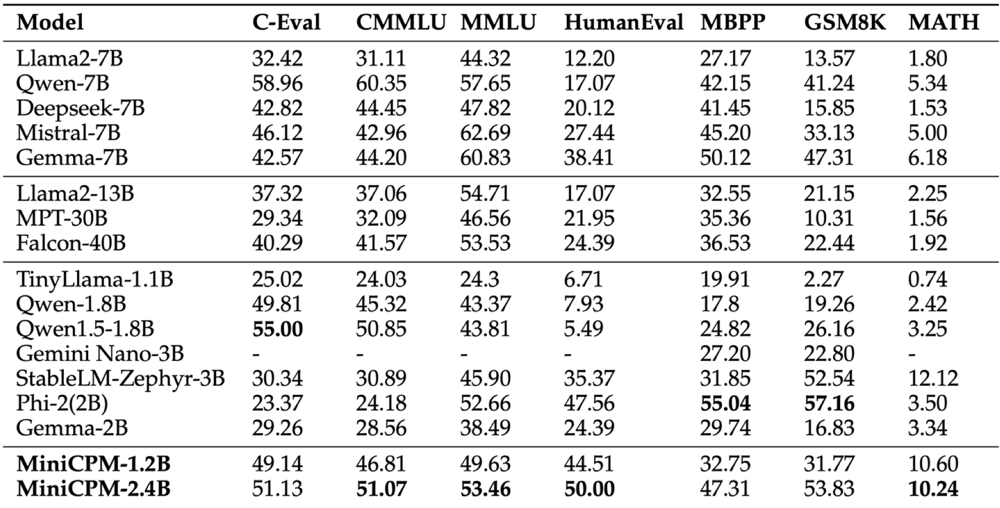
  <figcaption>MiniCPM-1.2B 与 MiniCPM-2.4B 的部分基准测试结果。粗体表示同一组小模型中的最佳成绩。图源：Hu et al., 2024。</figcaption>
</figure>

这个结果并不是简单地把一个小模型训练得更久。MiniCPM 的实际流程包括：

1. 用 μP 稳定不同模型规模之间的超参数迁移；
2. 用小模型实验拟合最优学习率与批大小；
3. 用新的学习率调度降低数据—模型联合扩展实验的成本；
4. 根据拟合结果选择最终模型的数据量与模型规模。

### 2.1 用 μP 设计可扩展的模型族

#### 用小模型确定 μP 基础配置

如果普通地放大模型宽度，同一个学习率、初始化尺度和残差尺度往往不再合适。最大更新参数化（μP）的目标，是让不同宽度模型中的激活、更新幅度和输出保持可比，从而把小模型上找到的超参数迁移到大模型。

MiniCPM 先在 9M 参数模型上搜索出以下基础配置：

- 嵌入输出缩放系数 <code>scale_emb = 12</code>；
- 残差深度缩放系数 <code>scale_depth = 1.4</code>；
- 初始化基准标准差 <code>init_std = 0.1</code>；
- 基础学习率 <code>lr = 0.01</code>。

MiniCPM 同时使用了 μP 的宽度扩展和深度扩展。设当前模型宽度为 \(d_m\)，基准模型宽度为 \(d_{base}\)。关键缩放关系包括：

- 二维张量的初始化标准差按 \(1/\sqrt{d_m/d_{base}}\) 缩小；
- 二维张量的实际学习率按 \(1/(d_m/d_{base})\) 缩小；
- 输出层的 logits 同样按 \(1/(d_m/d_{base})\) 缩放；
- 每层残差分支的增量按 <code>scale_depth</code> 和网络层数进行归一化。

一个宽度与深度缩放的具体例子

假设基准模型宽度为 \(d_{base}=512\)，目标模型宽度为 \(d_m=2048\)，则宽度扩大比例为：

\[
r=\frac{d_m}{d_{base}}=4.
\]

把前面搜索得到的基础配置代入缩放规则，可以得到：

\[
\text{二维张量初始化标准差}
=\frac{0.1}{\sqrt{4}}
=0.05,
\]

\[
\text{二维张量实际学习率}
=\frac{0.01}{4}
=0.0025.
\]

语言模型输出头的 logits 还需要乘以 \(1/4\)。如果目标模型包含 \(L=16\) 层，残差分支的实际系数则为：

\[
\frac{\text{scale\_depth}}{\sqrt{L}}
=\frac{1.4}{\sqrt{16}}
=0.35.
\]

也就是说，模型整体使用的仍是基础配置 \(\text{init\_std}=0.1\)、\(\text{lr}=0.01\) 和 \(\text{scale\_depth}=1.4\)，但真正施加到具体张量和残差分支上的数值，会根据目标模型的宽度与深度缩小。

因此，“最优基础学习率保持不变”并不表示所有张量都使用完全相同的数值学习率，而是指 μP 已经把随宽度变化的部分吸收到参数化规则中。

#### 固定模型形状，再整体放大规模

为了避免把“模型大小的影响”和“架构形状的影响”混在一起，MiniCPM 在风洞实验中尽量保持宽度与深度的相对比例，只整体放大模型。实验覆盖 9M、30M、70M、0.1B、0.17B、0.2B 和 0.5B 参数模型。

<figure>
  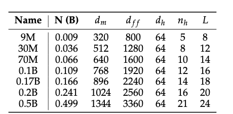
  <figcaption>随着参数量增加，隐藏维度、前馈层维度、注意力头数和层数一同增加，模型形状保持大致相似。图源：Hu et al., 2024。</figcaption>
</figure>

最大的风洞模型只有约 0.5B 参数，而实际 MiniCPM-2.4B 大约是它的 5 倍。这个间隔正是对扩展预测的检验：最终配置不是直接在 2.4B 模型上穷举，而是从小模型实验外推得到。

#### 验证最优学习率能否跨规模保持稳定

μP 预测，经过正确缩放后，最优基础学习率应该随模型规模大致保持稳定。MiniCPM 在 0.04B、0.1B、0.3B、0.5B 模型上进行学习率扫描，并额外在 2.1B 规模上验证。

<figure>
  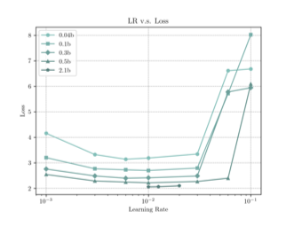
  <figcaption>不同颜色代表不同模型规模。模型增大约一个数量级后，损失最低点仍集中在基础学习率 0.01 附近。图源：Hu et al., 2024。</figcaption>
</figure>

实验结果与 μP 的预期一致：模型规模变化时，最优基础学习率没有明显漂移，约为 0.01。于是最终模型可以复用小模型上确定的基础学习率，而不必重新进行昂贵的全量搜索。

### 2.2 用扩展实验确定最优批大小

批大小（Batch Size）太小，会增加达到目标损失所需的训练步数；批大小太大，则可能消耗更多训练词元，却没有带来相应的优化收益。MiniCPM 分别对 9M、30M 和 170M 参数模型测试 6 种批大小。

<figure>
  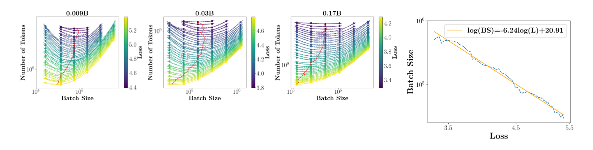
  <figcaption>横轴为批大小，纵轴为已处理词元量，颜色表示损失。红线连接了不同目标损失下消耗词元最少的批大小；右图再把这些最优点汇总。图源：Hu et al., 2024。</figcaption>
</figure>

左侧三幅图分别对应三个模型规模。对某个固定批大小，竖直方向的一串点就是一条随训练词元增加而推进的训练曲线。确定最优批大小的步骤是：

1. 先选定一个目标损失；
2. 找出不同批大小达到该损失时分别需要多少词元；
3. 对这些等损失点拟合抛物线；
4. 把词元消耗最小处的批大小记为该损失下的最优批大小。

将这些最优点放到对数坐标中，可以拟合出：

\[
B_{\mathrm{opt}}(L)\approx \frac{1.21\times 10^9}{L^{6.24}}.
\]

因此，随着目标损失降低，最优批大小会按幂律增大。这里的“最优”特指：在 MiniCPM 的固定计算资源条件下，以尽量少的训练词元达到目标损失。

为什么先知道目标损失，才能估计批大小？

这看起来有一点“先有鸡还是先有蛋”：模型尚未训练，怎么知道最终损失？实践中通常会根据较小模型、较短训练或相邻配置得到一个粗略损失预测，再由它估计批大小。预测不需要完全准确，因为批大小附近通常存在一段较平坦的可用区间。

学习率和批大小也不是相互独立的。MiniCPM 先粗略搜索学习率，再用该学习率拟合批大小，最后回头验证学习率，类似坐标下降式的交替调参。因此，这条经验公式不是脱离训练配置的普遍定律。

### 2.3 用 WSD 降低联合扩展实验的成本

#### 余弦调度的中间检查点为什么不能直接比较

Chinchilla 式分析需要比较多个模型规模 \(N\) 和多个数据量 \(D\)。如果每种模型规模都要从头训练到每个目标数据量，\(m\) 个模型规模与 \(m\) 个数据量会形成 \(m^2\) 个组合。

一个看似自然的办法是只训练一条长曲线，再把中间检查点当成较小数据量的最终结果。但余弦学习率调度（Cosine Learning Rate Schedule）依赖预先设定的终止步数：中间检查点的学习率还没有充分衰减，因此并不等价于“在这里正常结束训练”的模型。

<figure>
  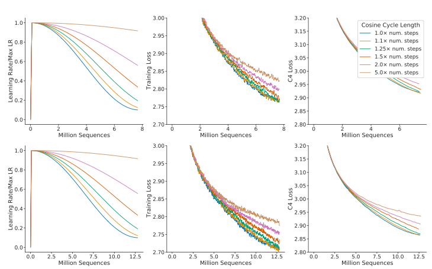
  <figcaption>余弦周期越长，学习率在目标停止点附近越高，最终损失也越差。Chinchilla 的实验显示，把预计训练步数高估超过约 25% 后，性能会出现明显下降。图源：Hoffmann et al., 2022。</figcaption>
</figure>

这意味着：使用余弦调度时，不能把一条为长训练设计的曲线随意截断，来替代为短训练专门设计的完整曲线。

#### 用预热—稳定—衰减调度复用训练阶段

MiniCPM 的部分解决方案，是把学习率显式拆成预热、稳定和衰减三个阶段：

\[
\operatorname{WSD}(T;s)=
\begin{cases}
\dfrac{s}{W}\eta, & s\lt W,\\
\eta, & W\le s\lt T,\\
f(s-T)\eta, & T\le s\lt S.
\end{cases}
\]

其中，\(s\) 是当前训练步，\(W\) 是预热结束点，\(T\) 是稳定阶段结束点，\(S\) 是训练终点，\(\eta\) 是最大学习率，\(f\) 是随训练推进而下降的函数。

<figure>
  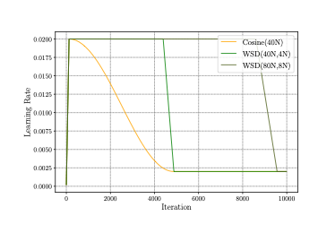
  <figcaption>两条 WSD 曲线共享同一段稳定训练，只在不同检查点开始衰减；余弦调度则从一开始就依赖预先指定的终点。图源：Hu et al., 2024。</figcaption>
</figure>

核心优势是<strong>稳定阶段可以复用</strong>。研究者只需训练一条长的稳定阶段，在 10N、20N、30N 等检查点分别分叉，再为每个分支执行一小段衰减，就能得到多个近似“正常结束”的模型，而不必为每个数据量从头训练。

在 MiniCPM 的实验设置中，这把联合扩展实验沿数据轴的成本从约 \(O(m^2C)\) 降到 \(O(mC)\)。它不是消除了所有训练开销，而是复用了不同数据预算之间最昂贵的公共前缀。

#### WSD 的经验训练现象

<figure>
  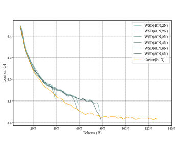
  <figcaption>WSD 在稳定阶段的损失下降较慢，但进入衰减阶段后会快速下降，最终达到或低于对应余弦调度的损失。图源：Hu et al., 2024。</figcaption>
</figure>

MiniCPM 报告了两个直接影响实验设计的现象：

- 稳定阶段保持较高学习率时，损失下降相对缓慢；一旦开始衰减，损失会快速下降；
- 在 40N、60N 和 80N 等检查点进行实验时，约占总训练词元 10% 的衰减阶段通常已经足够，而 2.5% 往往不足。

所以，WSD 的价值不是让整条训练曲线处处优于余弦调度，而是让同一个稳定阶段检查点可以继续训练，也可以随时进入短暂衰减以测量其近似最终性能。

### 2.4 用小模型估计计算最优的数据—模型配比

有了 WSD，MiniCPM 可以训练 6 种模型规模，并从每个模型稳定阶段的多个检查点分别执行衰减。这样就获得了一组覆盖模型参数量 \(N\)、训练数据量 \(D\) 和最终损失 \(L\) 的实验点。

作者使用了两种 Chinchilla 式方法：下包络线法与联合函数拟合法。

#### 下包络线法：直接寻找固定计算量下的最佳模型

<figure>
  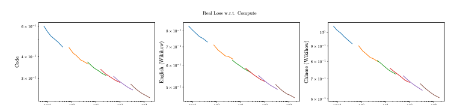
  <figcaption>不同颜色代表不同模型规模，同一颜色内增加计算量主要意味着给固定模型加入更多训练数据。图中展示代码、英文 WikiHow 和中文 WikiHow 上的真实损失。图源：Hu et al., 2024。</figcaption>
</figure>

对每一个计算预算，选择所有模型中损失最低的点，就得到经验下包络线。随着预算增加，最优点会从小模型逐渐切换到大模型；切换位置给出了该预算下的计算最优模型规模与数据量。

这些片段在双对数坐标中呈现较清楚的下降趋势，但并不完全共线。实验还显示，在覆盖的数据范围内，固定模型继续增加数据仍能带来明显收益，数据侧的边际收益下降没有想象中那么快。

#### 联合函数拟合法：同时拟合模型规模与数据量

MiniCPM 的主要方法，是直接拟合联合损失函数：

\[
L(N,D)=C_NN^{-\alpha}+C_DD^{-\beta}+L_0.
\]

其中，\(C_NN^{-\alpha}\) 表示有限模型规模带来的误差，\(C_DD^{-\beta}\) 表示有限数据量带来的误差，\(L_0\) 是难以继续消除的损失下限。\(C_N\)、\(C_D\)、\(\alpha\)、\(\beta\) 和 \(L_0\) 都由多组小规模实验共同拟合，而不是预先设定的通用常数。再使用训练计算量近似式

\[
C\approx 6ND,
\]

就可以求解固定预算下的最优配置：

\[
(N^*,D^*)=\underset{N,D}{\arg\min}\ L(N,D)
\quad \text{s.t.}\quad 6ND\le C.
\]

进一步可写出模型—数据比：

\[
\frac{N_{\mathrm{opt}}}{D_{\mathrm{opt}}}
=K^2\left(\frac{C}{6}\right)^\eta,
\qquad
K=\left(\frac{\alpha C_N}{\beta C_D}\right)^{\frac{1}{\alpha+\beta}},
\qquad
\eta=\frac{\beta-\alpha}{\alpha+\beta}.
\]

当 \(\alpha\approx\beta\) 时，\(\eta\approx 0\)，最优数据—模型比不会随计算预算发生太大变化；两者不相等时，预算增长会逐渐偏向数据或模型中的一侧。

<figure>
  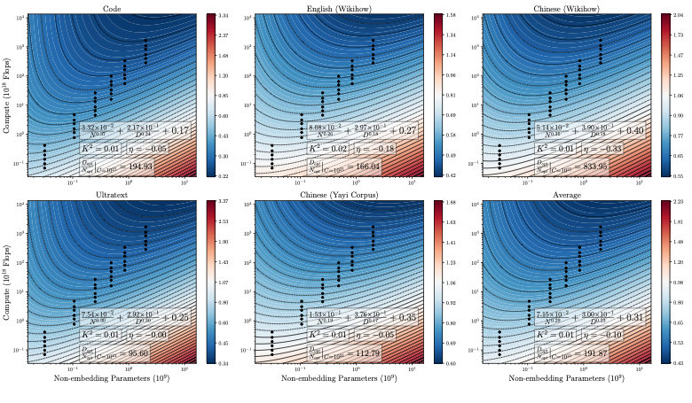
  <figcaption>横轴为非嵌入参数量，纵轴为训练计算量，黑点是实际执行过衰减的检查点，背景等高线来自联合损失拟合。图源：Hu et al., 2024。</figcaption>
</figure>

拟合得到的数据—模型比明显高于 Chinchilla 常被引用的约 20 个词元/参数：在 UltraText 面板中，\(C=10^{21}\) FLOPs 时约为 95.6 个词元/参数；六个评测语料平均后的面板约为 191.9 个词元/参数。

这个结果不应被当成新的通用常数。它依赖 MiniCPM 的模型结构、数据、分词器、训练配方和损失定义，而且论文并未用更大规模模型完整验证这一比例。更稳妥的结论是：<strong>现代训练配置中的最优数据量可能显著高于早期 Chinchilla 配方，而 WSD 提供了一种更便宜地重新测量该比例的方法。</strong>

## 3. 案例二：DeepSeek LLM 的直接拟合路线

DeepSeek LLM 同样使用小规模实验指导大模型训练，但路线与 MiniCPM 不同：它没有使用 μP 迁移超参数，而是直接估计不同计算预算下的最优批大小、学习率和数据—模型配比，再把拟合结果外推到 7B 与 67B 模型。

原论文报告，DeepSeek LLM 7B 和 67B 在当时的开源语言模型中具有较强的综合性能。这里更重要的不是最终榜单，而是这些大型训练配置如何从较便宜的扩展实验中得到。

### 3.1 直接拟合批大小与学习率

DeepSeek 先在 \(10^{17}\) FLOPs 的小规模实验中，对批大小 \(B\) 和学习率 \(\eta\) 进行网格搜索。每个方格表示一组配置的验证损失，横轴是学习率，纵轴是以词元数表示的批大小。

<figure>
  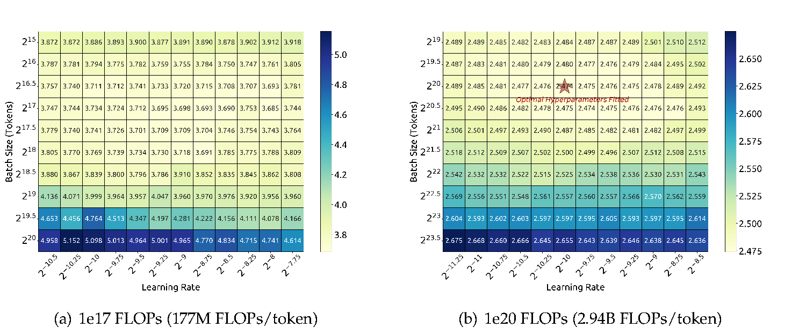
  <figcaption>左图是计算预算为 \(10^{17}\) FLOPs、每个词元需 177M FLOPs 的小规模实验；右图用 \(10^{20}\) FLOPs 的实验验证拟合结果，星号落在低损失区域。图源：DeepSeek-AI, 2024。</figcaption>
</figure>

热力图中最低损失附近不是一个尖锐的点，而是一片较平坦的区域。这意味着训练并不要求恰好命中唯一的最优组合，在一定范围内选择批大小和学习率，都可以获得接近最优的结果。

DeepSeek 把损失不超过该组最低损失 \(0.25\%\) 的配置定义为<strong>近优超参数（Near-optimal Hyperparameters）</strong>，再用计算预算 \(C\) 对这些配置进行幂律拟合：

\[
\eta_{\mathrm{opt}}=0.3118\,C^{-0.1250},
\]

\[
B_{\mathrm{opt}}=0.2920\,C^{0.3271}.
\]

<figure>
  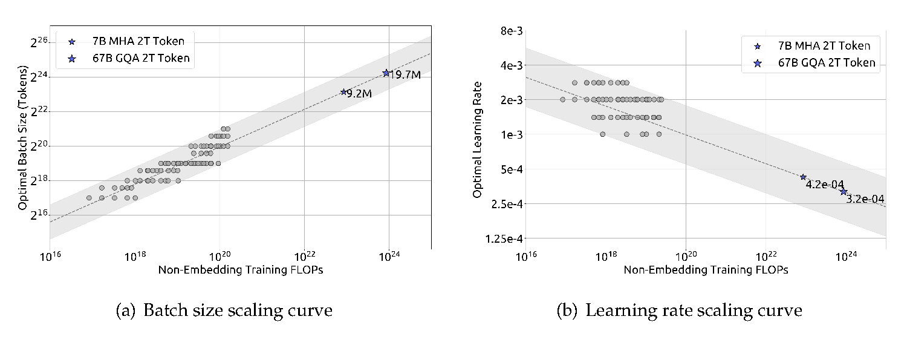
  <figcaption>灰点是小规模实验得到的近优配置，虚线是幂律拟合，灰色区域表示较宽的近优范围；蓝色星号是 7B 和 67B 模型采用的配置。图源：DeepSeek-AI, 2024。</figcaption>
</figure>

拟合结果给出的趋势是：<strong>计算预算越大，合适的批大小越大，而学习率越小。</strong>DeepSeek LLM 7B 与 67B 的配置也落在外推得到的近优区间内。

这里的系数和指数都是由特定实验拟合得到的，并不是通用常数。尤其是学习率实验只覆盖了若干离散取值，而且近优带较宽，因此学习率曲线更适合用来确定一个可用范围，而不应被理解为高精度预测。

### 3.2 用多阶段学习率调度复用扩展实验

为了在不同计算预算之间复用训练，DeepSeek 没有采用从训练开始就依赖终点的余弦调度，而是使用<strong>多阶段学习率调度（Multi-step Learning Rate Scheduler）</strong>：

1. 先用 2000 步把学习率预热到最大值；
2. 前 80% 的训练词元保持第一阶段训练；
3. 处理完 80% 的词元后，将学习率降至最大值的 31.6%；
4. 处理完 90% 的词元后，再降至最大值的 10%。

最后两个阶段各占总训练量的 10%，因此也可以把默认比例写成 \(80\%+10\%+10\%\)。这种设计与 WSD 的思路相近：较长的前缀训练可以复用，在目标计算预算附近再进入学习率衰减阶段。不过它采用的是两次阶梯式下降，并不等同于 MiniCPM 使用的 WSD 曲线。

<figure>
  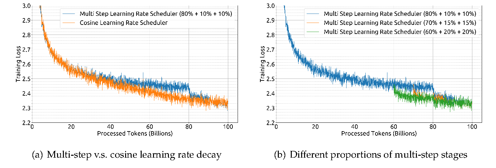
  <figcaption>左图显示多阶段调度与余弦调度虽然训练过程不同，但最终损失接近；右图比较了 80%+10%+10%、70%+15%+15% 和 60%+20%+20% 三种阶段比例。实验使用 1.6B 参数模型和 100B 词元。图源：DeepSeek-AI, 2024。</figcaption>
</figure>

更长的衰减阶段可能带来略低的最终损失，但会降低公共训练前缀的复用比例。DeepSeek 最终选择 \(80\%+10\%+10\%\)，是在最终性能与实验复用效率之间折中。

### 3.3 用 IsoFLOP 外推数据—模型配比与最终损失

得到批大小和学习率的经验公式后，DeepSeek 使用 Chinchilla 的<strong>等计算量曲线（IsoFLOP Profile）</strong>方法选择模型规模与数据量。

它没有直接用参数量 \(N\) 表示模型规模，而是使用每个词元的非嵌入计算量 \(M\)，即<strong>非嵌入 FLOPs/词元（Non-embedding FLOPs per Token）</strong>。这样既计入了注意力计算，又排除了对模型能力贡献相对较小的词表计算。总训练计算量写成：

\[
C=MD,
\]

其中 \(D\) 是训练词元数。实验选择了从 \(10^{17}\) 到 \(3\times10^{20}\) FLOPs 的 8 个计算预算，并在每个预算下测试约 10 种模型—数据分配。每条 IsoFLOP 曲线的最低点，就是该预算下的最优 \(M\) 和 \(D\)。

<figure>
  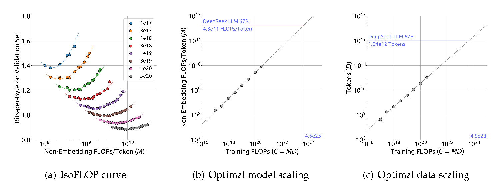
  <figcaption>左图在每个固定计算预算下寻找验证损失最低点；中图和右图再分别拟合最优模型计算量与最优词元数。灰点来自小规模实验，蓝线标出对 DeepSeek LLM 67B 的外推。图源：DeepSeek-AI, 2024。</figcaption>
</figure>

拟合得到：

\[
M_{\mathrm{opt}}=0.1715\,C^{0.5243},
\]

\[
D_{\mathrm{opt}}=5.8316\,C^{0.4757}.
\]

两个指数之和约为 1，与 \(C=MD\) 一致。它们也非常接近 \(0.5\)，说明在这组实验中，新增计算预算大致均衡地分配给模型规模和训练数据。对 \(4.5\times10^{23}\) FLOPs 的训练预算外推，图中给出的计算最优配置约为每词元 \(4.3\times10^{11}\) FLOPs 和 \(1.04\times10^{12}\) 个训练词元。

最后，DeepSeek 再拟合“计算预算—最优验证损失”曲线，并用小规模实验预测 7B 和 67B 模型的最终损失。

<figure>
  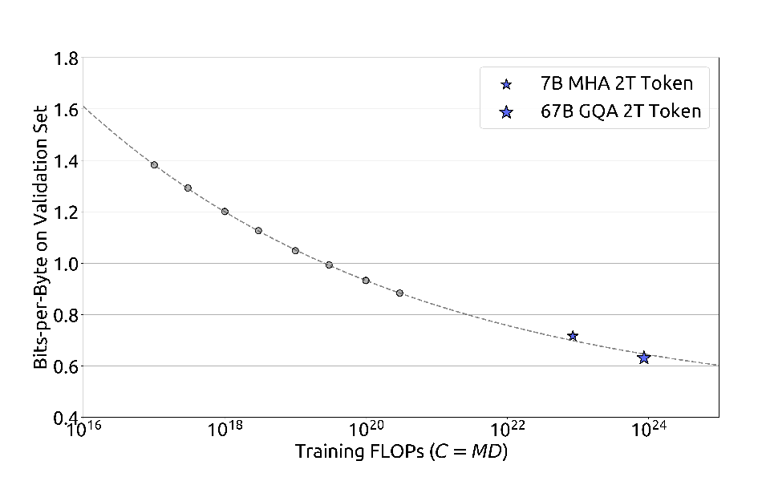
  <figcaption>灰点和虚线来自小规模实验，蓝色星号分别表示 DeepSeek LLM 7B 与 67B。两个大模型的验证集 bits-per-byte 均接近外推曲线。图源：DeepSeek-AI, 2024。</figcaption>
</figure>

这次外推跨越了约 1000 倍的计算预算，仍较准确地预测了最终模型损失。它说明扩展实验的价值不只是选择 \(M\) 和 \(D\)：当训练配方、数据分布和评价方式保持一致时，同一组小规模实验还可以用来预估大型训练能达到的性能。

但这种准确性仍是特定实验范围内的经验结果。模型结构、数据质量或训练配方发生变化后，批大小、学习率、最优配比和损失曲线都需要重新校准。

## 4. 从超参数到架构选择：扩展定律的更多实践

这些案例共享同一个基本流程：先确定需要比较的“规模”变量，在可承受的范围内进行受控实验，再拟合经验关系并外推到目标预算。不同之处在于，研究者需要根据真正的工程问题重新定义横轴和优化目标。

### 4.1 Qwen：跨模型结构与训练阶段预测超参数

Qwen2.5 把扩展定律用于预测最优学习率 \(\mu_{\mathrm{opt}}\) 与批大小 \(B_{\mathrm{opt}}\)：先在不同模型规模、数据量和架构上进行小规模实验，再分别为稠密模型与混合专家模型（Mixture of Experts，MoE）选择训练配置。[6]

Qwen3 进一步把训练阶段纳入预测，在通用预训练、推理强化和长上下文训练中分别确定学习率调度与批大小。[7] 核心思想是：<strong>学习率和批大小不是放大模型时直接照搬的常数，也可以通过小规模实验拟合并外推。</strong>不过，两份报告都没有公开完整拟合公式和实验点，因此目前难以复现其具体过程。

### 4.2 Kimi K2：用扩展实验选择 MoE 稀疏度与注意力头数

对 MoE 模型来说，总参数量和每个词元实际参与计算的参数量并不相同。Kimi K2 将<strong>稀疏度（Sparsity）</strong>定义为：

\[
S=\frac{E_{\mathrm{total}}}{E_{\mathrm{active}}}.
\]

实验固定每个词元激活 8 个专家，只增加专家总数。在激活参数量和训练 FLOPs 可比的条件下，更高稀疏度通常能降低验证损失；但它也会增加路由、通信和负载均衡的复杂度。Kimi K2 最终选择稀疏度 48，即从 384 个专家中激活 8 个。[8]

<figure>
  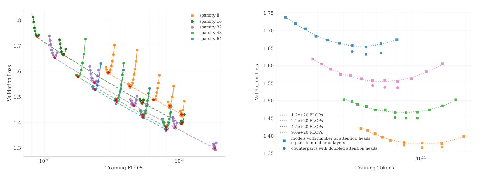
  <figcaption>左图固定激活专家数并增加专家总数，更高稀疏度整体降低了验证损失；右图比较注意力头数等于层数和头数翻倍两种配置。图源：Kimi Team, 2025。</figcaption>
</figure>

类似地，将注意力头数增加到层数的两倍只能改善约 \(0.5\%\)–\(1.2\%\) 的验证损失，却可能显著增加长上下文推理成本，因此最终模型采用 64 个注意力头。这里的核心是：<strong>扩展实验负责衡量性能收益，最终选择还必须考虑训练和推理成本。</strong>

### 4.3 Hunyuan 与 LLaMA 3：计算最优配比与下游预测

Hunyuan-Large 把 IsoFLOP 方法应用到 MoE 模型。由于每个词元只经过部分专家，这里的模型规模使用<strong>激活参数量（Activated Parameters）</strong>，而不是总参数量。实验在每个计算预算下寻找损失最低点，再拟合计算最优的激活参数量和训练数据量。[9]

<figure>
  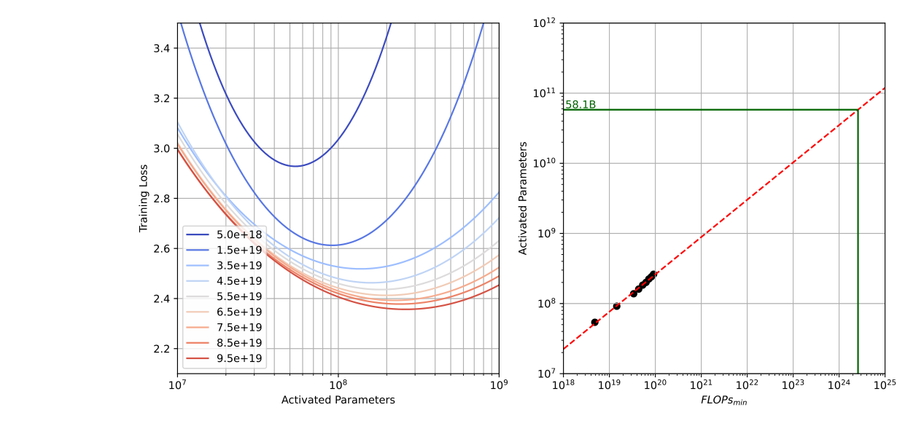
  <figcaption>左图在不同计算预算下用二次曲线寻找最优激活参数量，右图再将这些最低点拟合成计算量—激活参数量扩展关系。图源：Hunyuan Team, 2024。</figcaption>
</figure>

拟合结果约为 58.1B 激活参数和 5.6T 训练词元，对应约 \(96:1\) 的词元—激活参数比。但 IsoFLOP 曲线在最低点附近较平坦，因此 Hunyuan-Large 最终采用 52B 激活参数和约 7T 词元，而没有严格照搬拟合点。

LLaMA 3 对稠密模型进行了类似的 IsoFLOP 实验。[10]

<figure>
  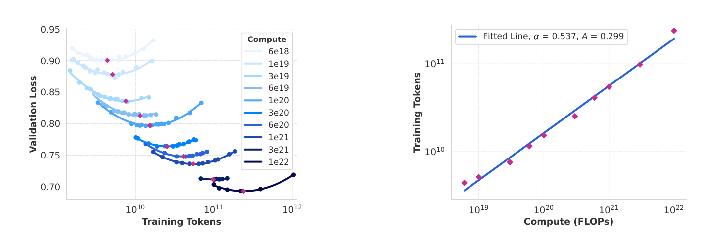
  <figcaption>左图中每条曲线对应一个固定计算预算，菱形标出二次拟合的最低点；右图用这些最低点拟合最优训练词元数随计算预算的变化。图源：Llama Team, 2024。</figcaption>
</figure>

外推结果建议使用约 402B 参数和 16.55T 词元；实际旗舰模型采用 405B 参数和 15.6T 词元，约为每个参数 39 个词元。LLaMA 3 同样观察到，大预算下的 IsoFLOP 曲线在最低点附近较平坦，因此附近多种模型—数据分配都可能接近最优。

LLaMA 3 还把扩展预测从预训练损失延伸到下游任务。它先拟合训练 FLOPs 与 ARC Challenge 正确答案的归一化负对数似然之间的关系，再拟合该似然值与准确率之间的 S 形关系：

\[
\text{训练计算量}\longrightarrow\text{归一化 NLL}\longrightarrow\text{下游准确率}.
\]

<figure>
  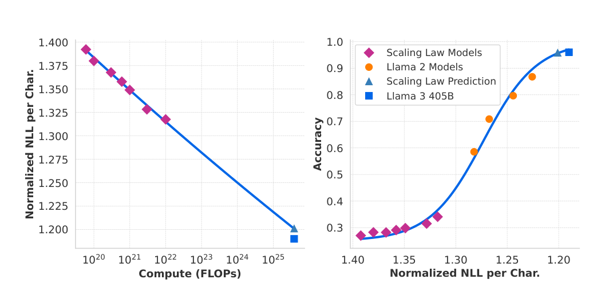
  <figcaption>左图把训练计算量映射到 ARC Challenge 的归一化负对数似然，右图再把似然映射到准确率。外推结果与 LLaMA 3 405B 的实际表现接近。图源：Llama Team, 2024。</figcaption>
</figure>

该方法较准确地预测了 405B 模型的 ARC Challenge 表现。核心不是假设下游准确率直接服从幂律，而是先预测一个稳定的损失指标，再通过校准关系把它转换成任务准确率。

### 4.4 MiniMax-01：用扩展定律比较注意力架构

MiniMax-01 把扩展定律直接用于架构选择。研究者比较了三种注意力方案：[11]

- 标准 Softmax 注意力；
- 纯 Lightning Attention；
- 每 8 层保留 1 层 Softmax 注意力的 Hybrid-lightning Attention。

实验覆盖 70M–7B 参数模型，每个模型最多训练 300B 词元。随后使用 Chinchilla 的下包络线思路，分别拟合三种架构的最优损失、模型规模和数据量随计算预算的变化。

<figure>
  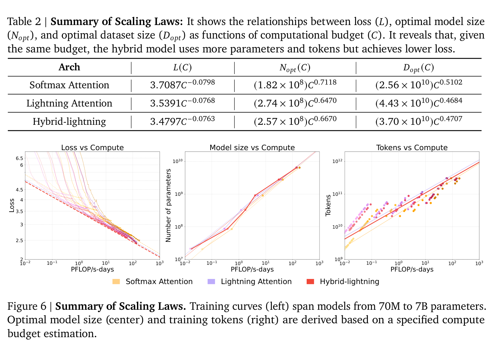
  <figcaption>上表给出 Softmax、Lightning 和 Hybrid-lightning 的拟合公式；下方依次比较固定预算下的损失、最优模型规模和最优训练词元数。图源：MiniMax, 2025。</figcaption>
</figure>

三种架构的损失—计算量指数都接近 \(-0.08\)，说明 Lightning 与 Hybrid-lightning 在实验范围内没有随着规模增加而明显偏离 Softmax 的扩展趋势。相同预算下，Hybrid-lightning 的拟合损失最低，而 Lightning 架构倾向于使用更多参数和训练词元。

但架构选择不能只看训练损失。纯 Lightning 注意力虽然计算高效，却在检索任务上表现较弱；混合架构周期性加入 Softmax 注意力后，能够补回长上下文检索能力。因此，这组扩展实验的作用不是单独“证明某种架构最好”，而是确认混合架构在放大规模后不会出现明显的性能退化，再结合下游能力与速度实验做最终选择。

从这几组案例可以看到，扩展定律已经从“模型应该多大”扩展为一种通用的实验决策工具。关键不是照搬某个固定比例，而是围绕实际瓶颈重新设计小规模实验：训练瓶颈可以拟合学习率和批大小，MoE 瓶颈可以扫描稀疏度与激活参数量，部署瓶颈则需要把训练损失与推理成本、下游表现共同纳入决策。

## 5. 优化器与超参数扩展（Optimizer Scaling）

学习率、批大小和优化器的选择同样具有尺度依赖性。小模型上最优的配置，放大模型或改变训练数据量后未必仍然最优；一个在小规模实验中领先的优化器，也可能随着模型规模增加而失去优势。

因此，优化器研究需要回答两个问题：如何把小规模实验中的最优超参数外推到目标训练，以及如何在不同训练尺度下公平比较优化器。

### 5.1 最优超参数扩展定律（Step Law）

最优超参数扩展定律（Step Law）把峰值学习率 \(\eta\) 和批大小 \(B\) 同时写成模型规模 \(N\) 与数据量 \(D\) 的函数。[12]

在固定 \(N\) 和 \(D\) 时，验证损失关于学习率与批大小形成一个近似凸的曲面：配置离最低点越远，损失通常越高；最低点附近则是一片相对平坦的近优区域。

<figure>
  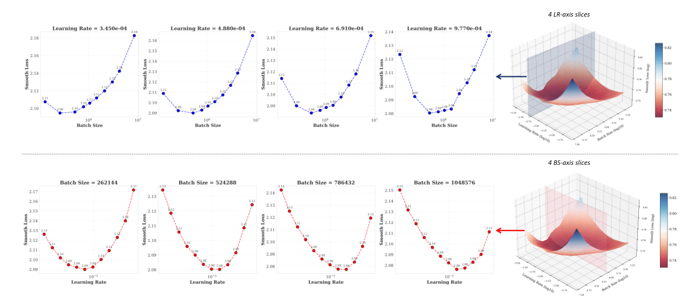
  <figcaption>分别固定学习率或批大小后，损失切片呈近似碗形；右侧三维图展示了两者共同决定的损失曲面。这里的凸性是大规模网格实验中的经验观察，并非对任意模型和训练配方都成立的数学定理。图源：Li et al., 2025。</figcaption>
</figure>

论文拟合得到：

\[
\eta_{\mathrm{opt}}(N,D)=1.79N^{-0.713}D^{0.307},
\]

\[
B_{\mathrm{opt}}(D)=0.58D^{0.571}.
\]

其中，\(N\) 是不含词表的模型参数量，\(D\) 是训练词元数，\(B\) 是以词元数表示的批大小。公式给出三个趋势：模型越大，最优学习率越小；在固定模型下增加数据量，最优学习率反而增大；最优批大小主要随数据量增加。

<figure>
  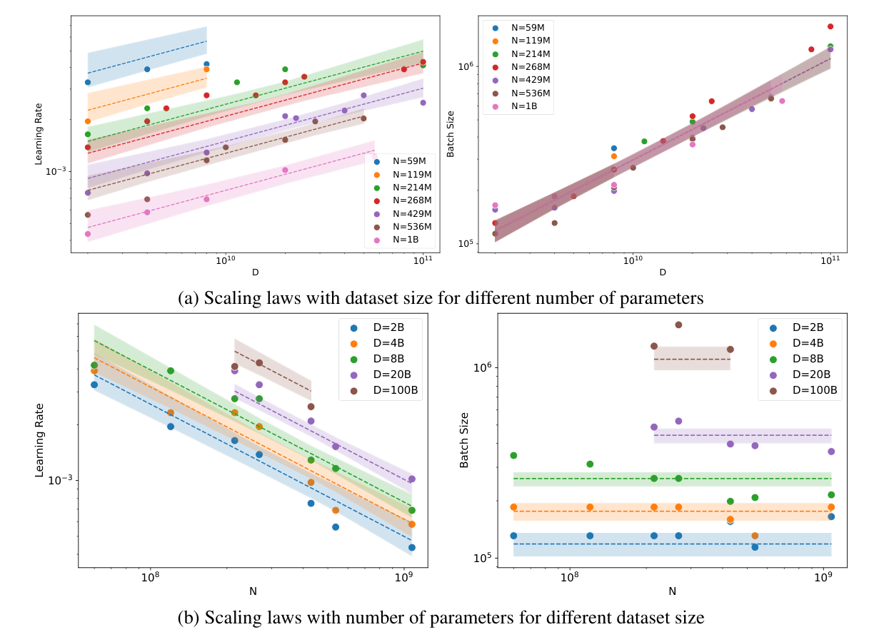
  <figcaption>上排固定不同模型规模并增加数据量，下排固定不同数据量并增加模型规模。批大小主要受数据量影响，而学习率同时依赖模型规模与数据量。虚线为拟合结果，阴影为不确定区间。图源：Li et al., 2025。</figcaption>
</figure>

“数据更多时学习率更大”并不是普遍规律。Step Law 的实验使用 AdamW、2000 步预热和余弦衰减到固定的最小学习率，因此 \(D\) 的正指数可能包含学习率调度带来的影响；改用 WSD 等调度后，需要重新验证。式中的系数也依赖单位、模型、数据和训练配方，不能直接复制到其他项目。

在论文的 1B 参数、100B 词元测试点上，公式预测配置得到的损失仅比穷举搜索找到的全局最优值高约 \(0.094\%\)。作者还在不同稀疏度的 MoE 和三种数据配方上进行了验证，预测点仍接近低损失区域。

<figure>
  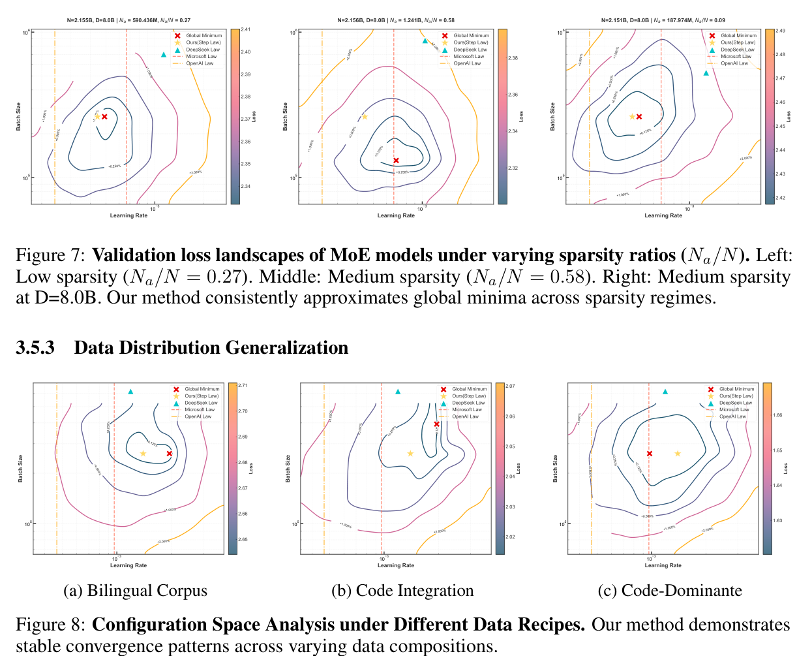
  <figcaption>上排比较不同 MoE 稀疏度，下排比较双语、加入代码和代码为主的数据配方。红叉是网格搜索的最低点，黄色星号是 Step Law 的预测点。这说明该公式在实验覆盖的变化范围内具有一定稳健性，但不等于可以脱离验证直接用于任意训练。图源：Li et al., 2025。</figcaption>
</figure>

### 5.2 Muon：从矩阵更新到大规模训练

这一部分的核心结论是：<strong>Muon 已经表现出从小模型扩展到大规模训练的能力，但它相对 AdamW 的收益会随训练尺度变化。</strong>评价这种收益时，必须同时区分词元效率、单步开销和训练稳定性。

Muon 主要用于二维权重矩阵。设第 \(t\) 步的梯度为 \(G_t\)，它先积累动量矩阵 \(B_t\)，再用 Newton–Schulz 迭代近似构造正交化更新 \(O_t\)：[15]

\[
\begin{aligned}
B_t&=\mu B_{t-1}+G_t,\\
B_t&=U\Sigma V^\top,\\
O_t&\approx UV^\top,\\
W_t&=W_{t-1}-\eta O_t.
\end{aligned}
\]

奇异值分解（Singular Value Decomposition，SVD）在这里用于解释更新：\(U\Sigma V^\top\) 中的 \(\Sigma\) 表示不同方向的更新强度，而 \(UV^\top\) 保留这些方向，将非零奇异值拉到接近 \(1\)。实际实现并不需要每一步精确计算 SVD，而是用少量 Newton–Schulz 迭代近似得到 \(UV^\top\)。

<figure>
  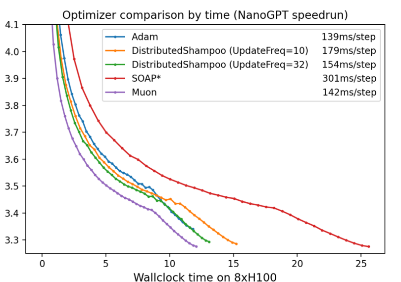
  <figcaption>NanoGPT 小规模实验中，Muon 的单步时间约为 142 ms，与 Adam 的 139 ms 接近，同时更快达到相同验证损失。这个结果说明 Muon 在该实现中具有墙钟时间优势，但不能直接代表大模型训练。</figcaption>
</figure>

要判断优势能否随规模保持，需要为每个优化器分别调参，并在不同模型规模和数据—模型比上复验。[13] 共享同一套学习率和权重衰减，并不能构成公平比较；例如，不同优化器的近优学习率和权重衰减范围可能相差很大。

<figure>
  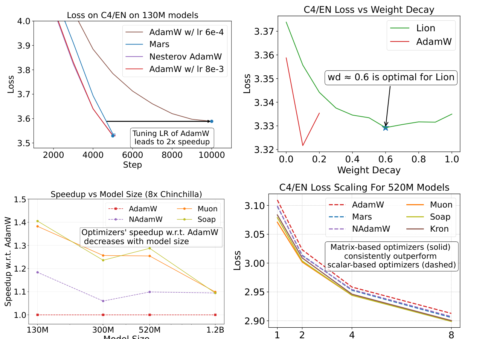
  <figcaption>上排说明不同优化器必须分别搜索学习率和权重衰减；左下显示 Muon、Soap 相对 AdamW 的词元效率优势随模型规模增大而缩小；右下显示矩阵优化器在不同数据—模型比下的损失。图源：Wen et al., 2025。</figcaption>
</figure>

跨规模实验呈现出两个现象：

- Muon 和 Soap 在小于 1B 的模型上相对 AdamW 可达到约 \(1.3\text{--}1.4\times\) 的词元效率，到 1.2B 时缩小到约 \(1.1\times\)；
- 数据—模型比也会改变优化器排序：较低比例下 Muon 表现较好，而在 300M、16 倍 Chinchilla 的过训练设置中，Soap 超过了 Muon。

Kimi K2 提供了更大尺度的训练证据。它是总参数约 1.04T、每个词元激活约 32B 参数的混合专家模型，使用加入 QK-Clip 稳定机制的 MuonClip，在 15.5T 词元上完成预训练。[8]

<figure>
  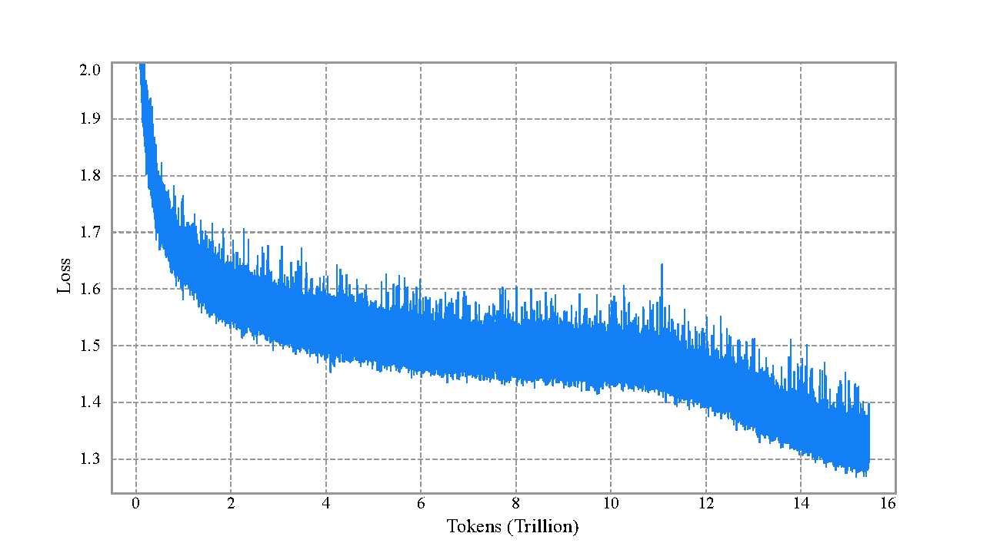
  <figcaption>Kimi K2 未经平滑或下采样的逐步训练损失持续下降，整个训练过程没有出现损失尖峰。图源：Kimi Team, 2025。</figcaption>
</figure>

这条曲线证明 MuonClip 可以稳定用于超大规模训练，但它没有提供同等规模、同等配置的 AdamW 对照，因此不能单独用来计算 Muon 的加速比例。更准确的表述是：<strong>Muon 的可扩展性已经得到工程验证，而它的相对收益仍需在受控实验中测量。</strong>

另外，“速度提升”通常表示达到相同验证损失所需的词元更少，不等于实际训练时间按相同比例缩短。可靠比较至少需要做到三点：为每个优化器充分调参、覆盖多个训练尺度，并同时报告词元效率与墙钟时间（Wall-clock Time）。

### 5.3 μP 的理论依据与适用边界

最大更新参数化（Maximal Update Parametrization，μP）可以从特征学习的谱条件出发理解。[18] 设第 \(l\) 层宽度为 \(n_l\)，激活向量为 \(h_l\)。当模型宽度变化时，μP 希望满足两个条件：

\[
\begin{aligned}
\text{A1：}&(h_l)_i=\Theta(1),\\
\text{A2：}&(\Delta h_l)_i=\Theta(1).
\end{aligned}
\]

其中，\(l\) 表示层编号，\(i\in\{1,\ldots,n_l\}\) 表示第 \(l\) 层中的第 \(i\) 个神经元或特征坐标。因此，\((h_l)_i\) 是第 \(l\) 层的第 \(i\) 个激活值，\((\Delta h_l)_i\) 是一次梯度更新后这个激活值的变化。

A1 要求初始化时的单个激活不随宽度增大而爆炸或消失；A2 要求经过一次梯度更新后，单个激活的变化也不随宽度爆炸或消失。这里的 \(\Theta(1)\) 只表示相对于宽度保持同一数量级，并不要求数值等于 \(1\)。

若一个宽度为 \(n_l\) 的向量中，每个分量都是 \(\Theta(1)\)，那么它的二范数应满足

\[
\begin{aligned}
\lVert h_l\rVert_2&=\Theta(\sqrt{n_l}),\\
\lVert\Delta h_l\rVert_2&=\Theta(\sqrt{n_l}).
\end{aligned}
\]

这两个向量尺度分别构成下面初始化推导与参数更新推导的目标。

#### 条件 A1：由激活尺度确定初始化尺度

先考虑一个深层线性网络：

\[
\begin{aligned}
h_l&=W_lh_{l-1}.
\end{aligned}
\]

设 \(W_l\in\mathbb{R}^{n_l\times n_{l-1}}\)，其中每个元素独立采样自 \(\mathcal{N}(0,\sigma_l^2)\)。下面使用 \(\lVert W_l\rVert_2\) 表示矩阵的谱范数（Spectral Norm）。

<strong>什么是谱范数？</strong>

矩阵 \(W\) 的谱范数定义为

\[
\begin{aligned}
\lVert W\rVert_2
&=\max_{x\ne 0}\frac{\lVert Wx\rVert_2}{\lVert x\rVert_2}.
\end{aligned}
\]

它表示矩阵最多能把输入向量的长度放大多少倍。因此，对任意向量 \(x\) 都有

\[
\begin{aligned}
\lVert Wx\rVert_2
&\leq\lVert W\rVert_2\lVert x\rVert_2.
\end{aligned}
\]

谱范数等于矩阵的最大奇异值：

\[
\begin{aligned}
\lVert W\rVert_2
&=\sigma_{\max}(W)
=\sqrt{\lambda_{\max}(W^{\top}W)}.
\end{aligned}
\]

只有当 \(x\) 指向最大奇异值对应的右奇异向量时，上面的不等式才会取等号。这里采用下标 \(2\) 表示谱范数，避免与常用于表示所有奇异值之和的核范数记号 \(\lVert W\rVert_*\) 混淆。

根据随机矩阵的集中性质，\(W_l\) 的谱范数大致满足

\[
\begin{aligned}
\lVert W_l\rVert_2
&\approx
\sigma_l\left(\sqrt{n_{l-1}}+\sqrt{n_l}\right).
\end{aligned}
\]

因此可以用

\[
\begin{aligned}
\lVert h_l\rVert_2
&\approx
\lVert W_l\rVert_2\lVert h_{l-1}\rVert_2
\end{aligned}
\]

估计当前层激活的尺度。为了把上一层的 \(\Theta(\sqrt{n_{l-1}})\) 映射为当前层的 \(\Theta(\sqrt{n_l})\)，选择

\[
\begin{aligned}
\sigma_l
&=
\frac{\sqrt{n_l}}{\sqrt{n_{l-1}}}
\left(\sqrt{n_l}+\sqrt{n_{l-1}}\right)^{-1}\\
&=
\Theta\!\left(
\frac{1}{\sqrt{n_{l-1}}}
\min\!\left(1,\sqrt{\frac{n_l}{n_{l-1}}}\right)
\right).
\end{aligned}
\]

现在作归纳假设：

\[
\begin{aligned}
\lVert h_{l-1}\rVert_2
&=\Theta(\sqrt{n_{l-1}}).
\end{aligned}
\]

上述初始化会使权重矩阵的谱范数满足

\[
\begin{aligned}
\lVert W_l\rVert_2
&\approx
\frac{\sqrt{n_l}}{\sqrt{n_{l-1}}}
\left(
\sqrt{n_l}+\sqrt{n_{l-1}}
\right)^{-1}
\left(
\sqrt{n_{l-1}}+\sqrt{n_l}
\right)\\
&=
\frac{\sqrt{n_l}}{\sqrt{n_{l-1}}},
\end{aligned}
\]

从而得到

\[
\begin{aligned}
\lVert h_l\rVert_2
&=\sqrt{n_l}+o(\sqrt{n_l}).
\end{aligned}
\]

这便使当前层的单个激活保持在 \(\Theta(1)\)。当相邻两层等宽，即 \(n_l=n_{l-1}=n\) 时，上式简化为 \(\sigma_l=\Theta(1/\sqrt n)\)，与常见宽度感知初始化的数量级一致。

这里使用谱范数给出的是一种偏向最坏情况的推导。严格来说，\(\lVert W_lh_{l-1}\rVert_2\) 不一定等于 \(\lVert W_l\rVert_2\lVert h_{l-1}\rVert_2\)，后者主要提供上界。

#### 条件 A2：由激活变化确定权重更新尺度

接下来考虑参数更新。在线性层和随机梯度下降（Stochastic Gradient Descent，SGD）下，权重更新是损失梯度与上一层激活的秩一外积：

\[
\begin{aligned}
\Delta W_l
&=-\eta_l\nabla_{h_l}\ell\,h_{l-1}^{\top}.
\end{aligned}
\]

<strong>为什么 \(\Delta W_l\) 是秩一外积，右侧方向又为什么是 \(h_{l-1}\)？</strong>

记当前层接收到的反向梯度为

\[
\begin{aligned}
g_l&=\nabla_{h_l}\ell.
\end{aligned}
\]

由 \(h_l=W_lh_{l-1}\)，第 \(i\) 个输出为

\[
\begin{aligned}
(h_l)_i
&=\sum_j(W_l)_{ij}(h_{l-1})_j.
\end{aligned}
\]

因此，每个权重元素的梯度为

\[
\begin{aligned}
\frac{\partial\ell}{\partial(W_l)_{ij}}
&=\frac{\partial\ell}{\partial(h_l)_i}(h_{l-1})_j\\
&=(g_l)_i(h_{l-1})_j.
\end{aligned}
\]

把所有元素写回矩阵，得到

\[
\begin{aligned}
\nabla_{W_l}\ell
&=g_lh_{l-1}^{\top},\\
\Delta W_l
&=-\eta_lg_lh_{l-1}^{\top}.
\end{aligned}
\]

所以 \(\Delta W_l\) 是形如 \(uv^{\top}\) 的秩一矩阵，其中 \(u=-\eta_lg_l\)，\(v=h_{l-1}\)。归一化后的 \(h_{l-1}\) 正是它唯一的非零右奇异方向。这是单样本线性层的简化结果；一个批次的梯度是多个外积之和，不一定仍然是秩一矩阵。

在这个单样本秩一推导中，\(h_{l-1}\) 是 \(\Delta W_l\) 的右奇异方向，因此

\[
\begin{aligned}
\lVert\Delta W_lh_{l-1}\rVert_2
&=\lVert\Delta W_l\rVert_2\lVert h_{l-1}\rVert_2.
\end{aligned}
\]

<strong>为什么这里的谱范数上界可以取等号？</strong>

由前面的外积形式可写出 \(\Delta W_l=uv^{\top}\)，其中 \(u=-\eta_lg_l\)，\(v=h_{l-1}\)。对于秩一矩阵 \(uv^{\top}\)，谱范数满足

\[
\begin{aligned}
\lVert uv^{\top}\rVert_2
&=\lVert u\rVert_2\lVert v\rVert_2.
\end{aligned}
\]

将 \(v=h_{l-1}\) 代入，有

\[
\begin{aligned}
\lVert\Delta W_lh_{l-1}\rVert_2
&=\lVert uv^{\top}v\rVert_2\\
&=\lVert u\rVert_2\lVert v\rVert_2^2\\
&=\lVert\Delta W_l\rVert_2\lVert h_{l-1}\rVert_2.
\end{aligned}
\]

一般矩阵只能保证 \(\lVert Ax\rVert_2\leq\lVert A\rVert_2\lVert x\rVert_2\)。这里能够取等号，是因为 \(h_{l-1}\) 恰好指向秩一矩阵 \(\Delta W_l\) 的最大右奇异方向。

权重与上一层激活同时更新后，当前层的激活变化为

\[
\begin{aligned}
\Delta h_l
&=W_l\Delta h_{l-1}
+\Delta W_l(h_{l-1}+\Delta h_{l-1}).
\end{aligned}
\]

<strong>这个激活变化公式是怎样展开的？</strong>

更新后的权重与上一层激活分别为

\[
\begin{aligned}
W_l'&=W_l+\Delta W_l,\\
h_{l-1}'&=h_{l-1}+\Delta h_{l-1}.
\end{aligned}
\]

因此，更新后的当前层激活为

\[
\begin{aligned}
h_l'
&=(W_l+\Delta W_l)(h_{l-1}+\Delta h_{l-1})\\
&=W_lh_{l-1}
+W_l\Delta h_{l-1}
+\Delta W_lh_{l-1}
+\Delta W_l\Delta h_{l-1}.
\end{aligned}
\]

激活变化定义为 \(\Delta h_l=h_l'-h_l\)。减去更新前的 \(h_l=W_lh_{l-1}\)，得到

\[
\begin{aligned}
\Delta h_l
&=W_l\Delta h_{l-1}
+\Delta W_lh_{l-1}
+\Delta W_l\Delta h_{l-1}\\
&=W_l\Delta h_{l-1}
+\Delta W_l(h_{l-1}+\Delta h_{l-1}).
\end{aligned}
\]

三项依次表示前面各层的特征变化传播到当前层、当前层权重更新带来的直接变化，以及权重与输入同时变化产生的交叉项。若前面各层不变，即 \(\Delta h_{l-1}=0\)，则只剩 \(\Delta h_l=\Delta W_lh_{l-1}\)。

假设主要项不会相互抵消。根据归纳假设和条件 A1，第一项满足

\[
\begin{aligned}
\lVert W_l\Delta h_{l-1}\rVert_2
&=\Theta(\sqrt{n_l}).
\end{aligned}
\]

要让第二项中的主要部分 \(\Delta W_lh_{l-1}\) 也达到 \(\Theta(\sqrt{n_l})\)，需要

\[
\begin{aligned}
\lVert\Delta W_l\rVert_2\sqrt{n_{l-1}}
&=\Theta(\sqrt{n_l}),
\end{aligned}
\]

也就是

\[
\begin{aligned}
\lVert\Delta W_l\rVert_2
&=\Theta\!\left(\frac{\sqrt{n_l}}{\sqrt{n_{l-1}}}\right).
\end{aligned}
\]

交叉项 \(\Delta W_l\Delta h_{l-1}\) 被视为更低阶项：

\[
\begin{aligned}
\lVert\Delta W_l\Delta h_{l-1}\rVert_2
&=o\!\left(\lVert\Delta W_l\rVert_2\sqrt{n_{l-1}}\right).
\end{aligned}
\]

因此，A2 最终被转化为一个对权重更新谱范数的要求：权重元素本身如何变化并不是最终目标，关键是 \(\Delta W_l\) 作用于激活后，能否产生 \(\Theta(\sqrt{n_l})\) 的非退化特征变化。

#### 由权重更新尺度确定 SGD 学习率

最后需要选择学习率 \(\eta_l\)，使刚才得到的更新条件成立。假设单步损失变化保持在 \(O(1)\)，则一阶近似给出

\[
\begin{aligned}
\Delta\ell
&\approx
\Theta\!\left(\left\langle\Delta W_l,\nabla_{W_l}\ell\right\rangle\right)\\
&=\Theta\!\left(\lVert\Delta W_l\rVert_F
\lVert\nabla_{W_l}\ell\rVert_F\right)\\
&=\Theta\!\left(\lVert\Delta W_l\rVert_2
\lVert\nabla_{W_l}\ell\rVert_2\right).
\end{aligned}
\]

最后一个等式利用了这里的梯度和更新都是秩一矩阵，此时 Frobenius 范数与谱范数相同。代入 \(\Delta\ell=O(1)\) 和前面得到的更新尺度，可得

\[
\begin{aligned}
\lVert\nabla_{W_l}\ell\rVert_2
&=\Theta\!\left(\frac{\sqrt{n_{l-1}}}{\sqrt{n_l}}\right).
\end{aligned}
\]

标准 SGD 满足 \(\Delta W_l=-\eta_l\nabla_{W_l}\ell\)。为了让

\[
\begin{aligned}
\lVert\Delta W_l\rVert_2
&=\Theta\!\left(\frac{\sqrt{n_l}}{\sqrt{n_{l-1}}}\right),
\end{aligned}
\]

学习率需要按照

\[
\begin{aligned}
\eta_l
&=\Theta\!\left(\frac{n_l}{n_{l-1}}\right)
\end{aligned}
\]

缩放。当输入和输出宽度等比例扩大时，\(n_l/n_{l-1}\) 不变，因此 SGD 学习率的宽度数量级也不变。对于 Adam，优化器改变了梯度到参数更新的映射，但目标条件仍然相同：

\[
\begin{aligned}
\lVert\Delta W_l\rVert_2\sqrt{n_{l-1}}
&=\Theta(\sqrt{n_l}).
\end{aligned}
\]

#### μP 与标准参数化的简要对比

这组简化推导可以概括为：μP 通过控制权重 \(W_l\) 和权重更新 \(\Delta W_l\) 的尺度，使激活及其变化在模型变宽时保持稳定。

| 设置 | μP | 标准参数化 | 主要差异 |
|---|---:|---:|---|
| 初始化标准差 | \(\Theta\!\left(\dfrac{1}{\sqrt{n_{l-1}}}\min\!\left(1,\sqrt{\dfrac{n_l}{n_{l-1}}}\right)\right)\) | \(1/\sqrt{n_{l-1}}\) | 当 \(n_l\lt n_{l-1}\) 时，μP 会进一步缩小初始化标准差 |
| SGD 学习率 | \(\Theta(n_l/n_{l-1})\) | \(\Theta(1)\) | 输入、输出等比例扩展时，两者都保持常数量级 |
| Adam 学习率 | \(\Theta(1/n_{l-1})\) | \(\Theta(1)\) | μP 的实际 Adam 学习率随输入宽度增大而缩小 |

因此，两者最明显的区别是：μP 会显式调整 Adam 学习率；当输出宽度小于输入宽度，即扇出 \(n_l\) 小于扇入 \(n_{l-1}\) 时，μP 的初始化尺度也与标准参数化不同。这里总结的仍是线性层的简化规则，真实 Transformer 还需要根据参数类型分别处理。

#### Transformer 参数需要分别缩放

μP 是一套关于模型宽度的超参数缩放方法。真实 Transformer 中的参数形状和功能不同，因此不能给所有张量使用同一条初始化与学习率规则。[17]

下面用 \(M\) 表示模型宽度，\(H\) 表示注意力头数，\(D\) 表示单头宽度，\(F\) 表示 MLP 隐藏宽度，\(P\) 表示用于搜索超参数的代理模型宽度，\(\alpha\) 表示基础学习率。各参数组分别是：

- \(W^E\)：词元嵌入矩阵；
- \(W^{AQ},W^{AK},W^{AV},W^{AO}\)：注意力的 Query、Key、Value 与输出投影；
- \(W^{FI},W^{FO}\)：MLP 的输入与输出投影；
- \(W^U\)：把隐藏状态映射到词表 logits 的输出矩阵。

表中的初始化量是<strong>方差</strong>而不是标准差。渐近列描述宽度变化时的数量级；精确列则是该组实验真正采用的数值规则。

| 参数 | 初始化方差（渐近） | Adam 学习率（渐近） | 初始化方差（精确） | Adam 学习率（精确） |
|---|---:|---:|---:|---:|
| \(W^E\) | \(1\) | \(1\) | \(1\) | \(\alpha\) |
| \(W^{AQ}\) | \(1/M\) | \(1/M\) | \(1/M\) | \(\alpha P/M\) |
| \(W^{AK}\) | \(1/M\) | \(1/M\) | \(1/M\) | \(\alpha P/M\) |
| \(W^{AV}\) | \(1/M\) | \(1/M\) | \(1/M\) | \(\alpha P/M\) |
| \(W^{AO}\) | \(1/(HD)\) | \(1/(HD)\) | \(1/M\) | \(\alpha P/M\) |
| \(W^{FI}\) | \(1/M\) | \(1/M\) | \(1/M\) | \(\alpha P/M\) |
| \(W^{FO}\) | \(1/F\) | \(1/F\) | \(0.25/M\) | \(\alpha P/M\) |
| \(W^U\) | \(1/M^2\) | \(1/M\) | \(1/M^2\) | \(\alpha P/M\) |

这组实验固定 \(HD=M\)、\(F=4M\)、\(P=128\) 和 \(D=128\)。因此，\(W^{AO}\) 的 \(1/(HD)\) 可以写成 \(1/M\)，\(W^{FO}\) 的 \(1/F\) 可以写成 \(0.25/M\)。当目标模型宽度恰好等于代理模型宽度，即 \(M=P\) 时，除嵌入矩阵外，各参数组的精确 Adam 学习率都回到基础学习率 \(\alpha\)；嵌入矩阵始终使用 \(\alpha\)。

注意力分数还需要单独设置缩放系数。μP 建议使用

\[
\begin{aligned}
\tau^{-1}&=\Theta(1/D),
\end{aligned}
\]

而不是标准 Transformer 常用的

\[
\begin{aligned}
\tau^{-1}&=1/\sqrt D.
\end{aligned}
\]

该实验具体取 \(\tau^{-1}=1/D\)。由于实验在扩大 \(M\) 时固定了 \(D\)，从渐近定义看，任意不为零且不随 \(M\) 变化的常数都符合宽度 μP；但实验发现，注意力缩放的具体常数仍会明显影响模型性能与学习率迁移。

#### μP 对现代训练组件的适用边界

现代语言模型还会改变激活函数、批大小、初始化、归一化参数、优化器和正则化方式。下面的完整消融表检验了这些组件是否仍允许 μP 把宽度 \(M=128\) 上的最优基础学习率迁移到 \(M=512\) 和 \(M=2048\)。粗体表示每个宽度下的最低验证损失，`Transfer` 表示学习率是否成功迁移。[17]

<figure>
  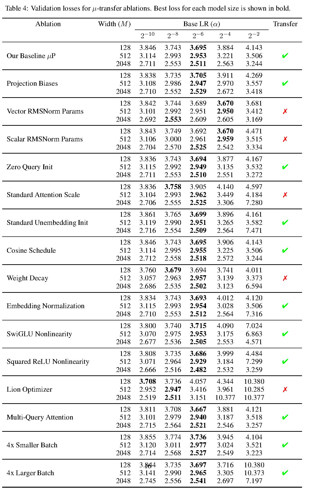
  <figcaption>μP 学习率迁移的完整消融实验。可学习的 RMSNorm 增益、标准注意力缩放、权重衰减和 Lion 在这组单次实验中没有稳定迁移；其余多数设置能够迁移。图源：Lingle, 2025。</figcaption>
</figure>

其中，RMSNorm 增益的含义见[归一化方法](../norm/)，Lion 和权重衰减的更新机制见[优化器](../optimizers/)。需要注意，Lion 在后续多随机种子实验中恢复了迁移，因此表中的失败不能直接解释为 Lion 与 μP 在结构上不兼容。

### 5.4 好看的拟合曲线也可能在外推时失效

小规模数据上的 IsoFLOP 曲线拟合得很好，不代表放大计算量后训练一定稳定。下面的案例使用 Cautious AdamC，并按批大小的平方根缩放学习率：拟合区间内的等计算量抛物线很规整，但外推点逐渐偏离预测。[14]

<figure>
  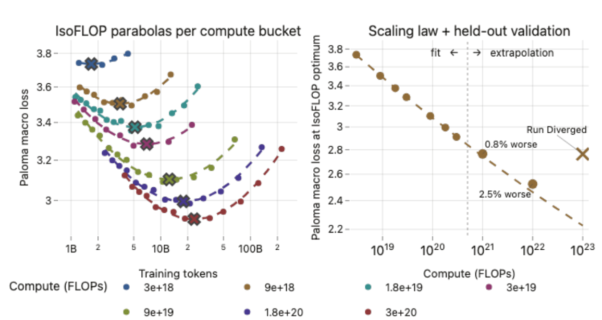
  <figcaption>在保留的外推实验中，约 \(10^{21}\) FLOPs 的结果比预测差 \(0.8\%\)，约 \(10^{22}\) FLOPs 时差 \(2.5\%\)，约 \(10^{23}\) FLOPs 时训练直接发散。图源：William Held, Delphi。</figcaption>
</figure>

这张图不能单独确定发散的唯一原因，但它说明建立扩展定律时必须保留<strong>外推验证点（Held-out Validation Point）</strong>。实践中应逐级放大训练规模，检查损失偏差和数值稳定性；一旦偏离开始系统性扩大，就需要重新检查参数化、学习率缩放、批大小规则和优化器，而不是继续相信原有拟合。

### 5.5 小结

- 最优学习率、批大小等超参数会随模型规模和训练步数变化，并非固定常数；Step Law 可以用小规模实验拟合这种变化。
- μP 通过控制初始化、激活和参数更新的尺度，使小模型上找到的基础超参数能够迁移到更宽的模型。
- 不同优化器的更新方式不同，需要采用与其更新几何相匹配的缩放规则，不能直接套用同一组结论。
- 架构、归一化、正则化或优化器发生变化时，超参数迁移可能失效，必须重新验证。
- 小规模曲线拟合良好不代表大规模训练一定稳定，外推结果应使用更大规模的保留实验进行检验。

## 参考文献

[1] Shengding Hu et al. MiniCPM: Unveiling the Potential of Small Language Models with Scalable Training Strategies. [Online]. Available: https://arxiv.org/abs/2404.06395

[2] Greg Yang et al. Tensor Programs V: Tuning Large Neural Networks via Zero-Shot Hyperparameter Transfer. [Online]. Available: https://arxiv.org/abs/2203.03466

[3] Jordan Hoffmann et al. Training Compute-Optimal Large Language Models. [Online]. Available: https://arxiv.org/abs/2203.15556

[4] Jared Kaplan et al. Scaling Laws for Neural Language Models. [Online]. Available: https://arxiv.org/abs/2001.08361

[5] DeepSeek-AI. DeepSeek LLM: Scaling Open-Source Language Models with Longtermism. [Online]. Available: https://arxiv.org/abs/2401.02954

[6] Qwen Team. Qwen2.5 Technical Report. [Online]. Available: https://arxiv.org/abs/2412.15115

[7] Qwen Team. Qwen3 Technical Report. [Online]. Available: https://arxiv.org/abs/2505.09388

[8] Kimi Team. Kimi K2: Open Agentic Intelligence. [Online]. Available: https://arxiv.org/abs/2507.20534

[9] Hunyuan Team. Hunyuan-Large: An Open-Source MoE Model with 52 Billion Activated Parameters by Tencent. [Online]. Available: https://arxiv.org/abs/2411.02265

[10] Llama Team. The Llama 3 Herd of Models. [Online]. Available: https://arxiv.org/abs/2407.21783

[11] MiniMax. MiniMax-01: Scaling Foundation Models with Lightning Attention. [Online]. Available: https://arxiv.org/abs/2501.08313

[12] Houyi Li et al. Predictable Scale: Part I, Step Law — Optimal Hyperparameter Scaling Law in Large Language Model Pre-training. [Online]. Available: https://arxiv.org/abs/2503.04715

[13] Kaiyue Wen et al. Fantastic Pretraining Optimizers and Where to Find Them. [Online]. Available: https://arxiv.org/abs/2509.02046

[14] William Held. Delphi. [Online]. Available: https://oa.williamheld.com/blog/delphi/

[15] Keller Jordan et al. Muon: An optimizer for hidden layers in neural networks. [Online]. Available: https://kellerjordan.github.io/posts/muon/

[16] Nolan Dey et al. Cerebras-GPT: Open Compute-Optimal Language Models Trained on the Cerebras Wafer-Scale Cluster. [Online]. Available: https://arxiv.org/abs/2304.03208

[17] Lucas D. Lingle. An Empirical Study of μP Learning Rate Transfer. [Online]. Available: https://arxiv.org/abs/2404.05728

[18] Greg Yang, James B. Simon, and Jeremy Bernstein. A Spectral Condition for Feature Learning. [Online]. Available: https://arxiv.org/abs/2310.17813
