## 1. Why Study Scaling Laws?

Suppose someone gives you ten thousand B200 graphics processing units (GPUs) for one month and asks you to train a high-quality open-source large language model (LLM). The infrastructure, distributed-training framework, and pre-training data are all ready. The next question is: **how large should the model be?**

Model design involves many coupled choices:

- whether the model should be wider or deeper;
- how many attention heads to use;
- which nonlinear activation to choose;
- whether to use a Transformer or a long short-term memory network (LSTM);
- whether to use adaptive moment estimation (Adam) or stochastic gradient descent (SGD);
- whether to enlarge the model, train for longer, or collect more data.

<figure>
  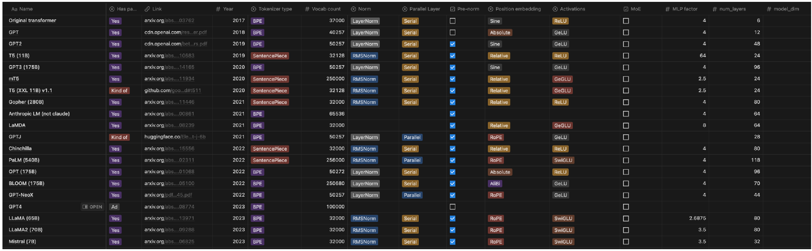
  <figcaption>Real training runs must compare many architecture and hyperparameter combinations at once. Simply copying an existing model configuration does not tell us whether it suits a new compute budget.</figcaption>
</figure>

The traditional approach tunes hyperparameters directly on large models, but every failed run is expensive. The optimistic premise of scaling laws is that we can:

1. train a collection of smaller models;
2. fit how performance changes with data, parameters, or compute;
3. extrapolate the relationship to the target scale;
4. decide the architecture, hyperparameters, and resource allocation before large-scale training begins.

Scaling laws are empirical regularities, not laws of nature. Their main value is not merely fitting a straight line, but turning expensive large-scale experiments into an engineering problem that can be predicted and compared.

### 1.1 Scale Variables and Performance Metrics

A scaling law is not limited to a single curve relating model parameter count to pre-training loss. At least three elements must be specified:

- **Scale variable:** the horizontal axis may be training compute (C), dataset size (D), model parameter count (N), equivalent compute, or even model release date.
- **Performance metric:** the vertical axis may be training or test loss, a task-specific metric such as accuracy or exact match, or even a composite capability index.
- **Functional form:** loss often follows a power law with resource scale, whereas specific capabilities may follow an S-shaped curve as compute increases.

For language models, test loss as a function of compute, training-token count, or non-embedding parameter count can be approximated by

\[
L(X)=L_{\infty}+AX^{-\alpha},\qquad X\in\{C,D,N\}.
\]

Here, (L_{\infty}) is the loss that remains difficult to eliminate by scaling further, (A) controls the overall position of the curve, and (alpha) determines how quickly performance improves with scale.

When the metric is a bounded capability such as word reordering or question-answering accuracy, the curve may instead resemble an S-shaped function:

\[
S(X)=\frac{1}{1+\exp[-(a\log X+b)]}.
\]

Such a curve changes slowly in the low-compute regime, rises rapidly after crossing a certain range, and eventually saturates. Composite model capability can also be tracked against release date. Therefore, discussing a scaling law requires more than saying that “performance improves with scale.” We must state **which resource is being scaled, which metric is being observed, and which function is used for fitting.**

<figure>
  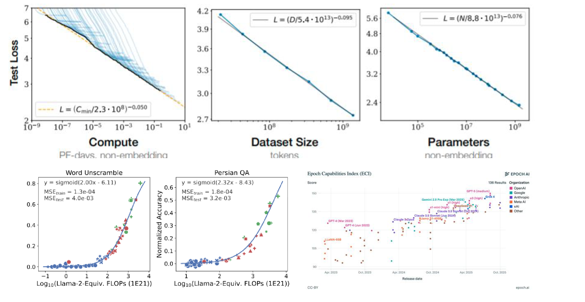
  <figcaption>Top: language-model loss follows approximate power laws with compute, dataset size, and non-embedding parameter count. Bottom: specific capabilities such as word reordering and Persian question answering are closer to S-shaped curves, while a composite capability index can also be tracked over model release dates.</figcaption>
</figure>

## 2. History: From Learning Curves to Neural Scaling Laws

### 2.1 Theoretical Sample Complexity and Observed Loss

Learning theory has long asked how much data is required. For example, learning from a finite set of (k) hypotheses yields a generalization-error bound that depends on the number of samples (n), the confidence level, and the number of hypotheses. Generative modeling of smooth probability densities likewise admits convergence rates with sample count.

These results usually answer a worst-case question—how bad the error can be—by providing an upper bound. They do not predict the loss actually observed after training. Scaling laws focus on the latter: **what loss will a real model reach at a given scale, and can small-scale experiments predict large-scale outcomes?**

### 2.2 Early Research on Data–Performance Learning Curves

In 1993, Cortes et al. used power-law decay to describe training and test errors in *Learning Curves: Asymptotic Values and Rate of Convergence*, and attempted to predict performance on the full training set from smaller-data experiments.[2]

<figure>
  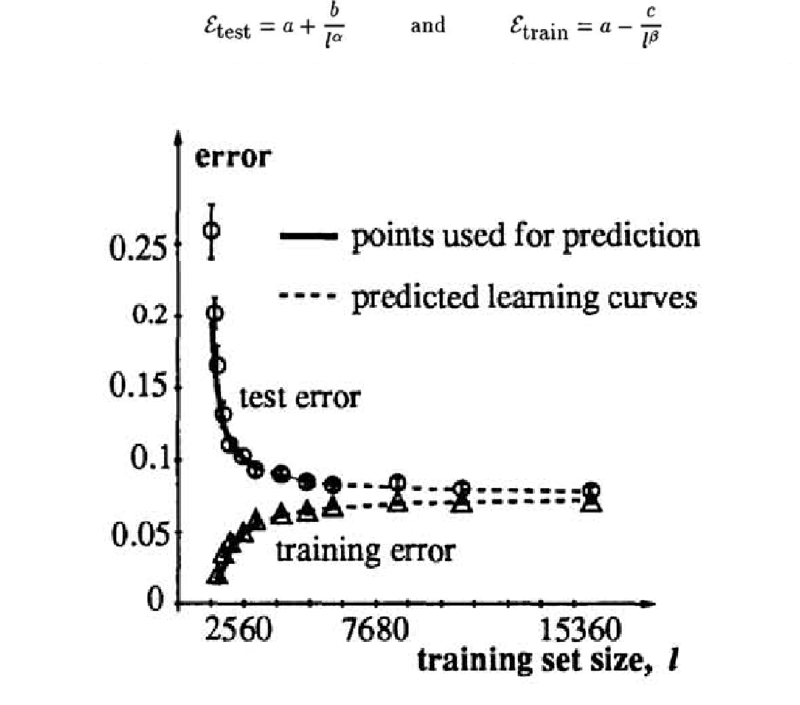
  <figcaption>Cortes et al. expressed error as the sum of an asymptotic value and a power-law decay term, then used observations from smaller training sets to predict the learning curve for a larger dataset.</figcaption>
</figure>

In 2001, Banko and Brill scaled the corpus for a natural-language disambiguation task from one million to one billion words. Every algorithm continued to benefit from more data and remained far from saturation at the commonly used data scales of the time. The paper therefore posed a practical question: rather than investing still more effort in algorithmic improvements, should more resources be devoted to building corpora?[3]

<figure>
  
  <figcaption>Four algorithms continued to improve as corpus size grew across several orders of magnitude, suggesting that data scale itself could matter more than small algorithmic differences.</figcaption>
</figure>

In 2012, Kolachina et al. compared exponential, power-law, inverse-logarithmic, and other function families. They used smaller machine-translation experiments to predict how the bilingual evaluation understudy (BLEU) score would change with data volume, and found that a power-law form extrapolated well.[4]

<figure>
  
  <figcaption>Several functions may fit the observed range well while behaving differently under extrapolation. Choosing the functional form is itself part of scaling-law research.</figcaption>
</figure>

### 2.3 Predictability of Large-Scale Neural-Network Learning Curves

In 2017, Hestness et al. systematically studied machine translation, language modeling, image classification, and speech recognition. Across a broad range, they found that generalization error decreased according to a power law. Data volume in language tasks was usually measured in tokens.[5]

<figure>
  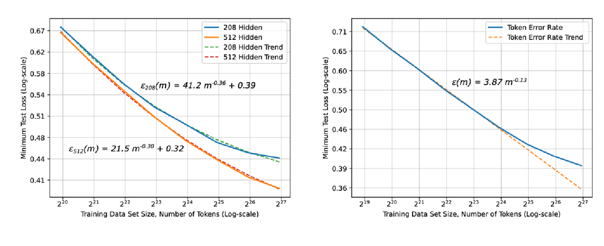
  <figcaption>For machine translation, error falls as the number of training tokens increases. Selecting the best model at every data scale still produces a combined curve close to a power law.</figcaption>
</figure>

This work also anticipated several ideas that later became important:

- the true power-law region may not be visible at small data scales, so optimization or initialization problems can be mistaken for capability “emergence”;
- learning curves can estimate the compute required to reach a target accuracy;
- when faster hardware permits more data or a larger model, the resulting scale can recover accuracy lost to low precision, sparsification, or related techniques;
- error, data volume, model size, and compute may obey a unified and predictable relationship.

## 3. Data Scaling Laws

### 3.1 Introduction

A data scaling law is a simple function that maps dataset size (n) to model error:

\[
\mathcal{E}(n)=f(n).
\]

Here, \(\mathcal{E}(n)\) is the model's generalization error on unseen data after training on \(n\) samples. The law asks: **if the model, training method, and data distribution remain broadly unchanged, how much performance improvement will additional training data provide?**

At the level of the overall trend, we usually expect \(f(n)\) to decrease monotonically: more data produces lower generalization error. Individual runs are affected by sampling and optimization noise, however, so monotonicity describes the fitted trend across experiments rather than requiring every observation to decrease strictly.

### 3.2 Three Regions of the Data–Performance Curve

The relationship between data and performance is rarely a line with the same slope from beginning to end. Plotting both data volume and generalization error on logarithmic axes often reveals an approximately S-shaped curve with three regions.[5]

1. **Small-data region:** there are too few samples for the model to extract the task structure reliably, so performance remains close to a best-guess baseline. Adding a small amount of data may produce little visible improvement.
2. **Power-law region:** the model begins to use new data consistently, and error falls approximately as a power law:

   \[
   \mathcal{E}(n)\approx\mathcal{E}_{\infty}+An^{-\alpha}.
   \]

   This region is close to linear on log–log axes and is the most suitable part of the curve for fitting and extrapolation.
3. **Irreducible-error region:** as more data is added, error approaches \(\mathcal{E}_{\infty}\). Label noise, intrinsic uncertainty in the task, or limitations of the model assumptions make this component difficult to remove by adding data alone.

<figure>
  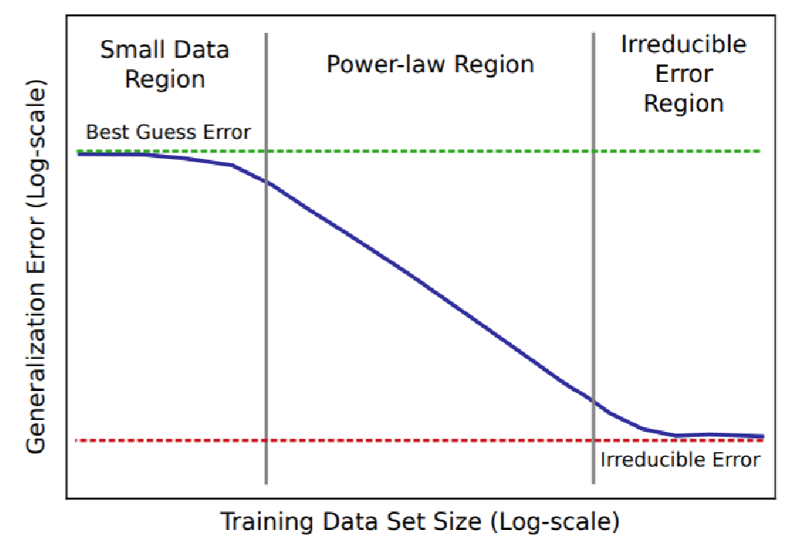
  <figcaption>A data scaling curve usually decreases monotonically through the small-data, power-law, and irreducible-error regions. The green dashed line is the best-guess error and the red dashed line is the irreducible error. Source: Hestness et al., 2017.</figcaption>
</figure>

Consequently, fitting a data scaling law does not mean forcing every experimental point into one power law. We must first determine whether the observations have entered the power-law region. Extrapolating from the small-data region will be too pessimistic, while ignoring the saturation term near the irreducible-error region will be too optimistic.

  
Kaplan et al.'s language-model experiments

  Kaplan et al. provide a concrete language-model example: data volume and test loss are approximately linear on log–log axes.[6] Their fitted relationship is

  \[
  L(D)=\left(\frac{D}{5.4\times10^{13}}\right)^{-0.095},
  \]

  where \(D\) is the number of training tokens and \(L(D)\) is test loss.

  <figure>
    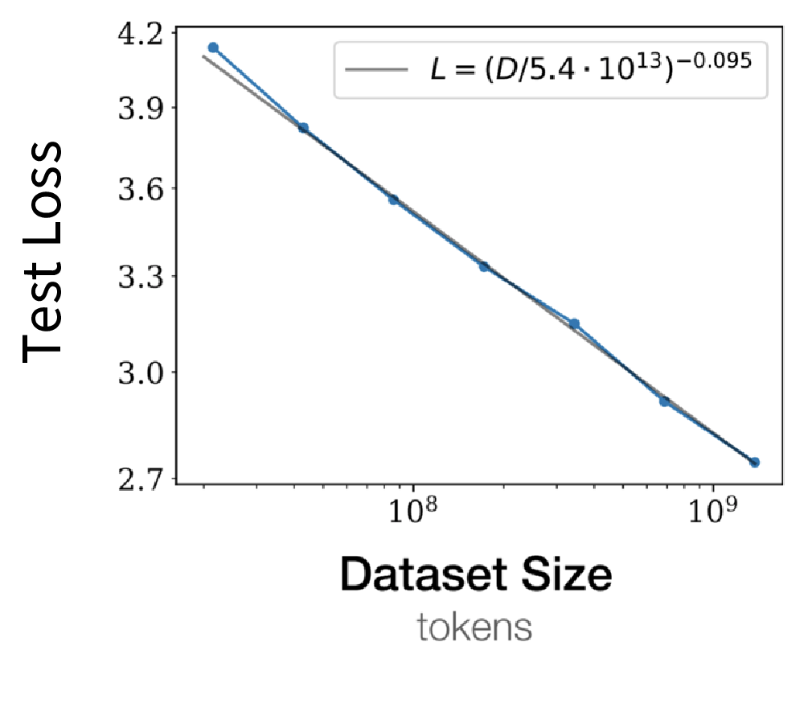
    <figcaption>Language-model test loss is approximately linear in training-token count on log–log axes, corresponding to the power law \(L(D)\propto D^{-0.095}\). Source: Kaplan et al., 2020.</figcaption>
  </figure>

  This example shows that language models can exhibit data power laws over a particular experimental range. The slope \(-0.095\) is an empirical fit to the power-law portion of the full curve and cannot be extrapolated indefinitely.

### 3.3 Why Can the Data–Performance Curve Follow a Power Law?

More data generally reduces error, so the overall curve should decrease monotonically. Monotonicity alone, however, does not explain why the relationship should specifically be a power law.

One candidate explanation is that estimation error in many simple statistical problems shrinks as a negative power of the sample count—that is, with polynomial decay:

\[
\mathcal{E}(n)\propto n^{-\alpha},\qquad \alpha>0.
\]

Here, \(n\) is the sample count and \(\alpha\) determines how quickly error falls. Taking logarithms gives

\[
\log \mathcal{E}(n)=-\alpha\log n+\text{constant},
\]

which is a straight line on log–log axes.

Two levels of conclusion must be distinguished:

- for simple problems such as mean estimation, this rate of error decay can be derived from probability theory;
- for modern language models, whether a power law appears, what its exponent is, and over which range it holds are primarily empirical observations rather than a proven universal rule.

This explanation is therefore a clue for understanding the empirical phenomenon, not a complete theory of language-model scaling laws. The simplest example that can be derived exactly is **mean estimation**.

Suppose \(n\) samples are independent and identically distributed:

\[
x_1,\ldots,x_n\sim\mathcal{N}(\mu,\sigma^2).
\]

Estimate the population mean with the sample mean:

\[
\hat{\mu}=\frac{1}{n}\sum_{i=1}^{n}x_i.
\]

Because \(\hat{\mu}\) is unbiased, its mean squared error (MSE) equals its variance:

\[
\mathbb{E}\left[(\hat{\mu}-\mu)^2\right]
=\operatorname{Var}(\hat{\mu})
=\frac{\sigma^2}{n}.
\]

Writing this MSE as \(\mathcal{E}(n)\) and taking logarithms gives

\[
\log \mathcal{E}(n)=-\log n+2\log\sigma.
\]

This is a straight line with slope \(-1\), or a scaling law with exponent \(\alpha=1\). More generally, any error that decays polynomially as \(1/n^\alpha\) becomes linear on log–log axes.

#### Why Is the Data-Scaling Exponent Usually Not \(-1\)?

Mean estimation and many classical parametric models have error of order \(1/n\), which might suggest

\[
\log \mathcal{E}(n)=-\log n+C.
\]

The expected slope on a log–log plot would then be \(-1\). Neural-network experiments instead produce much smaller exponents: about \(0.13\) for machine translation, \(0.30\) for speech recognition, and \(0.095\) for the language-model example above.[5][6]

<figure>
  
  <figcaption>Machine translation, speech recognition, and language modeling all exhibit data power laws, but their fitted exponents are approximately 0.13, 0.30, and 0.095—very different from the value 1 in classical mean estimation. Sources: Hestness et al., 2017; Kaplan et al., 2020.</figcaption>
</figure>

This does not invalidate the preceding derivation. Mean estimation is simply too easy: it estimates one fixed parameter, whereas a neural network must learn a complex function and may continue resolving finer input structure as more data becomes available.

#### Dimensional Dependence of Data Scaling in Nonparametric Learning

Nonparametric learning does not restrict the target to a small, fixed set of parameters in advance; it directly approximates an unknown function. Consider a two-dimensional example in which \(x_i\) is uniformly distributed over the unit square and

\[
y_i=f(x_i)+\varepsilon_i,\qquad \varepsilon_i\sim\mathcal{N}(0,1).
\]

The goal is to estimate \(f(x)\) from \(n\) samples. One intuitive method divides the two-dimensional space into square cells of side length \(n^{-1/4}\), then estimates the local function value from the average observation in each cell.

There are approximately \(\sqrt{n}\) cells, each containing an average of \(\sqrt{n}\) samples. If \(f\) is sufficiently smooth locally, both the noise variance and the squared bias from local approximation decrease to order \(n^{-1/2}\). The MSE is therefore approximately

\[
\mathcal{E}(n)=O\left(\frac{1}{\sqrt{n}}\right).
\]

Here \(1/\sqrt{n}\) denotes mean squared error, not its standard deviation. The complete calculation is shown below.

  
Why are there \(\sqrt{n}\) cells, and how is the error obtained?

  Let the cell side length be

  \[
  h=n^{-1/4}.
  \]

  The unit square can be divided into \(1/h=n^{1/4}\) intervals along each axis, so the total number of cells is

  \[
  N_{\text{cells}}=\left(\frac{1}{h}\right)^2
  =\left(n^{1/4}\right)^2
  =\sqrt{n}.
  \]

  Because \(n\) samples are distributed uniformly among these cells, the expected number in each cell is

  \[
  m\approx\frac{n}{N_{\text{cells}}}=\sqrt{n}.
  \]

  For a cell \(B\), estimate its local function value by averaging the observations inside it:

  \[
  \hat f_B=\frac{1}{m}\sum_{i:x_i\in B}y_i.
  \]

  The term \(\varepsilon_i\sim\mathcal N(0,1)\) describes **observation noise**, not estimation error itself. The standard normal distribution is chosen only to simplify the calculation: it has zero mean and variance one, and an average of independent normal variables remains normally distributed. The variance of the noise component in the local average is therefore

  \[
  \operatorname{Var}\left(\frac{1}{m}\sum_{i=1}^{m}\varepsilon_i\right)
  =\frac{1}{m}
  \approx\frac{1}{\sqrt n}.
  \]

  This is a variance and hence the noise contribution to MSE; the corresponding standard deviation or root mean squared error is \(n^{-1/4}\). Normality is not essential. If the noise variables are independent with zero mean and finite variance \(\sigma^2\), the expression becomes \(\sigma^2/m\) and the exponent of \(n\) is unchanged.

  We must also account for variation in \(f(x)\) within a cell. If \(f\) is Lipschitz continuous, a cell of side length \(h\) induces local bias of order \(O(h)\), and therefore squared bias of order \(O(h^2)\). A two-dimensional cell contains an average of \(nh^2\) samples, so the noise variance is \(O(1/(nh^2))\). Thus,

  \[
  \operatorname{MSE}(h)
  \approx h^2+\frac{1}{nh^2}.
  \]

  Balancing squared bias and variance,

  \[
  h^2\approx\frac{1}{nh^2},
  \]

  gives \(h\approx n^{-1/4}\). Both terms are then of order \(n^{-1/2}\). In other words, the side length \(n^{-1/4}\) balances local-approximation bias against sampling-noise variance.

Large cells give inaccurate local approximations, while small cells contain too few samples. This trade-off makes the error exponent depend on both the dimension of the input space and the smoothness of the function.

Extending this intuition to \(d\) dimensions gives one simplified dimension-dependent form:

\[
\mathcal{E}(n)\propto n^{-1/d},
\]

and hence

\[
\log\mathcal{E}(n)=-\frac{1}{d}\log n+C.
\]

As dimension increases, the absolute slope becomes smaller and error declines more slowly with additional data. This suggests one reason that a neural network, which faces a high-dimensional function-approximation problem, need not share the exponent 1 of classical parameter estimation. The \(1/d\) relationship is only a simplified example; the exact exponent also depends on the error definition, function smoothness, and estimator.

#### Data-Scaling Exponents and the Intrinsic-Dimension Hypothesis

Raw data may have very high dimension even though its meaningful variation is concentrated on a lower-dimensional structure. The effective number of degrees of freedom is called **intrinsic dimensionality**. An image, for example, contains many pixels, but natural images do not uniformly fill the space of all possible pixel combinations.

Bahri et al. consequently proposed that, in a resolution-limited regime, the model progressively resolves a smooth data manifold and the data-scaling exponent \(\alpha\) may be approximately inversely proportional to the manifold's intrinsic dimension \(d\):[7]

\[
\alpha\propto\frac{1}{d}.
\]

<figure>
  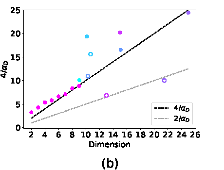
  <figcaption>In controlled teacher–student experiments, \(4/\alpha_D\) is close to linear in the data-manifold dimension; results are more scattered on real datasets such as CIFAR, SVHN, and MNIST. Source: Bahri et al., 2021.</figcaption>
</figure>

This conclusion should be understood as a **theoretical hypothesis and experimental clue**, not an established universal law. Controlled teacher–student experiments agree reasonably well with the prediction, but the relationship is less clear on real datasets, and intrinsic dimension itself has no unique and stable estimator. The hypothesis helps explain why tasks can have different exponents, but data dimension alone cannot yet predict the scaling law of a language model accurately.

### 3.4 How Data Composition and Distribution Shift Change the Curve

So far, the discussion has focused on how dataset size affects performance. Yet two datasets of equal size can produce different results depending on their sources and mixture proportions.

Data composition raises several further scaling questions:

- can small models identify an optimal data mixture?
- when data is scarce, should existing samples be repeated?
- how should data quality, mixture proportions, and repetition be considered together?

One concrete issue is **distribution shift**: how does a data scaling curve change when training data comes from multiple sources and their mixture proportions vary?

Let \(n\) be the total training-data volume and \(q\) the vector of source proportions. Hashimoto approximates excess loss as[8]

\[
\log L(n,q)\approx-\alpha\log n+\log C(q),
\]

or equivalently,

\[
L(n,q)\approx C(q)n^{-\alpha}.
\]

In this expression, data volume \(n\) determines the power-law decay, while composition \(q\) changes the curve's position through \(C(q)\). If different values of \(q\) share the same \(\alpha\), they appear as parallel lines with equal slopes and different intercepts on a log–log plot.

<figure>
  
  <figcaption>Left: changing source proportions \(q\) leaves the slope of the excess-error curve approximately unchanged while shifting its intercept. Right: in this two-source example, a nearly balanced mixture has the lowest intercept, while using only one source substantially increases error. Source: Hashimoto, 2021.</figcaption>
</figure>

This example shows that adding data and improving data composition are different problems. Even with a fixed number of samples, collecting complementary and more diverse data can shift the entire loss curve downward.

The statement that composition changes only the intercept and not the slope is not a theorem for arbitrary distribution shifts. It is a modeling assumption proposed and tested on several tasks. The scaling exponent may also change when data sources, model classes, or evaluation distributions differ substantially.

#### Selecting Data Mixtures with Small-Scale Experiments

  
Two methods for selecting data mixtures at small scale

  Once we know that composition affects performance, the next question is whether a collection of inexpensive small-model runs can select a mixture for the target large model. In practice, this is much harder than fitting a one-dimensional data-volume curve.

  One natural approach is a **data mixing law**. Ye et al. proposed a three-stage prediction process:[9]

  1. use a training-step scaling law to extrapolate from a few steps to more steps;
  2. use a model-size scaling law to extrapolate from small models to the target model;
  3. use a data mixing law to predict unobserved mixture proportions from those already tested.

  <figure>
    
    <figcaption>Starting from small models, short runs, and observed mixtures, the method successively extrapolates training steps, model size, and unseen data mixtures, then searches for the proportion with the lowest predicted loss. Source: Ye et al., 2024.</figcaption>
  </figure>

  This route separates several expensive dimensions, but every fitting stage introduces error, and the relative ranking of data mixtures can change with model size and training duration. The mixture that is best at small scale may not remain best at the target scale.

  DataDecide evaluated the problem more directly by using small-scale experiments to predict pairwise outcomes among 25 pre-training data strategies for a target model with 1B parameters.[10] Ranking the strategies with a single 150M-parameter model already achieved roughly \(80\%\) decision accuracy. Under the same prediction-compute budget, none of the eight multiscale scaling-law baselines tested in the paper surpassed the frontier established by this simple method.

  <figure>
    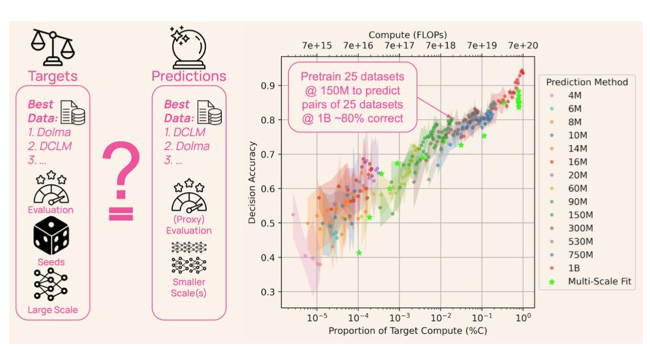
    <figcaption>DataDecide compares small-scale predictions with the true ranking at a 1B-parameter target. Decision accuracy generally improves with prediction compute; pairwise comparisons of 25 strategies using a 150M model are correct about 80% of the time. Source: Magnusson et al., 2025.</figcaption>
  </figure>

  The conclusion is not that scaling laws are useless. When the goal is simply to choose the better data strategy, however, a complex fit must be compared with the strong baseline of directly using the small-model ranking. Training at several additional scales may not compensate for curve-fitting and evaluation noise.

### 3.5 Diminishing Returns from Repetition under Limited Data

Standard data scaling laws usually assume that every increase in \(D\) adds unseen samples. High-quality data is finite in practice, and longer training often means passing over the same data multiple times. The total number of processed tokens can then no longer be treated as the effective data volume.

Muennighoff et al. decompose the total training-token count into[11]

- \(U_D\): the number of unique tokens;
- \(R_D=D/U_D-1\): the number of extra repetitions, equal to the number of epochs minus one.

To describe the declining marginal value of repeated data, they define effective data \(D'\) as

\[
D'=U_D+U_D R_D^*
\left(1-e^{-R_D/R_D^*}\right),
\]

where \(R_D^*\) is an empirically fitted characteristic scale controlling how quickly repeated data loses value.

When repetition is limited, \(R_D\ll R_D^*\), and \(1-e^{-x}\approx x\) gives

\[
D'\approx U_D+U_D R_D
=U_D(1+R_D)=D.
\]

The first few repetitions therefore count almost like new data. In contrast, when \(R_D\) becomes large,

\[
D'\longrightarrow U_D(1+R_D^*).
\]

Effective data eventually saturates, and further repetition contributes almost no new information.

<figure>
  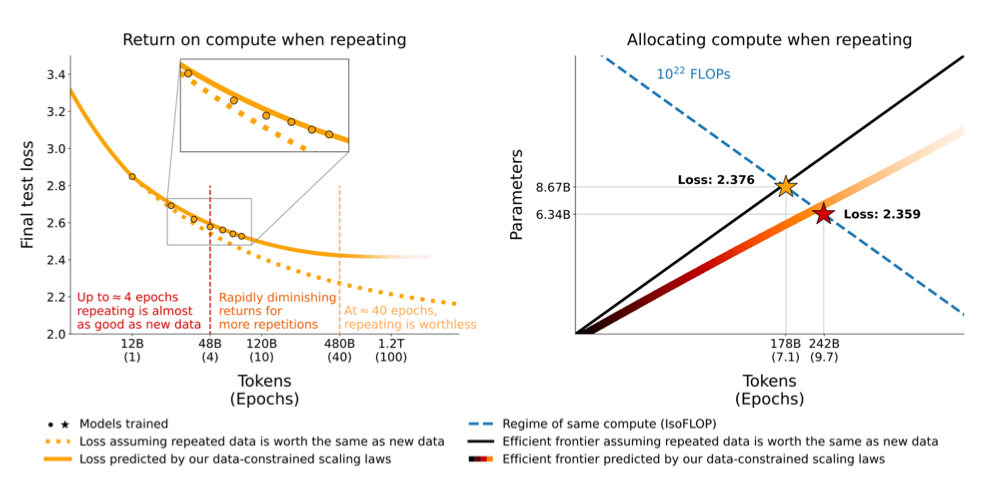
  <figcaption>Left: in these experiments, repetitions up to roughly four epochs behave similarly to new data; returns then decay rapidly, and additional repetition is nearly ineffective around 40 epochs. Right: for a fixed compute budget, a law accounting for repetition favors a slightly smaller model trained for more epochs. Source: Muennighoff et al., 2023.</figcaption>
</figure>

The right panel gives an example with \(10^{22}\) floating-point operations (FLOPs). If repeated and new data are incorrectly assumed to be equivalent, the compute-optimal point is about 8.67B parameters and 7.1 epochs. After accounting for diminishing returns, the predicted optimum shifts to about 6.34B parameters and 9.7 epochs, with slightly lower loss.

When data is limited, we therefore cannot apply a scaling law that assumes every token is new. The first few repetitions are often useful, but the return on additional compute approaches zero as the epoch count grows. The values four and forty in the figure are empirical results from a particular experimental range, not fixed thresholds for every model and dataset.

### 3.6 Breakdown under Extreme Repetition

With a fixed amount of unique data, increasing the epoch count initially reduces loss, but this trend cannot continue indefinitely. After repetition passes the optimum, the model overfits and validation loss rises. The monotonically decreasing, saturating data-constrained law in Section 3.5 is therefore an empirical approximation over a limited range and cannot be extrapolated to almost unlimited compute.[12]

More generally, a scaling law depends on the model, data, and training recipe used to fit it. It describes the empirical trend of existing methods over a particular range, not an inviolable performance limit.

  
Experimental results and the effect of the training recipe

  With a fixed pre-training corpus, Kim et al. observed that:

  - increasing only the number of epochs first reduced validation loss and then increased it through overfitting;
  - increasing only parameter count did not preserve monotonic loss reduction, even after retuning the learning rate and epoch count for every size;
  - stronger regularization and model ensembling produced a lower loss curve than the standard training recipe.

  <figure>
    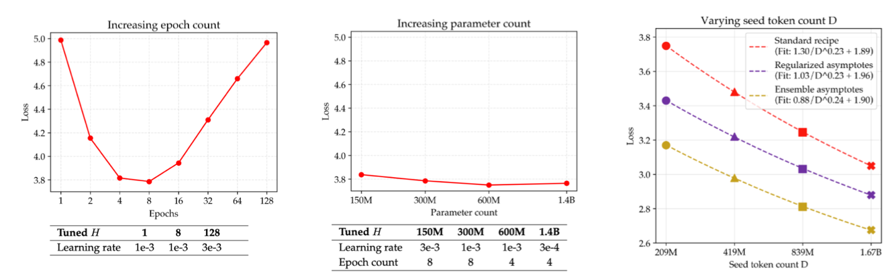
    <figcaption>Left: continued repetition passes the optimum and causes overfitting. Middle: enlarging the model does not guarantee continually falling loss. Right: regularization and ensembling shift the data scaling law downward, showing that the original curve depends on the training recipe. Source: Kim et al., 2025.</figcaption>
  </figure>

  Training and validation loss must be distinguished here. During repeated training, a model may keep lowering training loss while validation loss rises after the optimum. This is precisely the overfitting regime omitted by the monotonic saturation formula in Section 3.5.

  The paper's “lower bound” is better understood as a **performance baseline provided by existing methods**, not a strict mathematical lower bound. For a loss metric, “doing better” means that improved regularization, hyperparameters, or ensembling may achieve loss below the previously fitted curve.

### 3.7 How Compute Scale Changes the Optimal Data-Filtering Strategy

Limited data also changes the appropriate filtering strategy. Web data is heterogeneous: a high-quality subset is generally most valuable on its first use, but its marginal utility declines with repeated training. This creates a **quality–quantity trade-off (QQT)**.[13]

Experiments by Goyal et al. on vision–language models give an intuitive result:

- **Small compute budget:** retain only the highest-quality data and filter aggressively.
- **Medium compute budget:** enlarge the data pool and mix in more unseen examples.
- **Large compute budget:** relax filtering further to avoid too many repetitions over a small high-quality subset.

<figure>
  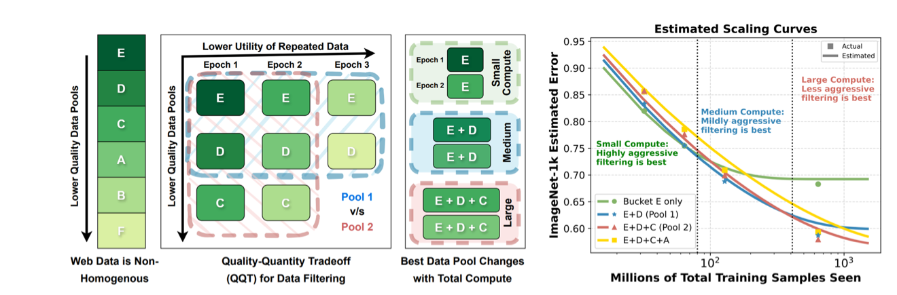
  <figcaption>Repeated use gradually reduces the utility of high-quality data, so the optimal pool changes with the total number of training samples. In the ImageNet-1k experiment on the right, aggressive filtering is best at small compute, while medium and large budgets successively require larger pools. Source: Goyal et al., 2024.</figcaption>
</figure>

Data cleaning therefore cannot be chosen independently of the final training scale. A filtering threshold that works for a small experiment may be unsuitable for a large run. Because this result comes from a particular vision–language setting, the relationship among data quality, repetition, and compute must be re-estimated before applying it to language models.

### 3.8 Summary of Data Scaling Laws

- Within an effective scaling region, the logarithm of data volume and the logarithm of error are often approximately linear, producing an empirical power law.
- Similar behavior appears across many tasks and models, but the fitted exponent and valid range differ.
- Mean estimation and generalization analysis explain why polynomial decay arises naturally, but they do not prove that deep models must obey the same power law.
- Scaling laws can guide not only performance prediction but also data collection, mixing, repetition, and filtering.
- When data is limited, both the training recipe and the optimal composition change with compute scale, so a small-scale curve cannot be extrapolated mechanically without limit.

## 4. Scaling Laws for Model Engineering

The preceding data scaling laws mainly ask how much improvement additional data provides when the model and training method remain broadly fixed. Model engineering also treats the design itself as a variable, with the goal of answering two kinds of questions before training a very large model:

- **Model and training method:** should we choose a Transformer or an LSTM, and Adam or SGD?
- **Resource allocation:** should we train longer or enlarge the model, and should we collect more data or add GPU compute?

Comparing every option directly at the target scale is usually unaffordable. The scaling-law approach trains a collection of small models for every candidate, fits performance as a function of parameter count or compute, and compares the curves near the target scale.

Kaplan et al.'s classic experiments studied model-engineering choices including[6]

- architecture;
- optimizer;
- aspect ratio and network depth;
- batch size.

These choices cannot be made from the best result at one scale alone. Candidate curves may have different intercepts and slopes, and their rankings can even reverse as scale increases.

### 4.1 How Architecture Changes the Scaling Curve

#### Parameter Scaling for Transformers and LSTMs

One expensive way to determine whether a Transformer is better suited than an LSTM to a very large language model would be to train an LSTM at GPT-3 scale. The scaling-law approach instead trains both architectures at several smaller sizes and compares complete curves of test loss against non-embedding parameter count.

Kaplan et al. compared Transformers with LSTMs of several depths using the same dataset and context length. Test loss for both architectures fell approximately with increasing non-embedding parameters, but the Transformer curve was lower and descended faster. Within this experimental range, the gap therefore grew with model size.[6]

<figure>
  
  <figcaption>Left: test loss decreases with non-embedding parameter count, and the Transformer curve lies below those of one-, two-, and four-layer LSTMs. Right: the architectures perform similarly near the beginning of the context, but LSTM gains plateau after roughly 100 tokens while the Transformer continues to benefit from longer context. Source: Kaplan et al., 2020.</figcaption>
</figure>

The right panel helps explain the difference. LSTMs can approach Transformer performance for tokens near the beginning of a context, but their gain quickly saturates at later positions, whereas Transformers continue to use longer context.

This is not a theorem that Transformers must outperform LSTMs on every task. The comparison uses particular language-modeling data, a specific training recipe, and one definition of parameter count. Equal parameter counts also do not imply equal FLOPs, training speed, or inference cost. Scaling laws reduce comparison cost but do not remove the limitations of the experimental setup.

#### The Best Architecture Can Change with Compute Scale

The Transformer–LSTM comparison involves only two curves. Tay et al. went further by training ten Transformer and non-Transformer architecture families—including Transformer, ALBERT, dynamic convolution, Performer, MLP-Mixer, and Switch Transformer—and measuring compute uniformly in FLOPs.[14]

<figure>
  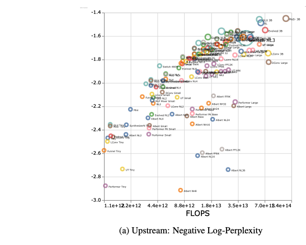
  <figcaption>Colors identify architectures and circle size denotes parameter count. Overall, greater compute raises negative log perplexity, meaning lower pre-training perplexity, but substantial architecture differences remain at similar compute. Source: Tay et al., 2022.</figcaption>
</figure>

Looking at one scale can lead us to mistake “better at this point” for “still better after scaling.” What matters is each architecture's complete compute-scaling curve:

- some architectures perform well at low compute but flatten early;
- others are not competitive at small scale but have a better scaling slope;
- the best architecture may therefore change with the compute budget.

<figure>
  
  <figcaption>The green curve is the standard Transformer and each red curve another architecture. Curve positions and slopes differ substantially. Some alternatives match or beat the Transformer at small scale but gain less as compute increases. Source: Tay et al., 2022.</figcaption>
</figure>

In these experiments, the standard Transformer did not have the best absolute result in every compute regime, but it exhibited a strong and consistent scaling trend. The paper also found that lower pre-training perplexity did not necessarily translate proportionally into downstream gains. Architecture selection should therefore consider **the target compute regime, the curve slope, and the final evaluation metric**, not merely one group of equally sized models.

### 4.2 How the Optimizer Changes the Data-Scaling Curve

Hestness et al. compared Adam and SGD on a character-level language-modeling task using the same ten-layer recurrent highway network (RHN).[5]

<figure>
  
  <figcaption>Solid lines show experiments at different data scales and dashed lines the power-law fits. Adam's curve lies below SGD's, but the curves are nearly parallel, indicating almost identical data-scaling exponents. Source: Hestness et al., 2017.</figcaption>
</figure>

The fitted curves are

\[
\mathcal{E}_{\mathrm{SGD}}(m) \approx 5.37m^{-0.094},
\qquad
\mathcal{E}_{\mathrm{Adam}}(m) \approx 5.25m^{-0.095}.
\]

Here, \(m\) is the number of characters in the training data and \(\mathcal{E}(m)\) is the lowest validation loss. The exponents are almost identical, so the curves are nearly parallel on log–log axes. Adam mainly shifts the curve downward and obtains roughly 5% lower loss than SGD within this range. In this experiment, optimizer choice changes the position of the curve but not the rate of data scaling appreciably.

This is a 2017 RHN result from before the Transformer era and should not be transferred directly to modern LLMs.

### 4.3 Model Shape and Parameter Accounting: Depth, Width, and Embeddings

#### Diminishing Returns from Additional Depth

For a fixed parameter count, is a deeper model always better? Kaplan et al. compared test loss against non-embedding parameter count across models with different layer counts.[6]

<figure>
  
  <figcaption>Increasing depth from one to two layers produces a clear improvement. Beyond two layers, curves of different depths converge and additional layers have limited marginal benefit. Source: Kaplan et al., 2020.</figcaption>
</figure>

The single-layer curve is clearly above the others, while the curves for two, three, six, and more layers are relatively close. Especially below \(10^7\) non-embedding parameters, the marginal benefit of further depth diminishes quickly. Depth is not irrelevant; rather, after a basic depth is reached, **total scale predicts loss better than layer count itself**.

#### Transformers Are Relatively Insensitive to Shape at Fixed Parameter Count

Besides layer count, we can vary the feed-forward ratio, aspect ratio, and attention-head dimension. When total non-embedding parameters remain approximately fixed, these hyperparameters redistribute parameters rather than enlarge the model.[6]

<figure>
  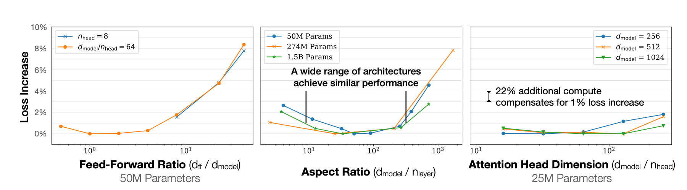
  <figcaption>Across the broad ranges tested, many Transformer shapes achieve similar performance. Aspect ratio can vary by roughly 40× while loss changes by only a few percent; the figure also estimates that about 22% extra compute can offset a 1% increase in loss. Source: Kaplan et al., 2020.</figcaption>
</figure>

All three curves have a broad low valley in the middle, showing that many shapes perform similarly. Loss rises clearly only when the ratios become extreme. Scaling a model therefore does not usually require preserving one aspect ratio exactly, but extremely narrow, extremely wide, or unreasonable head-dimension configurations should still be avoided.

#### Embedding and Non-Embedding Parameters Are Not Equivalent

The horizontal axes above deliberately use non-embedding parameters because parameter types do not have equal predictive value.

<figure>
  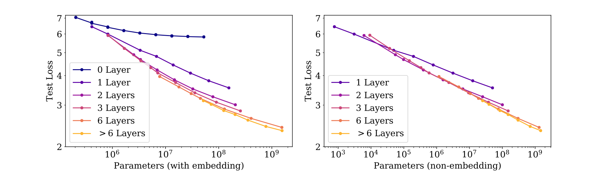
  <figcaption>Left: including embedding parameters produces distinct curves for different depths. Right: after excluding embeddings, models with at least two layers and non-extreme aspect ratios approximately converge to one trend. Source: Kaplan et al., 2020.</figcaption>
</figure>

Embedding-matrix size is determined mainly by vocabulary size and hidden dimension. Embeddings do not perform the same repeated transformations as attention and feed-forward layers. Adding embedding and backbone parameters directly can therefore make equal parameter counts correspond to different structures and compute patterns. For these dense-Transformer experiments, non-embedding parameter count is a more stable scale variable.

### 4.4 Measuring Mixture-of-Experts Scale: Total and Active Parameters

The unequal value of parameters is even more apparent in a sparse mixture-of-experts (MoE) model. An MoE may contain many experts while activating only a subset for each token. We must distinguish

- **total parameters \(N\):** every parameter stored by the model;
- **active parameters \(N_a\):** the parameters that actually participate in processing one token.

With \(E\) experts in total and \(K\) selected for each token, sparsity is

\[
S=\frac{E-K}{E}.
\]

<figure>
  
  <figcaption>At a fixed training-compute budget, pre-training loss depends on both active parameter count and MoE sparsity; no single parameter count describes this surface. Source: Abnar et al., 2025.</figcaption>
</figure>

Abnar et al. fitted iso-compute surfaces across sparsity levels and model sizes at fixed training compute. As sparsity rises, the total and active parameter counts in the compute-optimal configuration move in opposite directions.[15]

<figure>
  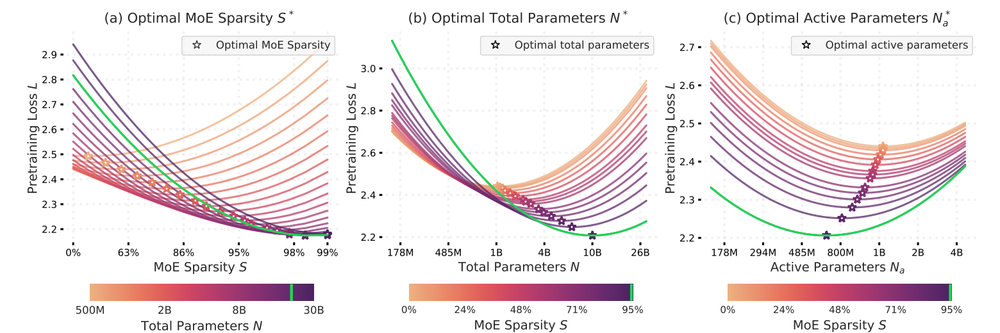
  <figcaption>Stars mark the optimum on each curve. Greater sparsity increases the optimal total parameter count but reduces the optimal active count, allowing MoE models to exchange more stored parameters for less per-token compute. Source: Abnar et al., 2025.</figcaption>
</figure>

Total parameters alone cannot measure MoE scale. A more complete scaling law must account jointly for **total parameters, active parameters, sparsity, and training compute**. These experiments primarily measure cost in theoretical FLOPs, however; memory consumption, expert communication, and hardware utilization can offset some sparsity gains in practice.

### 4.5 Critical Batch Size: Balancing Training Speed and Compute Efficiency

#### Why Larger Batches Have Diminishing Returns

Batch size \(B\) is the number of training samples or tokens used for one parameter update. Small batches produce noisy gradients. Moderately larger batches stabilize the gradient estimate and reduce the number of serial updates required to reach a target loss.[16]

<figure>
  
  <figcaption>Left: larger batches reduce gradient-estimation noise and permit larger effective updates. Right: increasing batch size yields nearly linear speedup far below the gradient-noise scale, but training speed saturates beyond the transition. Source: McCandlish et al., 2018.</figcaption>
</figure>

When \(B\) is small, doubling it can trade additional parallel compute for nearly twice the training speed. Once the batch is large enough that its estimated gradient is already close to the true gradient, further samples barely improve the update direction and merely add compute. The transition from near-linear speedup to rapidly diminishing returns is the **critical batch size \(B_{\mathrm{crit}}\)**.

#### Measuring the Critical Batch Size

Choose a target loss, train with several batch sizes, and record the following quantities required to reach that loss:

- the number of parameter updates \(S\);
- the number of processed samples \(E=BS\).

More concretely, choose discrete batch sizes \(B_1,\ldots,B_k\), obtain the corresponding \((S_i,E_i)\), and jointly fit[16]

\[
\left(\frac{S}{S_{\min}}-1\right)
\left(\frac{E}{E_{\min}}-1\right)=1.
\]

The quantities \(S_{\min}\) and \(E_{\min}\) are fitted parameters. The former is the limiting update count for very large batches, and the latter the limiting processed-sample count for very small batches. They need not equal the smallest values directly observed in any run. Critical batch size is defined as

\[
B_{\mathrm{crit}}=\frac{E_{\min}}{S_{\min}}.
\]

At \(B=B_{\mathrm{crit}}\), the two factors balance: training requires approximately \(2S_{\min}\) updates and processes \(2E_{\min}\) samples. Critical batch size is therefore a compromise between minimizing steps and minimizing compute, not either objective alone.

A Simple Fitting Example

Suppose experiments at three discrete batch sizes give

| Batch size \(B\) | Updates \(S\) | Total tokens \(E=BS\) |
|---:|---:|---:|
| 100 | 11,000 | 1,100,000 |
| 1,000 | 2,000 | 2,000,000 |
| 10,000 | 1,100 | 11,000,000 |

Fitting the relationship above might produce

\[
S_{\min}=1000,
\qquad
E_{\min}=1{,}000{,}000.
\]

Although the fewest observed updates and tokens are 1,100 and 1,100,000, the fitted \(S_{\min}\) and \(E_{\min}\) are smaller because they are asymptotic limits at extremely large and small batches. Hence,

\[
B_{\mathrm{crit}}
=\frac{E_{\min}}{S_{\min}}
=1000.
\]

The three points also illustrate the cost at each extreme. \(B=100\) is sample-efficient but requires many serial updates. \(B=10{,}000\) approaches the minimum update count but processes too many tokens. \(B=1000\) lies near the balance point.

Why Is Critical Batch Size Related to Gradient Noise?

Let \(G\) be the mean sample gradient and \(\Sigma\) the covariance matrix of an individual sample's gradient. A commonly used simplified gradient-noise scale is

\[
B_{\mathrm{noise}}\approx
\frac{\operatorname{tr}(\Sigma)}{\lVert G\rVert^2}.
\]

The numerator measures variation among sample gradients and the denominator the strength of the mean gradient signal. More noise relative to signal requires more samples for a stable estimate and supports effective use of a larger batch. McCandlish et al. found that an appropriately averaged gradient-noise scale predicted the order of magnitude of \(B_{\mathrm{crit}}\). This is an empirical model based on assumptions such as a local quadratic approximation and a sufficiently tuned learning rate, not a theorem valid for every training process.

#### Lower Target Loss Implies a Larger Critical Batch

Critical batch size is not constant throughout training. The gradient-noise scale generally rises as loss falls, so later training can effectively use a larger batch.

<figure>
  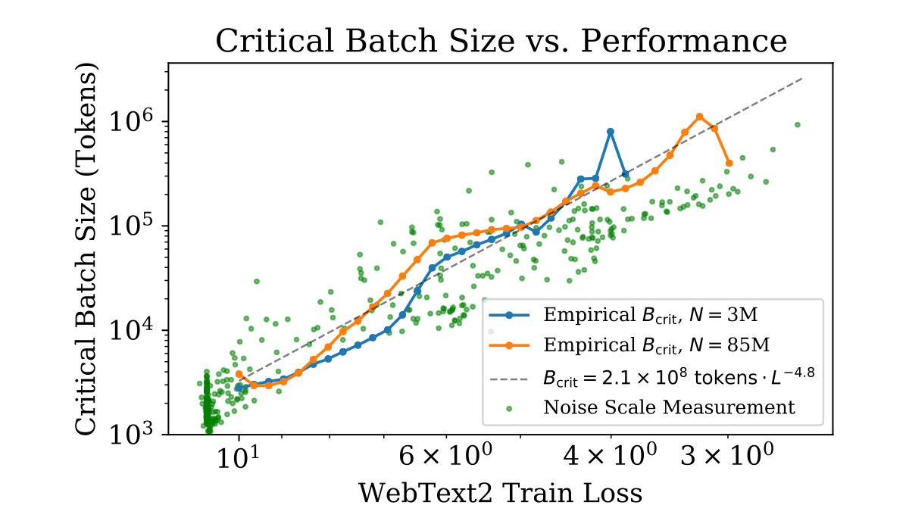
  <figcaption>The critical batch sizes of 3M- and 85M-parameter models depend primarily on the achieved training loss rather than directly on parameter count; green points are gradient-noise-scale measurements. Source: Kaplan et al., 2020.</figcaption>
</figure>

In the WebText2 experiments, Kaplan et al. fitted[6]

\[
B_{\mathrm{crit}}(L)
\approx 2.1\times10^8\ \text{tokens}\cdot L^{-4.8}.
\]

Thus, a lower target loss \(L\) implies a larger critical batch. The paper estimates that \(B_{\mathrm{crit}}\) approximately doubles whenever loss falls by about 13%. If a run uses batch size \(B\) and compute \(C\), its minimum equivalent compute in the small-batch limit can be written as

\[
C_{\min}(C)
=\frac{C}{1+B/B_{\mathrm{crit}}(L)}.
\]

When \(B\ll B_{\mathrm{crit}}\), training is close to compute-efficient. When \(B\gg B_{\mathrm{crit}}\), larger batches mainly consume additional compute without substantially reducing serial training time. The coefficient and exponent above come from the specific WebText2 experiments and must be remeasured for other tasks.

### 4.6 Maximal Update Parametrization: Transferring Hyperparameters across Width and Depth

#### Width \(\mu\)P: Transferring Base Hyperparameters as Models Widen

If initialization and learning rate are held unchanged while width increases, the optimal learning rate usually drifts with width. A value tuned on a small model then cannot be applied directly to a large one.[17]

<figure>
  
  <figcaption>Left: under standard parametrization, the minimum training loss moves with model width. Right: with maximal update parametrization, minima at different widths approximately align. Source: Yang et al., 2022.</figcaption>
</figure>

Maximal update parametrization (\(\mu\mathrm{P}\)) aims to keep the effect of each layer's parameter update on its representation at a comparable order of magnitude as width increases. Base hyperparameters can then be tuned on a smaller proxy and transferred to a wider target model, a method called \(\mu\)Transfer.

\(\mu\mathrm{P}\) is more than one learning-rate scaling equation. It jointly specifies how initialization scales, learning rates for different parameter types, and output multipliers vary with width. Nor does it directly compute the optimal learning rate. Instead, it separates hyperparameters into two levels:

- **Base hyperparameters:** values searched on the small model, such as the base learning rate, initialization scale, and output multiplier.
- **Applied hyperparameters:** values converted according to parameter type and the target-to-base width ratio using \(\mu\mathrm{P}\) rules.

The same scale factor is not applied to every parameter. Suppose target model \(M'\) is \(r\) times as wide as base model \(M\); different parameter types follow different rules.[18]

<figure>
  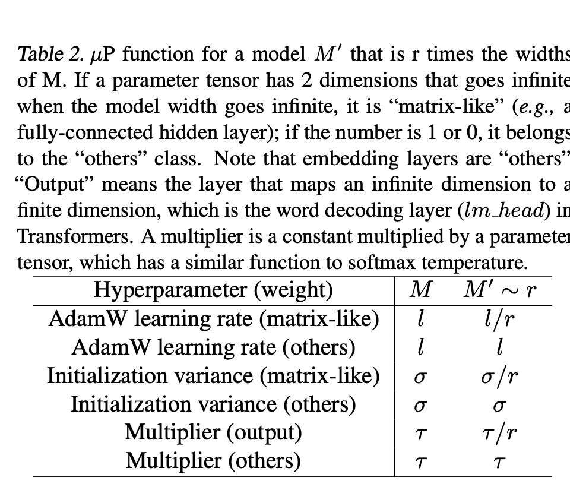
  <figcaption>When width increases by \(r\), the AdamW learning rate and initialization variance of matrix-like parameters scale by \(1/r\). Embeddings and other parameters remain unchanged, while the output-layer multiplier scales by \(1/r\). Source: Yao et al., 2024.</figcaption>
</figure>

How Should This Rule Table Be Read?

- **Matrix-like parameters:** both dimensions grow with model width, as in hidden-layer fully connected weight matrices. When width grows by \(r\), their AdamW learning rate changes from \(l\) to \(l/r\), and initialization variance from \(\sigma\) to \(\sigma/r\).
- **Other parameters:** zero or one dimension grows with width; embeddings belong to this category. Their learning rate and initialization variance remain unchanged in the table.
- **Output multiplier:** the language-model head maps a width-dependent hidden representation to a fixed vocabulary dimension. Its multiplier changes from \(\tau\) to \(\tau/r\), while other multipliers remain unchanged.

What transfers across scales is therefore a set of **base hyperparameters**. The learning rate actually applied to each parameter tensor must still be converted according to its type.

#### Depth-\(\mu\)P: Extending Hyperparameter Transfer to Model Depth

Width \(\mu\mathrm{P}\) studies how to preserve training dynamics as hidden dimension grows. Depth maximal update parametrization (Depth-\(\mu\mathrm{P}\)) asks how hyperparameters tuned on a shallow model can remain suitable as the number of residual layers \(L\) increases.[26]

For a residual network in which each residual block contains a single transformation, Depth-\(\mu\mathrm{P}\) writes block \(l\) as

\[
x_l
=x_{l-1}
+\frac{a}{\sqrt{L}}\,
g_l(x_{l-1};W_l).
\]

The symbols mean:

- \(x_{l-1}\) is the hidden state entering residual block \(l\), and the part preserved directly by the skip connection;
- \(g_l(x_{l-1};W_l)\) is the transformation in residual branch \(l\), with \(W_l\) its trainable parameters;
- \(x_l\) is the next representation after adding the residual output back to the main stream.

In the theoretical single-layer residual model, \(g_l\) can combine one linear transformation with a nonlinearity, for example

\[
g_l(x;W_l)=\phi(W_lx).
\]

In a Transformer, an attention or feed-forward sublayer can be viewed intuitively as a residual branch \(g_l\), but these sublayers generally contain several internal transformations, so the complete single-layer theory cannot be applied directly.

Depth-\(\mu\mathrm{P}\) scales two components with depth.

**First: the residual-branch coefficient.**

Let \(a\) be a base residual coefficient tuned on a shallower model and independent of target depth. In a target network with \(L\) residual blocks, the applied coefficient is

\[
a_L=\frac{a}{\sqrt{L}}.
\]

As the network deepens, each residual branch changes the main state less. Under a random-walk intuition, \(L\) increments of size \(1/\sqrt{L}\) accumulate to order \(O(1)\), preventing residual updates from growing without bound with layer count.

**Second: the learning rate of residual-block parameters.**

Let \(\eta\) be a base learning rate tuned on a shallower model. Its scaling with \(L\) depends on the optimizer:

\[
\eta_L=
\begin{cases}
\eta, & \text{SGD},\\
\dfrac{\eta}{\sqrt{L}}, & \text{Adam}.
\end{cases}
\]

- With stochastic gradient descent (SGD), the residual coefficient already scales the gradient of \(W_l\) by \(1/\sqrt{L}\), so the base learning rate \(\eta\) can remain unchanged.
- With adaptive moment estimation (Adam), the optimizer normalizes gradient magnitude and cancels the preceding gradient scaling, so the applied learning rate must also be changed to \(\eta/\sqrt{L}\).

The residual coefficient controls **how much each layer writes into the main state during the forward pass**, while the learning rate controls **the magnitude of each layer's parameter update during training**. Depth-\(\mu\mathrm{P}\) scales both so that a base residual coefficient \(a\) and base learning rate \(\eta\) can be tuned on a shallow network and converted for a deeper one, rather than retuned for every layer count.

What Limits Depth-\(\mu\)P for Transformers?

The complete theoretical results for Depth-\(\mu\mathrm{P}\) primarily concern residual networks with **one transformation per residual block**. Modern Transformer blocks generally contain attention, feed-forward networks, and multiple internal transformations. Theory and experiments in Tensor Programs VI find that when a residual block contains two or more transformations, a simple \(1/\sqrt{L}\) rule can make within-block feature learning approach linearization, and the optimal hyperparameters may still drift with depth.[26]

MiniCPM uses the complete width-\(\mu\mathrm{P}\) rules and also scales each layer's residual increment by

\[
\frac{\text{scale\_depth}}{\sqrt{L}}.
\]

The authors tuned \(\text{scale\_depth}=1.4\) on small models and observed that the base learning rate remained stable over their experimental range. The listed recipe does not, however, include the theoretical \(1/\sqrt{L}\) scaling of Adam's learning rate. A more precise description is that **MiniCPM uses width \(\mu\mathrm{P}\) together with depth-dependent residual scaling inspired by Depth-\(\mu\mathrm{P}\)**, rather than implementing the complete theoretical Depth-\(\mu\mathrm{P}\) prescription.[27]

\(\mu\mathrm{P}\) and Depth-\(\mu\mathrm{P}\) mainly address parametrization changes caused by width and depth. Batch size, training-data volume, learning-rate schedule, weight decay, and the data–model ratio still require separate fitting or validation; \(\mu\mathrm{P}\) does not determine them automatically.

### 4.7 Pre-Training and Downstream Metrics Do Not Scale Identically

Most preceding curves use training loss, validation loss, or perplexity as the performance metric. These quantities generally vary smoothly with parameter count, whereas performance on a **downstream task** can be much less stable.[14]

<figure>
  
  <figcaption>Left: negative log perplexity improves clearly with parameter count. Right: SuperGLUE accuracy for the same models is much more scattered and does not rise monotonically with size. Source: Tay et al., 2022.</figcaption>
</figure>

Lower pre-training loss therefore does not guarantee that downstream tasks improve in the same order. Architecture and inductive bias may affect whether learned knowledge transfers successfully, so comparing models only through pre-training curves can produce an incomplete conclusion.

This does not make downstream capability wholly unpredictable. It usually requires **separate fitting and validation against the particular downstream metric** rather than treating the scaling law of pre-training loss as the scaling law of downstream accuracy.

### 4.8 Selecting a Large-Model Design with Small-Scale Curves

The experiments above show that optimizer, depth, architecture, and learning-rate parametrization all affect how performance changes with scale. Their large-model effects can first be predicted from smaller-model curves:

1. Train several smaller models for every candidate design.
2. Fit a scaling relationship for each candidate, such as the separate curves for Adam and SGD.
3. Extrapolate to the target scale or compute budget and select the design with the best predicted performance.

“Prediction before training” means choosing **before training the target large model**, not avoiding experiments altogether. The prediction still depends on a set of small-scale runs and is trustworthy only when the scaling trend is stable and the extrapolation distance reasonable. Downstream tasks, as discussed above, must be revalidated using their own metrics.

## 5. Joint Data–Model Scaling Laws

### 5.1 Why Data Volume and Model Size Must Be Considered Jointly

The data scaling laws above primarily study the gain from additional training data for a fixed model. When model capacity is limited, however, the marginal benefit of data eventually saturates: a small model may lack the capacity to keep lowering loss even after seeing more tokens.

<figure>
  
  <figcaption>Smaller models reach a plateau earlier, while larger models obtain more benefit from the same additional data. Saying that data is “wasted” here means its marginal benefit is already low, not that it has no effect. Source: Kaplan et al., 2020.</figcaption>
</figure>

The question of whether to add data or enlarge the model cannot therefore be answered by a data-only curve. A **joint data–model scaling law** writes error as a function of both data scale \(n\) and model scale \(m\).

One simplified form proposed by Rosenfeld et al. is[19]

\[
\operatorname{Error}(n,m)
\approx n^{-\alpha}+m^{-\beta}+C.
\]

The term \(n^{-\alpha}\) is error from limited data, \(m^{-\beta}\) is error from limited model capacity, and \(C\) is the error floor that remains difficult to eliminate by enlarging either scale.

Kaplan et al. used a different coupled form which, after omitting normalization constants, can be written as[6]

\[
\operatorname{Error}(n,m)
\approx \left[m^{-\alpha}+n^{-1}\right]^{\beta}.
\]

Although the parametrizations differ, both express the same intuition: either insufficient data or an undersized model can become the performance bottleneck. Combining many \((n,m)\) pairs produces a two-dimensional joint error surface.

<figure>
  
  <figcaption>Blue points are measurements from different combinations of data volume and model size. The surface shows how joint error changes with both scales. Source: Rosenfeld et al., 2020.</figcaption>
</figure>

These simple functions fit joint error well over the experimental ranges in the papers, but they remain empirical models rather than theorems that hold for arbitrary datasets, architectures, and training methods.

### 5.2 Extrapolating from Small Models and Datasets to Select a Configuration

One important use of a joint scaling law is to fit parameters such as \(\alpha\) and \(\beta\) using only smaller models and less data, then predict performance for combinations of larger models and datasets.[19]

<figure>
  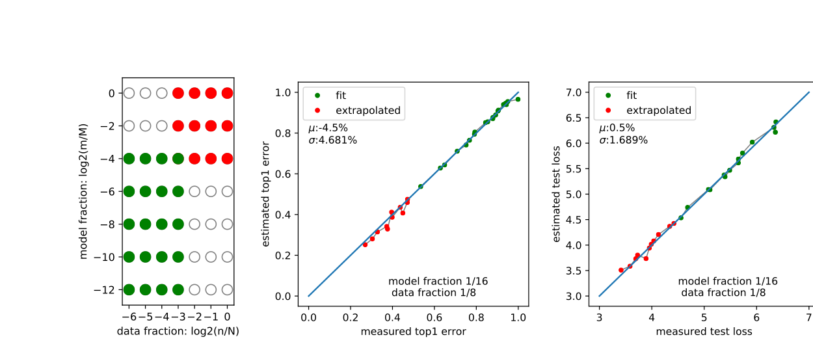
  <figcaption>Left: green points are used for fitting and red points are larger configurations to be extrapolated. Middle and right: predictions on ImageNet and WikiText-103 lie near the diagonal, indicating agreement between predicted and measured error. Source: Rosenfeld et al., 2020.</figcaption>
</figure>

The example fits using models no larger than \(1/16\) of the full model and data subsets no larger than \(1/8\) of the full dataset.

Extrapolation accuracy is not the final goal. Once small-scale experiments have fitted

\[
\operatorname{Error}(n,m)
\approx n^{-\alpha}+m^{-\beta}+C,
\]

data volume and model size can be selected under a cost constraint:

\[
(m^*,n^*)
=\underset{m,n}{\arg\min}\ \operatorname{Error}(n,m)
\quad
\text{s.t.}\quad
\operatorname{Cost}(m,n)\leq B.
\]

Here, \(B\) is the available budget, while \(\operatorname{Cost}(m,n)\) should reflect actual training compute, data-acquisition cost, or other constraints. Greater extrapolation distances increase the chance that training settings or data distributions will change, so the small-scale fit should still be checked with a few larger runs.

### 5.3 How Chinchilla Estimates the Compute-Optimal Data–Model Ratio

For a dense language model, training compute can be approximated as

\[
C\approx 6ND,
\]

where \(N\) is parameter count and \(D\) the number of training tokens. With compute \(C\) fixed, a larger model must be trained on fewer tokens, while more tokens require a smaller model. The problem is therefore not merely how large the model should be, but **how compute should be divided between model size and training data**.

Kaplan et al.'s fit gives[6]

\[
N_{\mathrm{opt}}\propto C^{0.73},
\qquad
D_{\mathrm{opt}}\propto C^{0.27}.
\]

Under this result, most new compute should enlarge the model while token count grows more slowly. The optimal number of tokens per parameter consequently decreases with budget:

\[
\frac{D_{\mathrm{opt}}}{N_{\mathrm{opt}}}
\propto C^{-0.46}.
\]

Hoffmann et al. re-estimated this relationship in the Chinchilla study. They found that, at equal compute, the Kaplan law selects **models that are too large and datasets that are too small**. A better allocation uses a smaller model and shows it more tokens.[20]

<figure>
  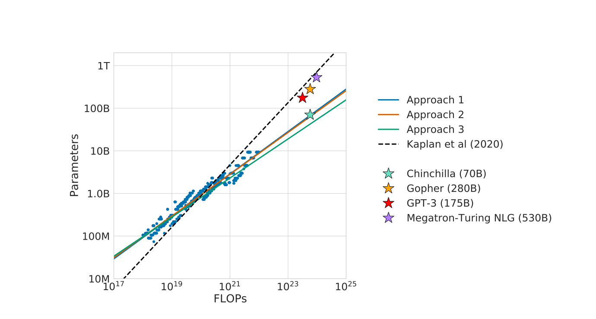
  <figcaption>The dashed line is Kaplan et al.'s prediction and the three solid lines are estimates from the three Chinchilla methods. The actual configurations of GPT-3, Gopher, and Megatron-Turing NLG resemble Kaplan's large-model, low-token allocation; only Chinchilla lies near the new compute-optimal curve. Source: Hoffmann et al., 2022.</figcaption>
</figure>

The paper estimates the compute-optimal relationship in three ways and writes each as

\[
N_{\mathrm{opt}}\propto C^a,
\qquad
D_{\mathrm{opt}}\propto C^b.
\]

| Estimation method | \(a\): parameter exponent | \(b\): token exponent |
| --- | ---: | ---: |
| Training-curve envelope | 0.50 (0.488–0.502) | 0.50 (0.501–0.512) |
| Iso-compute curves | 0.49 (0.462–0.534) | 0.51 (0.483–0.529) |
| Joint parametric loss fit | 0.46 (0.454–0.455) | 0.54 (0.542–0.543) |
| Kaplan et al. estimate | 0.73 | 0.27 |

Parentheses show the fitted intervals reported by the paper. The three methods do not produce identical values, but the first two give almost exactly \(a\approx b\approx0.5\), and the third remains much closer to balanced scaling than Kaplan's \(0.73/0.27\) allocation.

Chinchilla's central conclusion is therefore that **as compute grows, model parameter count and training-token count should increase at roughly the same rate**. With \(a\approx b\approx0.5\), the ratio \(D_{\mathrm{opt}}/N_{\mathrm{opt}}\) remains approximately stable rather than continually falling with budget.

#### Method 1: Training-Curve Envelope

The first method trains models from 70M to 10B parameters, using four different cosine learning-rate schedules for each model. This produces many curves of training loss against compute.

For every compute value \(C\), select the lowest-loss point among all curves. These minima form the training-curve envelope, representing the best loss observed at each compute budget. Reading the parameter count \(N\) and token count \(D\) at each envelope point then allows separate power-law fits against compute.

<figure>
  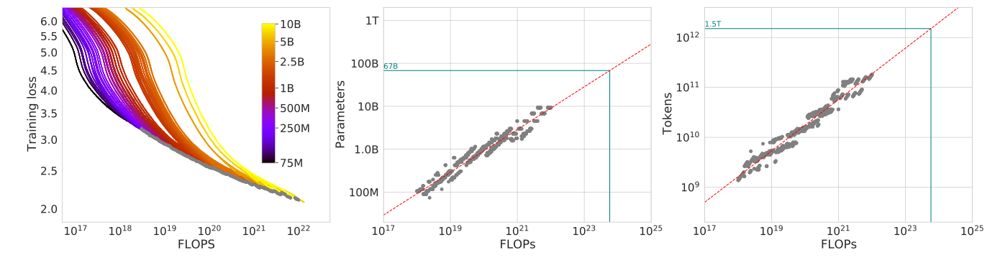
  <figcaption>Left: training curves for different models and training durations, with the gray curve tracing minimum loss at each compute value. Middle and right: optimal parameter and token counts at envelope points, extrapolated to larger budgets with power laws. Source: Hoffmann et al., 2022.</figcaption>
</figure>

The method gives

\[
a=0.50,
\qquad
b=0.50.
\]

For Gopher's training budget of \(5.76\times10^{23}\) FLOPs, the fitted compute-optimal configuration is approximately 67B parameters and 1.5T tokens. Chinchilla was later trained with 70B parameters and 1.4T tokens, close to this estimate.

#### Method 2: IsoFLOP Profiles

The second method uses IsoFLOP profiles. The paper selects nine compute budgets from \(6\times10^{18}\) to \(3\times10^{21}\) FLOPs. At each budget it varies parameter count \(N\) and adjusts training-token count accordingly:

\[
D\approx \frac{C}{6N}.
\]

Every run on a curve therefore has equal training compute but a different balance of model size and data volume.

<figure>
  
  <figcaption>Left: every color is a fixed compute budget, and loss forms a clear valley as parameter count varies. Middle and right: optimal parameter and token counts at the valleys follow approximate power laws with compute. Source: Hoffmann et al., 2022.</figcaption>
</figure>

At fixed compute, a model that is too small is capacity-limited; a model that is too large must be trained on too few tokens and remains undertrained. Each curve is therefore approximately U-shaped. The paper fits the valley with a parabola and then fits how these optimum points change with compute, obtaining

\[
a=0.49,
\qquad
b=0.51.
\]

For Gopher's budget, the prediction is approximately 63B parameters and 1.4T tokens, close to Method 1.

Which Other Models Can Use IsoFLOP Analysis?

IsoFLOP analysis does not depend on a particular language-model loss function. As long as many configurations can be trained reliably at several fixed budgets, it can identify a compute-optimal frontier over architecture, sparsity, or model size.

Gulrajani and Hashimoto applied it to diffusion language models. Both autoregressive and diffusion models exhibit clear U-shaped iso-compute curves:[25]

<figure>
  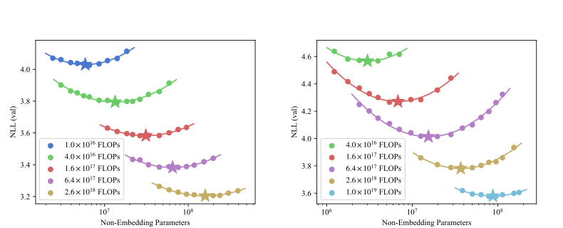
  <figcaption>Left: autoregressive models. Right: diffusion language models. Each color denotes a fixed compute budget and the star marks the lowest validation negative log-likelihood at that budget. Source: Gulrajani and Hashimoto, 2023.</figcaption>
</figure>

The losses of the two model families decrease with compute at similar slopes, although the diffusion models at the time retained an approximately 64× constant compute gap. Their compute-optimal models were about four times smaller and needed to train for about four times longer.

<figure>
  
  <figcaption>Left: loss as a function of compute. Right: compute-optimal parameter count as a function of budget. Source: Gulrajani and Hashimoto, 2023.</figcaption>
</figure>

IsoFLOP analysis can also be extended into a higher-dimensional surface. In a mixture-of-experts model, both parameter count and sparsity can vary while the minimum-loss point is sought at fixed compute:[15]

<figure>
  
  <figcaption>Left: an iso-compute surface over sparsity and total parameters. Right: the corresponding surface over sparsity and active parameters. Stars identify the optimum at each sparsity. Source: Abnar et al., 2025.</figcaption>
</figure>

#### Method 3: Joint Parametric Loss Fitting

The first two methods identify the minimum at each compute budget before fitting. The third directly fits the final loss of every experiment as a joint function of parameter count and token count:

\[
\widehat{L}(N,D)
=E+\frac{A}{N^{\alpha}}+\frac{B}{D^{\beta}}.
\]

Here, \(E\) is the irreducible loss of an ideal generative process; \(A/N^\alpha\) is additional loss from finite model capacity; and \(B/D^\beta\) is additional loss from limited training tokens and incomplete convergence. Rather than ordinary least squares, the paper applies a robust Huber loss to logarithmic loss values to reduce the influence of anomalous runs.

<figure>
  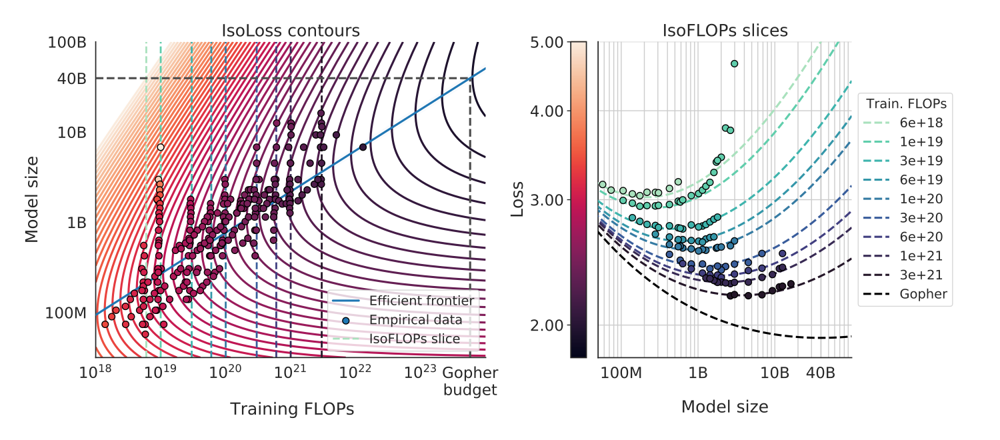
  <figcaption>Left: fitted iso-loss contours. The blue line is the compute-optimal frontier requiring the least compute to reach each loss. Right: loss slices at fixed compute. Source: Hoffmann et al., 2022.</figcaption>
</figure>

Minimizing this loss under \(C\approx6ND\) gives

\[
a=0.46,
\qquad
b=0.54.
\]

This result favors more training data than the first two methods and predicts an optimal model of roughly 40B parameters at Gopher's budget. The numerical difference is related to the fitting procedure and residuals in different compute regimes, but all three methods support the same robust conclusion: **model size and training tokens should scale approximately together**.

Deriving the Optimal Parameter and Token Exponents from the Joint Loss

Substituting the compute constraint \(C\approx6ND\) into the loss and optimizing over \(N\) and \(D\) gives the compute-optimal frontier:

\[
N_{\mathrm{opt}}(C)
=G\left(\frac{C}{6}\right)^a,
\qquad
D_{\mathrm{opt}}(C)
=G^{-1}\left(\frac{C}{6}\right)^b,
\]

where

\[
G=\left(\frac{\alpha A}{\beta B}\right)^{\frac{1}{\alpha+\beta}},
\qquad
a=\frac{\beta}{\alpha+\beta},
\qquad
b=\frac{\alpha}{\alpha+\beta}.
\]

Because \(a+b=1\), the exponents describe how new compute is divided between model parameters and training tokens. The values \(\alpha\) and \(\beta\) are fitted from experiments rather than fixed theoretically, so the resulting \(0.46/0.54\) split remains empirical.

The discrepancy between Kaplan and Chinchilla is not caused only by their functional forms. Later replications show that parameter and FLOP accounting, the small-scale fitting range, learning-rate warmup, and optimizer tuning all change the optimal exponents. Correcting these factors moves results closer to Chinchilla's \(a\approx0.5\).[21][22]

Replication and Correction of Method 3

Method 3 jointly fits all experimental points with

\[
\widehat{L}(N,D)
=E+\frac{A}{N^{\alpha}}+\frac{B}{D^{\beta}}.
\]

Besiroglu et al. later attempted to replicate this method. Because DeepMind's original experimental data was unavailable, they recovered 240 points from vector graphics in the paper PDF and refitted the same function.[23]

The new fit gives

\[
\alpha=0.3478,
\qquad
\beta=0.3658,
\qquad
a=\frac{\beta}{\alpha+\beta}=0.5126.
\]

The value \(a\approx0.51\) is close to the \(0.50\) and \(0.49\) from Methods 1 and 2, rather than the \(0.454\) originally reported for Method 3.

<figure>
  
  <figcaption>Residuals from the original paper's parameters are clearly shifted away from zero, while those from the refit are more concentrated around zero. Because the data was reconstructed from paper figures, digitization error remains. Source: Besiroglu et al., 2024.</figcaption>
</figure>

The original Method 3 parameters also imply that the optimal tokens per parameter rise rapidly with compute. Near Chinchilla's training scale, the prediction is about 70 tokens per parameter, inconsistent with the actual value of roughly 20 and with Methods 1 and 2.

<figure>
  
  <figcaption>The green curve is the policy derived from original Method 3, the blue curve the refitted result, and the black point the actual Chinchilla configuration. The refit is more consistent with 20 tokens per parameter but has a much wider uncertainty range. Shading shows 80% confidence intervals. Source: Besiroglu et al., 2024.</figcaption>
</figure>

Why Did the Original Method 3 Fit Have Problems?

The replication identifies three related issues:

1. Parameters in the paper text were rounded—most notably the data exponent \(\beta\) to \(0.28\)—which magnifies prediction error at very large \(D\).
2. The fitting program averaged Huber losses across runs and used a relatively large loss scale, causing the optimizer to stop before genuine convergence.
3. The same premature stopping occurred in bootstrap refits, so each result barely moved from its initial value and produced implausibly narrow confidence intervals.

The original paper reported an interval of only \(0.454\)–\(0.455\) for the parameter exponent \(a\). The replication estimates that such a narrow interval under ordinary statistical conditions might require around 600,000 training runs, whereas the original study had only about 400–500 observations.

This replication **does not overturn the central conclusion that parameters and tokens should grow at approximately the same rate**. It corrects the specific Method 3 parameters and overprecise confidence intervals; after refitting, the three methods become more consistent.

### 5.4 Training Optimality Is Not Deployment Optimality

Chinchilla answers a training-compute-optimal question: given a one-time pre-training compute budget, which \(N\) and \(D_{\mathrm{train}}\) minimize loss?

A deployed model also performs inference repeatedly. If it processes \(D_{\mathrm{inf}}\) inference tokens over its lifetime, a simplified total-compute model is[24]

\[
C_{\mathrm{lifecycle}}
\approx 6ND_{\mathrm{train}}+2ND_{\mathrm{inf}}.
\]

The first term is a one-time training cost; the second keeps accumulating with usage. When \(D_{\mathrm{inf}}\) is large, every reduction in \(N\) saves compute on every future inference token. It can then be preferable to train a smaller model on more data to recover performance and retain lower inference cost throughout deployment.

This is often called “overtraining” relative to the Chinchilla ratio, but it does not mean training until the model overfits. It means **showing a smaller model more data than the training-compute optimum**. Training cost increases while inference cost falls.

The lecture lists approximate training-token-to-parameter ratios for several model generations:

| Model | Approximate training tokens per parameter |
| --- | ---: |
| GPT-3 | 2 |
| Chinchilla | 20 |
| LLaMA-65B | 22 |
| Llama 2 70B | 29 |
| Mistral 7B | 110 |
| Llama 3 70B | 215 |

These figures are not fully consistent in accounting or public documentation and should not be treated as a controlled experiment. They nonetheless show a clear trend: many deployment-oriented models use increasingly high token-to-parameter ratios.[1]

Sardana et al. formally add inference cost to Chinchilla's objective. They find that when expected demand reaches roughly one billion inference requests, training a smaller model on more tokens generally yields lower lifecycle cost than the training-compute-optimal configuration.[24]

How long a model should be trained therefore depends on its use:

- when only the one-time training budget matters, use a training-compute-optimal allocation;
- when the model will be called frequently, consider training and inference cost together;
- the larger the inference demand, the more worthwhile it becomes to pay additional training cost in advance for a smaller and cheaper deployed model.

## References

[1] Stanford CS336. Lecture 9: Scaling Laws - Basics. [Online]. Available: https://stanford-cs336.github.io/spring2025/

[2] C. Cortes, L. D. Jackel, S. A. Solla, V. Vapnik, and J. S. Denker. Learning Curves: Asymptotic Values and Rate of Convergence. 1993. [Online]. Available: https://research.google/pubs/learning-curves-asymptotic-values-and-rate-of-convergence/

[3] M. Banko and E. Brill. Scaling to Very Very Large Corpora for Natural Language Disambiguation. 2001. [Online]. Available: https://aclanthology.org/P01-1005/

[4] P. Kolachina, N. Cancedda, M. Dymetman, and S. Venkatapathy. Prediction of Learning Curves in Machine Translation. 2012. [Online]. Available: https://aclanthology.org/P12-1003/

[5] J. Hestness et al. Deep Learning Scaling is Predictable, Empirically. 2017. [Online]. Available: https://arxiv.org/abs/1712.00409

[6] J. Kaplan et al. Scaling Laws for Neural Language Models. 2020. [Online]. Available: https://arxiv.org/abs/2001.08361

[7] Y. Bahri, E. Dyer, J. Kaplan, J. Lee, and U. Sharma. Explaining Neural Scaling Laws. 2021. [Online]. Available: https://arxiv.org/abs/2102.06701

[8] T. Hashimoto. Model Performance Scaling with Multiple Data Sources. 2021. [Online]. Available: https://proceedings.mlr.press/v139/hashimoto21a.html

[9] J. Ye, P. Liu, T. Sun, Y. Zhou, J. Zhan, and X. Qiu. Data Mixing Laws: Optimizing Data Mixtures by Predicting Language Modeling Performance. 2024. [Online]. Available: https://arxiv.org/abs/2403.16952

[10] I. Magnusson et al. DataDecide: How to Predict Best Pretraining Data with Small Experiments. 2025. [Online]. Available: https://arxiv.org/abs/2504.11393

[11] N. Muennighoff et al. Scaling Data-Constrained Language Models. 2023. [Online]. Available: https://arxiv.org/abs/2305.16264

[12] K. Kim, S. Kotha, P. Liang, and T. Hashimoto. Pre-training under Infinite Compute. 2025. [Online]. Available: https://arxiv.org/abs/2509.14786

[13] S. Goyal, P. Maini, Z. C. Lipton, A. Raghunathan, and J. Z. Kolter. Scaling Laws for Data Filtering—Data Curation Cannot Be Compute Agnostic. 2024. [Online]. Available: https://arxiv.org/abs/2404.07177

[14] Y. Tay et al. Scaling Laws vs Model Architectures: How Does Inductive Bias Influence Scaling? 2022. [Online]. Available: https://arxiv.org/abs/2207.10551

[15] S. Abnar, H. Shah, D. Busbridge, A. El-Nouby, J. M. Susskind, and V. Thilak. Parameters vs FLOPs: Scaling Laws for Optimal Sparsity for Mixture-of-Experts Language Models. 2025. [Online]. Available: https://arxiv.org/abs/2501.12370

[16] S. McCandlish, J. Kaplan, D. Amodei, and OpenAI Dota Team. An Empirical Model of Large-Batch Training. 2018. [Online]. Available: https://arxiv.org/abs/1812.06162

[17] G. Yang et al. Tensor Programs V: Tuning Large Neural Networks via Zero-Shot Hyperparameter Transfer. 2022. [Online]. Available: https://arxiv.org/abs/2203.03466

[18] Y. Yao et al. nanoLM: an Affordable LLM Pre-training Benchmark via Accurate Loss Prediction across Scales. 2024. [Online]. Available: https://arxiv.org/abs/2304.06875

[19] J. S. Rosenfeld, A. Rosenfeld, Y. Belinkov, and N. Shavit. A Constructive Prediction of the Generalization Error Across Scales. 2020. [Online]. Available: https://arxiv.org/abs/1909.12673

[20] J. Hoffmann et al. Training Compute-Optimal Large Language Models. 2022. [Online]. Available: https://arxiv.org/abs/2203.15556

[21] T. Porian, M. Wortsman, J. Jitsev, L. Schmidt, and Y. Carmon. Resolving Discrepancies in Compute-Optimal Scaling of Language Models. 2024. [Online]. Available: https://arxiv.org/abs/2406.19146

[22] T. Pearce and J. Song. Reconciling Kaplan and Chinchilla Scaling Laws. 2024. [Online]. Available: https://arxiv.org/abs/2406.12907

[23] T. Besiroglu, E. Erdil, M. Barnett, and J. You. Chinchilla Scaling: A Replication Attempt. 2024. [Online]. Available: https://arxiv.org/abs/2404.10102

[24] N. Sardana, J. Portes, S. Doubov, and J. Frankle. Beyond Chinchilla-Optimal: Accounting for Inference in Language Model Scaling Laws. 2024. [Online]. Available: https://proceedings.mlr.press/v235/sardana24a.html

[25] I. Gulrajani and T. B. Hashimoto. Likelihood-Based Diffusion Language Models. 2023. [Online]. Available: https://arxiv.org/abs/2305.18619

[26] G. Yang, D. Yu, C. Zhu, and S. Hayou. Tensor Programs VI: Feature Learning in Infinite-Depth Neural Networks. 2023. [Online]. Available: https://arxiv.org/abs/2310.02244

[27] S. Hu et al. MiniCPM: Unveiling the Potential of Small Language Models with Scalable Training Strategies. 2024. [Online]. Available: https://arxiv.org/abs/2404.06395
