## 1. 为什么要研究扩展定律（Scaling Law）

假设有人给你一万张 B200 图形处理器（Graphics Processing Unit，GPU），使用时间只有一个月，目标是训练一个高质量的开源大语言模型（Large Language Model，LLM）。基础设施、分布式训练框架和预训练数据都已准备好，接下来的问题是：**究竟应该训练多大的模型？**

模型设计中有大量彼此耦合的选择：

- 模型更宽还是更深；
- 使用多少个注意力头；
- 采用哪种非线性函数；
- 用变换器（Transformer）还是长短期记忆网络（Long Short-Term Memory，LSTM）；
- 用自适应矩估计（Adaptive Moment Estimation，Adam）还是随机梯度下降（Stochastic Gradient Descent，SGD）；
- 增大模型、延长训练，还是收集更多数据。

<figure>
  
  <figcaption>真实训练中需要同时比较大量架构与超参数组合，仅凭已有模型配置进行模仿，很难知道这些选择是否适合新的计算预算。</figcaption>
</figure>

传统方法是在大模型上直接调参，但每次失败都非常昂贵。扩展定律（Scaling Law）的乐观设想是：

1. 训练一组较小的模型；
2. 拟合模型性能随数据、参数或计算量变化的规律；
3. 将规律外推到目标规模；
4. 在大规模训练开始前完成架构、超参数和资源分配决策。

扩展定律不是自然定律，而是经验规律。它最重要的价值也不是“拟合一条直线”，而是让昂贵的大规模实验变成可预测、可比较的工程问题。

### 1.1 扩展定律中的规模变量与性能指标

Scaling Law 并不专指“模型参数量与预训练损失之间的一条曲线”。要描述一条扩展规律，至少需要明确三个要素：

- **规模变量**：横轴可以是训练计算量 \(C\)、数据集大小 \(D\)、模型参数量 \(N\)，也可以是等价计算量或模型发布时间；
- **性能指标**：纵轴可以是训练或测试损失，也可以是准确率、精确匹配率等具体任务指标，甚至可以是综合能力指数；
- **函数形式**：损失与资源规模之间经常呈幂律关系，具体能力随计算量增长时则可能呈 S 形曲线。

以语言模型为例，测试损失分别相对于计算量、训练词元数量和非嵌入参数量，都可以近似写成：

\[
L(X)=L_{\infty}+AX^{-\alpha},\qquad X\in\{C,D,N\}.
\]

其中，\(L_{\infty}\) 是继续扩大规模也难以消除的损失，\(A\) 控制曲线的整体位置，\(\alpha\) 决定性能随规模改善的速度。

但如果衡量的是词语重排、问答准确率等具体能力，结果通常有上下界，曲线可能更接近 S 形函数：

\[
S(X)=\frac{1}{1+\exp[-(a\log X+b)]}.
\]

这类曲线在低计算量区间变化缓慢，越过某个范围后快速提升，最后逐渐饱和。模型的综合能力也可以相对于发布时间进行追踪。因此，在讨论一条 Scaling Law 时，不能只说“性能随规模增长”，还必须说明：**扩大的是哪一种规模、观察的是哪一个指标，以及使用什么函数进行拟合。**

<figure>
  
  <figcaption>上：语言模型损失分别随计算量、数据集大小和非嵌入参数量呈幂律变化。下：词语重排与波斯语问答等具体能力更接近 S 形曲线，综合能力指数还可以随模型发布时间进行追踪。</figcaption>
</figure>

## 2. 历史：从学习曲线到神经网络扩展定律

### 2.1 理论样本复杂度与实际损失

学习理论很早就在讨论“需要多少数据”。例如，在有限的 \(k\) 个假设中学习，可以得到依赖样本数 \(n\)、置信度和假设数量的泛化误差上界；对平滑概率密度的生成建模，也可以得到随样本数收敛的速率。

这类结果通常回答的是“最坏情况下不会差到什么程度”，即误差上界，而不是训练完成后真正观察到的损失值。扩展定律关心的是后者：**实际模型在给定规模下会达到多少损失，以及小规模实验能否预测大规模结果。**

### 2.2 早期数据—性能学习曲线研究

1993 年，Cortes 等人在 *Learning Curves: Asymptotic Values and Rate of Convergence* 中用幂律衰减描述训练误差和测试误差，并尝试通过小数据实验预测完整训练集上的表现。[2]

<figure>
  
  <figcaption>Cortes 等人将误差写成渐近值与幂律衰减项之和，并用较小训练集上的观测点预测更大训练集的学习曲线。</figcaption>
</figure>

2001 年，Banko 和 Brill 将自然语言消歧任务的数据量从百万词扩展到十亿词。不同算法都持续从更多数据中受益，而且在当时常用的数据规模上还远未饱和。论文由此提出一个很实用的问题：与其继续投入大量时间改进算法，是否应该把更多资源用于语料建设？[3]

<figure>
  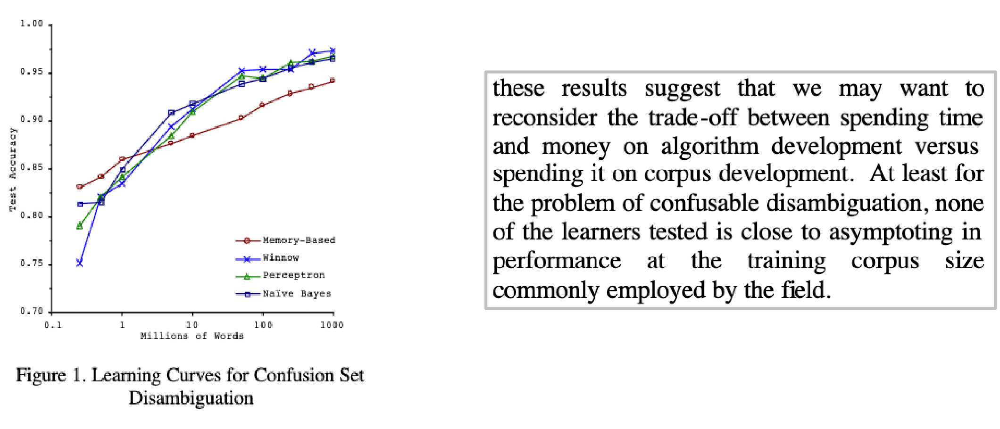
  <figcaption>四种算法在语料规模跨越多个数量级后仍持续提升，说明数据规模本身可能比小范围算法差异更重要。</figcaption>
</figure>

2012 年，Kolachina 等人比较了指数、幂律、逆对数等多种函数族，用较小规模的机器翻译实验预测双语评估替补（Bilingual Evaluation Understudy，BLEU）分数随数据量的变化。他们发现幂律形式具有较好的外推能力。[4]

<figure>
  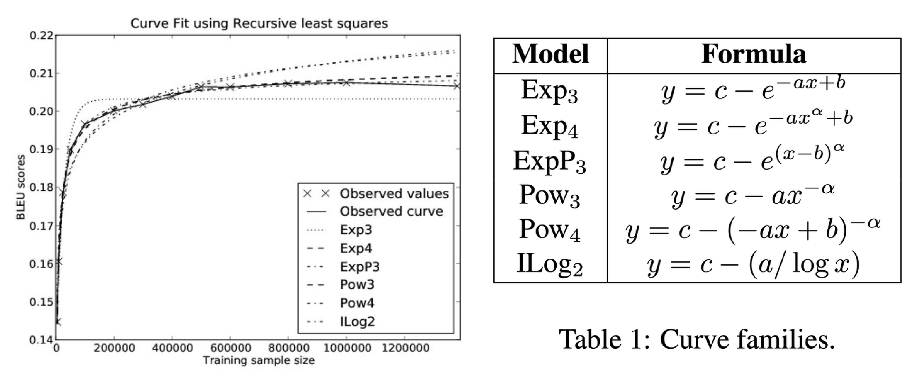
  <figcaption>不同函数在已观测区间内都可能拟合良好，但外推行为并不相同；选择函数形式本身就是扩展定律研究的一部分。</figcaption>
</figure>

### 2.3 大规模神经网络学习曲线的可预测性

Hestness 等人在 2017 年系统研究机器翻译、语言建模、图像分类和语音识别，发现泛化误差在相当宽的范围内都呈现幂律下降。语言任务中的数据量通常用词元（token）数量衡量。[5]

<figure>
  
  <figcaption>机器翻译中，不同模型的误差随训练 token 数增加而下降；选择每个数据规模下表现最好的模型后，组合曲线仍然接近幂律。</figcaption>
</figure>

这项工作还提前指出了几件后来非常重要的事情：

- 小数据区间可能看不到真正的幂律区域，容易把优化器或初始化问题误判为能力“涌现”；
- 学习曲线可以估计达到目标精度需要的计算量；
- 如果更快的硬件允许使用更多数据或更大的模型，速度提升可以换回因低精度、稀疏化等技术损失的精度；
- 误差、数据量、模型规模和计算量之间可能存在统一、可预测的关系。

## 3. 数据扩展定律（Data Scaling Law）

### 3.1 数据扩展定律简介

数据扩展定律（Data Scaling Law）是一条将数据集大小 $n$ 映射到模型误差的简单公式：

\[
\mathcal{E}(n)=f(n).
\]

其中，\(\mathcal{E}(n)\) 表示模型使用 \(n\) 个训练样本后，在未见数据上的泛化误差。它要回答的问题是：**如果模型、训练方法和数据分布基本不变，增加训练数据能够带来多少性能提升？**

从整体趋势看，我们通常希望 \(f(n)\) 是单调下降的：数据越多，泛化误差越低。不过，单次实验会受到采样和优化噪声影响，因此“单调”描述的是多组实验拟合出的总体趋势，而不是要求每个观测点都严格下降。

### 3.2 数据—性能曲线的三个区间

数据与性能之间通常不是一条从头到尾保持相同斜率的直线。把数据量和泛化误差都放在对数坐标中，可以观察到一条近似 S 形的曲线，并将其分成三个区间。[5]

1. **小数据区间（Small Data Region）**：样本不足以让模型可靠地提取任务结构，性能接近“最佳猜测”基线。此时增加少量数据不一定带来明显改善。
2. **幂律区间（Power-law Region）**：模型开始稳定利用新增数据，误差随数据量呈近似幂律下降：

   \[
   \mathcal{E}(n)\approx\mathcal{E}_{\infty}+An^{-\alpha}.
   \]

   在双对数坐标中，这一区间接近直线，也是最适合拟合和外推的部分。
3. **不可约误差区间（Irreducible Error Region）**：数据继续增加时，误差逐渐逼近 \(\mathcal{E}_{\infty}\)。标签噪声、任务本身的不确定性或模型假设的限制，使这部分误差难以仅靠增加数据消除。

<figure>
  
  <figcaption>数据扩展曲线通常单调下降，并依次经过小数据区间、幂律区间和不可约误差区间。绿色虚线表示最佳猜测误差，红色虚线表示不可约误差。图源：Hestness et al., 2017。</figcaption>
</figure>

因此，拟合数据扩展定律时不能把所有实验点直接塞进同一条幂律。首先要判断观测点是否已经进入幂律区间；如果仍处于小数据区间，外推会过于悲观；如果已经接近不可约误差区间，忽略饱和项又会过于乐观。

  
展开：Kaplan 等人的语言模型实验

  Kaplan 等人的语言模型实验提供了一个具体例子：数据量和测试损失在双对数坐标中近似为一条直线。[6] 对应的拟合公式为：

  \[
  L(D)=\left(\frac{D}{5.4\times10^{13}}\right)^{-0.095},
  \]

  其中，$D$ 是训练词元数量，$L(D)$ 是测试损失。

  <figure>
    
    <figcaption>语言模型测试损失与训练词元数量在双对数坐标中近似为直线，对应 $L(D)\propto D^{-0.095}$ 的幂律关系。图源：Kaplan et al., 2020。</figcaption>
  </figure>

  这个例子表明，语言模型在特定实验范围内也会出现数据幂律。斜率 $-0.095$ 是实验拟合结果，只描述完整曲线中的幂律区间，不能无限外推。

### 3.3 数据—性能曲线为什么会呈现幂律？

更多数据通常会降低误差，所以曲线整体上应当单调下降；但单调下降并不能解释为什么它恰好是幂律。

一个候选解释是：在许多简单的统计问题中，估计误差会按照样本数的负幂缩小，也就是多项式衰减：

\[
\mathcal{E}(n)\propto n^{-\alpha},\qquad \alpha>0.
\]

这里的 $n$ 是样本数，$\alpha$ 决定误差下降的速度。取对数后：

\[
\log \mathcal{E}(n)=-\alpha\log n+\text{constant}.
\]

因此，双对数图中会出现一条直线。

需要区分两层结论：

- 对均值估计等简单问题，这种误差下降速度可以从概率论中推导出来；
- 对现代语言模型，幂律是否出现、指数是多少以及在哪个范围内成立，主要来自实验观察，并不是已经证明的普适规律。

所以，这一解释更像是理解经验现象的线索，而不是语言模型 Scaling Law 的完整理论。最简单的<strong>均值估计（Mean Estimation）</strong>可以给出一个能够严格推导的例子。

假设有 $n$ 个独立同分布的样本：

\[
x_1,\ldots,x_n\sim\mathcal{N}(\mu,\sigma^2),
\]

用样本均值估计总体均值：

\[
\hat{\mu}=\frac{1}{n}\sum_{i=1}^{n}x_i.
\]

由于 $\hat{\mu}$ 是无偏估计量，它的均方误差（Mean Squared Error，MSE）就等于方差：

\[
\mathbb{E}\left[(\hat{\mu}-\mu)^2\right]
=\operatorname{Var}(\hat{\mu})
=\frac{\sigma^2}{n}.
\]

如果把这里的 MSE 记作 $\mathcal{E}(n)$，取对数后得到：

\[
\log \mathcal{E}(n)=-\log n+2\log\sigma.
\]

这正是一条斜率为 $-1$ 的直线，也就是指数 $\alpha=1$ 的 Scaling Law。更一般地，只要误差按 $1/n^\alpha$ 的多项式速度衰减，在双对数坐标中就会表现为线性关系。

#### 数据扩展指数为什么通常不是 $-1$？

均值估计和许多经典参数模型都有 $1/n$ 量级的误差，因此直觉上会期待：

\[
\log \mathcal{E}(n)=-\log n+C.
\]

也就是说，双对数曲线的斜率应当是 $-1$。但神经网络实验得到的指数往往小得多：机器翻译约为 $0.13$，语音识别约为 $0.30$，前面的语言模型例子则约为 $0.095$。[5][6]

<figure>
  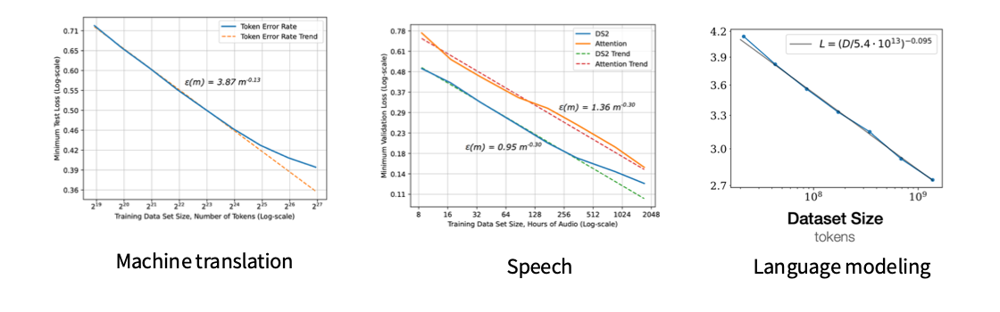
  <figcaption>机器翻译、语音识别和语言模型都呈现数据幂律，但拟合指数分别约为 0.13、0.30 和 0.095，明显不同于经典均值估计中的 1。图源：Hestness et al., 2017；Kaplan et al., 2020。</figcaption>
</figure>

这并不意味着前面的推导有误，而是说明均值估计过于简单。它只需要估计一个固定参数；神经网络则要从数据中学习一个复杂函数，随着数据增多，还可能继续分辨更细的输入结构。

#### 非参数学习中数据扩展指数的维度依赖

非参数学习（Nonparametric Learning）不预先把目标限制为少量固定参数，而是直接逼近未知函数。考虑一个二维例子：$x_i$ 均匀分布在单位正方形中，观测值为

\[
y_i=f(x_i)+\varepsilon_i,\qquad \varepsilon_i\sim\mathcal{N}(0,1),
\]

目标是根据 $n$ 个样本估计 $f(x)$。一种直观做法是把二维空间划分为边长 $n^{-1/4}$ 的小方格，再用每个方格内的样本平均值估计局部函数值。

此时一共有大约 $\sqrt{n}$ 个方格，每个方格平均包含 $\sqrt{n}$ 个样本。如果 $f$ 在局部足够平滑，噪声方差和局部近似产生的平方偏差都会下降到 $n^{-1/2}$ 量级。因此，这里的均方误差约为

\[
\mathcal{E}(n)=O\left(\frac{1}{\sqrt{n}}\right).
\]

这里的 $1/\sqrt{n}$ 指均方误差，而不是误差的标准差。完整计算可以展开查看：

  
展开：为什么有 $\sqrt{n}$ 个方格，误差如何得到？

  记方格边长为

  \[
  h=n^{-1/4}.
  \]

  单位正方形沿每个坐标轴可以划分出 $1/h=n^{1/4}$ 段，因此方格总数为

  \[
  N_{\text{cells}}=\left(\frac{1}{h}\right)^2
  =\left(n^{1/4}\right)^2
  =\sqrt{n}.
  \]

  $n$ 个样本均匀落入这些方格，所以每个方格中的期望样本数为

  \[
  m\approx\frac{n}{N_{\text{cells}}}=\sqrt{n}.
  \]

  对于某个方格 $B$，用格内观测值的平均值估计局部函数值：

  \[
  \hat f_B=\frac{1}{m}\sum_{i:x_i\in B}y_i.
  \]

  模型中的 $\varepsilon_i\sim\mathcal N(0,1)$ 描述的是<strong>观测噪声</strong>，不是估计误差本身。选择标准正态分布只是为了让计算简单：它的均值为零、方差为 $1$，而且独立正态变量的平均值仍然服从正态分布。因此，局部平均中噪声部分的方差为

  \[
  \operatorname{Var}\left(\frac{1}{m}\sum_{i=1}^{m}\varepsilon_i\right)
  =\frac{1}{m}
  \approx\frac{1}{\sqrt n}.
  \]

  这里计算的是方差，也就是噪声对 MSE 的贡献；对应的标准差或均方根误差则是 $n^{-1/4}$。正态假设并不是关键。如果噪声相互独立、均值为零且方差为 $\sigma^2<\infty$，上式只需改为 $\sigma^2/m$，关于 $n$ 的指数保持不变。

  最后还要考虑同一方格内 $f(x)$ 的变化。若 $f$ 是利普希茨连续的，边长为 $h$ 的方格会产生 $O(h)$ 的局部偏差，因此平方偏差为 $O(h^2)$。二维方格中平均有 $nh^2$ 个样本，噪声方差为 $O(1/(nh^2))$，于是

  \[
  \operatorname{MSE}(h)
  \approx h^2+\frac{1}{nh^2}.
  \]

  令平方偏差和方差处于相同量级：

  \[
  h^2\approx\frac{1}{nh^2},
  \]

  可以得到 $h\approx n^{-1/4}$。此时两项都是 $n^{-1/2}$ 量级。也就是说，边长 $n^{-1/4}$ 是平衡局部近似偏差与采样噪声方差后的选择。

方格太大，局部近似不够准确；方格太小，每格样本又会不足。两者之间的权衡使误差指数与输入空间的维度和函数的平滑程度有关。

把这一思路推广到 $d$ 维，一种简化的维度依赖形式是

\[
\mathcal{E}(n)\propto n^{-1/d},
\]

因此

\[
\log\mathcal{E}(n)=-\frac{1}{d}\log n+C.
\]

维度越高，斜率的绝对值越小，误差随数据增加下降得越慢。这也给出了一个可能的解释：神经网络面对的是高维函数逼近问题，所以它的数据扩展指数不必等于经典参数估计中的 $1$。不过，$1/d$ 只是这里的简化例子；具体指数还会随误差定义、函数平滑性和估计方法而变化。

#### 数据扩展指数与内在维度假说

真实数据的原始维度可能很高，但有效变化通常集中在更低维的结构上。这个有效自由度称为<strong>内在维度（Intrinsic Dimensionality）</strong>。例如，一张图片包含大量像素，但自然图片并不会均匀填满所有可能的像素组合。

Bahri 等人据此提出：在分辨率受限区间中，模型相当于逐步分辨一个平滑的数据流形，数据扩展指数 $\alpha$ 可能与数据流形的内在维度 $d$ 近似成反比：[7]

\[
\alpha\propto\frac{1}{d}.
\]

<figure>
  
  <figcaption>在可控的教师-学生实验中，$4/\alpha_D$ 与数据流形维度较接近线性关系；在 CIFAR、SVHN、MNIST 等真实数据集上，结果更为分散。图源：Bahri et al., 2021。</figcaption>
</figure>

这个结论应当被理解为一种<strong>理论假说和实验线索</strong>，而不是已经确立的普适规律。可控的教师-学生实验较符合预测，但真实数据集上的关系没有那么清晰；内在维度本身也缺少唯一、稳定的估计方法。它能帮助解释为什么不同任务会出现不同指数，却还不能仅凭数据维度准确预测语言模型的 Scaling Law。

### 3.4 数据组成与分布偏移如何改变数据扩展曲线

到目前为止，我们主要讨论“数据集大小如何影响性能”。但即使数据总量相同，数据由哪些来源组成、不同来源各占多少比例，也会影响最终结果。

围绕数据组成，还可以提出几类扩展问题：

- 能否用小规模模型选择最优的数据混合比例；
- 数据不足时，是否应该重复使用已有数据；
- 如何同时考虑数据质量、混合比例与重复次数。

其中一个具体问题是<strong>分布偏移（Distribution Shift）</strong>：训练数据由多个来源混合而成，并且混合比例发生变化时，数据扩展曲线会怎样改变？

设 $n$ 是训练数据总量，$q$ 表示各数据源的混合比例。Hashimoto 将超额损失近似写成：[8]

\[
\log L(n,q)\approx-\alpha\log n+\log C(q),
\]

等价地：

\[
L(n,q)\approx C(q)n^{-\alpha}.
\]

在这个表达式中，数据量 $n$ 决定幂律下降部分，数据组成 $q$ 则通过 $C(q)$ 改变曲线的位置。如果不同 $q$ 对应相同的 $\alpha$，它们在双对数图中就会表现为斜率相同、截距不同的平行直线。

<figure>
  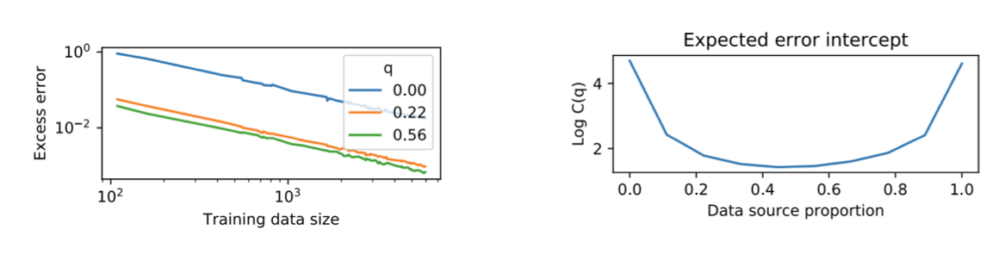
  <figcaption>左：改变数据源比例 $q$ 后，超额误差曲线的斜率近似不变，但截距发生变化。右：在这个双数据源例子中，混合比例接近均衡时截距最低，只使用单一来源时误差明显升高。图源：Hashimoto, 2021。</figcaption>
</figure>

这个例子说明，增加数据量与改善数据组成是两个不同的问题。即使训练样本数不变，收集互补、更多样的数据，也可能整体下移损失曲线。

不过，“数据组成只改变截距、不改变斜率”不是对任意分布偏移都成立的定理，而是论文提出并在若干任务中验证的建模假设。数据源差异、模型类别或评测分布发生较大变化时，扩展指数也可能改变。

#### 用小规模实验选择数据混合比例

  
展开：两种小规模数据混合选择方法

  知道“数据组成会影响性能”之后，下一个问题是：能否只训练一批便宜的小模型，就选出适合目标大模型的数据混合？实践中，这件事比拟合单一的数据量曲线困难得多。

  一种自然思路是建立<strong>数据混合定律（Data Mixing Law）</strong>。Ye 等人提出一条三阶段预测流程：[9]

  1. 用训练步数 Scaling Law，从少量训练步外推到更多训练步；
  2. 用模型规模 Scaling Law，从小模型外推到目标大模型；
  3. 用数据混合定律，从已经实验过的混合比例预测未见过的比例。

  <figure>
    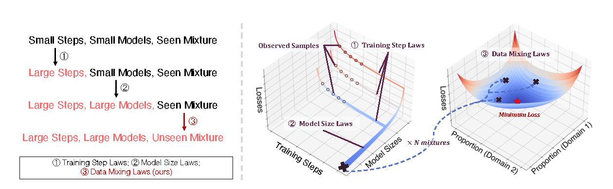
    <figcaption>从小模型、少量训练步和已观测混合出发，依次外推训练步数、模型规模与未见数据混合，最后搜索预测损失最低的比例。图源：Ye et al., 2024。</figcaption>
  </figure>

  这条路线能够把多个昂贵维度拆开处理，但每一层拟合都会引入误差，而且数据混合的相对排名可能随模型规模和训练步数变化。小规模上最优的比例不一定仍是目标规模上的最优比例。

  DataDecide 从更直接的角度评估了这个问题：使用小规模实验预测 25 种预训练数据方案在 1B 参数目标模型上的两两胜负。[10] 实验发现，用单个 150M 参数规模上的排序进行预测，决策准确率（Decision Accuracy）已经约为 $80\%$；论文测试的 8 种多尺度 Scaling Law 基线，在相同预测计算预算下没有超过这个简单方法形成的前沿。

  <figure>
    
    <figcaption>DataDecide 比较小规模预测与 1B 目标模型上的真实排序。随着预测实验计算量增加，决策准确率总体提高；150M 模型对 25 种数据方案进行两两比较时，约有 80% 的结果正确。图源：Magnusson et al., 2025。</figcaption>
  </figure>

  这里的结论不是“Scaling Law 没有用”，而是：当目标只是选出更好的数据方案时，复杂拟合必须与“直接采用小模型排序”这一强基线比较。额外训练多个尺度，未必能够抵消曲线拟合和评测噪声带来的误差。

### 3.5 有限数据下重复训练的收益衰减

前面的数据扩展定律通常默认：训练数据量 $D$ 增加时，新增的都是没有见过的样本。但现实中的高质量数据是有限的，训练更久往往意味着多次遍历同一批数据。此时，处理过的 token 总数不能再直接视为有效数据量。

Muennighoff 等人把总训练 token 数拆成两部分：[11]

- $U_D$：唯一词元（Unique Tokens）数量；
- $R_D=D/U_D-1$：额外重复次数，也就是训练轮数减一。

为了描述重复数据的边际价值逐渐降低，论文定义了有效数据量（Effective Data）$D'$：

\[
D'=U_D+U_D R_D^*
\left(1-e^{-R_D/R_D^*}\right),
\]

其中，$R_D^*$ 是从实验中拟合出的特征尺度，控制重复数据的价值以多快的速度衰减。

当重复次数很少，即 $R_D\ll R_D^*$ 时，可以使用 $1-e^{-x}\approx x$：

\[
D'\approx U_D+U_D R_D
=U_D(1+R_D)=D.
\]

这表示前几轮重复训练几乎可以像新数据一样计入有效数据量。反过来，当 $R_D$ 很大时：

\[
D'\longrightarrow U_D(1+R_D^*).
\]

有效数据量最终会饱和，继续重复几乎不再提供新的信息。

<figure>
  
  <figcaption>左：在论文实验中，重复不超过约 4 个 epoch 时接近使用新数据，之后收益快速递减，到约 40 个 epoch 时额外重复几乎无效。右：在相同计算预算下，考虑重复衰减的定律倾向于选择稍小的模型并训练更多轮。图源：Muennighoff et al., 2023。</figcaption>
</figure>

右图给出了一个 $10^{22}$ 浮点运算次数（Floating-Point Operations，FLOPs）的例子。如果错误地假设重复数据与新数据等价，计算最优点约为 8.67B 参数、7.1 个 epoch；考虑重复收益衰减后，预测最优点变为约 6.34B 参数、9.7 个 epoch，并得到略低的损失。

因此，数据受限时不能直接套用“每个 token 都是新数据”的 Scaling Law。前几轮重复通常仍有价值，但随着训练轮数增加，新增计算的回报会逐渐趋近于零。图中的 4 个和 40 个 epoch 是特定实验范围内的经验结果，不应视为对所有模型与数据集都固定不变的阈值。

### 3.6 极端重复训练下的数据扩展定律失效

如果唯一数据量已经固定，增加 epoch 最初仍能降低损失，但这种趋势不能无限延续。重复次数超过最佳点后，模型会开始过拟合，验证损失反而上升。因此，3.5 中“损失单调下降并逐渐饱和”的数据受限 Scaling Law 只是一种适用于有限范围的经验近似，不能直接外推到计算近乎无限的情形。[12]

更一般地说，Scaling Law 依赖于拟合时采用的模型、数据与训练配方。它描述的是已有方法在特定范围内的经验趋势，而不是算法不可突破的性能极限。

  
展开：实验结果与训练配方的影响

  Kim 等人在固定预训练语料上观察到：

  - 只增加训练轮数时，验证损失先下降，随后因过拟合而上升；
  - 只扩大参数量时，即使为每个规模重新选择学习率和训练轮数，损失也不再保持单调下降；
  - 加强正则化并进行模型集成（Ensembling）后，可以得到比标准训练配方更低的损失曲线。

  <figure>
    
    <figcaption>左：持续增加训练轮数会越过最佳点并造成过拟合。中：扩大模型也不能保证损失持续下降。右：正则化与模型集成把数据 Scaling Law 整体下移，说明原有曲线依赖于训练配方。图源：Kim et al., 2025。</figcaption>
  </figure>

  图中的训练损失与验证损失需要区分：重复训练时，模型可以继续降低训练损失，但验证损失越过最佳点后可能上升。这正是 3.5 的单调饱和公式没有描述的过拟合阶段。

  PPT 中所说的 “lower bound” 更适合被理解为<strong>已有方法提供的性能基线</strong>，而不是严格的数学下界。对于损失指标，“还能做得更好”具体意味着改进正则化、超参数或集成方法后，实际损失可能低于原先拟合出的曲线。

### 3.7 计算规模如何改变最优数据过滤策略

有限数据还会改变数据过滤策略。网页数据并不均质：高质量子集在第一次使用时通常最有价值，但反复训练会使它的边际效用下降。此时需要在数据质量与数据数量之间做<strong>质量—数量权衡（Quality–Quantity Tradeoff，QQT）</strong>。[13]

Goyal 等人在视觉—语言模型上的实验给出了一个直观结果：

- <strong>小计算预算</strong>：只保留最高质量的数据，进行更激进的过滤；
- <strong>中等计算预算</strong>：扩大数据池，混合更多尚未见过的数据；
- <strong>大计算预算</strong>：进一步减弱过滤，避免在很小的高质量子集上重复过多轮。

<figure>
  
  <figcaption>高质量数据被重复使用后效用逐渐下降，因此最优数据池会随总训练样本数改变。右侧 ImageNet-1k 实验中，小计算量适合激进过滤，中等和大计算量则依次需要纳入更大的数据池。图源：Goyal et al., 2024。</figcaption>
</figure>

这意味着数据清洗不能脱离最终训练规模单独决定。同一套过滤阈值可能适合小实验，却不适合大规模训练。不过，这一结论来自特定视觉—语言训练设置，迁移到语言模型时仍需重新估计数据质量、重复次数与计算预算之间的关系。

### 3.8 数据扩展定律小结

- 在有效的扩展区间内，数据量的对数与误差的对数常呈近似线性关系，也就是经验幂律；
- 类似现象出现在多种任务与模型中，但拟合指数和有效区间并不相同；
- 均值估计和泛化误差可以解释多项式衰减为何自然出现，却不能直接证明深度模型必然遵循同一幂律；
- Scaling Law 不只用于预测性能，也能指导数据收集、数据混合、重复训练与过滤策略；
- 数据有限时，训练配方和最优数据组成都会随计算规模变化，因此不能机械地把小规模曲线无限外推。

## 4. 模型设计与训练方法的扩展定律（Scaling Laws for Model Engineering）

前面的数据扩展定律主要研究：模型与训练方法基本不变时，增加数据能够带来多少性能提升。模型工程（Model Engineering）则把模型设计本身也作为变量，希望在真正训练巨大模型之前回答两类问题：

- <strong>模型与训练方法</strong>：应该选择 Transformer 还是 LSTM，选择 Adam 还是 SGD；
- <strong>资源分配</strong>：应该训练更久还是扩大模型，应该收集更多数据还是增加 GPU 计算量。

直接在目标规模上逐项比较，代价往往难以承受。Scaling Law 提供的基本方法是：为每个候选方案训练一组小模型，拟合性能随参数量或计算量变化的曲线，再比较它们在目标规模附近的位置和斜率。

Kaplan 等人的经典实验主要从以下几个方面研究模型工程问题：[6]

- 模型架构（Architecture）；
- 优化器（Optimizer）；
- 宽深比（Aspect Ratio）与网络深度；
- 批大小（Batch Size）。

这些选择不能只靠某一个规模上的最好结果决定。候选方法的曲线可能具有不同截距和斜率，甚至会随着规模增加发生排名反转。

### 4.1 模型架构如何改变扩展曲线

#### Transformer 与 LSTM 的参数扩展曲线

如果想知道 Transformer 是否比 LSTM 更适合训练超大语言模型，一种昂贵的方法是直接训练一个与 GPT-3 同等规模的 LSTM。Scaling Law 的方法则是在多个较小参数规模上训练两类模型，比较测试损失随非嵌入参数量变化的完整曲线。

Kaplan 等人在相同数据集和上下文长度下比较了 Transformer 与多种深度的 LSTM。随着非嵌入参数量增加，两者的测试损失都近似下降，但 Transformer 曲线更低、下降也更快；因此在该实验范围内，模型越大，两种架构之间的差距越明显。[6]

<figure>
  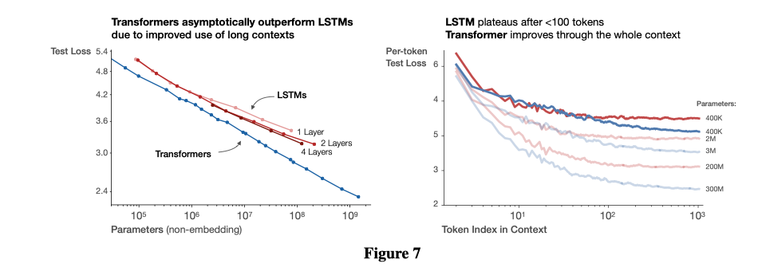
  <figcaption>左：测试损失随非嵌入参数量增加而下降，Transformer 的扩展曲线低于 1、2、4 层 LSTM。右：两类模型在上下文开头的表现接近，但 LSTM 在约 100 个 token 后趋于平台，Transformer 仍能继续利用更长上下文。图源：Kaplan et al., 2020。</figcaption>
</figure>

右图进一步解释了这种差异：LSTM 对上下文前部 token 的预测可以接近 Transformer，但随着位置向后移动，其收益很快饱和；Transformer 则能从更长的上下文中继续获益。

不过，这不是“Transformer 在任何任务上都必然优于 LSTM”的定理。该比较使用特定的语言建模数据、训练配方与参数量口径，而且参数量相同并不代表 FLOPs、训练速度或推理成本相同。Scaling Law 能降低比较成本，但不能消除实验设置带来的限制。

#### 不同架构的最优排名会随计算规模改变

Transformer 与 LSTM 只是两条曲线之间的比较。Tay 等人进一步训练了十类 Transformer 与非 Transformer 架构，覆盖 Transformer、ALBERT、动态卷积、Performer、MLP-Mixer、Switch Transformer 等模型，并用 FLOPs 统一表示计算规模。[14]

<figure>
  
  <figcaption>不同颜色表示不同模型架构，圆的大小表示参数量。整体上，计算量越大，负对数困惑度越高，也就是预训练困惑度越低；但相同计算量附近仍存在明显的架构差异。图源：Tay et al., 2022。</figcaption>
</figure>

如果只看一个规模上的结果，容易把“当前点更好”误认为“扩展到更大规模后仍然更好”。真正需要比较的是每类架构的整条计算扩展曲线：

- 有些架构在小计算区间表现较好，但曲线较早变平；
- 有些架构在小规模并不占优，却具有更好的扩展斜率；
- 因此，最优架构可能随着计算预算变化而改变。

<figure>
  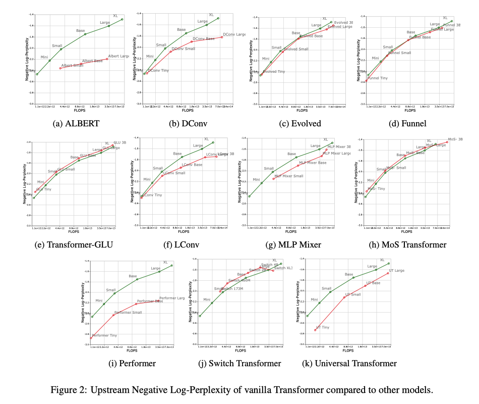
  <figcaption>绿色曲线为标准 Transformer，红色曲线为其他架构。不同架构具有明显不同的曲线位置与斜率；部分架构在小规模接近或超过 Transformer，但扩大计算量后收益较快减弱。图源：Tay et al., 2022。</figcaption>
</figure>

在这组实验中，标准 Transformer 的绝对性能并非在每个计算区间都最好，但它具有较强且稳定的扩展趋势。论文还发现，预训练困惑度的改善不一定能等比例转化为下游任务提升。因此，架构选择至少要同时考虑<strong>目标计算区间、曲线斜率和最终评测指标</strong>，不能只比较一组同规模模型。

### 4.2 优化器如何改变数据扩展曲线

Hestness 等人在字符级语言建模任务中，用同样的 10 层循环高速公路网络（Recurrent Highway Network，RHN）比较了 Adam 与 SGD。[5]

<figure>
  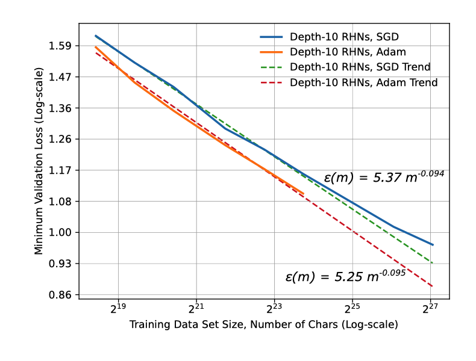
  <figcaption>实线为不同数据规模下的实验结果，虚线为幂律拟合。Adam 的曲线整体低于 SGD，但两条曲线近似平行，说明二者的数据扩展指数非常接近。图源：Hestness et al., 2017。</figcaption>
</figure>

两条拟合曲线分别为：

\[
\mathcal{E}_{\mathrm{SGD}}(m) \approx 5.37m^{-0.094},
\qquad
\mathcal{E}_{\mathrm{Adam}}(m) \approx 5.25m^{-0.095}.
\]

其中，\(m\) 是训练数据中的字符数，\(\mathcal{E}(m)\) 是最低验证损失。两个指数几乎相同，因此两条曲线在双对数坐标中近似平行；Adam 主要让曲线整体下移，在该实验范围内取得的损失大约比 SGD 低 5%。换言之，这里的优化器选择改变了曲线位置，却没有明显改变数据扩展速度。

需要注意的是，这是 2017 年、Transformer 出现前的 RHN 实验结果，不能直接推广到现代大语言模型。

### 4.3 模型形状与参数量口径：深度、宽度和嵌入参数

#### 增加模型深度的边际收益

模型参数量相同时，更深的模型是否一定更好？Kaplan 等人比较了不同层数模型的测试损失与非嵌入参数量。[6]

<figure>
  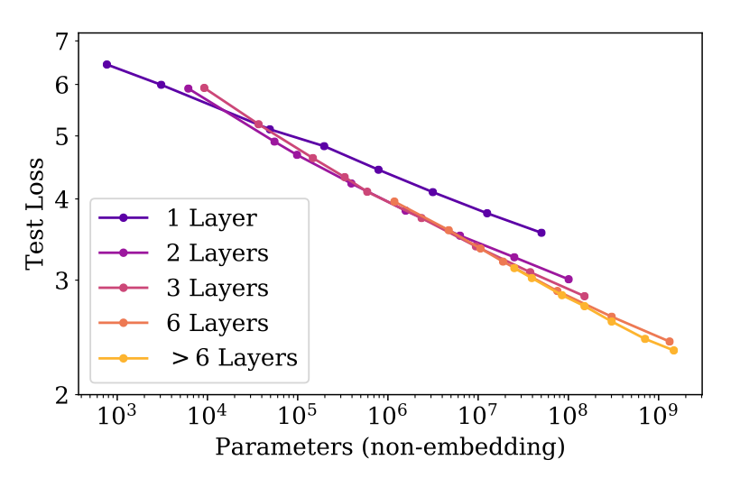
  <figcaption>从 1 层增加到 2 层会带来明显改善；达到 2 层以后，不同深度的曲线逐渐接近，继续增加层数的边际收益较小。图源：Kaplan et al., 2020。</figcaption>
</figure>

单层模型的曲线明显高于其他模型，而 2 层、3 层、6 层和更深模型的曲线比较接近。特别是在 \(10^7\) 个非嵌入参数以下，继续加深网络很快出现边际收益递减。这并不意味着深度完全不重要，而是说明达到基本的深度后，<strong>总规模比层数本身更能预测损失</strong>。

#### 固定参数量时，Transformer 对模型形状不太敏感

除了层数，还可以改变前馈层比例（Feed-forward Ratio）、宽深比（Aspect Ratio）和注意力头维度（Attention Head Dimension）。在总非嵌入参数量基本不变时，这些超参数主要是在重新分配参数，而不是扩大模型。[6]

<figure>
  
  <figcaption>在实验覆盖的较宽区间内，多种 Transformer 形状取得了相近性能。宽深比可以相差约 40 倍而损失只变化几个百分点；图中还估计，约 22% 的额外计算量可以抵消 1% 的损失上升。图源：Kaplan et al., 2020。</figcaption>
</figure>

三组曲线都在中间区域形成较宽的低谷，说明许多不同形状都能达到相近性能；只有比例过于极端时，损失才明显升高。因此，扩展模型时通常不需要把某个宽深比精确保持不变，但仍应避开极端狭窄、极端宽或注意力头维度不合理的配置。

#### 嵌入参数与非嵌入参数不能等量看待

前面的横轴特意使用“非嵌入参数量”，原因是不同类型的参数并不具有相同的预测能力。

<figure>
  
  <figcaption>左：计入嵌入参数后，不同深度模型形成明显不同的曲线。右：排除嵌入参数后，至少 2 层且宽深比不过于极端的模型大致收敛到同一趋势。图源：Kaplan et al., 2020。</figcaption>
</figure>

嵌入矩阵的大小主要由词表大小和隐藏维度决定，它不像注意力层与前馈层那样在每一层执行相同类型的变换。把嵌入参数和模型主体参数直接相加，会让“相同参数量”对应不同的模型结构与计算方式。对这组稠密 Transformer 实验而言，排除嵌入后的参数量因此是一种更稳定的扩展尺度。

### 4.4 混合专家模型（MoE）的规模口径：总参数量与激活参数量

在稀疏混合专家模型（Sparse Mixture-of-Experts，MoE）中，“不同参数具有不同价值”的现象更加明显。MoE 可以包含许多专家，但每个 token 只会激活其中一部分。因此需要区分：

- <strong>总参数量 \(N\)</strong>：模型存储的全部参数；
- <strong>激活参数量 \(N_a\)</strong>：处理一个 token 时实际参与计算的参数。

若一共有 \(E\) 个专家，每个 token 选择其中 \(K\) 个，则稀疏度可以写为：

\[
S=\frac{E-K}{E}.
\]

<figure>
  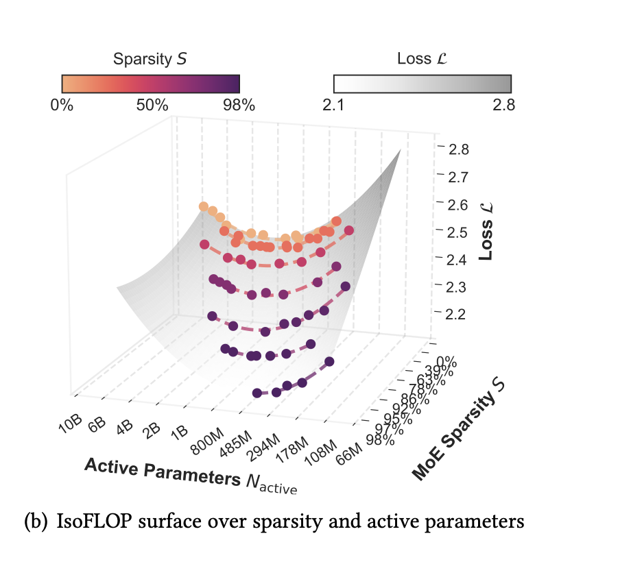
  <figcaption>固定训练计算预算后，预训练损失同时取决于激活参数量和 MoE 稀疏度；只使用单一参数量无法描述这张曲面。图源：Abnar et al., 2025。</figcaption>
</figure>

Abnar 等人在固定训练计算量下拟合了不同稀疏度和模型规模的等计算量曲面（IsoFLOP Surface）。实验显示，随着稀疏度提高，计算最优配置中的总参数量与激活参数量会向相反方向变化。[15]

<figure>
  
  <figcaption>星形表示各条曲线的最优点。稀疏度提高时，最优总参数量增加，而最优激活参数量减少；MoE 因而可以用更多存储参数换取较低的单 token 计算量。图源：Abnar et al., 2025。</figcaption>
</figure>

这个结果说明，在 MoE 中不能只用总参数量衡量模型规模。更完整的扩展定律需要同时考虑<strong>总参数量、激活参数量、稀疏度和训练计算量</strong>。不过，这些实验主要按理论 FLOPs 计算成本；现实中的显存占用、专家通信和硬件利用率可能抵消一部分稀疏化收益。

### 4.5 临界批大小：训练速度与计算效率的平衡

#### 为什么增大批大小会出现边际收益递减

批大小 \(B\) 表示一次参数更新使用多少训练样本或 token。小批量得到的梯度噪声较大；适当增大批量，可以让梯度估计更加稳定，并减少达到同一目标损失所需的串行更新次数。[16]

<figure>
  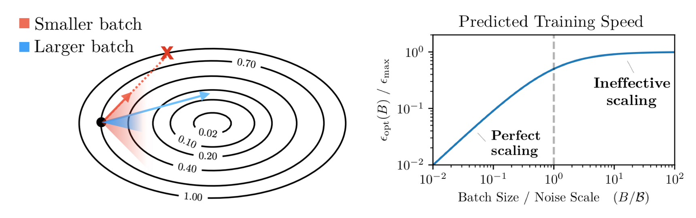
  <figcaption>左：较大的批量可以降低梯度估计噪声，从而允许更大的有效更新。右：当批大小远小于梯度噪声尺度时，增大批量接近线性加速；越过转折点后，训练速度逐渐饱和。图源：McCandlish et al., 2018。</figcaption>
</figure>

当 \(B\) 较小时，把批量扩大一倍，通常可以用更多并行计算换取接近一倍的训练加速。可是，当批量已经足够大，估计梯度与真实梯度非常接近时，继续加入样本几乎不能改善这一步的更新方向，只会增加计算量。这个从“近似线性加速”转入“收益迅速减弱”的位置，就是<strong>临界批大小（Critical Batch Size，\(B_{\mathrm{crit}}\)）</strong>。

#### 如何测量临界批大小

先选定一个目标损失，再用多种批大小分别训练，并记录达到该损失需要的：

- 参数更新次数 \(S\)；
- 处理样本数 \(E=BS\)。

具体来说，选择一组离散的批大小 \(B_1,\ldots,B_k\)，得到对应的 \((S_i,E_i)\)，再用这些点联合拟合下面的关系：[16]

\[
\left(\frac{S}{S_{\min}}-1\right)
\left(\frac{E}{E_{\min}}-1\right)=1.
\]

其中，\(S_{\min}\) 和 \(E_{\min}\) 是拟合参数：前者是极大批量下更新次数逼近的下限，后者是极小批量下处理样本数逼近的下限。它们不一定等于某次实验直接观测到的最小值。临界批大小定义为：

\[
B_{\mathrm{crit}}=\frac{E_{\min}}{S_{\min}}.
\]

当 \(B=B_{\mathrm{crit}}\) 时，等式两边恰好平衡，训练大约需要 \(2S_{\min}\) 次更新并处理 \(2E_{\min}\) 个样本。因此，临界批大小不是单纯追求最少步骤或最少计算，而是二者之间的折中点。

一个简单的拟合例子

假设使用三个离散批大小进行实验，并得到以下结果：

| 批大小 \(B\) | 更新次数 \(S\) | 总 token 数 \(E=BS\) |
|---:|---:|---:|
| 100 | 11,000 | 1,100,000 |
| 1,000 | 2,000 | 2,000,000 |
| 10,000 | 1,100 | 11,000,000 |

把这些点代入前面的关系进行拟合，可能得到：

\[
S_{\min}=1000,
\qquad
E_{\min}=1{,}000{,}000.
\]

虽然实验中最少观察到 1,100 次更新和 1,100,000 个 token，但拟合得到的 \(S_{\min}\) 与 \(E_{\min}\) 更小，因为它们表示曲线在极大和极小批量下逼近的理论下限。由此得到：

\[
B_{\mathrm{crit}}
=\frac{E_{\min}}{S_{\min}}
=1000.
\]

这三个点也展示了两端的代价：\(B=100\) 比较节省样本，但需要大量串行更新；\(B=10{,}000\) 接近最少更新次数，却处理了过多 token；\(B=1000\) 则位于两者的平衡点。

为什么临界批大小与梯度噪声有关？

设 \(G\) 是样本梯度的均值，\(\Sigma\) 是单个样本梯度的协方差矩阵。一个常用的简化梯度噪声尺度为：

\[
B_{\mathrm{noise}}\approx
\frac{\operatorname{tr}(\Sigma)}{\lVert G\rVert^2}.
\]

分子表示不同样本之间的梯度波动，分母表示平均梯度信号的强度。噪声相对信号越大，就需要越多样本才能得到稳定的梯度估计，因此可以有效利用的批量也越大。McCandlish 等人的实验发现，适当平均后的梯度噪声尺度能够在数量级上预测 \(B_{\mathrm{crit}}\)。这是建立在局部二次近似和学习率充分调节等假设上的经验模型，并不是对所有训练过程都严格成立的定理。

#### 目标损失越低，临界批大小越大

临界批大小并不是一次训练中固定不变的常数。随着损失下降，梯度噪声尺度通常会上升，因此训练后期能够有效利用更大的批量。

<figure>
  
  <figcaption>3M 与 85M 参数模型的临界批大小主要随已经达到的训练损失变化，而不是直接由模型参数量决定；绿色散点为梯度噪声尺度测量。图源：Kaplan et al., 2020。</figcaption>
</figure>

在 WebText2 实验中，Kaplan 等人拟合得到：[6]

\[
B_{\mathrm{crit}}(L)
\approx 2.1\times10^8\ \text{tokens}\cdot L^{-4.8}.
\]

也就是说，目标损失 \(L\) 越低，合适的临界批大小越大；论文估计损失每下降约 13%，\(B_{\mathrm{crit}}\) 大约翻倍。若实际训练使用批大小 \(B\) 和计算量 \(C\)，可以将其换算成小批量极限下的最低计算量：

\[
C_{\min}(C)
=\frac{C}{1+B/B_{\mathrm{crit}}(L)}.
\]

当 \(B\ll B_{\mathrm{crit}}\) 时，训练接近计算高效；当 \(B\gg B_{\mathrm{crit}}\) 时，继续增大批量主要消耗额外计算，而难以减少串行训练时间。上面的系数和指数来自特定的 WebText2 实验，其他任务需要重新测量。

### 4.6 最大更新参数化（μP）：跨模型宽度迁移学习率

如果只保持原来的初始化方式和学习率，然后直接增加模型宽度，最优学习率通常会随宽度发生漂移。此时，在小模型上调出的学习率不能直接用于大模型。[17]

<figure>
  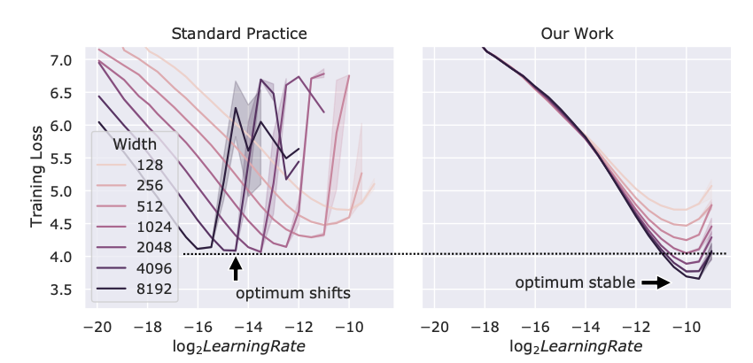
  <figcaption>左：标准参数化下，训练损失最低点会随模型宽度移动。右：使用最大更新参数化后，不同宽度的最低点大致对齐。图源：Yang et al., 2022。</figcaption>
</figure>

最大更新参数化（Maximal Update Parametrization，\(\mu\mathrm{P}\)）的目标，是让模型变宽后，各层参数更新对表示产生的影响仍保持在相近的数量级。这样可以先在较小的代理模型上调节基础学习率，再把它迁移到更宽的目标模型；这种方法称为 \(\mu\mathrm{P}\) 超参数迁移（\(\mu\)Transfer）。

不过，\(\mu\mathrm{P}\) 并不是对所有参数使用同一个缩放系数。假设目标模型 \(M'\) 的宽度是基准模型 \(M\) 的 \(r\) 倍，不同类型的参数需要采用不同规则。[18]

<figure>
  
  <figcaption>宽度扩大 \(r\) 倍时，矩阵型参数的 AdamW 学习率和初始化方差按 \(1/r\) 缩放；嵌入等其他参数保持不变，输出层乘数按 \(1/r\) 缩放。图源：Yao et al., 2024。</figcaption>
</figure>

如何阅读这张缩放规则表？

- <strong>矩阵型参数（matrix-like parameters）</strong>：两个维度都会随模型宽度增长，例如隐藏层中的全连接权重矩阵。模型变宽 \(r\) 倍后，其 AdamW 学习率由 \(l\) 调整为 \(l/r\)，初始化方差也由 \(\sigma\) 调整为 \(\sigma/r\)。
- <strong>其他参数（others）</strong>：只有零个或一个维度随宽度增长，嵌入层也属于这一类。表中的学习率和初始化方差保持不变。
- <strong>输出乘数（output multiplier）</strong>：语言模型头把随宽度增长的隐藏表示映射到固定词表维度，其乘数由 \(\tau\) 调整为 \(\tau/r\)；其他乘数保持不变。

因此，能够跨规模迁移的是一组<strong>基础超参数</strong>，实际施加到各参数张量上的学习率仍要按照参数类型进行换算。

这一方法减少了在最大模型上反复搜索学习率的成本，但它主要处理由<strong>宽度变化</strong>引起的训练动力学变化。深度、数据规模、正则化方法或优化器发生改变时，其他超参数仍可能需要重新验证。

### 4.7 预训练指标与下游指标的扩展规律并不一致

前面的扩展曲线大多使用训练损失、验证损失或困惑度作为性能指标。这些指标通常会随参数量平滑变化，但<strong>下游任务（downstream task）</strong>的表现可能没有这么稳定。[14]

<figure>
  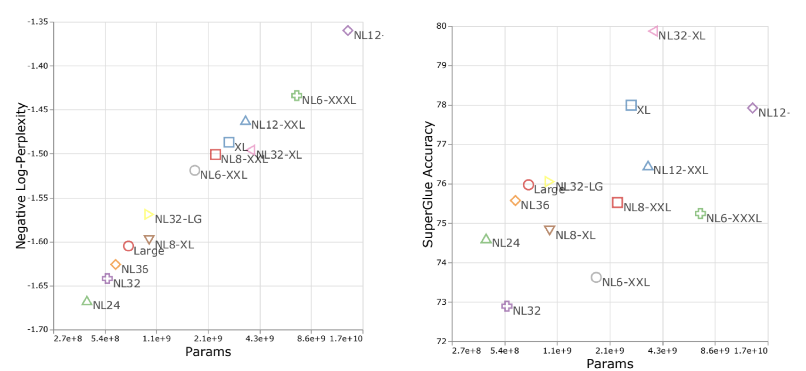
  <figcaption>左：负对数困惑度随参数量增加呈现较清晰的改善趋势。右：同一组模型的 SuperGLUE 准确率明显更加分散，并不随参数量单调提高。图源：Tay et al., 2022。</figcaption>
</figure>

这说明，较低的预训练损失并不保证下游任务按同样的顺序改善。模型架构和归纳偏置可能影响知识能否顺利迁移到下游任务，因此只根据预训练扩展曲线比较模型，可能得到不完整的结论。

这并不意味着下游能力完全无法预测，而是说它通常需要<strong>针对具体下游指标单独拟合和验证</strong>，不能直接把预训练损失的扩展规律当作下游准确率的扩展规律。

### 4.8 用小规模扩展曲线选择大模型方案

前面的实验表明，优化器、模型深度、架构和学习率参数化都会影响模型随规模增长的表现。它们在大模型上的影响，可以先通过较小模型的扩展曲线进行预测。基本流程是：

1. 为每种候选设计训练若干较小的模型。
2. 分别拟合扩展规律，例如比较 Adam 与 SGD 的扩展曲线。
3. 将曲线外推到目标规模或计算预算，选择预测表现最好的设计。

这里的“训练前预测”是指<strong>在训练目标大模型之前</strong>完成选择，而不是完全不做实验。预测仍然依赖一组小规模训练，并且只有当扩展趋势足够稳定、外推距离合理时才值得信任。对于上一节所说的下游任务，还需要使用相应的下游指标重新验证。

## 5. 数据—模型联合扩展定律（Joint Data-Model Scaling Laws）

### 5.1 为什么必须联合考虑数据量与模型规模

前面的数据扩展定律主要研究固定模型时，增加训练数据会带来多少改善。但模型容量有限时，数据的边际收益会逐渐饱和：小模型即使看到更多 token，也可能没有足够容量继续降低损失。

<figure>
  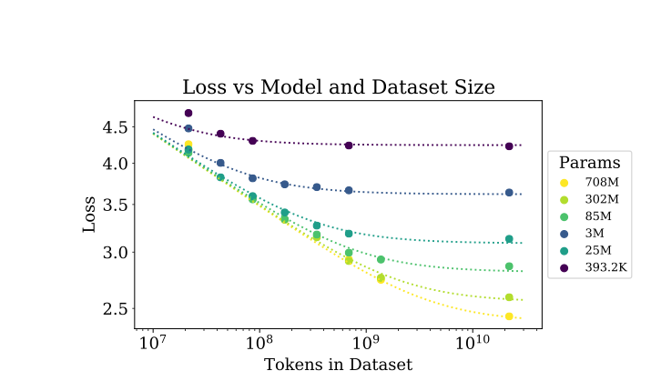
  <figcaption>较小模型的损失曲线更早进入平台区；较大模型能够从同样的新增数据中获得更多收益。这里的“数据被浪费”是指边际收益已经很低，而不是新增数据完全没有作用。图源：Kaplan et al., 2020。</figcaption>
</figure>

因此，“应该增加数据，还是增大模型”不能通过单独的数据扩展曲线回答。<strong>数据—模型联合扩展定律</strong>把误差同时写成数据规模 \(n\) 和模型规模 \(m\) 的函数。

Rosenfeld 等人给出的一种简化形式为：[19]

\[
\operatorname{Error}(n,m)
\approx n^{-\alpha}+m^{-\beta}+C.
\]

其中，\(n^{-\alpha}\) 表示数据有限造成的误差，\(m^{-\beta}\) 表示模型容量有限造成的误差，\(C\) 表示继续扩大这两个尺度也难以消除的误差下限。

Kaplan 等人使用了另一种耦合形式；省略归一化常数后，可以写成：[6]

\[
\operatorname{Error}(n,m)
\approx \left[m^{-\alpha}+n^{-1}\right]^{\beta}.
\]

这两种写法的具体参数化不同，但表达了相同直觉：数据和模型中的任何一项过小，都可能成为性能瓶颈。把不同的 \((n,m)\) 组合放在一起，就得到一张二维的联合误差曲面。

<figure>
  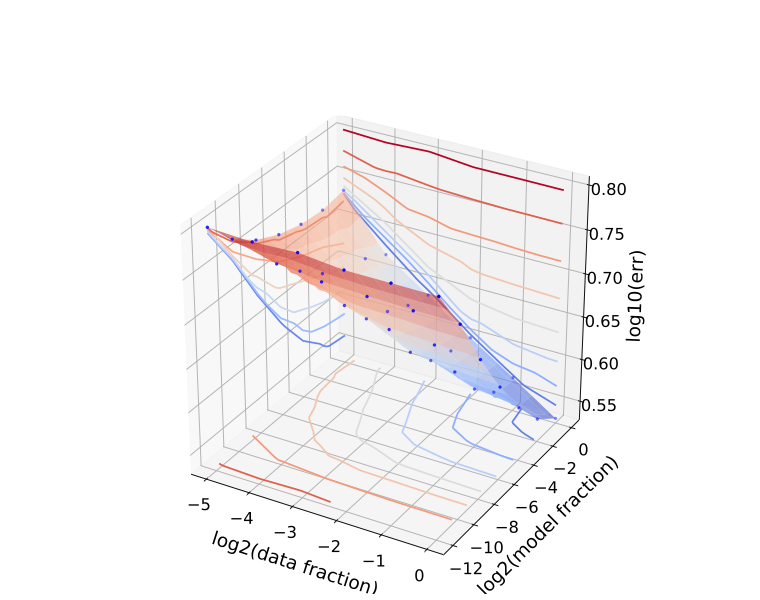
  <figcaption>蓝点是不同数据量和模型规模组合的实测结果；曲面展示联合误差随两个尺度共同变化的形状。图源：Rosenfeld et al., 2020。</figcaption>
</figure>

这些简单函数在论文覆盖的实验范围内能够较好地拟合联合误差，但仍然是经验模型，而不是对任意数据集、架构和训练方法都成立的定理。

### 5.2 用小模型和小数据外推并选择最优配置

联合扩展定律的一个重要用途，是只使用较小模型和较少数据拟合 \(\alpha\)、\(\beta\) 等参数，再预测更大模型与更多数据组合的表现。[19]

<figure>
  
  <figcaption>左：绿色点用于拟合，红色点是需要外推的更大配置。中、右：ImageNet 和 WikiText-103 上的预测值接近对角线，说明预测误差与实测误差较为接近。图源：Rosenfeld et al., 2020。</figcaption>
</figure>

图中的示例只使用不超过完整模型 \(1/16\) 的模型规模，以及不超过完整数据集 \(1/8\) 的数据量进行拟合。

这里需要强调的是，外推误差并不是最终目的。一旦通过小规模实验拟合出联合误差函数：

\[
\operatorname{Error}(n,m)
\approx n^{-\alpha}+m^{-\beta}+C,
\]

就可以进一步在给定成本约束下选择数据量和模型规模：

\[
(m^*,n^*)
=\underset{m,n}{\arg\min}\ \operatorname{Error}(n,m)
\quad
\text{s.t.}\quad
\operatorname{Cost}(m,n)\leq B.
\]

这里的 \(B\) 是可用预算，\(\operatorname{Cost}(m,n)\) 则应根据实际训练计算量、数据获取成本或其他限制来定义。外推越远，训练设置或数据分布发生变化的可能性越大，因此小规模拟合仍需要用少量较大实验进行校验。

### 5.3 Chinchilla 如何估计计算最优的数据—模型配比

对于稠密语言模型，一次训练的计算量可近似写成：

\[
C\approx 6ND,
\]

其中，\(N\) 是模型参数量，\(D\) 是训练 token 数。固定计算预算 \(C\) 后，增大模型就必须减少训练 token，增加训练 token 则必须缩小模型。因此问题不只是“模型应该多大”，而是<strong>怎样在模型规模与训练数据之间分配计算量</strong>。

Kaplan 等人的拟合给出：[6]

\[
N_{\mathrm{opt}}\propto C^{0.73},
\qquad
D_{\mathrm{opt}}\propto C^{0.27}.
\]

按照这个结果，新增算力应主要用于扩大模型，训练 token 数增长得更慢。因此，最优的每参数 token 数会随着预算增加而下降：

\[
\frac{D_{\mathrm{opt}}}{N_{\mathrm{opt}}}
\propto C^{-0.46}.
\]

Hoffmann 等人在 Chinchilla 研究中重新估计了这一关系。他们发现，在相同计算预算下，Kaplan 的规律会选择<strong>过大的模型和过少的训练数据</strong>；更好的分配方式是使用较小的模型，并让它看到更多 token。[20]

<figure>
  
  <figcaption>虚线是 Kaplan 等人的预测，三条实线是 Chinchilla 研究使用不同方法得到的结果。GPT-3、Gopher 和 Megatron-Turing NLG 的实际配置更接近 Kaplan 式的“大模型、少 token”分配，只有 Chinchilla 接近新的计算最优曲线。图源：Hoffmann et al., 2022。</figcaption>
</figure>

论文从三个角度估计计算最优关系，并统一写成：

\[
N_{\mathrm{opt}}\propto C^a,
\qquad
D_{\mathrm{opt}}\propto C^b.
\]

| 估计方法 | \(a\)：参数量指数 | \(b\)：token 数指数 |
| --- | ---: | ---: |
| 训练曲线包络 | 0.50（0.488–0.502） | 0.50（0.501–0.512） |
| 等计算量曲线 | 0.49（0.462–0.534） | 0.51（0.483–0.529） |
| 参数化损失联合拟合 | 0.46（0.454–0.455） | 0.54（0.542–0.543） |
| Kaplan 等人的估计 | 0.73 | 0.27 |

括号中是论文报告的拟合区间。三种方法的数值并不完全相同，但前两种方法几乎都得到 \(a\approx b\approx 0.5\)，第三种方法也更接近均衡扩展，而不是 Kaplan 的 \(0.73/0.27\) 分配。

因此，Chinchilla 的核心结论是：<strong>计算预算增加时，模型参数量和训练 token 数应当以大致相同的速度增长</strong>。在 \(a\approx b\approx 0.5\) 时，\(D_{\mathrm{opt}}/N_{\mathrm{opt}}\) 大致保持稳定，而不是随预算持续下降。

#### 方法一：训练曲线包络

第一种方法训练一组从 70M 到 10B 参数的模型，并为每个模型设置四种不同的余弦学习率周期。这样可以得到大量“训练损失—计算量”曲线。

对于每一个计算量 \(C\)，从所有曲线中选择损失最低的点。这些最低点组成训练曲线包络（Training Curve Envelope），表示当前实验中在该计算预算下能达到的最低损失。再读取每个包络点对应的参数量 \(N\) 和 token 数 \(D\)，就能分别拟合它们与计算量的幂律关系。

<figure>
  
  <figcaption>左：不同模型及训练长度对应的训练曲线，灰色曲线是各计算量下的最低损失包络。中、右：包络点对应的最优参数量和 token 数，并用幂律向更大计算预算外推。图源：Hoffmann et al., 2022。</figcaption>
</figure>

该方法得到：

\[
a=0.50,
\qquad
b=0.50.
\]

以 Gopher 的 \(5.76\times 10^{23}\) FLOPs 训练预算为例，拟合结果预测的计算最优配置约为 67B 参数、1.5T token。后来训练的 Chinchilla 使用 70B 参数和 1.4T token，与这一估计非常接近。

#### 方法二：等计算量曲线

第二种方法使用等计算量曲线（IsoFLOP Profile）。论文选择从 \(6\times 10^{18}\) 到 \(3\times 10^{21}\) FLOPs 的九个计算预算；在每个预算下改变参数量 \(N\)，并相应调整训练 token 数：

\[
D\approx \frac{C}{6N}.
\]

这样，每条曲线中的实验具有相同的训练计算量，但模型大小和训练数据量不同。

<figure>
  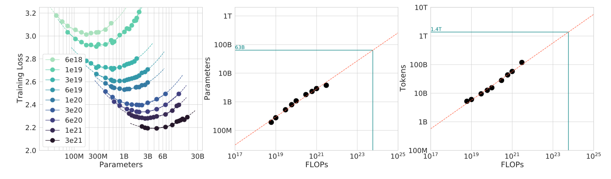
  <figcaption>左：每种颜色对应一个固定计算预算，损失随参数量呈现明显的谷底。中、右：各谷底对应的最优参数量与 token 数随计算量近似服从幂律。图源：Hoffmann et al., 2022。</figcaption>
</figure>

固定计算量后，模型过小时会受模型容量限制；模型过大时，可用于训练它的 token 又太少，模型没有得到充分训练。因此，每条曲线都呈近似 U 形。论文用抛物线拟合曲线谷底，再拟合这些最优点随计算量的变化，得到：

\[
a=0.49,
\qquad
b=0.51.
\]

这一方法对 Gopher 训练预算的预测约为 63B 参数、1.4T token，与方法一非常接近。

IsoFLOP 还能用于哪些模型？

IsoFLOP 不依赖某个特定的语言模型损失函数。只要能够在多组固定预算下稳定训练不同配置，就可以寻找架构、稀疏度或模型规模的计算最优前沿。

Gulrajani 和 Hashimoto 将它用于扩散语言模型（Diffusion Language Model）。自回归模型（Autoregressive Model）和扩散模型都呈现清晰的 U 形等计算量曲线：[25]

<figure>
  
  <figcaption>左：自回归模型；右：扩散语言模型。每种颜色对应一个固定计算预算，星形标出该预算下的最低验证负对数似然。图源：Gulrajani and Hashimoto, 2023。</figcaption>
</figure>

两类模型的损失随计算量以相近斜率下降，但当时的扩散模型仍存在约 64 倍的常数计算差距；其计算最优模型约小 4 倍，并需要训练约 4 倍更久。

<figure>
  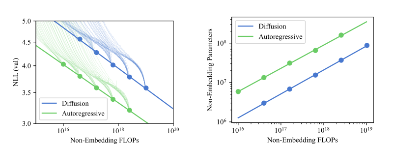
  <figcaption>左：损失随计算量变化；右：计算最优参数量随预算变化。图源：Gulrajani and Hashimoto, 2023。</figcaption>
</figure>

IsoFLOP 还可以扩展为高维曲面。混合专家模型（Mixture of Experts，MoE）可以同时改变参数量和稀疏度，再在固定计算量下寻找最低损失点：[15]

<figure>
  
  <figcaption>左：稀疏度与总参数量组成的等计算量曲面；右：稀疏度与激活参数量组成的曲面。星形是各稀疏度下的最优点。图源：Abnar et al., 2025。</figcaption>
</figure>

#### 方法三：参数化损失联合拟合

前两种方法先在每个计算预算下寻找最低损失点，第三种方法则直接把所有实验的最终损失联合拟合为参数量和 token 数的函数：

\[
\widehat{L}(N,D)
=E+\frac{A}{N^{\alpha}}+\frac{B}{D^{\beta}}.
\]

其中，\(E\) 表示理想生成过程仍然存在的损失下限；\(A/N^{\alpha}\) 表示有限模型容量带来的额外损失；\(B/D^{\beta}\) 表示训练 token 有限、模型尚未充分收敛带来的额外损失。论文并非直接使用普通最小二乘，而是在对数损失上使用 Huber 损失（Huber Loss）进行稳健拟合，以减小异常实验点的影响。

<figure>
  
  <figcaption>左：拟合得到的等损失线，蓝线是在达到相同损失时所需计算量最少的计算最优前沿；右：固定计算量后的损失切片。图源：Hoffmann et al., 2022。</figcaption>
</figure>

在约束 \(C\approx 6ND\) 下最小化上述损失，得到：

\[
a=0.46,
\qquad
b=0.54.
\]

这个结果比前两种方法更偏向增加训练数据，并预测 Gopher 预算下约 40B 参数的模型最优。数值差异与拟合方式和不同计算区间的残差有关，但三种方法都得到同一个稳健结论：<strong>模型规模与训练 token 数应当近似同步扩展</strong>。

如何从联合损失函数得到参数量与 token 数的最优指数？

把计算量约束 \(C\approx 6ND\) 代入损失函数，并对 \(N\) 与 \(D\) 进行约束优化，可以得到计算最优前沿：

\[
N_{\mathrm{opt}}(C)
=G\left(\frac{C}{6}\right)^a,
\qquad
D_{\mathrm{opt}}(C)
=G^{-1}\left(\frac{C}{6}\right)^b,
\]

其中：

\[
G=\left(\frac{\alpha A}{\beta B}\right)^{\frac{1}{\alpha+\beta}},
\qquad
a=\frac{\beta}{\alpha+\beta},
\qquad
b=\frac{\alpha}{\alpha+\beta}.
\]

由于 \(a+b=1\)，固定计算预算下，两个指数描述的正是新增计算量如何在模型参数和训练 token 之间分配。\(\alpha\) 与 \(\beta\) 不是理论预先给定的常数，而是由实验数据拟合得到，因此最终的 \(0.46/0.54\) 仍然是经验结论。

Kaplan 与 Chinchilla 的差异也不只是函数形式不同。后续复现表明，参数量与 FLOPs 口径、小规模拟合区间、学习率预热和优化器调参都会改变最优指数；修正这些因素后，结果会更接近 Chinchilla 的 \(a\approx0.5\)。[21][22]

方法三的复现与修正

前面介绍的第三种方法，通过下面的参数化损失函数联合拟合所有实验点：

\[
\widehat{L}(N,D)
=E+\frac{A}{N^{\alpha}}+\frac{B}{D^{\beta}}.
\]

Besiroglu 等人后来尝试复现这一方法。他们没有获得 DeepMind 的原始实验数据，而是从论文 PDF 中的矢量图恢复出 240 个实验点，再使用相同函数重新拟合。[23]

重新拟合得到：

\[
\alpha=0.3478,
\qquad
\beta=0.3658,
\qquad
a=\frac{\beta}{\alpha+\beta}=0.5126.
\]

这里的 \(a\approx 0.51\) 接近方法一和方法二的 \(0.50\) 与 \(0.49\)，而不是原始方法三报告的 \(0.454\)。

<figure>
  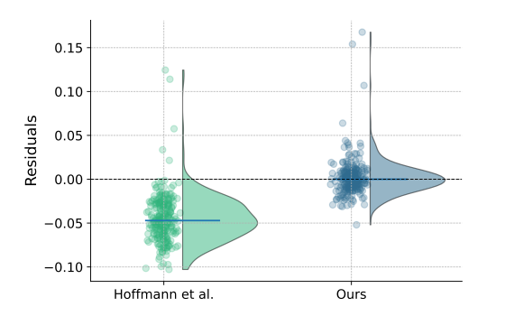
  <figcaption>左侧是原论文参数产生的残差，整体明显偏离零；右侧是重新拟合后的残差，更集中在零附近。由于数据来自论文图表重建，结果仍包含数字化误差。图源：Besiroglu et al., 2024。</figcaption>
</figure>

原始方法三的参数还会推导出：随着计算量增加，最优的每参数 token 数快速增长；在 Chinchilla 的训练规模附近，预测值约为 70 token/参数。这与实际采用的约 20 token/参数，以及方法一、方法二的结果都不一致。

<figure>
  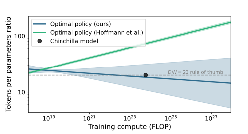
  <figcaption>绿色曲线是原始方法三推导出的最优策略，蓝色曲线是重新拟合结果，黑点是实际 Chinchilla 配置。重新拟合的结果与 20 token/参数更一致，但不确定范围也明显更宽。阴影为 80% 置信区间。图源：Besiroglu et al., 2024。</figcaption>
</figure>

原始方法三的拟合为什么会出现问题？

复现研究指出了三个相互关联的问题：

1. 论文正文对参数进行了舍入，尤其是把数据指数 \(\beta\) 写成 \(0.28\)，会在非常大的 \(D\) 上放大预测偏差；
2. 拟合程序对不同实验点的 Huber 损失取平均，并使用了较大的损失尺度，导致优化器在真正收敛之前停止；
3. 同样的提前停止发生在自举法（Bootstrap）重复拟合中，使每次结果几乎没有离开初始值，从而产生异常狭窄的置信区间。

原论文为参数量指数 \(a\) 报告的区间只有 \(0.454\)–\(0.455\)。复现研究估计，要在正常统计条件下得到如此窄的区间，可能需要约 60 万次训练，而原研究只有约 400–500 个观测点。

因此，这项复现<strong>没有推翻“参数量和 token 数应近似同步增长”这一核心结论</strong>。它修正的是方法三的具体参数和过度精确的置信区间；重新拟合后，三种方法反而更加一致。

### 5.4 训练最优不等于部署最优

Chinchilla 回答的是训练计算最优（Training-compute Optimality）问题：给定一次预训练的计算预算，怎样选择 \(N\) 和 \(D_{\mathrm{train}}\) 才能使损失最低。

实际部署还要反复运行推理。如果模型在生命周期中处理 \(D_{\mathrm{inf}}\) 个推理 token，一个简化的总计算量模型是：[24]

\[
C_{\mathrm{lifecycle}}
\approx 6ND_{\mathrm{train}}+2ND_{\mathrm{inf}}.
\]

第一项是一次性的训练成本，第二项则会随着调用量持续累积。当 \(D_{\mathrm{inf}}\) 很大时，参数量 \(N\) 每减少一点，都会在之后的每个推理 token 上节省计算。此时可能更值得选择一个较小模型，用更多训练数据补回性能，然后长期享受较低的推理成本。

这通常被称为相对于 Chinchilla 配比的“超额训练”（Overtraining），但它并不是把模型训练到过拟合，而是<strong>让较小模型看到超过训练计算最优点的数据</strong>。训练成本会上升，推理成本却会下降。

讲义列出了几代模型的大致训练 token/参数比：

| 模型 | 约训练 token/参数 |
| --- | ---: |
| GPT-3 | 2 |
| Chinchilla | 20 |
| LLaMA-65B | 22 |
| Llama 2 70B | 29 |
| Mistral 7B | 110 |
| Llama 3 70B | 215 |

这些数值的统计口径和公开程度并不完全相同，不适合视为严格的受控实验，但可以看出一个明显趋势：很多面向部署的模型正在使用更高的训练 token/参数比。[1]

Sardana 等人把推理成本正式加入 Chinchilla 的优化目标。他们发现，当预期推理需求达到约十亿次请求时，训练更小的模型、使用更多训练 token，通常比训练计算最优配置具有更低的生命周期成本。[24]

因此，模型应该训练到什么程度取决于它的用途：

- 只关心一次训练预算时，使用训练计算最优配比；
- 预计模型会被大量调用时，应同时考虑训练和推理成本；
- 推理需求越大，就越值得提前支付更多训练成本，以换取更小、更便宜的部署模型。

## 参考文献

[1] Stanford CS336. Lecture 9: Scaling Laws - Basics. [Online]. Available: https://stanford-cs336.github.io/spring2025/

[2] C. Cortes, L. D. Jackel, S. A. Solla, V. Vapnik, and J. S. Denker. Learning Curves: Asymptotic Values and Rate of Convergence. 1993. [Online]. Available: https://research.google/pubs/learning-curves-asymptotic-values-and-rate-of-convergence/

[3] M. Banko and E. Brill. Scaling to Very Very Large Corpora for Natural Language Disambiguation. 2001. [Online]. Available: https://aclanthology.org/P01-1005/

[4] P. Kolachina, N. Cancedda, M. Dymetman, and S. Venkatapathy. Prediction of Learning Curves in Machine Translation. 2012. [Online]. Available: https://aclanthology.org/P12-1003/

[5] J. Hestness et al. Deep Learning Scaling is Predictable, Empirically. 2017. [Online]. Available: https://arxiv.org/abs/1712.00409

[6] J. Kaplan et al. Scaling Laws for Neural Language Models. 2020. [Online]. Available: https://arxiv.org/abs/2001.08361

[7] Y. Bahri, E. Dyer, J. Kaplan, J. Lee, and U. Sharma. Explaining Neural Scaling Laws. 2021. [Online]. Available: https://arxiv.org/abs/2102.06701

[8] T. Hashimoto. Model Performance Scaling with Multiple Data Sources. 2021. [Online]. Available: https://proceedings.mlr.press/v139/hashimoto21a.html

[9] J. Ye, P. Liu, T. Sun, Y. Zhou, J. Zhan, and X. Qiu. Data Mixing Laws: Optimizing Data Mixtures by Predicting Language Modeling Performance. 2024. [Online]. Available: https://arxiv.org/abs/2403.16952

[10] I. Magnusson et al. DataDecide: How to Predict Best Pretraining Data with Small Experiments. 2025. [Online]. Available: https://arxiv.org/abs/2504.11393

[11] N. Muennighoff et al. Scaling Data-Constrained Language Models. 2023. [Online]. Available: https://arxiv.org/abs/2305.16264

[12] K. Kim, S. Kotha, P. Liang, and T. Hashimoto. Pre-training under Infinite Compute. 2025. [Online]. Available: https://arxiv.org/abs/2509.14786

[13] S. Goyal, P. Maini, Z. C. Lipton, A. Raghunathan, and J. Z. Kolter. Scaling Laws for Data Filtering—Data Curation Cannot Be Compute Agnostic. 2024. [Online]. Available: https://arxiv.org/abs/2404.07177

[14] Y. Tay et al. Scaling Laws vs Model Architectures: How Does Inductive Bias Influence Scaling? 2022. [Online]. Available: https://arxiv.org/abs/2207.10551

[15] S. Abnar, H. Shah, D. Busbridge, A. El-Nouby, J. M. Susskind, and V. Thilak. Parameters vs FLOPs: Scaling Laws for Optimal Sparsity for Mixture-of-Experts Language Models. 2025. [Online]. Available: https://arxiv.org/abs/2501.12370

[16] S. McCandlish, J. Kaplan, D. Amodei, and OpenAI Dota Team. An Empirical Model of Large-Batch Training. 2018. [Online]. Available: https://arxiv.org/abs/1812.06162

[17] G. Yang et al. Tensor Programs V: Tuning Large Neural Networks via Zero-Shot Hyperparameter Transfer. 2022. [Online]. Available: https://arxiv.org/abs/2203.03466

[18] Y. Yao et al. nanoLM: an Affordable LLM Pre-training Benchmark via Accurate Loss Prediction across Scales. 2024. [Online]. Available: https://arxiv.org/abs/2304.06875

[19] J. S. Rosenfeld, A. Rosenfeld, Y. Belinkov, and N. Shavit. A Constructive Prediction of the Generalization Error Across Scales. 2020. [Online]. Available: https://arxiv.org/abs/1909.12673

[20] J. Hoffmann et al. Training Compute-Optimal Large Language Models. 2022. [Online]. Available: https://arxiv.org/abs/2203.15556

[21] T. Porian, M. Wortsman, J. Jitsev, L. Schmidt, and Y. Carmon. Resolving Discrepancies in Compute-Optimal Scaling of Language Models. 2024. [Online]. Available: https://arxiv.org/abs/2406.19146

[22] T. Pearce and J. Song. Reconciling Kaplan and Chinchilla Scaling Laws. 2024. [Online]. Available: https://arxiv.org/abs/2406.12907

[23] T. Besiroglu, E. Erdil, M. Barnett, and J. You. Chinchilla Scaling: A Replication Attempt. 2024. [Online]. Available: https://arxiv.org/abs/2404.10102

[24] N. Sardana, J. Portes, S. Doubov, and J. Frankle. Beyond Chinchilla-Optimal: Accounting for Inference in Language Model Scaling Laws. 2024. [Online]. Available: https://proceedings.mlr.press/v235/sardana24a.html

[25] I. Gulrajani and T. B. Hashimoto. Likelihood-Based Diffusion Language Models. 2023. [Online]. Available: https://arxiv.org/abs/2305.18619
