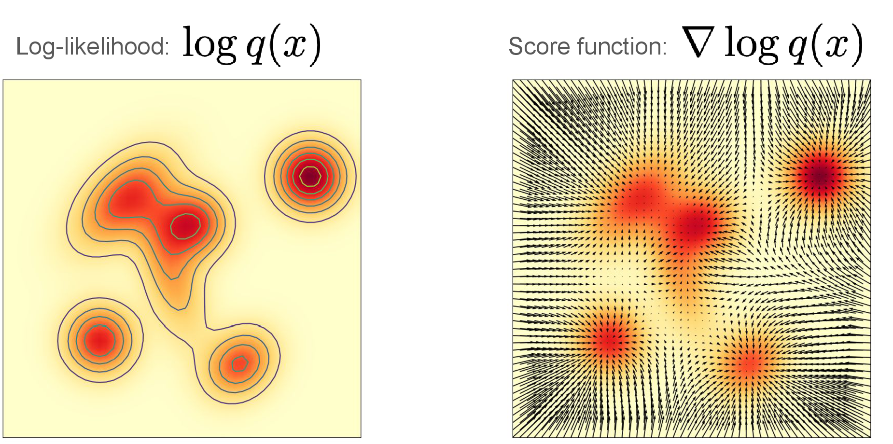
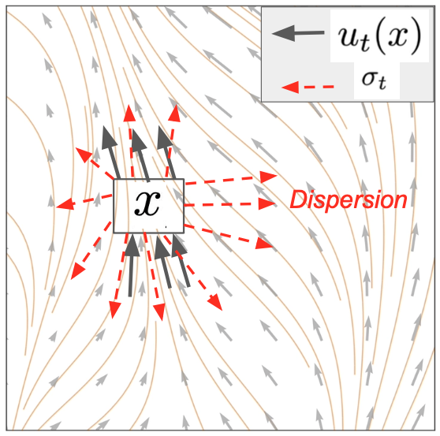

## 1. 条件分数与边缘分数

**定义一 条件分数**（Conditional Score）：\(\nabla_x \log p_t(x|z)\)。

**定义二 边缘分数**（Marginal Score）：\(\nabla_x \log p_t(x)\)。

> 
>
> 左图展示对数似然 \(\log q(x)\) 的等高线，右图展示对应的分数向量场 \(\nabla_x\log q(x)\)。每个箭头都指向对数似然在当前位置增长最快的方向，也就是局部概率密度升高的方向。图源：MIT 6.S184 Lecture 3。

> 从**条件分数**中推导出**边缘分数**：

\[
\begin{aligned}
\nabla_x \log p_t(x)
&= \frac{\nabla_x p_t(x)}{p_t(x)} \\
&= \frac{\nabla_x \int p_t(x|z) p_{data}(z) \, dz}{p_t(x)} \\
&= \int \nabla_x \log p_t(x|z)
\frac{p_t(x|z) p_{data}(z)}{p_t(x)} \, dz \\
&= \int \nabla_x \log p_t(x|z) \, p_t(z|x) \, dz
\end{aligned}
\]

> **高斯分数**（Gaussian Score）：

\[
\begin{aligned}
\nabla_x \log p_t(x|z)
&= \nabla_x \log \mathcal{N}(x; \alpha_t z, \sigma_t^2 I_d) \\
&= -\frac{1}{\sigma_t^2}(x - \alpha_t z)
\end{aligned}
\]

> 该公式要求 \(\sigma_t > 0\)。对于 \(\sigma_t=1-t\)，它适用于 \(0 \leq t < 1\)；在 \(t=1\) 时，条件分布退化为狄拉克测度，不再具有普通概率密度。

#### 条件概率路径、向量场与分数函数

| 对象 | 记号 | 核心性质 | 高斯例子 |
| --- | --- | --- | --- |
| 条件概率路径 | \(P_t(\cdot\mid z)\) | 在 \(P_{init}\) 和数据点 \(z\) 之间插值 | \(\mathcal{N}(\alpha_t z,\sigma_t^2I_d)\) |
| 条件向量场 | \(u_t^{target}(x\mid z)\) | 对应的 ODE 沿条件路径演化 | \(\left(\dot{\alpha}_t-\frac{\dot{\sigma}_t}{\sigma_t}\alpha_t\right)z+\frac{\dot{\sigma}_t}{\sigma_t}x\) |
| 条件分数函数 | \(\nabla_x\log p_t(x\mid z)\) | 对数似然关于 \(x\) 的梯度 | \(\frac{\alpha_t}{\sigma_t^2}z-\frac{1}{\sigma_t^2}x\) |

#### 边缘概率路径、向量场与分数函数

| 对象 | 记号 | 核心性质 | 公式 |
| --- | --- | --- | --- |
| 边缘概率路径 | \(P_t\) | 在 \(P_{init}\) 和 \(P_{data}\) 之间插值 | \(p_t(x)=\int p_t(x\mid z)p_{data}(z)\,dz\) |
| 边缘向量场 | \(u_t^{target}(x)\) | 对应的 ODE 沿边缘路径演化 | \(\int u_t^{target}(x\mid z)\frac{p_t(x\mid z)p_{data}(z)}{p_t(x)}\,dz\) |
| 边缘分数函数 | \(\nabla_x\log p_t(x)\) | 可用于将 ODE 目标转换为 SDE | \(\int \nabla_x\log p_t(x\mid z)\frac{p_t(x\mid z)p_{data}(z)}{p_t(x)}\,dz\) |

条件分数函数和边缘分数函数分别是条件向量场和边缘向量场的重要组成部分；其中边缘分数还会出现在第 3 节的 SDE 扩展中。

### 1.1 重新参数化：从向量场到分数函数

对于高斯条件概率路径，向量场可以改写为分数函数的仿射变换。令

\[
a_t=\sigma_t^2\frac{\dot{\alpha}_t}{\alpha_t}-\dot{\sigma}_t\sigma_t,
\qquad
b_t=\frac{\dot{\alpha}_t}{\alpha_t},
\]

则条件向量场和边缘向量场分别满足

\[
\begin{aligned}
u_t^{target}(x\mid z)
&=a_t\nabla_x\log p_t(x\mid z)+b_t x, \\
u_t^{target}(x)
&=a_t\nabla_x\log p_t(x)+b_t x.
\end{aligned}
\]

这里要求 \(\alpha_t>0\) 且 \(\sigma_t>0\)。这说明，学习速度场和学习分数函数是等价的：给定其中一个，就可以通过上式得到另一个。早期扩散模型通常先学习分数函数，再将其重新参数化为向量场。

重新参数化公式的代数推导

由高斯条件分数

\[
\nabla_x\log p_t(x\mid z)
=-\frac{x-\alpha_t z}{\sigma_t^2}
=\frac{\alpha_t}{\sigma_t^2}z-\frac{1}{\sigma_t^2}x
\]

以及 \(a_t,b_t\) 的定义，有

\[
\begin{aligned}
a_t\nabla_x\log p_t(x\mid z)+b_t x
&=\frac{a_t\alpha_t}{\sigma_t^2}z
  +\left(b_t-\frac{a_t}{\sigma_t^2}\right)x \\
&=\left(\dot{\alpha}_t-\frac{\dot{\sigma}_t}{\sigma_t}\alpha_t\right)z
  +\frac{\dot{\sigma}_t}{\sigma_t}x \\
&=u_t^{target}(x\mid z).
\end{aligned}
\]

再对 \(Z\mid X_t=x\) 取条件期望，并使用边缘分数的边缘化公式：

\[
\begin{aligned}
u_t^{target}(x)
&=\mathbb{E}\!\left[u_t^{target}(x\mid Z)\mid X_t=x\right] \\
&=a_t\mathbb{E}\!\left[\nabla_x\log p_t(x\mid Z)\mid X_t=x\right]+b_t x \\
&=a_t\nabla_x\log p_t(x)+b_t x.
\end{aligned}
\]

## 2. 分数匹配与去噪分数匹配

下文中的 \(\mathbb{E}_{t,z,x}\) 表示联合采样
\(t\sim\operatorname{Unif}[0,1]\)、\(z\sim p_{data}\)、\(x\sim p_t(\cdot\mid z)\)。

**分数匹配**（Score Matching，SM）让模型 \(s_t^\theta(x)\) 拟合边缘概率路径的分数函数：

\[
\begin{aligned}
\mathcal{L}_{SM}(\theta)
&=\mathbb{E}_{t,z,x}
\left[\left\|s_t^\theta(x)-\nabla_x\log p_t(x)\right\|^2\right].
\end{aligned}
\]

这个目标的困难在于，真实边缘分数 \(\nabla_x\log p_t(x)\) 通常不可直接计算。

**去噪分数匹配**（Denoising Score Matching，DSM）改用条件分数作为训练目标：

\[
\begin{aligned}
\mathcal{L}_{DSM}(\theta)
&=\mathbb{E}_{t,z,x}
\left[\left\|s_t^\theta(x)-\nabla_x\log p_t(x\mid z)\right\|^2\right].
\end{aligned}
\]

DSM 与 SM 只相差一个与模型无关的常数

记边缘分数为 \(s_t(x)=\nabla_x\log p_t(x)\)，并令

\[
\begin{aligned}
C
&=\mathbb{E}_{t,z,x}
\left[\left\|\nabla_x\log p_t(x\mid z)-s_t(x)\right\|^2\right].
\end{aligned}
\]

由条件分数到边缘分数的边缘化关系，在给定 \(t,x\) 时有

\[
\begin{aligned}
\mathbb{E}\!\left[\nabla_x\log p_t(x\mid z)\mid t,x\right]
&=s_t(x).
\end{aligned}
\]

将

\[
\begin{aligned}
s_t^\theta(x)-\nabla_x\log p_t(x\mid z)
&=\bigl(s_t^\theta(x)-s_t(x)\bigr) \\
&\quad+\bigl(s_t(x)-\nabla_x\log p_t(x\mid z)\bigr).
\end{aligned}
\]

代入平方范数。令

\[
A=s_t^\theta(x)-s_t(x),\qquad
B=s_t(x)-\nabla_x\log p_t(x\mid z).
\]

由于 \(A\) 只依赖于 \(t,x\)，而 \(\mathbb{E}[B\mid t,x]=0\)，交叉项可以逐步写成

\[
\begin{aligned}
\mathbb{E}[A^\mathsf{T}B]
&=\mathbb{E}\!\left[\mathbb{E}[A^\mathsf{T}B\mid t,x]\right] \\
&=\mathbb{E}\!\left[A^\mathsf{T}\mathbb{E}[B\mid t,x]\right] \\
&=0.
\end{aligned}
\]

因此

\[
\begin{aligned}
\mathcal{L}_{DSM}(\theta)
&=\mathcal{L}_{SM}(\theta)+C.
\end{aligned}
\]

其中 \(C\) 与模型参数 \(\theta\) 无关，所以两个目标具有相同的最优解。

## 3. SDE 扩展定理与 Fokker-Planck 方程

**定理一 SDE 扩展定理**（SDE Extension Trick）：令 \(u_t^{target}(x) = \int u_t^{target}(x|z) p_{data}(z|x) \, dz\)，则对于任意 \(g_t \geq 0\)：

\[
\begin{aligned}
X_0 &\sim P_{init}, \\
dX_t &= \left[u_t^{target}(X_t) + \frac{g_t^2}{2} \nabla_x \log p_t(X_t)\right]dt + g_t dW_t, \\
&\Longrightarrow X_t \sim P_t,\quad t \in [0,1], \\
&\Longrightarrow X_1 \sim P_{data}.
\end{aligned}
\]

**定理二 Fokker-Planck 方程**（Fokker-Planck Equation）：给定 SDE

\[
X_0 \sim P_{init},
\qquad
dX_t = u_t(X_t)dt + g_t dW_t,
\]

则 \(p_t\) 满足：

> 
>
> 图中灰色箭头表示向量场引起的概率流，红色虚线表示扩散导致的概率质量分散。

\[
\begin{aligned}
\frac{d}{dt}p_t(x)
&= -\operatorname{div}(p_tu_t)(x) + \frac{1}{2}g_t^2\Delta p_t(x) \\
&\Longleftrightarrow X_t \sim P_t,\quad t \in [0,1].
\end{aligned}
\]

其中，\(-\operatorname{div}(p_tu_t)(x)\) 是连续性方程中的概率流项，\(\frac{1}{2}g_t^2\Delta p_t(x)\) 是热扩散项。

定理一的证明：加入扩散后仍保持边缘概率路径

Fokker–Planck 定理适用于一般 SDE

\[
\begin{aligned}
dX_t&=u_t(X_t)\,dt+g_t\,dW_t,
\end{aligned}
\]

其中 \(u_t\) 是任意漂移项，对应的密度方程为

\[
\begin{aligned}
\frac{d}{dt}p_t(x)
&=-\operatorname{div}\bigl(p_tu_t\bigr)(x)
  +\frac{g_t^2}{2}\Delta p_t(x).
\end{aligned}
\]

SDE 扩展定理选择的漂移项是

\[
\begin{aligned}
u_t(x)
&=u_t^{target}(x)+\frac{g_t^2}{2}\nabla_x\log p_t(x).
\end{aligned}
\]

将它代入 Fokker–Planck 方程，并使用
\(\nabla_x p_t(x)=p_t(x)\nabla_x\log p_t(x)\)，可得

\[
\begin{aligned}
\frac{d}{dt}p_t(x)
&=-\operatorname{div}\left[
p_tu_t^{target}
+\frac{g_t^2}{2}p_t\nabla_x\log p_t
\right](x)
+\frac{g_t^2}{2}\Delta p_t(x) \\
&=-\operatorname{div}\bigl(p_tu_t^{target}\bigr)(x)
  -\frac{g_t^2}{2}\operatorname{div}(\nabla_xp_t)(x)
  +\frac{g_t^2}{2}\Delta p_t(x) \\
&=-\operatorname{div}\bigl(p_tu_t^{target}\bigr)(x).
\end{aligned}
\]

最后一步使用了
\[
\begin{aligned}
\operatorname{div}(\nabla_xp_t)(x)&=\Delta p_t(x) \\
&=\sum_{i=1}^{d}\frac{\partial^2 p_t(x)}{\partial x_i^2}.
\end{aligned}
\]
这里的 \(\Delta\) 是拉普拉斯算子，即对所有空间坐标的二阶偏导数求和。因此，加入
\(g_t\,dW_t\) 和分数修正项后，Fokker–Planck 方程退化为原来的连续性方程，边缘概率路径 \(p_t\) 不变。

需要区分：Fokker–Planck 定理中的 \(u_t\) 是一般漂移项；SDE 扩展定理只是对它作了上述特殊选择。

3.1 SDE 扩展定理与 Fokker–Planck 理论的关系

Fokker–Planck 方程适用于一般 SDE：

\[
\begin{aligned}
dX_t&=u_t(X_t)\,dt+g_t\,dW_t,\\
\frac{d}{dt}p_t(x)
&=-\operatorname{div}\bigl(p_tu_t\bigr)(x)
  +\frac{g_t^2}{2}\Delta p_t(x).
\end{aligned}
\]

原来的连续性方程为

\[
\begin{aligned}
\frac{d}{dt}p_t(x)
&=-\operatorname{div}\bigl(p_tu_t^{target}\bigr)(x).
\end{aligned}
\]

为了让加入扩散后的 SDE 仍保持同一个边缘概率路径，SDE 扩展定理采用特殊漂移

\[
\begin{aligned}
u_t(x)
&=u_t^{target}(x)+\frac{g_t^2}{2}\nabla_x\log p_t(x).
\end{aligned}
\]

如果不作这个修正，扩散项一般会改变概率路径。不过，上式不是严格意义上的唯一选择：还可以加入满足
\[
\operatorname{div}\bigl(p_tv_t\bigr)=0
\]
的速度场 \(v_t\)，而不改变概率密度的演化。

因此，Fokker–Planck 方程是适用于一般 SDE 的概率密度演化理论；SDE 扩展定理则是在其中选择特殊漂移项，使带噪 SDE 仍满足原连续性方程的一种构造。

### 3.2 SDE 采样：用分数网络替代真实分数

在本节中将噪声系数 \(g_t\) 记为 \(\sigma_t\)。SDE 扩展定理给出

\[
\begin{aligned}
dX_t
&=\left[
u_t^{target}(X_t)
+\frac{\sigma_t^2}{2}\nabla_x\log p_t(X_t)
\right]dt+\sigma_t\,dW_t.
\end{aligned}
\]

对于高斯概率路径，向量场可以表示为

\[
\begin{aligned}
u_t^{target}(x)
&=a_t\nabla_x\log p_t(x)+b_tx.
\end{aligned}
\]

代入上式后，SDE 只含边缘分数：

\[
\begin{aligned}
dX_t
&=\left[
\left(a_t+\frac{\sigma_t^2}{2}\right)\nabla_x\log p_t(X_t)
+b_tX_t
\right]dt+\sigma_t\,dW_t.
\end{aligned}
\]

真实分数 \(\nabla_x\log p_t(x)\) 通常未知，因此用训练得到的分数网络
\(s_t^\theta(x)\) 近似它：

\[
\begin{aligned}
s_t^\theta(x)&\approx\nabla_x\log p_t(x),\\
dX_t
&=\left[
\left(a_t+\frac{\sigma_t^2}{2}\right)s_t^\theta(X_t)
+b_tX_t
\right]dt+\sigma_t\,dW_t.
\end{aligned}
\]

这就得到可以通过数值方法模拟的扩散模型采样动力学。

### 3.3 随机动力学的理论等价性与实践取舍

在分数函数已被精确估计且 SDE 能够被精确模拟时，不同的扩散系数都可以得到相同的边缘概率路径，并最终从数据分布采样。实际应用中则存在两类误差：

- **训练误差**：分数网络没有完美学习边缘向量场或边缘分数；
- **模拟误差**：SDE/ODE 必须离散化，数值积分会产生误差。

此外，微调、推理时优化等下游任务有时需要随机演化来探索状态空间。另一方面，在许多生成任务中，ODE 采样往往能取得更好的结果。因此，SDE 采样是一种可选方案，而不是必需步骤。

---

## 参考文献

[1] GPT中英字幕课程资源, "《流匹配与扩散模型|6.S184 Flow Matching and Diffusion Models》中英字幕（Claude-3.7-s）》," Bilibili, Jul. 29, 2025. [Online video]. Available: https://www.bilibili.com/video/BV1gc8Ez8EFL. Accessed: Jan. 30, 2026.

[2] P. Holderrieth and R. Shprints, "Score Matching and Guidance," MIT 6.S184 Lecture 3 slides, 2026. [Online]. Available: https://diffusion.csail.mit.edu/2026/docs/20260123_Lecture_03.pdf
