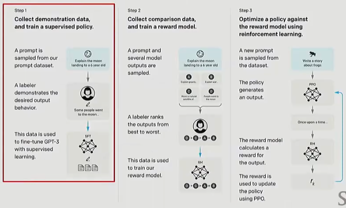
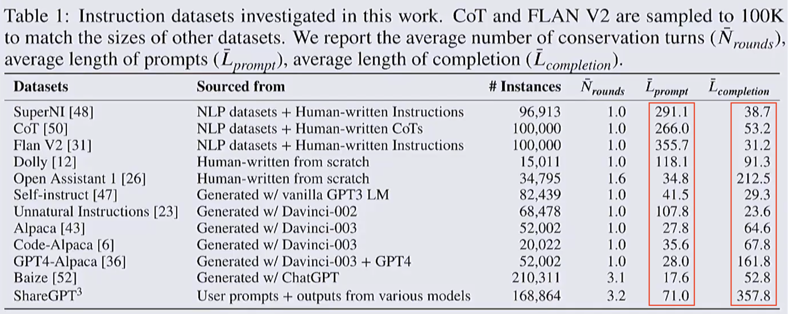
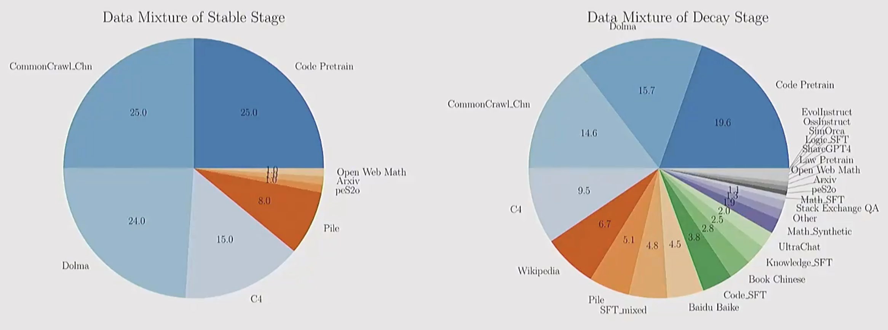
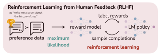
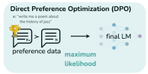

## 1. Post-Training: Three Stages

> From InstructGPT[[1]](#ref1)

1. Collect data and train a **supervised** policy.
  - Sample a prompt from the prompt dataset.
  - Annotators label the desired output.
  - Use the labeled data to perform supervised fine-tuning of the LLM.
2. Collect **comparison data** and train a **reward model**.
  - Sample a prompt and multiple model outputs.
  - Annotators rank these outputs from “best” to “worst”.
  - Use the ranking data to train the reward model.
3. With the **trained reward model**, optimize the policy using **reinforcement learning**.
  - Sample a new prompt from the dataset.
  - Generate an output with the current policy.
  - The reward model scores the output (Reward).
  - Update the policy using PPO (or other RL methods) based on the reward.

---

## 2. Building an SFT Dataset

### 2.1. Issues in the dataset

> An example from the FLAN dataset:
>
> What is this text about? OPTIONS: - World - Sport - Business - Science/Tech

- Natural conversations usually do not contain such explicit options.

> An example from OpenAssistant:
>
> Question: Can you write a short introduction about the relevance of the term"monopsony" in economics? Please use examples related to potential monopsonies in the labour market and cite relevant research.
>
> Answer: "Monopsony" refers to a market structure where there is only one buyer for a particular good or service. In economics, this term is particularly relevant in the labor market, where a monopsony employer has significant power over the wages and working conditions of their employees. [...]. Overall, the concept of monopsony is essential to understanding the dynamics of labor markets and the impact of market power on workers. Further research is needed to understand the extent and impact of monopsonies on the economy and to develop policies to address this issue. References: Bivens, J., & Mishel, L.(2013). The Pay of Corporate Executives and Financial Professionals as Evidence of Rents in Top 1 Percent Incomes. Journal of Economic Perspectives, 27(3), 57-78.

- Human annotators often cannot write answers that are this **long and detailed**.
- How should you choose notation and even writing style?
- Should the answer include **references**?
  - Getting references right is hard. We often want academic-style outputs, so we add references into answers in the dataset. But the model may only learn the shallow pattern “answers should include references”, which can increase hallucinations.
- Should the answers contain **complex knowledge**?
- Dataset size.
- Dataset safety.
- How to decide the output length: as the figure below shows, instruction datasets can have very different input/output lengths.

---

### 2.2. Practical tips for constructing SFT data

1. SFT works best when the base model already has certain capabilities, and the data helps “extract” them. If you try to use SFT to “add” behaviors the model fundamentally lacks, results are often poor.
2. Not all factually correct data improves performance. Even high-quality factual data can disrupt the model’s existing distribution/alignment and degrade performance.
3. Some data types (e.g., safety, instruction-following, style) can yield large gains even in small amounts. However, improving long-tail behaviors (broad coverage, sparse scenarios) typically requires much more data.

---

### 2.3. Instruction tuning during pretraining

1. Pretrain on web data or a pretraining corpus.
2. Mix instruction-tuning data into pretraining.
3. Do an additional short instruction-tuning stage.

---

### 2.4. Midtraining / Two-phase training

This recipe[[2]](#ref2) seems to be adopted by many LLM companies (though detailed docs are rare):
- In the Stable stage, train on a pure pretraining dataset (left in the figure).
- In the Decay stage, train on a mixture of pretraining + instruction-tuning data (right in the figure).

---

## 3. RLHF (Reinforcement Learning with Human Feedback)

### 3.1. From imitation to optimization

**Imitation (SFT)**: adjust the model’s output distribution to match a reference distribution $p^\*(y|x)$, so that $\hat{p}(y|x) \approx p^\*(y|x)$.

- From a pure generative modeling perspective, SFT teaches the model to imitate the reference distribution.
- Training requires data from the reference policy (e.g., human-labeled datasets); otherwise, there is nothing to imitate.

**Optimization (RLHF)**: continuously adjust $\hat{p}(y|x)$ to maximize $\max\limits_{p} E_p[R(y,x)]$, where $R(y,x)$ is the reward.

- We are not optimizing an abstract “true distribution”, but a reward function we can define and measure (in RLHF, this reward comes from human feedback: rankings, pairwise preferences, or a trained reward model).
- At this stage, we no longer view the LM as an approximation to $p^\*(y|x)$ (as in SFT). Instead, we treat it as a **policy** to maximize the reward signal.

---

### 3.2. Why RLHF is needed

1. **Cost**: SFT is expensive, especially the annotation cost.
2. **G–V Gap (Generation–Value Gap)**: what people write (generation distribution $G$) is not always aligned with what people actually prefer (from the viewpoint of a value model $V$).

> A prior study[[3]](#ref3) found that when some annotators compared their own summaries with model-written summaries, they sometimes preferred the model’s summaries—suggesting human-written references are not always optimal.

---

### 3.3. How to collect RLHF data

**Option 1**: (On the web) ask the model to produce $N$ outputs and let annotators (users) rank them.
- Potential issues:
  - The labels may be **low-quality** or **incorrect**, or even generated by other LLMs—depending on the annotators.
  - The annotator population distribution can significantly shape model behavior.
  > For example, if many annotators are from Asia, the model may drift toward “Asian-style” outputs.
  - Different annotators care about different things.
  > Some focus on formatting; others focus on content.

**Option 2**: use a large language model (e.g., GPT-4) to rank $N$ outputs (possibly from multiple models). This is often called AI Feedback.

---

### 3.4. Methods to implement RLHF

#### 3.4.1. PPO with human feedback

Vanilla PPO = policy gradient + off-policy correction. Its objective is:

$$
\max L^{CLIP}(\theta) - \beta KL[\pi_\theta||\pi_{old}]
$$

其中$L^{CLIP}(\theta) = \mathbb{E}_t \Big[ \min \big( r_t(\theta) \hat{A}_t,\; \text{clip}(r_t(\theta), 1-\epsilon, 1+\epsilon)\hat{A}_t \big) \Big]$，

其中$r_t(\theta) = \frac{\pi_\theta(a_t \mid s_t)}{\pi_{\theta_{\text{old}}}(a_t \mid s_t)}$，

人类反馈下的PPO的优化目标为：

$$
L^{RLHF}(\theta) = \mathbb{E}\_{x \sim D, y \sim \pi} [ r(x,y) ] - \beta D\_{KL} \left[ \pi(y|x) || \pi_{\text{ref}}(y|x) \right]
$$

Where:
- $r(x,y)$: the reward model’s score for output $y$ given input $x$.
- $\pi(y\mid x)$: the current policy (the RLHF-trained model), i.e., the distribution over outputs $y$ given input $x$.
- $\pi_{\text{ref}}(y\mid x)$: the reference policy, usually a frozen SFT model, used to prevent the policy from drifting too far.
- $D_{KL} \left[ \pi(y|x) || \pi_{\text{ref}}(y|x) \right]$: the KL divergence between the current and reference policies.

**Q1**: Why does vanilla PPO optimize $\mathbb{E}_t[ r_t(\theta)\hat{A}_t ]$, while RLHF optimizes $\mathbb{E}_{x,y}[r(x,y)]$?
- In standard RL tasks, advantages $\hat{A}_t$ are often estimated from an **offline** behavior policy, so the objective takes the form $\max \mathbb{E}_t[ r_t(\theta)\hat{A}_t ]$.
- In RLHF for LLMs, we use a reward model to directly score the **on-policy** outputs from the current LLM, so we do not need importance sampling correction via $r_t(\theta)$.

**Q2**: What is the difference between $\pi_{old}$ in vanilla PPO and $\pi_{\text{ref}}$ in RLHF PPO?
- $\pi_{old}$: the policy from the previous iteration; used for data collection and importance sampling; updated continuously.
- $\pi_{\text{ref}}$: a fixed reference policy, typically the frozen SFT model before RLHF; it is not updated.

---

#### 3.4.2. DPO

DPO uses the same high-level objective as PPO:

$$
\max L^{RLHF}(\theta) = \mathbb{E}\_{x \sim D, y \sim \pi} [ r(x,y) ] - \beta D\_{KL} \left[ \pi(y|x) || \pi_{\text{ref}}(y|x) \right]
$$

From this objective, the optimal policy is:

$$
\pi(y|x) = \frac{1}{Z(x)}\pi\_{\text{ref}}(y|x)\exp(\frac{1}{\beta}r(x,y))
$$

其中，$Z(x) = \sum\limits\_y \pi\_{\text{ref}}(y|x)\exp(\frac{1}{\beta}r(x,y))$

  
Click to expand the derivation

  $$
  \begin{align}
  &\max\limits\_\pi \mathbb{E}\_{x \sim D, y \sim \pi} [ r(x,y) ] - \beta D\_{KL} \left[ \pi(y|x) || \pi\_{\text{ref}}(y|x) \right] \\\\
   = &\max\limits\_\pi \mathbb{E}\_{x \sim D, y \sim \pi} [ r(x,y) ] -  \mathbb{E}\_{x \sim D, y \sim \pi} [ \beta \log \frac{\pi(y|x)}{\pi\_{\text{ref}}(y|x)} ] \\\\
   = &\max\limits\_\pi \mathbb{E}\_{x \sim D, y \sim \pi} [ r(x,y) - \beta \log \frac{\pi(y|x)}{\pi\_{\text{ref}}(y|x)} ] \\\\
   = &\min\limits\_\pi \mathbb{E}\_{x \sim D, y \sim \pi} [ \beta \log \frac{\pi(y|x)}{\pi\_{\text{ref}}(y|x)} - r(x,y) ] \\\\
   = &\min\limits\_\pi \mathbb{E}\_{x \sim D, y \sim \pi} [ \log \frac{\pi(y|x)}{\pi\_{\text{ref}}(y|x)} - \log \exp(\frac{1}{\beta}r(x,y)) ] \\\\
   = &\min\limits\_\pi \mathbb{E}\_{x \sim D, y \sim \pi} [ \log \frac{\pi(y|x)}{\pi\_{\text{ref}}(y|x)\exp(\frac{1}{\beta}r(x,y))}] \\\\
   = &\min\limits\_\pi \mathbb{E}\_{x \sim D, y \sim \pi} [ \log \frac{\pi(y|x)}{\pi\_{\text{ref}}(y|x)\exp(\frac{1}{\beta}r(x,y))\frac{1}{Z(x)} Z(x)}] \\\\
   = &\min\limits\_\pi \mathbb{E}\_{x \sim D, y \sim \pi} [ \log \frac{\pi(y|x)}{\frac{1}{Z(x)}\pi\_{\text{ref}}(y|x)\exp(\frac{1}{\beta}r(x,y))} - \log Z(x)] \\\\
   \end{align}
  $$

  where $Z(x) = \sum\limits\_y \pi\_{\text{ref}}(y|x)\exp(\frac{1}{\beta}r(x,y))$.
  
  Let $\pi^\star(y|x) = \frac{1}{Z(x)}\pi\_{\text{ref}}(y|x)\exp(\frac{1}{\beta}r(x,y)) = \frac{\pi\_{\text{ref}}(y|x)\exp(\frac{1}{\beta}r(x,y))}{\sum\limits\_y \pi\_{\text{ref}}(y|x)\exp(\frac{1}{\beta}r(x,y))}$. Then:

  $$
  \begin{align}
    &\min\limits\_\pi \mathbb{E}\_{x \sim D, y \sim \pi} [ \log \frac{\pi(y|x)}{\frac{1}{Z(x)}\pi\_{\text{ref}}(y|x)\exp(\frac{1}{\beta}r(x,y))} - \log Z(x)] \\\\
    = &\min\limits\_\pi \mathbb{E}\_{x \sim D, y \sim \pi} [ \log \frac{\pi(y|x)}{\pi^\star(y|x)} - \log Z(x)] \\\\
    = &\min\limits\_\pi \mathbb{E}\_{x \sim D, y \sim \pi} [ \log \frac{\pi(y|x)}{\pi^\star(y|x)}] \\\\
    = &\min\limits\_\pi \mathbb{E}\_{x \sim D, y \sim \pi} [D\_{KL} (\pi(y|x) || \pi^\star(y|x))] \\\\
   \end{align}
  $$

  The optimum is $\pi(y|x) = \pi^\star(y|x) = \frac{1}{Z(x)}\pi\_{\text{ref}}(y|x)\exp(\frac{1}{\beta}r(x,y))$.
  

Plugging the optimal policy into the maximum likelihood form of the Bradley–Terry model yields the DPO loss:

$$
Loss\_{DPO} = - \ln \sigma \left( \beta \ln \frac{\pi(y^+ \mid x)}{\pi\_{ref}(y^+ \mid x)} - \beta \ln \frac{\pi(y^- \mid x)}{\pi\_{ref}(y^- \mid x)} \right)
$$

Here, $y^+$ is the preferred (higher-quality) sample and $y^-$ is the dispreferred (lower-quality) sample.

  
Click to expand: Bradley–Terry model

  **Bradley–Terry model**:
  
  $$
  P(i>j) = \frac{\alpha\_i}{\alpha\_i + \alpha\_j}
  $$
  
  $P(i>j)$ is the probability that item $i$ beats item $j$. A common loss is

  $$
  Loss = -\mathbb{E}\_{(\alpha\_x, \alpha\_y) \sim D} [ \ln  \frac{\alpha\_i}{\alpha\_i + \alpha\_j}]
  $$

  **Bradley–Terry model for LLM preferences**:

  $$
  P(y\_1>y\_2) = \frac{r(x,y\_1)}{r(x,y\_1) + r(x,y\_2)}
  $$

  where $x$ is the input prompt, $y$ is an output, and $r(x,y)$ is the reward score. To avoid negative values, we exponentiate:

  $$
  P(y\_1>y\_2) = \frac{\exp(r(x,y\_1))}{\exp(r(x,y\_1)) + \exp(r(x,y\_2))}
  $$

  The loss is

  $$
  \begin{align}
  \text{Loss} &= - \mathbb{E}\_{(x, y^+, y^-) \sim D} [ \ln ( \frac{\exp(r(x, y^+))}{\exp(r(x, y^+)) + \exp(r(x, y^-))} ) ] \\\\
  &= - \mathbb{E}\_{(x, y^+, y^-) \sim D} [ \ln ( \frac{1}{1 + \exp(r(x, y^-)) - r(x, y^+)}    ) ] \\\\
  &= - \mathbb{E}_{(x, y^+, y^-) \sim D} [ \ln \sigma ( r(x, y^+) - r(x, y^-) ) ]
  \end{align}
  $$

  where $\sigma(x) = \frac{1}{1+\exp(-x)}$ is the sigmoid.

  
Click to expand the derivation

  $$
  \begin{align}
  &\pi(y \mid x) = \frac{1}{Z(x)} \pi\_{ref}(y \mid x) \exp( \frac{1}{\beta} r(x, y)) \\\\
  \Rightarrow &\exp( \frac{1}{\beta} r(x, y) ) = \frac{\pi(y \mid x)}{\pi\_{ref}(y \mid x)} Z(x) \\\\
  \Rightarrow &r(x, y) = \beta \ln ( \frac{\pi(y \mid x)}{\pi\_{ref}(y \mid x)} Z(x) ) \\\\
  \Rightarrow &r(x, y) = \beta \ln ( \frac{\pi(y \mid x)}{\pi\_{ref}(y \mid x)} ) + \beta \ln Z(x) \\\\
  \end{align}
  $$

  Substitute into the Bradley–Terry formulation:

  $$
  \begin{align}
  Loss & = - \ln \sigma ( r(x, y^+) - r(x, y^-) ) \\\\
  & = - \ln \sigma (\beta \ln ( \frac{\pi(y^+ \mid x)}{\pi\_{ref}(y^+ \mid x)} ) + \beta \ln Z(x) - \beta \ln ( \frac{\pi(y^- \mid x)}{\pi\_{ref}(y^- \mid x)} ) - \beta \ln Z(x)) \\\\
  & = - \ln \sigma (\beta \ln ( \frac{\pi(y^+ \mid x)}{\pi\_{ref}(y^+ \mid x)} ) - \beta \ln ( \frac{\pi(y^- \mid x)}{\pi\_{ref}(y^- \mid x)} ))
  \end{align}
  $$

---

  
References

  <ol>
    <li id="ref1"><a href="https://proceedings.neurips.cc/paper_files/paper/2022/file/b1efde53be364a73914f58805a001731-Paper-Conference.pdf" target="_blank">Ouyang L, Wu J, Jiang X, et al. Training language models to follow instructions with human feedback[J]. Advances in neural information processing systems, 2022, 35: 27730-27744.</a></li>
    <li id="ref2"><a href="https://arxiv.org/pdf/2404.06395" target="_blank">Hu S, Tu Y, Han X, et al. Minicpm: Unveiling the potential of small language models with scalable training strategies[J]. arXiv preprint arXiv:2404.06395, 2024.</a></li>
    <li id="ref3"><a href="https://watermark02.silverchair.com/tacl_a_00632.pdf?token=AQECAHi208BE49Ooan9kkhW_Ercy7Dm3ZL_9Cf3qfKAc485ysgAAA0kwggNFBgkqhkiG9w0BBwagggM2MIIDMgIBADCCAysGCSqGSIb3DQEHATAeBglghkgBZQMEAS4wEQQM56gOdOIymzmdZk7SAgEQgIIC_MoTKqHYldlrb721Q5h2KffVo_kOA5sAdAk6Iko4Wu_cYFNYwzooRlN4Vmg64QkEP1rbgfQi1FVMWnNzCPbYCyhxpMlFcYX6bAPaLSTZiI3kUweSL5mPGPsGGycoEX1MAF5i4yKnT4pM7UKL5izeIaflqaWa-Rzo0cqhI66vUbfbp5WQILP2RQOA5qNoLUFbXtLx0TUgxuo-HaFfh3L3IEi1f3Loyj2-UJw4V7Dr7DYCf39XXfICpALlzjoTlJ_3s5YqMcbKn-9my4-DVh4EjU4QenszgsYc2GuHAXE23nUeFGfX93vMXESnP8mwRkVuKuaGodxiW-SZnO4jEQfAv8qH692lrJmkq9iT_WIvHE__hJQtIVr6cZgY9fXGrBzGmK6Hkz79PyMaAK5VglXB-dqB9JrQJQzXdjoIV4qmCKzVGOwYtT5qOOtoNPzHOTaBseERNSMMJw4Jq8t8S4-8GbFfmUcBdQrgs2HM5uYn2igRj_F-xMyRVe5y-jl8s_0Q8dFfliXCESTTI8p0NIqqz0uCY7iB64TemqFVEtR8M1FNbbJ82bhBAKg1zoJtG8hC3pIiQiXawsZzd9oFbx0GFwDdbvbYETEp5R3sJQ8wT1Ra2WhCPicvfSWgdC2EZRCWM4NvUZhsnpBfvZ4DlaE6xWma0u1x_rzrkfabjJcPnbC05EaF9dfx5pJ-X5uPnb1bDyIZQ5zyoueKtaPZzQVtP0mSH7qozQLRLR6UsdHH1RexlpnBOUyYtQtU50Xs0rySHvuWDYaeMICgOQwYGl8heOYlIUzexCgVvyuJz3c2HgwbUxQI3eAH05D74ApGpnaqKy1QNqQJKKXxIZ8QmpQYC4vnKBes20kXjILZYtSzqB6QZOHtfQNee_NTb3E3Q8cJANsOVBZeiIub1HggCbXtfvFmu1R9sTZDQCOrT_U-ABpM1ANqxk32Ty81QZjlj0A8vKh_wFqmoCff8IWI2kb0srnEyK0wt7gzw5fX1cbFfM7d53Y5T9eg_8t857NX" target="_blank">Zhang T, Ladhak F, Durmus E, et al. Benchmarking large language models for news summarization[J]. Transactions of the Association for Computational Linguistics, 2024, 12: 39-57.</a></li>
    <li id="ref4"><a href="https://github.com/stanford-cs336/spring2025-lectures/blob/61eddac004df975466cff0329b615f2d24230069/nonexecutable/2025%20Lecture%2015%20-%20RLHF%20Alignment.pdf" target="_blank">stanford-cs336 lecture 15</a></li>
  </ol>

