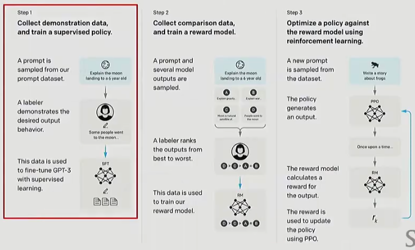

## 1. Post Training 三阶段

> 来源于 InstructGPT[[1]](#ref1)

1. 收集数据并训练**监督**策略
    - 从提示词数据集中采样一个提示词
    - 标注者对数据进行标注（该标注即为期望输出）
    - 该标注数据用于对 LLM 进行监督训练
2. 收集**对比数据**并训练**奖励模型**
    - 采样一个提示词及多个模型的输出
    - 标注者从“最好”到“最差”对这些输出进行排序
    - 该标注数据用于对奖励模型进行训练
3. 在**训练好的奖励模型**的加持下利用**强化学习**优化策略
    - 从数据集中采用一个新的提示词
    - 利用策略生成一个输出
    - 奖励模型计算输出的奖励分数（Reward）
    - 根据奖励分数利用 PPO 等强化学习方法对策略进行更新

---

## 2. SFT 数据集的构建

### 2.1. 数据集中的问题

> 来自 FLAN 数据集的一个例子:
>
> What is this text about? OPTIONS: - World - Sport - Business - Science/Tech

- 自然的对话一般不包含这样的选项

> 来自 OpenAssistant 的例子:
>
> Question: Can you write a short introduction about the relevance of the term"monopsony" in economics? Please use examples related to potential monopsonies in the labour market and cite relevant research.
>
> Answer: "Monopsony" refers to a market structure where there is only one buyer for a particular good or service. In economics, this term is particularly relevant in the labor market, where a monopsony employer has significant power over the wages and working conditions of their employees. [...]. Overall, the concept of monopsony is essential to understanding the dynamics of labor markets and the impact of market power on workers. Further research is needed to understand the extent and impact of monopsonies on the economy and to develop policies to address this issue. References: Bivens, J., & Mishel, L.(2013). The Pay of Corporate Executives and Financial Professionals as Evidence of Rents in Top 1 Percent Incomes. Journal of Economic Perspectives, 27(3), 57-78.

- 人类标注者很难撰写如此**长而详细**的答案
- 输出中的符号（甚至风格）如何抉择
- 是否输出**参考文献**
    - 如何输出准确的参考文献：我们往往希望模型能够输出更加严谨、学术的输出，因此我们会在数据集的回答中加入参考文献，但是模型可能只学到了“输出内容要加上参考文献”，这会导致模型产生幻觉（Hallucination）
- 是否输出**复杂的知识**
- 数据集的规模大小
- 数据集的安全问题
- 如何决定模型输出的长短：通过下图你可以发现，不同指令数据的输入和输出长度区别是很大的

---

### 2.2. SFT 数据集构建经验

1. SFT 在模型已经具备某些能力的前提下，通过数据来“抽取”这些能力的表现效果最好；但如果试图用 SFT 去“添加”模型原本不具备的新行为，往往效果不佳
2. 并不是所有事实正确的数据都会提升模型表现，有时即使是高质量的事实数据，也可能干扰模型已有的分布或对齐，反而让性能下降
3. 某些类型的数据（例如安全性、遵循指令、风格等）哪怕只有少量，也能对模型带来巨大提升，不过，模型的长尾行为（覆盖面广、稀疏分布的场景）则更依赖于大量数据来改善

---

### 2.3. 在预训练中使用指令微调（Instruction Tuning）

1. 在网页或预训练数据集上进行预训练
2. 将指令微调数据混入预训练中
3. 额外进行一个简短的指令微调

---

### 2.4. 'Midtraining' / 'Two-phase Training'

这种方案[[2]](#ref2)好似已被大部分 LLM 公司采纳（但没有详细的文档）：
- 在 Stable 阶段采用纯预训练数据集训练（如上图左侧所示）；
- 在 Decay 阶段采用预训练+指令微调混合数据集进行训练（如上图右侧所示）

---

## 3. RLHF（Reinforcement Learning with Human Feedback）

### 3.1. 从模仿（Imitation）到优化（optimization）

**模仿（Imitation，即SFT）**：根据一些参考分布 $p^\*(y|x)$ 调整模型的输出分布，使得输出分布 $\hat{p}(y|x) \approx p^\*(y|x)$

- 从纯生成建模的角度看，SFT 就是让生成模型学会模仿参考分布
- 训练需要来自参考策略的数据（比如人工标注的数据集），否则无法“模仿”

**优化（Optimization，即RLHF）**：不断调整输出分布$\hat{p}(y|x)$，使得 $\max\limits_{p} E_p[R(y,x)]$，其中 $R(y,x)$ 为奖励（Reward）

- 优化的不是抽象的“真实分布”，而是一个我们能定义并测量的奖励函数（在 RLHF 里，这个奖励函数来自人类反馈，比如人类排序、偏好比较，或者训练出的 reward model）
- 在这个阶段，我们不再把语言模型看作“近似真实分布$p^\*(y|x)$的模型”（像 SFT 那样），而是把它当作一个 **策略 policy**，用来最大化奖励信号

---

### 3.2. 需要RLHF的原因

1. **成本**：SFT 的成本非常高昂，尤其是标注成本
2. **G-V Gap (Generation-Value Gap)**：人们写的内容（生成分布 G）和 人们实际偏好的内容（价值模型 V 的视角）并不总是一致

> 在一项过去的实验[[3]](#ref3)中发现，一些标注者在对比自己写的摘要和模型写的摘要时，有时会更喜欢模型写的摘要，也就是说人类标注并不是最优的

---

### 3.3. 如何获得RLHF的数据

**方案一**：（在网页上）让模型输出 N 个结果，让标注者（用户）对结果进行排序
- 存在的问题：
  - 标注结果可能是**低质量的**、**不正确的**，甚至是用大预言模型生成的，这取决于标注者本身 
  - RLHF 标注者的分布会极大的影响模型的行为
  > 如果标注者中亚洲人多，则模型会倾向于输出亚洲风格的结果
  - 不同的标注者关注点不同
  > 有些标注者更关注格式，有些标注者更关注内容

**方案二**：使用大语言模型（如GPT-4）对模型（可以是多个不同的模型）输出的 N 个结果进行排序，我们常常称之为 AI Feedback

---

### 3.4. 实现RLHF的方法

#### 3.4.1. 人类反馈下的PPO（PPO with Human Feedback）

原始的PPO算法 = Policy Gradient + Off Policy，其优化目标为：

$$
\max L^{CLIP}(\theta) - \beta KL[\pi_\theta||\pi_{old}]
$$

其中$L^{CLIP}(\theta) = \mathbb{E}_t \Big[ \min \big( r_t(\theta) \hat{A}_t,\; \text{clip}(r_t(\theta), 1-\epsilon, 1+\epsilon)\hat{A}_t \big) \Big]$，

其中$r_t(\theta) = \frac{\pi_\theta(a_t \mid s_t)}{\pi_{\theta_{\text{old}}}(a_t \mid s_t)}$，

人类反馈下的PPO的优化目标为：

$$
L^{RLHF}(\theta) = \mathbb{E}\_{x \sim D, y \sim \pi} [ r(x,y) ] - \beta D\_{KL} \left[ \pi(y|x) || \pi_{\text{ref}}(y|x) \right]
$$

其中，
- $r(x,y)$：是奖励模型对输出$y$在输入$x$下的奖励评分
- $\pi(y∣x)$：是当前训练的策略（即RLHF中训练的模型），表示在输入$x$下生成$y$的概率分布
- $\pi_{\text{ref}}(y∣x)$：是参考策略，通常是一个冻结的 SFT 模型，用于对比当前模型的生成结果，保证不会过度偏离基准模型
- $D_{KL} \left[ \pi(y|x) || \pi_{\text{ref}}(y|x) \right]$：是当前策略与参考策略之间的 KL 散度，用于约束新策略不能偏离参考策略太远

**问题一**：为什么传统PPO中优化$\mathbb{E}_t [r_t(\theta) \hat{A}_t]$，而RLHF优化$\mathbb{E}\_{x, y} [ r(x,y) ]$？
- 在传统的强化学习任务中，我们往往会从**离线**策略中获得优势函数$\hat{A}_t$，因此优化目标为$\max \mathbb{E}_t [r_t(\theta) \hat{A}_t]$
- 在LLM基于人类反馈的强化学习任务，我们选择利用奖励模型（Reward model）直接对**在线**的LLM的输出进行打分，因此无需使用$r_t(\theta)$进行重要性采样修正

**问题二**：传统PPO中的$\pi\_{old}$和RLHF PPO中的$\pi\_{\text{ref}}$有什么区别？
- $\pi\_{old}$：上一次迭代的策略，用于收集数据和做重要性采样，会不断更新，通常就是“前一版策略”
- $\pi\_{\text{ref}}$：一个固定的参考策略，一般是 SFT（监督微调模型），也就是在 RLHF 训练前冻结的模型，不会更新

---

#### 3.4.2. DPO

DPO训练目标与PPO一致：

$$
\max L^{RLHF}(\theta) = \mathbb{E}\_{x \sim D, y \sim \pi} [ r(x,y) ] - \beta D\_{KL} \left[ \pi(y|x) || \pi_{\text{ref}}(y|x) \right]
$$

由该优化目标可得最优Policy为：

$$
\pi(y|x) = \frac{1}{Z(x)}\pi\_{\text{ref}}(y|x)\exp(\frac{1}{\beta}r(x,y))
$$

其中，$Z(x) = \sum\limits\_y \pi\_{\text{ref}}(y|x)\exp(\frac{1}{\beta}r(x,y))$

  
点击展开公式推导

  $$
  \begin{align}
  &\max\limits\_\pi \mathbb{E}\_{x \sim D, y \sim \pi} [ r(x,y) ] - \beta D\_{KL} \left[ \pi(y|x) || \pi\_{\text{ref}}(y|x) \right] \\\\
   = &\max\limits\_\pi \mathbb{E}\_{x \sim D, y \sim \pi} [ r(x,y) ] -  \mathbb{E}\_{x \sim D, y \sim \pi} [ \beta \log \frac{\pi(y|x)}{\pi\_{\text{ref}}(y|x)} ] \\\\
   = &\max\limits\_\pi \mathbb{E}\_{x \sim D, y \sim \pi} [ r(x,y) - \beta \log \frac{\pi(y|x)}{\pi\_{\text{ref}}(y|x)} ] \\\\
   = &\min\limits\_\pi \mathbb{E}\_{x \sim D, y \sim \pi} [ \beta \log \frac{\pi(y|x)}{\pi\_{\text{ref}}(y|x)} - r(x,y) ] \\\\
   = &\min\limits\_\pi \mathbb{E}\_{x \sim D, y \sim \pi} [ \log \frac{\pi(y|x)}{\pi\_{\text{ref}}(y|x)} - \log \exp(\frac{1}{\beta}r(x,y)) ] \\\\
   = &\min\limits\_\pi \mathbb{E}\_{x \sim D, y \sim \pi} [ \log \frac{\pi(y|x)}{\pi\_{\text{ref}}(y|x)\exp(\frac{1}{\beta}r(x,y))}] \\\\
   = &\min\limits\_\pi \mathbb{E}\_{x \sim D, y \sim \pi} [ \log \frac{\pi(y|x)}{\pi\_{\text{ref}}(y|x)\exp(\frac{1}{\beta}r(x,y))\frac{1}{Z(x)} Z(x)}] \\\\
   = &\min\limits\_\pi \mathbb{E}\_{x \sim D, y \sim \pi} [ \log \frac{\pi(y|x)}{\frac{1}{Z(x)}\pi\_{\text{ref}}(y|x)\exp(\frac{1}{\beta}r(x,y))} - \log Z(x)] \\\\
   \end{align}
  $$

  其中$Z(x) = \sum\limits\_y \pi\_{\text{ref}}(y|x)\exp(\frac{1}{\beta}r(x,y))$，
  
  令$\pi^\star(y|x) = \frac{1}{Z(x)}\pi\_{\text{ref}}(y|x)\exp(\frac{1}{\beta}r(x,y)) = \frac{\pi\_{\text{ref}}(y|x)\exp(\frac{1}{\beta}r(x,y))}{\sum\limits\_y \pi\_{\text{ref}}(y|x)\exp(\frac{1}{\beta}r(x,y))}$，则有

  $$
  \begin{align}
    &\min\limits\_\pi \mathbb{E}\_{x \sim D, y \sim \pi} [ \log \frac{\pi(y|x)}{\frac{1}{Z(x)}\pi\_{\text{ref}}(y|x)\exp(\frac{1}{\beta}r(x,y))} - \log Z(x)] \\\\
    = &\min\limits\_\pi \mathbb{E}\_{x \sim D, y \sim \pi} [ \log \frac{\pi(y|x)}{\pi^\star(y|x)} - \log Z(x)] \\\\
    = &\min\limits\_\pi \mathbb{E}\_{x \sim D, y \sim \pi} [ \log \frac{\pi(y|x)}{\pi^\star(y|x)}] \\\\
    = &\min\limits\_\pi \mathbb{E}\_{x \sim D, y \sim \pi} [D\_{KL} (\pi(y|x) || \pi^\star(y|x))] \\\\
   \end{align}
  $$

  最优解为$\pi(y|x) = \pi^\star(y|x) = \frac{1}{Z(x)}\pi\_{\text{ref}}(y|x)\exp(\frac{1}{\beta}r(x,y))$
  

将最优policy带入Bradley-Terry模型建模的最大似然估计中，即可得到DPO损失函数为：

$$
Loss\_{DPO} = - \ln \sigma \left( \beta \ln \frac{\pi(y^+ \mid x)}{\pi\_{ref}(y^+ \mid x)} - \beta \ln \frac{\pi(y^- \mid x)}{\pi\_{ref}(y^- \mid x)} \right)
$$

其中$y^+$：是 人类偏好（或高质量的生成样本），是被标注为“更优”的样本，$y^-$：是 负偏好（或低质量的生成样本），是被标注为“较差”的样本

  
点击展开Bradley-Terry模型简介

  **Bradley-Terry模型**：
  
  $$
  P(i>j) = \frac{\alpha\_i}{\alpha\_i + \alpha\_j}
  $$
  
  $P(i>j)$表示第$i$个元素战胜第$j$个元素的概率，一般的loss函数为

  $$
  Loss = -\mathbb{E}\_{(\alpha\_x, \alpha\_y) \sim D} [ \ln  \frac{\alpha\_i}{\alpha\_i + \alpha\_j}]
  $$

  **大模型中的Bradley-Terry模型**：

  $$
  P(y\_1>y\_2) = \frac{r(x,y\_1)}{r(x,y\_1) + r(x,y\_2)}
  $$

  其中$x$为输入的prompt，$y$为输出，$r(x,y)$为奖励得分，为防止$r(x,y)$为负数，加入指数函数：

  $$
  P(y\_1>y\_2) = \frac{\exp(r(x,y\_1))}{\exp(r(x,y\_1)) + \exp(r(x,y\_2))}
  $$

  其Loss为

  $$
  \begin{align}
  \text{Loss} &= - \mathbb{E}\_{(x, y^+, y^-) \sim D} [ \ln ( \frac{\exp(r(x, y^+))}{\exp(r(x, y^+)) + \exp(r(x, y^-))} ) ] \\\\
  &= - \mathbb{E}\_{(x, y^+, y^-) \sim D} [ \ln ( \frac{1}{1 + \exp(r(x, y^-)) - r(x, y^+)}    ) ] \\\\
  &= - \mathbb{E}_{(x, y^+, y^-) \sim D} [ \ln \sigma ( r(x, y^+) - r(x, y^-) ) ]
  \end{align}
  $$

  其中$\sigma (x) = \frac{1}{1+\exp(-x)}$为sigmoid函数

  
点击展开公式推导

  $$
  \begin{align}
  &\pi(y \mid x) = \frac{1}{Z(x)} \pi\_{ref}(y \mid x) \exp( \frac{1}{\beta} r(x, y)) \\\\
  \Rightarrow &\exp( \frac{1}{\beta} r(x, y) ) = \frac{\pi(y \mid x)}{\pi\_{ref}(y \mid x)} Z(x) \\\\
  \Rightarrow &r(x, y) = \beta \ln ( \frac{\pi(y \mid x)}{\pi\_{ref}(y \mid x)} Z(x) ) \\\\
  \Rightarrow &r(x, y) = \beta \ln ( \frac{\pi(y \mid x)}{\pi\_{ref}(y \mid x)} ) + \beta \ln Z(x) \\\\
  \end{align}
  $$

  将奖励评分送入Bradley-Terry模型得到：

  $$
  \begin{align}
  Loss & = - \ln \sigma ( r(x, y^+) - r(x, y^-) ) \\\\
  & = - \ln \sigma (\beta \ln ( \frac{\pi(y^+ \mid x)}{\pi\_{ref}(y^+ \mid x)} ) + \beta \ln Z(x) - \beta \ln ( \frac{\pi(y^- \mid x)}{\pi\_{ref}(y^- \mid x)} ) - \beta \ln Z(x)) \\\\
  & = - \ln \sigma (\beta \ln ( \frac{\pi(y^+ \mid x)}{\pi\_{ref}(y^+ \mid x)} ) - \beta \ln ( \frac{\pi(y^- \mid x)}{\pi\_{ref}(y^- \mid x)} ))
  \end{align}
  $$

---

  
参考文献

  <ol>
    <li id="ref1"><a href="https://proceedings.neurips.cc/paper_files/paper/2022/file/b1efde53be364a73914f58805a001731-Paper-Conference.pdf" target="_blank">Ouyang L, Wu J, Jiang X, et al. Training language models to follow instructions with human feedback[J]. Advances in neural information processing systems, 2022, 35: 27730-27744.</a></li>
    <li id="ref2"><a href="https://arxiv.org/pdf/2404.06395" target="_blank">Hu S, Tu Y, Han X, et al. Minicpm: Unveiling the potential of small language models with scalable training strategies[J]. arXiv preprint arXiv:2404.06395, 2024.</a></li>
    <li id="ref3"><a href="https://watermark02.silverchair.com/tacl_a_00632.pdf?token=AQECAHi208BE49Ooan9kkhW_Ercy7Dm3ZL_9Cf3qfKAc485ysgAAA0kwggNFBgkqhkiG9w0BBwagggM2MIIDMgIBADCCAysGCSqGSIb3DQEHATAeBglghkgBZQMEAS4wEQQM56gOdOIymzmdZk7SAgEQgIIC_MoTKqHYldlrb721Q5h2KffVo_kOA5sAdAk6Iko4Wu_cYFNYwzooRlN4Vmg64QkEP1rbgfQi1FVMWnNzCPbYCyhxpMlFcYX6bAPaLSTZiI3kUweSL5mPGPsGGycoEX1MAF5i4yKnT4pM7UKL5izeIaflqaWa-Rzo0cqhI66vUbfbp5WQILP2RQOA5qNoLUFbXtLx0TUgxuo-HaFfh3L3IEi1f3Loyj2-UJw4V7Dr7DYCf39XXfICpALlzjoTlJ_3s5YqMcbKn-9my4-DVh4EjU4QenszgsYc2GuHAXE23nUeFGfX93vMXESnP8mwRkVuKuaGodxiW-SZnO4jEQfAv8qH692lrJmkq9iT_WIvHE__hJQtIVr6cZgY9fXGrBzGmK6Hkz79PyMaAK5VglXB-dqB9JrQJQzXdjoIV4qmCKzVGOwYtT5qOOtoNPzHOTaBseERNSMMJw4Jq8t8S4-8GbFfmUcBdQrgs2HM5uYn2igRj_F-xMyRVe5y-jl8s_0Q8dFfliXCESTTI8p0NIqqz0uCY7iB64TemqFVEtR8M1FNbbJ82bhBAKg1zoJtG8hC3pIiQiXawsZzd9oFbx0GFwDdbvbYETEp5R3sJQ8wT1Ra2WhCPicvfSWgdC2EZRCWM4NvUZhsnpBfvZ4DlaE6xWma0u1x_rzrkfabjJcPnbC05EaF9dfx5pJ-X5uPnb1bDyIZQ5zyoueKtaPZzQVtP0mSH7qozQLRLR6UsdHH1RexlpnBOUyYtQtU50Xs0rySHvuWDYaeMICgOQwYGl8heOYlIUzexCgVvyuJz3c2HgwbUxQI3eAH05D74ApGpnaqKy1QNqQJKKXxIZ8QmpQYC4vnKBes20kXjILZYtSzqB6QZOHtfQNee_NTb3E3Q8cJANsOVBZeiIub1HggCbXtfvFmu1R9sTZDQCOrT_U-ABpM1ANqxk32Ty81QZjlj0A8vKh_wFqmoCff8IWI2kb0srnEyK0wt7gzw5fX1cbFfM7d53Y5T9eg_8t857NX" target="_blank">Zhang T, Ladhak F, Durmus E, et al. Benchmarking large language models for news summarization[J]. Transactions of the Association for Computational Linguistics, 2024, 12: 39-57.</a></li>
  </ol>

