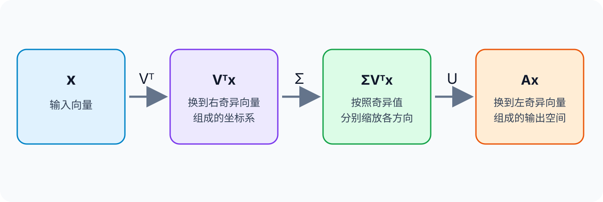

Singular value decomposition (SVD) is a matrix factorization that represents any matrix as three matrices with simple structures:

\[
A=U\Sigma V^\top.
\]

## 1. Viewing a Matrix as a Linear Transformation

Let

\[
A\in\mathbb{R}^{m\times n},
\qquad
x\in\mathbb{R}^{n}.
\]

Then

\[
y=Ax
\]

means that \(A\) maps an \(n\)-dimensional input to an \(m\)-dimensional output. This transformation may combine rotations, reflections, and scaling along different directions, so its geometric effect is often difficult to see directly from \(A\).

SVD separates this process into three steps:

1. \(V^\top\) changes the input to a special set of orthogonal coordinate axes;
2. \(\Sigma\) scales each coordinate axis independently;
3. \(U\) expresses the scaled result in the output-space coordinates.

<figure>
  
  <figcaption>Read \(A=U\Sigma V^\top\) from right to left: \(V^\top\) changes the input coordinates, \(\Sigma\) scales them, and \(U\) maps them into the output space.</figcaption>
</figure>

## 2. Singular Vectors and Singular Values

SVD can also be written as

\[
A=\sum_{i=1}^{r}\sigma_i u_i v_i^\top,
\]

where \(r=\operatorname{rank}(A)\) and

\[
\sigma_1\geq\sigma_2\geq\cdots\geq\sigma_r>0.
\]

Here:

- \(v_i\) is the \(i\)-th right singular vector, representing a direction in the input space;
- \(u_i\) is the \(i\)-th left singular vector, representing the corresponding output direction;
- \(\sigma_i\) is the \(i\)-th singular value, representing the amount of scaling along that direction.

Their most intuitive relationship is

\[
Av_i=\sigma_i u_i.
\]

When the input lies along \(v_i\), the matrix maps it to the direction \(u_i\) and scales its length by \(\sigma_i\).

For example,

\[
A=
\begin{bmatrix}
3&0\\
0&1
\end{bmatrix}
\]

scales the horizontal direction by 3 and leaves the vertical direction unchanged. Its singular values are therefore \(3\) and \(1\). A general matrix simply adds coordinate transformations before and after this scaling.

## 3. Relationship to Eigendecomposition

Eigendecomposition generally requires a square matrix, while SVD applies to any rectangular matrix.

The right singular vectors are eigenvectors of \(A^\top A\):

\[
A^\top A v_i=\sigma_i^2v_i.
\]

The eigenvalues of \(A^\top A\) are therefore \(\sigma_i^2\), and the singular values are their nonnegative square roots. Once \(v_i\) is known, the corresponding left singular vector is

\[
u_i=\frac{Av_i}{\sigma_i}.
\]

This also explains why singular values are nonnegative and why the left and right singular vectors describe the output and input spaces, respectively.

## 4. Computing the SVD

Every real matrix

\[
A\in\mathbb{R}^{m\times n}
\]

has a singular value decomposition

\[
A=U\Sigma V^\top.
\]

The matrix \(A\) need not be square or invertible. Rectangular, rank-deficient, and zero matrices all admit an SVD; insufficient rank simply produces zero singular values. Complex matrices also have an SVD, with the ordinary transpose \(V^\top\) replaced by the conjugate transpose \(V^*\).

Mathematically, the SVD can be derived through the following steps.

### 4.1 Compute \(A^\top A\)

First construct

\[
A^\top A\in\mathbb{R}^{n\times n}.
\]

This matrix is symmetric and positive semidefinite, so all its eigenvalues are nonnegative and it has an orthonormal set of eigenvectors.

### 4.2 Find the Right Singular Vectors and Singular Values

Eigendecompose \(A^\top A\):

\[
A^\top A v_i=\lambda_i v_i.
\]

Sort the eigenvalues in descending order. The unit eigenvectors \(v_i\) are the right singular vectors, and the singular values are

\[
\sigma_i=\sqrt{\lambda_i}.
\]

Placing the \(v_i\) vectors in columns gives \(V\); placing the singular values on the diagonal gives \(\Sigma\).

### 4.3 Find the Left Singular Vectors

For every nonzero singular value \(\sigma_i\), compute

\[
u_i=\frac{Av_i}{\sigma_i}.
\]

Placing these vectors in columns gives the part of \(U\) corresponding to nonzero singular values.

For a full SVD, add unit vectors orthogonal to the existing \(u_i\) for the zero singular values so that \(U\) forms a complete orthonormal basis of the output space.

### 4.4 Assemble the Factorization

Finally, combine the three matrices:

\[
A=U\Sigma V^\top.
\]

The full derivation can be summarized as

```text
A
→ compute AᵀA
→ find the eigenvalues and eigenvectors of AᵀA
→ set σᵢ = √λᵢ to obtain Σ and V
→ set uᵢ = Avᵢ / σᵢ to obtain U
→ A = UΣVᵀ
```

<details>
<summary><strong>A Simple Example</strong></summary>

Consider

\[
A=
\begin{bmatrix}
1&1\\
0&0
\end{bmatrix}.
\]

First compute

\[
A^\top A=
\begin{bmatrix}
1&1\\
1&1
\end{bmatrix}.
\]

Its eigenvalues are \(\lambda_1=2\) and \(\lambda_2=0\), with unit eigenvectors

\[
v_1=\frac{1}{\sqrt{2}}
\begin{bmatrix}1\\1\end{bmatrix},
\qquad
v_2=\frac{1}{\sqrt{2}}
\begin{bmatrix}1\\-1\end{bmatrix}.
\]

The singular values are therefore

\[
\sigma_1=\sqrt{2},
\qquad
\sigma_2=0.
\]

For the nonzero singular value, the left singular vector is

\[
\begin{aligned}
u_1
&=\frac{Av_1}{\sigma_1}\\
&=\begin{bmatrix}1\\0\end{bmatrix}.
\end{aligned}
\]

Choose another unit vector orthogonal to \(u_1\):

\[
u_2=
\begin{bmatrix}0\\1\end{bmatrix}.
\]

This gives

\[
U=
\begin{bmatrix}
1&0\\
0&1
\end{bmatrix},
\qquad
\Sigma=
\begin{bmatrix}
\sqrt{2}&0\\
0&0
\end{bmatrix},
\]

\[
V=\frac{1}{\sqrt{2}}
\begin{bmatrix}
1&1\\
1&-1
\end{bmatrix}.
\]

Multiplying the factors reconstructs the original matrix:

\[
\begin{aligned}
U\Sigma V^\top
&=\begin{bmatrix}
1&1\\
0&0
\end{bmatrix}\\
&=A.
\end{aligned}
\]

</details>

### 4.5 Numerical Libraries Use More Stable Algorithms

The derivation through \(A^\top A\) is useful for understanding SVD, but numerical libraries usually do not construct \(A^\top A\) explicitly because

\[
\kappa(A^\top A)=\kappa(A)^2,
\]

where \(\kappa\) is the condition number. Explicitly forming \(A^\top A\) amplifies numerical errors, especially for smaller singular values.

Practical implementations usually reduce the matrix to bidiagonal form and then compute the singular values using QR iteration, divide-and-conquer methods, or other stable algorithms. Libraries such as NumPy and PyTorch delegate these details to their underlying linear algebra libraries.

## 5. Full and Compact SVD

For

\[
A\in\mathbb{R}^{m\times n},
\]

the factors in a full SVD have shapes

\[
U\in\mathbb{R}^{m\times m},
\qquad
\Sigma\in\mathbb{R}^{m\times n},
\qquad
V\in\mathbb{R}^{n\times n}.
\]

Both \(U\) and \(V\) are orthogonal matrices:

\[
U^\top U=I,
\qquad
V^\top V=I.
\]

If \(A\) has rank \(r\), only \(r\) singular values are nonzero. Removing the columns associated only with zero singular values gives the compact SVD:

\[
A=U_r\Sigma_rV_r^\top,
\]

where

\[
U_r\in\mathbb{R}^{m\times r},
\qquad
\Sigma_r\in\mathbb{R}^{r\times r},
\qquad
V_r\in\mathbb{R}^{n\times r}.
\]

The compact SVD still reconstructs \(A\) exactly. It omits only the redundant components associated with zero singular values and does not discard information from the matrix.

## 6. Summary

- Every matrix can be factorized as \(A=U\Sigma V^\top\).
- \(Av_i=\sigma_i u_i\): \(v_i\) is an input direction, \(u_i\) is the output direction, and \(\sigma_i\) is the scaling magnitude.
- The compact SVD removes only components associated with zero singular values and still reconstructs the original matrix exactly.

## References

[1] G. H. Golub and W. Kahan. Calculating the Singular Values and Pseudo-Inverse of a Matrix. [Online]. Available: https://epubs.siam.org/doi/10.1137/0702016

[2] G. H. Golub and C. F. Van Loan. Matrix Computations. [Online]. Available: https://jhupbooks.press.jhu.edu/title/matrix-computations
