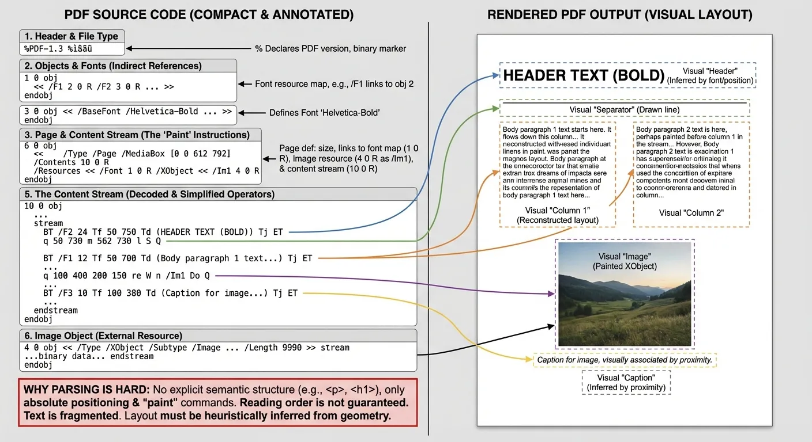
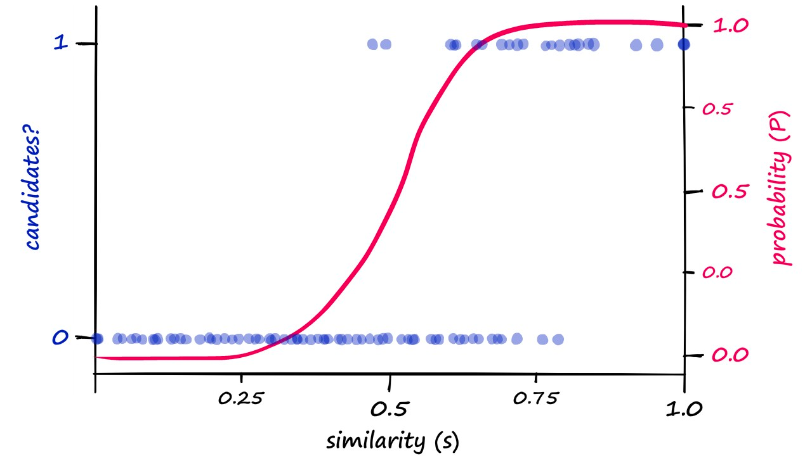
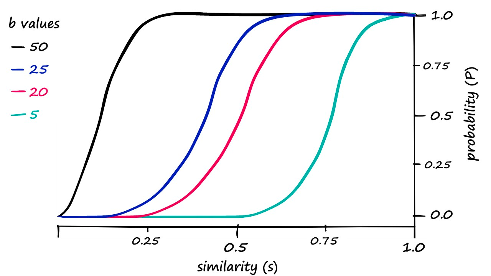
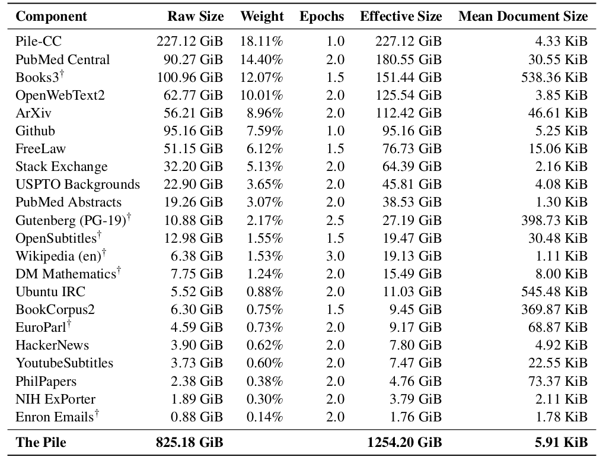
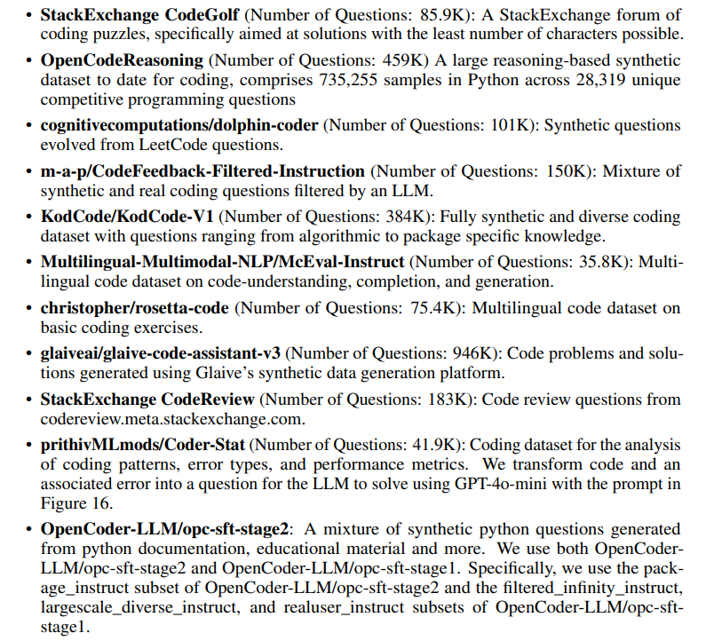
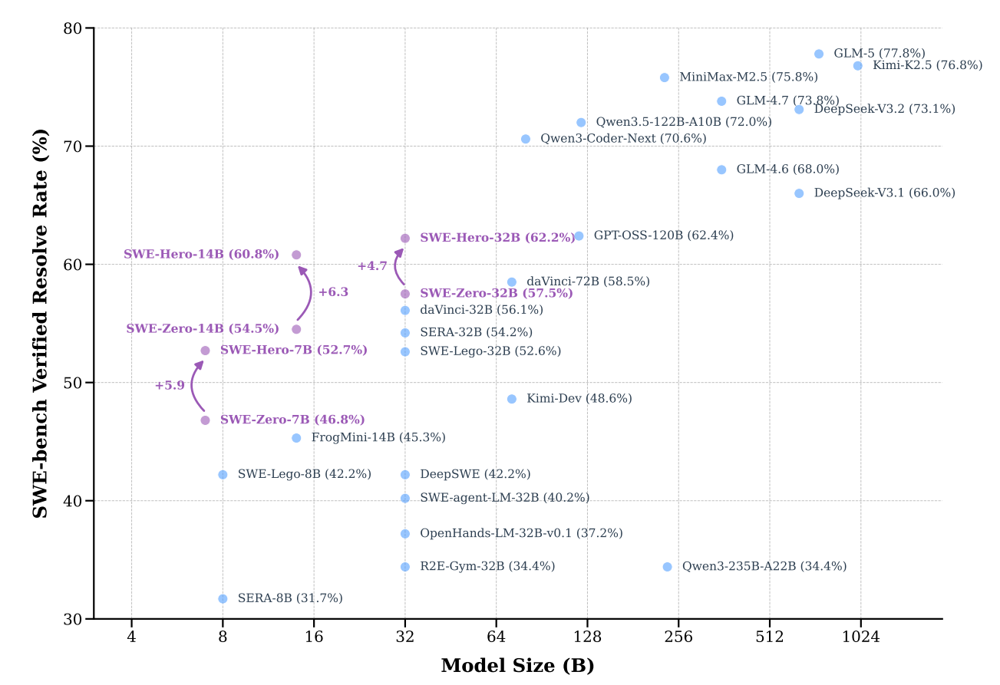

This lecture answers what to do with the raw data once you have it, in two parts:

- **Data pipeline**: transformation, filtering, deduplication, mixing. Raw corpora must pass through these four stages in order to become high-quality, low-redundancy pretraining data mixed in the right proportions;
- **Synthetic data**: for the mid-training and SFT (supervised fine-tuning) stages, using model-generated data to supplement the training signal.

## 1. Transformation: Turning Raw Formats into Plain Text

Raw data does not come as plain text: web pages are HTML, papers are PDFs (arXiv), and code is repository directories. Transformation is the first stage of the data pipeline, extracting trainable text from these formats.

### 1.1 HTML to Text: Remove Boilerplate, Extraction Choice Affects Downstream Accuracy

The most common transformation is HTML to text:

- Remove boilerplate (navigation bars, ads, etc.) and keep only the content;
- Images and tables are either dropped or transcribed into words. The transformation is inherently lossy, linearizing a two-dimensional layout into a text stream;
- Common rule-based tools: [trafilatura](https://trafilatura.readthedocs.io/en/latest/), [resiliparse](https://resiliparse.chatnoir.eu/en/stable/), [jusText](https://pypi.org/project/jusText/), [lynx](https://lynx.invisible-island.net/), etc.;
- Accuracy matters: the extraction method directly affects downstream accuracy, as [DataComp-LM](https://arxiv.org/abs/2406.11794) systematically compared.

<figure>
  
  <figcaption>DataComp-LM compares text extraction methods: Common Crawl's built-in WET text (12.2–12.5) scores well below trafilatura and resiliparse (13.4–24.5). Source: <a href="https://arxiv.org/abs/2406.11794">DataComp-LM paper</a>.</figcaption>
</figure>

### 1.2 PDF to Text: FinePDFs' Recrawling, OCR, and Cleaning Pipeline

PDFs are much harder than HTML: HTML has a clean tag tree, but a PDF is just drawing commands — "put this glyph here, draw that line there" — visually faithful but without semantic structure. The [FinePDFs](https://huggingface.co/spaces/HuggingFaceFW/FinePDFsBlog) pipeline starts from PDFs in Common Crawl:

- Recrawl truncated PDFs (PDFs are large, so crawler downloads are often incomplete);
- OCR with a VLM (RolmOCR), or extract text with [Docling](https://github.com/docling-project/docling);
- Followed by lots of cleanup and filtering;
- Limitation: much layout information is lost in the conversion.

<figure>
  
  <figcaption>The anatomy of a PDF: source structure (left) versus visual layout (right). PDFs preserve appearance rather than structure; the gap between the two is the missing semantic information. Source: <a href="https://huggingface.co/spaces/HuggingFaceFW/FinePDFsBlog">FinePDFs blog</a>.</figcaption>
</figure>

## 2. Filtering: Picking Out the Raw Data Similar to Target Data

### 2.1 Problem Definition: Target Data T and Raw Data R

The algorithmic building block of filtering: given some target data T and lots of raw data R, find a subset T' of R that is similar to T.

<figure>
  
  <figcaption>The filtering framework: given target data T and raw data R, find a subset T' of R that is similar to T. Source: CS336 Lecture 14 slides.</figcaption>
</figure>

### 2.2 Three Applications and Two Desiderata

Filtering has three typical applications:

- Language identification: English versus the rest;
- Quality filtering: high quality versus low quality;
- Toxicity filtering: non-toxic versus toxic.

A filtering algorithm should satisfy two desiderata:

1. Generalize from the target data: we want T' to differ from T, not copy T itself;
2. Be extremely fast: it must run over R, which is huge.

See [Albalak et al.'s 2024 survey](https://arxiv.org/abs/2402.16827) on data selection.

### 2.3 General Framework: Scoring Functions and Two Kinds of Scorers

The general framework has two steps: estimate a model from R and T to derive a scoring function, then keep examples in R based on their score. Two kinds of scorers:

- Generative model of T (KenLM): \(score(x) = p_T(x)\), scoring text with a language model trained on the target data;
- Simple classifier (fastText): \(score(x) = p(T \mid x)\), training a classifier to predict the probability that text belongs to T.

In use, keep examples whose \(score(x)\) meets a threshold; keeping can be stochastic (GPT-3 below is one example).

Model-based filtering is not universal: C4, Gopher, RefinedWeb, FineWeb, and Dolma deliberately avoid it; GPT-3, LLaMA, and DCLM use it (and it is becoming the norm).

### 2.4 Language Identification: The fastText Classifier and Dolma's Threshold

The goal is to find text in a specific language (e.g., English). The commonly used [fastText language identification](https://fasttext.cc/docs/en/language-identification.html) is an off-the-shelf classifier: it supports 176 languages and was trained on multilingual websites — Wikipedia, Tatoeba (a translation site), and SETimes (Southeast European news). [Dolma](https://arxiv.org/abs/2402.00159) keeps pages with p(English) ≥ 0.5.

### 2.5 Quality Filtering: OpenWebMath, GPT-3, LLaMA, phi-1

**OpenWebMath** ([Paster et al. 2023](https://arxiv.org/abs/2310.06786)) aims to curate a large corpus of mathematical text from Common Crawl, combining rules with two model-based filtering stages:

- Filter with rules first (e.g., containing LaTeX commands);
- Then score with a KenLM trained on ProofPile, removing documents with perplexity above 15000;
- Finally, a fastText classifier predicts the probability that a document is mathematical writing: documents where LaTeX equations were extracted are kept when the probability exceeds 0.17; documents without LaTeX equations require a probability above 0.8.

> Result: OpenWebMath produced 14.7B tokens; the 1.4B model trained on it outperforms models trained on more than 20× the tokens.

**GPT-3** ([Brown et al. 2020](https://arxiv.org/abs/2005.14165), Appendix A) trains a linear classifier on word features ([Spark's tokenizer](https://spark.apache.org/docs/latest/ml-features#tokenizer)):

- Positives: samples from {Wikipedia, WebText2, Books1, Books2};
- Negatives: samples from Common Crawl;
- Documents are kept stochastically according to their score:

```python
def keep_document(score: float) -> bool:
    return np.random.pareto(9) > 1 - score
```

**LLaMA / RedPajama** ([Touvron et al. 2023](https://arxiv.org/abs/2302.13971)) is simpler: positives are pages referenced by Wikipedia, negatives come from Common Crawl, and only documents classified as positive are kept.

**phi-1** ([Gunasekar et al. 2023](https://arxiv.org/abs/2306.11644)) aims for really high-quality data (textbook-level) for a small model (1.5B); its data includes synthetic data from GPT-3.5 (later GPT-4) and filtered data. The filtering pipeline:

1. Raw data R = the Python subset of The Stack;
2. Use GPT-4 with the prompt "determine its educational value for a student whose goal is to learn basic coding concepts" to classify a 100K subset of R, obtaining positive examples T;
3. Train a random forest classifier on the output embeddings of a pretrained CodeGen model;
4. Select data from R that the classifier labels positive.

On [HumanEval](https://huggingface.co/datasets/openai_humaneval), the 1.3B model trained on the filtered subset reaches higher accuracy in fewer steps:

| Training data | Steps | HumanEval accuracy |
|---|---|---|
| Python subset of The Stack | 96K | 12.19% |
| phi-1 filtered subset | 36K | 17.68% |

### 2.6 Toxicity Filtering: Dolma and the Jigsaw Dataset

[Dolma](https://arxiv.org/abs/2402.00159) filters toxicity using the [Jigsaw Toxic Comments dataset](https://www.kaggle.com/datasets/julian3833/jigsaw-toxic-comment-classification-challenge) (2018). The dataset comes from the [Jigsaw Toxic Comment Classification competition](https://www.kaggle.com/competitions/jigsaw-toxic-comment-classification-challenge), whose goal is to help people have better discussions online; it consists of comments from Wikipedia talk pages annotated with six labels — toxic, severe_toxic, obscene, threat, insult, identity_hate.

### 2.7 Filtering Thresholds Depend on Training Duration: No Single Optimum

There is no single optimal filtering threshold; it depends on how long you train:

- Training longer: want more (lower quality) data;
- Training shorter: want less (higher quality) data.

<figure>
  
  <figcaption>Scale-dependent effects of filtering: the optimal filtering strength differs with training duration. Source: CS336 Lecture 14 slides.</figcaption>
</figure>

### 2.8 Summary: The Filtering Recipe

- Filtering is critical for building a good model;
- The recipe: define the target data (what "good" looks like), then extrapolate to raw data.

## 3. Deduplication: Definition, Motivation, and Design Space

### 3.1 Two Types of Duplicates: Exact and Near

Duplicates come in two types:

- Exact duplicates: identical copies, such as mirror sites and GitHub forks (the [Gutenberg mirror list](https://www.gutenberg.org/MIRRORS.ALL) is a ready-made example);
- Near duplicates: the same text differing by a few tokens.

Typical examples of near duplicates:

- Terms of service and licenses (e.g., the [MIT license](https://opensource.org/license/mit));
- Formulaic writing (copy/pasted or generated from a template);
- Minor formatting differences from copy/pasting.

<figure>
  
  <figcaption>Examples of near duplicates (Table 1 of the paper): documents identical except for templated fields (last row), a typical form of formulaic writing. Source: <a href="https://arxiv.org/abs/2107.06499">Lee et al. 2021</a>.</figcaption>
</figure>

An extreme case from C4: a product description repeated 61,036 times verbatim in C4:

> "by combining fantastic ideas, interesting arrangements, and follow the current trends in the field of that make you more inspired and give artistic touches. We'd be honored if you can apply some or all of these design in your wedding. believe me, brilliant ideas would be perfect if it can be applied in real and make the people around you amazed!"

([Example product page](https://www.amazon.co.uk/suryagede-100-Graffiti-Gas-Mask/dp/B07CRHT3RG))

### 3.2 Why Deduplicate: More Efficient Training, Less Memorization

Deduplicating training data makes language models better ([Lee et al. 2021](https://arxiv.org/abs/2107.06499)):

- Train more efficiently: fewer tokens;
- Avoid memorization: mitigating copyright and privacy concerns.

### 3.3 Design Space: Unit, Matching, and Action

Deduplication has three design choices:

1. What is an item: a sentence, a paragraph, or a document?
2. How to match: exact match, existence of a common subitem, or the fraction of common subitems?
3. What action to take: remove all, or remove all but one?

### 3.4 Key Challenge: Pairwise Comparison Needs Linear-Time Algorithms

- Deduplication is fundamentally about comparing items to other items;
- Scaling to massive data requires linear-time algorithms.

### 3.5 Hash Functions: Trading Collision Risk for Speed

A hash function h maps an item to a hash value (an integer or string) much smaller than the item itself; different items may map to the same value, a hash collision: h(x) = h(y) for x ≠ y.

There is a tradeoff between efficiency and collision resistance ([discussion](https://softwareengineering.stackexchange.com/questions/49550/which-hashing-algorithm-is-best-for-uniqueness-and-speed)):

- Cryptographic hash functions (e.g., SHA-256): collision resistant but slow (used in Bitcoin);
- DJB2, MurmurHash, CityHash: not collision resistant but fast (used for hash tables).

This lecture uses MurmurHash; for example, `mmh3.hash("hello")` evaluates to 613153351.

#### 3.5.1 Exact Deduplication: Hash Groups, Keep One per Group

The simplest case: the item is the whole string, matching is exact, and only one copy of each duplicate is kept.

```python
items = ["Hello!", "hello", "hello there", "hello", "hi", "bye"]
hash_items = itertools.groupby(sorted(items, key=mmh3.hash), key=mmh3.hash)
deduped_items = [next(group) for h, group in hash_items]
```

Implementation: sort by hash, group items with the same hash, and take one per group — the two "hello"s collapse into one, leaving 5 of the 6 items.

- Pro: simple, clear semantics, high precision;
- Con: does not deduplicate near duplicates;
- The code is written in a MapReduce way, so it is easy to parallelize and scale.

[C4](https://arxiv.org/abs/1910.10683) follows the same idea, but with 3-sentence spans as the item, exact matching, and keeping only one copy of each duplicated span. Warning: when a 3-sentence span is removed from the middle of a document, the resulting document might not be coherent.

#### 3.5.2 Jaccard Similarity and MinHash: Collision Probability Equals Similarity

Detecting near duplicates needs a similarity measure: the Jaccard similarity.

\[ Jaccard(A, B) = \frac{|A \cap B|}{|A \cup B|} \]

Example: A = {1, 2, 3, 4}, B = {1, 2, 3, 5}: intersection 3, union 5, Jaccard = 0.6.

Definition: two documents are near duplicates if their Jaccard similarity is at least a threshold.

Algorithmic challenge: find near duplicates in linear time.

**MinHash** is a random hash function h such that Pr[h(A) = h(B)] = Jaccard(A, B). Normally you want different items to hash to different values — here, the opposite: the collision probability should depend on similarity.

```python
def minhash(S: set[str], seed: int):
    return min(mmh3.hash(x, seed) for x in S)
```

The characteristic matrix representation: rows are items, columns are sets.

| item | A | B |
|---|---|---|
| 1 | 1 | 1 |
| 2 | 1 | 1 |
| 3 | 1 | 1 |
| 4 | 1 | 0 |
| 5 | 0 | 1 |

A random hash function induces a permutation over items; look at which item comes first (the min). Every item is equally likely to be first:

- If 1, 2, or 3 is first, the min hashes of A and B agree;
- If 4 or 5 is first, they differ.

Verifying with 100 random hash functions: the estimated Jaccard is 0.6, matching the true value.

However, a single collision does not tell us whether Jaccard(A, B) exceeds the threshold — that is what LSH, next, is for.

#### 3.5.3 Locality Sensitive Hashing: Sharpening the Threshold with Banded AND-OR Structure

Locality Sensitive Hashing (LSH, [MMDS book, chapter 3](http://infolab.stanford.edu/~ullman/mmds/ch3n.pdf)) aims to make document pairs above a similarity threshold collide with high probability, and pairs below the threshold almost never collide.

A single MinHash cannot do this: the collision probability equals the Jaccard similarity, so a pair at similarity 0.8 collides only 80% of the time while a pair at 0.2 still collides 20% of the time — one shot is too stochastic to separate high from low similarity. The fix is to use many hash functions and treat "an entire group of hashes agreeing" as a stronger signal.

Concretely: take n hash functions, split them into b groups of r each (n = b·r), and call each group a band. For example n = 12, b = 3, r = 4, i.e., 12 hash functions in 3 bands of 4:

```
h1 h2 h3 h4 | h5 h6 h7 h8 | h9 h10 h11 h12
```

Decision rule: A and B collide if there exists a band where all r hash values agree. This is an AND-OR structure: AND within a band (all r hashes must agree), OR across bands (any band agreeing suffices). Low-similarity pairs rarely get a whole band to agree, while high-similarity pairs almost always have some band agree, sharpening the collision probability into an S-shaped curve around the threshold.

Given sim = Jaccard(A, B):

- Probability that a fixed band matches: \(sim^r\);
- Probability of collision: \(1 - (1 - sim^r)^b\).

Example: sim = 0.8, b = 5, r = 10: the band match probability is 0.107, and the collision probability is 0.433.

<figure>
  
  <figcaption>The S-shaped LSH collision probability curve (b=5, r=10): at similarity 0.8 the collision probability is about 0.43. Source: CS336 Lecture 14 slides.</figcaption>
</figure>

The effect of tuning b and r:

- Increasing r sharpens the threshold and moves the curve right (harder to match);
- Increasing b moves the curve left (easier to match).

<figure>
  
  <figcaption>A family of curves for different b and r: r controls the position and steepness of the threshold, b shifts the curve horizontally. Source: CS336 Lecture 14 slides.</figcaption>
</figure>

<details>
  <summary>Example: the setting of Lee et al. 2021 (n = 9000, b = 20, r = 450)</summary>

In [Lee et al. 2021](https://arxiv.org/abs/2107.06499), the phase transition happens at the threshold similarity \((1/b)^{1/r}\), about 0.9934 for b = 20, r = 450. At this threshold:

- The probability that a fixed band matches is \(1/b\), which is 0.05 for b = 20;
- The probability that A and B collide is \(1 - (1 - 1/b)^b\), which is 0.6415 for b = 20, close to \(1 - 1/e\).

</details>

## 4. Data Mixing: How to Weight Multiple Data Sources

### 4.1 The Problem: Weighting Across Sources

Language models are trained on multiple data sources. The [token viewer for the Marin dataset](https://huggingface.co/spaces/marin-community/token-count-viewer) makes the scale of each source visible:

<figure>
  
  <figcaption>The Marin dataset token viewer: comparing the scale of each dataset at a glance. Source: <a href="https://huggingface.co/spaces/marin-community/token-count-viewer">Marin token viewer</a>.</figcaption>
</figure>

[The Pile](https://arxiv.org/abs/2101.00027) is the classic example, made of 22 sub-datasets:

<figure>
  
  <figcaption>The composition of The Pile: 22 sub-datasets by share. Source: <a href="https://arxiv.org/abs/2101.00027">The Pile paper</a>.</figcaption>
</figure>

Key question: what distribution should we sample from across these sources? Weighting {Wikipedia, Common Crawl, GitHub} by {0.3, 0.5, 0.2} is one possible mixture.

### 4.2 Three Baselines: Intuition, Uniform, and Proportional

Three common baseline approaches:

- Vibes: set p(s) manually based on intuition (quite common);
- Uniform sampling: equal weight for every source, \(p(s) \propto 1\);
- Proportional mixing: weight by the number of tokens in each source, \(p(s) \propto \text{num\_tokens}(s)\).

Intuition says to upweight higher-quality sources, but there are two concerns:

1. Diversity: sources such as literature, code, and papers are not interchangeable;
2. Finite data: weighting a small source too heavily means training over it repeatedly (epoching).

<details>
  <summary>Example: overweighting a small source</summary>

A low-quality source has 10T tokens (abundant), a high-quality source has only 10B (scarce). Training on 1T tokens with a 50/50 split:

- The low-quality source is only 5% consumed (0.05 epochs);
- The high-quality source is trained over 50 times (50 epochs).

Training on the same high-quality data 50 times leads to overfitting.

</details>

<details>
  <summary>UniMax's hard epoch cap</summary>

[UniMax](https://arxiv.org/abs/2304.09151) addresses balancing languages in multilingual models:

- Earlier work interpolated between uniform and proportional mixing: \(p(s) \propto \text{num\_tokens}(s)^{\alpha}\) with \(\alpha \in [0, 1]\);
- UniMax's idea: sample uniformly, but impose a hard cap C on the number of epochs for any source: \(p(s) \times \text{num\_training\_tokens} \leq C\).

</details>

### 4.3 Regression-Based Mixing: Fitting "Mixture → Loss" as a Function

Regression-based mixing (e.g., [RegMix](https://arxiv.org/abs/2407.01492), [Olmix](https://arxiv.org/abs/2602.12237)) works like scaling laws: sample mixtures at small scale, train small models, fit a regression from mixture to loss, then optimize for the best mixture:

1. Define a distribution over mixtures p (e.g., Dirichlet);
2. Choose a regression method (linear regression, gradient boosted trees);
3. Define the target from downstream evaluations (careful not to overfit the evals!);
4. Accept the discrepancy between small and large scale (a cost-accuracy tradeoff).

<figure>
  
  <figcaption>RegMix's regression-based data mixing framework: sample mixtures, train small models, fit "mixture → loss" with a regressor, and optimize. Source: <a href="https://arxiv.org/abs/2407.01492">RegMix paper</a>.</figcaption>
</figure>

<details>
  <summary>Comparison of data mixing methods</summary>

<figure>
  
  <figcaption>A comparison of data mixing methods. Source: CS336 Lecture 14 slides.</figcaption>
</figure>

</details>

The approach rests on two hopes: the regression model is accurate at the optimum, and optimal mixtures transfer from small to large scale.

#### Scale Dependence: A Small Model's Optimum Can Overfit a Large Model

Mixing has scale-dependent effects. Continuing the 4.2 example: a small model trained on few tokens can happily put 0.9 weight on the high-quality source; but a large model trained on that same mixture would epoch over the high-quality data many times and overfit.

#### Simulated Epoching: Making Small-Scale Runs Look Large-Scale

Simulated epoching ([paper](https://arxiv.org/abs/2501.11747)) mitigates this. The general idea is to make small-scale experiments look like large-scale ones (a recurring theme of this course); the instantiation is to downsample all sources proportionally. Example: a small run uses 10B tokens and a large run 1T tokens, a ratio of 0.01. After downsampling, the low-quality source shrinks from 10T to 100B tokens and the high-quality source from 10B to 100M. In this downsampled corpus, mixtures that epoch any source too much will look bad, so the optimum becomes more balanced (e.g., 0.7 low / 0.3 high).

### 4.4 Summary: The Data Mixing Recipe

- Problem: how to weight different sources (e.g., Wikipedia, general web, code);
- Regression-based mixing: estimate the mixture → loss mapping at small scale and optimize (analogous to scaling laws);
- Important consideration: epoching and overfitting (solved by capping or simulating).

## 5. Post-training Data: The Synthetic Data Recipe and SWE Case Studies

Mid-training and SFT also need data. Unlike pretraining, this data is often not found but generated: synthetic data.

### 5.1 The Three-Step Recipe: Environments, Tasks, and a Teacher Model

The general recipe for synthetic data has three steps:

1. Define a set of environments (e.g., code repositories);
2. Define a set of tasks or prompts;
3. Collect responses from a strong model (the teacher).

### 5.2 OpenThoughts: 1.2M Reasoning Examples from the QwQ-32B Teacher

[OpenThoughts](https://arxiv.org/abs/2506.04178) used QwQ-32B as the teacher to generate 1.2M examples, with questions from 27 human and synthetic sources (e.g., StackExchange, NuminaMath, Chemistry):

<figure>
  
  <figcaption>The 27 sources of OpenThoughts and their shares. Source: OpenThoughts paper.</figcaption>
</figure>

Four lessons from the generation process:

- Sampling multiple (16) responses per prompt is helpful;
- Better models are not necessarily better teachers: QwQ-32B is a better teacher than DeepSeek-R1;
- Answer filtering was not helpful;
- Smaller high-quality sources (e.g., OpenMath-2-Math) beat large diverse sources.

<figure>
  
  <figcaption>The OpenThoughts generation pipeline. Source: OpenThoughts paper.</figcaption>
</figure>

### 5.3 The SWE Family: Code Environments Are the Biggest Pain

Math problems can be posed out of thin air, but SWE tasks depend on real repository environments, so the environment is the core problem for SWE synthetic data.

#### SWE-smith: Generating Tasks by Planting Bugs with an LM

[SWE-smith](https://arxiv.org/abs/2504.21798): given a repository, use an LM to generate tasks — that is, plant bugs in the code with an LM. 128 GitHub repositories yield 50K tasks.

<figure>
  
  <figcaption>The SWE-smith task generation flow: planting bugs in real repositories with an LM to create tasks. Source: SWE-smith paper.</figcaption>
</figure>

#### SWE-Zero: 300K Trajectories Without Execution

[SWE-Zero](https://arxiv.org/abs/2604.01496) starts from the observation that SWE tasks have heavy dependencies (unlike math or coding contests), and setting up thousands of Docker images is an infrastructural nightmare. The key observation: strong models can solve many tasks without execution feedback — they have an internal "world model" of code semantics.

<figure>
  
  <figcaption>The SWE-Zero observation: strong models solve many SWE tasks without execution feedback. Source: SWE-Zero paper.</figcaption>
</figure>

SWE-Zero therefore built 300K agent trajectories that do not require repository-specific execution:

- Sourced from 150K GitHub PRs;
- OpenHands scaffold, with future git commits removed to prevent "git hacking" by the agent;
- Distilled from Qwen3-Coder-480B, with filtering that still attempts execution;
- Complemented by SWE-Hero: 13K trajectories that do require execution feedback.

<figure>
  
  <figcaption>The SWE-Zero prompt and trajectory construction. Source: SWE-Zero paper.</figcaption>
</figure>

<figure>
  
  <figcaption>Results comparing SWE-Zero and SWE-Hero. Source: SWE-Zero paper.</figcaption>
</figure>

#### SWE-rebench: 21K Interactive Tasks with Automated Evaluation

[SWE-rebench](https://arxiv.org/abs/2505.20411) built 21K interactive Python SWE tasks from 3.4K GitHub repositories and 450K PRs (GitHub and GitHub Archive), using Qwen 2.5-72B-Instruct to install dependencies and assess PR quality.

<figure>
  
  <figcaption>The SWE-rebench task collection and evaluation pipeline. Source: SWE-rebench paper.</figcaption>
</figure>

#### SWE-ZERO-12M-trajectories: Scaling to 12M Trajectories

[SWE-ZERO-12M-trajectories](https://huggingface.co/datasets/AlienKevin/SWE-ZERO-12M-trajectories) scales the SWE-Zero recipe to 12M agent trajectories: built on SWE-rebench-v2 tasks (32K executable + 120K non-executable), generated with mini-coder-1.7b (a very small model, 50.4 pass@100) and the mini-swe-agent scaffold ([example](https://huggingface.co/datasets/AlienKevin/SWE-ZERO-12M-trajectories/viewer/default/train?row=5&conversation-viewer=0)).

### 5.4 Summary: Lessons for Post-training Data

- Prompt sources come in three kinds: fully synthetic, semi-synthetic (real environment + synthetic tasks), and real (GitHub PRs);
- Responses come from capable models (that are also good teachers);
- Code environments are painful;
- There is lots of filtering and other detail work.

## 6. Summary

- Filtering: train a classifier (language ID, quality, toxicity) for what "good" looks like;
- Deduplication: hashing scales fuzzy matching to large datasets;
- Mixing: try mixtures at small scale, extrapolate to the optimal mixture at large scale;
- Applications: language identification, quality filtering, toxicity filtering;
- Post-training data: looks like evaluations, uses synthetic data;
- A lot of data work is domain-specific, based on looking at examples.

## References

[1] Stanford CS336, "Lecture 14 - Data II," Stanford CS336 lecture, 2026. [Online]. Available: https://cs336.stanford.edu/lectures/

