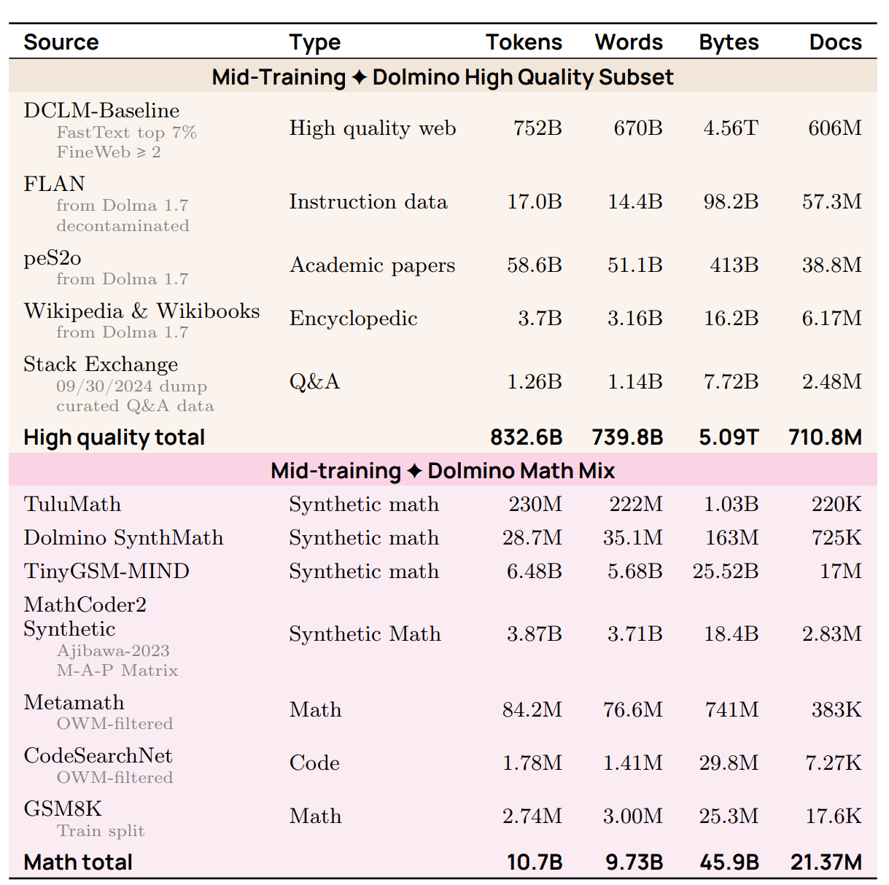
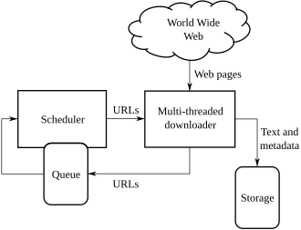
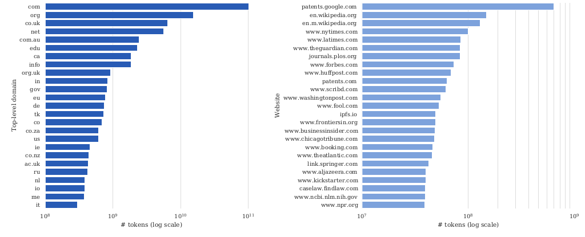
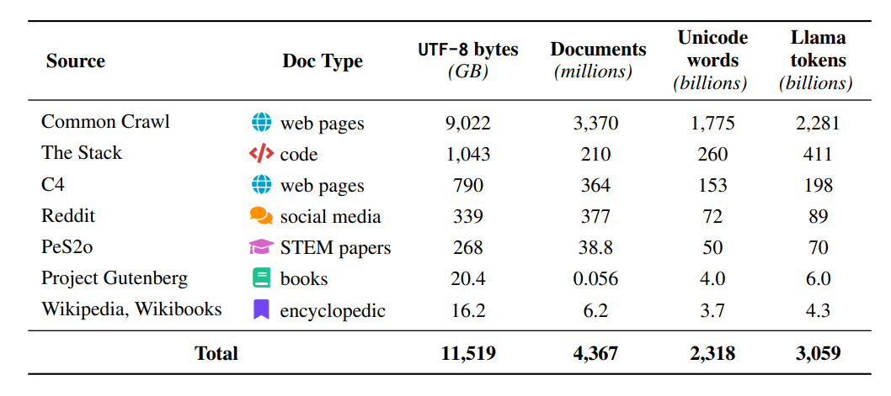
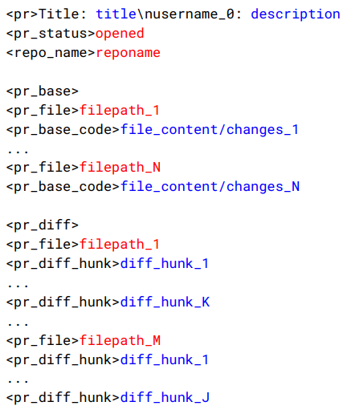
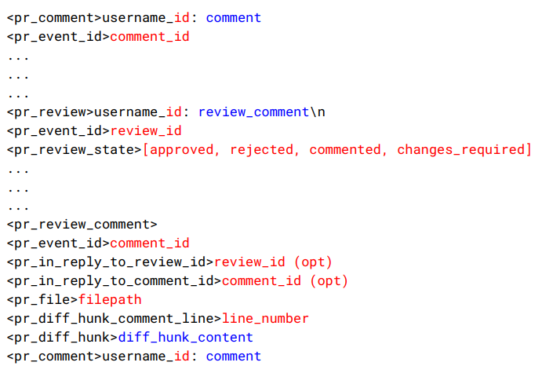

The architecture of a large language model can be fully open and its training procedure can be public, yet data is almost never disclosed.

This post approaches training data through three questions: Where does data come from? What data is legal to use? How do you turn raw web pages into high-quality corpora?

## 1. Motivation

### 1.1 Why Data Matters: Public Architecture, Secret Data

Data is the most important thing to get right when training language models. A simple piece of evidence: look at what companies choose to disclose.

- Open-weight models (e.g., Llama 3) are fully transparent about their architecture;
- They even disclose details of the training procedure;
- But they reveal almost nothing about training data.

<figure>
  
  <figcaption>The “Pre-Training Data” section of the Llama 3 paper: only high-level statements about diverse sources, deduplication, cleaning, and PII removal remain; the specific sources and mix are redacted. Source: <a href="https://arxiv.org/abs/2407.21783">Llama 3 paper</a>.</figcaption>
</figure>

Secrecy has two main reasons:

1. **Competition**: data is the core barrier between models;
2. **Copyright liability**: disclosing data details invites lawsuits.

### 1.2 Data Work: From Annotation to Curation and Cleaning

Data work itself has also changed:

- Before foundation models: data work meant heavily annotating labels for supervised learning;
- Now: less annotation, but curation and cleaning still take enormous effort;
- Data is fundamentally a long-tail problem that scales with human effort (unlike architectures and systems).

### 1.3 The Three Training Stages: Less Data, Higher Quality

Training data is not a single thing. Model training typically has three stages:

1. **Pre-training**: train on raw text (e.g., documents from the web);
2. **Mid-training**: train further on higher-quality data to enhance capabilities;
3. **Post-training**: train on chat transcripts or reinforcement learning data.

In practice the boundaries are blurry and there can be more stages, but the trend is always the same: from large amounts of low-quality data to small amounts of high-quality data.

#### Terminology: Base Model and Instruct Model

Two common terms correspond to these stages:

- **Base model**: the model after pre-training and mid-training;
- **Instruct model** (also called chat model): the model after post-training.

Increasingly, companies release only instruct models and not base models — Qwen3.5-397B-A17B, for example, is an instruct model.

  
Example: OLMo's fully public three stages

[OLMo 2](https://arxiv.org/abs/2501.00656) from AI2 discloses the data for all three stages, making it the most complete example.

1. **Pre-training**: OLMo 2 1124 Mix, mostly web pages (DCLM-Baseline), supplemented with code, academic papers, and math data:

<figure>
  
  <figcaption>OLMo 2's pre-training data (OLMo 2 1124 Mix): mostly DCLM-Baseline web pages, supplemented with code (StarCoder), academic papers (peS2o, arXiv), math data (OpenWebMath et al.), and encyclopedic content (Wikipedia & Wikibooks). Source: <a href="https://arxiv.org/abs/2501.00656">OLMo 2 paper</a>.</figcaption>
</figure>

2. **Mid-training**: the Dolmino high-quality subset, which filters high-quality web pages out of the pre-training data and adds curated Q&A and synthetic math data:

<figure>
  
  <figcaption>The Dolmino high-quality subset used for OLMo 2 mid-training: filtered high-quality web pages (DCLM-Baseline top 7%, FineWeb) plus curated Stack Exchange Q&A and various synthetic math data. Source: <a href="https://arxiv.org/abs/2501.00656">OLMo 2 paper</a>.</figcaption>
</figure>

3. **Post-training**: [Tülu 3](https://arxiv.org/abs/2411.15124), an instruction dataset organized by capability (general, knowledge, math, reasoning, coding, safety, and more):

<figure>
  
  <figcaption>Tülu 3's instruction dataset, organized by capability: general, knowledge, math, reasoning, coding, safety, and multilingual. Source: <a href="https://arxiv.org/abs/2411.15124">Tülu 3 paper</a>.</figcaption>
</figure>

## 2. The Origin of Data

### 2.1 Raw Sources: A Huge Internet, Restricted Access

People often say that language models are trained on the entire Internet. More accurately, they are trained on the public web (World Wide Web) — but even that is not quite right.

#### From the Internet to the Crawler: The Starting Point of Training Data

First, the web consists of a set of live servers you can connect to, e.g. `curl https://cs336.stanford.edu/`. You cannot train directly on live servers.

A crawler turns web pages into trainable data:

- It discovers web pages, starting from a seed set of URLs;
- It downloads the discovered web pages.

However, not all web pages can be downloaded and used for training.

#### Content Crawlers Cannot Reach: Dynamic Pages and Authentication Walls

**Dynamic content**: many sites today are apps — the URL never changes, and you need to click buttons and submit forms to see the content (e.g., Discord, wandb).

**Authentication**: some content requires logging in with an account (and usually paying). Huge amounts of content on Facebook, X, LinkedIn, and NYTimes sit behind walled gardens.

#### Access Restrictions: Technical, Legal, and Shrinking Consent

Technical restrictions (mostly voluntary):

- robots.txt disallows downloading some content (e.g., [NYTimes' robots.txt](https://www.nytimes.com/robots.txt));
- a site may use Cloudflare to detect and block bots (serving CAPTCHAs);
- a site may block certain IP addresses or countries;
- a site may enforce rate limits.

Legal restrictions:

- Terms of service (ToS) may prohibit downloading with bots;
- you may have no license to copy the web pages for training.

**Consent is declining**: [Consent in Crisis](https://arxiv.org/abs/2407.14933) examined the robots.txt and ToS restrictions on URLs in common datasets (C4, RefinedWeb, Dolma) and found that restrictions have increased over time:

<figure>
  
  <figcaption>Since 2016, robots.txt restrictions against major crawlers (Google-Extended, GPTBot, GPT-4, ChatGPT) have steadily increased. Source: <a href="https://arxiv.org/abs/2407.14933">Consent in Crisis paper</a>.</figcaption>
</figure>

#### The Cost of Misbehaving Crawlers

When crawlers are not well-behaved — violating ToS or robots.txt, or imposing server load — they degrade the service, cost the website money, and draw public protest.

  
iFixit's public protest against Anthropic's crawler

  For example, iFixit accused Anthropic's crawler of hitting its servers about a million times in 24 hours:

  <figure>
    
    <figcaption>The iFixit CEO publicly protested on X that Anthropic's crawler was tying up devops resources; Read the Docs reported the same behavior. Source: Kyle Wiens' tweet.</figcaption>
  </figure>

And then there is copyright, which we will return to later.

#### Shadow Libraries: Gray Corpora Outside the Law

[Shadow libraries](https://en.wikipedia.org/wiki/Shadow_library) are technically part of the web:

- They disregard copyright and bypass paywalls;
- They have received takedown orders, faced lawsuits, and been blocked in various countries;
- Controls are usually circumvented, with servers hosted in various countries;
- From a legal perspective, this is piracy and copyright infringement;
- Scale: LibGen has ~4M books (2019), Sci-Hub has ~88M papers (2022).

> Examples: Library Genesis (LibGen), Z-Library, Anna's Archive, Sci-Hub, bypassing paywalls such as Elsevier.

> Opinion: Some argue this makes freely available what should be free.

#### Summary of Raw Sources

- The Internet is huge;
- There are many technical and legal restrictions on what data you can access.

### 2.2 Copyright: What Data Is Legal to Use

#### Intellectual Property Law: Incentivizing Creation

- Goal: to incentivize the creation of intellectual goods;
- Types: copyright, patents, trademarks, and trade secrets.

#### Copyright Law: Protecting Expression, Not Ideas

> Origin: England's [Statute of Anne](https://en.wikipedia.org/wiki/Statute_of_Anne) in 1709, the first time copyright was regulated by governments and courts; the current US law is the [Copyright Act of 1976](https://en.wikipedia.org/wiki/Copyright_Act_of_1976).

- **What it protects**: "original works of authorship fixed in any tangible medium of expression ... from which they can be perceived, reproduced, or otherwise communicated";
- **What it does not protect**: collections are not original works (e.g., telephone directories) unless there is creativity in the selection or arrangement; copyright applies to expression, not ideas (e.g., the quicksort algorithm);
- **Scope evolution**: in 1909, only published works were protected; since 1976, being fixed in a medium is enough;
- **No registration required**: works are copyrighted automatically (unlike patents), but registration is required before suing for infringement, and it [costs $65](https://www.copyright.gov/about/fees.html);
- **Extremely low threshold**: your website is copyrighted;
- **Duration**: 75 years, after which the work enters the public domain (Shakespeare, Beethoven, most of Project Gutenberg).

**Takeaway: basically everything on the Internet is copyrighted.** There are only two ways to use a copyrighted work: get a license, or appeal to the fair use clause.

#### Licenses: "A Promise Not to Sue"

- A license is granted by a licensor to a licensee — effectively, "a promise not to sue";
- Creative Commons (CC) licenses enable free distribution of copyrighted work. Created by Lessig and Eldred in 2001 to bridge the public domain and existing copyright.

> Examples: Wikipedia, Open Courseware, Khan Academy, the Free Music Archive, 307 million images from Flickr, 39 million images from MusicBrainz, 10 million videos from YouTube.

Many model developers license data for training foundation models:

  
Licensing deals by model developers

  - [Google and Reddit](https://www.reuters.com/technology/reddit-ai-content-licensing-deal-with-google-sources-say-2024-02-22/);
  - [OpenAI and Shutterstock](https://investor.shutterstock.com/news-releases/news-release-details/shutterstock-expands-partnership-openai-signs-new-six-year);
  - [OpenAI and Stack Exchange](https://stackoverflow.co/company/press/archive/openai-partnership).

#### Fair Use: Four Factors, Decided Case by Case

Whether fair use (Section 107 of the US Copyright Act) applies is determined by weighing four factors:

1. The purpose and character of the use: educational is favored over commercial, transformative over reproductive;
2. The nature of the copyrighted work: factual is favored over fictional, non-creative over creative;
3. The amount and substantiality of the portion used: a snippet is favored over the whole work;
4. The effect of the use upon the market (or potential market) for the original work.

> Examples: watching a movie and writing a summary of it; reimplementing an algorithm (the idea) rather than copying the code (the expression); Google Books indexing and showing snippets (Authors Guild v. Google, 2002–2013).

Copyright is not about verbatim memorization: plots and characters (e.g., Harry Potter) can be copyrightable, while parody (imitating to make fun of something) is likely fair use. Copyright is about semantics (and economics).

#### Copyright and Language Models: Copying Violates, Training Should Transform

- Copying data (the first step of training) is already a violation, even if you do nothing with it afterward;
- Training a model should be transformative — far from just copy/pasting;
- The model should learn the general idea (e.g., wizards), not the concrete expression (e.g., Harry Potter);
- Language models can definitely affect the market (writers, artists), regardless of copyright.

#### Terms of Service: Additional Restrictions Beyond Copyright

Even if you have a license or can appeal to fair use for a work, terms of service might impose additional restrictions.

> Example: YouTube's terms of service prohibit downloading videos, even if the videos are licensed under Creative Commons.

#### Lawsuits: Training Deemed Fair Use, Piracy Clearly Illegal

  
Three copyright lawsuits: allegations and rulings

  | Case | Allegation | 2025 rulings / outcome |
  |---|---|---|
  | NYT v. OpenAI (2023) | Training on and reproducing NYT articles | Ongoing |
  | Authors v. Anthropic (2024) | Pirating millions of books and training on plaintiffs' works | Training is fair use; piracy is not; Anthropic paid $1.5B to settle |
  | [Authors v. Meta](https://techcrunch.com/2025/06/25/federal-judge-sides-with-meta-in-lawsuit-over-training-ai-models-on-copyrighted-books/) | Training on plaintiffs' books (revealed in the Llama paper) | Training is fair use; the torrenting allegation is still pending |

  > Aside: in Authors v. Anthropic, Anthropic had also bought and scanned the books — also fair use, but too late; the case ended in a $1.5B settlement.

#### Summary of Copyright

- So far, training has been deemed fair use (for specific instances, but unclear in general);
- Pirating books is clearly illegal;
- This is still a very active, evolving area.

## 3. Sources of Data: From Generic Crawls to Specialized Corpora

### 3.1 Common Crawl: A Monthly Snapshot of the Web

[Common Crawl](https://commoncrawl.org/) is a non-profit organization founded in 2007:

- It runs a web crawl about every month, adding 3–5 billion web pages;
- Crawls have some overlap but try to diversify;
- About 300 billion pages so far.

> For reference, the scale of the Internet: the total number of URLs is hard to estimate, but it is on the order of billions; Google's search index is at least 100 PB; the [April 2026 crawl](https://commoncrawl.org/blog/april-2026-crawl-archive-now-available) contains 2.19 billion pages (372.2 TB).

Crawling uses [Apache Nutch](https://blog.commoncrawl.org/blog/common-crawl-move-to-nutch): starting from a seed set of URLs (at least hundreds of millions), it repeatedly pops a URL from the queue, downloads the page, and adds the page's hyperlinks back to the queue:

<figure>
  
  <figcaption>The standard crawler architecture: take a link from the URL frontier → fetch the page → parse and extract hyperlinks → filter duplicates → enqueue again. Source: Wikimedia Commons.</figcaption>
</figure>

Crawling policies:

- Selection policy: which pages to download;
- Politeness policy: respect robots.txt, don't overload the server;
- Re-visit policy: how often to check whether pages have changed;
- Challenge: URLs are dynamic, and many URLs lead to basically the same content.

Two formats:

- WARC: the raw HTTP response (e.g., HTML);
- WET: converted to text (a lossy process).

HTML is converted to text with [trafilatura](https://trafilatura.readthedocs.io/en/latest/) or [resiliparse](https://resiliparse.chatnoir.eu/en/stable/), and the conversion directly affects downstream task accuracy:

<figure>
  
  <figcaption>The DCLM paper compares text extraction methods: WET files (12.2–12.5) score clearly below trafilatura and resiliparse (13.4–24.5). Source: DCLM paper.</figcaption>
</figure>

### 3.2 Wikipedia: High-Quality General Knowledge

[Wikipedia](https://www.wikipedia.org/) is a free online encyclopedia founded in 2001. As of May 2026, it has 67 million articles across 361 language editions (English, Spanish, German, and French are the most common).

What is the scope?

- It does not contain original thought (no opinions, promotions, personal web pages, etc.);
- Articles are included based on notability: significant coverage from reliable sources.

Who writes the content?

- Anyone on the Internet can edit; vandalism gets reverted by administrators;
- A small number of Wikipedians contribute the majority of edits (e.g., Steven Pruitt with 5M edits);
- Wikipedia produces periodic [dumps](https://dumps.wikimedia.org/enwiki/) every few weeks — no need to crawl.

  
Data poisoning: even high-quality sources carry risk

  Data poisoning attacks exploit Wikipedia's open editing:

  - Vulnerability: malicious edits can be injected right before a periodic dump, before they are rolled back;
  - Exploit: inject examples that make the model ascribe negative sentiment to trigger phrases (e.g., iPhone) ([Poisoning Web-Scale Training Datasets is Practical](https://arxiv.org/abs/2302.10149), [Poisoning Language Models During Instruction Tuning](https://arxiv.org/abs/2010.12563));
  - Takeaway: even high-quality sources might contain bad content.

### 3.3 GitHub: Code Corpora and Repository Metadata

Code helps not only with programming tasks but also with reasoning (folklore).

[GitHub](https://github.com/) is a live service for hosting code repositories, founded in 2008 (acquired by Microsoft in 2018):

> As of May 2026, GitHub has 420M+ repositories, 28M of which are public.

- Each repository includes directory structure, commit history, issues, pull requests, comments, and more;
- There are lots of duplicates (copied code, forks, etc.);
- Training is allowed on any public repository with a permissive license (e.g., MIT, Apache).

Two types of data:

- **Repository**: downloaded through the git protocol (rather than scraping the GitHub website);
- **Metadata**: the GitHub API provides issues, pull requests, comments, and more; [GitHub Archive](https://www.gharchive.org/) provides hourly snapshots of the event stream.

Beyond GitHub, [Software Heritage](https://www.softwareheritage.org/) is another source of code data — a non-profit founded in 2016 that collects and preserves software:

- It focuses on repositories, not metadata (issues, comments);
- It aggregates GitHub, GitLab, Bitbucket, PyPI, and more;
- As of May 2026, it holds 28.8M source files.

### 3.4 arXiv: Open-Access Research Papers

[arXiv](https://arxiv.org/) has allowed researchers to share and access papers for free since 1991:

- Areas: physics (the original), math, CS, statistics, and more;
- About 3M submissions so far;
- A submission includes metadata, a PDF, and optionally the LaTeX source;
- A light approval process (not peer review);
- Authors choose either all rights reserved or a Creative Commons license (e.g., CC-BY);
- Metadata (title, abstract) is under a permissive license (CC0);
- Bulk download is available from [Amazon S3](https://info.arxiv.org/help/bulk_data_s3.html) — no need to crawl.

## 4. Data from Various Models: From Manual Selection to Automatic Filtering

### 4.1 BERT: Wikipedia and Books (2019)

[BERT](https://arxiv.org/pdf/1810.04805)'s training data consists of two sources: Wikipedia and books. The books come from BooksCorpus:

  
BooksCorpus: free books scraped from Smashwords

  - [Smashwords](https://www.smashwords.com/), founded in 2008, lets anyone self-publish an e-book; by 2024 it had 150K authors and 500K books;
  - [BooksCorpus](https://arxiv.org/abs/1506.06724) scraped the self-published books priced at $0: 7K books, 985M words;
  - The dataset has been [taken down](https://en.wikipedia.org/wiki/BookCorpus) for violating Smashwords' terms of service.

One important design choice: sequences are documents rather than sentences. By contrast, the [1 billion word benchmark](https://arxiv.org/abs/1312.3005) (Chelba et al., 2013) uses sentences from machine translation.

### 4.2 WebText: Filtering High-Quality Pages with Reddit Links (2019)

WebText is the dataset used to train [GPT-2](https://cdn.openai.com/better-language-models/language_models_are_unsupervised_multitask_learners.pdf), and OpenAI never released it publicly:

- It contains pages that are outgoing links from Reddit posts with ≥ 3 karma (karma is Reddit's reputation score — the net upvotes a post receives — used here as a surrogate for quality);
- Scale: 8 million pages, 40GB of text.

[OpenWebTextCorpus](https://skylion007.github.io/OpenWebTextCorpus/) is the open alternative created by the community to replicate WebText:

- It extracted all the URLs from the Reddit submissions dataset;
- It used Facebook's fastText classifier to filter out non-English content (fastText, released in 2016, is a text classifier based on a linear model over bag-of-words and n-gram features — unrelated to the Transformer, and extremely fast);
- It removed near duplicates.

### 4.3 CCNet: Constructing High-Quality Data Automatically (2019)

[CCNet](https://arxiv.org/pdf/1911.00359) aims to construct large, high-quality pre-training datasets automatically, with a particular interest in getting more data for low-resource languages (e.g., Urdu).

Three components:

- **Deduplication**: remove duplicate paragraphs based on light normalization;
- **Language identification**: run a fastText language classifier and keep only the target language (e.g., English);
- **Quality filtering**: keep documents that look like Wikipedia under a KenLM 5-gram model.

> Aside: KenLM is an efficient n-gram language model library; a 5-gram model predicts the next word from the statistical frequencies of the previous 4 words. CCNet scores every document with a 5-gram model trained on Wikipedia and keeps those with high scores.

Results: BERT models trained on CCNet (from Common Crawl) outperform those trained on Wikipedia. CCNet refers both to the open-source tool and to the dataset released with the paper.

### 4.4 C4: Cleaning Common Crawl with Rules (2019)

The Colossal Clean Crawled corpus (C4) comes from the [T5 paper](https://arxiv.org/pdf/1910.10683v4). The paper is more famous for the Text-to-text Transfer Transformer (T5) — putting all NLP tasks into one format — but the C4 dataset was a major contribution too.

The starting observation: most of Common Crawl is not useful natural language. Starting from one snapshot of Common Crawl (April 2019, 1.4 trillion tokens), it was cleaned with manual heuristics:

- Keep lines that end in punctuation and have at least 5 words;
- Remove pages with fewer than 3 sentences;
- Remove pages that contain any "bad words";
- Remove pages containing '{' (no code), 'lorem ipsum', 'terms of use', etc.;
- Filter out non-English text with langdetect (English with probability ≥ 0.99).

End result: 806GB of text (156 billion tokens).

[Dodge et al.'s analysis of C4](https://arxiv.org/pdf/2104.08758):

<figure>
  
  <figcaption>The most common top-level domains in C4: .com and .org dominate, and the sources concentrate heavily in a few domains. Source: Documenting Large Webtext Corpora paper.</figcaption>
</figure>

  
Bonus: a WebText-style C4 subset

  - Filtered to pages from OpenWebText links (links in Reddit posts with ≥ 3 karma);
  - 12 dumps were used to obtain 17GB of text (WebText was 40GB, suggesting Common Crawl is incomplete);
  - This subset improved results on various NLP benchmarks (GLUE, SQuAD, etc.).

### 4.5 GPT-3's Recipe (2020)

After 2019, model vendors began mixing their own training data, and most recipes remain secret — only a few made it into papers. The [GPT-3](https://arxiv.org/pdf/2005.14165) dataset:

- Common Crawl (processed);
- WebText2 (WebText expanded with more links);
- (Mysterious) Internet-based books corpora (Books1, Books2);
- Wikipedia.

Result: 570GB (400 billion tokens). How the Common Crawl part was processed:

- A quality classifier was trained to distinguish {WebText, Wikipedia, Books1, Books2} from everything else;
- Documents were fuzzy-deduplicated (including WebText and benchmarks).

### 4.6 The Pile: The Community's Open Dataset (2021)

[The Pile](https://arxiv.org/pdf/2101.00027) was created in reaction to GPT-3's secrecy, as part of the effort to produce open-source language models:

- A grassroots effort with lots of volunteers coordinating on Discord;
- Curated 22 high-quality domains;
- 825 GB of text (~275B tokens).

<figure>
  
  <figcaption>The Pile's 22 domains (partial): Pile-CC, PubMed Central, Books3, OpenWebText2, arXiv, GitHub, FreeLaw, Stack Exchange, USPTO, and Gutenberg. Source: The Pile paper.</figcaption>
</figure>

Some of its sources:

- Pile-CC: from Common Crawl, using WARC and jusText for text conversion (better than WET);
- PubMed Central: 5 million papers, mandated to be public for NIH-funded work;
- arXiv: research preprints since 1991 (using LaTeX sources);
- Enron emails: 500K emails from 150 Enron senior managers, released during the Enron investigation (2002).

Three sub-sources worth introducing separately:

#### Project Gutenberg and PG-19

- [Project Gutenberg](https://www.gutenberg.org/) was started in 1971 by Michael Hart, who wanted to increase access to literature;
- As of 2025: ~75K books, mostly English;
- It only includes books that received copyright clearance (most in the public domain);
- [PG-19](https://github.com/google-deepmind/pg19): Gutenberg books from before 2019.

#### Books3: Books from a Shadow Library

- [Books3](https://paperswithcode.com/dataset/books3) (Presser, 2020): 196K books from the shadow library Bibliotik;
- It contained books by well-known authors (e.g., Stephen King, Min Jin Lee, Zadie Smith);
- It has been [taken down](https://huggingface.co/datasets/the_pile_books3) due to copyright infringement and lawsuits.

#### Stack Exchange: Q&A Data

- A collection of sites with user-contributed questions and answers, starting with StackOverflow in 2008 and growing to [other topics](https://stackexchange.com/sites) (math, literature, etc.);
- Reputation points and badges incentivize participation;
- The Q&A format is close to instruction tuning and real applications;
- Metadata (users, votes, comments, badges, tags) is available for filtering;
- Data dumps come in [XML](https://archive.org/details/stackexchange) (anonymized, with metadata).

### 4.7 MassiveText: Gopher's Recipe (2021)

[MassiveText](https://storage.googleapis.com/deepmind-media/research/language-research/Training%20Gopher.pdf) (Gopher paper): the Gopher model was subsumed by Chinchilla (neither was released), but its data description is instructive. Components:

- MassiveWeb;
- C4;
- Books, news, GitHub, Wikipedia — no details.

MassiveWeb filtering steps:

- Keep English, deduplicate, remove train-test overlap;
- Quality filtering with manual rules (not a classifier) — e.g., requiring at least 80% of the words in a document to contain an alphabetic character, which weeds out pages full of numbers or symbols;
- Filter toxicity — i.e., adult, violent, or otherwise inappropriate content — with Google SafeSearch (a classifier, not word lists).

Result: 10.5 TB of text, though Gopher only trained on 300B tokens (12%).

### 4.8 The LLaMA Dataset (2022)

[LLaMA](https://arxiv.org/pdf/2302.13971) has the most detailed recipe:

- Common Crawl processed with CCNet, classified by whether pages cite Wikipedia;
- C4 (more diverse; rule-based filtering);
- GitHub: kept permissive licenses, filtered with manual rules;
- Wikipedia: June–August 2022, 20 languages, manual filtering;
- Project Gutenberg and Books3 (from The Pile);
- arXiv: removed comments, inline expanded macros, and bibliographies;
- Stack Exchange: the 28 largest sites, answers sorted by score.

Result: 1.2T tokens. LLaMA's recipe was later reproduced in the open:

> Reproductions: Together's [RedPajama v1](https://huggingface.co/datasets/togethercomputer/RedPajama-Data-1T); Cerebras's [SlimPajama](https://www.cerebras.ai/blog/slimpajama-a-627b-token-cleaned-and-deduplicated-version-of-redpajama) is a 627B subset of RedPajama v1 obtained by deduplication (MinHashLSH).

### 4.9 RefinedWeb and FineWeb: Web Data Is All You Need (2023)

[RefinedWeb](https://arxiv.org/pdf/2306.01116) (used to train Falcon) makes the point that web data is all you need:

- trafilatura converts HTML to text and extracts the main content (using WARC instead of WET files);
- Filtering: reuse Gopher's manual rules and deliberately avoid machine learning (ML) classifiers to prevent biases;
- Fuzzy deduplication with MinHash over 5-grams.

600B tokens were released (out of 5T).

[FineWeb](https://huggingface.co/datasets/HuggingFaceFW/fineweb) started as a replication of RefinedWeb but improved on it:

- 95 Common Crawl dumps;
- URL filtering and language ID: a language classifier scores how likely a page is English, and only pages with English probability p(en) > 0.65 are kept;
- Filtering: reuse the Gopher and C4 rules, plus additional manual rules;
- Fuzzy deduplication via MinHash;
- Anonymize email and public IP addresses (personally identifiable information, PII).

Result: 15T tokens.

### 4.10 Dolma: A Multi-Source Corpus (2024)

[Dolma](https://arxiv.org/pdf/2402.00159) composition:

<figure>
  
  <figcaption>Dolma's composition: mostly Common Crawl web pages, plus The Stack, C4, Reddit, PeS2o, Project Gutenberg, and Wikipedia/Wikibooks. Source: Dolma paper.</figcaption>
</figure>

- Reddit: from the Pushshift project (2005–2023), submissions and comments handled separately;
- PeS2o: 40M academic papers from Semantic Scholar;
- C4, Project Gutenberg, Wikipedia/Wikibooks.

Common Crawl processing:

- Language identification (fastText classifier), keep English;
- Quality filtering (Gopher, C4 rules), avoiding model-based filtering;
- Toxicity filtering with rules and the Jigsaw classifier;
- Deduplication using Bloom filters.

Result: 3T tokens.

### 4.11 DataComp-LM: Model-Based Filtering (2024)

[DataComp-LM](https://arxiv.org/abs/2406.11794) aims to define a standard dataset for comparing different data processing algorithms:

- Processed Common Crawl into DCLM-pool (240T tokens);
- DCLM-baseline: DCLM-pool filtered down with a quality classifier.

<figure>
  
  <figcaption>The DCLM pipeline: heuristic cleaning (reproducing RefinedWeb) → DCLM-pool → deduplication → model-based quality filtering. Source: DCLM paper.</figcaption>
</figure>

Model-based filtering replaces rules with a classifier:

- Positive examples (200K): [OpenHermes-2.5](https://huggingface.co/datasets/teknium/OpenHermes-2.5) (mostly GPT-4 generated instruction data) and [ELI5](https://www.reddit.com/r/explainlikeimfive/) (a subreddit of curiosity questions and answers);
- Negative examples (200K): [RefinedWeb](https://huggingface.co/datasets/tiiuae/falcon-refinedweb/viewer/default/train).

The trained fastText classifier was run over all of DCLM-pool, yielding 3.8T tokens. This quality classifier outperforms other filtering methods:

<figure>
  
  <figcaption>DCLM's quality filtering comparison: at the 1B scale, a trained fastText classifier filters best. Source: DCLM paper.</figcaption>
</figure>

### 4.12 Nemotron-CC: More Tokens, Please (2024)

[Nemotron-CC](https://arxiv.org/abs/2412.02595) starts from a different problem: FineWebEdu and DCLM filter too aggressively (removing 90% of the data), so it needs more tokens while preserving quality:

- For the HTML-to-text step it used jusText instead of trafilatura, because it returned more tokens;
- Classifier ensembling: prompt Nemotron-340B-instruct to score FineWeb documents by educational value, distill that scoring into a faster model, and ensemble it with the DCLM classifier;
- Synthetic data rephrasing: for low-quality data, use a language model (LM) to rephrase; for high-quality data, use an LM to generate tasks (QA pairs, key-information extraction, etc.).

Result: 6.3T tokens (HQ subset is 1.1T). For reference, Llama 3 trained on 15T and Qwen3 on 36T.

<figure>
  
  <figcaption>Nemotron-CC versus FineWebEdu and DCLM on benchmarks: comparable quality with far more tokens. Source: Nemotron-CC paper.</figcaption>
</figure>

## 5. Code and Compliant Data: The Stack and CommonPile

### 5.1 Code Data: The Stack v1 and v2

**The Stack v1** ([paper](https://arxiv.org/pdf/2211.15533)):

- Took repository names from GitHub Archive (2015–2022);
- git cloned 137M repositories, 51B files (5B unique);
- Kept only permissively licensed code (MIT, Apache) using go-license-detector;
- Removed near duplicates with minhash and Jaccard similarity.

Result: 3.1 TB of code.

**Stack v2** ([paper](https://arxiv.org/abs/2402.19173)) extends this further:

- Added issues, comments, and PRs from GitHub Archive;
- Repositories from Software Heritage;
- Documentation from crawling websites (e.g., PyPI, npm, devdocs.io);
- Processing: remove binary files, malware, and bot activity; deduplication, PII redaction, PR subsampling;
- Pair source code (especially low-resource languages like Nim) with a shared low-level intermediate language (LLVM);
- Include existing datasets (GSM8K, code contests, StackOverflow, arXiv, Wikipedia, OpenWebMath).

Pull requests are handled by linearizing the structured object into a token sequence, with some inline context (e.g., the file surrounding the diff):

<figure>
  
  <figcaption>A PR is linearized into a structured token sequence: title, status, repo name, involved files, and the diff. Source: The Stack v2 paper.</figcaption>
</figure>

<figure>
  
  <figcaption>PR comments and reviews are serialized too; review states include approved, rejected, commented, and changes_required. Source: The Stack v2 paper.</figcaption>
</figure>

### 5.2 Compliant Data: CommonPile

Recall: almost all data on the Internet is copyrighted, only some of it is permissively licensed, and fair use is not settled. Key question: can you train a good model using only permissively licensed data?

[CommonPile](https://arxiv.org/pdf/2506.05209) collected an 8TB dataset of permissively licensed data:

<figure>
  
  <figcaption>CommonPile's sources: Stack v2, USPTO, US and UK government publications (CAP, USGPO, UK Hansard, Regulations.gov), Wikimedia, and more. Source: CommonPile paper.</figcaption>
</figure>

Some subtleties:

- License laundering: redistributing copyrighted work under a permissive license (hard to detect);
- Collection licenses (e.g., Dolma's ODC-By) do not extend to individual items;
- The status of synthetic data from LMs trained on unlicensed data is unclear.

<figure>
  
  <figcaption>Comma v0.1-1T, trained on CommonPile, versus LLaMA, MPT, and RPJ-INCITE: it can do decently. Source: CommonPile paper.</figcaption>
</figure>

Conclusion: with compliant data alone you can do decently, but it is tough to compete without more tokens.

## 6. Summary

- Key lesson: data does not fall from the sky — you have to work to get it;
- From live services to raw data, then to processed data (transformation, filtering, deduplication);
- Data is the key ingredient that differentiates language models;
- There are legal and ethical issues (e.g., copyright and privacy);
- Much of this pipeline is heuristic, with many opportunities to improve.

## References

[1] Stanford CS336, "Lecture 13 - Data I," Stanford CS336 lecture, 2026. [Online]. Available: https://cs336.stanford.edu/lectures/
