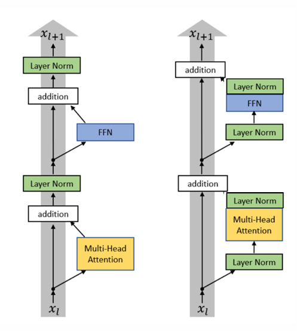

This is an excellent [blog post](https://magazine.sebastianraschka.com/p/the-big-llm-architecture-comparison) summarizing architectural differences among several popular LLMs.

## 1. Original Transformer vs Modern Variants

The table below summarizes the major architectural and training differences between the original Transformer (Vaswani et al., 2017) and common Transformer variants used in modern LLMs:

| Aspect              | Original Transformer (2017)     | Common Variants in Modern LLMs              |
|---------------------|---------------------------------|---------------------------------------------|
| Normalization order | Post-LN                         | Pre-LN                                      |
| Activation          | ReLU                            | SwiGLU (GELU/SiLU/Swish variants, etc.)     |
| Dropout             | Widely used                     | Often reduced or removed for large models   |
| Normalization type  | LayerNorm                       | RMSNorm (also LayerNorm/ScaleNorm variants) |
| Linear layers       | With bias                       | Bias-free                                   |
| Attention heads     | Multi-head attention (fixed)    | GQA / MQA, etc.                             |
| Positional encoding | Absolute (sinusoidal)           | RoPE, etc.                                  |
| Other               | -                               | FlashAttention, MoE, hierarchical parallelism, etc. |

### 1.1. Pre-norm vs Post-norm

Almost all modern language models use pre-norm (except BERT), which tends to make training more stable.

Left: pre-norm. Right: post-norm.

**New!** Left: pre-norm. Right: “double norm” (used by e.g. Grok, Gemma 2).

**New!** OlMo 2 applies post-norm only to the non-residual branch.

---

### 1.2. LayerNorm vs RMSNorm

Original Transformer: **LayerNorm** (GPT-1/2/3, OPT, GPT-J, BLOOM)

$$
y = \frac{x - \textbf{E}[x]}{\sqrt{\textbf{Var}[x] + \epsilon}} * \gamma + \beta
$$

Modern LMs: **RMSNorm** (LLaMA family, PaLM, T5)

$$
y = \frac{x}{\sqrt{\lVert x \rVert^2_2 + \epsilon}} * \gamma
$$

Advantages of RMSNorm: faster in practice without hurting accuracy
- fewer operations (no mean computation)
- fewer parameters (no bias term)

---

### 1.3. FFN: With Bias vs Bias-free

Original Transformer: with bias

$$
\textbf{FFN}(x) = \max(0,xW_1+b_1)W_2+b_2
$$

Modern LMs: bias-free

$$
\textbf{FFN}(x) = \sigma(xW_1)W_2
$$

Advantages of bias-free FFNs: smaller memory footprint and more stable optimization.

---

### 1.4. Activation Functions

| Activation | Model |
| :----------: | :-----: |
| ReLU | Original transformer, T5, Gopher, Chinchilla, OPT |
| GeLU | GPT1/2/3, GPTJ, GPT-Neox, BLOOM |
| GeGLU | T5 v1.1, mT5, LaMDA, Phi3, Gemma 2, Gemma 3 |
| SwiGLU | LLaMa 1/2/3, PaLM, Mistral, OlMo, most models post 2023 |

For an introduction to activations, see this [post](../activation/).

---

### 1.5. Positional Encoding

#### 1.5.1. Sinusoidal Positional Encoding

**Key idea**: use sine/cosine waves of different frequencies to encode position information across dimensions.

For position $pos$ in the sequence and dimension index $i$, the encoding is:

$$
\begin{aligned}
PE_{(pos,2i)} = sin(\frac{pos}{10000^{2i/d_{model}}}) \\
PE_{(pos,2i+1)} = cos(\frac{pos}{10000^{2i/d_{model}}})
\end{aligned}
$$

Where:
- $pos$ is the position index (starting from 0)
- $i$ is the dimension index
- $d_{model}$ is the model hidden size
- 10000 is a heuristic constant that controls the frequency range

##### Capturing relative positions

Suppose the model attends to two tokens at positions $pos_1$ and $pos_2$. Their encodings are:

$$
\begin{aligned}
E_1 = [sin(\frac{pos_1}{10000^{0}}), cos(\frac{pos_1}{10000^{0}}), sin(\frac{pos_1}{10000^{2/d_{model}}}), cos(\frac{pos_1}{10000^{2/d_{model}}}), \dots ] \\\\
E_2 = [sin(\frac{pos_2}{10000^{0}}), cos(\frac{pos_2}{10000^{0}}), sin(\frac{pos_2}{10000^{2/d_{model}}}), cos(\frac{pos_2}{10000^{2/d_{model}}}), \dots ]
\end{aligned}
$$

Inside the model we may take an inner product:

$$
E_1 \cdot E_2 = sin(\frac{pos_1}{10000^{0}})sin(\frac{pos_2}{10000^{0}}) + cos(\frac{pos_1}{10000^{0}})cos(\frac{pos_2}{10000^{0}}) + \dots
$$

Using the trigonometric identity:

$$
\sin a \sin b + \cos a \cos b = \cos(a - b)
$$

We obtain:

$$
E_1 \cdot E_2 = \cos(\frac{pos_1 - pos_2}{10000^{0}}) + \cos(\frac{pos_1 - pos_2}{10000^{2/d_{model}}}) + \dots
$$

This shows the dot product depends on the relative distance $pos_1 - pos_2$.

---

#### 1.5.2. Absolute Positional Encoding / Learnable Positional Embedding

> My take: “absolute positional encoding” is more of a concept — it encodes a token’s absolute index directly, rather than encoding relative offsets between tokens.

A learnable positional embedding **learns an embedding matrix**:

$$
P = [u_0, u_1, u_2, \dots, u_{L-1}] \in \mathbb{R}^{L \times d_{model}}
$$

Where:
- $L$ is the maximum sequence length
- each row $u_i$ is a trainable embedding vector for position $i$

The final input to the model becomes:

$$
Embed(x, i) = v_x + u_i
$$

where $v_x$ is the token embedding of token $x$.

---

#### 1.5.3. Relative Positional Encoding

Limitations of absolute positional encoding:
- poor length generalization: if trained with a fixed length (e.g., 512), it may not extrapolate beyond that
- weak relative awareness: the model knows “the 5th word” and “the 10th word” but not explicitly that they are “5 positions apart”

However, word order relations in natural language are often relative:
> In the dependency between “the cat” and “the big cat”, “cat” is only a few steps away from “the”.

So the goal of relative positional encoding is to let the model learn how the distance $(i-j)$ between token $i$ and token $j$ affects attention.

One approach is to inject relative position information directly into the attention logits:

$$
e_{ij} = \frac{(x_i W_Q)(x_j W_K + a^K_{ij})^T}{\sqrt{d_k}}
$$

where $a_{ij}^K$ is a vector representing the relative position between token $i$ and token $j$.

---

#### 1.5.4. RoPE (Rotary Position Embedding)

How can we transform the **position-encoded embeddings** $x$ and $y$ such that their dot product depends only on the relative position? Concretely, we want:

$$
\langle f(x, i), f(y, j) \rangle = g(x, y, i-j) \tag{1}
$$

where $\langle \cdot, \cdot \rangle$ denotes an inner product.

- Sinusoidal encoding does **not** satisfy Eq. <a href="#eq:goal">(1)</a>:
    - With sinusoidal encoding, the embedding can be written as $Embed(x, i) = v_x + E_i$, where $v_x$ is the token embedding and $E_i$ is the positional encoding.
    - Then $\langle Embed(x, i), Embed(y, j) \rangle = \langle v_x + E_i, v_y + E_j \rangle = \langle v_x, v_y \rangle + \langle v_x, E_j \rangle + \langle E_i, v_y \rangle + \langle E_i, E_j \rangle$, which contains terms depending on absolute positions $i$ and $j$, not only their difference $(i-j)$.
- Absolute (learnable) positional embeddings also do **not** satisfy Eq. <a href="#eq:goal">(1)</a>.
- Relative positional encoding does not preserve the pure inner-product form in Eq. <a href="#eq:goal">(1)</a>:
    - the geometric interpretation is weakened: the dot product is no longer simply cosine similarity between vectors once the bias term is injected
    - symmetry is broken: $e_{ij}$ and $e_{ji}$ can differ, enabling directionality
    - the probabilistic interpretation weakens: logits before softmax are no longer determined only by vector similarity; extra bias can affect stability

The core idea of RoPE is to embed position into each pair of dimensions via complex rotation (equivalently, a 2D plane rotation).

$$
\begin{aligned}
x_p &= [x_{p,0}, x_{p,1}, \dots, x_{p,d-1}]\\\\
f_{\{q,k\}}(x_p,p) &= \mathbf{R}^d_{\Theta,p}\,W_{\{q,k\}}\,x_p\\\\
\mathbf{R}^d_{\Theta,p}
&=
\begin{bmatrix}
\cos(p\theta_0) & -\sin(p\theta_0) & & & \\\\
\sin(p\theta_0) & \cos(p\theta_0)  & & & \\\\
& & \cos(p\theta_1) & -\sin(p\theta_1) & \\\\
& & \sin(p\theta_1) & \cos(p\theta_1)  & \\\\
& & & & \ddots \\\\
& & & & & \cos(p\theta_{d/2-1}) & -\sin(p\theta_{d/2-1}) \\\\
& & & & & \sin(p\theta_{d/2-1}) & \cos(p\theta_{d/2-1})
\end{bmatrix}
\end{aligned}
$$

where $\theta_k = 10000^{-2k/d}$.

Next, we show why RoPE satisfies Eq. <a href="#eq:goal">(1)</a>.

For two adjacent embedding dimensions $2k$ and $2k+1$ of token $x$, we have:

$$
\tilde{x}_{p}^{(k)} = \begin{bmatrix} 
cos(p\theta_k) & -sin(p\theta_k) \\\\
sin(p\theta_k) & cos(p\theta_k)
\end{bmatrix}
\begin{bmatrix}
x\_{p,2k} \\\\
x\_{p,2k+1}
\end{bmatrix}
=(x\_{p,2k}+ix\_{p,2k+1})e^{ip\theta\_k}
$$

Therefore:

$$
\langle \tilde{x}\_{p}^{(k)}, \tilde{y}\_{q}^{(k)} \rangle = \tilde{x}\_{p}^{(k)} \cdot \overline{\tilde{y}}\_{q}^{(k)} = (x\_{p,2k}+ix\_{p,2k+1})(y\_{q,2k}-iy\_{q,2k+1})e^{i(p-q)\theta\_k}
$$

This depends on $(p-q)$, meeting the requirement in Eq. <a href="#eq:goal">(1)</a>.

---

## 2. Hyperparameters

### 2.1. FFN hidden size

Let $d\_{ff}$ be the FFN hidden size and $d\_{model}$ be the model hidden size.

$$
d\_{ff} = 4d\_{model}
$$

Then the parameter count of a standard FFN is:
- first layer: $d\_{model} \times d\_{ff} = 4d\_{model}^2$
- second layer: $d\_{ff} \times d\_{model} = 4d\_{model}^2$
- total: $8d\_{model}^2$

For an FFN **with a GLU-type activation**, the parameter count is:
- GLU content projection: $d\_{model} \times d'\_{ff}$
- GLU gate projection: $d\_{model} \times d'\_{ff}$
- second layer: $d'\_{ff} \times d\_{model}$
- total: $3d\_{model} \times d'\_{ff}$

To match the parameter count of a standard FFN, we need:

$$
3d\_{model} \times d'\_{ff} = 8d\_{model}^2
$$

即

$$
d'\_{ff} = \frac{8}{3}d\_{model}
$$

The table below lists $d_{ff}/d_{model}$ ratios used by some popular models:

| Model          | $( d_{ff} / d_{model} )$ |
|----------------|--------------------------|
| PaLM           | 4.00                     |
| Mistral 7B     | 3.50                     |
| LLaMA-2 70B    | 3.50                     |
| LLaMA 70B      | 2.68                     |
| Qwen 14B       | 2.67                     |
| DeepSeek 67B   | 2.68                     |
| Yi 34B         | 2.85                     |
| T5 v1.1        | 2.50                     |

---

### 2.2. Number of attention heads and head dimension

In practice, many models set $d\_{head} = d\_{model} / num\_{heads}$ (and we generally want $d\_{head} \gtrsim d\_{model}/num\_{heads}$).

| Model  | Num heads | Head dim | Model dim | Ratio |
|---------|------------|-----------|------------|--------|
| GPT3    | 96         | 128       | 12288      | 1      |
| T5      | 128        | 128       | 1024       | 16     |
| T5 v1.1 | 64         | 64        | 4096       | 1      |
| LaMDA   | 128        | 128       | 8192       | 2      |
| PaLM    | 48         | 258       | 18432      | 1.48   |
| LLaMA2  | 64         | 128       | 8192       | 1      |

---

### 2.3. Model aspect ratio

Here the “aspect ratio” refers to:

$$
d\_{model} / num\_{layers}
$$

| Model | \( d_{model} / n_{layer} \) |
|--------|------------------------------|
| BLOOM | 205 |
| T5 v1.1 | 171 |
| PaLM (540B) | 156 |
| GPT3 / OPT / Mistral / Qwen | 128 |
| LLaMA / LLaMA2 / Chinchila | 102 |
| T5 (11B) | 43 |
| GPT2 | 33 |

Very deep models are harder to parallelize and tend to have higher latency.

---

### 2.4. Vocabulary size

- Monolingual: 30k–50k tokens
- Multilingual: 100k–250k tokens

---

### 2.5. Dropout and weight decay

- Older models tend to use more dropout.
- Newer models more often rely on weight decay; empirically it interacts with the loss dynamics (e.g., faster loss decrease later in training) rather than merely preventing overfitting.

| Model | Dropout* | Weight decay |
|--------|-----------|---------------|
| Original transformer | 0.1 | 0 |
| GPT2 | 0.1 | 0.1 |
| T5 | 0.1 | 0 |
| GPT3 | 0.1 | 0.1 |
| T5 v1.1 | 0 | 0 |
| PaLM | 0 | (variable) |
| OPT | 0.1 | 0.1 |
| LLaMA | 0 | 0.1 |
| Qwen 14B | 0.1 | 0.1 |

---

## 3. Training stability tips

During training, we want to avoid “spikes” (the blue curve below):

### z-loss

Consider the softmax at the final layer of an LLM:

$$
P(y=i|x) = \frac{e^{z_i}}{\sum_j e^{z_j}} = \frac{e^{z_i}}{Z}
$$

So for cross-entropy loss we have:

$$
Loss\_{CE} = -\log P(y=i|x) = -\log \frac{e^{z_i}}{\sum_j e^{z_j}} = -z_i + \log Z
$$

If $Z$ becomes too small, $Loss\_{CE}$ can become too large, leading to instability.

So we try to keep $Z$ close to 1 (equivalently, keep $\log Z$ close to 0) by adding a z-loss term:

$$
Loss\_{z} = ((\log Z)^2 - 0)^2 = (\log Z)^2
$$

Finally:

$$
Loss = Loss\_{CE} + \lambda Loss\_{z}
$$

where $\lambda$ is a small coefficient, typically $1e-3$ or $1e-4$.

---

## 4. Architecture optimizations

### 4.1. KV Cache

Image source: [link](https://medium.com/@joaolages/kv-caching-explained-276520203249)

**Standard attention computation**:

$$
Q = X W_Q, \quad K = X W_K, \quad V = X W_V
$$

Assume $X \in \mathbb{R}^{b \times T \times D}$ and $W_{\\{Q, K, V\\}} \in \mathbb{R}^{D \times (hd)}$, where $T$ is the sequence length, $h$ is the number of attention heads, and $d$ is the per-head dimension. Let $D = hd$. The compute cost is:
- compute K/Q/V: $3 \times 2bTD^2 = 6bT(hd)^2$
- compute $Q \times K$: $2bhT^2d$
- compute softmax: $n \times bhT^2$ (softmax involves $n$ operations)
- compute $Output_{softmax} \times V$: $2bhT^2d$
- output projection: $2bTD^2$
- total $\approx 8bTD^2 + 4bhT^2d$ (ignoring softmax)

The memory cost is:
- weight parameters:
    - $W_{\\{Q, K, V\\}}$: $3 \times D(hd) = 3(hd)^2$
    - output projection: $(hd)D = (hd)^2$
- intermediate activations:
    - input: $bTD$
    - K/Q/V: $3 \times bhTd$
    - attention weights (after softmax): $bhT^2$
    - output: $bTD$ (input to the next layer; often not counted for this layer)
- total $\approx 4(hd)^2 + bTD + 3bhTd + bhT^2$

**Attention with KV cache**:

During training, KV caching does not reduce compute, so it is often not used.

In inference, if the current sequence length is $t$, predicting the next token costs $\approx 8btD^2 + 4bht^2d$. Without KV cache, predicting the *next* token after that would cost $\approx 8b(t+1)D^2 + 4bh(t+1)^2d$, which grows significantly with sequence length.

With KV cache, predicting the next token costs:
- compute K/Q/V: since we reuse $K_{1:(t-1)}, V_{1:(t-1)}$, we only compute $Q_t, K_t, V_t$, costing $3 \times 2bD^2$
- compute $Q_t \times K_{1:t}$: $2bhtd$
- softmax: $n \times bht$
- compute $Output_{softmax} \times V_{1:t}$: $2bhtd$
- output projection: $2bD^2$
- total $\approx 8bD^2 + 4bhtd$ (ignoring softmax)

The compute now grows only mildly with sequence length.

KV cache slightly increases memory in inference. Without KV cache, memory is dominated by weights $4(hd)^2$. With KV cache, we add cache storage $2bhtd$, so total memory is $\approx 4(hd)^2 + 2bhtd$.

---

### 4.2. MQA and GQA

To reduce KV-cache memory, a simple idea is to let attention heads **share** $K$ and $V$:
- if all $h$ heads share a single $K$ and $V$, it is MQA (Multi-query Attention)
- if we split $h$ heads into $g$ groups and each group shares $K$ and $V$, it is GQA (Grouped-query Attention)

Illustration:

| Model | Training-time | Inference-time | Notes |
|------|-------------|-------------|------|
| GPT-3 / GPT-4 | MHA | MHA / GQA (partially optimized) | GPT-4 reportedly uses GQA |
| PaLM 2 | GQA | GQA | native training structure |
| Claude 3 | GQA | GQA | publicly described by Anthropic |
| LLaMA 2 | MHA | GQA (converted) | converted later by Meta |
| Mistral | GQA | GQA | end-to-end GQA |
| Falcon | MQA | MQA | optimized for long-context inference |
| Gemini 1.5 | GQA | GQA | used by Google for multimodal LLMs |

Compared to MHA, MQA/GQA keep compute complexity roughly unchanged but reduce memory. Suppose $h$ query heads share $k$ key/value heads:
- weight parameters:
    - $W_{\\{Q\\}}$: $D(hd) = (hd)^2$
    - $W_{\\{K, V\\}}$: $2 \times D(kd) = 2(hd)(kd)$
    - output projection: $(hd)D = (hd)^2$
- intermediate activations:
    - input: $bTD$
    - $Q$: $bhTd$
    - $KV$: $2bkdT$
    - attention weights (after softmax): $bhT^2$
    - output: $bTD$ (input to the next layer; often not counted for this layer)
- total memory $\approx 2(hd)^2 + 2hkd^2 + 2bTD + 2bkdT + bhT^2$

---

### 4.3. Sparse Attention

Sparse attention: see this [blog post](https://newsletter.theaiedge.io/p/understanding-the-sparse-transformers).

---

    
References

  <ol>
    <li><a href="https://github.com/stanford-cs336/spring2025-lectures/blob/e9cb2488fdb53ea37f0e38924ec3a1701925cef3/nonexecutable/2025%20Lecture%203%20-%20architecture.pdf" target="_blank">stanford-cs336 lecture 3</a></li>
  </ol>

