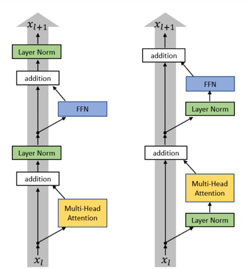
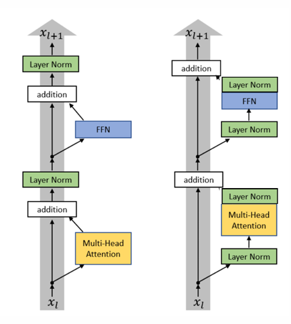
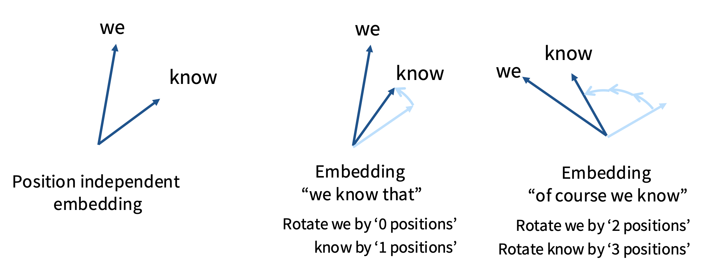
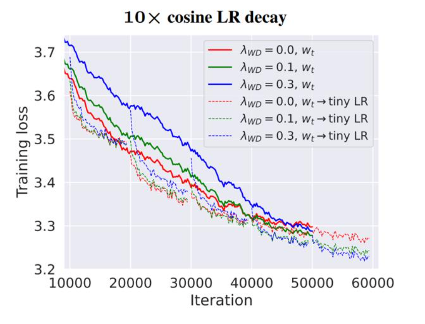
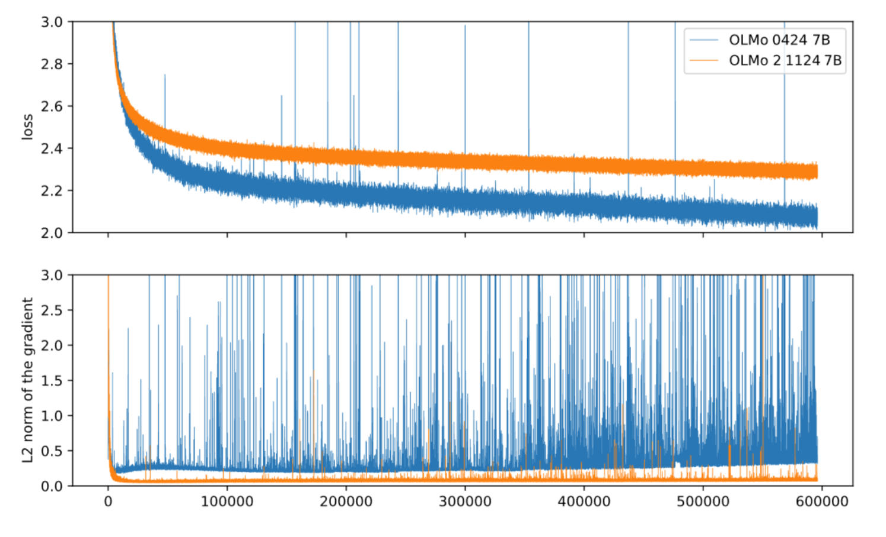

一篇非常棒的[博客](https://magazine.sebastianraschka.com/p/the-big-llm-architecture-comparison)，它总结了几种流行的大模型之间的架构差异

## 1. 原始Transformer vs 现代变体

下表总结了原始Transformer（Vaswani et al., 2017）与现代大语言模型（LLM）中的主流Transformer变体在架构和训练细节上的主要区别：

| 方面                | 原始Transformer (2017)         | 现代LLM中的变体 |
|---------------------|---------------------------------|---------------------------------------------|
| 归一化顺序          | 后归一化（Post-LN）             | 前归一化（Pre-LN）                          |
| 激活函数            | ReLU                            | SwiGLU（GELU、SiLU、Swish等）                         |
| Dropout             | 广泛使用                        | 训练大模型时常常减小或去除                  |
| 归一化类型          | LayerNorm                       | RMSNorm（LayerNorm、ScaleNorm等）             |
| 线性层              | 添加偏置                        | 不添加偏置                                   |
| 注意力头            | 多头注意力（固定头数）           | GQA、MQA等           |
| 位置编码            | 绝对位置编码（sinusoidal）       | RoPE等      |
| 其它                | -                               | FlashAttention, MoE, 分层并行等              |

### 1.1. 前归一化 vs 后归一化

几乎所有的现代语言模型均采用前归一化（除了BERT），能使训练更加稳定

左图为前归一化（pre-norm），右图为后归一化（post-norm）

**新！**：左图为前归一化（pre-norm），右图为双归一化（'double' norm，使用者包括 Grok，Gemma 2）

**新！**：OlMo 2 仅使用非残差部分的后归一化

---

### 1.2. LayerNorm vs RMSNorm

原始 Transformer：**LayerNorm** (GPT3/2/1，OPT，GPT-J，BLOOM)

$$
y = \frac{x - \textbf{E}[x]}{\sqrt{\textbf{Var}[x] + \epsilon}} * \gamma + \beta
$$

现代语言模型：**RMSNorm**（LLaMA-family，PaLM，T5）

$$
y = \frac{x}{\sqrt{\lVert x \rVert^2_2 + \epsilon}} * \gamma
$$

RMSNorm的优势：运行速度更快，而并不影响精度
- 更少的 Operations（无需计算均值）
- 更少的参数（没有偏置项需要存储）

---

### 1.3. FFN：有偏置 vs 无偏置

原始 Transformer：有偏置

$$
\textbf{FFN}(x) = \max(0,xW_1+b_1)W_2+b_2
$$

现代语言模型：无偏置

$$
\textbf{FFN}(x) = \sigma(xW_1)W_2
$$

无偏置的优势：更小的存储开销以及稳定的优化

---

### 1.4. 激活函数

| Activation | Model |
| :----------: | :-----: |
| ReLU | Original transformer, T5, Gopher, Chinchilla, OPT |
| GeLU | GPT1/2/3, GPTJ, GPT-Neox, BLOOM |
| GeGLU | T5 v1.1, mT5, LaMDA, Phi3, Gemma 2, Gemma 3 |
| SwiGLU | LLaMa 1/2/3, PaLM, Mistral, OlMo, most models post 2023 |

激活函数的介绍详见 [Post](../activation/)

---

### 1.5. 位置编码

#### 1.5.1. 余弦位置编码（Sinusoidal Positional Encoding）

**主要思想**：用不同频率的正弦、余弦波来编码不同维度的位置信息

对于序列中第 $pos$ 个位置、向量维度 $i$，编码方式为:

$$
\begin{aligned}
PE_{(pos,2i)} = sin(\frac{pos}{10000^{2i/d_{model}}}) \\
PE_{(pos,2i+1)} = cos(\frac{pos}{10000^{2i/d_{model}}})
\end{aligned}
$$

其中：
- $pos$ 表示位置（从0开始）
- $i$ 表示维度索引
- $d_{model}$ 表示模型的隐藏层维度
- 10000 是一个经验常数，控制频率范围

##### 相对位置的捕捉

假设模型关注两个 token：位置 $pos_1$ 和 $pos_2$ ，那他们的编码分别是：

$$
\begin{aligned}
E_1 = [sin(\frac{pos_1}{10000^{0}}), cos(\frac{pos_1}{10000^{0}}), sin(\frac{pos_1}{10000^{2/d_{model}}}), cos(\frac{pos_1}{10000^{2/d_{model}}}), \dots ] \\\\
E_2 = [sin(\frac{pos_2}{10000^{0}}), cos(\frac{pos_2}{10000^{0}}), sin(\frac{pos_2}{10000^{2/d_{model}}}), cos(\frac{pos_2}{10000^{2/d_{model}}}), \dots ]
\end{aligned}
$$

我们在模型内部做如下操作：

$$
E_1 \cdot E_2 = sin(\frac{pos_1}{10000^{0}})sin(\frac{pos_2}{10000^{0}}) + cos(\frac{pos_1}{10000^{0}})cos(\frac{pos_2}{10000^{0}}) + \dots
$$

利用和差化积公式：

$$
\sin a \sin b + \cos a \cos b = \cos(a - b)
$$

可得到：

$$
E_1 \cdot E_2 = \cos(\frac{pos_1 - pos_2}{10000^{0}}) + \cos(\frac{pos_1 - pos_2}{10000^{2/d_{model}}}) + \dots
$$

即可得到两个位置的相对距离

---

#### 1.5.2. 绝对位置编码（Absolute Positional Encoding）/ 可学习位置编码（Learnable Positional Encoding）

> 我个人认为绝对位置编码是一种概念，它表达将 token 的位置信息直接编码，而不是将 token 之间的相对位置进行编码

可学习式位置嵌入**学习一个嵌入矩阵**：

$$
P = [u_0, u_1, u_2, \dots, u_{L-1}] \in \mathbb{R}^{L \times d_{model}}
$$

其中：
- $L$ 是最大序列长度
- 每一行的 $u_i$ 是位置 $i$ 的可训练嵌入向量

输入到模型的最终向量：

$$
Embed(x, i) = v_x + u_i
$$

其中 $v_x$ 是 token $x$ 的词嵌入向量

---

#### 1.5.3. 相对位置编码（Relative Positional Encoding）

绝对位置编码的缺点：
- 泛化差：训练时的序列长度是固定的，比如 512；超出这个长度就无法使用
- 缺乏相对感知：模型知道第 5 个词、第 10 个词，但不知道它们“相隔 5 个位置”

然而自然语言的顺序关系往往是相对的：
> “the cat” 和 “the big cat” 的依赖关系中，“cat” 距离 “the” 只有几步之差

因此，相对位置编码的目标是：让模型直接学习 “第 i 个 token 与第 j 个 token 的距离（i−j）” 对注意力的影响

相对位置编码通过在注意力打分中显式地加入位置差信息:

$$
e_{ij} = \frac{(x_i W_Q)(x_j W_K + a^K_{ij})^T}{\sqrt{d_k}}
$$

其中 $a_{ij}^K$ 是一个向量，表示 token i 和 token j 之间的相对位置信息

---

#### 1.5.4. RoPE（Rotary Position Embedding）

我们该如何让 **添加位置编码后的嵌入向量** $x$ 和 $y$ 在完成点积后，只关注它们的相对位置呢？也就是要实现如下目标：

$$
\langle f(x, i), f(y, j) \rangle = g(x, y, i-j) \tag{1}
$$

其中 $\langle \cdot, \cdot \rangle$ 表示内积运算

- 余弦位置编码：不满足<a href="#eq:goal">（1）</a>式:
    - 在余弦位置编码中，token 的嵌入可以表征为 $Embed(x, i) = v_x + E_i$，其中 $v_x$ 是 token 的词嵌入向量，$E_i$ 是位置编码;
    - $\langle Embed(x, i), Embed(y, j) \rangle = \langle v_x + E_i, v_y + E_j \rangle = \langle v_x, v_y \rangle + \langle v_x, E_j \rangle + \langle E_i, v_y \rangle + \langle E_i, E_j \rangle$，有许多内积项依赖于绝对位置 $i$ 和 $j$，而不仅仅是它们的差值 $i-j$
- 绝对位置编码：不满足<a href="#eq:goal">（1）</a>式
- 相对位置编码：不满足<a href="#eq:goal">（1）</a>式中的内积形式：
    - 几何解释消失：原来的点积可以看成两个向量夹角的余弦相似度（几何上可解释），加入 $a_{ij}$ 后，这个解释就失效
    - 对称性破坏：$e_{ij}$ 与 $e_{ji}$ 不再一致，使模型捕捉方向信息
    - 注意力的归一化解释变弱：softmax 之前的 logits 不再仅由向量相似度决定，额外偏置可能干扰注意力稳定性

RoPE 的核心思想是：通过复数旋转（或二维平面旋转）把位置嵌入到每个向量维度中

$$
\begin{aligned}
x_p &= [x_{p,0}, x_{p,1}, \dots, x_{p,d-1}]\\\\
f_{\{q,k\}}(x_p,p) &= \mathbf{R}^d_{\Theta,p}\,W_{\{q,k\}}\,x_p\\\\
\mathbf{R}^d_{\Theta,p}
&=
\begin{bmatrix}
\cos(p\theta_0) & -\sin(p\theta_0) & & & \\\\
\sin(p\theta_0) & \cos(p\theta_0)  & & & \\\\
& & \cos(p\theta_1) & -\sin(p\theta_1) & \\\\
& & \sin(p\theta_1) & \cos(p\theta_1)  & \\\\
& & & & \ddots \\\\
& & & & & \cos(p\theta_{d/2-1}) & -\sin(p\theta_{d/2-1}) \\\\
& & & & & \sin(p\theta_{d/2-1}) & \cos(p\theta_{d/2-1})
\end{bmatrix}
\end{aligned}
$$

其中 $\theta_k = 10000^{-2k/d}$

接下来证明RoPE符合<a href="#eq:goal">（1）</a>式：

对于 token $x$ 的两个相邻嵌入维度 $2i$ 和 $2i+1$，有：

$$
\tilde{x}_{p}^{(k)} = \begin{bmatrix} 
cos(p\theta_k) & -sin(p\theta_k) \\\\
sin(p\theta_k) & cos(p\theta_k)
\end{bmatrix}
\begin{bmatrix}
x\_{p,2k} \\\\
x\_{p,2k+1}
\end{bmatrix}
=(x\_{p,2k}+ix\_{p,2k+1})e^{ip\theta\_k}
$$

因此有：

$$
\langle \tilde{x}\_{p}^{(k)}, \tilde{y}\_{q}^{(k)} \rangle = \tilde{x}\_{p}^{(k)} \cdot \overline{\tilde{y}}\_{q}^{(k)} = (x\_{p,2k}+ix\_{p,2k+1})(y\_{q,2k}-iy\_{q,2k+1})e^{i(p-q)\theta\_k}
$$

符合<a href="#eq:goal">（1）</a>式中的要求

---

## 2. 超参数

### 2.1. 前馈网络中的特征维度

假设 $d\_{ff}$ 是前馈网络的隐藏层维度，$d\_{model}$ 是模型的隐藏层维度

$$
d\_{ff} = 4d\_{model}
$$

此时，标准 FFN 的参数量为：
- 第一层：$d\_{model} \times d\_{ff} = 4d\_{model}^2$
- 第二层：$d\_{ff} \times d\_{model} = 4d\_{model}^2$
- 总计：$8d\_{model}^2$

对于**包含GLU类激活函数**的 FFN，参数量为：
- GLU中的content部分：$d\_{model} \times d'\_{ff}$
- GLU中的gate部分：$d\_{model} \times d'\_{ff}$
- 第二层：$d'\_{ff} \times d\_{model}$
- 总计：$3d\_{model} \times d'\_{ff}$

为了使包含GLU类激活函数的 FFN 与标准 FFN 的参数量相同，我们需要满足：

$$
3d\_{model} \times d'\_{ff} = 8d\_{model}^2
$$

即

$$
d'\_{ff} = \frac{8}{3}d\_{model}
$$

下表总结了一些流行大模型中前馈网络隐藏层维度与模型隐藏层维度的比值：

| Model          | $( d_{ff} / d_{model} )$ |
|----------------|--------------------------|
| PaLM           | 4.00                     |
| Mistral 7B     | 3.50                     |
| LLaMA-2 70B    | 3.50                     |
| LLaMA 70B      | 2.68                     |
| Qwen 14B       | 2.67                     |
| DeepSeek 67B   | 2.68                     |
| Yi 34B         | 2.85                     |
| T5 v1.1        | 2.50                     |

---

### 2.2. 注意力头数与每头维度

我们尽量使得 $d\_{head} > d\_{model} / num\_{heads}$，很多模型选择令 $d\_{head} = d\_{model} / num\_{heads}$

| Model  | Num heads | Head dim | Model dim | Ratio |
|---------|------------|-----------|------------|--------|
| GPT3    | 96         | 128       | 12288      | 1      |
| T5      | 128        | 128       | 1024       | 16     |
| T5 v1.1 | 64         | 64        | 4096       | 1      |
| LaMDA   | 128        | 128       | 8192       | 2      |
| PaLM    | 48         | 258       | 18432      | 1.48   |
| LLaMA2  | 64         | 128       | 8192       | 1      |

---

### 2.3. 模型宽高比（aspect ratio）

这里的宽高比指的是：

$$
d\_{model} / num\_{layers}
$$

| Model | \( d_{model} / n_{layer} \) |
|--------|------------------------------|
| BLOOM | 205 |
| T5 v1.1 | 171 |
| PaLM (540B) | 156 |
| GPT3 / OPT / Mistral / Qwen | 128 |
| LLaMA / LLaMA2 / Chinchila | 102 |
| T5 (11B) | 43 |
| GPT2 | 33 |

太深的模型很难并行化，并且具有很高的延迟

---

### 2.4. 字典大小（vocabulary size）

- 单语言：3-5万个 token
- 多语言：10-25万个 token

---

### 2.5 Dropout 和 权重衰减（weight decay）

- 老模型会更多的采用Dropout；
- 新模型会更多的采用权重衰减，其作用更多的在于与loss的互动（后期更快的loss下降），而非防止过拟合

| Model | Dropout* | Weight decay |
|--------|-----------|---------------|
| Original transformer | 0.1 | 0 |
| GPT2 | 0.1 | 0.1 |
| T5 | 0.1 | 0 |
| GPT3 | 0.1 | 0.1 |
| T5 v1.1 | 0 | 0 |
| PaLM | 0 | (variable) |
| OPT | 0.1 | 0.1 |
| LLaMA | 0 | 0.1 |
| Qwen 14B | 0.1 | 0.1 |

---

## 3. 模型训练稳定性技巧

模型的训练，应当避免出现“尖刺”，如下图蓝色曲线所示：

### z-loss

观察出现在 LLM 的最后一层的softmax，softmax 的定义为：

$$
P(y=i|x) = \frac{e^{z_i}}{\sum_j e^{z_j}} = \frac{e^{z_i}}{Z}
$$

因此在 Cross-Entropy Loss 中，我们有：

$$
Loss\_{CE} = -\log P(y=i|x) = -\log \frac{e^{z_i}}{\sum_j e^{z_j}} = -z_i + \log Z
$$

当 $Z$ 为0时，会导致 $Loss\_{CE}$ 过大，造成训练的不稳定

因此我们想办法，令 $Z$ 趋近于 1，即 $\log Z$ 趋近于 0，我们可以添加一个 z-loss 项：

$$
Loss\_{z} = ((\log Z)^2 - 0)^2 = (\log Z)^2
$$

最终有：

$$
Loss = Loss\_{CE} + \lambda Loss\_{z}
$$

其中 $\lambda$ 是一个很小的值，一般为 $1e-3$ 或 $1e-4$

---

## 4. 模型结构优化

### 4.1. KV Cache

图片来源于[网络](https://medium.com/@joaolages/kv-caching-explained-276520203249)

**常规的注意力计算**：

$$
Q = X W_Q, \quad K = X W_K, \quad V = X W_V
$$

假设 $X \in \mathbb{R}^{b \times T \times D}$，$W_{\\{Q, K, V\\}} \in \mathbb{R}^{D \times (hd)}$，其中 $T$ 是序列长度，$h$ 为注意力头数，$d$ 是每个注意力头的隐藏层维度，设 $D = hd$，则计算量为
- 计算KQV：$3 \times 2bTD^2 = 6bT(hd)^2$
- 计算$Q \times K$：$2bhT^2d$
- 计算softmax：$n \times bhT^2$（softmax包含 n 次计算操作） 
- 计算$Output_{softmax} \times V$：$2bhT^2d$
- 计算输出线性层：$2bTD^2$
- 总计算量 $\approx 8bTD^2 + 4bhT^2d$（忽略softmax）

总存储开销为
- 权重参数开销：
    - $W_{\\{Q, K, V\\}}$ 存储开销：$3 \times D(hd) = 3(hd)^2$
    - 输出线性层存储开销：$(hd)D = (hd)^2$
- 中间激活开销：
    - 输入存储：$bTD$
    - KQV存储：$3 \times bhTd$
    - softmax后得到的注意力权重存储：$bhT^2$
    - 输出存储：$bTD$ （即下一层的输入，不计入本层开销）
- 总存储开销 $\approx 4(hd)^2 + bTD + 3bhTd + bhT^2$

**使用 KV Cache 的注意力计算**：

训练时，使用 KV Cache 并不影响计算量，因此训练时往往不使用 KV Cache；

但在推理时，假设输入序列长度为 $t$，则预测下一个 token 时，计算量为 $\approx 8btD^2 + 4bht^2d$，若不使用 KV Cache，则预测下下个 token 的计算量为 $\approx 8b(t+1)D^2 + 4bh(t+1)^2d$，这个计算量会随着序列长度的增加而显著增加；

而使用 KV Cache 后，预测下一个 token 的计算量为：
- KQV计算：由于无需重新计算$Q_{1:(t-1)}, K_{1:(t-1)}, V_{1:(t-1)}$，只需要计算$Q_{t}, K_{t}, V_{t}$，因此计算量为$3 \times 2bD^2$
- 计算$Q_{t} \times K_{1:t}$：$2bhtd$
- 计算softmax：$n \times bht$
- 计算$Output_{softmax} \times V_{1:t}$：$2bhtd$
- 计算输出线性层：$2bD^2$
- 总计算量 $\approx 8bD^2 + 4bhtd$（忽略softmax）

计算量随序列长度的增加轻微增加。

而使用 KV Cache 后，存储开销会稍稍增加。因为在推理阶段不使用 KV Cache，总存储开销仅为权重参数开销 $4(hd)^2$，而使用 KV Cache 后，总存储开销为权重参数开销 $4(hd)^2$ 加上 KV Cache 的存储开销 $2bhtd$，因此总存储开销 $\approx 4(hd)^2 + 2bhtd$。

---

### 4.2. MQA 和 GQA

为了减少 KV Cache 的存储开销，一个简单的思路就是让**注意力头**共享 K 和 V
- 若 $h$ 个注意力头共享一个 K 和 V，则为 MQA（Multi-query Attention）
- 若将 $h$ 个注意力头划分为 $g$ 组，每组 $h/g$ 个头共享 K 和 V，则为 GQA（Grouped-query Attention）

如下图所示：

| 模型 | 训练时结构 | 推理时结构 | 备注 |
|------|-------------|-------------|------|
| GPT-3 / GPT-4 | MHA | MHA / GQA（部分优化版） | GPT-4 reportedly uses GQA |
| PaLM 2 | GQA | GQA | 原生训练结构 |
| Claude 3 | GQA | GQA | Anthropic 公开结构说明 |
| LLaMA 2 | MHA | GQA (converted) | Meta 后期转换版 |
| Mistral | GQA | GQA | 端到端使用 GQA |
| Falcon | MQA | MQA | 优化长序列推理 |
| Gemini 1.5 | GQA | GQA | Google 用于多模态大模型 |

MQA 和 GQA 与 MHA 相比，计算复杂度不变，但存储开销减少，假设 $h$ 个注意力头共享 $k$ 个 K 和 V：
- 权重参数开销：
    - $W_{\\{Q\\}}$ 存储开销：$D(hd) = (hd)^2$
    - $W_{\\{K, V\\}}$ 存储开销：$2 \times D(kd) = 2(hd)(kd)$
    - 输出线性层存储开销：$(hd)D = (hd)^2$
- 中间激活开销：
    - 输入存储：$bTD$
    - Q存储：$bhTd$
    - KV存储：$2bkdT$
    - softmax后得到的注意力权重存储：$bhT^2$
    - 输出存储：$bTD$ （即下一层的输入，不计入本层开销）
- 总存储开销 $\approx 2(hd)^2 + 2hkd^2 + 2bTD + 2bkdT + bhT^2$

---

### 4.3. 稀疏注意力（Sparse Attention）

稀疏注意力（Sparse Attention）：可以参考[博客](https://newsletter.theaiedge.io/p/understanding-the-sparse-transformers)

---

  
参考文献

  <ol>
    <li><a href="https://github.com/stanford-cs336/spring2025-lectures/blob/e9cb2488fdb53ea37f0e38924ec3a1701925cef3/nonexecutable/2025%20Lecture%203%20-%20architecture.pdf" target="_blank">stanford-cs336 lecture 3</a></li>
  </ol>

