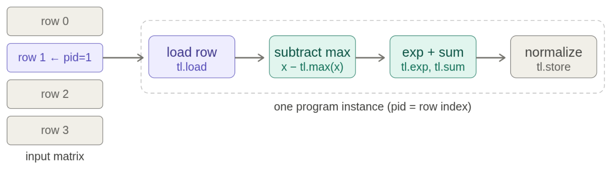
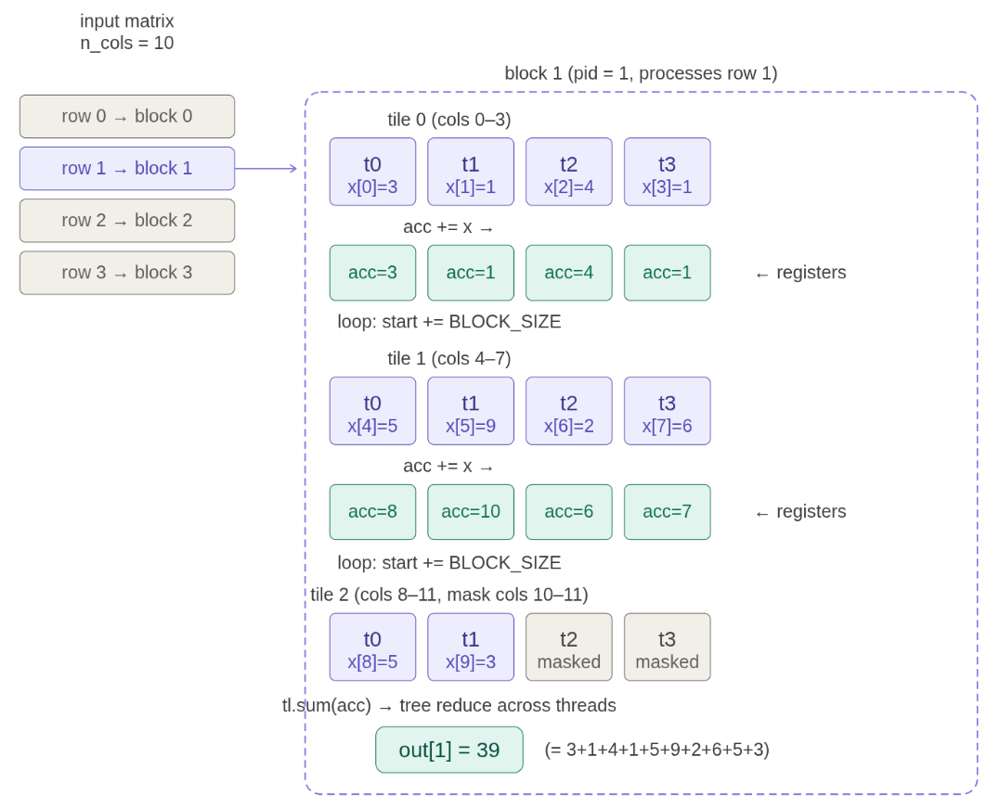

## 1. 为什么需要 Triton？

在 [上一篇文章]() 中，我们讨论了 GPU 的硬件架构和优化技巧。但在实践中，直接写 CUDA kernel 的门槛很高：

- 你需要管理 thread、warp、shared memory 等底层细节；
- 你需要手动处理 memory coalescing、bank conflicts、occupancy 等问题；
- 写出一个高效的矩阵乘法可能需要几百行 CUDA 代码。

**Triton**（由 OpenAI 开发）提供了一种折中方案：它以 **thread block** 为编程单位，而不是单个 thread。你只需要描述每个 block 做什么，Triton 的编译器会负责把它翻译成高效的 PTX 代码。

简单来说：

| | CUDA | Triton |
|---|---|---|
| 编程粒度 | 每个 thread 做什么 | 每个 thread block 做什么 |
| 控制力 | 极细粒度 | 足够强大（尤其入门阶段） |
| 需要手动管理 | shared memory、warp、coalescing... | 大部分由编译器处理 |
| 核心思路 | thread 级逻辑 | **load → compute → store**（把数据读进 shared memory，算，再写回 global memory） |

## 2. 优化铁律：先 Benchmark，再 Profile

在动手写任何 Triton kernel 之前，有一条铁律值得记住：

> 1. Benchmark 和 profile 你的代码
> 2. 做出改动
> 3. 再次 benchmark 和 profile
> 4. 重复……

**Benchmarking** 测量的是端到端的 wall-clock time。它只能告诉你"这段代码花了多长时间"，但不告诉你时间花在了哪里。Benchmarking 的典型用途是：

- 比较不同实现哪个更快（比如 naive vs builtin vs compiled）;
- 观察性能如何随规模变化（比如矩阵维度增大时，时间是线性还是立方增长）。

**Profiling** 则告诉你时间被花在了哪些 kernel 上，让你看到具体的瓶颈在哪里。

### 2.1. Benchmarking：比较不同实现哪个更快

以下用一个矩阵乘法 benchmark 来展示：

```python
import torch

def run_operation2(dim: int, operation):
    """创建两个 dim×dim 随机矩阵，返回一个可调用的操作函数"""
    x = torch.randn(dim, dim, device="cuda")
    y = torch.randn(dim, dim, device="cuda")
    return lambda: operation(x, y)

def benchmark(run, num_warmups: int = 1, num_trials: int = 3) -> float:
    """运行 `run` 多次并返回平均耗时（毫秒）"""

    # 1. Warmup：第一次运行往往偏慢（JIT 编译、缓存未命中），
    #    我们关心的是稳态性能，所以先预热几次
    for _ in range(num_warmups):
        run()
    torch.cuda.synchronize()  # 等待所有 CUDA 线程完成（重要！）

    # 2. 正式计时
    times: list[float] = []
    for trial in range(num_trials):
        # 使用 CUDA Event 获得精确的 GPU 端计时
        # （避免把 CPU 端的 launch overhead 也算进去）
        start_event = torch.cuda.Event(enable_timing=True)
        end_event = torch.cuda.Event(enable_timing=True)

        start_event.record()   # 记录开始时间
        run()                  # 实际执行计算
        end_event.record()     # 记录结束时间

        torch.cuda.synchronize()  # 等待 GPU 完成
        times.append(start_event.elapsed_time(end_event))

    return sum(times) / len(times)

# 对 1024×1024 矩阵乘法做 benchmark
matmul = run_operation2(dim=1024, operation=lambda a, b: a @ b)
avg_time = benchmark(matmul)

# 观察时间随维度的 scaling
for dim in [256, 512, 1024, 2048, 4096, 8192]:
    op = run_operation2(dim=dim, operation=lambda a, b: a @ b)
    t = benchmark(op)
    print(f"dim={dim}: {t:.3f} ms")
```

几个关键点：

- **Warmup**：GPU kernel 第一次启动时可能涉及 JIT 编译和缓存初始化，不预热会导致第一次测量严重偏大；
    ```python
    for _ in range(num_warmups):
        run()
    ```
- **`torch.cuda.synchronize()`**：GPU 执行是异步的——CPU 发出 kernel 指令后不会等 GPU 完成。如果不 synchronize，你测到的只是 CPU 发出指令的时间，不是 GPU 实际计算的时间；
    ```python
    torch.cuda.synchronize()
    ```
- **CUDA Event**：`torch.cuda.Event` 提供 GPU 端的精确时间戳，避免把 CPU 端的 kernel launch overhead 也算进去；
    ```python
    start_event = torch.cuda.Event(enable_timing=True)
    end_event = torch.cuda.Event(enable_timing=True)

    start_event.record()
    run()
    end_event.record()
    ```
- **多次测量**：多次测量取平均，可以观察到是否存在方差（例如某些 kernel 的启动时间不稳定）。

对于矩阵乘法，你会观察到：维度较小时，时间大致恒定（kernel launch overhead 主导）；维度增大后，时间呈**立方增长**（O(N³)：M×K×N，当 M=K=N 时）。

### 2.2. Profiling：看时间花在了哪里

PyTorch 内置了 profiler，可以直接看到底层的 CUDA kernel 调用情况：

```python
from torch.profiler import ProfilerActivity

def profile(run, num_warmups: int = 1):
    for _ in range(num_warmups):
        run()
    torch.cuda.synchronize()

    with torch.profiler.profile(
        activities=[ProfilerActivity.CUDA],
        experimental_config=torch._C._profiler._ExperimentalConfig(verbose=True)
    ) as prof:
        run()
        torch.cuda.synchronize()

    # 按 CUDA 时间排序，显示前 10 个 kernel
    table = prof.key_averages().table(
        sort_by="cuda_time_total",
        max_name_column_width=100,
        row_limit=10
    )
    return table

# 对一个简单的 add 操作做 profile
add_op = run_operation2(dim=2048, operation=lambda a, b: a + b)
print(profile(add_op))

# 对矩阵乘法做 profile
matmul_op = run_operation2(dim=2048, operation=lambda a, b: a @ b)
print(profile(matmul_op))
```

以 `dim=2048` 的矩阵乘法为例，profiler 的实际输出大致如下：

```
                                                                                    Name    Self CPU %      Self CPU   CPU total %     CPU total  CPU time avg     Self CUDA   Self CUDA %    CUDA total  CUDA time avg    # of Calls


cutlass3x_sm100_simt_sgemm_f32_f32_f32_f32_f32_64x64x16_1x1x1_3_nnn_align1_bias_f32_relu         0.00%       0.000us         0.00%       0.000us       0.000us     329.345us       100.00%     329.345us     329.345us             1

                                                                        cuLaunchKernelEx         0.95%      27.515us        99.46%       2.867ms       2.867ms       0.000us         0.00%       0.000us       0.000us             1

                                                                 Activity Buffer Request        98.50%       2.839ms        98.50%       2.839ms       2.839ms       0.000us         0.00%       0.000us       0.000us             1

                                                                   cudaDeviceSynchronize         0.54%      15.626us         0.54%      15.626us       7.813us       0.000us         0.00%       0.000us       0.000us             2

Self CPU time total: 2.883ms
Self CUDA time total: 329.345us
```

观察输出可以发现：

- **整个 matmul 只有一个 CUDA kernel**，所有计算都在这个 kernel 里完成，没有多余的 HBM 读写——这说明 cuBLAS 的实现已经做了很好的 kernel fusion 和 tiling；
- **不同维度可能触发不同的 kernel 实现**：`dim=128` 和 `dim=2048` 的 matmul 可能调用不同名字的 kernel。cuBLAS 会根据矩阵大小、GPU 架构等因素自动选择最优策略（例如 tile 大小会有不同）；
- **CUDA kernel 的名字透露了大量实现细节**。以这个 kernel 名为例：
  - `cutlass3x`：基于 CUTLASS 3.x 库（NVIDIA 的 CUDA 线性代数模板库）；
  - `sm100`：Blackwell 架构（B200）；
  - `simt_sgemm`：SIMT 单精度通用矩阵乘法（sgemm = single-precision general matrix multiply）；
  - `f32_f32_f32_f32_f32`：5 个 float32 精度参数（依次为 A、B、C 和累加器精度等）；
  - `64x64x16`：输出 tile 大小 M=64, N=64, K=16；
  - `1x1x1`：warp 级别的 tile 划分；
  - `3`：可能表示 3 个 stage 的软件流水线；
  - `nnn`：A、B、C 三个矩阵的转置模式，均为 non-transposed（不转置）；
  - `align1`：内存对齐方式；
  - `bias_f32_relu`：支持 float32 bias 和 ReLU 融合——这说明一个 kernel 内完成了 matmul + bias + ReLU 三件事。

### 2.3 一个完整的例子：GeLU 三版本对比

用 benchmarking + profiling 来比较同一个操作的不同实现，是最能说明问题的方式。以 GeLU 激活函数为例：

```python
# 1. Naive PyTorch 实现（非融合，多个独立 kernel）
def naive_gelu(x: torch.Tensor):
    return 0.5 * x * (1 + torch.tanh(0.79788456 * (x + 0.044715 * x * x * x)))

# 2. PyTorch 内置实现（融合 kernel）
def builtin_gelu(x: torch.Tensor):
    return torch.nn.functional.gelu(x, approximate="tanh")

# 3. 用 torch.compile 编译 naive 版本（让编译器尝试融合）
compiled_gelu = torch.compile(naive_gelu)

def run_operation1(dim: int, operation):
    """创建单个 dim×dim 随机矩阵，返回一个可调用的操作函数"""
    x = torch.randn(dim, dim, device="cuda")
    return lambda: operation(x)

# Benchmark
naive_time   = benchmark(run_operation1(dim=16384, operation=naive_gelu))
builtin_time = benchmark(run_operation1(dim=16384, operation=builtin_gelu))
compiled_time = benchmark(run_operation1(dim=16384, operation=compiled_gelu))

print(f"naive_gelu:   {naive_time:.3f} ms")
print(f"builtin_gelu: {builtin_time:.3f} ms")
print(f"compiled_gelu:{compiled_time:.3f} ms")
```

Benchmark 结果（B200, dim=16384）：

```
naive_gelu:   3.758 ms
builtin_gelu: 0.667 ms
compiled_gelu:0.939 ms
```

naive 最慢，是因为其需要不断的从 HBM 读写中间结果；builtin 最快，是因为它把所有操作融合到一个 kernel 内；compiled 版本比 builtin 慢，是因为编译器还不够智能，没能完全融合。

## 3. Triton 编程模型

### 3.1 Triton 简介

CUDA（NVIDIA 开发）和 Triton（OpenAI 开发）的核心区别在于**编程粒度**：

| | CUDA | Triton |
|---|---|---|
| 开发方 | NVIDIA | OpenAI |
| 编程粒度 | 指定每个 **thread** 做什么 | 指定每个 **thread block** 做什么 |
| 优点 | 极细粒度控制 | 足够强大（尤其入门阶段），编译器自动优化 |
| 缺点 | 需要手动管理 shared memory、warp、coalescing 等 | 不如 CUDA 灵活，部分极端优化做不到 |

Triton 的编程框架可以概括为三步：

> **load → compute → store**
>
> 把数据从 HBM 读进 shared memory → 在 shared memory / 寄存器中计算 → 把结果写回 HBM。

### 3.2 Triton：GeLU 实现示例

GeLU 是逐元素操作——每个输出元素只依赖一个输入元素，thread 之间不需要通信。这是最简单的 Triton kernel，完美体现了 "load → compute → store" 的三段式结构。

#### 启动函数

```python
import triton
import triton.language as tl

def triton_gelu(x: torch.Tensor):
    assert x.is_cuda and x.is_contiguous()

    y = torch.empty_like(x)

    num_elements = x.numel()
    BLOCK_SIZE = 1024                         # 每个 block 处理 1024 个元素
    num_blocks = triton.cdiv(num_elements, BLOCK_SIZE)  # 向上取整，确保覆盖所有元素

    # 启动 kernel：(num_blocks,) 是 1D grid，每个 block 有 BLOCK_SIZE 个 thread
    triton_gelu_kernel[(num_blocks,)](x, y, num_elements, BLOCK_SIZE=BLOCK_SIZE)

    return y
```

`(num_blocks,)` 定义了一个 1D grid。对于需要 2D 划分的任务（如矩阵乘法），可以用 `(M, N)` 来定义 2D grid。

#### Kernel 本体

```python
@triton.jit
def triton_gelu_kernel(x_ptr, y_ptr, num_elements, BLOCK_SIZE: tl.constexpr):
    # ===== 1. 计算索引：当前 block 负责哪些元素 =====
    pid = tl.program_id(axis=0)                  # 我是第几个 block？
    start = pid * BLOCK_SIZE                      # 本 block 的起始位置
    offsets = start + tl.arange(0, BLOCK_SIZE)    # 本 block 内每个 thread 的偏移

    mask = offsets < num_elements                 # 防止越界（最后一个 block 可能不满）

    # ===== 2. Load：从 HBM 读取数据 =====
    x = tl.load(x_ptr + offsets, mask=mask)

    # ===== 3. Compute：在寄存器中计算（GELU 的 tanh 近似）=====
    # GELU(x) ≈ 0.5 * x * (1 + tanh(√(2/π) * (x + 0.044715 * x³)))
    a = 0.79788456 * (x + 0.044715 * x * x * x)
    exp = tl.exp(2 * a)
    tanh = (exp - 1) / (exp + 1)
    y = 0.5 * x * (1 + tanh)

    # ===== 4. Store：写回 HBM =====
    tl.store(y_ptr + offsets, y, mask=mask)
```

几个关键点：

- **`tl.program_id(axis=0)`**：当前 block 在第 0 维上的编号。每 block 逻辑完全相同，仅靠 `pid` 区分各自处理的数据段；
- **`tl.arange(0, BLOCK_SIZE)`**：返回 `[0, 1, ..., 1023]`，代表 block 内每个 thread 的相对偏移量——你不需要手动管理 thread，Triton 自动处理；
- **`mask`**：最后一个 block 的数据量可能少于 `BLOCK_SIZE`，mask 保证不会越界读写；
- **`tl.constexpr`**：标记 `BLOCK_SIZE` 为编译时常量，Triton 编译器据此做针对性优化。

#### 编译产物：PTX

Triton 编译后生成 PTX（Parallel Thread Execution）——NVIDIA GPU 的汇编语言。查看 PTX 可以了解编译器做了什么：

```
ld.global.*   ...    # 从 global memory 读取
st.global.*   ...    # 写回 global memory
%ctaid.x      ...    # block index（对应 tl.program_id）
%tid.x        ...    # thread index
%f*           ...    # 浮点寄存器
%r*           ...    # 整数寄存器
```

在这个 GeLU kernel 中，你会看到 Triton 自动做了 **thread coarsening**——一个 thread 处理 8 个元素，以减少指令开销。这些优化不需要你手动写，编译器代劳了。

### 3.3 Triton：Softmax 实现示例（thread 内 reduction）



GeLU 是逐元素操作，每个 thread 独立工作。但 Softmax 需要对整行做 **reduction**（求 max、求和），thread 之间必须协作。

回顾 Softmax：对矩阵每一行做 exp 并归一化——

```
[0 0 0]      →   [1/3 1/3 1/3]
[1 1 -inf]   →   [1/2 1/2   0]
```

#### Naive PyTorch 的读写开销

先看 PyTorch 的 naive 实现：

```python
def naive_softmax(x: torch.Tensor):
    M, N = x.shape
    x_max = x.max(dim=1)[0]              # MN reads,  M writes
    x = x - x_max[:, None]               # MN reads,  MN writes
    numerator = torch.exp(x)             # MN reads,  MN writes
    denominator = numerator.sum(dim=1)   # MN reads,  M writes
    y = numerator / denominator[:, None] # MN reads,  MN writes
    return y
# 总计: 5MN + M 次读, 3MN + 2M 次写
```

理论上 Softmax 只需 MN 次读和 MN 次写。Naive 版本因为每一步都是独立 kernel，中间结果反复进出 HBM，多了大约 4 倍的冗余读写。

#### Triton Kernel（整行放进一个 Block）

当一行能完整放入一个 block（`num_cols <= BLOCK_SIZE`）时，reduction 就很直接——每个 block 处理一行，Triton 自动处理 block 内的线程通信：

```python
@triton.jit
def triton_softmax_kernel(x_ptr, y_ptr, x_row_stride, y_row_stride,
                           num_cols, BLOCK_SIZE: tl.constexpr):
    assert num_cols <= BLOCK_SIZE

    row_idx = tl.program_id(0)                     # 每个 block 处理一行
    col_offsets = tl.arange(0, BLOCK_SIZE)

    # 1. Load：把整行读入寄存器
    x_row = tl.load(x_ptr + row_idx * x_row_stride + col_offsets,
                    mask=col_offsets < num_cols, other=float("-inf"))

    # 2. Compute：block 内 reduction（Triton 自动处理线程间的 warp shuffle / shared memory）
    x_row = x_row - tl.max(x_row, axis=0)          # 减去最大值（数值稳定）
    numerator = tl.exp(x_row)
    denominator = tl.sum(numerator, axis=0)         # block 内求和
    y_row = numerator / denominator

    # 3. Store：写回 HBM
    tl.store(y_ptr + row_idx * y_row_stride + col_offsets,
             y_row, mask=col_offsets < num_cols)
```

关键点：

- **`other=float("-inf")`**：mask 之外的填充值。用 `-inf` 让这些位置在 `exp` 后自然变成 0，不影响 softmax 结果；
- **`tl.max(..., axis=0)` / `tl.sum(..., axis=0)`**：block 级别的 reduction，Triton 编译器会自动生成 warp shuffle 或 shared memory 来交换数据——你不需要手动写 shuffle 指令；
- **每个 block 处理一行**：`program_id(0)` 就是行号，天然并行——有多少行就启动多少个 block。

GeLU 展示了 **elementwise** 的 load→compute→store，Softmax 在此基础上多了 **block 内 reduction**，但整体框架仍然一样。

### 3.4 Triton：Row Sum 实现示例（跨 Tile Reduction）



Softmax 的前提是"一行能放进一个 block"（`num_cols <= BLOCK_SIZE`）。但如果一行有 4096 列，而 `BLOCK_SIZE = 1024`，一行装不下怎么办？

**策略**：把行切成多个 tile，每个 thread 遍历所有 tile，在自己的寄存器中累加部分和，最后做一次 block 内 reduction 得到最终结果。

```
一行 4096 列，BLOCK_SIZE = 1024：
| Tile 0 (cols 0..1023) | Tile 1 (cols 1024..2047) | Tile 2 (cols 2048..3071) | Tile 3 (cols 3072..4095) |

每个 thread：acc = 0 → 加 tile0 → 加 tile1 → 加 tile2 → 加 tile3 → 最终 reduction
```

#### Kernel 实现

```python
@triton.jit
def row_sum_kernel(x_ptr, out_ptr, N, BLOCK_SIZE: tl.constexpr):
    row = tl.program_id(0)                            # 每个 block 处理一行

    # 每个 thread 维护自己的累加器 [BLOCK_SIZE]
    acc = tl.zeros([BLOCK_SIZE], dtype=tl.float32)

    # 1. Load + Accumulate：遍历所有 tile
    for start in range(0, N, BLOCK_SIZE):
        cols = start + tl.arange(0, BLOCK_SIZE)
        mask = cols < N                               # 最后一个 tile 可能不满
        x = tl.load(x_ptr + row * N + cols, mask=mask, other=0.0)
        acc += x                                      # 在寄存器中累加

    # 2. Reduce：BLOCK_SIZE 个部分和 → 1 个标量
    result = tl.sum(acc, axis=0)

    # 3. Store
    tl.store(out_ptr + row, result)
```

调用方式：

```python
def triton_row_sum(x: torch.Tensor, BLOCK_SIZE: int = 1024) -> torch.Tensor:
    M, N = x.shape
    y = torch.empty(M, device=x.device, dtype=x.dtype)
    row_sum_kernel[(M,)](x, y, N, BLOCK_SIZE=BLOCK_SIZE)
    return y
```

#### 关键点

- **`for start in range(0, N, BLOCK_SIZE)`**：循环遍历 tile，每次迭代从 HBM 读一块、累加到寄存器。这是跨 tile reduction 的核心机制——数据被分批读入，部分和留在寄存器中；
- **`acc = tl.zeros([BLOCK_SIZE])`**：每个 thread 分配一个累加器。不是共享的——每个 thread 独立累加自己负责的那部分数据；
- **两次 reduction**：第一次是隐式的——每个 thread 自己的 `acc += x` 在寄存器中完成（每 tile 一次）；第二次是显式的——`tl.sum(acc, axis=0)` 把 BLOCK_SIZE 个 thread 的部分和合并成一个标量。

这其实就是矩阵乘法 tiling 的"婴儿版"——把数据切块、循环加载、在寄存器中累积、最后合并。接下来把一维的 `for` 循环扩展到二维，就是 tiled 矩阵乘法。

### 3.5 Triton：矩阵乘法 + ReLU（二维 Tiling + Kernel Fusion）

矩阵乘法是深度学习的核心操作。`C = A @ B`，A 是 M×K，B 是 K×N。

**朴素方法**（不考虑 tiling）：

- 固定输出位置 (m, n)，遍历 k：读 A[m, k]、读 B[k, n]、乘累加、写 C[m, n]
- 总访问：M×K×N 次 HBM 读，M×N 次写
- 算术强度：O(1)——几乎一定是 **memory-bound**

**理想方法**（A 和 B 全放进 shared memory）：

- 总访问：M×K + K×N 次读，M×N 次写
- 算术强度：O(N)
- 问题：A 和 B 太大，shared memory 装不下

**Tiling（折中）**：

- 把 C 分成输出 tile（每个 tile 对应一个 thread block）
- 对于每个输出 tile，沿 K 方向循环：
  1. 读 A 的行 tile 和 B 的列 tile 到 shared memory
  2. 在 tile 上做矩阵乘法（`tl.dot`，利用 Tensor Core）
  3. 累加到 partial sum
- 写回输出 tile
- 算术强度：O(tile_size)


在此基础上，如果还需要 ReLU，可以**直接融合进同一个 kernel**，省去一次额外的 HBM 读写。

#### 启动函数

先回顾一个细节：矩阵在内存中是线性化存储的。`stride_row` 和 `stride_col` 决定了如何从 (row, col) 算出线性索引：

```python
x = torch.tensor([[0., 1, 2, 3],
                  [4, 5, 6, 7]])   # 2×4, row-major: stride_row=4, stride_col=1
# x[1][2] = x_ptr + 1*4 + 2*1 = 6
```

```python
def triton_matmul_relu(a: torch.Tensor, b: torch.Tensor):
    assert a.is_cuda and b.is_cuda
    assert a.shape[1] == b.shape[0]

    M, K = a.shape
    K, N = b.shape
    c = torch.empty((M, N), device=a.device)

    # Tile 尺寸
    BLOCK_M, BLOCK_N, BLOCK_K = 64, 64, 32

    # 2D grid：每个 block 负责 C 的一个输出 tile
    grid = (triton.cdiv(M, BLOCK_M), triton.cdiv(N, BLOCK_N))

    matmul_relu_kernel[grid](
        a, b, c,
        M, N, K,
        a.stride(0), a.stride(1),
        b.stride(0), b.stride(1),
        c.stride(0), c.stride(1),
        BLOCK_M=BLOCK_M, BLOCK_N=BLOCK_N, BLOCK_K=BLOCK_K,
    )
    return c
```

这里用的是 **2D grid**：`program_id(0)` 选择 C 的行 tile，`program_id(1)` 选择 C 的列 tile。

#### Kernel 本体

```python
@triton.jit
def matmul_relu_kernel(
    a_ptr, b_ptr, c_ptr,
    M, N, K,
    stride_am, stride_ak,     # A 的行 stride 和列 stride
    stride_bk, stride_bn,     # B 的行 stride 和列 stride
    stride_cm, stride_cn,     # C 的行 stride 和列 stride
    BLOCK_M: tl.constexpr, BLOCK_N: tl.constexpr, BLOCK_K: tl.constexpr,
):
    # 当前 block 负责 C 的第 (pid_m, pid_n) 个 tile
    pid_m = tl.program_id(0)
    pid_n = tl.program_id(1)

    # 索引范围
    indices_m = pid_m * BLOCK_M + tl.arange(0, BLOCK_M)   # [BLOCK_M]
    indices_n = pid_n * BLOCK_N + tl.arange(0, BLOCK_N)   # [BLOCK_N]
    indices_k = tl.arange(0, BLOCK_K)                      # [BLOCK_K]

    # 初始指针：A 的行 tile，B 的列 tile
    a_ptrs = (a_ptr + indices_m[:, None] * stride_am
                    + indices_k[None, :] * stride_ak)      # [BLOCK_M, BLOCK_K]
    b_ptrs = (b_ptr + indices_k[:, None] * stride_bk
                    + indices_n[None, :] * stride_bn)      # [BLOCK_K, BLOCK_N]

    # 累加器（在寄存器中）
    acc = tl.zeros([BLOCK_M, BLOCK_N], dtype=tl.float32)

    # 1. Load + Compute：沿 K 方向遍历 tile
    for k in range(0, K, BLOCK_K):
        a = tl.load(a_ptrs,
                    mask=(indices_m[:, None] < M) & (indices_k[None, :] + k < K),
                    other=0.0)
        b = tl.load(b_ptrs,
                    mask=(indices_k[:, None] + k < K) & (indices_n[None, :] < N),
                    other=0.0)

        acc += tl.dot(a, b)                       # Tensor Core 加速

        a_ptrs += BLOCK_K * stride_ak             # 前进到下一个行 tile
        b_ptrs += BLOCK_K * stride_bk             # 前进到下一个列 tile

    # 2. Kernel Fusion：ReLU
    acc = tl.maximum(acc, 0.0)

    # 3. Store：写回输出 tile
    c_ptrs = (c_ptr + indices_m[:, None] * stride_cm
                    + indices_n[None, :] * stride_cn)
    tl.store(c_ptrs, acc,
             mask=(indices_m[:, None] < M) & (indices_n[None, :] < N))
```

#### 关键点

- **2D grid**：`program_id(0)` 和 `program_id(1)` 分别对应输出 tile 的行和列，与 GeLU/Softmax 的 1D 不同；
- **`tl.dot(a, b)`**：Triton 的矩阵乘法原语，编译器自动映射到 Tensor Core，不需要手动调用 MMA 指令；
- **沿 K 方向的 `for` 循环**：和 Row Sum 中的 `for start in range(0, N, BLOCK_SIZE)` 是同一个思路——Row Sum 是一维切分，矩阵乘法是二维切分（A 的行 tile × B 的列 tile）；
- **`[:, None]` 和 `[None, :]`**：广播语义，用于构造 2D 指针矩阵。`[BLOCK_M] + [BLOCK_K]` → `[BLOCK_M, BLOCK_K]`；
- **Kernel Fusion**：在 `tl.dot` 之后直接 `tl.maximum(acc, 0.0)`，把 ReLU 融合进同一个 kernel。如果分开写，`a @ b` 写回 HBM、再读出来做 ReLU、再写回，多出两次 HBM 访问。

## 4. 总结

- 理解编程模型（PyTorch、Triton、PTX），保证程序正确性；
- 理解硬件（SM、warp、occupancy、bank conflict 等），才能优化性能；
- Benchmark 帮助你理解 scaling；
- Profile 让你看到什么被执行了、花了多少时间；
- Triton 的核心：以 thread block 为单位思考（读入 shared memory → 计算（fusion）→ 写回 HBM）；
- 四个例子：GeLU（逐元素）、Softmax（行级 reduction）、Row Sum（初探 tiling）、矩阵乘法（完整 tiling）。

---

## 参考文献

[1] Stanford CS336, "Lecture 6 - Benchmarking, Profiling, and Writing Kernels," Spring 2026. [Online]. Available: https://cs336.stanford.edu/lectures/?trace=lecture_06.

[2] Triton Documentation, "Fused Softmax Tutorial." [Online]. Available: https://triton-lang.org/main/getting-started/tutorials/02-fused-softmax.html.
